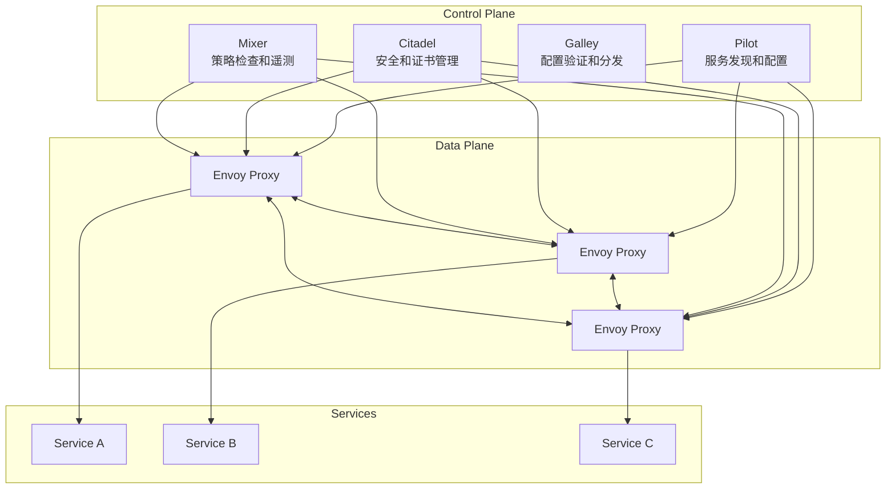

# Istio 核心概念

## 项目概述

Istio 是一个开源的服务网格（Service Mesh），为微服务架构提供统一的连接、安全、控制和观察能力。它在不修改应用程序代码的情况下，为分布式应用程序提供网络功能，包括流量管理、安全策略、可观测性等。

## 核心价值

Istio 解决了微服务架构中的核心问题：

- **服务间通信复杂性**：统一管理服务间的网络通信
- **安全挑战**：提供零信任网络安全模型
- **可观测性缺失**：自动收集指标、日志和分布式追踪
- **流量管理困难**：精细化的流量路由和负载均衡
- **策略执行**：统一的访问控制和配额管理

## 整体架构图



## 组件分类

### 控制平面组件
- **Pilot**：服务发现和流量管理
- **Citadel**：身份和证书管理
- **Galley**：配置验证和分发
- **Mixer**：策略检查和遥测收集

### 数据平面组件
- **Envoy Proxy**：智能代理，处理服务间通信

### 流量管理资源
- **VirtualService**：定义流量路由规则
- **DestinationRule**：定义目标服务策略
- **Gateway**：管理进出网格的流量
- **ServiceEntry**：添加外部服务到网格

### 安全资源
- **Policy**：访问控制策略
- **AuthorizationPolicy**：授权策略
- **PeerAuthentication**：对等身份验证
- **RequestAuthentication**：请求身份验证

### 网络资源
- **Sidecar**：配置代理行为
- **WorkloadEntry**：添加非 Kubernetes 工作负载
- **EnvoyFilter**：自定义 Envoy 配置

### 扩展资源
- **Telemetry**：遥测配置
- **WasmPlugin**：WebAssembly 插件

## 核心概念索引

| 概念/资源名称 | 功能描述 | 作用域/适用场景 | 详细文档 |
|--------------|----------|----------------|----------|
| VirtualService | 定义HTTP/TCP流量的路由规则 | 流量管理、A/B测试、金丝雀发布 | [virtual-service.md](./virtual-service.md) |
| DestinationRule | 定义目标服务的负载均衡、连接池等策略 | 服务级别的流量策略 | [destination-rule.md](./destination-rule.md) |
| Gateway | 配置负载均衡器以接收进入或离开网格的HTTP/TCP连接 | 南北向流量管理 | [gateway.md](./gateway.md) |
| ServiceEntry | 将外部服务添加到Istio的内部服务注册表 | 访问外部服务 | [service-entry.md](./service-entry.md) |
| Sidecar | 配置代理的资源消耗和可达性 | 优化代理性能 | [sidecar.md](./sidecar.md) |
| WorkloadEntry | 描述非Kubernetes工作负载的属性 | 混合环境集成 | [workload-entry.md](./workload-entry.md) |
| AuthorizationPolicy | 定义访问控制策略 | 服务间访问控制 | [authorization-policy.md](./authorization-policy.md) |
| PeerAuthentication | 配置服务间的身份验证 | mTLS配置 | [peer-authentication.md](./peer-authentication.md) |
| RequestAuthentication | 配置最终用户身份验证 | JWT令牌验证 | [request-authentication.md](./request-authentication.md) |
| EnvoyFilter | 自定义Envoy代理的配置 | 高级定制化需求 | [envoy-filter.md](./envoy-filter.md) |
| Telemetry | 配置遥测数据收集 | 指标、日志、追踪配置 | [telemetry.md](./telemetry.md) |
| WasmPlugin | 配置WebAssembly插件 | 扩展代理功能 | [wasm-plugin.md](./wasm-plugin.md) |

## 学习路径建议

### 初学者路径
1. 了解服务网格基本概念
2. 学习 [Gateway](./gateway.md) 和 [VirtualService](./virtual-service.md)
3. 掌握 [DestinationRule](./destination-rule.md) 的基本用法
4. 了解 [ServiceEntry](./service-entry.md) 的外部服务集成

### 进阶路径
1. 深入学习安全相关资源：[AuthorizationPolicy](./authorization-policy.md)、[PeerAuthentication](./peer-authentication.md)
2. 学习高级流量管理：[Sidecar](./sidecar.md)、[WorkloadEntry](./workload-entry.md)
3. 掌握可观测性配置：[Telemetry](./telemetry.md)
4. 学习高级定制：[EnvoyFilter](./envoy-filter.md)、[WasmPlugin](./wasm-plugin.md)

## 版本兼容性

本文档基于 Istio 1.19+ 版本编写，不同版本间可能存在API差异，请参考对应版本的官方文档。

## 快速参考

### 常用命令
```bash
# 查看所有Istio配置
kubectl get istio-io -A

# 查看特定资源
kubectl get virtualservice
kubectl get destinationrule
kubectl get gateway

# 检查配置状态
istioctl analyze
```

### 常用标签
```yaml
# 版本标签
version: v1

# 应用标签
app: reviews

# Istio注入标签
istio-injection: enabled
