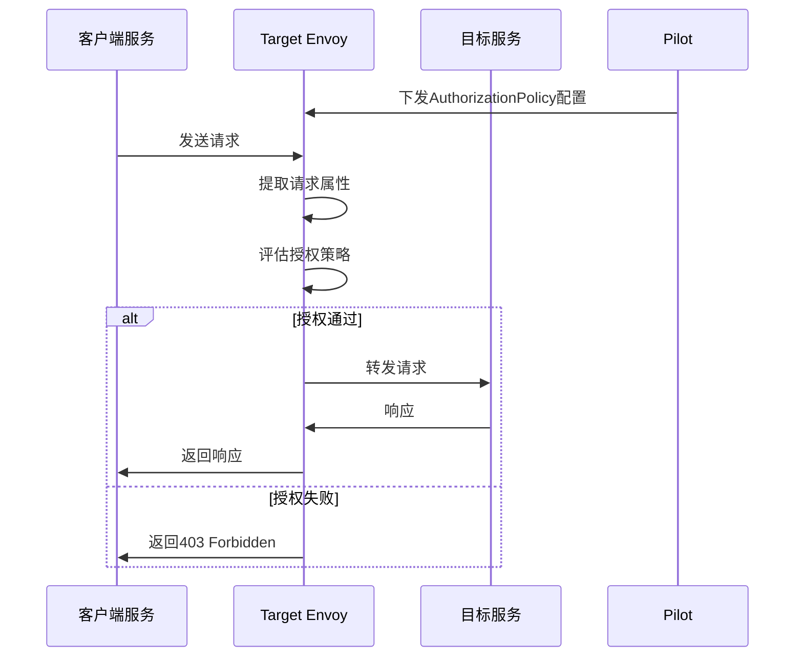
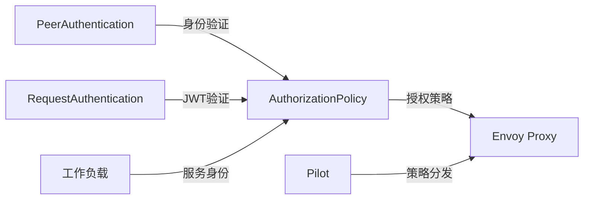
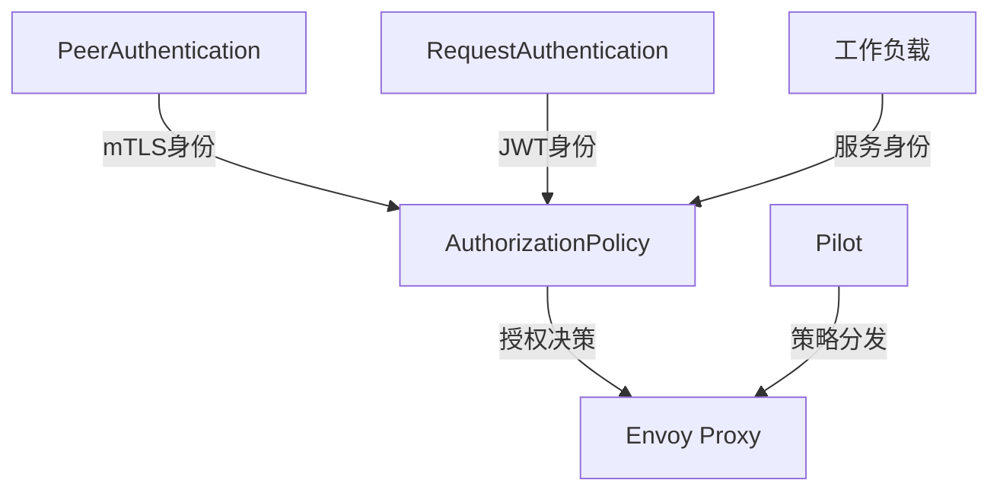

# AuthorizationPolicy

## 概述

AuthorizationPolicy 是 Istio 中用于定义访问控制策略的安全资源。它提供命名空间级、服务级和方法级的访问控制，支持基于身份、请求属性、自定义条件等多种授权模式。AuthorizationPolicy 是实现零信任网络安全模型的核心组件。

### 定义和用途
- **访问控制**：定义服务间的访问权限和策略
- **身份验证**：基于服务身份进行授权决策
- **请求授权**：根据请求属性（headers、路径等）进行授权
- **细粒度控制**：支持方法级和路径级的精细授权
- **安全策略**：实现企业级的安全策略和合规要求

### 解决的问题
- **未授权访问**：防止未经授权的服务访问
- **权限管理**：统一管理服务间的访问权限
- **安全合规**：满足企业安全和合规要求
- **攻击防护**：防范内部网络的恶意攻击
- **审计追踪**：提供访问控制的审计日志

### 使用场景
- 微服务间的访问控制
- 敏感服务的安全防护
- 多租户环境的权限隔离
- API 接口的访问控制
- 企业安全策略的实施

## 核心特性

### 主要功能特点
- **RBAC 支持**：基于角色的访问控制
- **属性授权**：基于请求属性的动态授权
- **身份验证**：与 Istio 身份验证系统集成
- **灵活的规则**：支持 ALLOW 和 DENY 策略
- **层级控制**：支持命名空间、服务、方法多级控制

### 技术优势
- **零信任模型**：默认拒绝，显式允许的安全模型
- **细粒度控制**：提供方法级的访问控制
- **动态策略**：支持基于请求上下文的动态授权
- **无侵入性**：无需修改应用程序代码
- **高性能**：在 Envoy 代理层面进行快速决策

### 限制和注意事项
- **策略复杂性**：复杂的授权规则可能难以管理
- **性能影响**：大量规则可能影响请求延迟
- **调试困难**：授权失败的原因可能不易诊断
- **配置错误风险**：错误配置可能导致服务不可用

## 工作原理

### 内部机制说明

AuthorizationPolicy 通过 Pilot 组件将策略转换为 Envoy RBAC 过滤器配置。当请求到达目标服务时，Envoy 代理根据配置的授权策略进行访问控制决策，允许或拒绝请求。

### 数据流程图



### 与其他组件的交互关系



## 配置和使用

### 基础配置

#### 最小可用配置示例

```yaml
apiVersion: security.istio.io/v1beta1
kind: AuthorizationPolicy
metadata:
  name: allow-nothing
  namespace: production
spec:
  # 空的规则表示拒绝所有访问
```

```yaml
apiVersion: security.istio.io/v1beta1
kind: AuthorizationPolicy
metadata:
  name: allow-all
  namespace: production
spec:
  rules:
  - {}                              # 空规则表示允许所有访问
```

#### 参数说明

| 参数 | 类型 | 必填 | 描述 | 默认值 |
|------|------|------|------|--------|
| `selector` | WorkloadSelector | 否 | 工作负载选择器 | 所有工作负载 |
| `rules` | Rule[] | 否 | 授权规则列表 | 拒绝所有 |
| `action` | Action | 否 | 策略动作 | ALLOW |

#### Rule 配置说明

| 参数 | 类型 | 必填 | 描述 | 默认值 |
|------|------|------|------|--------|
| `from` | Source[] | 否 | 请求来源条件 | 无 |
| `to` | Operation[] | 否 | 目标操作条件 | 无 |
| `when` | Condition[] | 否 | 自定义条件 | 无 |

#### 默认值和推荐值

- **action**: 默认为 `ALLOW`，也可以设置为 `DENY`
- **策略组合**: 建议使用最小权限原则
- **规则顺序**: DENY 规则优先于 ALLOW 规则

### 高级配置

#### 生产环境配置

```yaml
apiVersion: security.istio.io/v1beta1
kind: AuthorizationPolicy
metadata:
  name: productpage-authz
  namespace: production
spec:
  selector:
    matchLabels:
      app: productpage
  action: ALLOW
  rules:
  # 允许来自同一命名空间的服务访问
  - from:
    - source:
        namespaces: ["production"]
    to:
    - operation:
        methods: ["GET", "POST"]
        paths: ["/productpage", "/api/*"]
  
  # 允许来自网关的访问
  - from:
    - source:
        principals: ["cluster.local/ns/istio-system/sa/istio-ingressgateway-service-account"]
    to:
    - operation:
        methods: ["GET"]
        paths: ["/productpage"]
  
  # 允许健康检查
  - from:
    - source:
        namespaces: ["istio-system"]
    to:
    - operation:
        methods: ["GET"]
        paths: ["/health", "/ready"]
---
# 拒绝策略，阻止敏感路径访问
apiVersion: security.istio.io/v1beta1
kind: AuthorizationPolicy
metadata:
  name: deny-admin-access
  namespace: production
spec:
  selector:
    matchLabels:
      app: productpage
  action: DENY
  rules:
  - to:
    - operation:
        paths: ["/admin/*", "/debug/*"]
    when:
    - key: source.namespace
      notValues: ["admin-namespace"]
```

#### 基于身份的授权

```yaml
apiVersion: security.istio.io/v1beta1
kind: AuthorizationPolicy
metadata:
  name: service-to-service-authz
  namespace: production
spec:
  selector:
    matchLabels:
      app: ratings
  action: ALLOW
  rules:
  # 只允许reviews服务访问
  - from:
    - source:
        principals: ["cluster.local/ns/production/sa/reviews"]
    to:
    - operation:
        methods: ["GET", "POST"]
  
  # 允许管理员服务访问所有方法
  - from:
    - source:
        principals: ["cluster.local/ns/production/sa/admin"]
    to:
    - operation:
        methods: ["*"]
---
apiVersion: security.istio.io/v1beta1
kind: AuthorizationPolicy
metadata:
  name: external-user-authz
  namespace: production
spec:
  selector:
    matchLabels:
      app: frontend
  action: ALLOW
  rules:
  # 基于JWT claims的授权
  - from:
    - source:
        requestPrincipals: ["*"]  # 需要有效的JWT token
    to:
    - operation:
        methods: ["GET", "POST"]
    when:
    - key: request.auth.claims[role]
      values: ["user", "premium"]
  
  # 管理员角色可以访问所有接口
  - from:
    - source:
        requestPrincipals: ["*"]
    to:
    - operation:
        methods: ["*"]
    when:
    - key: request.auth.claims[role]
      values: ["admin"]
```

#### 基于请求属性的授权

```yaml
apiVersion: security.istio.io/v1beta1
kind: AuthorizationPolicy
metadata:
  name: request-based-authz
  namespace: production
spec:
  selector:
    matchLabels:
      app: api-gateway
  action: ALLOW
  rules:
  # 基于IP地址的访问控制
  - from:
    - source:
        ipBlocks: ["10.0.0.0/8", "192.168.0.0/16"]
    to:
    - operation:
        methods: ["GET", "POST"]
  
  # 基于请求头的访问控制
  - to:
    - operation:
        methods: ["GET"]
    when:
    - key: request.headers[x-api-key]
      values: ["valid-api-key-1", "valid-api-key-2"]
  
  # 基于时间的访问控制
  - to:
    - operation:
        methods: ["POST", "PUT", "DELETE"]
    when:
    - key: request.time.hour
      values: ["9", "10", "11", "12", "13", "14", "15", "16", "17"]
  
  # 基于用户代理的访问控制
  - to:
    - operation:
        methods: ["GET"]
    when:
    - key: request.headers[user-agent]
      notValues: ["bot", "crawler", "spider"]
---
# 地理位置基础的访问控制
apiVersion: security.istio.io/v1beta1
kind: AuthorizationPolicy
metadata:
  name: geo-based-authz
  namespace: production
spec:
  selector:
    matchLabels:
      app: payment-service
  action: DENY
  rules:
  # 拒绝来自特定国家的访问
  - when:
    - key: source.ip
      values: ["country:CN", "country:RU"]  # 示例：限制特定国家
  
  # 拒绝可疑的用户代理
  - when:
    - key: request.headers[user-agent]
      values: ["*bot*", "*crawler*", "*scanner*"]
```

#### 多租户授权策略

```yaml
apiVersion: security.istio.io/v1beta1
kind: AuthorizationPolicy
metadata:
  name: tenant-isolation
  namespace: multi-tenant
spec:
  selector:
    matchLabels:
      app: shared-service
  action: ALLOW
  rules:
  # 租户A只能访问自己的数据
  - from:
    - source:
        principals: ["cluster.local/ns/tenant-a/sa/*"]
    to:
    - operation:
        methods: ["GET", "POST", "PUT", "DELETE"]
        paths: ["/api/tenant-a/*"]
    when:
    - key: request.headers[x-tenant-id]
      values: ["tenant-a"]
  
  # 租户B只能访问自己的数据
  - from:
    - source:
        principals: ["cluster.local/ns/tenant-b/sa/*"]
    to:
    - operation:
        methods: ["GET", "POST", "PUT", "DELETE"]
        paths: ["/api/tenant-b/*"]
    when:
    - key: request.headers[x-tenant-id]
      values: ["tenant-b"]
  
  # 超级管理员可以访问所有租户数据
  - from:
    - source:
        principals: ["cluster.local/ns/admin/sa/super-admin"]
    to:
    - operation:
        methods: ["*"]
        paths: ["/api/*"]
```

## 使用示例

### 基础使用场景

#### 1. 默认拒绝策略

```yaml
apiVersion: security.istio.io/v1beta1
kind: AuthorizationPolicy
metadata:
  name: default-deny
  namespace: secure
spec:
  # 空的spec表示拒绝所有访问，实现默认拒绝
```

**预期结果**: secure 命名空间中的所有服务默认无法被访问。

#### 2. 服务间访问控制

```yaml
apiVersion: security.istio.io/v1beta1
kind: AuthorizationPolicy
metadata:
  name: reviews-access
  namespace: default
spec:
  selector:
    matchLabels:
      app: reviews
  action: ALLOW
  rules:
  - from:
    - source:
        principals: ["cluster.local/ns/default/sa/productpage"]
    to:
    - operation:
        methods: ["GET"]
```

**预期结果**: 只有 productpage 服务可以通过 GET 方法访问 reviews 服务。

#### 3. 基于路径的访问控制

```yaml
apiVersion: security.istio.io/v1beta1
kind: AuthorizationPolicy
metadata:
  name: api-path-control
  namespace: default
spec:
  selector:
    matchLabels:
      app: api-service
  action: ALLOW
  rules:
  - to:
    - operation:
        methods: ["GET"]
        paths: ["/public/*", "/health"]
  - from:
    - source:
        principals: ["cluster.local/ns/default/sa/authenticated-user"]
    to:
    - operation:
        methods: ["GET", "POST"]
        paths: ["/private/*"]
```

**预期结果**: 公共路径可以被任何人访问，私有路径需要认证。

### 高级使用场景

#### 1. 基于JWT的细粒度授权

```yaml
apiVersion: security.istio.io/v1beta1
kind: RequestAuthentication
metadata:
  name: jwt-auth
  namespace: production
spec:
  selector:
    matchLabels:
      app: api-gateway
  jwtRules:
  - issuer: "https://accounts.google.com"
    jwksUri: "https://www.googleapis.com/oauth2/v3/certs"
---
apiVersion: security.istio.io/v1beta1
kind: AuthorizationPolicy
metadata:
  name: jwt-based-authz
  namespace: production
spec:
  selector:
    matchLabels:
      app: api-gateway
  action: ALLOW
  rules:
  # 用户角色可以访问基本API
  - from:
    - source:
        requestPrincipals: ["*"]
    to:
    - operation:
        methods: ["GET"]
        paths: ["/api/v1/users/*", "/api/v1/profile"]
    when:
    - key: request.auth.claims[role]
      values: ["user"]
  
  # 管理员角色可以访问所有API
  - from:
    - source:
        requestPrincipals: ["*"]
    to:
    - operation:
        methods: ["*"]
        paths: ["/api/*"]
    when:
    - key: request.auth.claims[role]
      values: ["admin"]
  
  # 特定用户可以访问自己的数据
  - from:
    - source:
        requestPrincipals: ["*"]
    to:
    - operation:
        methods: ["GET", "PUT"]
        paths: ["/api/v1/users/{user_id}"]
    when:
    - key: request.auth.claims[sub]
      values: ["{user_id}"]
```

**预期结果**: 基于JWT claims实现细粒度的API访问控制。

#### 2. 时间和条件基础的访问控制

```yaml
apiVersion: security.istio.io/v1beta1
kind: AuthorizationPolicy
metadata:
  name: time-based-access
  namespace: production
spec:
  selector:
    matchLabels:
      app: batch-service
  action: ALLOW
  rules:
  # 只在工作时间允许交互式访问
  - from:
    - source:
        principals: ["cluster.local/ns/production/sa/interactive-user"]
    to:
    - operation:
        methods: ["GET", "POST"]
    when:
    - key: request.time.hour
      values: ["9", "10", "11", "12", "13", "14", "15", "16", "17"]
    - key: request.time.day_of_week
      values: ["1", "2", "3", "4", "5"]  # 周一到周五
  
  # 批处理作业可以在任何时间访问
  - from:
    - source:
        principals: ["cluster.local/ns/production/sa/batch-job"]
    to:
    - operation:
        methods: ["POST"]
        paths: ["/batch/*"]
```

**预期结果**: 实现基于时间的访问控制策略。

#### 3. 分层安全策略

```yaml
# 命名空间级别的默认策略
apiVersion: security.istio.io/v1beta1
kind: AuthorizationPolicy
metadata:
  name: namespace-default
  namespace: production
spec:
  action: ALLOW
  rules:
  - from:
    - source:
        namespaces: ["production", "istio-system"]
    to:
    - operation:
        methods: ["GET", "POST"]
---
# 服务级别的严格策略
apiVersion: security.istio.io/v1beta1
kind: AuthorizationPolicy
metadata:
  name: database-strict
  namespace: production
spec:
  selector:
    matchLabels:
      app: database
  action: ALLOW
  rules:
  - from:
    - source:
        principals: [
          "cluster.local/ns/production/sa/api-service",
          "cluster.local/ns/production/sa/batch-service"
        ]
    to:
    - operation:
        methods: ["GET", "POST", "PUT"]
---
# 方法级别的限制策略
apiVersion: security.istio.io/v1beta1
kind: AuthorizationPolicy
metadata:
  name: admin-operations
  namespace: production
spec:
  selector:
    matchLabels:
      app: database
  action: DENY
  rules:
  - to:
    - operation:
        methods: ["DELETE"]
    when:
    - key: source.principal
      notValues: ["cluster.local/ns/production/sa/admin"]
```

**预期结果**: 实现多层次的安全策略，从宽松到严格逐层加强。

#### 4. 动态策略与A/B测试

```yaml
apiVersion: security.istio.io/v1beta1
kind: AuthorizationPolicy
metadata:
  name: ab-testing-authz
  namespace: production
spec:
  selector:
    matchLabels:
      app: recommendation-service
      version: v2
  action: ALLOW
  rules:
  # 只允许测试用户访问v2版本
  - from:
    - source:
        requestPrincipals: ["*"]
    to:
    - operation:
        methods: ["GET"]
    when:
    - key: request.auth.claims[beta_user]
      values: ["true"]
  
  # 或者基于特定的用户ID
  - from:
    - source:
        requestPrincipals: ["*"]
    to:
    - operation:
        methods: ["GET"]
    when:
    - key: request.auth.claims[user_id]
      values: ["user123", "user456", "user789"]
---
# v1版本的策略（允许所有用户）
apiVersion: security.istio.io/v1beta1
kind: AuthorizationPolicy
metadata:
  name: stable-version-authz
  namespace: production
spec:
  selector:
    matchLabels:
      app: recommendation-service
      version: v1
  action: ALLOW
  rules:
  - {}  # 允许所有访问
```

**预期结果**: 实现基于用户身份的A/B测试访问控制。

## 故障排除

### 常见错误和解决方法

#### 1. 授权被拒绝（403 Forbidden）

**症状**: 请求返回 403 Forbidden 错误

**可能原因**:
- 没有匹配的 ALLOW 规则
- 存在匹配的 DENY 规则
- 身份验证失败
- 条件不满足

**解决方法**:
```bash
# 检查AuthorizationPolicy配置
kubectl get authorizationpolicy -n production

# 查看具体策略内容
kubectl get authorizationpolicy productpage-authz -o yaml

# 检查服务身份
kubectl get pods productpage-v1-123456 -o yaml | grep serviceAccount

# 查看访问日志
kubectl logs productpage-v1-123456 -c istio-proxy | grep "access_log"

# 检查Envoy RBAC配置
istioctl proxy-config rbac productpage-v1-123456.production
```

#### 2. 策略不生效

**症状**: 配置了 AuthorizationPolicy 但访问控制没有生效

**解决方法**:
```bash
# 验证策略语法
istioctl validate -f authorization-policy.yaml

# 检查策略分发状态
istioctl proxy-status

# 查看Pilot日志
kubectl logs -n istio-system -l app=istiod | grep authz

# 检查工作负载选择器
kubectl get pods -l app=productpage --show-labels
```

#### 3. mTLS相关问题

**症状**: 基于身份的授权失败

**解决方法**:
```bash
# 检查mTLS状态
istioctl authn tls-check productpage-v1-123456.production

# 查看证书信息
istioctl proxy-config secret productpage-v1-123456.production

# 检查PeerAuthentication配置
kubectl get peerauthentication -n production
```

#### 4. JWT认证问题

**症状**: 基于JWT的授权失败

**解决方法**:
```bash
# 检查RequestAuthentication配置
kubectl get requestauthentication -n production

# 验证JWT token
echo "JWT_TOKEN" | base64 -d

# 查看JWT验证日志
kubectl logs productpage-v1-123456 -c istio-proxy | grep jwt
```

### 调试技巧

#### 1. 启用详细日志

```bash
# 启用授权日志
kubectl patch configmap istio -n istio-system --type merge -p '{"data":{"mesh":"defaultConfig:\n  proxyStatsMatcher:\n    exclusionRegexps:\n    - \".*osconfig_fail_open.*\"\n  extensionProviders:\n  - name: authz\n    configSource:\n      ads: {}\n    service: ext-authz.authz-ns.svc.cluster.local\n    port: 9000"}}'

# 查看详细的授权日志
kubectl logs productpage-v1-123456 -c istio-proxy --tail=100 | grep authz
```

#### 2. 使用Envoy管理接口

```bash
# 查看RBAC配置
istioctl proxy-config rbac productpage-v1-123456.production

# 查看RBAC统计信息
kubectl exec productpage-v1-123456 -c istio-proxy -- curl localhost:15000/stats | grep rbac

# 查看配置转储
kubectl exec productpage-v1-123456 -c istio-proxy -- curl localhost:15000/config_dump | jq '.configs[].dynamic_listeners'
```

#### 3. 分析工具

```bash
# 使用istioctl analyze
istioctl analyze --all-namespaces

# 检查特定服务的授权配置
istioctl analyze -k AuthorizationPolicy

# 验证服务间通信
istioctl authn tls-check productpage-v1-123456.production reviews.production.svc.cluster.local
```

### 监控和观察方法

#### 1. 关键指标监控

- `envoy_http_rbac_allowed`: 授权通过的请求数
- `envoy_http_rbac_denied`: 授权拒绝的请求数
- `istio_requests_total{response_code="403"}`: 403错误的请求数
- `pilot_k8s_cfg_events{type="AuthorizationPolicy"}`: 授权策略配置变更事件

#### 2. 访问日志分析

```bash
# 查看授权相关的访问日志
kubectl logs productpage-v1-123456 -c istio-proxy | grep -E "(403|rbac)"

# 分析访问模式
kubectl logs productpage-v1-123456 -c istio-proxy | awk '{print $7}' | sort | uniq -c
```

#### 3. 告警配置

```yaml
# Prometheus告警规则
groups:
- name: authorization.rules
  rules:
  - alert: HighAuthorizationDenialRate
    expr: rate(envoy_http_rbac_denied[5m]) > 0.1
    labels:
      severity: warning
    annotations:
      summary: "授权拒绝率过高"
  
  - alert: AuthorizationPolicyConfigError
    expr: increase(pilot_k8s_cfg_events{type="AuthorizationPolicy",event="update"}[5m]) > 10
    labels:
      severity: warning
    annotations:
      summary: "授权策略配置变更频繁"
```

## 相关概念

### 关联的其他核心概念

- **[PeerAuthentication](./peer-authentication.md)**: 配置服务间身份验证
- **[RequestAuthentication](./request-authentication.md)**: 配置最终用户身份验证
- **[VirtualService](./virtual-service.md)**: 可以与授权策略配合进行流量路由

### 依赖关系说明



### 配合使用的组件

1. **与 PeerAuthentication 配合**:
   ```yaml
   # 先配置mTLS身份验证
   apiVersion: security.istio.io/v1beta1
   kind: PeerAuthentication
   metadata:
     name: default
   spec:
     mtls:
       mode: STRICT
   
   # 再基于mTLS身份进行授权
   apiVersion: security.istio.io/v1beta1
   kind: AuthorizationPolicy
   metadata:
     name: mtls-authz
   spec:
     rules:
     - from:
       - source:
           principals: ["cluster.local/ns/production/sa/api-service"]
   ```

2. **与 RequestAuthentication 配合**:
   ```yaml
   # 先配置JWT验证
   apiVersion: security.istio.io/v1beta1
   kind: RequestAuthentication
   metadata:
     name: jwt-auth
   spec:
     jwtRules:
     - issuer: "https://accounts.google.com"
   
   # 再基于JWT claims进行授权
   apiVersion: security.istio.io/v1beta1
   kind: AuthorizationPolicy
   metadata:
     name: jwt-authz
   spec:
     rules:
     - when:
       - key: request.auth.claims[role]
         values: ["admin"]
   ```

## 参考资料

### 官方文档链接
- [Istio AuthorizationPolicy 官方文档](https://istio.io/latest/docs/reference/config/security/authorization-policy/)
- [授权策略配置指南](https://istio.io/latest/docs/tasks/security/authorization/)

### 深入学习资源
- [Istio 安全架构](https://istio.io/latest/docs/concepts/security/)
- [零信任网络实践](https://istio.io/latest/docs/ops/best-practices/security/)

### 社区最佳实践
- [授权策略最佳实践](https://istio.io/latest/docs/ops/best-practices/security/)
- [安全配置案例](https://github.com/istio/istio/tree/master/samples/security)
