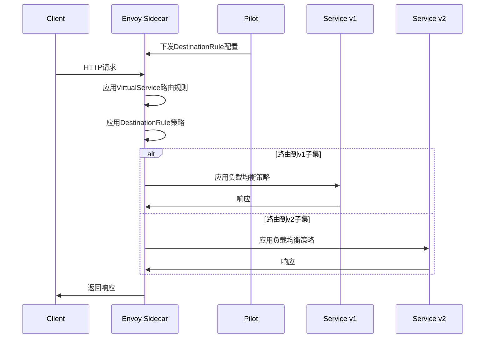
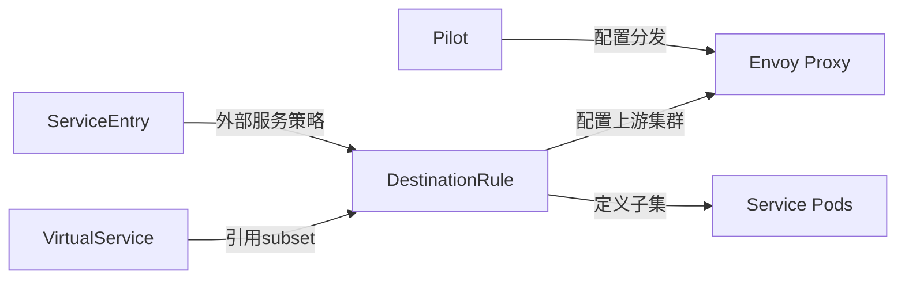
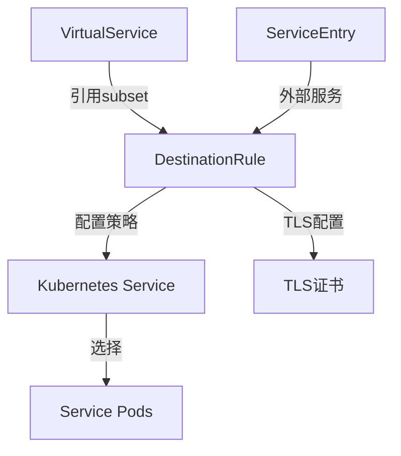

# DestinationRule

## 概述

DestinationRule 是 Istio 流量管理的核心组件之一，它定义了访问服务时应用的策略。DestinationRule 在流量路由发生后应用，主要用于配置负载均衡、连接池设置、断路器配置以及定义服务子集（subsets）。

### 定义和用途
- **服务子集定义**：基于标签将服务实例分组为不同的子集
- **负载均衡策略**：配置不同的负载均衡算法
- **连接池管理**：控制到上游服务的连接数和请求配置
- **断路器配置**：实现服务的健康检查和故障隔离
- **TLS 设置**：配置客户端 TLS 设置

### 解决的问题
- **服务版本管理**：区分和管理同一服务的不同版本
- **负载分配**：优化流量在服务实例间的分配
- **连接管理**：防止连接池耗尽和资源浪费
- **故障隔离**：通过断路器模式快速失败，避免级联故障
- **安全通信**：配置服务间的 TLS 通信

### 使用场景
- 多版本服务部署和管理
- 服务性能优化和调优
- 实现服务的弹性和故障恢复
- 配置服务间的安全通信
- 实现细粒度的流量控制

## 核心特性

### 主要功能特点
- **子集定义**：基于 Pod 标签定义服务子集
- **多种负载均衡算法**：支持轮询、最少连接、随机、一致性哈希等
- **连接池配置**：TCP 和 HTTP 连接池的详细配置
- **健康检查**：主动健康检查和被动健康检查
- **TLS 配置**：mTLS、单向 TLS 和 TLS 版本控制

### 技术优势
- **精细控制**：提供服务级别的精细流量控制
- **高可用性**：通过断路器和健康检查提高系统可用性
- **性能优化**：通过连接池和负载均衡优化性能
- **安全性**：内置 TLS 配置支持
- **零侵入**：应用程序无需修改即可获得这些能力

### 限制和注意事项
- **配置复杂性**：高级配置可能比较复杂
- **资源消耗**：健康检查和连接池管理会消耗额外资源
- **调试困难**：错误配置可能导致难以诊断的连接问题
- **版本兼容性**：不同 Istio 版本间可能存在配置差异

## 工作原理

### 内部机制说明

DestinationRule 通过 Pilot 组件将配置转换为 Envoy 代理的上游集群配置。当 VirtualService 确定了目标服务后，DestinationRule 决定如何访问该服务，包括负载均衡策略、连接设置等。

### 数据流程图



### 与其他组件的交互关系



## 配置和使用

### 基础配置

#### 最小可用配置示例

```yaml
apiVersion: networking.istio.io/v1beta1
kind: DestinationRule
metadata:
  name: reviews
  namespace: default
spec:
  host: reviews                     # 目标服务主机名，必填
  subsets:                          # 服务子集定义
  - name: v1                        # 子集名称
    labels:                         # 选择器标签
      version: v1
  - name: v2
    labels:
      version: v2
```

#### 参数说明

| 参数 | 类型 | 必填 | 描述 | 默认值 |
|------|------|------|------|--------|
| `host` | string | 是 | 目标服务的主机名 | 无 |
| `trafficPolicy` | TrafficPolicy | 否 | 流量策略配置 | 无 |
| `subsets` | Subset[] | 否 | 服务子集定义 | 无 |
| `exportTo` | string[] | 否 | 配置的可见性范围 | ["*"] |
| `workloadSelector` | WorkloadSelector | 否 | 工作负载选择器 | 无 |

#### 默认值和推荐值

- **负载均衡**：默认为 `ROUND_ROBIN`（轮询）
- **连接池**：默认配置适用于大多数场景
- **断路器**：建议根据服务特性配置适当的阈值
- **健康检查**：建议启用以提高系统可靠性

### 高级配置

#### 生产环境配置

```yaml
apiVersion: networking.istio.io/v1beta1
kind: DestinationRule
metadata:
  name: reviews-prod
  namespace: production
spec:
  host: reviews.production.svc.cluster.local
  trafficPolicy:                    # 流量策略
    loadBalancer:
      simple: LEAST_CONN            # 最少连接负载均衡
    connectionPool:                 # 连接池配置
      tcp:
        maxConnections: 100         # 最大连接数
        connectTimeout: 30s         # 连接超时
        keepAlive:                  # TCP Keep-Alive
          time: 7200s
          interval: 75s
          probes: 2
      http:
        http1MaxPendingRequests: 64 # HTTP/1.1最大挂起请求数
        http2MaxRequests: 100       # HTTP/2最大请求数
        maxRequestsPerConnection: 2 # 每连接最大请求数
        maxRetries: 3               # 最大重试次数
        consecutiveGatewayFailure: 5 # 连续网关失败次数
        interval: 30s               # 检查间隔
        h2UpgradePolicy: UPGRADE    # HTTP/2升级策略
    circuitBreaker:                 # 断路器配置
      consecutiveGatewayErrors: 5   # 连续网关错误数
      consecutive5xxErrors: 5       # 连续5xx错误数
      interval: 30s                 # 检查间隔
      baseEjectionTime: 30s         # 基础排除时间
      maxEjectionPercent: 50        # 最大排除百分比
      minHealthPercent: 30          # 最小健康百分比
    healthCheck:                    # 健康检查
      interval: 10s                 # 检查间隔
      timeout: 3s                   # 超时时间
      unhealthyThreshold: 3         # 不健康阈值
      healthyThreshold: 2           # 健康阈值
      path: /health                 # 健康检查路径
  subsets:
  - name: v1
    labels:
      version: v1
    trafficPolicy:                  # 子集特定策略
      loadBalancer:
        simple: ROUND_ROBIN
  - name: v2
    labels:
      version: v2
    trafficPolicy:
      loadBalancer:
        simple: RANDOM
  - name: canary
    labels:
      version: v2
      track: canary
    trafficPolicy:
      connectionPool:
        tcp:
          maxConnections: 10        # 金丝雀版本较少连接
```

#### 性能优化配置

```yaml
apiVersion: networking.istio.io/v1beta1
kind: DestinationRule
metadata:
  name: reviews-performance
spec:
  host: reviews
  trafficPolicy:
    loadBalancer:
      consistentHash:               # 一致性哈希负载均衡
        httpHeaderName: "user-id"   # 基于用户ID哈希
    connectionPool:
      tcp:
        maxConnections: 200         # 高并发连接数
        connectTimeout: 5s          # 快速连接超时
        keepAlive:
          time: 600s                # 保持连接时间
          interval: 60s
      http:
        http2MaxRequests: 1000      # 高并发请求数
        maxRequestsPerConnection: 10
        h2UpgradePolicy: UPGRADE    # 强制HTTP/2升级
    circuitBreaker:
      consecutiveGatewayErrors: 10  # 较高的错误容忍度
      interval: 10s                 # 快速恢复检查
      baseEjectionTime: 10s         # 短暂排除时间
```

#### 安全配置

```yaml
apiVersion: networking.istio.io/v1beta1
kind: DestinationRule
metadata:
  name: reviews-secure
spec:
  host: reviews
  trafficPolicy:
    tls:                            # TLS配置
      mode: ISTIO_MUTUAL            # Istio双向TLS
    connectionPool:
      tcp:
        connectTimeout: 10s
      http:
        h2UpgradePolicy: UPGRADE
  subsets:
  - name: secure
    labels:
      version: v2
      security: high
    trafficPolicy:
      tls:
        mode: MUTUAL                # 双向TLS认证
        clientCertificate: /etc/ssl/certs/client-cert.pem
        privateKey: /etc/ssl/private/client-key.pem
        caCertificates: /etc/ssl/certs/ca-cert.pem
```

## 使用示例

### 基础使用场景

#### 1. 服务子集定义

```yaml
apiVersion: networking.istio.io/v1beta1
kind: DestinationRule
metadata:
  name: bookinfo-ratings
spec:
  host: ratings
  subsets:
  - name: v1                        # 版本1子集
    labels:
      version: v1
  - name: v2                        # 版本2子集
    labels:
      version: v2
  - name: db-version                # 数据库版本子集
    labels:
      version: v2
      db: mongodb
```

**预期结果**: 定义了三个子集，可以在 VirtualService 中引用这些子集进行流量路由。

#### 2. 负载均衡配置

```yaml
apiVersion: networking.istio.io/v1beta1
kind: DestinationRule
metadata:
  name: reviews-lb
spec:
  host: reviews
  trafficPolicy:
    loadBalancer:
      simple: LEAST_CONN            # 最少连接负载均衡
  subsets:
  - name: v1
    labels:
      version: v1
  - name: v2
    labels:
      version: v2
    trafficPolicy:                  # 子集特定负载均衡
      loadBalancer:
        consistentHash:
          httpCookie:               # 基于Cookie的一致性哈希
            name: "session"
            ttl: 3600s
```

**预期结果**: 全局使用最少连接负载均衡，v2 子集使用基于 session cookie 的一致性哈希。

#### 3. 连接池配置

```yaml
apiVersion: networking.istio.io/v1beta1
kind: DestinationRule
metadata:
  name: reviews-pool
spec:
  host: reviews
  trafficPolicy:
    connectionPool:
      tcp:
        maxConnections: 50          # 限制最大连接数
        connectTimeout: 10s         # 连接超时
      http:
        http1MaxPendingRequests: 32 # 限制挂起请求
        maxRequestsPerConnection: 5 # 限制每连接请求数
```

**预期结果**: 限制到 reviews 服务的连接数和请求数，防止资源耗尽。

### 高级使用场景

#### 1. 断路器模式

```yaml
apiVersion: networking.istio.io/v1beta1
kind: DestinationRule
metadata:
  name: reviews-circuit-breaker
spec:
  host: reviews
  trafficPolicy:
    circuitBreaker:
      consecutiveGatewayErrors: 3   # 连续3次网关错误触发断路器
      consecutive5xxErrors: 3       # 连续3次5xx错误触发断路器
      interval: 30s                 # 30秒检查一次
      baseEjectionTime: 30s         # 排除30秒
      maxEjectionPercent: 50        # 最多排除50%实例
      minHealthPercent: 30          # 至少保持30%健康实例
```

**预期结果**: 当检测到连续错误时，自动将有问题的实例从负载均衡池中移除。

#### 2. 健康检查配置

```yaml
apiVersion: networking.istio.io/v1beta1
kind: DestinationRule
metadata:
  name: reviews-health-check
spec:
  host: reviews
  trafficPolicy:
    healthCheck:
      interval: 5s                  # 每5秒检查一次
      timeout: 2s                   # 2秒超时
      unhealthyThreshold: 2         # 2次失败判定为不健康
      healthyThreshold: 3           # 3次成功判定为健康
      path: /actuator/health        # 健康检查端点
      httpHeaders:                  # 自定义健康检查头
      - name: x-health-check
        value: istio
```

**预期结果**: 主动监控服务实例健康状态，自动剔除不健康实例。

#### 3. TLS 配置

```yaml
apiVersion: networking.istio.io/v1beta1
kind: DestinationRule
metadata:
  name: external-service-tls
spec:
  host: external-api.example.com
  trafficPolicy:
    tls:
      mode: SIMPLE                  # 单向TLS
      sni: external-api.example.com # SNI主机名
      caCertificates: /etc/ssl/certs/ca-certificates.crt
  subsets:
  - name: v1
    labels:
      version: v1
    trafficPolicy:
      tls:
        mode: MUTUAL                # 双向TLS
        clientCertificate: /etc/ssl/certs/client.crt
        privateKey: /etc/ssl/private/client.key
```

**预期结果**: 配置与外部服务的 TLS 通信，包括单向和双向 TLS。

#### 4. 一致性哈希负载均衡

```yaml
apiVersion: networking.istio.io/v1beta1
kind: DestinationRule
metadata:
  name: reviews-consistent-hash
spec:
  host: reviews
  trafficPolicy:
    loadBalancer:
      consistentHash:
        httpHeaderName: "user-id"   # 基于用户ID哈希
    circuitBreaker:
      consecutiveGatewayErrors: 5
  subsets:
  - name: region-east
    labels:
      region: east
    trafficPolicy:
      loadBalancer:
        consistentHash:
          useSourceIp: true         # 基于源IP哈希
  - name: region-west
    labels:
      region: west
    trafficPolicy:
      loadBalancer:
        consistentHash:
          httpCookie:               # 基于Cookie哈希
            name: "region-preference"
            ttl: 7200s
```

**预期结果**: 不同子集使用不同的一致性哈希策略，确保会话亲和性。

## 故障排除

### 常见错误和解决方法

#### 1. 子集未找到错误

**症状**: VirtualService 引用的 subset 不存在

**错误信息**:
```
no healthy upstream
subset not found
```

**解决方法**:
```bash
# 检查DestinationRule中的子集定义
kubectl get destinationrule reviews -o yaml

# 检查Pod标签是否匹配
kubectl get pods -l version=v1 --show-labels

# 验证子集配置
istioctl proxy-config cluster productpage-v1-123456.default | grep reviews
```

#### 2. 连接池配置问题

**症状**: 连接被拒绝或超时

**可能原因**:
- maxConnections 设置过低
- connectTimeout 设置过短
- 上游服务不可用

**解决方法**:
```yaml
# 调整连接池配置
trafficPolicy:
  connectionPool:
    tcp:
      maxConnections: 100           # 增加最大连接数
      connectTimeout: 30s           # 增加连接超时
    http:
      http1MaxPendingRequests: 64   # 增加挂起请求数
```

#### 3. 断路器频繁触发

**症状**: 请求经常返回 503 错误，服务实例被频繁剔除

**解决方法**:
```yaml
# 调整断路器参数
circuitBreaker:
  consecutiveGatewayErrors: 10      # 增加错误容忍度
  interval: 60s                     # 增加检查间隔
  baseEjectionTime: 10s             # 减少排除时间
  maxEjectionPercent: 30            # 减少最大排除百分比
```

#### 4. TLS 连接失败

**症状**: TLS 握手失败，连接被拒绝

**解决方法**:
```bash
# 检查证书路径和权限
kubectl exec -it productpage-v1-123456 -c istio-proxy -- ls -la /etc/ssl/certs/

# 验证TLS配置
istioctl proxy-config cluster productpage-v1-123456.default -o json | grep -A 20 "transport_socket"

# 检查证书有效期
openssl x509 -in /etc/ssl/certs/client.crt -noout -dates
```

### 调试技巧

#### 1. 配置验证

```bash
# 验证DestinationRule语法
istioctl validate -f destination-rule.yaml

# 检查配置生效状态
istioctl proxy-config cluster productpage-v1-123456.default

# 分析配置问题
istioctl analyze --all-namespaces
```

#### 2. 连接状态监控

```bash
# 查看上游集群状态
istioctl proxy-config cluster productpage-v1-123456.default --fqdn reviews.default.svc.cluster.local

# 查看端点状态
istioctl proxy-config endpoints productpage-v1-123456.default

# 查看连接池统计
istioctl proxy-config bootstrap productpage-v1-123456.default | grep -A 10 "stats_config"
```

#### 3. 实时监控

```bash
# 监控Envoy统计信息
kubectl exec productpage-v1-123456 -c istio-proxy -- curl localhost:15000/stats | grep reviews

# 查看健康检查状态
kubectl exec productpage-v1-123456 -c istio-proxy -- curl localhost:15000/clusters | grep reviews
```

### 监控和观察方法

#### 1. 关键指标监控

- `envoy_cluster_upstream_cx_connect_timeout`: 连接超时次数
- `envoy_cluster_upstream_cx_destroy`: 连接销毁次数
- `envoy_cluster_upstream_rq_pending_active`: 挂起请求数
- `envoy_cluster_upstream_rq_retry`: 重试次数
- `envoy_cluster_upstream_rq_timeout`: 请求超时次数

#### 2. 健康检查监控

```bash
# 查看健康检查统计
kubectl exec productpage-v1-123456 -c istio-proxy -- curl localhost:15000/stats | grep health_check

# 监控断路器状态
kubectl exec productpage-v1-123456 -c istio-proxy -- curl localhost:15000/stats | grep outlier_detection
```

#### 3. 告警配置

```yaml
# Prometheus告警规则
groups:
- name: destinationrule.rules
  rules:
  - alert: HighConnectionFailureRate
    expr: rate(envoy_cluster_upstream_cx_connect_fail[5m]) > 0.1
    labels:
      severity: warning
    annotations:
      summary: "DestinationRule连接失败率过高"
  
  - alert: CircuitBreakerOpen
    expr: envoy_cluster_outlier_detection_ejections_active > 0
    labels:
      severity: critical
    annotations:
      summary: "断路器已打开，有实例被剔除"
```

## 相关概念

### 关联的其他核心概念

- **[VirtualService](./virtual-service.md)**: 引用 DestinationRule 中定义的子集
- **[ServiceEntry](./service-entry.md)**: 为外部服务配置 DestinationRule
- **[Gateway](./gateway.md)**: 可以配合使用处理入口流量

### 依赖关系说明



### 配合使用的组件

1. **与 VirtualService 配合**:
   ```yaml
   # VirtualService引用subset
   - destination:
       host: reviews
       subset: v1          # 引用DestinationRule中定义的subset
   ```

2. **与 ServiceEntry 配合**:
   ```yaml
   # 为外部服务配置DestinationRule
   spec:
     host: external-api.example.com  # ServiceEntry中定义的host
     trafficPolicy:
       tls:
         mode: SIMPLE
   ```

## 参考资料

### 官方文档链接
- [Istio DestinationRule 官方文档](https://istio.io/latest/docs/reference/config/networking/destination-rule/)
- [流量策略配置指南](https://istio.io/latest/docs/concepts/traffic-management/)

### 深入学习资源
- [Envoy 集群配置文档](https://www.envoyproxy.io/docs/envoy/latest/intro/arch_overview/upstream/cluster_manager)
- [负载均衡算法详解](https://www.envoyproxy.io/docs/envoy/latest/intro/arch_overview/upstream/load_balancing/load_balancing)

### 社区最佳实践
- [DestinationRule 最佳实践](https://istio.io/latest/docs/ops/best-practices/traffic-management/)
- [生产环境配置案例](https://github.com/istio/istio/tree/master/samples)
