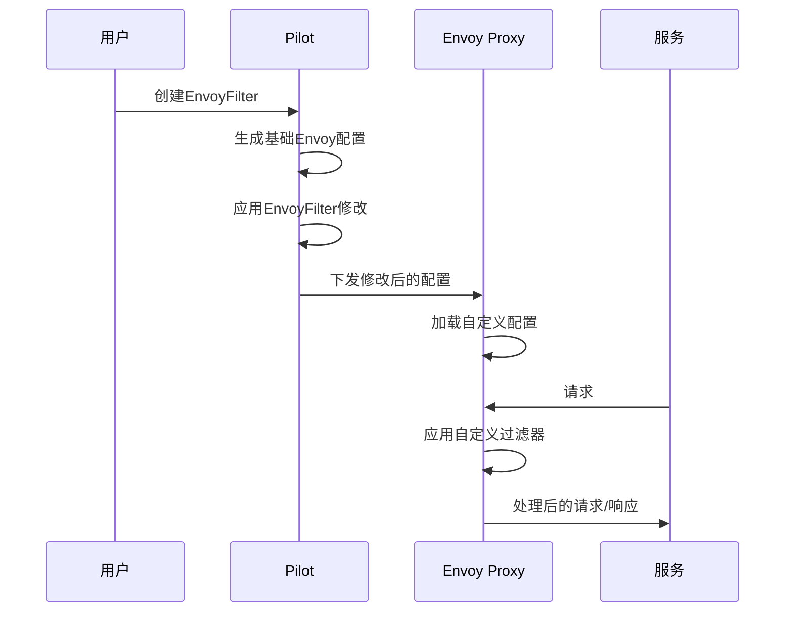
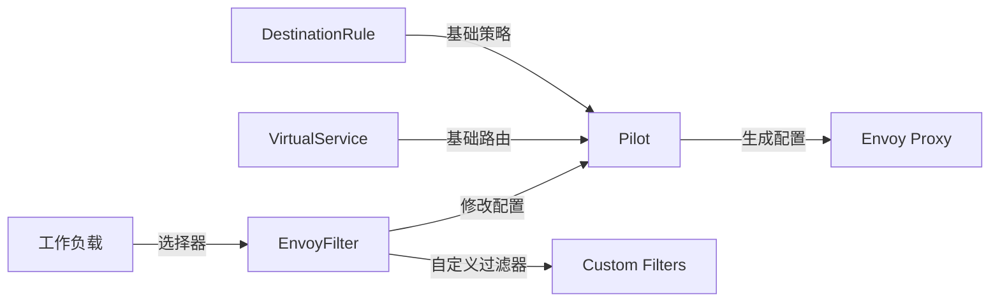
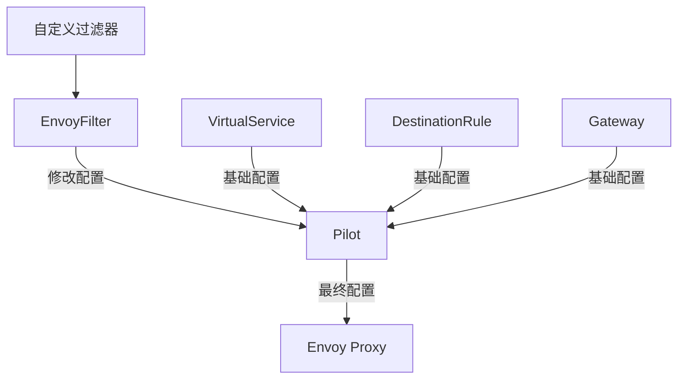

# EnvoyFilter

## 概述

EnvoyFilter 是 Istio 中用于自定义 Envoy 代理配置的高级资源。它允许用户修改、添加或删除 Envoy 代理的配置，提供了对 Envoy 功能的完全控制。EnvoyFilter 是实现高度定制化需求和扩展 Istio 功能的重要工具。

### 定义和用途
- **代理定制**：精确控制 Envoy 代理的配置
- **功能扩展**：添加 Istio 不直接支持的 Envoy 功能
- **配置修改**：修改现有的 Envoy 配置以满足特定需求
- **过滤器集成**：集成自定义的 Envoy 过滤器
- **高级调优**：实现特定的性能和功能优化

### 解决的问题
- **功能缺失**：Istio CRD 不支持的 Envoy 功能
- **配置限制**：突破标准配置的限制
- **定制需求**：满足特定的业务或技术需求
- **实验性功能**：使用 Envoy 的实验性或新功能
- **调试和开发**：临时修改配置进行调试

### 使用场景
- 集成自定义的 Envoy 过滤器
- 修改负载均衡算法
- 添加自定义的 HTTP 头处理
- 实现特定的安全策略
- 性能调优和优化

## 核心特性

### 主要功能特点
- **完全控制**：对 Envoy 配置的完全访问和控制
- **灵活性**：支持添加、修改、删除任何 Envoy 配置
- **工作负载选择**：可以针对特定工作负载应用配置
- **配置合并**：与 Istio 生成的配置智能合并
- **多种操作**：支持 MERGE、ADD、REPLACE、REMOVE 等操作

### 技术优势
- **无限扩展性**：理论上可以实现任何 Envoy 支持的功能
- **精确控制**：提供最细粒度的配置控制
- **向前兼容**：可以使用最新的 Envoy 功能
- **调试友好**：便于调试和实验新功能
- **性能优化**：可以实现特定的性能优化

### 限制和注意事项
- **复杂性高**：需要深入了解 Envoy 配置
- **维护困难**：配置复杂，难以维护
- **兼容性风险**：可能与 Istio 升级不兼容
- **稳定性影响**：错误配置可能影响系统稳定性
- **调试困难**：配置错误时难以诊断问题

## 工作原理

### 内部机制说明

EnvoyFilter 通过 Pilot 组件在生成 Envoy 配置时应用修改。它可以在配置生成过程的不同阶段插入，修改监听器、路由、集群、端点等配置。

### 数据流程图



### 与其他组件的交互关系



## 配置和使用

### 基础配置

#### 最小可用配置示例

```yaml
apiVersion: networking.istio.io/v1alpha3
kind: EnvoyFilter
metadata:
  name: custom-header-filter
  namespace: default
spec:
  workloadSelector:                 # 工作负载选择器
    labels:
      app: productpage
  configPatches:                    # 配置补丁
  - applyTo: HTTP_FILTER           # 应用到HTTP过滤器
    match:
      context: SIDECAR_INBOUND     # 入站 Sidecar
      listener:
        filterChain:
          filter:
            name: "envoy.filters.network.http_connection_manager"
    patch:
      operation: INSERT_BEFORE      # 在指定过滤器前插入
      value:
        name: envoy.filters.http.header_to_metadata
        typed_config:
          "@type": type.googleapis.com/envoy.extensions.filters.http.header_to_metadata.v3.Config
          request_rules:
          - header: x-custom-header
            on_header_present:
              metadata_namespace: custom
              key: header_value
```

#### 参数说明

| 参数 | 类型 | 必填 | 描述 | 默认值 |
|------|------|------|------|--------|
| `workloadSelector` | WorkloadSelector | 否 | 选择应用配置的工作负载 | 所有工作负载 |
| `configPatches` | EnvoyConfigObjectPatch[] | 是 | 配置补丁列表 | 无 |
| `priority` | int32 | 否 | 配置应用优先级 | 0 |

#### ConfigPatch 配置说明

| 参数 | 类型 | 必填 | 描述 | 默认值 |
|------|------|------|------|--------|
| `applyTo` | ApplyTo | 是 | 应用的配置类型 | 无 |
| `match` | EnvoyConfigObjectMatch | 否 | 匹配条件 | 无 |
| `patch` | Patch | 是 | 补丁操作 | 无 |

#### 默认值和推荐值

- **priority**: 较高优先级（较大数值）的配置后应用
- **operation**: 根据需求选择 MERGE、ADD、REPLACE、REMOVE
- **context**: 根据流量方向选择 SIDECAR_INBOUND、SIDECAR_OUTBOUND、GATEWAY

### 高级配置

#### 自定义HTTP过滤器

```yaml
apiVersion: networking.istio.io/v1alpha3
kind: EnvoyFilter
metadata:
  name: custom-lua-filter
  namespace: production
spec:
  workloadSelector:
    labels:
      app: api-gateway
  configPatches:
  # 添加Lua脚本过滤器
  - applyTo: HTTP_FILTER
    match:
      context: SIDECAR_INBOUND
      listener:
        filterChain:
          filter:
            name: "envoy.filters.network.http_connection_manager"
            subFilter:
              name: "envoy.filters.http.router"
    patch:
      operation: INSERT_BEFORE
      value:
        name: envoy.filters.http.lua
        typed_config:
          "@type": type.googleapis.com/envoy.extensions.filters.http.lua.v3.Lua
          inline_code: |
            function envoy_on_request(request_handle)
              -- 添加请求处理逻辑
              request_handle:headers():add("x-lua-processed", "true")
              
              -- 记录请求信息
              local headers = request_handle:headers()
              local user_agent = headers:get("user-agent")
              if user_agent and string.find(user_agent, "bot") then
                request_handle:respond(
                  {[":status"] = "403", ["content-type"] = "text/plain"},
                  "Bot access denied"
                )
              end
            end
            
            function envoy_on_response(response_handle)
              -- 添加响应处理逻辑
              response_handle:headers():add("x-response-processed", "true")
            end
```

#### 自定义负载均衡器

```yaml
apiVersion: networking.istio.io/v1alpha3
kind: EnvoyFilter
metadata:
  name: custom-load-balancer
  namespace: production
spec:
  workloadSelector:
    labels:
      app: reviews
  configPatches:
  # 修改集群的负载均衡配置
  - applyTo: CLUSTER
    match:
      context: SIDECAR_OUTBOUND
      cluster:
        name: outbound|9080||ratings.default.svc.cluster.local
    patch:
      operation: MERGE
      value:
        load_assignment:
          policy:
            weighted_priority_health: true
        lb_policy: RING_HASH
        ring_hash_lb_config:
          minimum_ring_size: 1024
          maximum_ring_size: 8192
          hash_function: XX_HASH
        # 添加一致性哈希配置
        cluster_type:
          name: envoy.clusters.dynamic_forward_proxy
          typed_config:
            "@type": type.googleapis.com/envoy.extensions.clusters.dynamic_forward_proxy.v3.ClusterConfig
            dns_cache_config:
              name: dynamic_forward_proxy_cache_config
              dns_lookup_family: V4_ONLY
              host_ttl: 86400s
```

#### WASM过滤器集成

```yaml
apiVersion: networking.istio.io/v1alpha3
kind: EnvoyFilter
metadata:
  name: wasm-auth-filter
  namespace: production
spec:
  workloadSelector:
    labels:
      app: secure-service
  configPatches:
  - applyTo: HTTP_FILTER
    match:
      context: SIDECAR_INBOUND
      listener:
        filterChain:
          filter:
            name: "envoy.filters.network.http_connection_manager"
            subFilter:
              name: "envoy.filters.http.router"
    patch:
      operation: INSERT_BEFORE
      value:
        name: envoy.filters.http.wasm
        typed_config:
          "@type": type.googleapis.com/envoy.extensions.filters.http.wasm.v3.Wasm
          config:
            name: "auth_filter"
            root_id: "auth_filter"
            vm_config:
              vm_id: "auth_filter"
              runtime: "envoy.wasm.runtime.v8"
              code:
                local:
                  inline_string: |
                    class AuthFilter {
                      constructor(rootContext) {
                        this.rootContext = rootContext;
                      }
                      
                      onRequestHeaders() {
                        const token = this.getRequestHeader("authorization");
                        if (!token || !this.validateToken(token)) {
                          this.sendLocalResponse(401, "", 
                            {"content-type": "text/plain"}, 
                            "Unauthorized");
                          return 0; // Stop iteration
                        }
                        return 1; // Continue
                      }
                      
                      validateToken(token) {
                        // 实现token验证逻辑
                        return token.startsWith("Bearer valid-");
                      }
                    }
```

#### 高级路由修改

```yaml
apiVersion: networking.istio.io/v1alpha3
kind: EnvoyFilter
metadata:
  name: advanced-routing
  namespace: production
spec:
  workloadSelector:
    labels:
      app: api-gateway
  configPatches:
  # 修改HTTP路由配置
  - applyTo: HTTP_ROUTE
    match:
      context: SIDECAR_INBOUND
      routeConfiguration:
        vhost:
          name: "inbound|http|9080"
          route:
            action: any
    patch:
      operation: MERGE
      value:
        route:
          timeout: 30s
          retry_policy:
            retry_on: "5xx,reset,connect-failure,refused-stream"
            num_retries: 5
            per_try_timeout: 5s
            retry_host_predicate:
            - name: envoy.retry_host_predicates.previous_hosts
            host_selection_retry_max_attempts: 3
          hash_policy:
          - header:
              header_name: "x-session-id"
          - cookie:
              name: "session"
              ttl: 3600s
        request_headers_to_add:
        - header:
            key: "x-envoy-retry-on"
            value: "5xx,reset"
          append: true
        - header:
            key: "x-request-id"
            value: "%REQ(x-request-id)%"
```

## 使用示例

### 基础使用场景

#### 1. 添加自定义HTTP头

```yaml
apiVersion: networking.istio.io/v1alpha3
kind: EnvoyFilter
metadata:
  name: add-custom-headers
  namespace: default
spec:
  workloadSelector:
    labels:
      app: productpage
  configPatches:
  - applyTo: HTTP_FILTER
    match:
      context: SIDECAR_INBOUND
      listener:
        filterChain:
          filter:
            name: "envoy.filters.network.http_connection_manager"
            subFilter:
              name: "envoy.filters.http.router"
    patch:
      operation: INSERT_BEFORE
      value:
        name: envoy.filters.http.header_to_metadata
        typed_config:
          "@type": type.googleapis.com/envoy.extensions.filters.http.header_to_metadata.v3.Config
          request_rules:
          - header: x-user-id
            on_header_present:
              metadata_namespace: envoy.common
              key: user_id
          - header: x-tenant-id
            on_header_present:
              metadata_namespace: envoy.common
              key: tenant_id
```

**预期结果**: 将请求头中的用户ID和租户ID提取为元数据，供后续过滤器使用。

#### 2. 修改连接超时

```yaml
apiVersion: networking.istio.io/v1alpha3
kind: EnvoyFilter
metadata:
  name: connection-timeout
  namespace: default
spec:
  workloadSelector:
    labels:
      app: reviews
  configPatches:
  - applyTo: CLUSTER
    match:
      context: SIDECAR_OUTBOUND
    patch:
      operation: MERGE
      value:
        connect_timeout: 10s
        per_connection_buffer_limit_bytes: 32768
```

**预期结果**: 修改所有出站连接的超时时间为10秒。

#### 3. 启用压缩

```yaml
apiVersion: networking.istio.io/v1alpha3
kind: EnvoyFilter
metadata:
  name: enable-compression
  namespace: default
spec:
  configPatches:
  - applyTo: HTTP_FILTER
    match:
      context: SIDECAR_INBOUND
      listener:
        filterChain:
          filter:
            name: "envoy.filters.network.http_connection_manager"
            subFilter:
              name: "envoy.filters.http.router"
    patch:
      operation: INSERT_BEFORE
      value:
        name: envoy.filters.http.compressor
        typed_config:
          "@type": type.googleapis.com/envoy.extensions.filters.http.compressor.v3.Compressor
          response_direction_config:
            common_config:
              min_content_length: 100
              content_type:
              - "application/json"
              - "text/html"
              - "text/plain"
            disable_on_etag_header: true
          compressor_library:
            name: envoy.compression.gzip.compressor
            typed_config:
              "@type": type.googleapis.com/envoy.extensions.compression.gzip.compressor.v3.Gzip
              memory_level: 6
              window_bits: 15
              compression_level: BEST_COMPRESSION
              compression_strategy: DEFAULT_STRATEGY
```

**预期结果**: 为响应启用 gzip 压缩，减少传输数据量。

### 高级使用场景

#### 1. 实现请求限流

```yaml
apiVersion: networking.istio.io/v1alpha3
kind: EnvoyFilter
metadata:
  name: rate-limiting
  namespace: production
spec:
  workloadSelector:
    labels:
      app: api-service
  configPatches:
  # 添加本地限流过滤器
  - applyTo: HTTP_FILTER
    match:
      context: SIDECAR_INBOUND
      listener:
        filterChain:
          filter:
            name: "envoy.filters.network.http_connection_manager"
            subFilter:
              name: "envoy.filters.http.router"
    patch:
      operation: INSERT_BEFORE
      value:
        name: envoy.filters.http.local_ratelimit
        typed_config:
          "@type": type.googleapis.com/udpa.type.v1.TypedStruct
          type_url: type.googleapis.com/envoy.extensions.filters.http.local_ratelimit.v3.LocalRateLimit
          value:
            stat_prefix: local_rate_limiter
            token_bucket:
              max_tokens: 100
              tokens_per_fill: 100
              fill_interval: 60s
            filter_enabled:
              runtime_key: local_rate_limit_enabled
              default_value:
                numerator: 100
                denominator: HUNDRED
            filter_enforced:
              runtime_key: local_rate_limit_enforced
              default_value:
                numerator: 100
                denominator: HUNDRED
            response_headers_to_add:
            - append: false
              header:
                key: x-local-rate-limit
                value: 'true'
```

**预期结果**: 实现每分钟100个请求的本地限流。

#### 2. 自定义身份验证

```yaml
apiVersion: networking.istio.io/v1alpha3
kind: EnvoyFilter
metadata:
  name: custom-auth
  namespace: production
spec:
  workloadSelector:
    labels:
      app: secure-api
  configPatches:
  - applyTo: HTTP_FILTER
    match:
      context: SIDECAR_INBOUND
      listener:
        filterChain:
          filter:
            name: "envoy.filters.network.http_connection_manager"
            subFilter:
              name: "envoy.filters.http.router"
    patch:
      operation: INSERT_BEFORE
      value:
        name: envoy.filters.http.ext_authz
        typed_config:
          "@type": type.googleapis.com/envoy.extensions.filters.http.ext_authz.v3.ExtAuthz
          transport_api_version: V3
          grpc_service:
            envoy_grpc:
              cluster_name: ext-authz
            timeout: 2s
          failure_mode_allow: false
          with_request_body:
            max_request_bytes: 8192
            allow_partial_message: true
          clear_route_cache: true
  # 添加外部认证服务集群
  - applyTo: CLUSTER
    match:
      context: SIDECAR_INBOUND
    patch:
      operation: ADD
      value:
        name: ext-authz
        type: LOGICAL_DNS
        connect_timeout: 5s
        http2_protocol_options: {}
        load_assignment:
          cluster_name: ext-authz
          endpoints:
          - lb_endpoints:
            - endpoint:
                address:
                  socket_address:
                    address: auth-service.auth-ns.svc.cluster.local
                    port_value: 9001
```

**预期结果**: 集成外部认证服务，对所有请求进行身份验证。

#### 3. 添加分布式追踪

```yaml
apiVersion: networking.istio.io/v1alpha3
kind: EnvoyFilter
metadata:
  name: custom-tracing
  namespace: production
spec:
  configPatches:
  # 修改HTTP连接管理器以启用追踪
  - applyTo: HTTP_FILTER
    match:
      context: SIDECAR_INBOUND
      listener:
        filterChain:
          filter:
            name: "envoy.filters.network.http_connection_manager"
    patch:
      operation: MERGE
      value:
        typed_config:
          "@type": type.googleapis.com/envoy.extensions.filters.network.http_connection_manager.v3.HttpConnectionManager
          tracing:
            provider:
              name: envoy.tracers.custom
              typed_config:
                "@type": type.googleapis.com/envoy.config.trace.v3.CustomTraceConfig
                collector_cluster: jaeger
                collector_endpoint: "/api/traces"
            custom_tags:
            - tag: user_id
              metadata:
                kind:
                  request: {}
                metadata_key:
                  key: envoy.common
                  path:
                  - key: user_id
            - tag: operation_name
              request_header:
                name: x-operation-name
                default_value: unknown
```

**预期结果**: 为服务添加自定义的分布式追踪配置。

#### 4. 实现流量镜像

```yaml
apiVersion: networking.istio.io/v1alpha3
kind: EnvoyFilter
metadata:
  name: traffic-mirroring
  namespace: production
spec:
  workloadSelector:
    labels:
      app: payment-service
  configPatches:
  - applyTo: HTTP_ROUTE
    match:
      context: SIDECAR_INBOUND
      routeConfiguration:
        vhost:
          route:
            action: any
    patch:
      operation: MERGE
      value:
        route:
          request_mirror_policies:
          - cluster: mirror-cluster
            runtime_fraction:
              default_value:
                numerator: 10
                denominator: HUNDRED
            trace_sampled: true
  # 添加镜像集群
  - applyTo: CLUSTER
    match:
      context: SIDECAR_INBOUND
    patch:
      operation: ADD
      value:
        name: mirror-cluster
        type: LOGICAL_DNS
        connect_timeout: 1s
        load_assignment:
          cluster_name: mirror-cluster
          endpoints:
          - lb_endpoints:
            - endpoint:
                address:
                  socket_address:
                    address: payment-test.test-ns.svc.cluster.local
                    port_value: 8080
        circuit_breakers:
          thresholds:
          - priority: DEFAULT
            max_requests: 1
            max_pending_requests: 1
```

**预期结果**: 将10%的生产流量镜像到测试环境进行验证。

## 故障排除

### 常见错误和解决方法

#### 1. 配置不生效

**症状**: EnvoyFilter 创建成功但配置没有生效

**可能原因**:
- 工作负载选择器不匹配
- 配置语法错误
- 匹配条件不正确
- 优先级设置问题

**解决方法**:
```bash
# 检查EnvoyFilter配置
kubectl get envoyfilter custom-header-filter -o yaml

# 验证工作负载选择器
kubectl get pods -l app=productpage --show-labels

# 检查Envoy配置
istioctl proxy-config dump productpage-v1-123456.default

# 查看Pilot日志
kubectl logs -n istio-system -l app=istiod | grep envoyfilter
```

#### 2. Envoy代理启动失败

**症状**: 应用EnvoyFilter后Pod重启失败

**解决方法**:
```bash
# 检查Pod状态
kubectl get pods productpage-v1-123456

# 查看容器日志
kubectl logs productpage-v1-123456 -c istio-proxy

# 验证配置语法
istioctl validate -f envoyfilter.yaml

# 检查配置冲突
istioctl analyze
```

#### 3. 性能下降

**症状**: 应用EnvoyFilter后服务性能明显下降

**解决方法**:
```bash
# 查看代理统计信息
kubectl exec productpage-v1-123456 -c istio-proxy -- curl localhost:15000/stats

# 检查CPU和内存使用
kubectl top pods productpage-v1-123456

# 分析配置复杂度
kubectl exec productpage-v1-123456 -c istio-proxy -- curl localhost:15000/config_dump | jq '.configs | length'
```

#### 4. 过滤器顺序问题

**症状**: 过滤器没有按预期顺序执行

**解决方法**:
```bash
# 检查HTTP过滤器链
istioctl proxy-config listeners productpage-v1-123456.default --port 15006 -o json | jq '.[] | .filter_chains[0].filters[0].typed_config.http_filters'

# 验证插入位置
kubectl get envoyfilter custom-header-filter -o jsonpath='{.spec.configPatches[0].patch.operation}'

# 调整过滤器优先级
kubectl patch envoyfilter custom-header-filter --type merge -p '{"spec":{"priority":10}}'
```

### 调试技巧

#### 1. 配置验证

```bash
# 验证EnvoyFilter语法
istioctl validate -f envoyfilter.yaml

# 检查配置应用状态
istioctl proxy-status

# 分析配置问题
istioctl analyze --all-namespaces
```

#### 2. 实时配置检查

```bash
# 查看完整的Envoy配置
istioctl proxy-config dump productpage-v1-123456.default

# 检查特定的过滤器配置
istioctl proxy-config listeners productpage-v1-123456.default --port 15006

# 查看集群配置
istioctl proxy-config clusters productpage-v1-123456.default
```

#### 3. 逐步调试

```bash
# 创建简化版本的EnvoyFilter
kubectl apply -f simple-envoyfilter.yaml

# 逐步添加复杂配置
kubectl patch envoyfilter simple-filter --type merge -p '{"spec":{"configPatches":[...]}}'

# 使用临时测试Pod验证
kubectl run test-pod --image=curlimages/curl --rm -it -- /bin/sh
```

### 监控和观察方法

#### 1. 关键指标监控

- `envoy_server_memory_allocated`: Envoy内存使用量
- `envoy_server_uptime`: Envoy运行时间
- `envoy_http_downstream_rq_total`: 请求总数
- `pilot_xds_config_size_bytes`: 配置大小

#### 2. 配置变更监控

```bash
# 监控EnvoyFilter变更
kubectl get events --field-selector involvedObject.kind=EnvoyFilter

# 查看配置分发状态
istioctl proxy-status | grep "SYNCED\|STALE"

# 监控Pilot资源使用
kubectl top pods -n istio-system -l app=istiod
```

#### 3. 告警配置

```yaml
# Prometheus告警规则
groups:
- name: envoyfilter.rules
  rules:
  - alert: EnvoyFilterConfigError
    expr: increase(pilot_k8s_cfg_events{type="EnvoyFilter",event="update"}[5m]) > 5
    labels:
      severity: warning
    annotations:
      summary: "EnvoyFilter配置变更频繁"
  
  - alert: EnvoyHighMemoryUsage
    expr: envoy_server_memory_allocated > 1000000000
    labels:
      severity: warning
    annotations:
      summary: "Envoy内存使用过高"
```

## 相关概念

### 关联的其他核心概念

- **[VirtualService](./virtual-service.md)**: EnvoyFilter 可以修改 VirtualService 生成的路由配置
- **[DestinationRule](./destination-rule.md)**: EnvoyFilter 可以修改 DestinationRule 生成的集群配置
- **[Gateway](./gateway.md)**: EnvoyFilter 可以修改 Gateway 的监听器配置

### 依赖关系说明



### 配合使用的组件

1. **与 VirtualService 配合**:
   ```yaml
   # VirtualService定义基础路由
   # EnvoyFilter修改路由的高级特性
   - applyTo: HTTP_ROUTE
     match:
       routeConfiguration:
         vhost:
           route:
             name: "reviews-route"
     patch:
       operation: MERGE
       value:
         route:
           hash_policy:
           - header:
               header_name: "session-id"
   ```

2. **与自定义过滤器配合**:
   ```yaml
   # EnvoyFilter集成WASM或Lua过滤器
   - applyTo: HTTP_FILTER
     patch:
       value:
         name: envoy.filters.http.wasm
         typed_config:
           config:
             vm_config:
               code:
                 local:
                   inline_string: |
                     // 自定义过滤器逻辑
   ```

## 参考资料

### 官方文档链接
- [Istio EnvoyFilter 官方文档](https://istio.io/latest/docs/reference/config/networking/envoy-filter/)
- [Envoy 配置参考](https://www.envoyproxy.io/docs/envoy/latest/configuration/configuration)

### 深入学习资源
- [Envoy 过滤器开发指南](https://www.envoyproxy.io/docs/envoy/latest/extending/extending)
- [WASM 过滤器开发](https://github.com/proxy-wasm/spec)

### 社区最佳实践
- [EnvoyFilter 配置案例](https://github.com/istio/istio/tree/master/samples)
- [高级配置模式](https://istio.io/latest/docs/ops/configuration/mesh/app-health-check/)
