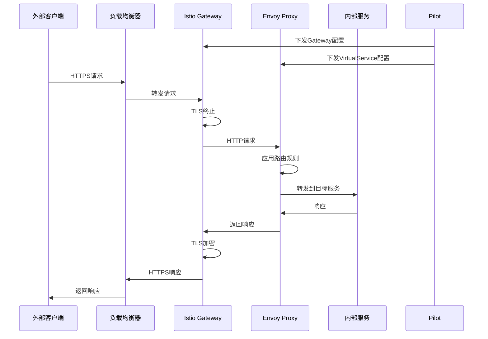
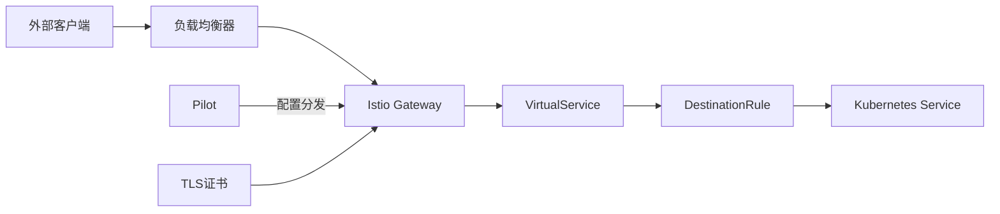
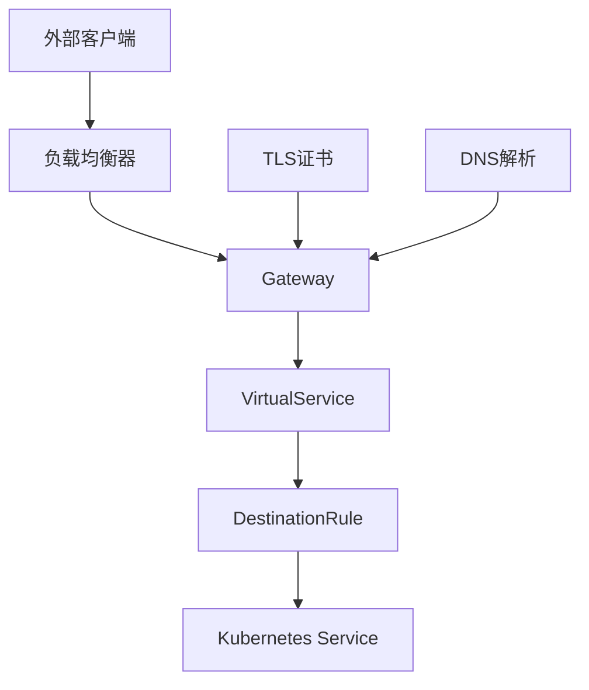

# Gateway

## 概述

Gateway 是 Istio 中用于管理进入和离开服务网格流量的核心组件。它配置负载均衡器以接收入口或出口的 HTTP/TCP 连接，定义了网格边缘的协议、端口和 TLS 设置。Gateway 主要用于南北向流量管理，是外部流量进入 Istio 服务网格的入口点。

### 定义和用途
- **入口流量管理**：配置外部流量如何进入服务网格
- **出口流量控制**：管理服务网格内部到外部服务的流量
- **协议配置**：支持 HTTP、HTTPS、TCP、TLS 等多种协议
- **TLS 终止**：在网格边缘处理 TLS 加密和解密
- **端口管理**：定义监听的端口和协议

### 解决的问题
- **流量入口统一管理**：提供统一的流量入口配置
- **TLS 证书管理**：集中管理和配置 TLS 证书
- **协议适配**：支持多种网络协议的接入
- **安全边界**：在网格边缘实现安全控制
- **负载均衡器配置**：标准化的负载均衡器配置方式

### 使用场景
- 配置应用程序的外部访问入口
- 实现基于域名的虚拟主机路由
- 配置 HTTPS 和 TLS 终止
- 多租户环境的流量隔离
- 微服务网关模式的实现

## 核心特性

### 主要功能特点
- **多协议支持**：HTTP、HTTPS、gRPC、TCP、TLS、MongoDB 等
- **TLS 配置**：支持 TLS 终止、透传和重定向
- **虚拟主机**：基于 Server Name Indication (SNI) 的路由
- **端口复用**：单个 Gateway 可以配置多个端口
- **证书管理**：支持多种证书配置方式

### 技术优势
- **标准化配置**：提供统一的网关配置接口
- **高度灵活性**：支持复杂的路由和 TLS 配置
- **无缝集成**：与 VirtualService 紧密配合
- **安全性**：内置安全最佳实践
- **可扩展性**：支持多种负载均衡器实现

### 限制和注意事项
- **配置复杂性**：复杂场景的配置可能较为繁琐
- **证书管理**：需要额外的证书管理机制
- **依赖关系**：需要与 VirtualService 配合使用
- **负载均衡器依赖**：需要底层负载均衡器支持

## 工作原理

### 内部机制说明

Gateway 配置通过 Pilot 组件下发到 Istio Gateway 控制器（通常是 istio-ingressgateway）。Gateway 控制器根据配置更新 Envoy 代理的监听器配置，处理外部流量的接入和路由。

### 数据流程图



### 与其他组件的交互关系



## 配置和使用

### 基础配置

#### 最小可用配置示例

```yaml
apiVersion: networking.istio.io/v1beta1
kind: Gateway
metadata:
  name: bookinfo-gateway
  namespace: default
spec:
  selector:                         # 网关选择器，必填
    istio: ingressgateway          # 选择istio-ingressgateway
  servers:                          # 服务器配置，必填
  - port:
      number: 80                    # 监听端口
      name: http                    # 端口名称
      protocol: HTTP                # 协议类型
    hosts:                          # 主机名列表
    - bookinfo.example.com
```

#### 参数说明

| 参数 | 类型 | 必填 | 描述 | 默认值 |
|------|------|------|------|--------|
| `selector` | map[string]string | 是 | 选择网关工作负载的标签选择器 | 无 |
| `servers` | Server[] | 是 | 服务器配置列表 | 无 |
| `servers[].port` | Port | 是 | 端口配置 | 无 |
| `servers[].hosts` | string[] | 是 | 主机名列表 | 无 |
| `servers[].tls` | ServerTLSSettings | 否 | TLS配置 | 无 |

#### Server 配置说明

| 参数 | 类型 | 必填 | 描述 | 默认值 |
|------|------|------|------|--------|
| `port.number` | uint32 | 是 | 端口号 | 无 |
| `port.name` | string | 是 | 端口名称 | 无 |
| `port.protocol` | string | 是 | 协议类型 | 无 |
| `hosts` | string[] | 是 | 主机名列表，支持通配符 | 无 |
| `tls.mode` | TLSmode | 否 | TLS模式 | PASSTHROUGH |
| `tls.credentialName` | string | 否 | 证书凭据名称 | 无 |

#### 默认值和推荐值

- **selector**: 通常使用 `istio: ingressgateway` 选择入口网关
- **protocol**: 根据实际需求选择 HTTP、HTTPS、TCP 等
- **TLS模式**: 建议使用 SIMPLE 或 MUTUAL 进行 TLS 终止

### 高级配置

#### 生产环境配置

```yaml
apiVersion: networking.istio.io/v1beta1
kind: Gateway
metadata:
  name: production-gateway
  namespace: istio-system
spec:
  selector:
    istio: ingressgateway
  servers:
  # HTTPS服务器配置
  - port:
      number: 443
      name: https
      protocol: HTTPS
    tls:
      mode: SIMPLE                  # TLS终止模式
      credentialName: bookinfo-credential # K8s Secret名称
      minProtocolVersion: TLSV1_2   # 最小TLS版本
      maxProtocolVersion: TLSV1_3   # 最大TLS版本
      cipherSuites:                 # 密码套件
      - ECDHE-RSA-AES128-GCM-SHA256
      - ECDHE-RSA-AES256-GCM-SHA384
    hosts:
    - bookinfo.example.com
    - api.example.com
    - "*.example.com"               # 通配符域名
  
  # HTTP重定向到HTTPS
  - port:
      number: 80
      name: http
      protocol: HTTP
    tls:
      httpsRedirect: true           # 自动重定向到HTTPS
    hosts:
    - bookinfo.example.com
    - api.example.com
    - "*.example.com"
  
  # gRPC服务器配置
  - port:
      number: 443
      name: grpc-tls
      protocol: GRPC
    tls:
      mode: SIMPLE
      credentialName: grpc-credential
    hosts:
    - grpc.example.com
  
  # TCP代理配置
  - port:
      number: 31400
      name: mongo
      protocol: MONGO
    hosts:
    - "*"
```

#### 多协议配置

```yaml
apiVersion: networking.istio.io/v1beta1
kind: Gateway
metadata:
  name: multi-protocol-gateway
spec:
  selector:
    istio: ingressgateway
  servers:
  # HTTP/2 with TLS
  - port:
      number: 443
      name: https-h2
      protocol: HTTPS
    tls:
      mode: SIMPLE
      credentialName: h2-credential
    hosts:
    - h2.example.com
  
  # TCP with TLS
  - port:
      number: 6379
      name: redis-tls
      protocol: TLS
    tls:
      mode: PASSTHROUGH              # TLS透传
    hosts:
    - redis.example.com
  
  # 纯TCP
  - port:
      number: 3306
      name: mysql
      protocol: TCP
    hosts:
    - "*"
```

#### 双向TLS配置

```yaml
apiVersion: networking.istio.io/v1beta1
kind: Gateway
metadata:
  name: mtls-gateway
spec:
  selector:
    istio: ingressgateway
  servers:
  - port:
      number: 443
      name: https-mtls
      protocol: HTTPS
    tls:
      mode: MUTUAL                  # 双向TLS认证
      credentialName: mtls-credential
      caCertificates: /etc/ssl/certs/ca-cert.pem
    hosts:
    - secure.example.com
```

## 使用示例

### 基础使用场景

#### 1. 简单HTTP网关

```yaml
apiVersion: networking.istio.io/v1beta1
kind: Gateway
metadata:
  name: simple-gateway
spec:
  selector:
    istio: ingressgateway
  servers:
  - port:
      number: 80
      name: http
      protocol: HTTP
    hosts:
    - bookinfo.local
---
apiVersion: networking.istio.io/v1beta1
kind: VirtualService
metadata:
  name: bookinfo
spec:
  hosts:
  - bookinfo.local
  gateways:
  - simple-gateway                  # 绑定到Gateway
  http:
  - match:
    - uri:
        exact: /productpage
    route:
    - destination:
        host: productpage
        port:
          number: 9080
```

**预期结果**: 外部用户可以通过 `http://bookinfo.local/productpage` 访问应用。

#### 2. HTTPS网关配置

```yaml
# 首先创建TLS证书Secret
apiVersion: v1
kind: Secret
metadata:
  name: bookinfo-credential
  namespace: istio-system
type: kubernetes.io/tls
data:
  tls.crt: LS0tLS1CRUdJTi... # Base64编码的证书
  tls.key: LS0tLS1CRUdJTi... # Base64编码的私钥
---
apiVersion: networking.istio.io/v1beta1
kind: Gateway
metadata:
  name: bookinfo-gateway-tls
spec:
  selector:
    istio: ingressgateway
  servers:
  - port:
      number: 443
      name: https
      protocol: HTTPS
    tls:
      mode: SIMPLE
      credentialName: bookinfo-credential
    hosts:
    - bookinfo.example.com
```

**预期结果**: 用户可以通过 HTTPS 安全访问应用，TLS 在网关处终止。

#### 3. 多域名网关

```yaml
apiVersion: networking.istio.io/v1beta1
kind: Gateway
metadata:
  name: multi-host-gateway
spec:
  selector:
    istio: ingressgateway
  servers:
  - port:
      number: 443
      name: https
      protocol: HTTPS
    tls:
      mode: SIMPLE
      credentialName: multi-domain-credential
    hosts:
    - api.example.com
    - web.example.com
    - admin.example.com
---
apiVersion: networking.istio.io/v1beta1
kind: VirtualService
metadata:
  name: multi-host-routing
spec:
  hosts:
  - api.example.com
  - web.example.com
  - admin.example.com
  gateways:
  - multi-host-gateway
  http:
  - match:
    - uri:
        prefix: /api
      headers:
        host:
          exact: api.example.com
    route:
    - destination:
        host: api-service
  - match:
    - headers:
        host:
          exact: web.example.com
    route:
    - destination:
        host: web-service
  - match:
    - headers:
        host:
          exact: admin.example.com
    route:
    - destination:
        host: admin-service
```

**预期结果**: 不同域名的请求被路由到不同的后端服务。

### 高级使用场景

#### 1. 自动HTTPS重定向

```yaml
apiVersion: networking.istio.io/v1beta1
kind: Gateway
metadata:
  name: redirect-gateway
spec:
  selector:
    istio: ingressgateway
  servers:
  # HTTP服务器，自动重定向到HTTPS
  - port:
      number: 80
      name: http
      protocol: HTTP
    tls:
      httpsRedirect: true           # 启用HTTPS重定向
    hosts:
    - secure.example.com
  
  # HTTPS服务器
  - port:
      number: 443
      name: https
      protocol: HTTPS
    tls:
      mode: SIMPLE
      credentialName: secure-credential
    hosts:
    - secure.example.com
```

**预期结果**: 所有 HTTP 请求自动重定向到对应的 HTTPS URL。

#### 2. TCP负载均衡

```yaml
apiVersion: networking.istio.io/v1beta1
kind: Gateway
metadata:
  name: tcp-gateway
spec:
  selector:
    istio: ingressgateway
  servers:
  - port:
      number: 3306
      name: mysql
      protocol: TCP
    hosts:
    - "*"
---
apiVersion: networking.istio.io/v1beta1
kind: VirtualService
metadata:
  name: mysql-vs
spec:
  hosts:
  - "*"
  gateways:
  - tcp-gateway
  tcp:
  - match:
    - port: 3306
    route:
    - destination:
        host: mysql-service
        port:
          number: 3306
```

**预期结果**: 外部客户端可以通过网关访问内部的 MySQL 服务。

#### 3. 基于SNI的TLS路由

```yaml
apiVersion: networking.istio.io/v1beta1
kind: Gateway
metadata:
  name: sni-gateway
spec:
  selector:
    istio: ingressgateway
  servers:
  - port:
      number: 443
      name: https-app1
      protocol: HTTPS
    tls:
      mode: SIMPLE
      credentialName: app1-credential
    hosts:
    - app1.example.com
  
  - port:
      number: 443
      name: https-app2
      protocol: HTTPS
    tls:
      mode: SIMPLE
      credentialName: app2-credential
    hosts:
    - app2.example.com
  
  # TLS透传模式
  - port:
      number: 443
      name: tls-passthrough
      protocol: TLS
    tls:
      mode: PASSTHROUGH
    hosts:
    - secure-app.example.com
```

**预期结果**: 根据 SNI 信息将不同域名的 TLS 流量路由到不同的后端服务。

#### 4. 出口网关配置

```yaml
apiVersion: networking.istio.io/v1beta1
kind: Gateway
metadata:
  name: egress-gateway
spec:
  selector:
    istio: egressgateway             # 选择出口网关
  servers:
  - port:
      number: 443
      name: https
      protocol: HTTPS
    hosts:
    - external-api.example.com
    tls:
      mode: PASSTHROUGH              # TLS透传到外部服务
---
apiVersion: networking.istio.io/v1beta1
kind: VirtualService
metadata:
  name: external-api-through-egress
spec:
  hosts:
  - external-api.example.com
  gateways:
  - mesh                            # 网格内部流量
  - egress-gateway                  # 出口网关流量
  http:
  - match:
    - gateways:
      - mesh
      port: 443
    route:
    - destination:
        host: istio-egressgateway.istio-system.svc.cluster.local
        port:
          number: 443
      weight: 100
  - match:
    - gateways:
      - egress-gateway
      port: 443
    route:
    - destination:
        host: external-api.example.com
        port:
          number: 443
      weight: 100
```

**预期结果**: 所有到外部 API 的流量通过出口网关进行管理和监控。

## 故障排除

### 常见错误和解决方法

#### 1. 网关无法访问

**症状**: 外部请求无法到达服务，返回 404 或连接拒绝

**可能原因**:
- Gateway 选择器配置错误
- VirtualService 未正确绑定 Gateway
- DNS 解析问题

**解决方法**:
```bash
# 检查Gateway配置
kubectl get gateway bookinfo-gateway -o yaml

# 检查Gateway选择器是否匹配
kubectl get pods -n istio-system -l istio=ingressgateway

# 检查VirtualService绑定
kubectl get virtualservice bookinfo -o yaml

# 检查网关服务状态
kubectl get svc -n istio-system istio-ingressgateway

# 检查网关端点
kubectl get endpoints -n istio-system istio-ingressgateway
```

#### 2. TLS证书问题

**症状**: HTTPS 访问出现证书错误或 TLS 握手失败

**解决方法**:
```bash
# 检查证书Secret是否存在
kubectl get secret bookinfo-credential -n istio-system

# 验证证书内容
kubectl get secret bookinfo-credential -n istio-system -o jsonpath='{.data.tls\.crt}' | base64 -d | openssl x509 -text -noout

# 检查证书有效期
kubectl get secret bookinfo-credential -n istio-system -o jsonpath='{.data.tls\.crt}' | base64 -d | openssl x509 -noout -dates

# 测试TLS连接
openssl s_client -connect bookinfo.example.com:443 -servername bookinfo.example.com
```

#### 3. 端口冲突

**症状**: Gateway 配置后端口不可用

**解决方法**:
```bash
# 检查端口使用情况
kubectl get gateway --all-namespaces -o yaml | grep -A 5 -B 5 "number: 443"

# 检查Service端口配置
kubectl get svc -n istio-system istio-ingressgateway -o yaml

# 验证负载均衡器配置
kubectl describe svc -n istio-system istio-ingressgateway
```

#### 4. 路由配置问题

**症状**: 请求到达网关但路由到错误的服务

**解决方法**:
```bash
# 检查路由配置
istioctl proxy-config routes istio-ingressgateway-xxx.istio-system

# 分析配置问题
istioctl analyze

# 检查监听器配置
istioctl proxy-config listeners istio-ingressgateway-xxx.istio-system
```

### 调试技巧

#### 1. 配置验证

```bash
# 验证Gateway语法
istioctl validate -f gateway.yaml

# 检查配置冲突
istioctl analyze --all-namespaces

# 查看网关代理配置
istioctl proxy-config listeners istio-ingressgateway-xxx.istio-system --port 443
```

#### 2. 流量跟踪

```bash
# 启用访问日志
kubectl patch configmap istio -n istio-system --type merge -p '{"data":{"mesh":"defaultConfig:\n  accessLogFile: /dev/stdout"}}'

# 查看网关访问日志
kubectl logs -f -n istio-system istio-ingressgateway-xxx

# 使用curl测试
curl -v -H "Host: bookinfo.example.com" http://GATEWAY_IP/productpage
```

#### 3. 证书调试

```bash
# 检查证书链
openssl s_client -connect bookinfo.example.com:443 -showcerts

# 验证证书与私钥匹配
openssl x509 -noout -modulus -in certificate.crt | openssl md5
openssl rsa -noout -modulus -in private.key | openssl md5

# 检查证书Subject Alternative Names
openssl x509 -in certificate.crt -text -noout | grep -A 1 "Subject Alternative Name"
```

### 监控和观察方法

#### 1. 关键指标监控

- `istio_requests_total{source_app="istio-ingressgateway"}`: 网关请求总数
- `istio_request_duration_milliseconds{source_app="istio-ingressgateway"}`: 网关请求延迟
- `envoy_http_downstream_cx_ssl_total`: SSL 连接总数
- `envoy_server_ssl_context_update_by_sds`: SSL 证书更新次数

#### 2. 网关健康检查

```bash
# 检查网关健康状态
kubectl get pods -n istio-system -l istio=ingressgateway

# 查看网关资源使用情况
kubectl top pods -n istio-system -l istio=ingressgateway

# 检查网关服务发现
istioctl proxy-status | grep ingressgateway
```

#### 3. 告警配置

```yaml
# Prometheus告警规则
groups:
- name: gateway.rules
  rules:
  - alert: GatewayDown
    expr: up{job="istio-ingressgateway"} == 0
    labels:
      severity: critical
    annotations:
      summary: "Istio Gateway不可用"
  
  - alert: HighTLSHandshakeFailure
    expr: rate(envoy_http_downstream_cx_ssl_handshake_failed[5m]) > 0.1
    labels:
      severity: warning
    annotations:
      summary: "TLS握手失败率过高"
```

## 相关概念

### 关联的其他核心概念

- **[VirtualService](./virtual-service.md)**: 必须与 Gateway 配合使用才能实现完整的流量路由
- **[DestinationRule](./destination-rule.md)**: 定义 Gateway 路由到的目标服务的策略
- **[ServiceEntry](./service-entry.md)**: 出口网关场景中定义外部服务

### 依赖关系说明



### 配合使用的组件

1. **与 VirtualService 配合**:
   ```yaml
   # VirtualService绑定Gateway
   spec:
     hosts:
     - bookinfo.example.com
     gateways:
     - bookinfo-gateway        # 引用Gateway名称
   ```

2. **与 Kubernetes Service 配合**:
   ```yaml
   # Gateway依赖Service暴露端口
   apiVersion: v1
   kind: Service
   metadata:
     name: istio-ingressgateway
   spec:
     type: LoadBalancer
     ports:
     - port: 80
       name: http
     - port: 443
       name: https
   ```

## 参考资料

### 官方文档链接
- [Istio Gateway 官方文档](https://istio.io/latest/docs/reference/config/networking/gateway/)
- [Ingress Gateway 配置指南](https://istio.io/latest/docs/tasks/traffic-management/ingress/)

### 深入学习资源
- [TLS 配置最佳实践](https://istio.io/latest/docs/ops/configuration/traffic-management/tls-configuration/)
- [证书管理指南](https://istio.io/latest/docs/ops/integrations/certmanager/)

### 社区最佳实践
- [Gateway 生产环境配置](https://istio.io/latest/docs/ops/best-practices/traffic-management/)
- [多集群网关配置案例](https://istio.io/latest/docs/setup/install/multicluster/)
