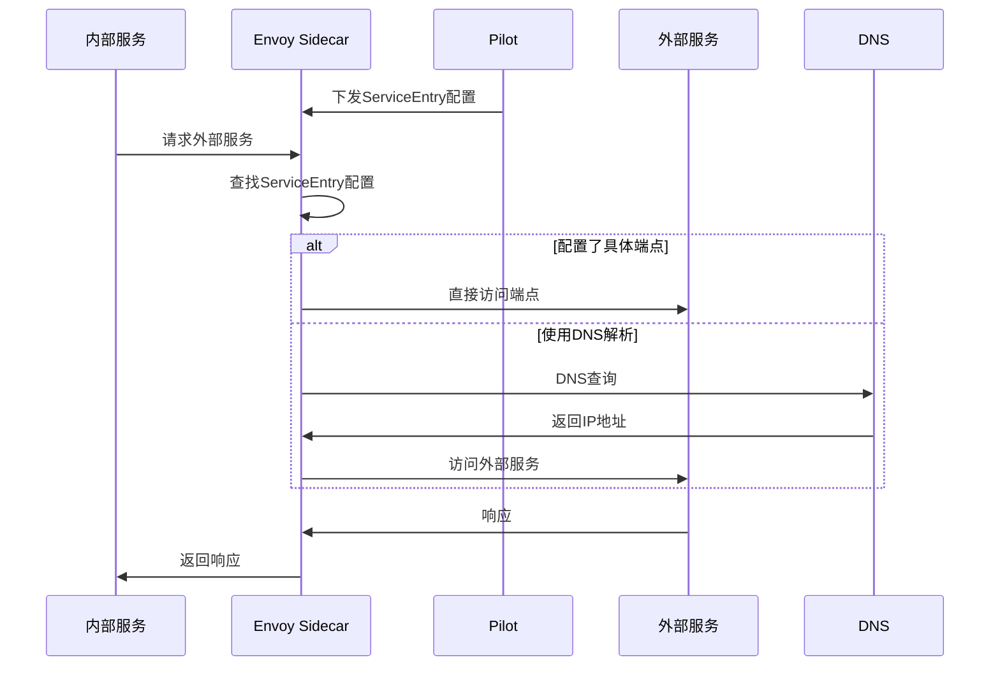
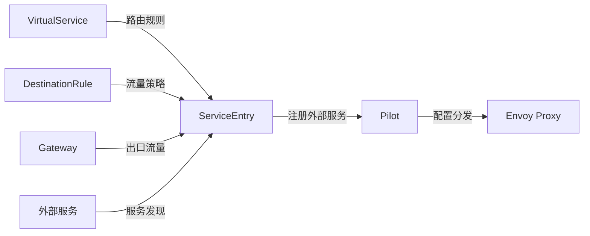
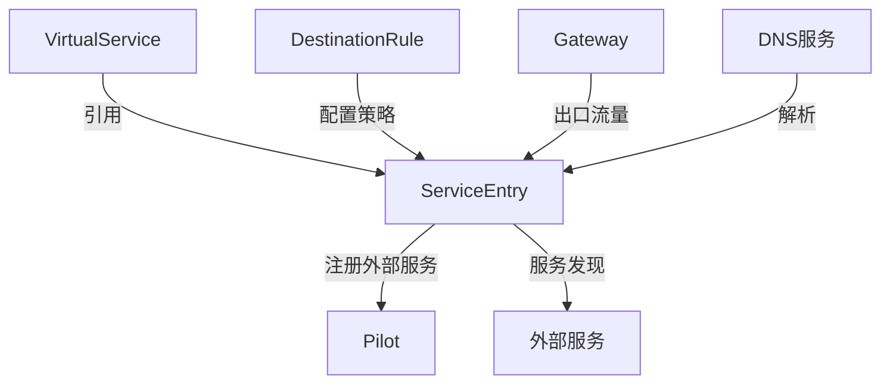

# ServiceEntry

## 概述

ServiceEntry 是 Istio 中用于将外部服务添加到 Istio 内部服务注册表的配置资源。它允许网格内的服务访问和路由到网格外部的服务，就像访问网格内的服务一样。ServiceEntry 是连接内部服务网格和外部服务的桥梁。

### 定义和用途
- **外部服务注册**：将外部服务注册到 Istio 的服务发现系统
- **流量管理**：对外部服务应用 Istio 的流量管理功能
- **可观测性**：为外部服务调用提供监控和追踪
- **安全策略**：对外部服务访问应用安全策略
- **服务抽象**：统一内外部服务的访问接口

### 解决的问题
- **外部依赖管理**：统一管理对外部服务的依赖
- **流量策略应用**：对外部服务应用负载均衡、重试等策略
- **监控盲区**：解决外部服务调用的监控缺失问题
- **网络策略**：实现对外部服务访问的网络策略
- **服务发现统一**：提供统一的服务发现接口

### 使用场景
- 访问外部 API 和第三方服务
- 连接遗留系统和数据库
- 多集群服务互访
- 云服务和 SaaS 服务集成
- 混合云环境的服务集成

## 核心特性

### 主要功能特点
- **多协议支持**：HTTP、HTTPS、TCP、MongoDB、MySQL 等
- **端点定义**：可以指定具体的服务端点
- **位置感知**：支持指定服务的地理位置
- **工作负载选择器**：可以选择特定的工作负载
- **端口配置**：灵活的端口和协议配置

### 技术优势
- **统一管理**：统一内外部服务的管理接口
- **策略应用**：可以对外部服务应用所有 Istio 策略
- **可观测性**：提供完整的监控和追踪能力
- **安全性**：支持 TLS 和认证配置
- **灵活性**：支持多种服务发现模式

### 限制和注意事项
- **配置复杂性**：需要了解外部服务的详细信息
- **维护成本**：需要维护外部服务的端点信息
- **网络依赖**：依赖于网络连通性
- **安全风险**：可能暴露内部网络给外部服务

## 工作原理

### 内部机制说明

ServiceEntry 通过 Pilot 组件将外部服务信息注册到 Istio 的服务注册表中。当网格内的服务需要访问外部服务时，Envoy 代理会根据 ServiceEntry 的配置进行服务发现和路由。

### 数据流程图



### 与其他组件的交互关系



## 配置和使用

### 基础配置

#### 最小可用配置示例

```yaml
apiVersion: networking.istio.io/v1beta1
kind: ServiceEntry
metadata:
  name: external-service
  namespace: default
spec:
  hosts:                            # 服务主机名，必填
  - external-api.example.com
  ports:                            # 端口配置，必填
  - number: 443
    name: https
    protocol: HTTPS
  location: MESH_EXTERNAL           # 服务位置
  resolution: DNS                   # 服务发现方式
```

#### 参数说明

| 参数 | 类型 | 必填 | 描述 | 默认值 |
|------|------|------|------|--------|
| `hosts` | string[] | 是 | 服务主机名列表 | 无 |
| `ports` | Port[] | 否 | 端口配置列表 | 无 |
| `location` | Location | 否 | 服务位置 | MESH_EXTERNAL |
| `resolution` | Resolution | 否 | 服务发现方式 | DNS |
| `addresses` | string[] | 否 | 服务地址列表 | 无 |
| `endpoints` | WorkloadEntry[] | 否 | 服务端点列表 | 无 |

#### 位置和解析模式说明

| 参数值 | 描述 |
|--------|------|
| `MESH_EXTERNAL` | 外部服务，默认值 |
| `MESH_INTERNAL` | 网格内部服务 |
| `DNS` | 使用 DNS 解析 |
| `STATIC` | 使用静态端点 |
| `NONE` | 不进行服务发现 |

#### 默认值和推荐值

- **location**: 默认为 `MESH_EXTERNAL`
- **resolution**: 推荐使用 `DNS` 进行动态解析
- **协议**: 根据实际服务选择合适的协议

### 高级配置

#### 生产环境配置

```yaml
apiVersion: networking.istio.io/v1beta1
kind: ServiceEntry
metadata:
  name: external-database
  namespace: production
spec:
  hosts:
  - database.example.com
  ports:
  - number: 3306
    name: mysql
    protocol: TCP
  - number: 3307
    name: mysql-ssl
    protocol: TLS
  location: MESH_EXTERNAL
  resolution: DNS
  addresses:                        # 可选的虚拟IP地址
  - 240.0.0.1
  endpoints:                        # 静态端点定义
  - address: 192.168.1.100
    ports:
      mysql: 3306
      mysql-ssl: 3307
    labels:
      region: us-west
      zone: us-west-1a
  - address: 192.168.1.101
    ports:
      mysql: 3306
      mysql-ssl: 3307
    labels:
      region: us-west
      zone: us-west-1b
  workloadSelector:                 # 工作负载选择器
    labels:
      app: database-proxy
```

#### 多协议外部服务

```yaml
apiVersion: networking.istio.io/v1beta1
kind: ServiceEntry
metadata:
  name: external-api-multi-protocol
spec:
  hosts:
  - api.example.com
  ports:
  - number: 80
    name: http
    protocol: HTTP
  - number: 443
    name: https
    protocol: HTTPS
  - number: 9090
    name: grpc
    protocol: GRPC
  - number: 6379
    name: redis
    protocol: TCP
  location: MESH_EXTERNAL
  resolution: DNS
```

#### 具有地理位置的服务

```yaml
apiVersion: networking.istio.io/v1beta1
kind: ServiceEntry
metadata:
  name: geo-distributed-service
spec:
  hosts:
  - global-api.example.com
  ports:
  - number: 443
    name: https
    protocol: HTTPS
  location: MESH_EXTERNAL
  resolution: STATIC
  endpoints:
  - address: api-us.example.com
    ports:
      https: 443
    labels:
      region: us-east
      zone: us-east-1
      priority: high
  - address: api-eu.example.com
    ports:
      https: 443
    labels:
      region: eu-west
      zone: eu-west-1
      priority: medium
  - address: api-asia.example.com
    ports:
      https: 443
    labels:
      region: asia-pacific
      zone: ap-southeast-1
      priority: low
```

#### 内部服务扩展

```yaml
apiVersion: networking.istio.io/v1beta1
kind: ServiceEntry
metadata:
  name: internal-service-extension
spec:
  hosts:
  - internal-service.local
  ports:
  - number: 8080
    name: http
    protocol: HTTP
  location: MESH_INTERNAL           # 内部服务
  resolution: STATIC
  endpoints:
  - address: 10.0.1.100
    ports:
      http: 8080
    labels:
      version: v1
      datacenter: dc1
  - address: 10.0.2.100
    ports:
      http: 8080
    labels:
      version: v2
      datacenter: dc2
```

## 使用示例

### 基础使用场景

#### 1. 外部HTTP API访问

```yaml
apiVersion: networking.istio.io/v1beta1
kind: ServiceEntry
metadata:
  name: httpbin-external
spec:
  hosts:
  - httpbin.org
  ports:
  - number: 80
    name: http
    protocol: HTTP
  - number: 443
    name: https
    protocol: HTTPS
  location: MESH_EXTERNAL
  resolution: DNS
---
apiVersion: networking.istio.io/v1beta1
kind: VirtualService
metadata:
  name: httpbin-external
spec:
  hosts:
  - httpbin.org
  http:
  - timeout: 10s                    # 设置超时
    retries:
      attempts: 3
      perTryTimeout: 3s
    route:
    - destination:
        host: httpbin.org
```

**预期结果**: 网格内的服务可以访问 httpbin.org，并应用超时和重试策略。

#### 2. 外部数据库访问

```yaml
apiVersion: networking.istio.io/v1beta1
kind: ServiceEntry
metadata:
  name: external-postgres
spec:
  hosts:
  - postgres.example.com
  ports:
  - number: 5432
    name: postgres
    protocol: TCP
  location: MESH_EXTERNAL
  resolution: DNS
---
apiVersion: networking.istio.io/v1beta1
kind: DestinationRule
metadata:
  name: external-postgres
spec:
  host: postgres.example.com
  trafficPolicy:
    connectionPool:
      tcp:
        maxConnections: 10          # 限制数据库连接数
        connectTimeout: 30s
        keepAlive:
          time: 600s
          interval: 60s
```

**预期结果**: 应用可以访问外部 PostgreSQL 数据库，并应用连接池限制。

#### 3. 第三方服务集成

```yaml
apiVersion: networking.istio.io/v1beta1
kind: ServiceEntry
metadata:
  name: payment-service
spec:
  hosts:
  - api.stripe.com
  ports:
  - number: 443
    name: https
    protocol: HTTPS
  location: MESH_EXTERNAL
  resolution: DNS
---
apiVersion: networking.istio.io/v1beta1
kind: VirtualService
metadata:
  name: payment-service
spec:
  hosts:
  - api.stripe.com
  http:
  - headers:
      request:
        add:
          x-client-version: "v1.0"   # 添加客户端版本头
    route:
    - destination:
        host: api.stripe.com
```

**预期结果**: 应用可以安全地访问 Stripe 支付 API，并添加自定义请求头。

### 高级使用场景

#### 1. 多集群服务访问

```yaml
apiVersion: networking.istio.io/v1beta1
kind: ServiceEntry
metadata:
  name: remote-cluster-service
spec:
  hosts:
  - remote-service.remote-cluster.local
  ports:
  - number: 8080
    name: http
    protocol: HTTP
  location: MESH_EXTERNAL
  resolution: STATIC
  endpoints:
  - address: 10.1.1.100             # 远程集群IP
    ports:
      http: 8080
    labels:
      cluster: remote
      region: us-west
---
apiVersion: networking.istio.io/v1beta1
kind: DestinationRule
metadata:
  name: remote-cluster-service
spec:
  host: remote-service.remote-cluster.local
  trafficPolicy:
    tls:
      mode: ISTIO_MUTUAL            # 跨集群mTLS
```

**预期结果**: 实现跨集群的服务访问，并保持 mTLS 安全。

#### 2. 遗留系统集成

```yaml
apiVersion: networking.istio.io/v1beta1
kind: ServiceEntry
metadata:
  name: legacy-system
spec:
  hosts:
  - legacy.internal.com
  ports:
  - number: 8080
    name: http
    protocol: HTTP
  - number: 8443
    name: https
    protocol: HTTPS
  location: MESH_EXTERNAL
  resolution: STATIC
  endpoints:
  - address: 192.168.10.100
    ports:
      http: 8080
      https: 8443
    labels:
      system: legacy
      criticality: high
---
apiVersion: networking.istio.io/v1beta1
kind: VirtualService
metadata:
  name: legacy-system
spec:
  hosts:
  - legacy.internal.com
  http:
  - match:
    - uri:
        prefix: /api/v1
    rewrite:
      uri: /legacy-api              # 路径重写适配遗留系统
    route:
    - destination:
        host: legacy.internal.com
        port:
          number: 8080
```

**预期结果**: 现代微服务可以访问遗留系统，并进行必要的路径适配。

#### 3. 基于地理位置的路由

```yaml
apiVersion: networking.istio.io/v1beta1
kind: ServiceEntry
metadata:
  name: cdn-service
spec:
  hosts:
  - cdn.example.com
  ports:
  - number: 443
    name: https
    protocol: HTTPS
  location: MESH_EXTERNAL
  resolution: STATIC
  endpoints:
  - address: cdn-us.example.com
    ports:
      https: 443
    labels:
      region: us
  - address: cdn-eu.example.com
    ports:
      https: 443
    labels:
      region: eu
  - address: cdn-asia.example.com
    ports:
      https: 443
    labels:
      region: asia
---
apiVersion: networking.istio.io/v1beta1
kind: VirtualService
metadata:
  name: cdn-service
spec:
  hosts:
  - cdn.example.com
  http:
  - match:
    - headers:
        x-user-region:
          exact: us
    route:
    - destination:
        host: cdn.example.com
        subset: us-region
  - match:
    - headers:
        x-user-region:
          exact: eu
    route:
    - destination:
        host: cdn.example.com
        subset: eu-region
  - route:                          # 默认路由
    - destination:
        host: cdn.example.com
        subset: us-region
---
apiVersion: networking.istio.io/v1beta1
kind: DestinationRule
metadata:
  name: cdn-service
spec:
  host: cdn.example.com
  subsets:
  - name: us-region
    labels:
      region: us
  - name: eu-region
    labels:
      region: eu
  - name: asia-region
    labels:
      region: asia
```

**预期结果**: 根据用户地理位置自动路由到最近的 CDN 节点。

#### 4. 外部服务健康检查

```yaml
apiVersion: networking.istio.io/v1beta1
kind: ServiceEntry
metadata:
  name: monitored-external-service
spec:
  hosts:
  - external-api.example.com
  ports:
  - number: 443
    name: https
    protocol: HTTPS
  location: MESH_EXTERNAL
  resolution: DNS
---
apiVersion: networking.istio.io/v1beta1
kind: DestinationRule
metadata:
  name: monitored-external-service
spec:
  host: external-api.example.com
  trafficPolicy:
    healthCheck:                    # 健康检查配置
      interval: 30s
      timeout: 5s
      unhealthyThreshold: 3
      healthyThreshold: 2
      path: /health
      httpHeaders:
      - name: x-health-check
        value: istio
    circuitBreaker:                 # 断路器配置
      consecutiveGatewayErrors: 5
      interval: 30s
      baseEjectionTime: 30s
      maxEjectionPercent: 50
```

**预期结果**: 对外部服务进行健康监控，并在服务不可用时自动断路。

## 故障排除

### 常见错误和解决方法

#### 1. 外部服务无法访问

**症状**: 请求外部服务时出现连接超时或拒绝

**可能原因**:
- ServiceEntry 配置错误
- DNS 解析失败
- 网络连通性问题
- 防火墙阻塞

**解决方法**:
```bash
# 检查ServiceEntry配置
kubectl get serviceentry external-service -o yaml

# 测试DNS解析
nslookup external-api.example.com

# 检查网络连通性
kubectl exec -it test-pod -- curl -v https://external-api.example.com

# 查看Envoy配置
istioctl proxy-config cluster productpage-v1-123456.default | grep external-api
```

#### 2. 服务发现问题

**症状**: 服务间歇性不可用或负载均衡不工作

**解决方法**:
```bash
# 检查端点配置
istioctl proxy-config endpoints productpage-v1-123456.default | grep external-api

# 验证解析模式
kubectl get serviceentry external-service -o jsonpath='{.spec.resolution}'

# 检查地址配置
kubectl get serviceentry external-service -o jsonpath='{.spec.addresses}'
```

#### 3. TLS连接问题

**症状**: HTTPS 外部服务访问失败

**解决方法**:
```bash
# 检查TLS配置
istioctl proxy-config cluster productpage-v1-123456.default -o json | grep -A 10 external-api

# 测试TLS连接
openssl s_client -connect external-api.example.com:443

# 验证证书
kubectl exec -it test-pod -- openssl s_client -connect external-api.example.com:443 -showcerts
```

#### 4. 策略不生效

**症状**: VirtualService 或 DestinationRule 策略不生效

**解决方法**:
```bash
# 检查VirtualService绑定
kubectl get virtualservice external-service -o yaml

# 验证DestinationRule配置
kubectl get destinationrule external-service -o yaml

# 分析配置问题
istioctl analyze
```

### 调试技巧

#### 1. 配置验证

```bash
# 验证ServiceEntry语法
istioctl validate -f service-entry.yaml

# 检查服务发现
istioctl proxy-config cluster productpage-v1-123456.default --fqdn external-api.example.com

# 查看所有外部服务
kubectl get serviceentry --all-namespaces
```

#### 2. 网络连通性测试

```bash
# 从Pod内部测试连通性
kubectl exec -it test-pod -- wget -qO- http://external-api.example.com/health

# 使用curl测试详细信息
kubectl exec -it test-pod -- curl -v -H "Host: external-api.example.com" https://external-api.example.com

# 检查代理统计信息
kubectl exec productpage-v1-123456 -c istio-proxy -- curl localhost:15000/stats | grep external-api
```

#### 3. 监控和日志

```bash
# 查看访问日志
kubectl logs productpage-v1-123456 -c istio-proxy | grep external-api

# 检查Pilot日志
kubectl logs -n istio-system -l app=istiod | grep serviceentry

# 查看配置分发状态
istioctl proxy-status
```

### 监控和观察方法

#### 1. 关键指标监控

- `istio_requests_total{destination_app="unknown"}`: 外部服务请求总数
- `istio_request_duration_milliseconds{destination_app="unknown"}`: 外部服务请求延迟
- `envoy_cluster_upstream_cx_connect_fail`: 外部服务连接失败次数
- `envoy_cluster_upstream_rq_timeout`: 外部服务请求超时次数

#### 2. 健康状态监控

```bash
# 监控外部服务健康状态
kubectl exec productpage-v1-123456 -c istio-proxy -- curl localhost:15000/clusters | grep external-api

# 检查断路器状态
kubectl exec productpage-v1-123456 -c istio-proxy -- curl localhost:15000/stats | grep external-api | grep outlier
```

#### 3. 告警配置

```yaml
# Prometheus告警规则
groups:
- name: serviceentry.rules
  rules:
  - alert: ExternalServiceDown
    expr: sum(rate(envoy_cluster_upstream_cx_connect_fail[5m])) by (cluster_name) > 0.1
    labels:
      severity: warning
    annotations:
      summary: "外部服务连接失败率过高"
  
  - alert: ExternalServiceHighLatency
    expr: histogram_quantile(0.99, sum(rate(istio_request_duration_milliseconds_bucket{destination_app="unknown"}[5m])) by (le)) > 5000
    labels:
      severity: warning
    annotations:
      summary: "外部服务响应延迟过高"
```

## 相关概念

### 关联的其他核心概念

- **[VirtualService](./virtual-service.md)**: 为外部服务配置路由规则
- **[DestinationRule](./destination-rule.md)**: 为外部服务配置流量策略
- **[Gateway](./gateway.md)**: 配置出口网关访问外部服务

### 依赖关系说明



### 配合使用的组件

1. **与 VirtualService 配合**:
   ```yaml
   # VirtualService引用ServiceEntry中的外部服务
   spec:
     hosts:
     - external-api.example.com    # ServiceEntry中定义的host
   ```

2. **与 DestinationRule 配合**:
   ```yaml
   # DestinationRule为外部服务配置策略
   spec:
     host: external-api.example.com  # ServiceEntry中定义的host
     trafficPolicy:
       connectionPool:
         tcp:
           maxConnections: 10
   ```

## 参考资料

### 官方文档链接
- [Istio ServiceEntry 官方文档](https://istio.io/latest/docs/reference/config/networking/service-entry/)
- [外部服务访问指南](https://istio.io/latest/docs/tasks/traffic-management/egress/)

### 深入学习资源
- [Egress 流量管理](https://istio.io/latest/docs/concepts/traffic-management/#egress)
- [多集群部署指南](https://istio.io/latest/docs/setup/install/multicluster/)

### 社区最佳实践
- [ServiceEntry 最佳实践](https://istio.io/latest/docs/ops/best-practices/traffic-management/)
- [外部服务集成案例](https://github.com/istio/istio/tree/master/samples)
