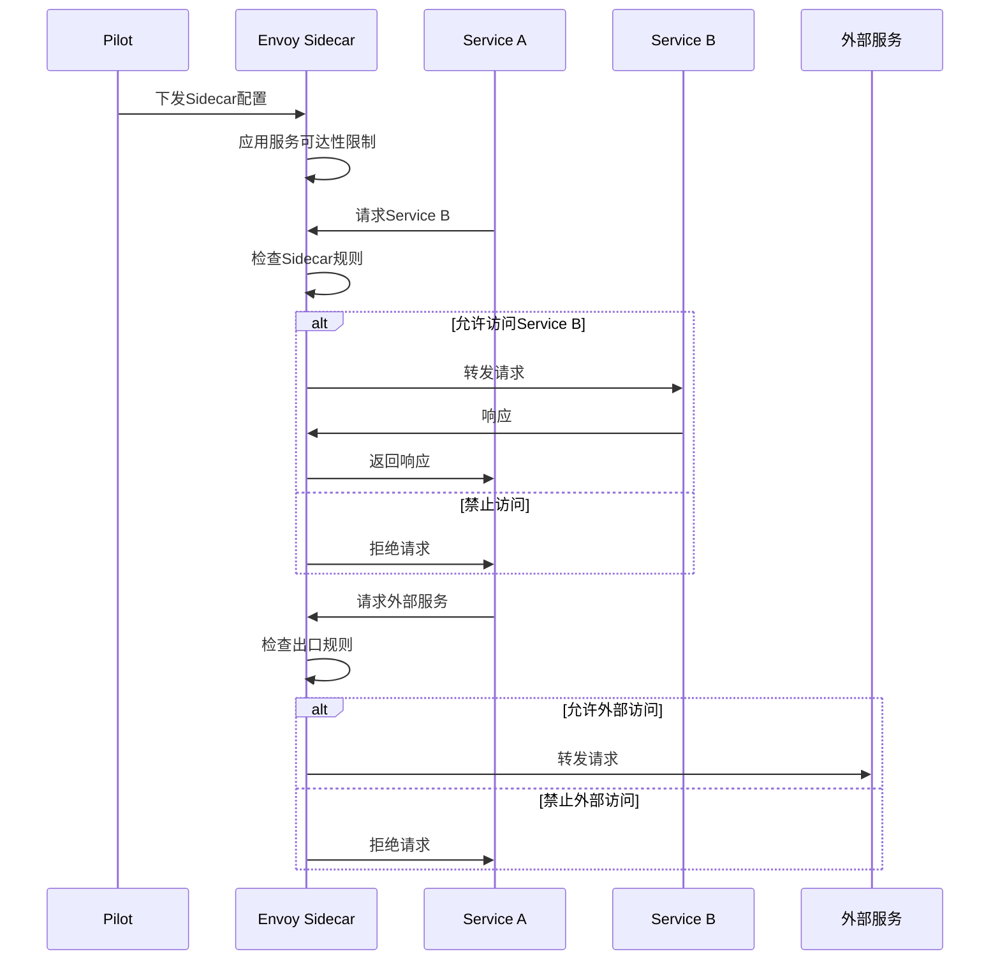
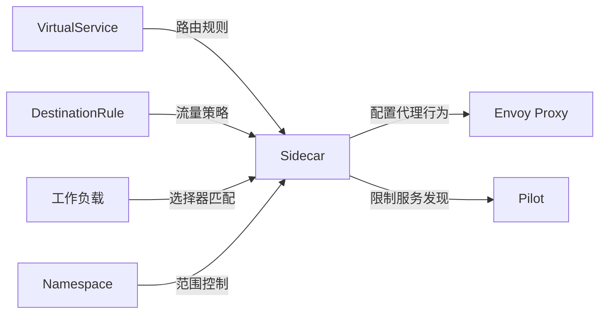
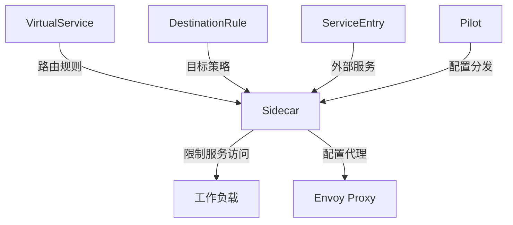

# Sidecar

## 概述

Sidecar 是 Istio 中用于配置代理行为的资源，它允许细粒度地控制 Envoy Sidecar 代理的配置。通过 Sidecar 配置，可以限制代理可以访问的服务集合，优化内存使用，并提高性能。Sidecar 配置主要用于大规模部署中的性能优化和安全策略实施。

### 定义和用途
- **代理行为控制**：精确控制 Sidecar 代理的行为和配置
- **服务可达性限制**：限制代理可以访问的服务范围
- **资源优化**：减少代理的内存和 CPU 使用
- **安全边界**：实现细粒度的网络访问控制
- **性能调优**：优化大规模环境下的代理性能

### 解决的问题
- **内存占用过高**：在大规模环境中减少代理的内存使用
- **配置传播开销**：减少不必要的配置同步
- **网络访问控制**：实现零信任网络模型
- **性能优化**：提高代理的响应速度和吞吐量
- **运维复杂性**：简化大规模环境的配置管理

### 使用场景
- 大规模微服务环境的性能优化
- 多租户环境的网络隔离
- 敏感服务的访问控制
- 网络分区和边界控制
- 代理资源使用优化

## 核心特性

### 主要功能特点
- **选择性服务发现**：只发现需要的服务，减少配置开销
- **出口流量控制**：控制代理可以访问的外部服务
- **入口流量配置**：配置代理接受的入口连接
- **工作负载选择器**：精确选择应用配置的工作负载
- **命名空间隔离**：实现命名空间级别的网络隔离

### 技术优势
- **性能提升**：显著减少大规模环境下的资源使用
- **安全增强**：提供更细粒度的访问控制
- **配置优化**：减少不必要的配置传播
- **内存效率**：优化代理的内存使用模式
- **网络隔离**：实现强网络边界控制

### 限制和注意事项
- **配置复杂性**：需要深入理解服务依赖关系
- **维护成本**：需要持续维护服务访问列表
- **故障风险**：错误配置可能导致服务不可达
- **调试困难**：可能增加网络问题的调试难度

## 工作原理

### 内部机制说明

Sidecar 配置通过 Pilot 组件下发到对应的 Envoy 代理。代理根据 Sidecar 配置决定哪些服务需要建立集群，哪些流量可以通过，从而实现精细的流量控制和资源优化。

### 数据流程图



### 与其他组件的交互关系



## 配置和使用

### 基础配置

#### 最小可用配置示例

```yaml
apiVersion: networking.istio.io/v1beta1
kind: Sidecar
metadata:
  name: default
  namespace: production
spec:
  workloadSelector:                 # 工作负载选择器
    labels:
      app: productpage
  egress:                           # 出口配置
  - hosts:
    - "./*"                         # 同命名空间服务
    - "istio-system/*"              # istio-system命名空间服务
```

#### 参数说明

| 参数 | 类型 | 必填 | 描述 | 默认值 |
|------|------|------|------|--------|
| `workloadSelector` | WorkloadSelector | 否 | 工作负载选择器，不指定则应用于所有工作负载 | 无 |
| `ingress` | IstioIngressListener[] | 否 | 入口监听器配置 | 无 |
| `egress` | IstioEgressListener[] | 否 | 出口监听器配置 | 无 |
| `outboundTrafficPolicy` | OutboundTrafficPolicy | 否 | 出站流量策略 | 无 |

#### Egress 配置说明

| 参数 | 类型 | 必填 | 描述 | 默认值 |
|------|------|------|------|--------|
| `port` | Port | 否 | 端口配置 | 无 |
| `bind` | string | 否 | 绑定地址 | 无 |
| `captureMode` | CaptureMode | 否 | 流量捕获模式 | DEFAULT |
| `hosts` | string[] | 是 | 允许访问的主机列表 | 无 |

#### 默认值和推荐值

- **hosts**: 推荐使用最小权限原则，只允许必要的服务访问
- **captureMode**: 默认为 `DEFAULT`，通常无需修改
- **outboundTrafficPolicy**: 建议设置为 `REGISTRY_ONLY` 以增强安全性

### 高级配置

#### 生产环境配置

```yaml
apiVersion: networking.istio.io/v1beta1
kind: Sidecar
metadata:
  name: productpage-sidecar
  namespace: production
spec:
  workloadSelector:
    labels:
      app: productpage
      version: v1
  ingress:                          # 入口配置
  - port:
      number: 9080
      protocol: HTTP
      name: http
    defaultEndpoint: 127.0.0.1:9080 # 默认端点
    captureMode: IPTABLES           # 流量捕获模式
  egress:
  - port:
      number: 80
      protocol: HTTP
      name: http
    hosts:
    - "./reviews"                   # 同命名空间的reviews服务
    - "./details"                   # 同命名空间的details服务
    - "./ratings"                   # 同命名空间的ratings服务
  - port:
      number: 443
      protocol: HTTPS
      name: https
    hosts:
    - "external-apis/payment-service" # 外部命名空间的支付服务
    - "monitoring/prometheus"        # 监控命名空间的prometheus
  - hosts:
    - "istio-system/*"              # istio-system命名空间的所有服务
  outboundTrafficPolicy:
    mode: REGISTRY_ONLY             # 只允许注册表中的服务
```

#### 网络隔离配置

```yaml
apiVersion: networking.istio.io/v1beta1
kind: Sidecar
metadata:
  name: secure-microservice
  namespace: secure
spec:
  workloadSelector:
    labels:
      security-level: high
  egress:
  - hosts:
    - "./secure-db"                 # 只允许访问安全数据库
    - "./secure-cache"              # 只允许访问安全缓存
    - "istio-system/istio-proxy"    # 允许访问Istio代理
  outboundTrafficPolicy:
    mode: REGISTRY_ONLY             # 严格模式，只允许注册的服务
    egressProxy:                    # 出口代理配置
      host: egress-gateway.istio-system.svc.cluster.local
      port:
        number: 80
```

#### 性能优化配置

```yaml
apiVersion: networking.istio.io/v1beta1
kind: Sidecar
metadata:
  name: high-performance
  namespace: production
spec:
  workloadSelector:
    labels:
      performance-tier: high
  egress:
  # 明确指定需要访问的服务，减少配置开销
  - port:
      number: 80
      protocol: HTTP
    hosts:
    - "./api-gateway"               # 只访问API网关
  - port:
      number: 6379
      protocol: TCP
    hosts:
    - "./redis-cluster"             # 只访问Redis集群
  - port:
      number: 3306
      protocol: TCP
    hosts:
    - "database/mysql-primary"      # 只访问主数据库
  outboundTrafficPolicy:
    mode: REGISTRY_ONLY             # 最小配置模式
```

#### 多租户隔离配置

```yaml
apiVersion: networking.istio.io/v1beta1
kind: Sidecar
metadata:
  name: tenant-a-isolation
  namespace: tenant-a
spec:
  workloadSelector:
    labels:
      tenant: tenant-a
  ingress:
  - port:
      number: 8080
      protocol: HTTP
    defaultEndpoint: 127.0.0.1:8080
    captureMode: IPTABLES
  egress:
  - hosts:
    - "./*"                         # 同租户命名空间内的所有服务
    - "shared-services/common-api"  # 共享服务命名空间的通用API
    - "shared-services/auth-service" # 共享的认证服务
  outboundTrafficPolicy:
    mode: REGISTRY_ONLY
---
apiVersion: networking.istio.io/v1beta1
kind: Sidecar
metadata:
  name: tenant-b-isolation
  namespace: tenant-b
spec:
  workloadSelector:
    labels:
      tenant: tenant-b
  egress:
  - hosts:
    - "./*"                         # 同租户命名空间内的所有服务
    - "shared-services/common-api"  # 共享服务命名空间的通用API
    - "shared-services/auth-service" # 共享的认证服务
  outboundTrafficPolicy:
    mode: REGISTRY_ONLY
```

## 使用示例

### 基础使用场景

#### 1. 命名空间级别隔离

```yaml
apiVersion: networking.istio.io/v1beta1
kind: Sidecar
metadata:
  name: namespace-isolation
  namespace: development
spec:
  # 不指定workloadSelector，应用于整个命名空间
  egress:
  - hosts:
    - "./*"                         # 只能访问同命名空间的服务
    - "istio-system/*"              # 允许访问Istio系统服务
    - "kube-system/kube-dns"        # 允许DNS解析
  outboundTrafficPolicy:
    mode: REGISTRY_ONLY
```

**预期结果**: development 命名空间的所有服务只能访问同命名空间和系统命名空间的服务。

#### 2. 服务级别访问控制

```yaml
apiVersion: networking.istio.io/v1beta1
kind: Sidecar
metadata:
  name: reviews-access-control
  namespace: default
spec:
  workloadSelector:
    labels:
      app: reviews
  egress:
  - hosts:
    - "./ratings"                   # 只允许访问ratings服务
  outboundTrafficPolicy:
    mode: REGISTRY_ONLY
```

**预期结果**: reviews 服务只能访问 ratings 服务，无法访问其他服务。

#### 3. 外部服务访问限制

```yaml
apiVersion: networking.istio.io/v1beta1
kind: Sidecar
metadata:
  name: external-access-control
  namespace: production
spec:
  workloadSelector:
    labels:
      app: payment-service
  egress:
  - hosts:
    - "./*"                         # 内部服务
    - "external-apis/stripe-api"    # 只允许访问Stripe API
    - "external-apis/paypal-api"    # 只允许访问PayPal API
  outboundTrafficPolicy:
    mode: REGISTRY_ONLY
```

**预期结果**: payment-service 只能访问指定的外部支付 API，提高安全性。

### 高级使用场景

#### 1. 基于工作负载的细粒度控制

```yaml
apiVersion: networking.istio.io/v1beta1
kind: Sidecar
metadata:
  name: frontend-sidecar
  namespace: production
spec:
  workloadSelector:
    labels:
      app: frontend
      tier: web
  ingress:
  - port:
      number: 80
      protocol: HTTP
    defaultEndpoint: 127.0.0.1:8080
  egress:
  - port:
      number: 80
      protocol: HTTP
    hosts:
    - "./backend-api"               # 只访问后端API
  - port:
      number: 443
      protocol: HTTPS
    hosts:
    - "cdn/static-assets"           # 只访问CDN静态资源
  outboundTrafficPolicy:
    mode: REGISTRY_ONLY
---
apiVersion: networking.istio.io/v1beta1
kind: Sidecar
metadata:
  name: backend-sidecar
  namespace: production
spec:
  workloadSelector:
    labels:
      app: backend
      tier: api
  egress:
  - hosts:
    - "./database"                  # 只访问数据库
    - "./cache"                     # 只访问缓存
    - "external-apis/payment-gateway" # 只访问支付网关
  outboundTrafficPolicy:
    mode: REGISTRY_ONLY
```

**预期结果**: 前端和后端服务具有不同的访问权限，实现分层安全架构。

#### 2. 出口代理配置

```yaml
apiVersion: networking.istio.io/v1beta1
kind: Sidecar
metadata:
  name: egress-proxy-config
  namespace: production
spec:
  workloadSelector:
    labels:
      egress-required: "true"
  egress:
  - hosts:
    - "./*"                         # 内部服务直接访问
  - hosts:
    - "*/*"                         # 外部服务通过代理
  outboundTrafficPolicy:
    mode: ALLOW_ANY                 # 允许任何流量
    egressProxy:                    # 但通过出口代理
      host: istio-egressgateway.istio-system.svc.cluster.local
      port:
        number: 80
```

**预期结果**: 所有外部流量都通过出口网关进行代理，便于监控和控制。

#### 3. 分环境访问控制

```yaml
# 开发环境 - 宽松策略
apiVersion: networking.istio.io/v1beta1
kind: Sidecar
metadata:
  name: dev-environment
  namespace: development
spec:
  egress:
  - hosts:
    - "./*"                         # 开发环境内部服务
    - "shared/*"                    # 共享服务
    - "external-dev/*"              # 开发环境外部服务
  outboundTrafficPolicy:
    mode: ALLOW_ANY                 # 开发环境允许任何访问
---
# 生产环境 - 严格策略
apiVersion: networking.istio.io/v1beta1
kind: Sidecar
metadata:
  name: prod-environment
  namespace: production
spec:
  egress:
  - hosts:
    - "./*"                         # 生产环境内部服务
    - "shared/auth-service"         # 只允许访问认证服务
    - "external-prod/payment-api"   # 只允许访问生产支付API
  outboundTrafficPolicy:
    mode: REGISTRY_ONLY             # 生产环境严格控制
```

**预期结果**: 不同环境具有不同的安全策略，生产环境更严格。

#### 4. 渐进式流量控制

```yaml
apiVersion: networking.istio.io/v1beta1
kind: Sidecar
metadata:
  name: canary-sidecar
  namespace: production
spec:
  workloadSelector:
    labels:
      version: canary
  egress:
  - hosts:
    - "./reviews"                   # 金丝雀版本只访问reviews
    - "./ratings"                   # 和ratings服务
    - "monitoring/*"                # 以及监控服务
  outboundTrafficPolicy:
    mode: REGISTRY_ONLY
---
apiVersion: networking.istio.io/v1beta1
kind: Sidecar
metadata:
  name: stable-sidecar
  namespace: production
spec:
  workloadSelector:
    labels:
      version: stable
  egress:
  - hosts:
    - "./*"                         # 稳定版本可以访问所有服务
    - "external-apis/*"             # 以及外部API
  outboundTrafficPolicy:
    mode: REGISTRY_ONLY
```

**预期结果**: 金丝雀版本的访问权限受限，降低新版本的风险。

## 故障排除

### 常见错误和解决方法

#### 1. 服务不可达错误

**症状**: 应用 Sidecar 配置后某些服务无法访问

**可能原因**:
- hosts 列表中缺少目标服务
- outboundTrafficPolicy 设置为 REGISTRY_ONLY 但服务未注册
- 工作负载选择器配置错误

**解决方法**:
```bash
# 检查Sidecar配置
kubectl get sidecar productpage-sidecar -o yaml

# 检查服务是否在允许列表中
kubectl get sidecar productpage-sidecar -o jsonpath='{.spec.egress[*].hosts}'

# 检查服务注册状态
kubectl get serviceentry --all-namespaces

# 验证工作负载选择器
kubectl get pods -l app=productpage --show-labels
```

#### 2. 配置不生效

**症状**: Sidecar 配置存在但流量行为未改变

**解决方法**:
```bash
# 检查代理配置
istioctl proxy-config cluster productpage-v1-123456.default

# 验证配置分发
istioctl proxy-status

# 检查Pilot日志
kubectl logs -n istio-system -l app=istiod | grep sidecar

# 强制重新加载配置
kubectl rollout restart deployment productpage
```

#### 3. 性能下降

**症状**: 应用 Sidecar 配置后性能下降

**解决方法**:
```bash
# 检查代理资源使用
kubectl top pods -l app=productpage

# 查看代理统计信息
kubectl exec productpage-v1-123456 -c istio-proxy -- curl localhost:15000/stats

# 检查配置复杂度
kubectl get sidecar productpage-sidecar -o yaml | grep -c hosts
```

#### 4. 出口流量被阻塞

**症状**: 无法访问外部服务或其他命名空间的服务

**解决方法**:
```bash
# 检查出口策略
kubectl get sidecar productpage-sidecar -o jsonpath='{.spec.outboundTrafficPolicy.mode}'

# 测试外部连接
kubectl exec -it productpage-v1-123456 -- curl -v https://httpbin.org/ip

# 检查出口配置
kubectl get sidecar productpage-sidecar -o jsonpath='{.spec.egress[*].hosts}'
```

### 调试技巧

#### 1. 配置验证

```bash
# 验证Sidecar语法
istioctl validate -f sidecar.yaml

# 检查配置生效范围
istioctl proxy-config cluster productpage-v1-123456.default --fqdn reviews.default.svc.cluster.local

# 分析配置问题
istioctl analyze --all-namespaces
```

#### 2. 流量分析

```bash
# 查看代理监听器
istioctl proxy-config listeners productpage-v1-123456.default

# 查看路由配置
istioctl proxy-config routes productpage-v1-123456.default

# 查看集群配置
istioctl proxy-config cluster productpage-v1-123456.default
```

#### 3. 实时监控

```bash
# 监控连接状态
kubectl exec productpage-v1-123456 -c istio-proxy -- curl localhost:15000/clusters

# 查看访问日志
kubectl logs productpage-v1-123456 -c istio-proxy | tail -f

# 检查代理健康状态
kubectl exec productpage-v1-123456 -c istio-proxy -- curl localhost:15000/ready
```

### 监控和观察方法

#### 1. 关键指标监控

- `envoy_cluster_upstream_cx_total`: 上游连接总数
- `envoy_cluster_membership_total`: 集群成员总数
- `envoy_server_memory_allocated`: 代理内存使用量
- `pilot_xds_config_size_bytes`: 配置大小

#### 2. 配置效果监控

```bash
# 监控配置分发状态
istioctl proxy-status | grep productpage

# 检查集群数量变化
istioctl proxy-config cluster productpage-v1-123456.default | wc -l

# 监控内存使用
kubectl exec productpage-v1-123456 -c istio-proxy -- curl localhost:15000/memory
```

#### 3. 告警配置

```yaml
# Prometheus告警规则
groups:
- name: sidecar.rules
  rules:
  - alert: SidecarHighMemoryUsage
    expr: container_memory_usage_bytes{container="istio-proxy"} > 500000000
    labels:
      severity: warning
    annotations:
      summary: "Sidecar代理内存使用过高"
  
  - alert: SidecarConfigurationError
    expr: increase(pilot_xds_config_size_bytes[5m]) > 1000000
    labels:
      severity: warning
    annotations:
      summary: "Sidecar配置大小异常增长"
```

## 相关概念

### 关联的其他核心概念

- **[VirtualService](./virtual-service.md)**: 在 Sidecar 允许的服务范围内定义路由规则
- **[DestinationRule](./destination-rule.md)**: 为 Sidecar 允许的目标服务配置策略
- **[ServiceEntry](./service-entry.md)**: 需要在 Sidecar 的 hosts 列表中包含外部服务

### 依赖关系说明



### 配合使用的组件

1. **与 VirtualService 配合**:
   ```yaml
   # Sidecar必须允许VirtualService中引用的服务
   egress:
   - hosts:
     - "./reviews"  # VirtualService中路由的目标服务
   ```

2. **与 ServiceEntry 配合**:
   ```yaml
   # Sidecar需要包含ServiceEntry定义的外部服务
   egress:
   - hosts:
     - "external-apis/payment-service"  # ServiceEntry中的外部服务
   ```

## 参考资料

### 官方文档链接
- [Istio Sidecar 官方文档](https://istio.io/latest/docs/reference/config/networking/sidecar/)
- [Sidecar 配置最佳实践](https://istio.io/latest/docs/ops/best-practices/traffic-management/)

### 深入学习资源
- [服务网格性能优化](https://istio.io/latest/docs/ops/deployment/performance-and-scalability/)
- [大规模部署指南](https://istio.io/latest/docs/ops/deployment/deployment-models/)

### 社区最佳实践
- [Sidecar 配置模式](https://github.com/istio/istio/tree/master/samples)
- [性能调优案例](https://istio.io/latest/docs/ops/common-problems/network-issues/)
