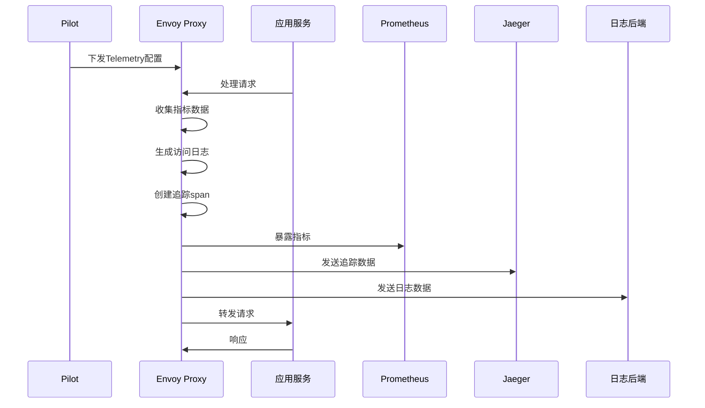
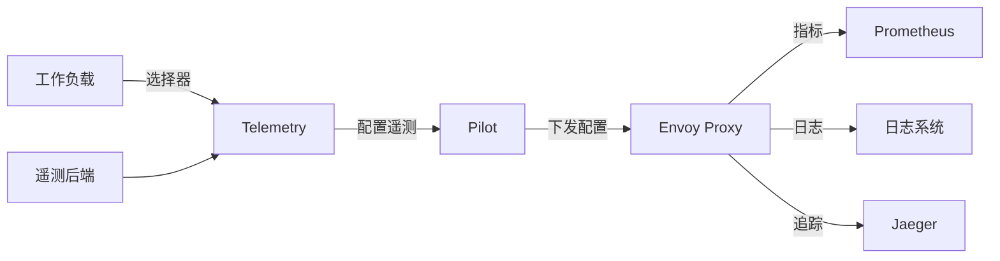
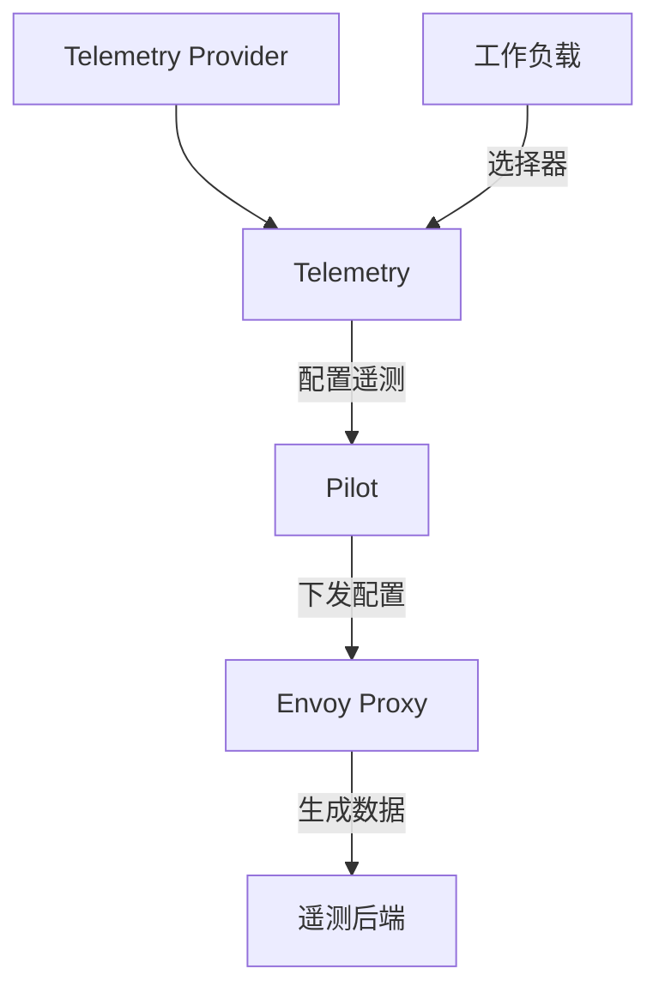

# Telemetry

## 概述

Telemetry 是 Istio 中用于配置遥测数据收集的资源。它提供了统一的接口来配置指标、日志、分布式追踪等可观测性数据的收集、处理和导出。Telemetry 资源使得用户可以精细地控制哪些数据被收集以及如何处理这些数据。

### 定义和用途
- **指标配置**：自定义和配置 Prometheus 指标的收集
- **日志配置**：配置访问日志的格式和输出
- **追踪配置**：配置分布式追踪的采样和导出
- **数据过滤**：选择性地收集和导出遥测数据
- **性能优化**：通过配置减少不必要的遥测开销

### 解决的问题
- **数据噪声**：过滤掉不需要的遥测数据
- **性能开销**：减少遥测收集对性能的影响
- **存储成本**：控制遥测数据的存储量
- **定制需求**：满足特定的监控和观察需求
- **合规要求**：符合数据隐私和安全要求

### 使用场景
- 自定义业务指标收集
- 配置详细的访问日志
- 优化分布式追踪采样
- 实现合规的日志脱敏
- 性能监控和调优

## 核心特性

### 主要功能特点
- **多种数据类型**：支持指标、日志、追踪的统一配置
- **选择性收集**：基于条件选择性地收集数据
- **数据转换**：支持数据的过滤、转换和增强
- **多后端支持**：支持多种遥测后端和格式
- **工作负载选择**：可以针对特定工作负载配置

### 技术优势
- **统一配置**：单一接口管理所有遥测配置
- **高度可定制**：灵活的配置选项满足各种需求
- **性能友好**：优化的数据收集减少性能影响
- **标准兼容**：支持 OpenTelemetry 等标准
- **动态配置**：运行时动态调整遥测配置

### 限制和注意事项
- **配置复杂性**：高级配置可能比较复杂
- **性能影响**：不当配置可能影响系统性能
- **存储需求**：大量遥测数据需要足够的存储空间
- **网络开销**：数据导出可能增加网络流量

## 工作原理

### 内部机制说明

Telemetry 配置通过 Pilot 组件下发到 Envoy 代理，代理根据配置收集指标、生成日志、采样追踪数据，并将数据发送到配置的后端系统。

### 数据流程图



### 与其他组件的交互关系



## 配置和使用

### 基础配置

#### 最小可用配置示例

```yaml
apiVersion: telemetry.istio.io/v1alpha1
kind: Telemetry
metadata:
  name: basic-metrics
  namespace: default
spec:
  metrics:                          # 指标配置
  - providers:
    - name: prometheus
  accessLogging:                    # 访问日志配置
  - providers:
    - name: otel
```

#### 参数说明

| 参数 | 类型 | 必填 | 描述 | 默认值 |
|------|------|------|------|--------|
| `selector` | WorkloadSelector | 否 | 工作负载选择器 | 所有工作负载 |
| `metrics` | MetricsConfig[] | 否 | 指标配置列表 | 无 |
| `accessLogging` | AccessLogging[] | 否 | 访问日志配置列表 | 无 |
| `tracing` | Tracing[] | 否 | 分布式追踪配置列表 | 无 |

#### Metrics 配置说明

| 参数 | 类型 | 必填 | 描述 | 默认值 |
|------|------|------|------|--------|
| `providers` | ProviderRef[] | 否 | 指标提供者列表 | 默认提供者 |
| `overrides` | MetricOverride[] | 否 | 指标覆盖配置 | 无 |
| `disabled` | bool | 否 | 是否禁用指标收集 | false |

#### 默认值和推荐值

- **providers**: 推荐使用 prometheus 作为指标提供者
- **accessLogging**: 建议启用访问日志进行调试
- **tracing**: 生产环境建议设置适当的采样率

### 高级配置

#### 自定义指标配置

```yaml
apiVersion: telemetry.istio.io/v1alpha1
kind: Telemetry
metadata:
  name: custom-metrics
  namespace: production
spec:
  selector:
    matchLabels:
      app: productpage
  metrics:
  - providers:
    - name: prometheus
  - overrides:
    - match:
        metric: ALL_METRICS          # 应用于所有指标
      operation: UPSERT
      value:
        dimensions:
          source_version: "source.labels['version'] | 'unknown'"
          custom_header: "request.headers['x-custom-header'] | 'none'"
        tags:
          environment: production
    - match:
        metric: requests_total       # 特定指标配置
      operation: UPSERT
      value:
        dimensions:
          user_id: "request.headers['x-user-id'] | 'anonymous'"
          tenant_id: "request.headers['x-tenant-id'] | 'default'"
        unit: UNSPECIFIED
  - providers:
    - name: stackdriver           # 额外的指标提供者
  - overrides:
    - match:
        metric: request_duration_milliseconds
      operation: UPSERT
      value:
        dimensions:
          response_code_class: |
            has(response.code) ? (
              response.code >= 200 && response.code < 300 ? "2xx" :
              response.code >= 300 && response.code < 400 ? "3xx" :
              response.code >= 400 && response.code < 500 ? "4xx" :
              response.code >= 500 ? "5xx" : "unknown"
            ) : "unknown"
```

#### 访问日志配置

```yaml
apiVersion: telemetry.istio.io/v1alpha1
kind: Telemetry
metadata:
  name: access-logs
  namespace: production
spec:
  selector:
    matchLabels:
      app: api-gateway
  accessLogging:
  # 标准访问日志
  - providers:
    - name: otel
  - providers:
    - name: default
    format: |
      {
        "timestamp": "%START_TIME%",
        "method": "%REQ(:METHOD)%",
        "path": "%REQ(X-ENVOY-ORIGINAL-PATH?:PATH)%",
        "protocol": "%PROTOCOL%",
        "response_code": "%RESPONSE_CODE%",
        "response_flags": "%RESPONSE_FLAGS%",
        "response_code_details": "%RESPONSE_CODE_DETAILS%",
        "connection_termination_details": "%CONNECTION_TERMINATION_DETAILS%",
        "bytes_received": "%BYTES_RECEIVED%",
        "bytes_sent": "%BYTES_SENT%",
        "duration": "%DURATION%",
        "upstream_service_time": "%RESP(X-ENVOY-UPSTREAM-SERVICE-TIME)%",
        "x_forwarded_for": "%REQ(X-FORWARDED-FOR)%",
        "user_agent": "%REQ(USER-AGENT)%",
        "request_id": "%REQ(X-REQUEST-ID)%",
        "authority": "%REQ(:AUTHORITY)%",
        "upstream_host": "%UPSTREAM_HOST%",
        "upstream_cluster": "%UPSTREAM_CLUSTER%",
        "upstream_local_address": "%UPSTREAM_LOCAL_ADDRESS%",
        "downstream_local_address": "%DOWNSTREAM_LOCAL_ADDRESS%",
        "downstream_remote_address": "%DOWNSTREAM_REMOTE_ADDRESS%",
        "requested_server_name": "%REQUESTED_SERVER_NAME%",
        "route_name": "%ROUTE_NAME%"
      }
  # 错误日志（只记录错误）
  - providers:
    - name: error-logs
    filter:
      expression: 'response.code >= 400'
    format: |
      {
        "level": "ERROR",
        "timestamp": "%START_TIME%",
        "method": "%REQ(:METHOD)%",
        "path": "%REQ(X-ENVOY-ORIGINAL-PATH?:PATH)%",
        "response_code": "%RESPONSE_CODE%",
        "error_details": "%RESPONSE_CODE_DETAILS%",
        "user_id": "%REQ(X-USER-ID)%",
        "request_id": "%REQ(X-REQUEST-ID)%",
        "trace_id": "%REQ(X-TRACE-ID)%"
      }
```

#### 分布式追踪配置

```yaml
apiVersion: telemetry.istio.io/v1alpha1
kind: Telemetry
metadata:
  name: distributed-tracing
  namespace: production
spec:
  tracing:
  - providers:
    - name: jaeger
  - customTags:
      user_id:
        header:
          name: x-user-id
          defaultValue: "anonymous"
      operation_name:
        header:
          name: x-operation-name
          defaultValue: "unknown"
      environment:
        literal:
          value: "production"
      version:
        environment:
          name: SERVICE_VERSION
          defaultValue: "unknown"
    randomSamplingPercentage: 1.0     # 采样率1%
  # 高价值操作的高采样率
  - providers:
    - name: jaeger
    customTags:
      high_value_operation:
        literal:
          value: "true"
    randomSamplingPercentage: 10.0    # 采样率10%
    filter:
      expression: |
        request.headers['x-operation-type'] == 'payment' ||
        request.headers['x-operation-type'] == 'order' ||
        response.code >= 500
```

#### 数据脱敏配置

```yaml
apiVersion: telemetry.istio.io/v1alpha1
kind: Telemetry
metadata:
  name: data-privacy
  namespace: production
spec:
  selector:
    matchLabels:
      app: user-service
  accessLogging:
  - providers:
    - name: privacy-compliant
    format: |
      {
        "timestamp": "%START_TIME%",
        "method": "%REQ(:METHOD)%",
        "path": "%REQ(X-ENVOY-ORIGINAL-PATH?:PATH)%",
        "response_code": "%RESPONSE_CODE%",
        "duration": "%DURATION%",
        "user_id_hash": "%REQ(X-USER-ID-HASH)%",
        "session_id": "%REQ(X-SESSION-ID)%",
        "request_id": "%REQ(X-REQUEST-ID)%"
      }
    filter:
      expression: |
        !(request.url_path =~ ".*password.*" ||
          request.url_path =~ ".*secret.*" ||
          request.url_path =~ ".*token.*")
  metrics:
  - overrides:
    - match:
        metric: ALL_METRICS
      operation: UPSERT
      value:
        dimensions:
          # 移除敏感维度
          user_id: '""'
          email: '""'
          phone: '""'
        tags:
          privacy_compliant: "true"
```

## 使用示例

### 基础使用场景

#### 1. 启用基础遥测

```yaml
apiVersion: telemetry.istio.io/v1alpha1
kind: Telemetry
metadata:
  name: basic-telemetry
  namespace: default
spec:
  metrics:
  - providers:
    - name: prometheus
  accessLogging:
  - providers:
    - name: otel
  tracing:
  - providers:
    - name: jaeger
    randomSamplingPercentage: 1.0
```

**预期结果**: 启用基础的指标、日志和追踪收集。

#### 2. 禁用特定服务的遥测

```yaml
apiVersion: telemetry.istio.io/v1alpha1
kind: Telemetry
metadata:
  name: disable-telemetry
  namespace: default
spec:
  selector:
    matchLabels:
      app: health-check
  metrics:
  - disabled: true
  accessLogging:
  - disabled: true
  tracing:
  - disabled: true
```

**预期结果**: 健康检查服务不产生任何遥测数据。

#### 3. 自定义业务指标

```yaml
apiVersion: telemetry.istio.io/v1alpha1
kind: Telemetry
metadata:
  name: business-metrics
  namespace: ecommerce
spec:
  selector:
    matchLabels:
      app: order-service
  metrics:
  - providers:
    - name: prometheus
  - overrides:
    - match:
        metric: requests_total
      operation: UPSERT
      value:
        dimensions:
          order_type: "request.headers['x-order-type'] | 'standard'"
          payment_method: "request.headers['x-payment-method'] | 'unknown'"
          customer_tier: "request.headers['x-customer-tier'] | 'regular'"
```

**预期结果**: 订单服务的请求指标包含业务相关的维度。

### 高级使用场景

#### 1. 多环境遥测配置

```yaml
# 开发环境 - 详细遥测
apiVersion: telemetry.istio.io/v1alpha1
kind: Telemetry
metadata:
  name: dev-telemetry
  namespace: development
spec:
  accessLogging:
  - providers:
    - name: otel
    format: |
      [%START_TIME%] "%REQ(:METHOD)% %REQ(X-ENVOY-ORIGINAL-PATH?:PATH)% %PROTOCOL%"
      %RESPONSE_CODE% %RESPONSE_FLAGS% %BYTES_RECEIVED% %BYTES_SENT%
      %DURATION% %RESP(X-ENVOY-UPSTREAM-SERVICE-TIME)% "%REQ(X-FORWARDED-FOR)%"
      "%REQ(USER-AGENT)%" "%REQ(X-REQUEST-ID)%" "%REQ(:AUTHORITY)%" "%UPSTREAM_HOST%"
  tracing:
  - providers:
    - name: jaeger
    randomSamplingPercentage: 100.0   # 开发环境100%采样
---
# 生产环境 - 优化遥测
apiVersion: telemetry.istio.io/v1alpha1
kind: Telemetry
metadata:
  name: prod-telemetry
  namespace: production
spec:
  accessLogging:
  - providers:
    - name: otel
    format: |
      {"time":"%START_TIME%","method":"%REQ(:METHOD)%","path":"%REQ(X-ENVOY-ORIGINAL-PATH?:PATH)%",
       "code":%RESPONSE_CODE%,"duration":%DURATION%,"req_id":"%REQ(X-REQUEST-ID)%"}
    filter:
      expression: 'response.code >= 400 || duration > 1000'  # 只记录错误和慢请求
  tracing:
  - providers:
    - name: jaeger
    randomSamplingPercentage: 0.1     # 生产环境0.1%采样
```

**预期结果**: 不同环境使用不同的遥测策略平衡观察性和性能。

#### 2. 条件性遥测收集

```yaml
apiVersion: telemetry.istio.io/v1alpha1
kind: Telemetry
metadata:
  name: conditional-telemetry
  namespace: production
spec:
  selector:
    matchLabels:
      app: api-gateway
  # 只为API调用收集详细指标
  metrics:
  - providers:
    - name: prometheus
  - overrides:
    - match:
        metric: requests_total
      operation: UPSERT
      value:
        dimensions:
          api_version: "request.headers['x-api-version'] | 'v1'"
          client_type: "request.headers['x-client-type'] | 'unknown'"
      filter:
        expression: 'request.url_path =~ "/api/.*"'
  
  # 错误追踪增强
  tracing:
  - providers:
    - name: jaeger
    customTags:
      error_type:
        header:
          name: x-error-type
          defaultValue: "none"
      user_context:
        header:
          name: x-user-context
          defaultValue: "anonymous"
    randomSamplingPercentage: 5.0
    filter:
      expression: 'response.code >= 400'  # 只追踪错误请求
  
  # 慢请求日志
  accessLogging:
  - providers:
    - name: slow-requests
    format: |
      {"timestamp":"%START_TIME%","duration":%DURATION%,
       "method":"%REQ(:METHOD)%","path":"%REQ(X-ENVOY-ORIGINAL-PATH?:PATH)%",
       "code":%RESPONSE_CODE%,"upstream_time":"%RESP(X-ENVOY-UPSTREAM-SERVICE-TIME)%"}
    filter:
      expression: 'duration > 5000'      # 只记录超过5秒的请求
```

**预期结果**: 根据条件选择性地收集不同类型的遥测数据。

#### 3. 成本优化配置

```yaml
apiVersion: telemetry.istio.io/v1alpha1
kind: Telemetry
metadata:
  name: cost-optimized
  namespace: production
spec:
  # 减少高基数指标
  metrics:
  - providers:
    - name: prometheus
  - overrides:
    - match:
        metric: ALL_METRICS
      operation: UPSERT
      value:
        dimensions:
          # 移除高基数维度
          request_id: '""'
          user_agent: '""'
          x_forwarded_for: '""'
        tags:
          cost_optimized: "true"
  
  # 采样日志记录
  accessLogging:
  - providers:
    - name: sampled-logs
    format: |
      {"time":"%START_TIME%","method":"%REQ(:METHOD)%","code":%RESPONSE_CODE%}
    filter:
      expression: |
        (response.code >= 400) ||                    # 记录所有错误
        (duration > 10000) ||                        # 记录慢请求
        (double(request.time) % 100 < 1)            # 1%采样正常请求
  
  # 智能追踪采样
  tracing:
  - providers:
    - name: jaeger
    randomSamplingPercentage: 0.01    # 基础采样率0.01%
  - providers:
    - name: jaeger
    randomSamplingPercentage: 1.0     # 错误请求1%采样
    filter:
      expression: 'response.code >= 500'
  - providers:
    - name: jaeger
    randomSamplingPercentage: 10.0    # 关键路径10%采样
    filter:
      expression: 'request.url_path =~ "/api/payment/.*"'
```

**预期结果**: 在保持观察性的同时最小化遥测成本。

## 故障排除

### 常见错误和解决方法

#### 1. 遥测数据缺失

**症状**: 配置了 Telemetry 但没有看到预期的数据

**可能原因**:
- 工作负载选择器不匹配
- 过滤条件过于严格
- 提供者配置错误
- 网络连接问题

**解决方法**:
```bash
# 检查Telemetry配置
kubectl get telemetry business-metrics -o yaml

# 验证工作负载选择器
kubectl get pods -l app=order-service --show-labels

# 检查Envoy配置
istioctl proxy-config bootstrap productpage-v1-123456.default | grep telemetry

# 查看遥测相关日志
kubectl logs productpage-v1-123456 -c istio-proxy | grep telemetry
```

#### 2. 性能问题

**症状**: 应用 Telemetry 配置后性能下降

**解决方法**:
```bash
# 检查指标维度数量
kubectl exec productpage-v1-123456 -c istio-proxy -- curl localhost:15000/stats/prometheus | wc -l

# 查看内存使用
kubectl top pods productpage-v1-123456

# 检查日志产生速率
kubectl logs productpage-v1-123456 -c istio-proxy | wc -l
```

#### 3. 数据格式错误

**症状**: 日志格式不正确或指标格式异常

**解决方法**:
```bash
# 验证Telemetry配置语法
istioctl validate -f telemetry.yaml

# 检查访问日志格式
kubectl logs productpage-v1-123456 -c istio-proxy | tail -1

# 测试指标格式
kubectl exec productpage-v1-123456 -c istio-proxy -- curl localhost:15000/stats/prometheus | head -10
```

### 调试技巧

#### 1. 逐步验证

```bash
# 创建最简配置验证基础功能
kubectl apply -f minimal-telemetry.yaml

# 逐步添加复杂配置
kubectl patch telemetry minimal-telemetry --type merge -p '{"spec":{"metrics":[...]}}'

# 使用临时测试负载
kubectl run test-load --image=curlimages/curl --rm -it -- /bin/sh
```

#### 2. 实时监控

```bash
# 监控配置变更
kubectl get events --field-selector involvedObject.kind=Telemetry

# 查看配置分发状态
istioctl proxy-status | grep productpage

# 实时查看指标
watch -n 5 'kubectl exec productpage-v1-123456 -c istio-proxy -- curl -s localhost:15000/stats/prometheus | grep requests_total'
```

### 监控和观察方法

#### 1. 遥测健康指标

- `envoy_server_stats_recent_lookups`: 统计查询次数
- `envoy_stats_overflow`: 统计溢出次数  
- `pilot_k8s_cfg_events{type="Telemetry"}`: Telemetry配置变更事件

#### 2. 数据质量监控

```bash
# 检查指标完整性
kubectl exec productpage-v1-123456 -c istio-proxy -- curl localhost:15000/stats/prometheus | grep -c "requests_total"

# 验证日志格式
kubectl logs productpage-v1-123456 -c istio-proxy | jq . | head -5

# 检查追踪采样率
istioctl proxy-config bootstrap productpage-v1-123456.default | grep sampling
```

#### 3. 告警配置

```yaml
# Prometheus告警规则
groups:
- name: telemetry.rules
  rules:
  - alert: TelemetryDataMissing
    expr: absent(istio_requests_total)
    labels:
      severity: warning
    annotations:
      summary: "Istio遥测数据缺失"
  
  - alert: HighTelemetryOverhead
    expr: rate(envoy_stats_overflow[5m]) > 0
    labels:
      severity: warning
    annotations:
      summary: "遥测数据统计溢出"
```

## 相关概念

### 关联的其他核心概念

- **[EnvoyFilter](./envoy-filter.md)**: 可以用于更底层的遥测配置
- **[VirtualService](./virtual-service.md)**: 可以在路由级别添加遥测标签
- **[AuthorizationPolicy](./authorization-policy.md)**: 授权决策可以包含在遥测数据中

### 依赖关系说明



### 配合使用的组件

1. **与监控系统配合**:
   ```yaml
   # 配置Prometheus provider
   spec:
     metrics:
     - providers:
       - name: prometheus
   ```

2. **与日志系统配合**:
   ```yaml
   # 配置OpenTelemetry provider
   spec:
     accessLogging:
     - providers:
       - name: otel
   ```

## 参考资料

### 官方文档链接
- [Istio Telemetry 官方文档](https://istio.io/latest/docs/reference/config/telemetry/)
- [可观测性配置指南](https://istio.io/latest/docs/tasks/observability/)

### 深入学习资源
- [OpenTelemetry 集成](https://istio.io/latest/docs/tasks/observability/distributed-tracing/opentelemetry/)
- [自定义指标](https://istio.io/latest/docs/tasks/observability/metrics/customize-metrics/)

### 社区最佳实践
- [遥测最佳实践](https://istio.io/latest/docs/ops/best-practices/observability/)
- [性能调优指南](https://istio.io/latest/docs/ops/deployment/performance-and-scalability/)
