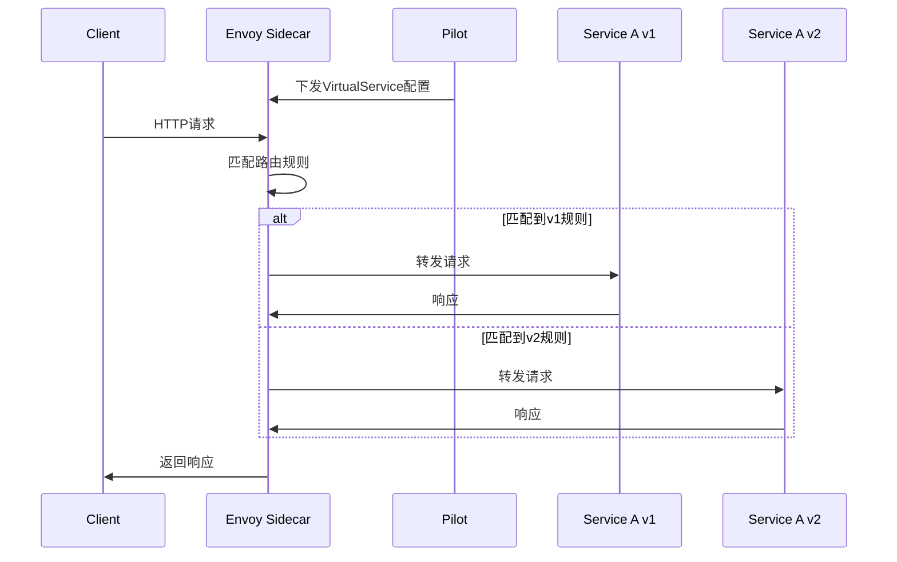
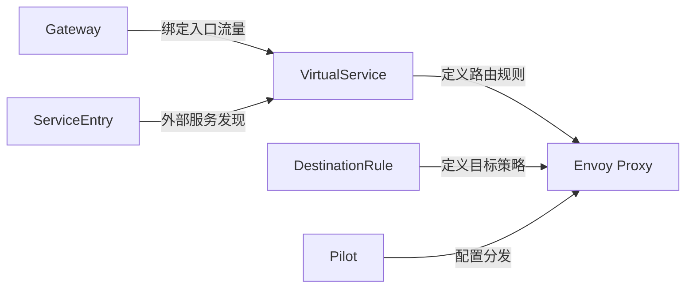
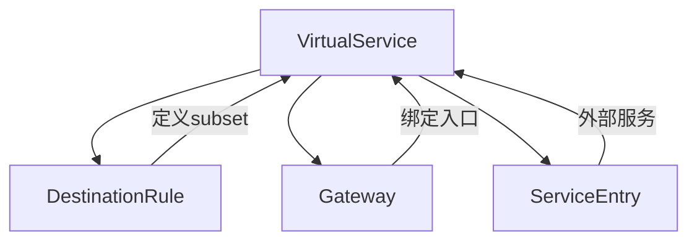

# VirtualService

## 概述

VirtualService 是 Istio 中最核心的流量管理资源之一，它定义了一组流量路由规则，用于控制请求如何路由到服务。VirtualService 允许你配置如何在服务网格内将请求路由到服务，提供了丰富的流量路由、重写、重定向、故障注入等功能。

### 定义和用途
- **流量路由**：根据请求特征（如 headers、URI、权重等）将流量路由到不同的服务版本
- **请求重写**：修改请求的 URI、headers 等信息
- **流量分割**：实现 A/B 测试、金丝雀发布等场景
- **故障注入**：注入延迟或错误用于测试系统的弹性

### 解决的问题
- **版本管理**：在不同服务版本间切换流量
- **灰度发布**：安全地发布新版本服务
- **故障隔离**：通过流量控制隔离故障服务
- **测试验证**：在生产环境中进行 A/B 测试

### 使用场景
- 蓝绿部署和金丝雀发布
- 基于用户或设备的流量路由
- 服务版本管理和回滚
- 故障注入和混沌工程
- 流量镜像和调试

## 核心特性

### 主要功能特点
- **多协议支持**：支持 HTTP、HTTPS、gRPC、TCP、TLS 等协议
- **灵活的匹配条件**：支持基于 headers、URI、query parameters 等的匹配
- **权重分配**：支持基于权重的流量分割
- **故障注入**：内置延迟和错误注入功能
- **请求/响应转换**：支持 headers 和 URI 的重写

### 技术优势
- **零代码侵入**：无需修改应用程序代码
- **实时生效**：配置变更即时生效
- **精细控制**：提供细粒度的流量控制能力
- **与 DestinationRule 协同**：结合 DestinationRule 实现完整的流量管理

### 限制和注意事项
- **配置复杂性**：复杂的路由规则可能难以维护
- **性能影响**：过多的匹配规则可能影响性能
- **依赖关系**：需要与 DestinationRule 配合使用才能实现完整功能
- **调试困难**：错误的配置可能导致流量丢失

## 工作原理

### 内部机制说明

VirtualService 通过 Pilot 组件将配置转换为 Envoy 代理的路由配置。当请求到达 Sidecar 代理时，代理会根据 VirtualService 的规则进行路由决策。

### 数据流程图



### 与其他组件的交互关系



## 配置和使用

### 基础配置

#### 最小可用配置示例

```yaml
apiVersion: networking.istio.io/v1beta1
kind: VirtualService
metadata:
  name: reviews
  namespace: default
spec:
  hosts:                    # 服务主机名，必填
  - reviews
  http:                     # HTTP路由规则
  - route:
    - destination:
        host: reviews       # 目标服务主机名
```

#### 参数说明

| 参数 | 类型 | 必填 | 描述 | 默认值 |
|------|------|------|------|--------|
| `hosts` | string[] | 是 | 规则适用的目标主机名 | 无 |
| `gateways` | string[] | 否 | 规则适用的网关名称 | ["mesh"] |
| `http` | HTTPRoute[] | 否 | HTTP流量路由规则 | 无 |
| `tcp` | TCPRoute[] | 否 | TCP流量路由规则 | 无 |
| `tls` | TLSRoute[] | 否 | TLS流量路由规则 | 无 |
| `exportTo` | string[] | 否 | 配置的可见性范围 | ["*"] |

#### 默认值和推荐值

- **gateways**: 默认为 `["mesh"]`，表示应用于网格内部流量
- **timeout**: 建议设置合适的超时时间，避免请求挂起
- **retries**: 建议配置重试策略提高系统可靠性

### 高级配置

#### 生产环境配置

```yaml
apiVersion: networking.istio.io/v1beta1
kind: VirtualService
metadata:
  name: reviews-prod
  namespace: production
spec:
  hosts:
  - reviews.production.svc.cluster.local
  gateways:
  - reviews-gateway
  - mesh
  http:
  - match:
    - headers:
        user-type:
          exact: premium              # 匹配premium用户
    route:
    - destination:
        host: reviews
        subset: v3                    # 路由到v3版本
      weight: 100
    timeout: 10s                      # 请求超时时间
    retries:
      attempts: 3                     # 重试次数
      perTryTimeout: 3s              # 每次重试超时时间
      retryOn: 5xx,reset,connect-failure
  - match:
    - uri:
        prefix: "/api/v2"             # 匹配API v2路径
    rewrite:
      uri: "/api/v1"                  # 重写为v1路径
    route:
    - destination:
        host: reviews
        subset: v2
      weight: 90                      # 90%流量到v2
    - destination:
        host: reviews
        subset: v3
      weight: 10                      # 10%流量到v3
    headers:
      request:
        add:
          x-version: v2               # 添加请求头
      response:
        remove:
        - x-internal                  # 移除响应头
  - route:                            # 默认路由
    - destination:
        host: reviews
        subset: v1
      weight: 100
```

#### 性能优化配置

```yaml
apiVersion: networking.istio.io/v1beta1
kind: VirtualService
metadata:
  name: reviews-optimized
spec:
  hosts:
  - reviews
  http:
  - match:
    - uri:
        prefix: "/health"
    route:
    - destination:
        host: reviews
        subset: v1
    timeout: 1s                       # 健康检查快速响应
  - match:
    - uri:
        prefix: "/api"
    route:
    - destination:
        host: reviews
        subset: v2
    timeout: 30s                      # API调用较长超时
    retries:
      attempts: 2
      perTryTimeout: 10s
      retryOn: 5xx,reset
```

#### 安全配置

```yaml
apiVersion: networking.istio.io/v1beta1
kind: VirtualService
metadata:
  name: reviews-secure
spec:
  hosts:
  - reviews
  http:
  - match:
    - headers:
        authorization:
          prefix: "Bearer "           # 需要Bearer令牌
    route:
    - destination:
        host: reviews
        subset: secure
    headers:
      request:
        add:
          x-forwarded-proto: https    # 添加安全头
  - route:                            # 未认证请求
    - destination:
        host: auth-service            # 重定向到认证服务
```

## 使用示例

### 基础使用场景

#### 1. 简单路由配置

```yaml
apiVersion: networking.istio.io/v1beta1
kind: VirtualService
metadata:
  name: bookinfo
spec:
  hosts:
  - bookinfo.example.com
  gateways:
  - bookinfo-gateway
  http:
  - match:
    - uri:
        exact: /productpage           # 精确匹配路径
    route:
    - destination:
        host: productpage
        port:
          number: 9080
```

**预期结果**: 所有访问 `/productpage` 的请求将被路由到 productpage 服务的 9080 端口。

#### 2. 基于权重的流量分割

```yaml
apiVersion: networking.istio.io/v1beta1
kind: VirtualService
metadata:
  name: reviews-weight
spec:
  hosts:
  - reviews
  http:
  - route:
    - destination:
        host: reviews
        subset: v1
      weight: 75                      # 75%流量到v1
    - destination:
        host: reviews
        subset: v2
      weight: 25                      # 25%流量到v2
```

**预期结果**: 75% 的流量将路由到 reviews v1 版本，25% 的流量路由到 v2 版本。

#### 3. 基于请求头的路由

```yaml
apiVersion: networking.istio.io/v1beta1
kind: VirtualService
metadata:
  name: reviews-header
spec:
  hosts:
  - reviews
  http:
  - match:
    - headers:
        end-user:
          exact: jason                # 特定用户
    route:
    - destination:
        host: reviews
        subset: v2
  - route:                            # 默认路由
    - destination:
        host: reviews
        subset: v1
```

**预期结果**: 用户 jason 的请求将路由到 reviews v2，其他用户路由到 v1。

### 高级使用场景

#### 1. 故障注入测试

```yaml
apiVersion: networking.istio.io/v1beta1
kind: VirtualService
metadata:
  name: reviews-fault
spec:
  hosts:
  - reviews
  http:
  - match:
    - headers:
        test-fault:
          exact: "true"
    fault:
      delay:                          # 延迟注入
        percentage:
          value: 50.0                 # 50%的请求
        fixedDelay: 5s                # 延迟5秒
      abort:                          # 错误注入
        percentage:
          value: 10.0                 # 10%的请求
        httpStatus: 503               # 返回503错误
    route:
    - destination:
        host: reviews
        subset: v1
  - route:
    - destination:
        host: reviews
        subset: v1
```

**预期结果**: 带有 `test-fault: true` 头的请求中，50% 会延迟 5 秒，10% 会返回 503 错误。

#### 2. 流量镜像

```yaml
apiVersion: networking.istio.io/v1beta1
kind: VirtualService
metadata:
  name: reviews-mirror
spec:
  hosts:
  - reviews
  http:
  - route:
    - destination:
        host: reviews
        subset: v1
      weight: 100
    mirror:                           # 镜像配置
      host: reviews
      subset: v2                      # 镜像到v2版本
    mirrorPercentage:
      value: 10.0                     # 镜像10%的流量
```

**预期结果**: 所有流量正常路由到 v1，同时 10% 的流量会被镜像到 v2 进行测试。

#### 3. 复杂匹配规则

```yaml
apiVersion: networking.istio.io/v1beta1
kind: VirtualService
metadata:
  name: reviews-complex
spec:
  hosts:
  - reviews
  http:
  - match:
    - and:                            # AND条件组合
      - uri:
          prefix: /api/v1
      - headers:
          user-agent:
            regex: ".*mobile.*"       # 移动端用户代理
      - queryParams:
          version:
            exact: beta               # 查询参数匹配
    route:
    - destination:
        host: reviews
        subset: mobile-beta
  - match:
    - or:                             # OR条件组合
      - uri:
          exact: /legacy
      - headers:
          x-legacy-client:
            exact: "true"
    route:
    - destination:
        host: reviews
        subset: legacy
```

**预期结果**: 复杂的条件匹配确定流量路由目标。

## 故障排除

### 常见错误和解决方法

#### 1. 流量丢失问题

**症状**: 配置 VirtualService 后服务无法访问

**可能原因**:
- hosts 配置错误
- 没有默认路由规则
- DestinationRule 中的 subset 不存在

**解决方法**:
```bash
# 检查VirtualService配置
kubectl get virtualservice reviews -o yaml

# 检查DestinationRule
kubectl get destinationrule reviews -o yaml

# 使用istioctl分析
istioctl analyze

# 检查代理配置
istioctl proxy-config route productpage-v1-123456.default
```

#### 2. 路由规则不生效

**症状**: 流量没有按照预期规则路由

**可能原因**:
- 匹配条件设置错误
- 规则优先级问题
- 权重配置错误

**解决方法**:
```bash
# 检查匹配条件
istioctl proxy-config route productpage-v1-123456 --name 9080 -o json

# 验证请求匹配
# 在测试请求中添加调试头
curl -H "x-debug: true" http://productpage/reviews
```

#### 3. 超时和重试问题

**症状**: 请求经常超时或重试次数过多

**解决方法**:
```yaml
http:
- route:
  - destination:
      host: reviews
  timeout: 10s                        # 适当的超时时间
  retries:
    attempts: 3
    perTryTimeout: 3s
    retryOn: 5xx,reset,connect-failure,refused-stream
```

### 调试技巧

#### 1. 配置验证

```bash
# 验证VirtualService语法
istioctl validate -f virtual-service.yaml

# 分析配置冲突
istioctl analyze --all-namespaces

# 检查配置分发状态
istioctl proxy-status
```

#### 2. 流量跟踪

```bash
# 启用访问日志
kubectl patch configmap istio -n istio-system --type merge -p '{"data":{"mesh":"defaultConfig:\n  proxyStatsMatcher:\n    exclusionRegexps:\n    - \".*osconfig_fail_open.*\"\n  accessLogFile: /dev/stdout"}}'

# 查看代理访问日志
kubectl logs -f productpage-v1-123456 -c istio-proxy
```

#### 3. 实时配置检查

```bash
# 查看当前生效的路由配置
istioctl proxy-config route productpage-v1-123456.default

# 查看集群配置
istioctl proxy-config cluster productpage-v1-123456.default

# 查看监听器配置
istioctl proxy-config listener productpage-v1-123456.default
```

### 监控和观察方法

#### 1. 指标监控

关键指标:
- `istio_requests_total`: 请求总数
- `istio_request_duration_milliseconds`: 请求延迟
- `istio_request_bytes`: 请求大小

#### 2. 分布式追踪

启用 Jaeger 追踪查看请求路径:
```bash
# 查看追踪信息
kubectl port-forward -n istio-system svc/jaeger 16686:16686
```

#### 3. 配置监控告警

```yaml
# Prometheus告警规则示例
groups:
- name: virtualservice.rules
  rules:
  - alert: VirtualServiceConfigError
    expr: increase(pilot_k8s_cfg_events{type="VirtualService",event="update"}[5m]) > 10
    labels:
      severity: warning
    annotations:
      summary: "VirtualService配置变更频繁"
```

## 相关概念

### 关联的其他核心概念

- **[DestinationRule](./destination-rule.md)**: 定义服务子集和流量策略
- **[Gateway](./gateway.md)**: 配置网格边缘的负载均衡器
- **[ServiceEntry](./service-entry.md)**: 添加外部服务到服务注册表

### 依赖关系说明



### 配合使用的组件

1. **与 DestinationRule 配合**:
   ```yaml
   # VirtualService引用DestinationRule中定义的subset
   route:
   - destination:
       host: reviews
       subset: v1    # 对应DestinationRule中的subset
   ```

2. **与 Gateway 配合**:
   ```yaml
   # VirtualService绑定到Gateway
   spec:
     hosts:
     - bookinfo.example.com
     gateways:
     - bookinfo-gateway    # 引用Gateway
   ```

## 参考资料

### 官方文档链接
- [Istio VirtualService 官方文档](https://istio.io/latest/docs/reference/config/networking/virtual-service/)
- [流量管理最佳实践](https://istio.io/latest/docs/ops/best-practices/traffic-management/)

### 深入学习资源
- [Istio 流量管理深入解析](https://istio.io/latest/docs/concepts/traffic-management/)
- [Envoy 路由配置指南](https://www.envoyproxy.io/docs/envoy/latest/configuration/http/http_conn_man/route_config/route_config)

### 社区最佳实践
- [VirtualService 配置模式](https://github.com/istio/istio/tree/master/samples)
- [生产环境 VirtualService 配置案例](https://istio.io/latest/docs/examples/)
