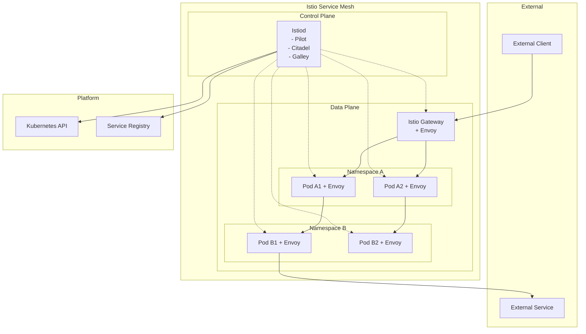
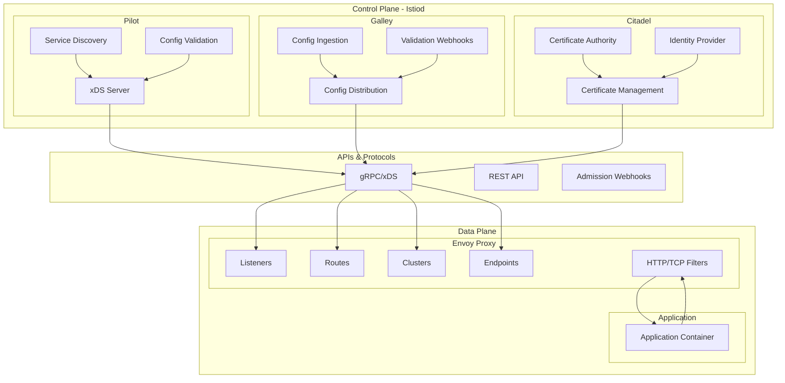
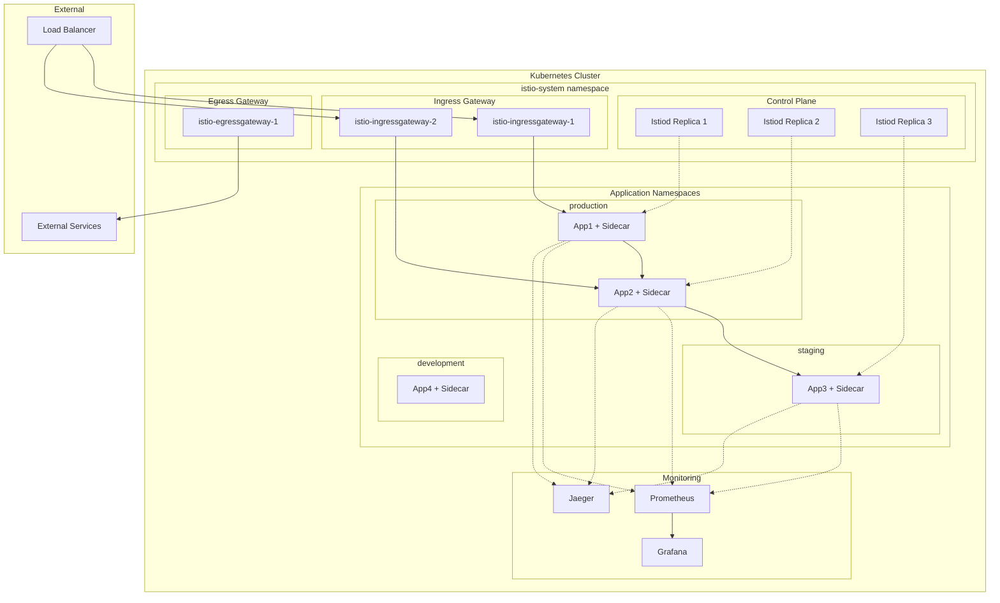
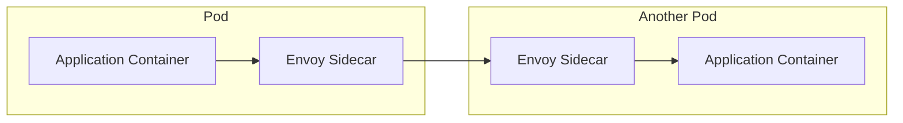
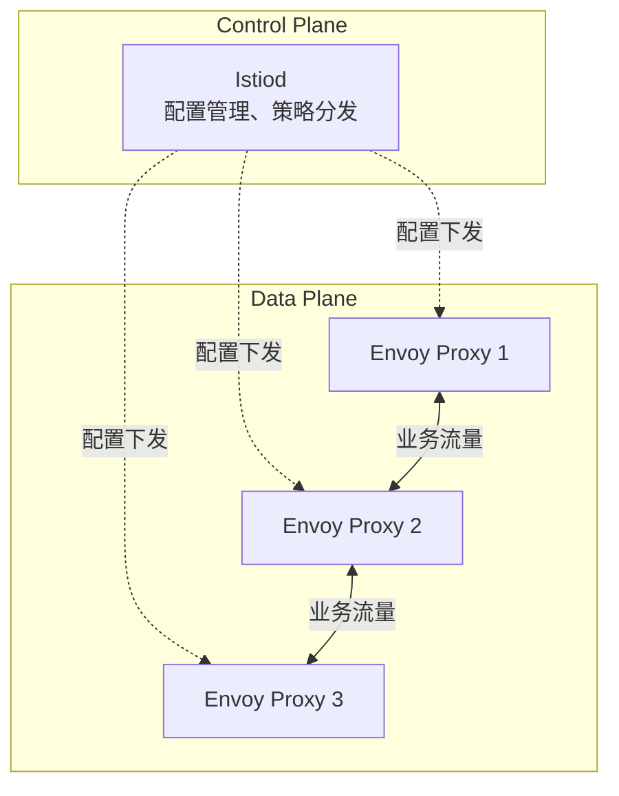
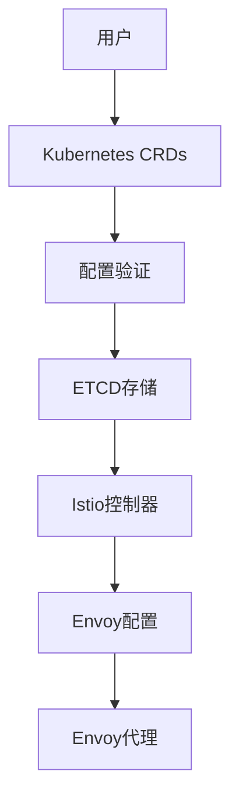

# Istio 系统架构

## 架构概览

### 设计理念

Istio 采用了现代化的服务网格架构设计，基于以下核心设计理念：

- **透明性**：对应用程序透明，无需修改代码即可获得服务网格能力
- **可扩展性**：模块化设计支持大规模分布式部署和功能扩展
- **可观测性**：内置全面的监控、日志和追踪能力
- **策略驱动**：通过声明式配置实现灵活的策略管理
- **安全第一**：默认启用安全机制，支持零信任网络模型

### 架构演进

Istio 架构经历了重要的演进过程：

#### Istio 1.0-1.4 (微服务架构)
- 控制平面由多个独立组件组成：Pilot、Citadel、Galley、Mixer
- 各组件职责明确但增加了运维复杂性
- Mixer 作为策略和遥测的中心枢纽

#### Istio 1.5+ (单体化架构)
- 将控制平面组件整合为 Istiod
- 简化部署和运维复杂性
- 提升性能和可靠性
- 保持了功能的完整性

### 关键特性

- **双平面架构**：清晰分离控制平面和数据平面
- **Sidecar 模式**：每个服务实例伴随一个 Envoy 代理
- **声明式配置**：通过 Kubernetes CRD 管理配置
- **渐进式部署**：支持逐步迁移和功能启用
- **多集群支持**：原生支持跨集群服务网格

### 适用场景

- **微服务架构**：复杂的微服务系统需要统一的流量管理
- **多环境部署**：开发、测试、生产环境的统一管理
- **合规要求**：需要细粒度安全控制和审计的企业环境
- **云原生转型**：传统应用向云原生架构的平滑迁移
- **大规模系统**：服务数量众多、调用关系复杂的大型系统

## 系统架构图

### 高层架构图

### 详细架构图

### 部署架构图

## 组件架构索引

| 组件名称 | 架构层级 | 主要职责 | 核心功能 | 依赖关系 | 详细文档 |
|---------|---------|---------|---------|---------|----------|
| Istiod | 控制平面 | 统一控制平面 | 配置管理、证书管理、服务发现 | Kubernetes API、ETCD | [istiod.md](./istiod.md) |
| Envoy Proxy | 数据平面 | 智能代理 | 流量代理、策略执行、遥测收集 | Istiod、应用服务 | [envoy-proxy.md](./envoy-proxy.md) |
| Pilot | 控制平面 | 流量管理 | 服务发现、配置分发、路由管理 | Kubernetes API、服务注册表 | [pilot.md](./pilot.md) |
| Citadel | 控制平面 | 安全管理 | 身份认证、证书管理、密钥分发 | Kubernetes API、CA | [citadel.md](./citadel.md) |
| Galley | 控制平面 | 配置管理 | 配置验证、转换、分发 | Kubernetes API、Validation Webhooks | [galley.md](./galley.md) |
| Ingress Gateway | 边缘代理 | 入口流量管理 | 南北向流量处理、TLS终止 | Istiod、外部负载均衡器 | [ingress-gateway.md](./ingress-gateway.md) |
| Egress Gateway | 边缘代理 | 出口流量管理 | 访问外部服务、安全出口 | Istiod、外部服务 | [egress-gateway.md](./egress-gateway.md) |

## 核心架构模式

### 1. Sidecar 模式

Istio 采用 Sidecar 模式为每个应用实例部署一个 Envoy 代理：

**优势：**
- 应用程序透明性
- 独立的生命周期管理
- 精细化的流量控制
- 统一的可观测性

### 2. 控制平面与数据平面分离

**优势：**
- 职责清晰分离
- 独立扩展和升级
- 高可用性设计
- 性能优化空间

### 3. 声明式配置模式

**优势：**
- 配置即代码
- 版本化管理
- 自动化部署
- 配置验证

## 关键设计决策

### 1. 为什么选择 Envoy

- **高性能**：C++编写，性能优异
- **可扩展性**：丰富的过滤器扩展机制
- **标准兼容**：支持主流协议和标准
- **社区活跃**：CNCF毕业项目，生态丰富

### 2. 为什么采用 Sidecar 模式

- **透明性**：无需修改应用代码
- **隔离性**：故障隔离和资源隔离
- **灵活性**：独立配置和升级
- **可观测性**：统一的监控点

### 3. 为什么整合控制平面

- **简化运维**：减少组件数量和依赖关系
- **提升性能**：减少组件间通信开销
- **增强可靠性**：减少单点故障风险
- **统一管理**：简化配置和监控

## 架构优势

### 1. 渐进式采用
- 支持增量部署
- 向后兼容性
- 风险可控

### 2. 平台无关
- 多云支持
- 混合环境
- 标准化接口

### 3. 可扩展性
- 水平扩展
- 模块化设计
- 插件机制

### 4. 安全性
- 零信任架构
- 端到端加密
- 细粒度授权

## 架构限制和考虑

### 1. 复杂性
- 学习曲线陡峭
- 运维复杂度增加
- 调试困难

### 2. 性能开销
- Sidecar 资源消耗
- 网络延迟增加
- 内存使用增长

### 3. 部署考虑
- 滚动升级策略
- 配置变更影响
- 故障排除复杂性

## 最佳实践

### 1. 部署策略
- 分阶段部署
- 金丝雀发布
- 监控和回滚

### 2. 配置管理
- 命名空间隔离
- 配置版本控制
- 变更审批流程

### 3. 性能优化
- 资源配额设置
- Sidecar 资源调优
- 监控指标配置

### 4. 安全强化
- 最小权限原则
- 定期证书轮换
- 安全策略审计

## 演进路线

### 短期目标
- 性能优化
- 易用性提升
- 生态集成

### 中期目标
- 边缘计算支持
- 多集群管理
- 智能化运维

### 长期愿景
- 无服务器集成
- AI/ML 集成
- 全栈可观测性

## 相关资源

- [官方架构文档](https://istio.io/latest/docs/concepts/what-is-istio/)
- [设计文档](https://github.com/istio/istio/tree/master/architecture)
- [性能基准测试](https://istio.io/latest/docs/ops/deployment/performance-and-scalability/)
- [安全架构指南](https://istio.io/latest/docs/concepts/security/)
