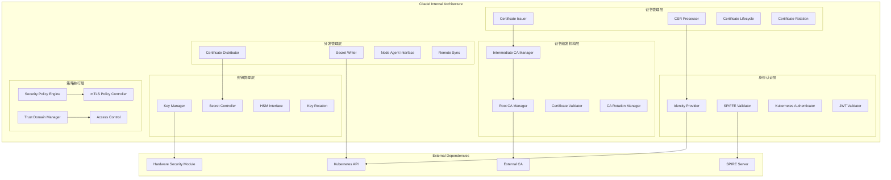
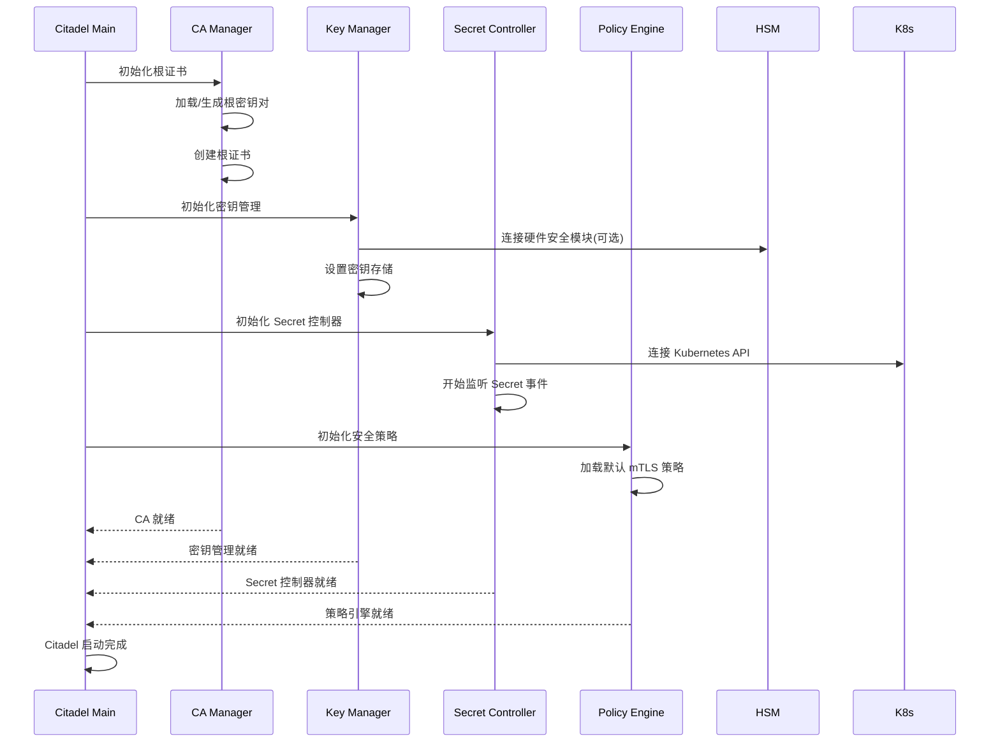
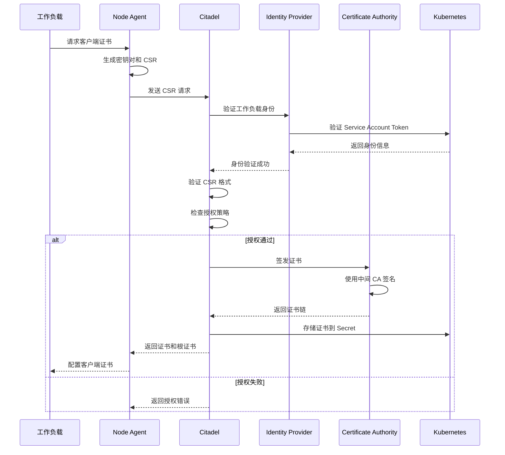
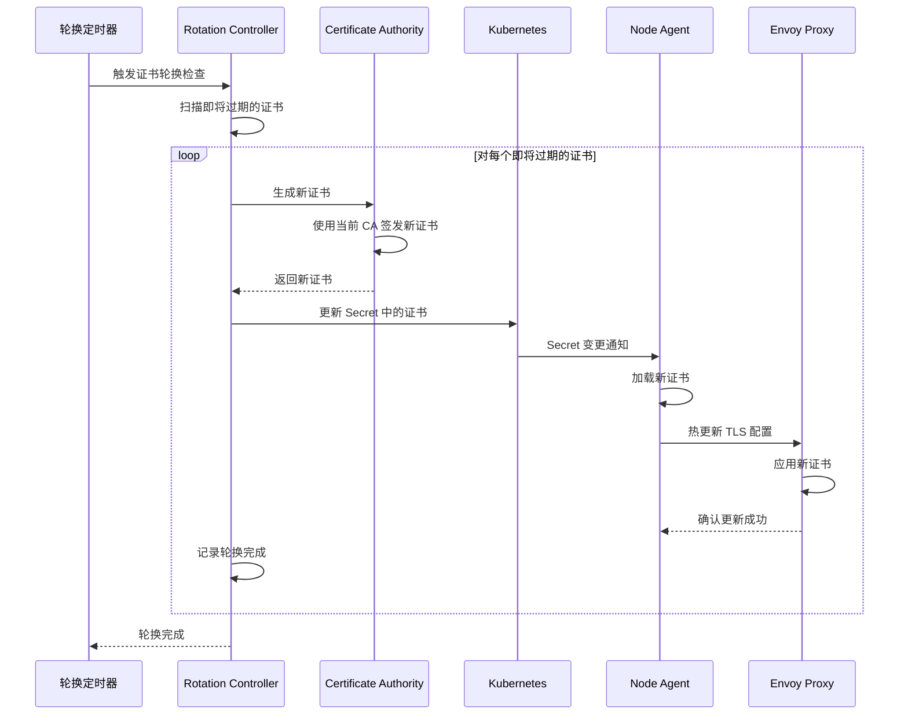

# Citadel 架构解析

## 组件定位

### 在整体架构中的位置和作用

Citadel 是 Istio 控制平面的核心安全组件，负责身份认证、证书管理和密钥分发。在 Istio 1.5+ 版本中，Citadel 已经整合到 Istiod 中，但其安全架构和证书管理机制仍然是理解 Istio 安全体系的关键。

```mermaid
graph TB
    subgraph "Istio Control Plane"
        subgraph "Istiod (包含 Citadel)"
            Citadel[Citadel 模块<br/>安全管理核心]
            Pilot[Pilot 模块]
            Galley[Galley 模块]
        end
    end
    
    subgraph "Data Plane"
        Envoy1[Envoy Proxy 1<br/>+ 客户端证书]
        Envoy2[Envoy Proxy 2<br/>+ 客户端证书]
        Envoy3[Envoy Proxy 3<br/>+ 客户端证书]
        Gateway[Gateway Proxy<br/>+ 服务器证书]
    end
    
    subgraph "Security Infrastructure"
        RootCA[Root CA]
        K8sSecrets[Kubernetes Secrets]
        SPIRE[SPIRE (可选)]
        ExternalCA[External CA (可选)]
    end
    
    Citadel <--> RootCA
    Citadel <--> K8sSecrets
    Citadel <--> SPIRE
    Citadel <--> ExternalCA
    
    Citadel -.->|证书分发| Envoy1
    Citadel -.->|证书分发| Envoy2
    Citadel -.->|证书分发| Envoy3
    Citadel -.->|证书分发| Gateway
```

### 与其他组件的关系和依赖

- **上游依赖**：Root CA、Kubernetes API、外部身份提供者
- **平级组件**：与 Pilot（流量）、Galley（配置）模块协作
- **下游服务**：所有 Envoy 代理实例和应用工作负载
- **外部集成**：支持外部 CA、HSM、SPIRE 等安全基础设施

### 责任边界和接口定义

**核心职责：**
- 根证书和中间证书管理
- 工作负载身份认证和证书颁发
- 证书生命周期管理和自动轮换
- mTLS 策略执行和密钥分发

**接口定义：**
- **北向接口**：CA API、Kubernetes API、外部 CA 接口
- **南向接口**：CSR API、证书分发接口
- **东西向接口**：与 Pilot、Galley 的安全策略接口
- **管理接口**：证书状态、健康检查、审计日志

## 设计目标

### 解决的核心问题

1. **身份管理**：为服务网格中的工作负载提供强身份认证
2. **证书自动化**：自动化证书的颁发、续期和轮换
3. **零信任网络**：默认启用 mTLS 实现零信任通信
4. **密钥管理**：安全的密钥存储和分发机制
5. **合规性**：满足企业安全和合规要求

### 性能和可扩展性目标

- **证书颁发延迟**：< 100ms (P99)
- **支持工作负载数量**：10K+ 工作负载
- **证书轮换效率**：批量轮换 1K+ 证书
- **高可用性**：99.9% 证书服务可用性
- **扩展性**：支持多集群证书管理

### 安全和可靠性要求

- **根密钥保护**：根私钥的安全存储和访问控制
- **证书验证**：严格的证书链验证和吊销检查
- **审计追踪**：完整的证书操作审计日志
- **灾难恢复**：证书备份和恢复机制
- **合规标准**：符合 FIPS、Common Criteria 等标准

## 内部架构设计

### 模块结构图



### 关键接口

#### 证书颁发接口

```protobuf
// Certificate Signing Request 服务
service IstioCertificateService {
  // 创建证书签名请求
  rpc CreateCertificate(IstioCertificateRequest) 
    returns (IstioCertificateResponse);
    
  // 续期证书
  rpc RenewCertificate(IstioCertificateRequest) 
    returns (IstioCertificateResponse);
    
  // 吊销证书
  rpc RevokeCertificate(RevokeCertificateRequest) 
    returns (RevokeCertificateResponse);
}

message IstioCertificateRequest {
  // CSR in PEM format
  string csr = 1;
  
  // 证书有效期
  int64 validity_duration = 2;
  
  // SPIFFE ID
  string spiffe_id = 3;
  
  // DNS SANs
  repeated string dns_names = 4;
  
  // IP SANs  
  repeated string ip_addresses = 5;
}

message IstioCertificateResponse {
  // 签发的证书链
  repeated string cert_chain = 1;
  
  // 根证书
  string root_cert = 2;
  
  // 证书有效期
  int64 cert_lifetime = 3;
}
```

#### 密钥管理接口

```go
// 密钥管理器接口
type KeyManager interface {
    // 生成密钥对
    GenerateKeyPair(keyType KeyType, keySize int) (*KeyPair, error)
    
    // 获取签名密钥
    GetSigningKey(keyID string) (*PrivateKey, error)
    
    // 签名操作
    Sign(keyID string, data []byte, algorithm SignatureAlgorithm) ([]byte, error)
    
    // 密钥轮换
    RotateKey(keyID string) (*KeyPair, error)
    
    // 密钥备份
    BackupKey(keyID string) (*EncryptedKeyBackup, error)
}

// 证书管理器接口
type CertificateManager interface {
    // 颁发证书
    IssueCertificate(csr *CertificateRequest) (*Certificate, error)
    
    // 续期证书
    RenewCertificate(certID string) (*Certificate, error)
    
    // 吊销证书
    RevokeCertificate(certID string, reason RevocationReason) error
    
    // 验证证书链
    VerifyCertificateChain(certChain []*Certificate) error
    
    // 获取 CRL
    GetCertificateRevocationList() (*CRL, error)
}
```

#### 身份认证接口

```go
// 身份提供者接口
type IdentityProvider interface {
    // 验证身份
    ValidateIdentity(token string) (*Identity, error)
    
    // 获取 SPIFFE ID
    GetSPIFFEID(identity *Identity) (string, error)
    
    // 验证授权
    IsAuthorized(identity *Identity, resource string, action string) (bool, error)
}

// Kubernetes 身份认证器
type KubernetesAuthenticator struct {
    kubeClient kubernetes.Interface
    trustDomain string
}

func (k *KubernetesAuthenticator) ValidateServiceAccount(token string) (*ServiceAccountIdentity, error) {
    // 验证 Service Account Token
    tokenReview := &authenticationv1.TokenReview{
        Spec: authenticationv1.TokenReviewSpec{
            Token: token,
        },
    }
    
    result, err := k.kubeClient.AuthenticationV1().TokenReviews().Create(
        context.Background(), tokenReview, metav1.CreateOptions{})
    if err != nil {
        return nil, err
    }
    
    if !result.Status.Authenticated {
        return nil, fmt.Errorf("token authentication failed")
    }
    
    return &ServiceAccountIdentity{
        Namespace:      result.Status.User.Extra["authentication.kubernetes.io/namespace"][0],
        ServiceAccount: result.Status.User.Extra["authentication.kubernetes.io/service-account"][0],
        TrustDomain:    k.trustDomain,
    }, nil
}
```

### 数据模型

#### 核心数据结构

```go
// 证书配置
type CertificateConfig struct {
    CommonName       string
    Organization     []string
    Country          []string
    Locality         []string
    Province         []string
    DNSNames         []string
    IPAddresses      []net.IP
    URISANs          []string
    ValidityDuration time.Duration
    KeyUsage         x509.KeyUsage
    ExtKeyUsage      []x509.ExtKeyUsage
}

// SPIFFE 身份
type SPIFFEIdentity struct {
    TrustDomain    string
    Namespace      string
    ServiceAccount string
    WorkloadName   string
}

func (s *SPIFFEIdentity) ToURI() string {
    return fmt.Sprintf("spiffe://%s/ns/%s/sa/%s", 
        s.TrustDomain, s.Namespace, s.ServiceAccount)
}

// 证书元数据
type CertificateMetadata struct {
    SerialNumber  *big.Int
    Subject       pkix.Name
    Issuer        pkix.Name
    NotBefore     time.Time
    NotAfter      time.Time
    KeyUsage      x509.KeyUsage
    ExtKeyUsage   []x509.ExtKeyUsage
    IsCA          bool
    MaxPathLen    int
    DNSNames      []string
    IPAddresses   []net.IP
    URISANs       []string
}

// 证书状态
type CertificateStatus struct {
    SerialNumber string
    State        CertificateState
    IssuedAt     time.Time
    ExpiresAt    time.Time
    RevokedAt    *time.Time
    RevocationReason *RevocationReason
    LastRenewal  *time.Time
}

type CertificateState int

const (
    CertificateStateActive CertificateState = iota
    CertificateStateExpired
    CertificateStateRevoked
    CertificateStatePendingRenewal
)
```

#### 信任域管理

```go
// 信任域配置
type TrustDomain struct {
    Name        string
    RootCA      *Certificate
    Policy      *TrustDomainPolicy
    Federations []TrustDomainFederation
}

type TrustDomainPolicy struct {
    DefaultCertTTL    time.Duration
    MaxCertTTL        time.Duration
    AllowedSANTypes   []SANType
    RequiredKeyUsage  []x509.KeyUsage
    AllowedKeyAlgos   []x509.PublicKeyAlgorithm
    RevocationPolicy  RevocationPolicy
}

type TrustDomainFederation struct {
    PeerTrustDomain string
    RootCertBundle  []*Certificate
    FederationMode  FederationMode
    CreatedAt       time.Time
    ExpiresAt       time.Time
}

type FederationMode int

const (
    FederationModeManual FederationMode = iota
    FederationModeAutomatic
    FederationModeConditional
)
```

## 工作流程

### 启动和初始化



### 证书颁发流程



### 证书轮换流程



### mTLS 策略执行

```mermaid
sequenceDiagram
    participant Client as 客户端服务
    participant ClientEnvoy as 客户端 Envoy
    participant ServerEnvoy as 服务端 Envoy
    participant Server as 服务端服务
    participant Citadel as Citadel
    
    Note over ClientEnvoy,ServerEnvoy: mTLS 握手开始
    
    ClientEnvoy->>ServerEnvoy: ClientHello + 客户端证书
    ServerEnvoy->>ServerEnvoy: 验证客户端证书链
    ServerEnvoy->>Citadel: 检查证书状态(可选)
    Citadel-->>ServerEnvoy: 证书有效
    
    ServerEnvoy->>ClientEnvoy: ServerHello + 服务端证书
    ClientEnvoy->>ClientEnvoy: 验证服务端证书链
    ClientEnvoy->>Citadel: 检查证书状态(可选)
    Citadel-->>ClientEnvoy: 证书有效
    
    ClientEnvoy<->>ServerEnvoy: 完成密钥交换
    
    Note over ClientEnvoy,ServerEnvoy: mTLS 连接建立
    
    Client->>ClientEnvoy: 应用请求
    ClientEnvoy->>ServerEnvoy: 加密传输
    ServerEnvoy->>Server: 解密后转发
    Server-->>ServerEnvoy: 应用响应
    ServerEnvoy-->>ClientEnvoy: 加密传输
    ClientEnvoy-->>Client: 解密后返回
```

## 技术细节

### 证书颁发算法

#### SPIFFE 兼容的证书生成

```go
func (ca *CertificateAuthority) IssueSPIFFECertificate(csr *x509.CertificateRequest, identity *SPIFFEIdentity, ttl time.Duration) (*x509.Certificate, error) {
    // 验证 CSR
    if err := ca.validateCSR(csr); err != nil {
        return nil, fmt.Errorf("invalid CSR: %v", err)
    }
    
    // 创建证书模板
    template := &x509.Certificate{
        SerialNumber: ca.generateSerialNumber(),
        Subject: pkix.Name{
            CommonName:   identity.ServiceAccount,
            Organization: []string{identity.TrustDomain},
        },
        NotBefore:    time.Now(),
        NotAfter:     time.Now().Add(ttl),
        KeyUsage:     x509.KeyUsageDigitalSignature | x509.KeyUsageKeyEncipherment,
        ExtKeyUsage:  []x509.ExtKeyUsage{x509.ExtKeyUsageClientAuth, x509.ExtKeyUsageServerAuth},
        IsCA:         false,
        BasicConstraintsValid: true,
    }
    
    // 添加 SPIFFE ID 作为 URI SAN
    spiffeURI, _ := url.Parse(identity.ToURI())
    template.URIs = []*url.URL{spiffeURI}
    
    // 添加 DNS SAN (Kubernetes Service)
    template.DNSNames = []string{
        identity.ServiceAccount,
        fmt.Sprintf("%s.%s", identity.ServiceAccount, identity.Namespace),
        fmt.Sprintf("%s.%s.svc", identity.ServiceAccount, identity.Namespace),
        fmt.Sprintf("%s.%s.svc.cluster.local", identity.ServiceAccount, identity.Namespace),
    }
    
    // 使用中间 CA 签发证书
    certDER, err := x509.CreateCertificate(
        rand.Reader,
        template,
        ca.intermediateCert,
        csr.PublicKey,
        ca.intermediateKey,
    )
    if err != nil {
        return nil, fmt.Errorf("failed to create certificate: %v", err)
    }
    
    cert, err := x509.ParseCertificate(certDER)
    if err != nil {
        return nil, fmt.Errorf("failed to parse certificate: %v", err)
    }
    
    // 记录证书颁发日志
    ca.auditLogger.LogCertificateIssuance(cert, identity)
    
    return cert, nil
}
```

#### 证书链验证算法

```go
func (ca *CertificateAuthority) VerifyCertificateChain(certChain []*x509.Certificate) error {
    if len(certChain) == 0 {
        return fmt.Errorf("empty certificate chain")
    }
    
    // 构建证书池
    intermediatePool := x509.NewCertPool()
    for i := 1; i < len(certChain); i++ {
        intermediatePool.AddCert(certChain[i])
    }
    
    rootPool := x509.NewCertPool()
    rootPool.AddCert(ca.rootCert)
    
    // 验证选项
    opts := x509.VerifyOptions{
        Roots:         rootPool,
        Intermediates: intermediatePool,
        KeyUsages:     []x509.ExtKeyUsage{x509.ExtKeyUsageAny},
    }
    
    // 执行验证
    leafCert := certChain[0]
    chains, err := leafCert.Verify(opts)
    if err != nil {
        return fmt.Errorf("certificate chain verification failed: %v", err)
    }
    
    // 检查证书是否在 CRL 中
    if err := ca.checkCertificateRevocation(leafCert); err != nil {
        return fmt.Errorf("certificate revocation check failed: %v", err)
    }
    
    // 验证 SPIFFE ID
    if err := ca.validateSPIFFEID(leafCert); err != nil {
        return fmt.Errorf("SPIFFE ID validation failed: %v", err)
    }
    
    ca.auditLogger.LogCertificateVerification(leafCert, len(chains) > 0)
    return nil
}
```

### 密钥管理算法

#### HSM 集成的密钥管理

```go
type HSMKeyManager struct {
    session  pkcs11.SessionHandle
    hsmToken *pkcs11.Ctx
    keystore map[string]*HSMKey
    mutex    sync.RWMutex
}

func (h *HSMKeyManager) GenerateKeyPair(keyType KeyType, keySize int) (*KeyPair, error) {
    h.mutex.Lock()
    defer h.mutex.Unlock()
    
    // 生成密钥对模板
    privateKeyTemplate := []*pkcs11.Attribute{
        pkcs11.NewAttribute(pkcs11.CKA_CLASS, pkcs11.CKO_PRIVATE_KEY),
        pkcs11.NewAttribute(pkcs11.CKA_KEY_TYPE, pkcs11.CKK_RSA),
        pkcs11.NewAttribute(pkcs11.CKA_TOKEN, true),
        pkcs11.NewAttribute(pkcs11.CKA_PRIVATE, true),
        pkcs11.NewAttribute(pkcs11.CKA_SENSITIVE, true),
        pkcs11.NewAttribute(pkcs11.CKA_EXTRACTABLE, false),
        pkcs11.NewAttribute(pkcs11.CKA_SIGN, true),
        pkcs11.NewAttribute(pkcs11.CKA_MODULUS_BITS, keySize),
        pkcs11.NewAttribute(pkcs11.CKA_PUBLIC_EXPONENT, []byte{1, 0, 1}),
    }
    
    publicKeyTemplate := []*pkcs11.Attribute{
        pkcs11.NewAttribute(pkcs11.CKA_CLASS, pkcs11.CKO_PUBLIC_KEY),
        pkcs11.NewAttribute(pkcs11.CKA_KEY_TYPE, pkcs11.CKK_RSA),
        pkcs11.NewAttribute(pkcs11.CKA_TOKEN, true),
        pkcs11.NewAttribute(pkcs11.CKA_VERIFY, true),
        pkcs11.NewAttribute(pkcs11.CKA_MODULUS_BITS, keySize),
        pkcs11.NewAttribute(pkcs11.CKA_PUBLIC_EXPONENT, []byte{1, 0, 1}),
    }
    
    // 在 HSM 中生成密钥对
    publicKey, privateKey, err := h.hsmToken.GenerateKeyPair(
        h.session,
        []*pkcs11.Mechanism{pkcs11.NewMechanism(pkcs11.CKM_RSA_PKCS_KEY_PAIR_GEN, nil)},
        publicKeyTemplate,
        privateKeyTemplate,
    )
    if err != nil {
        return nil, fmt.Errorf("HSM key generation failed: %v", err)
    }
    
    // 导出公钥
    pubKeyBytes, err := h.exportPublicKey(publicKey)
    if err != nil {
        return nil, fmt.Errorf("failed to export public key: %v", err)
    }
    
    keyID := h.generateKeyID()
    hsmKey := &HSMKey{
        ID:         keyID,
        PublicKey:  publicKey,
        PrivateKey: privateKey,
        KeyType:    keyType,
        CreatedAt:  time.Now(),
    }
    
    h.keystore[keyID] = hsmKey
    
    return &KeyPair{
        ID:        keyID,
        PublicKey: pubKeyBytes,
        KeyType:   keyType,
        CreatedAt: time.Now(),
    }, nil
}

func (h *HSMKeyManager) Sign(keyID string, data []byte, algorithm SignatureAlgorithm) ([]byte, error) {
    h.mutex.RLock()
    hsmKey, exists := h.keystore[keyID]
    h.mutex.RUnlock()
    
    if !exists {
        return nil, fmt.Errorf("key not found: %s", keyID)
    }
    
    // 选择签名机制
    var mechanism *pkcs11.Mechanism
    switch algorithm {
    case SignatureAlgorithmRSAPSS:
        mechanism = pkcs11.NewMechanism(pkcs11.CKM_RSA_PKCS_PSS, nil)
    case SignatureAlgorithmRSAPKCS1:
        mechanism = pkcs11.NewMechanism(pkcs11.CKM_RSA_PKCS, nil)
    default:
        return nil, fmt.Errorf("unsupported signature algorithm: %v", algorithm)
    }
    
    // 初始化签名操作
    if err := h.hsmToken.SignInit(h.session, []*pkcs11.Mechanism{mechanism}, hsmKey.PrivateKey); err != nil {
        return nil, fmt.Errorf("HSM sign init failed: %v", err)
    }
    
    // 执行签名
    signature, err := h.hsmToken.Sign(h.session, data)
    if err != nil {
        return nil, fmt.Errorf("HSM signing failed: %v", err)
    }
    
    return signature, nil
}
```

### 证书轮换优化

#### 批量证书轮换算法

```go
type CertificateRotationController struct {
    certStore      CertificateStore
    certIssuer     CertificateIssuer
    rotationPolicy *RotationPolicy
    batchSize      int
    workers        int
}

func (c *CertificateRotationController) RotateCertificatesBatch() error {
    // 获取需要轮换的证书
    expiringCerts, err := c.certStore.GetExpiringCertificates(c.rotationPolicy.RotationThreshold)
    if err != nil {
        return fmt.Errorf("failed to get expiring certificates: %v", err)
    }
    
    if len(expiringCerts) == 0 {
        return nil // 没有需要轮换的证书
    }
    
    // 创建工作池
    jobs := make(chan *CertificateRotationJob, len(expiringCerts))
    results := make(chan *RotationResult, len(expiringCerts))
    
    // 启动工作协程
    for i := 0; i < c.workers; i++ {
        go c.rotationWorker(jobs, results)
    }
    
    // 分批发送轮换任务
    batches := c.createBatches(expiringCerts, c.batchSize)
    var wg sync.WaitGroup
    
    for _, batch := range batches {
        wg.Add(1)
        go func(certs []*Certificate) {
            defer wg.Done()
            for _, cert := range certs {
                jobs <- &CertificateRotationJob{
                    Certificate: cert,
                    Timestamp:   time.Now(),
                }
            }
        }(batch)
        
        // 控制批次间的延迟，避免过载
        time.Sleep(c.rotationPolicy.BatchDelay)
    }
    
    // 关闭作业通道
    go func() {
        wg.Wait()
        close(jobs)
    }()
    
    // 收集结果
    var successCount, failureCount int
    for i := 0; i < len(expiringCerts); i++ {
        result := <-results
        if result.Error != nil {
            failureCount++
            log.Errorf("Certificate rotation failed for %s: %v", result.SerialNumber, result.Error)
        } else {
            successCount++
        }
    }
    
    log.Infof("Certificate rotation completed: %d success, %d failures", successCount, failureCount)
    return nil
}

func (c *CertificateRotationController) rotationWorker(jobs <-chan *CertificateRotationJob, results chan<- *RotationResult) {
    for job := range jobs {
        result := &RotationResult{
            SerialNumber: job.Certificate.SerialNumber.String(),
            StartTime:    job.Timestamp,
        }
        
        // 执行证书轮换
        newCert, err := c.rotateSingleCertificate(job.Certificate)
        if err != nil {
            result.Error = err
        } else {
            result.NewCertificate = newCert
            result.Success = true
        }
        
        result.EndTime = time.Now()
        results <- result
    }
}
```

## 架构配置

### 安全配置参数

```yaml
# Citadel 安全配置
apiVersion: v1
kind: ConfigMap
metadata:
  name: istio-security-config
  namespace: istio-system
data:
  # 根证书配置
  root-cert.pem: |
    -----BEGIN CERTIFICATE-----
    [Root Certificate Content]
    -----END CERTIFICATE-----
  
  # 信任域配置
  trust-domain: cluster.local
  
  # 证书轮换配置
  cert-rotation-threshold: 24h      # 证书轮换阈值
  cert-rotation-interval: 1h        # 轮换检查间隔
  cert-rotation-batch-size: 100     # 批量轮换大小
  
  # 证书有效期配置
  workload-cert-ttl: 24h           # 工作负载证书有效期
  max-workload-cert-ttl: 720h      # 最大证书有效期
  self-signed-ca-cert-ttl: 8760h   # 自签名 CA 证书有效期
  
  # 密钥算法配置
  key-algorithm: RSA               # 密钥算法
  key-size: 2048                   # 密钥长度
  signature-algorithm: SHA256WithRSA # 签名算法

---
# Istiod 安全相关环境变量
apiVersion: apps/v1
kind: Deployment
metadata:
  name: istiod
  namespace: istio-system
spec:
  template:
    spec:
      containers:
      - name: discovery
        env:
        # CA 配置
        - name: ROOT_CA_DIR
          value: "/etc/cacerts"
        - name: WORKLOAD_CERT_TTL
          value: "24h"
        - name: CITADEL_ENABLE_NAMESPACED_CERTS
          value: "true"
        - name: CITADEL_ENABLE_JITTER_FOR_ROOT_CERT_ROTATOR
          value: "true"
        
        # 证书轮换配置
        - name: CITADEL_ENABLE_WORKLOAD_CERT_ROTATION
          value: "true"
        - name: CITADEL_WORKLOAD_CERT_MIN_GRACE_PERIOD
          value: "10m"
        - name: CITADEL_WORKLOAD_CERT_ROTATION_GRACE_PERIOD_RATIO
          value: "0.5"
        
        # HSM 配置 (可选)
        - name: CITADEL_ENABLE_HSM
          value: "false"
        - name: HSM_PKCS11_LIB_PATH
          value: "/opt/hsm/lib/libpkcs11.so"
        - name: HSM_TOKEN_LABEL
          value: "istio-ca-token"
        
        # 外部 CA 配置 (可选)
        - name: EXTERNAL_CA
          value: "false"
        - name: EXTERNAL_CA_ADDR
          value: "external-ca.ca-system.svc.cluster.local:443"
```

### 监控和审计配置

```yaml
# 安全审计配置
apiVersion: v1
kind: ConfigMap
metadata:
  name: citadel-audit-config
  namespace: istio-system
data:
  audit-policy.yaml: |
    apiVersion: audit.k8s.io/v1
    kind: Policy
    rules:
    # 审计证书颁发事件
    - level: Request
      resources:
      - group: "security.istio.io"
        resources: ["certificates", "certificatesigningrequests"]
      verbs: ["create", "update", "delete"]
      namespaces: ["istio-system"]
    
    # 审计密钥操作
    - level: Request
      resources:
      - group: ""
        resources: ["secrets"]
      verbs: ["create", "update", "delete"]
      namespaces: ["istio-system"]
      resourceNames: ["cacerts", "istio-ca-secret"]
    
    # 审计安全策略变更
    - level: Request
      resources:
      - group: "security.istio.io"
        resources: ["authorizationpolicies", "peerauthentications"]
      verbs: ["create", "update", "delete"]

---
# Prometheus 安全指标配置
apiVersion: v1
kind: ConfigMap
metadata:
  name: citadel-metrics-config
  namespace: istio-system
data:
  metrics.yaml: |
    # 证书相关指标
    certificates_issued_total:
      type: counter
      help: "Total number of certificates issued"
      labels: ["trust_domain", "namespace", "service_account"]
    
    certificates_expired_total:
      type: counter  
      help: "Total number of expired certificates"
      labels: ["trust_domain", "namespace"]
    
    certificate_rotation_duration_seconds:
      type: histogram
      help: "Certificate rotation duration"
      buckets: [0.1, 0.5, 1, 5, 10, 30, 60]
    
    root_ca_cert_expiry_timestamp:
      type: gauge
      help: "Root CA certificate expiry timestamp"
    
    # 安全策略指标
    mtls_policy_violations_total:
      type: counter
      help: "Total mTLS policy violations"
      labels: ["source", "destination", "policy"]
    
    # CSR 处理指标
    csr_processing_duration_seconds:
      type: histogram
      help: "CSR processing duration"
      buckets: [0.01, 0.05, 0.1, 0.5, 1, 5]
    
    csr_errors_total:
      type: counter
      help: "Total CSR processing errors"
      labels: ["error_type", "trust_domain"]
```

### 高可用配置

```yaml
# Citadel 高可用部署
apiVersion: apps/v1
kind: Deployment
metadata:
  name: istiod
  namespace: istio-system
spec:
  replicas: 3                           # 多实例部署
  strategy:
    rollingUpdate:
      maxSurge: 1
      maxUnavailable: 0                 # 零停机更新
  template:
    spec:
      affinity:
        podAntiAffinity:                # Pod 反亲和性
          requiredDuringSchedulingIgnoredDuringExecution:
          - labelSelector:
              matchLabels:
                app: istiod
            topologyKey: kubernetes.io/hostname
      containers:
      - name: discovery
        resources:
          requests:
            memory: "512Mi"
            cpu: "500m"
          limits:
            memory: "2Gi"
            cpu: "2000m"
        volumeMounts:
        # 挂载根证书
        - name: cacerts
          mountPath: /etc/cacerts
          readOnly: true
        # 挂载审计日志目录
        - name: audit-logs
          mountPath: /var/log/audit
        readinessProbe:
          httpGet:
            path: /ready
            port: 8080
          initialDelaySeconds: 5
          periodSeconds: 5
        livenessProbe:
          httpGet:
            path: /ready
            port: 8080
          initialDelaySeconds: 30
          periodSeconds: 30
      volumes:
      - name: cacerts
        secret:
          secretName: cacerts
          optional: true
      - name: audit-logs
        emptyDir: {}

---
# 根证书备份配置
apiVersion: batch/v1
kind: CronJob
metadata:
  name: ca-cert-backup
  namespace: istio-system
spec:
  schedule: "0 2 * * *"                 # 每天凌晨 2 点执行
  jobTemplate:
    spec:
      template:
        spec:
          containers:
          - name: backup
            image: alpine:latest
            command:
            - /bin/sh
            - -c
            - |
              # 备份根证书和密钥
              kubectl get secret cacerts -n istio-system -o yaml > /backup/cacerts-$(date +%Y%m%d).yaml
              kubectl get secret istio-ca-secret -n istio-system -o yaml > /backup/ca-secret-$(date +%Y%m%d).yaml
              
              # 清理 30 天前的备份
              find /backup -name "*.yaml" -mtime +30 -delete
            volumeMounts:
            - name: backup-storage
              mountPath: /backup
          volumes:
          - name: backup-storage
            persistentVolumeClaim:
              claimName: ca-backup-pvc
          restartPolicy: OnFailure
```

## 故障排除和运维

### 常见问题诊断

#### 证书颁发失败

```bash
# 检查 Citadel 状态
kubectl get pods -n istio-system -l app=istiod

# 查看证书颁发日志
kubectl logs -n istio-system -l app=istiod -c discovery | grep -i certificate

# 检查根证书
kubectl get secret cacerts -n istio-system -o yaml

# 验证证书链
kubectl exec -n istio-system deployment/istiod -- openssl verify -CAfile /etc/cacerts/root-cert.pem /etc/cacerts/cert-chain.pem
```

#### mTLS 连接问题

```bash
# 检查工作负载证书
kubectl exec productpage-v1-123456 -c istio-proxy -- openssl x509 -in /etc/ssl/certs/cert-chain.pem -text -noout

# 验证 SPIFFE ID
kubectl exec productpage-v1-123456 -c istio-proxy -- openssl x509 -in /etc/ssl/certs/cert-chain.pem -text -noout | grep -A1 "Subject Alternative Name"

# 检查 mTLS 状态
istioctl authn tls-check productpage-v1-123456.default reviews.default.svc.cluster.local
```

#### 证书轮换问题

```bash
# 检查证书过期时间
kubectl get secrets -A -o custom-columns=NAMESPACE:.metadata.namespace,NAME:.metadata.name,CREATED:.metadata.creationTimestamp | grep istio

# 查看证书轮换日志
kubectl logs -n istio-system -l app=istiod -c discovery | grep -i rotation

# 手动触发证书轮换
kubectl delete secret istio.default -n default
```

### 监控和告警

#### 关键安全指标

```prometheus
# 证书相关指标
citadel_server_csr_count_total              # CSR 请求总数
citadel_server_csr_err_count                # CSR 错误数
citadel_server_csr_sign_duration_seconds    # CSR 签名延迟
citadel_server_root_cert_expiry_timestamp   # 根证书过期时间

# mTLS 指标
citadel_server_authentication_failure_total # 认证失败总数
pilot_k8s_cfg_events{type="AuthenticationPolicy"} # 认证策略变更

# 证书轮换指标
citadel_server_cert_issuances_total         # 证书颁发总数
citadel_server_id_extraction_err_count      # 身份提取错误数
```

#### 安全告警规则

```yaml
groups:
- name: citadel.rules
  rules:
  - alert: CitadelCSRSigningErrors
    expr: rate(citadel_server_csr_err_count[5m]) > 0.1
    for: 2m
    labels:
      severity: warning
    annotations:
      summary: "High CSR signing error rate"
      
  - alert: CitadelRootCertificateExpiry
    expr: (citadel_server_root_cert_expiry_timestamp - time()) / 86400 < 30
    for: 1h
    labels:
      severity: critical
    annotations:
      summary: "Root certificate expiring soon"
      
  - alert: CitadelAuthenticationFailures
    expr: rate(citadel_server_authentication_failure_total[5m]) > 0.05
    for: 3m
    labels:
      severity: warning
    annotations:
      summary: "High authentication failure rate"
      
  - alert: CitadelCSRSigningLatency
    expr: histogram_quantile(0.99, citadel_server_csr_sign_duration_seconds_bucket) > 5
    for: 5m
    labels:
      severity: warning
    annotations:
      summary: "High CSR signing latency"
```

## 最佳实践

### 证书管理

1. **定期备份**：定期备份根证书和密钥
2. **密钥轮换**：定期轮换根密钥和中间密钥
3. **证书监控**：监控证书过期时间和健康状态
4. **审计日志**：启用完整的证书操作审计

### 安全强化

1. **HSM 集成**：在生产环境中使用 HSM 保护根密钥
2. **外部 CA**：集成企业 PKI 和外部 CA
3. **最小权限**：最小化证书权限和有效期
4. **网络隔离**：隔离 CA 服务的网络访问

### 运维建议

1. **多实例部署**：部署多个 Citadel 实例确保高可用
2. **监控告警**：设置完善的安全监控和告警
3. **故障演练**：定期进行安全故障恢复演练
4. **合规审计**：满足企业安全和合规要求

## 参考资料

- [Istio 安全架构](https://istio.io/latest/docs/concepts/security/)
- [SPIFFE 规范](https://github.com/spiffe/spiffe/blob/main/standards/SPIFFE.md)
- [Citadel 设计文档](https://github.com/istio/istio/blob/master/security/doc/design.md)
- [mTLS 最佳实践](https://istio.io/latest/docs/ops/best-practices/security/)
