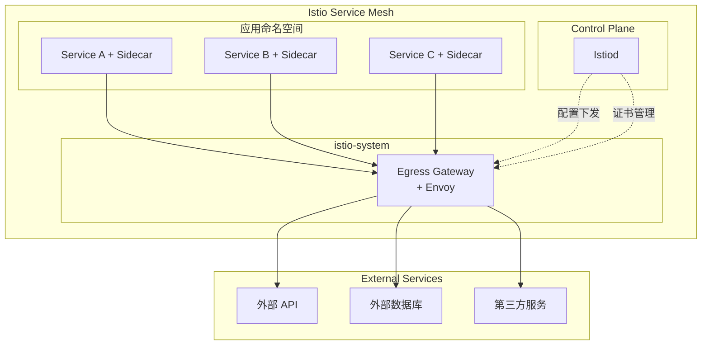
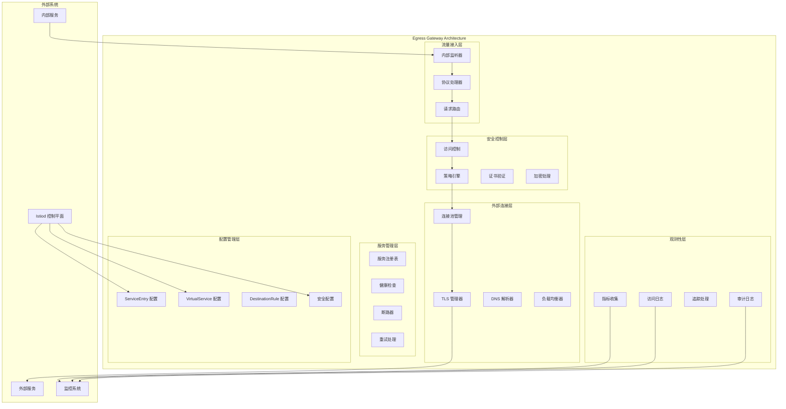
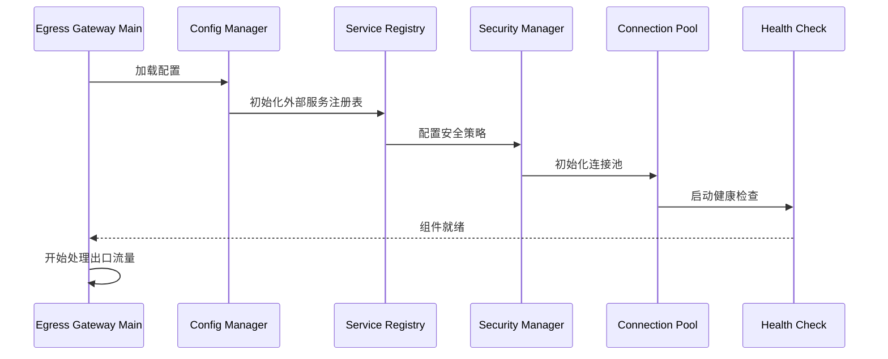
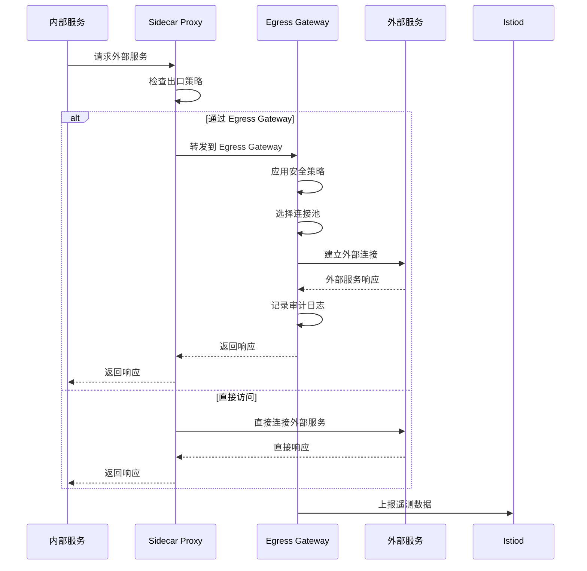
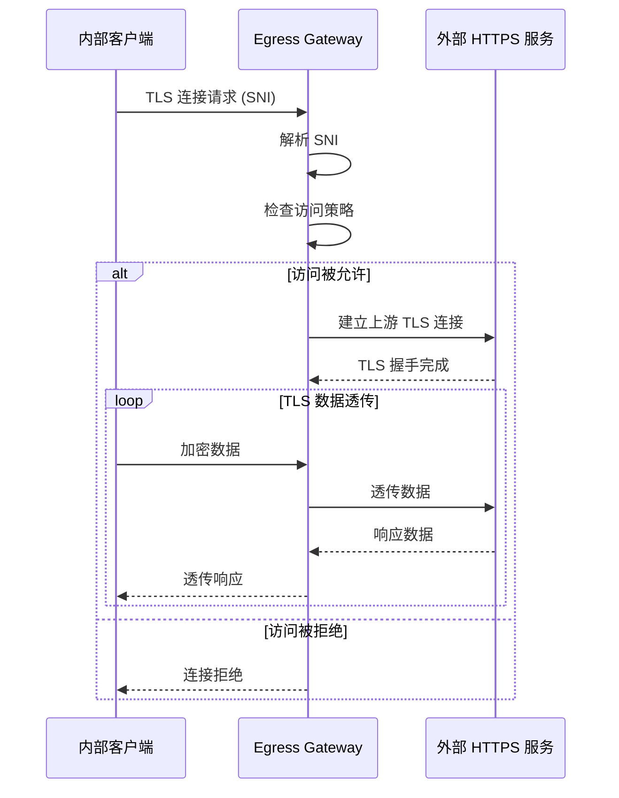
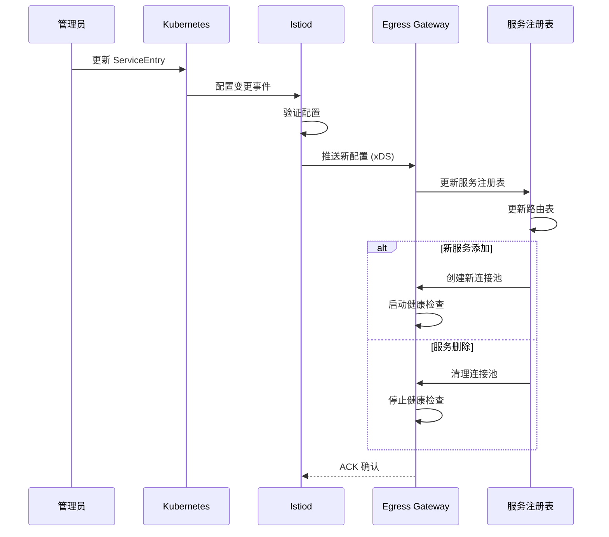

# Egress Gateway 架构解析

## 组件定位

### 在整体架构中的位置和作用

Egress Gateway 是 Istio 服务网格的出口代理组件，负责处理从服务网格内部到外部服务的流量。它作为服务网格的出口控制点，为内部服务访问外部资源提供统一的管理、监控和安全控制。



### 与其他组件的关系和依赖

- **上游依赖**：服务网格内的各种服务和 Sidecar 代理
- **控制平面连接**：从 Istiod 接收路由配置和安全策略
- **下游服务**：外部服务、API、数据库等
- **安全集成**：与证书管理、访问控制策略集成

### 责任边界和接口定义

**核心职责：**
- 出口流量的统一管理和路由
- 外部服务访问的安全控制
- 出口流量的监控和审计
- TLS 连接管理和证书验证

**接口定义：**
- **北向接口**：接收来自内部服务的出口流量
- **南向接口**：连接到外部服务和 API
- **管理接口**：健康检查、指标暴露、配置管理
- **安全接口**：mTLS 验证、外部服务认证

## 设计目标

### 解决的核心问题

1. **出口控制**：集中管理和控制对外部服务的访问
2. **安全合规**：确保外部访问符合企业安全策略
3. **流量监控**：提供出口流量的可观测性
4. **服务发现**：统一管理外部服务的服务发现
5. **故障隔离**：隔离外部服务故障对内部服务的影响

### 性能和可扩展性目标

- **吞吐量**：支持高并发的外部服务访问
- **延迟**：< 10ms 额外延迟 (P99)
- **连接复用**：高效的连接池管理
- **可扩展性**：支持水平扩展
- **资源效率**：优化资源使用

### 安全和可靠性要求

- **访问控制**：基于策略的外部服务访问控制
- **证书管理**：外部服务的 TLS 证书验证
- **审计日志**：完整的出口流量审计记录
- **故障恢复**：外部服务故障时的降级策略
- **零信任**：默认拒绝未授权的外部访问

## 内部架构设计

### 模块结构图



### 关键接口

#### ServiceEntry 配置接口

```yaml
# 外部服务注册接口
apiVersion: networking.istio.io/v1beta1
kind: ServiceEntry
metadata:
  name: external-api-service
spec:
  hosts:
  - api.external.com
  ports:
  - number: 443
    name: https
    protocol: HTTPS
  - number: 80
    name: http
    protocol: HTTP
  location: MESH_EXTERNAL
  resolution: DNS
```

#### Egress Gateway 配置接口

```yaml
# Gateway 出口配置
apiVersion: networking.istio.io/v1beta1
kind: Gateway
metadata:
  name: egress-gateway
spec:
  selector:
    istio: egressgateway
  servers:
  - port:
      number: 80
      name: http
      protocol: HTTP
    hosts:
    - api.external.com
  - port:
      number: 443
      name: tls
      protocol: TLS
    tls:
      mode: PASSTHROUGH
    hosts:
    - api.external.com
```

#### 出口路由配置接口

```yaml
# 出口流量路由
apiVersion: networking.istio.io/v1beta1
kind: VirtualService
metadata:
  name: egress-routing
spec:
  hosts:
  - api.external.com
  gateways:
  - mesh
  - egress-gateway
  http:
  - match:
    - gateways:
      - mesh
      port: 80
    route:
    - destination:
        host: api.external.com
        port:
          number: 80
      via: egress-gateway
  - match:
    - gateways:
      - egress-gateway
      port: 80
    route:
    - destination:
        host: api.external.com
        port:
          number: 80
```

### 数据模型

#### 核心数据结构

```go
// 外部服务配置模型
type ExternalService struct {
    Name        string
    Hosts       []string
    Ports       []Port
    Location    ServiceLocation
    Resolution  Resolution
    Endpoints   []Endpoint
}

// 出口网关配置模型
type EgressGatewayConfig struct {
    Name      string
    Namespace string
    Selector  map[string]string
    Servers   []Server
    TLSConfig *TLSConfig
}

// 连接池配置模型
type ConnectionPoolSettings struct {
    TCP  *TCPSettings
    HTTP *HTTPSettings
}

type TCPSettings struct {
    MaxConnections int32
    ConnectTimeout time.Duration
    KeepaliveTime  time.Duration
}

// 安全策略模型
type SecurityPolicy struct {
    AllowedHosts    []string
    RequiredHeaders map[string]string
    RateLimits      []RateLimit
    AccessControl   []AccessRule
}
```

#### 运行时状态管理

```go
// 外部连接状态
type ExternalConnectionState struct {
    Host              string
    ActiveConnections int32
    TotalRequests     int64
    FailedRequests    int64
    LastAccessTime    time.Time
    HealthStatus      HealthStatus
}

// 流量统计
type EgressTrafficStats struct {
    BytesSent     int64
    BytesReceived int64
    RequestCount  int64
    ErrorCount    int64
    Latency       LatencyStats
}

// 安全上下文
type SecurityContext struct {
    ClientCertificate *tls.Certificate
    ServerCertificate *x509.Certificate
    TLSVersion        uint16
    CipherSuite       uint16
    Verified          bool
}
```

## 工作流程

### 启动和初始化



### 出口流量处理流程

#### HTTP 外部服务访问



#### TLS 透传模式



### 配置动态更新



## 技术细节

### 连接池管理

#### 智能连接池

```cpp
class ExternalConnectionPool {
private:
    struct PooledConnection {
        std::unique_ptr<Network::Connection> connection;
        std::chrono::steady_clock::time_point last_used;
        bool in_use;
        uint32_t request_count;
        std::string host;
    };
    
    std::unordered_map<std::string, std::vector<PooledConnection>> pools_;
    std::mutex pools_mutex_;
    
    // 连接池配置
    uint32_t max_connections_per_host_{10};
    std::chrono::milliseconds idle_timeout_{300000}; // 5分钟
    std::chrono::milliseconds connect_timeout_{30000}; // 30秒
    
public:
    Network::Connection* getConnection(const std::string& host, uint16_t port) {
        std::lock_guard<std::mutex> lock(pools_mutex_);
        
        auto& pool = pools_[host];
        
        // 查找可用连接
        for (auto& conn : pool) {
            if (!conn.in_use && isConnectionHealthy(conn)) {
                conn.in_use = true;
                conn.last_used = std::chrono::steady_clock::now();
                return conn.connection.get();
            }
        }
        
        // 创建新连接
        if (pool.size() < max_connections_per_host_) {
            auto new_conn = createConnection(host, port);
            if (new_conn) {
                pool.emplace_back();
                auto& pooled = pool.back();
                pooled.connection = std::move(new_conn);
                pooled.in_use = true;
                pooled.last_used = std::chrono::steady_clock::now();
                pooled.host = host;
                return pooled.connection.get();
            }
        }
        
        return nullptr; // 连接池已满
    }
    
    void releaseConnection(Network::Connection* conn) {
        std::lock_guard<std::mutex> lock(pools_mutex_);
        
        for (auto& [host, pool] : pools_) {
            for (auto& pooled : pool) {
                if (pooled.connection.get() == conn) {
                    pooled.in_use = false;
                    pooled.request_count++;
                    
                    // 检查连接是否需要回收
                    if (pooled.request_count > 1000 || 
                        !isConnectionHealthy(pooled)) {
                        // 标记为需要回收
                        scheduleConnectionCleanup(pooled);
                    }
                    return;
                }
            }
        }
    }
    
private:
    bool isConnectionHealthy(const PooledConnection& conn) {
        auto now = std::chrono::steady_clock::now();
        auto idle_time = now - conn.last_used;
        
        return idle_time < idle_timeout_ && 
               conn.connection->state() == Network::Connection::State::Open;
    }
    
    void cleanupIdleConnections() {
        std::lock_guard<std::mutex> lock(pools_mutex_);
        auto now = std::chrono::steady_clock::now();
        
        for (auto& [host, pool] : pools_) {
            pool.erase(
                std::remove_if(pool.begin(), pool.end(),
                    [now, this](const PooledConnection& conn) {
                        return !conn.in_use && 
                               (now - conn.last_used) > idle_timeout_;
                    }),
                pool.end()
            );
        }
    }
};
```

### DNS 解析和缓存

#### 智能 DNS 缓存

```cpp
class DNSResolver {
private:
    struct DNSCacheEntry {
        std::vector<std::string> addresses;
        std::chrono::steady_clock::time_point expiry;
        uint32_t ttl;
        bool is_valid;
    };
    
    std::unordered_map<std::string, DNSCacheEntry> dns_cache_;
    std::shared_mutex cache_mutex_;
    
public:
    std::vector<std::string> resolve(const std::string& hostname) {
        // 检查缓存
        {
            std::shared_lock<std::shared_mutex> lock(cache_mutex_);
            auto it = dns_cache_.find(hostname);
            if (it != dns_cache_.end() && 
                it->second.is_valid &&
                std::chrono::steady_clock::now() < it->second.expiry) {
                return it->second.addresses;
            }
        }
        
        // 执行 DNS 查询
        auto addresses = performDNSQuery(hostname);
        if (!addresses.empty()) {
            updateCache(hostname, addresses, 300); // 5分钟 TTL
        }
        
        return addresses;
    }
    
private:
    std::vector<std::string> performDNSQuery(const std::string& hostname) {
        struct addrinfo hints, *result;
        std::vector<std::string> addresses;
        
        memset(&hints, 0, sizeof(hints));
        hints.ai_family = AF_UNSPEC; // IPv4 和 IPv6
        hints.ai_socktype = SOCK_STREAM;
        
        int status = getaddrinfo(hostname.c_str(), nullptr, &hints, &result);
        if (status == 0) {
            for (struct addrinfo* p = result; p != nullptr; p = p->ai_next) {
                char addr_str[INET6_ADDRSTRLEN];
                void* addr;
                
                if (p->ai_family == AF_INET) {
                    addr = &((struct sockaddr_in*)p->ai_addr)->sin_addr;
                } else {
                    addr = &((struct sockaddr_in6*)p->ai_addr)->sin6_addr;
                }
                
                inet_ntop(p->ai_family, addr, addr_str, INET6_ADDRSTRLEN);
                addresses.emplace_back(addr_str);
            }
            freeaddrinfo(result);
        }
        
        return addresses;
    }
    
    void updateCache(const std::string& hostname, 
                    const std::vector<std::string>& addresses, 
                    uint32_t ttl) {
        std::unique_lock<std::shared_mutex> lock(cache_mutex_);
        
        auto& entry = dns_cache_[hostname];
        entry.addresses = addresses;
        entry.ttl = ttl;
        entry.expiry = std::chrono::steady_clock::now() + 
                      std::chrono::seconds(ttl);
        entry.is_valid = true;
    }
};
```

### 安全策略引擎

#### 访问控制引擎

```cpp
class AccessControlEngine {
private:
    struct AccessRule {
        std::regex host_pattern;
        std::vector<std::string> allowed_methods;
        std::vector<std::string> required_headers;
        std::vector<std::string> allowed_ips;
        std::chrono::milliseconds rate_limit_window;
        uint32_t rate_limit_requests;
    };
    
    std::vector<AccessRule> access_rules_;
    std::shared_mutex rules_mutex_;
    
    // 限流状态
    struct RateLimitState {
        std::atomic<uint32_t> request_count{0};
        std::chrono::steady_clock::time_point window_start;
        std::mutex state_mutex;
    };
    
    std::unordered_map<std::string, RateLimitState> rate_limit_states_;
    std::mutex rate_limit_mutex_;
    
public:
    enum class AccessResult {
        ALLOW,
        DENY_HOST_NOT_ALLOWED,
        DENY_METHOD_NOT_ALLOWED,
        DENY_MISSING_HEADERS,
        DENY_RATE_LIMITED,
        DENY_IP_BLOCKED
    };
    
    AccessResult checkAccess(const std::string& host,
                           const std::string& method,
                           const std::map<std::string, std::string>& headers,
                           const std::string& client_ip) {
        
        std::shared_lock<std::shared_mutex> lock(rules_mutex_);
        
        for (const auto& rule : access_rules_) {
            if (std::regex_match(host, rule.host_pattern)) {
                // 检查方法
                if (!rule.allowed_methods.empty() &&
                    std::find(rule.allowed_methods.begin(), 
                             rule.allowed_methods.end(), 
                             method) == rule.allowed_methods.end()) {
                    return AccessResult::DENY_METHOD_NOT_ALLOWED;
                }
                
                // 检查必需头部
                for (const auto& required_header : rule.required_headers) {
                    if (headers.find(required_header) == headers.end()) {
                        return AccessResult::DENY_MISSING_HEADERS;
                    }
                }
                
                // 检查 IP 白名单
                if (!rule.allowed_ips.empty() &&
                    std::find(rule.allowed_ips.begin(), 
                             rule.allowed_ips.end(), 
                             client_ip) == rule.allowed_ips.end()) {
                    return AccessResult::DENY_IP_BLOCKED;
                }
                
                // 检查限流
                if (rule.rate_limit_requests > 0) {
                    if (!checkRateLimit(host, rule)) {
                        return AccessResult::DENY_RATE_LIMITED;
                    }
                }
                
                return AccessResult::ALLOW;
            }
        }
        
        return AccessResult::DENY_HOST_NOT_ALLOWED;
    }
    
private:
    bool checkRateLimit(const std::string& host, const AccessRule& rule) {
        std::lock_guard<std::mutex> lock(rate_limit_mutex_);
        
        auto& state = rate_limit_states_[host];
        std::lock_guard<std::mutex> state_lock(state.state_mutex);
        
        auto now = std::chrono::steady_clock::now();
        
        // 检查是否需要重置窗口
        if (now - state.window_start >= rule.rate_limit_window) {
            state.request_count.store(0);
            state.window_start = now;
        }
        
        // 检查是否超过限制
        uint32_t current_count = state.request_count.fetch_add(1);
        return current_count < rule.rate_limit_requests;
    }
};
```

## 架构配置

### 基础配置示例

#### 外部服务注册

```yaml
# 注册外部 API 服务
apiVersion: networking.istio.io/v1beta1
kind: ServiceEntry
metadata:
  name: external-api
  namespace: default
spec:
  hosts:
  - api.external.com
  - backup-api.external.com
  ports:
  - number: 443
    name: https
    protocol: HTTPS
  - number: 80
    name: http
    protocol: HTTP
  location: MESH_EXTERNAL
  resolution: DNS
---
# 注册外部数据库
apiVersion: networking.istio.io/v1beta1
kind: ServiceEntry
metadata:
  name: external-database
  namespace: default
spec:
  hosts:
  - db.external.com
  ports:
  - number: 5432
    name: postgres
    protocol: TCP
  location: MESH_EXTERNAL
  resolution: DNS
  endpoints:
  - address: db1.external.com
  - address: db2.external.com
```

#### Egress Gateway 部署配置

```yaml
apiVersion: apps/v1
kind: Deployment
metadata:
  name: istio-egressgateway
  namespace: istio-system
spec:
  replicas: 2
  selector:
    matchLabels:
      app: istio-egressgateway
  template:
    spec:
      affinity:
        podAntiAffinity:
          requiredDuringSchedulingIgnoredDuringExecution:
          - labelSelector:
              matchLabels:
                app: istio-egressgateway
            topologyKey: kubernetes.io/hostname
      containers:
      - name: istio-proxy
        image: istio/proxyv2:1.20.0
        resources:
          requests:
            memory: "128Mi"
            cpu: "100m"
          limits:
            memory: "512Mi"
            cpu: "1000m"
        env:
        # 出口网关专用配置
        - name: ISTIO_META_ROUTER_MODE
          value: "sni-dnat"
        - name: ISTIO_META_REQUESTED_NETWORK_VIEW
          value: "external"
        # 连接池配置
        - name: PILOT_HTTP_CONNECTION_POOL_SIZE
          value: "10"
        - name: PILOT_TCP_CONNECTION_POOL_SIZE
          value: "5"
        readinessProbe:
          httpGet:
            path: /healthz/ready
            port: 15021
        livenessProbe:
          httpGet:
            path: /healthz/ready
            port: 15021
```

#### 高级路由配置

```yaml
# 出口网关配置
apiVersion: networking.istio.io/v1beta1
kind: Gateway
metadata:
  name: egress-gateway
  namespace: istio-system
spec:
  selector:
    istio: egressgateway
  servers:
  # HTTP 出口
  - port:
      number: 80
      name: http
      protocol: HTTP
    hosts:
    - api.external.com
  # HTTPS 透传
  - port:
      number: 443
      name: tls
      protocol: TLS
    tls:
      mode: PASSTHROUGH
    hosts:
    - secure-api.external.com
  # 数据库连接
  - port:
      number: 5432
      name: postgres
      protocol: TCP
    hosts:
    - db.external.com
---
# 复杂路由规则
apiVersion: networking.istio.io/v1beta1
kind: VirtualService
metadata:
  name: external-services
  namespace: default
spec:
  hosts:
  - api.external.com
  gateways:
  - mesh
  - istio-system/egress-gateway
  http:
  # 内部到网关的路由
  - match:
    - gateways:
      - mesh
      headers:
        x-service-type:
          exact: "critical"
    route:
    - destination:
        host: istio-egressgateway.istio-system.svc.cluster.local
        port:
          number: 80
      weight: 100
  # 网关到外部的路由
  - match:
    - gateways:
      - istio-system/egress-gateway
    route:
    - destination:
        host: api.external.com
        port:
          number: 80
    timeout: 30s
    retries:
      attempts: 3
      perTryTimeout: 10s
      retryOn: gateway-error,connect-failure,refused-stream
```

### 安全配置

#### 外部服务访问控制

```yaml
# 出口流量授权策略
apiVersion: security.istio.io/v1beta1
kind: AuthorizationPolicy
metadata:
  name: egress-authz
  namespace: istio-system
spec:
  selector:
    matchLabels:
      app: istio-egressgateway
  rules:
  # 只允许特定服务访问外部 API
  - from:
    - source:
        principals: 
        - "cluster.local/ns/production/sa/api-service"
        - "cluster.local/ns/production/sa/data-processor"
    to:
    - operation:
        methods: ["GET", "POST"]
    when:
    - key: destination.service.name
      values: ["api.external.com"]
      
  # 数据库访问限制
  - from:
    - source:
        principals: ["cluster.local/ns/production/sa/database-client"]
    to:
    - operation:
        ports: ["5432"]
    when:
    - key: destination.service.name
      values: ["db.external.com"]
---
# Sidecar 配置限制出口流量
apiVersion: networking.istio.io/v1beta1
kind: Sidecar
metadata:
  name: egress-restriction
  namespace: production
spec:
  egress:
  # 只允许访问注册的外部服务
  - hosts:
    - "./*"  # 内部服务
    - "istio-system/*"  # Istio 系统服务
    - "./api.external.com"  # 指定的外部服务
  outboundTrafficPolicy:
    mode: REGISTRY_ONLY  # 只允许注册表中的服务
```

### 性能调优

#### 连接池优化

```yaml
# DestinationRule 连接池配置
apiVersion: networking.istio.io/v1beta1
kind: DestinationRule
metadata:
  name: external-api-destination
  namespace: default
spec:
  host: api.external.com
  trafficPolicy:
    connectionPool:
      tcp:
        maxConnections: 20          # 最大连接数
        connectTimeout: 30s         # 连接超时
        keepAlive:
          time: 7200s              # 保活时间
          interval: 75s            # 保活间隔
          probes: 9                # 保活探测次数
      http:
        http1MaxPendingRequests: 50  # HTTP/1.1 最大挂起请求
        http2MaxRequests: 100        # HTTP/2 最大请求数
        maxRequestsPerConnection: 10 # 每连接最大请求数
        maxRetries: 3               # 最大重试次数
        idleTimeout: 60s            # 空闲超时
        h2UpgradePolicy: UPGRADE    # HTTP/2 升级策略
    loadBalancer:
      simple: ROUND_ROBIN          # 负载均衡算法
    outlierDetection:
      consecutiveErrors: 3         # 连续错误阈值
      interval: 30s                # 检测间隔
      baseEjectionTime: 30s        # 基础驱逐时间
      maxEjectionPercent: 50       # 最大驱逐百分比
```

#### 监控配置

```yaml
# 遥测配置
apiVersion: telemetry.istio.io/v1alpha1
kind: Telemetry
metadata:
  name: egress-telemetry
  namespace: istio-system
spec:
  selector:
    matchLabels:
      app: istio-egressgateway
  metrics:
  - providers:
    - name: prometheus
  - overrides:
    - match:
        metric: ALL_METRICS
      operation: UPSERT
      value:
        dimensions:
          destination_host: "destination.service.name | 'unknown'"
          source_app: "source.labels['app'] | 'unknown'"
          response_code: "response.code | 0"
        tags:
          egress_gateway: "true"
  accessLogging:
  - providers:
    - name: otel
    format: |
      {
        "timestamp": "%START_TIME%",
        "method": "%REQ(:METHOD)%",
        "url": "%REQ(X-ENVOY-ORIGINAL-PATH?:PATH)%",
        "protocol": "%PROTOCOL%",
        "response_code": %RESPONSE_CODE%,
        "response_flags": "%RESPONSE_FLAGS%",
        "bytes_received": %BYTES_RECEIVED%,
        "bytes_sent": %BYTES_SENT%,
        "duration": %DURATION%,
        "upstream_service_time": "%RESP(X-ENVOY-UPSTREAM-SERVICE-TIME)%",
        "x_forwarded_for": "%REQ(X-FORWARDED-FOR)%",
        "user_agent": "%REQ(USER-AGENT)%",
        "request_id": "%REQ(X-REQUEST-ID)%",
        "authority": "%REQ(:AUTHORITY)%",
        "upstream_host": "%UPSTREAM_HOST%",
        "source_app": "%REQ(X-SOURCE-APP)%",
        "destination_service": "%REQ(X-DESTINATION-SERVICE)%"
      }
```

## 故障排除和运维

### 常见问题诊断

#### 外部服务连接问题

```bash
# 检查 ServiceEntry 配置
kubectl get serviceentry -A

# 验证 DNS 解析
kubectl exec -it istio-egressgateway-xxx -n istio-system -- nslookup api.external.com

# 检查路由配置
istioctl proxy-config routes istio-egressgateway-xxx.istio-system -o json

# 测试连接
kubectl exec -it istio-egressgateway-xxx -n istio-system -- curl -v http://api.external.com
```

#### 权限和策略问题

```bash
# 检查授权策略
kubectl get authorizationpolicy -n istio-system

# 查看 Sidecar 配置
kubectl get sidecar -A -o yaml

# 验证出口流量策略
istioctl proxy-config cluster productpage-v1-123456.default | grep api.external.com
```

#### 性能问题分析

```bash
# 检查连接池状态
kubectl exec -it istio-egressgateway-xxx -n istio-system -- curl localhost:15000/clusters

# 查看统计信息
kubectl exec -it istio-egressgateway-xxx -n istio-system -- curl localhost:15000/stats | grep upstream

# 检查健康状态
kubectl exec -it istio-egressgateway-xxx -n istio-system -- curl localhost:15000/clusters | grep health
```

### 监控和指标

#### 关键性能指标

```prometheus
# 出口请求速率
rate(envoy_cluster_upstream_rq_total{cluster_name=~"outbound.*external.*"}[5m])

# 出口请求延迟
histogram_quantile(0.99, 
  rate(envoy_cluster_upstream_rq_time_bucket{cluster_name=~"outbound.*external.*"}[5m])
)

# 外部服务错误率
rate(envoy_cluster_upstream_rq_total{cluster_name=~"outbound.*external.*",response_code!~"2.."}[5m]) /
rate(envoy_cluster_upstream_rq_total{cluster_name=~"outbound.*external.*"}[5m])

# 连接池使用率
envoy_cluster_upstream_cx_active{cluster_name=~"outbound.*external.*"} /
envoy_cluster_upstream_cx_total{cluster_name=~"outbound.*external.*"}

# DNS 解析延迟
histogram_quantile(0.95, rate(envoy_dns_cache_dns_query_attempt_bucket[5m]))
```

#### 告警规则

```yaml
groups:
- name: egress-gateway.rules
  rules:
  - alert: EgressGatewayDown
    expr: up{job="istio-proxy", pod=~"istio-egressgateway-.*"} == 0
    for: 1m
    labels:
      severity: critical
    annotations:
      summary: "Egress Gateway is down"
      
  - alert: ExternalServiceHighErrorRate
    expr: |
      (
        rate(envoy_cluster_upstream_rq_total{cluster_name=~"outbound.*external.*",response_code!~"2.."}[5m]) /
        rate(envoy_cluster_upstream_rq_total{cluster_name=~"outbound.*external.*"}[5m])
      ) > 0.1
    for: 3m
    labels:
      severity: warning
    annotations:
      summary: "High error rate for external services"
      
  - alert: ExternalServiceConnectionPoolExhausted
    expr: |
      envoy_cluster_upstream_cx_active{cluster_name=~"outbound.*external.*"} /
      envoy_cluster_upstream_cx_total{cluster_name=~"outbound.*external.*"} > 0.9
    for: 2m
    labels:
      severity: warning
    annotations:
      summary: "External service connection pool near exhaustion"
```

## 最佳实践

### 安全最佳实践

1. **最小权限原则**：只允许必要的服务访问外部资源
2. **流量加密**：使用 TLS 保护外部通信
3. **访问审计**：记录所有外部服务访问
4. **证书验证**：验证外部服务的 TLS 证书

### 性能优化建议

1. **连接复用**：配置适当的连接池大小
2. **DNS 缓存**：启用 DNS 缓存减少解析延迟
3. **健康检查**：配置主动健康检查
4. **负载均衡**：使用适当的负载均衡算法

### 运维建议

1. **监控覆盖**：监控所有外部服务的健康状态
2. **故障恢复**：配置重试和断路器机制
3. **容量规划**：根据流量模式规划连接池大小
4. **版本管理**：管理外部服务的版本和兼容性

## 参考资料

- [Istio Egress 流量管理](https://istio.io/latest/docs/tasks/traffic-management/egress/)
- [ServiceEntry 配置参考](https://istio.io/latest/docs/reference/config/networking/service-entry/)
- [出口网关配置](https://istio.io/latest/docs/tasks/traffic-management/egress/egress-gateway/)
- [外部服务访问控制](https://istio.io/latest/docs/tasks/traffic-management/egress/egress-control/)
