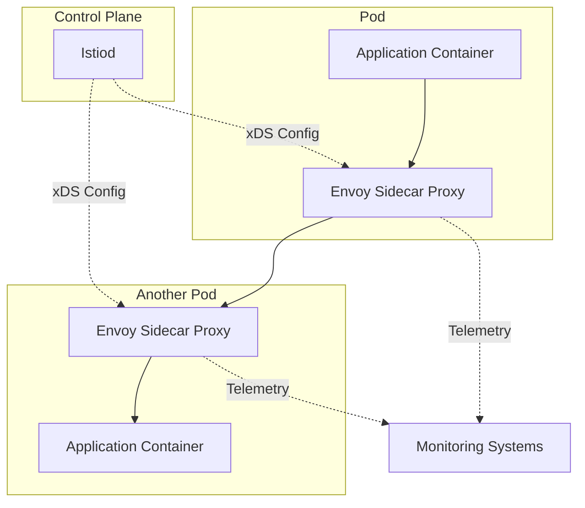
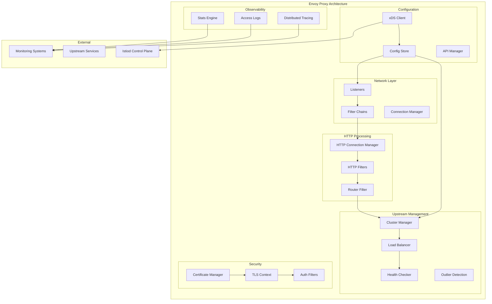
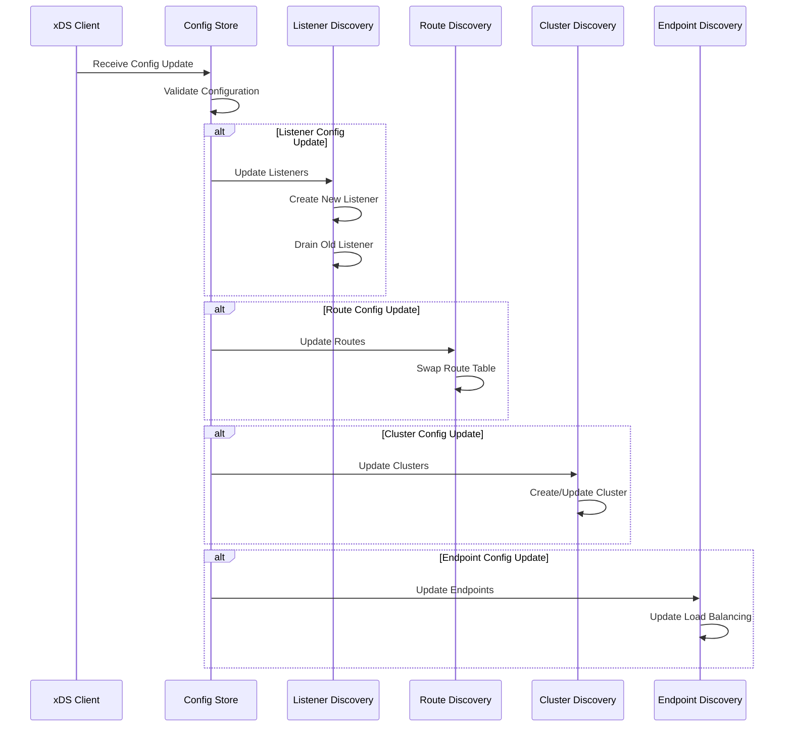
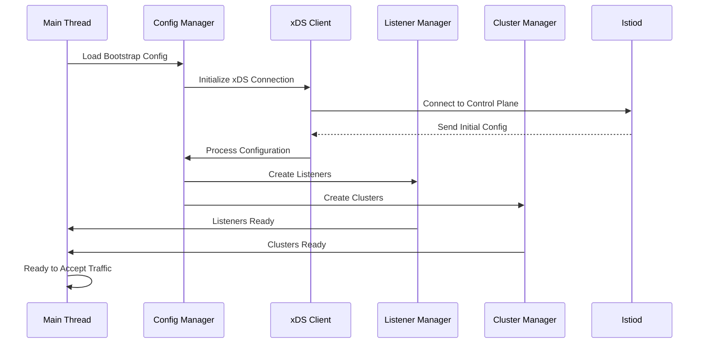
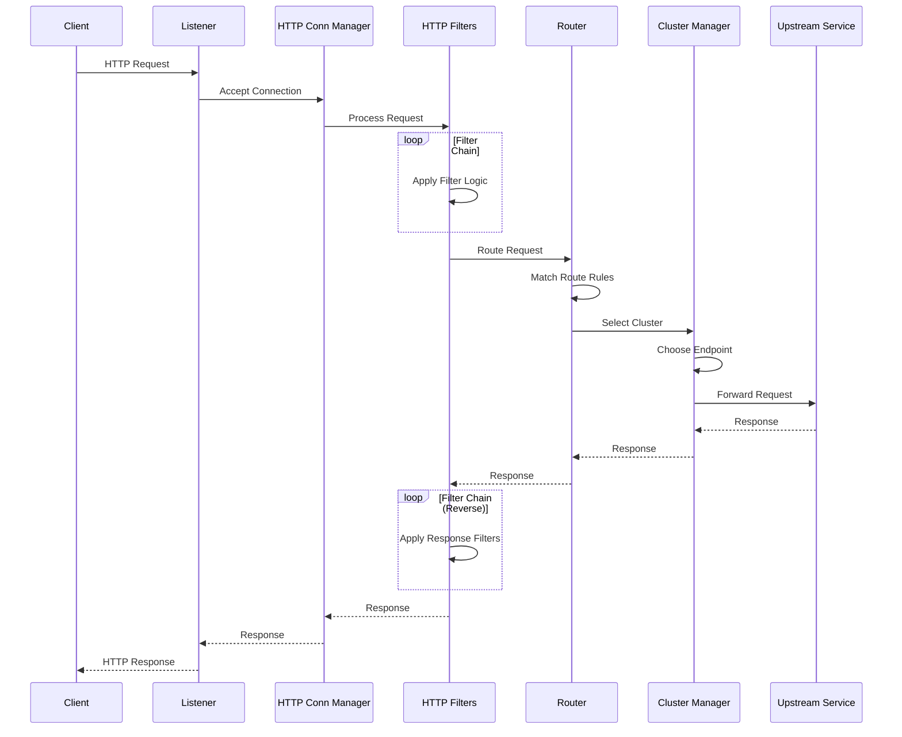
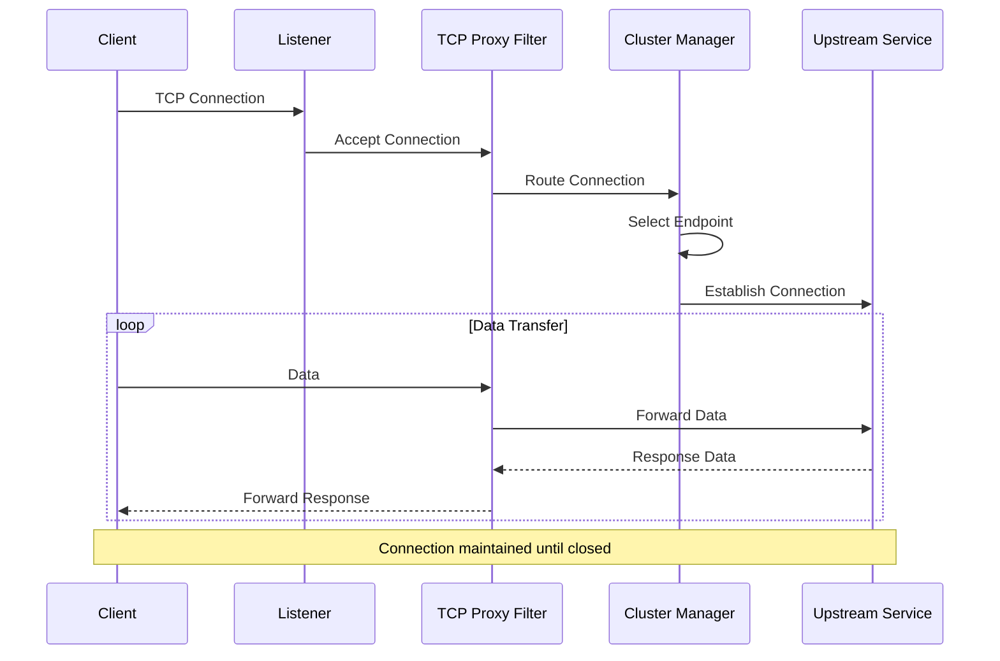
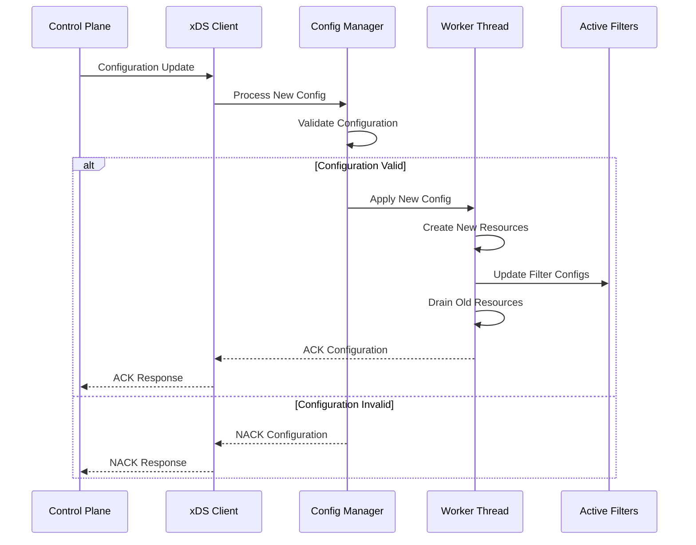

# Envoy Proxy 架构解析

## 组件定位

### 在整体架构中的位置和作用

Envoy Proxy 是 Istio 服务网格的数据平面核心组件，以 Sidecar 模式部署在每个应用实例旁边。它承担着所有服务间通信的代理职责，是服务网格功能实现的基础。



### 与其他组件的关系和依赖

- **控制平面连接**：通过 xDS API 从 Istiod 接收配置
- **应用程序集成**：拦截和代理应用的所有网络流量
- **观测性系统**：向监控、日志、追踪系统发送遥测数据
- **安全系统**：处理 mTLS 认证和证书管理

### 责任边界和接口定义

**核心职责：**
- 流量拦截和代理
- 负载均衡和故障恢复
- 安全策略执行
- 遥测数据收集

**接口定义：**
- **上游接口**：xDS gRPC API（与 Istiod 通信）
- **下游接口**：HTTP/TCP 代理接口（与应用通信）
- **管理接口**：管理和调试 API
- **遥测接口**：指标、日志、追踪数据输出

## 设计目标

### 解决的核心问题

1. **流量治理**：实现细粒度的流量控制和管理
2. **服务发现**：动态发现和路由到后端服务
3. **可观测性**：提供全面的网络层面观测能力
4. **安全性**：实现服务间的安全通信
5. **弹性**：提供故障恢复和限流能力

### 性能和可扩展性目标

- **延迟开销**：< 1ms (P99)
- **吞吐量**：支持 10K+ RPS
- **内存使用**：< 100MB (典型场景)
- **CPU 使用**：< 0.5 core (稳态)
- **连接数**：支持 1000+ 并发连接

### 安全和可靠性要求

- **零停机更新**：支持热重启和优雅重载
- **故障隔离**：单个连接故障不影响其他连接
- **安全通信**：强制执行 mTLS 和访问控制
- **资源保护**：防止资源耗尽攻击

## 内部架构设计

### 模块结构图



### 关键接口

#### 网络处理接口

```cpp
// 监听器接口
class Listener {
public:
  virtual Network::ConnectionHandler& connectionHandler() = 0;
  virtual void onAccept(Network::ConnectionSocketPtr&& socket) = 0;
  virtual void onReject(RejectCause cause) = 0;
};

// 过滤器接口
class NetworkFilter {
public:
  virtual FilterStatus onNewConnection() = 0;
  virtual FilterStatus onData(Buffer::Instance& data, bool end_stream) = 0;
  virtual FilterStatus onWrite(Buffer::Instance& data, bool end_stream) = 0;
};
```

#### HTTP 处理接口

```cpp
// HTTP 过滤器接口
class StreamDecoderFilter {
public:
  virtual FilterHeadersStatus decodeHeaders(RequestHeaderMap& headers, bool end_stream) = 0;
  virtual FilterDataStatus decodeData(Buffer::Instance& data, bool end_stream) = 0;
  virtual FilterTrailersStatus decodeTrailers(RequestTrailerMap& trailers) = 0;
};

// 路由接口
class Router {
public:
  virtual RouteConstSharedPtr route(const Http::RequestHeaderMap& headers) const = 0;
  virtual std::string routeName() const = 0;
};
```

#### 集群管理接口

```cpp
// 集群管理器接口
class ClusterManager {
public:
  virtual ClusterInfoConstSharedPtr getCluster(const std::string& cluster) = 0;
  virtual ThreadLocalCluster* getThreadLocalCluster(const std::string& cluster) = 0;
  virtual void addOrUpdateCluster(const envoy::config::cluster::v3::Cluster& cluster) = 0;
};

// 负载均衡器接口
class LoadBalancer {
public:
  virtual HostConstSharedPtr chooseHost(LoadBalancerContext* context) = 0;
  virtual HostConstSharedPtr peekAnotherHost(LoadBalancerContext* context) = 0;
};
```

### 数据模型

#### 核心数据结构

```cpp
// 监听器配置
struct ListenerConfig {
    std::string name;
    Network::Address::InstanceConstSharedPtr address;
    std::vector<FilterChainSharedPtr> filter_chains;
    std::chrono::milliseconds drain_timeout;
    bool use_original_dst;
};

// 集群配置
struct ClusterConfig {
    std::string name;
    ClusterType type;
    std::vector<HostSharedPtr> hosts;
    LoadBalancingPolicy lb_policy;
    HealthCheckConfig health_check;
    CircuitBreakerConfig circuit_breaker;
};

// 路由配置
struct RouteConfig {
    std::string name;
    std::vector<VirtualHostSharedPtr> virtual_hosts;
    std::vector<HTTPFilterSharedPtr> http_filters;
    RequestHeadersToAdd request_headers_to_add;
    ResponseHeadersToAdd response_headers_to_add;
};
```

#### 运行时状态管理

```cpp
// 连接状态
class ConnectionState {
    Network::ConnectionState state_;
    std::chrono::steady_clock::time_point last_activity_;
    uint64_t bytes_sent_;
    uint64_t bytes_received_;
    SSL::ConnectionInfoConstSharedPtr ssl_info_;
};

// 请求状态
class StreamState {
    Http::StreamDecoderFilterCallbacks* decoder_callbacks_;
    Http::StreamEncoderFilterCallbacks* encoder_callbacks_;
    std::chrono::steady_clock::time_point start_time_;
    RouteConstSharedPtr route_;
    ClusterInfoConstSharedPtr cluster_info_;
};
```

#### 配置热更新机制



## 工作流程

### 启动和初始化



### 请求处理流程

#### HTTP 请求处理



#### TCP 流量处理



### 配置动态更新流程



## 技术细节

### 核心算法

#### 负载均衡算法

```cpp
// 轮询负载均衡
class RoundRobinLoadBalancer : public LoadBalancer {
private:
    std::atomic<uint32_t> rr_index_{0};
    
public:
    HostConstSharedPtr chooseHost(LoadBalancerContext* context) override {
        const auto& hosts = cluster_->healthyHosts();
        if (hosts.empty()) {
            return nullptr;
        }
        
        // 原子操作确保线程安全
        uint32_t index = rr_index_.fetch_add(1) % hosts.size();
        return hosts[index];
    }
};

// 一致性哈希负载均衡
class RingHashLoadBalancer : public LoadBalancer {
private:
    using Ring = std::map<uint64_t, HostConstSharedPtr>;
    Ring ring_;
    uint32_t min_ring_size_;
    
public:
    HostConstSharedPtr chooseHost(LoadBalancerContext* context) override {
        if (ring_.empty()) {
            return nullptr;
        }
        
        uint64_t hash = context->computeHashKey();
        auto it = ring_.lower_bound(hash);
        if (it == ring_.end()) {
            it = ring_.begin();
        }
        return it->second;
    }
};
```

#### 断路器算法

```cpp
class CircuitBreaker {
private:
    enum State { CLOSED, OPEN, HALF_OPEN };
    
    std::atomic<State> state_{CLOSED};
    std::atomic<uint32_t> failure_count_{0};
    std::atomic<uint32_t> success_count_{0};
    std::chrono::steady_clock::time_point last_failure_time_;
    
    const uint32_t failure_threshold_;
    const std::chrono::milliseconds timeout_;
    
public:
    bool allowRequest() {
        State current_state = state_.load();
        
        switch (current_state) {
            case CLOSED:
                return true;
                
            case OPEN:
                if (shouldAttemptReset()) {
                    state_ = HALF_OPEN;
                    return true;
                }
                return false;
                
            case HALF_OPEN:
                return true;
        }
    }
    
    void onSuccess() {
        if (state_ == HALF_OPEN) {
            state_ = CLOSED;
            failure_count_ = 0;
        }
        success_count_.fetch_add(1);
    }
    
    void onFailure() {
        uint32_t failures = failure_count_.fetch_add(1) + 1;
        if (failures >= failure_threshold_) {
            state_ = OPEN;
            last_failure_time_ = std::chrono::steady_clock::now();
        }
    }
};
```

### 并发和锁机制

#### 事件驱动模型

```cpp
// 事件循环
class EventLoop {
private:
    Event::DispatcherPtr dispatcher_;
    std::thread::id thread_id_;
    
public:
    void run() {
        thread_id_ = std::this_thread::get_id();
        dispatcher_->run(Event::Dispatcher::RunType::Block);
    }
    
    void post(std::function<void()> callback) {
        dispatcher_->post(std::move(callback));
    }
    
    bool isThreadSafe() const {
        return std::this_thread::get_id() == thread_id_;
    }
};

// 线程本地存储
class ThreadLocalObject {
public:
    template<typename T>
    T& getTyped() {
        return *static_cast<T*>(getGeneric());
    }
    
protected:
    virtual void* getGeneric() = 0;
};
```

#### 无锁数据结构

```cpp
// 无锁队列用于统计数据
template<typename T>
class LockFreeQueue {
private:
    struct Node {
        std::atomic<T*> data{nullptr};
        std::atomic<Node*> next{nullptr};
    };
    
    std::atomic<Node*> head_{new Node};
    std::atomic<Node*> tail_{head_.load()};
    
public:
    void enqueue(T item) {
        Node* new_node = new Node;
        T* data = new T(std::move(item));
        
        Node* prev_tail = tail_.exchange(new_node);
        prev_tail->data.store(data);
        prev_tail->next.store(new_node);
    }
    
    bool dequeue(T& result) {
        Node* head = head_.load();
        Node* next = head->next.load();
        
        if (next == nullptr) {
            return false;
        }
        
        T* data = next->data.exchange(nullptr);
        if (data == nullptr) {
            return false;
        }
        
        result = *data;
        delete data;
        head_.store(next);
        delete head;
        return true;
    }
};
```

### 内存管理

#### 缓冲区管理

```cpp
// 高效的缓冲区实现
class BufferImpl : public Buffer::Instance {
private:
    struct Slice {
        uint8_t* base_;
        uint64_t size_;
        uint64_t reservation_size_;
        std::shared_ptr<void> slice_ptr_;
    };
    
    std::list<Slice> slices_;
    uint64_t length_{0};
    
public:
    void add(const void* data, uint64_t size) override {
        if (size == 0) {
            return;
        }
        
        // 尝试复用现有slice
        if (!slices_.empty() && 
            slices_.back().size_ + size <= slices_.back().reservation_size_) {
            Slice& slice = slices_.back();
            memcpy(slice.base_ + slice.size_, data, size);
            slice.size_ += size;
        } else {
            // 创建新slice
            addSlice(data, size);
        }
        
        length_ += size;
    }
    
    void drain(uint64_t size) override {
        while (size > 0 && !slices_.empty()) {
            Slice& slice = slices_.front();
            if (size >= slice.size_) {
                size -= slice.size_;
                length_ -= slice.size_;
                slices_.pop_front();
            } else {
                slice.base_ += size;
                slice.size_ -= size;
                length_ -= size;
                size = 0;
            }
        }
    }
};
```

### 网络通信优化

#### 连接池管理

```cpp
class ConnectionPoolImpl {
private:
    struct ActiveClient {
        Network::ClientConnectionPtr connection_;
        std::chrono::steady_clock::time_point last_used_;
        uint32_t request_count_{0};
        bool in_use_{false};
    };
    
    std::list<ActiveClient> ready_clients_;
    std::list<ActiveClient> busy_clients_;
    const uint32_t max_connections_;
    const std::chrono::milliseconds idle_timeout_;
    
public:
    Network::ClientConnection* getConnection() {
        // 清理空闲连接
        cleanupIdleConnections();
        
        // 复用现有连接
        if (!ready_clients_.empty()) {
            auto client = std::move(ready_clients_.front());
            ready_clients_.pop_front();
            client.in_use_ = true;
            client.last_used_ = std::chrono::steady_clock::now();
            busy_clients_.push_back(std::move(client));
            return busy_clients_.back().connection_.get();
        }
        
        // 创建新连接
        if (busy_clients_.size() < max_connections_) {
            return createNewConnection();
        }
        
        return nullptr;
    }
    
    void releaseConnection(Network::ClientConnection* connection) {
        auto it = std::find_if(busy_clients_.begin(), busy_clients_.end(),
            [connection](const ActiveClient& client) {
                return client.connection_.get() == connection;
            });
            
        if (it != busy_clients_.end()) {
            it->in_use_ = false;
            it->last_used_ = std::chrono::steady_clock::now();
            ready_clients_.splice(ready_clients_.end(), busy_clients_, it);
        }
    }
};
```

## 架构配置

### 关键配置参数

#### 性能相关配置

```yaml
# Bootstrap 配置
admin:
  address:
    socket_address:
      address: 127.0.0.1
      port_value: 15000

static_resources:
  listeners:
  - name: listener_0
    address:
      socket_address:
        address: 0.0.0.0
        port_value: 15006
    listener_filters:
    - name: envoy.filters.listener.original_dst
    per_connection_buffer_limit_bytes: 32768  # 连接缓冲区限制
    
cluster_manager:
  outlier_detection:
    consecutive_5xx: 5                        # 连续错误阈值
    interval: 30s                             # 检测间隔
    base_ejection_time: 30s                   # 基础排除时间
    max_ejection_percent: 50                  # 最大排除百分比
    
  upstream_connection_options:
    tcp_keepalive:
      keepalive_probes: 9
      keepalive_time: 7200
      keepalive_interval: 75
```

#### 内存和并发配置

```yaml
# 工作线程配置
concurrency: 2                               # 工作线程数量

# 统计配置
stats_config:
  stats_tags:
  - tag_name: cluster_name
    regex: "^cluster\\.((.+?)\\.).*"
  histogram_bucket_settings:
  - match:
      prefix: "cluster.outbound"
    buckets: [0.5, 1, 5, 10, 25, 50, 100, 250, 500, 1000, 2500, 5000, 10000]

# 缓冲区配置
buffer:
  max_heap_size_bytes: 104857600              # 最大堆内存 100MB
```

#### 安全配置

```yaml
# TLS 配置
transport_socket:
  name: envoy.transport_sockets.tls
  typed_config:
    "@type": type.googleapis.com/envoy.extensions.transport_sockets.tls.v3.UpstreamTlsContext
    common_tls_context:
      alpn_protocols: ["h2", "http/1.1"]
      tls_params:
        tls_minimum_protocol_version: TLSv1_2
        tls_maximum_protocol_version: TLSv1_3
        cipher_suites:
        - "ECDHE-RSA-AES128-GCM-SHA256"
        - "ECDHE-RSA-AES256-GCM-SHA384"
        
# 证书配置
certificate_chain: { filename: "/etc/ssl/certs/cert.pem" }
private_key: { filename: "/etc/ssl/private/key.pem" }
trusted_ca: { filename: "/etc/ssl/certs/ca.pem" }
```

### 性能调优

#### 网络优化

```yaml
# 连接池配置
circuit_breakers:
  thresholds:
  - priority: DEFAULT
    max_connections: 1024                     # 最大连接数
    max_pending_requests: 1024                # 最大挂起请求数
    max_requests: 1024                        # 最大请求数
    max_retries: 3                            # 最大重试数
    retry_budget:
      budget_percent: 20.0                    # 重试预算百分比
      min_retry_concurrency: 3                # 最小重试并发数

# HTTP/2 配置
http2_protocol_options:
  max_concurrent_streams: 100                 # 最大并发流数
  initial_stream_window_size: 64KB           # 初始流窗口大小
  initial_connection_window_size: 1MB        # 初始连接窗口大小
  hpack_table_size: 4096                     # HPACK 表大小
```

#### 内存优化

```yaml
# 限制配置
resource_limits:
  listener:
    example_listener_name:
      connection_limit: 10000                 # 连接数限制
      
# 统计限制
stats_sinks:
- name: envoy.stat_sinks.metrics_service
  typed_config:
    "@type": type.googleapis.com/envoy.config.core.v3.GrpcService
    envoy_grpc:
      cluster_name: metrics-service
  config:
    max_obj_name_len: 100                     # 最大对象名长度
    max_stats_in_flight: 500                  # 最大飞行中统计数
```

### 容量规划

#### 资源需求评估

**基准容量指标：**
- **并发连接数**：1000-5000
- **请求速率**：1K-10K RPS
- **内存使用**：50-200MB
- **CPU 使用**：0.1-0.5 core
- **网络带宽**：10-100 Mbps

#### 扩容策略

```yaml
# 资源限制配置
resources:
  requests:
    memory: "64Mi"
    cpu: "100m"
  limits:
    memory: "256Mi"
    cpu: "1000m"

# HPA 配置示例
apiVersion: autoscaling/v2
kind: HorizontalPodAutoscaler
metadata:
  name: app-hpa
spec:
  scaleTargetRef:
    apiVersion: apps/v1
    kind: Deployment
    name: my-app
  minReplicas: 2
  maxReplicas: 10
  metrics:
  - type: Resource
    resource:
      name: cpu
      target:
        type: Utilization
        averageUtilization: 70
  - type: Pods
    pods:
      metric:
        name: envoy_http_downstream_rq_active
      target:
        type: AverageValue
        averageValue: "100"
```

## 故障排除和运维

### 常见问题诊断

#### 性能问题

```bash
# 检查 Envoy 统计信息
kubectl exec -it pod-name -c istio-proxy -- curl localhost:15000/stats

# 检查连接状态
kubectl exec -it pod-name -c istio-proxy -- curl localhost:15000/clusters

# 检查配置状态
kubectl exec -it pod-name -c istio-proxy -- curl localhost:15000/config_dump

# 检查内存使用
kubectl exec -it pod-name -c istio-proxy -- curl localhost:15000/memory
```

#### 连接问题

```bash
# 检查监听器状态
kubectl exec -it pod-name -c istio-proxy -- curl localhost:15000/listeners

# 检查证书状态
kubectl exec -it pod-name -c istio-proxy -- curl localhost:15000/certs

# 实时日志跟踪
kubectl logs -f pod-name -c istio-proxy
```

### 监控和指标

#### 关键性能指标

```prometheus
# 请求速率
rate(envoy_http_downstream_rq_total[5m])

# 请求延迟
histogram_quantile(0.99, envoy_http_downstream_rq_time_bucket)

# 错误率
rate(envoy_http_downstream_rq_total{response_code!~"2.."}[5m]) / 
rate(envoy_http_downstream_rq_total[5m])

# 连接数
envoy_http_downstream_cx_active

# 内存使用
envoy_server_memory_allocated

# CPU 使用
rate(container_cpu_usage_seconds_total{container="istio-proxy"}[5m])
```

#### 告警规则

```yaml
groups:
- name: envoy.rules
  rules:
  - alert: EnvoyHighErrorRate
    expr: |
      (
        rate(envoy_http_downstream_rq_total{response_code!~"2.."}[5m]) /
        rate(envoy_http_downstream_rq_total[5m])
      ) > 0.05
    for: 2m
    labels:
      severity: warning
    annotations:
      summary: "Envoy proxy high error rate"
      
  - alert: EnvoyHighLatency
    expr: |
      histogram_quantile(0.99, 
        rate(envoy_http_downstream_rq_time_bucket[5m])
      ) > 1000
    for: 5m
    labels:
      severity: warning
    annotations:
      summary: "Envoy proxy high latency"
      
  - alert: EnvoyMemoryUsage
    expr: envoy_server_memory_allocated > 200000000
    for: 5m
    labels:
      severity: warning
    annotations:
      summary: "Envoy proxy high memory usage"
```

## 参考资料

- [Envoy 官方架构文档](https://www.envoyproxy.io/docs/envoy/latest/intro/arch_overview/arch_overview)
- [Envoy 配置参考](https://www.envoyproxy.io/docs/envoy/latest/configuration/configuration)
- [Envoy API 文档](https://www.envoyproxy.io/docs/envoy/latest/api/api)
- [Istio Envoy 集成](https://istio.io/latest/docs/ops/deployment/architecture/#envoy)
- [性能调优指南](https://www.envoyproxy.io/docs/envoy/latest/faq/performance/how_to_benchmark_envoy)
