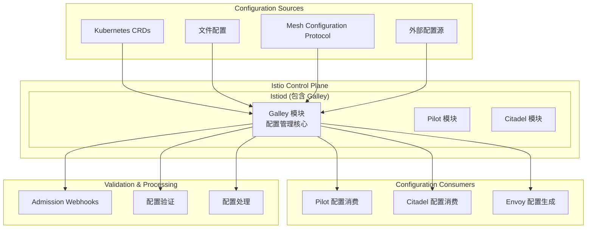
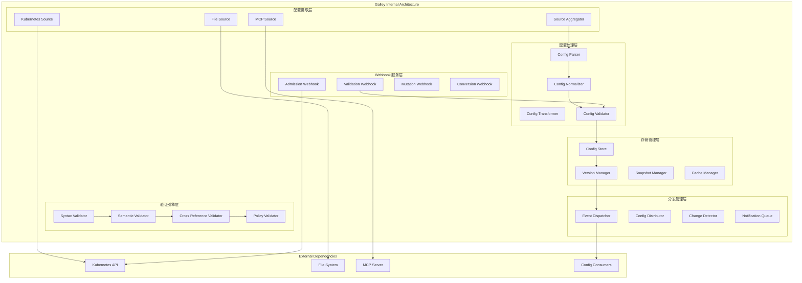
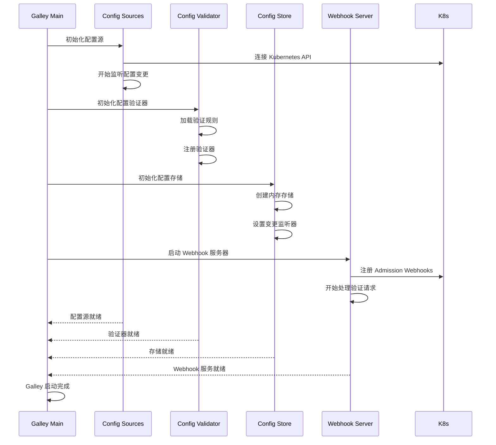
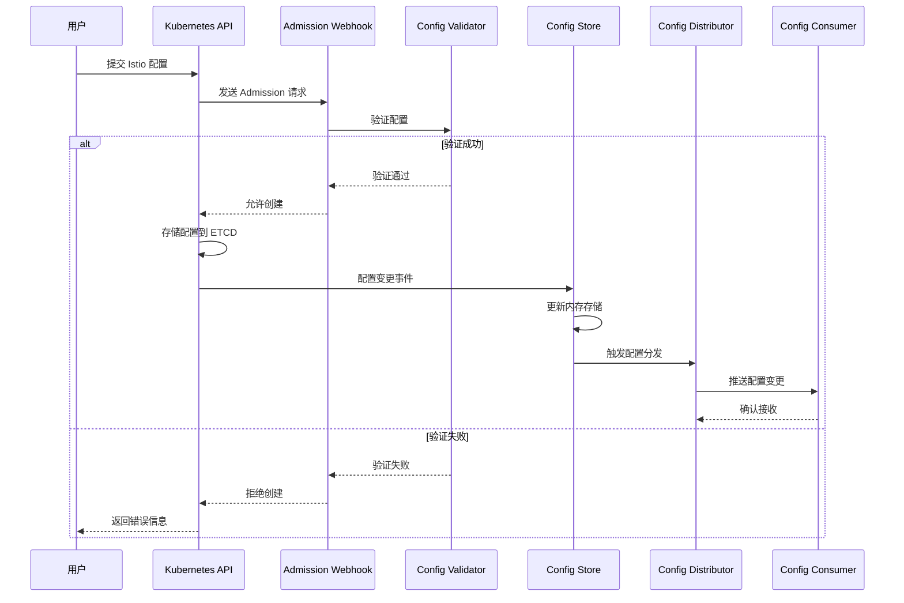
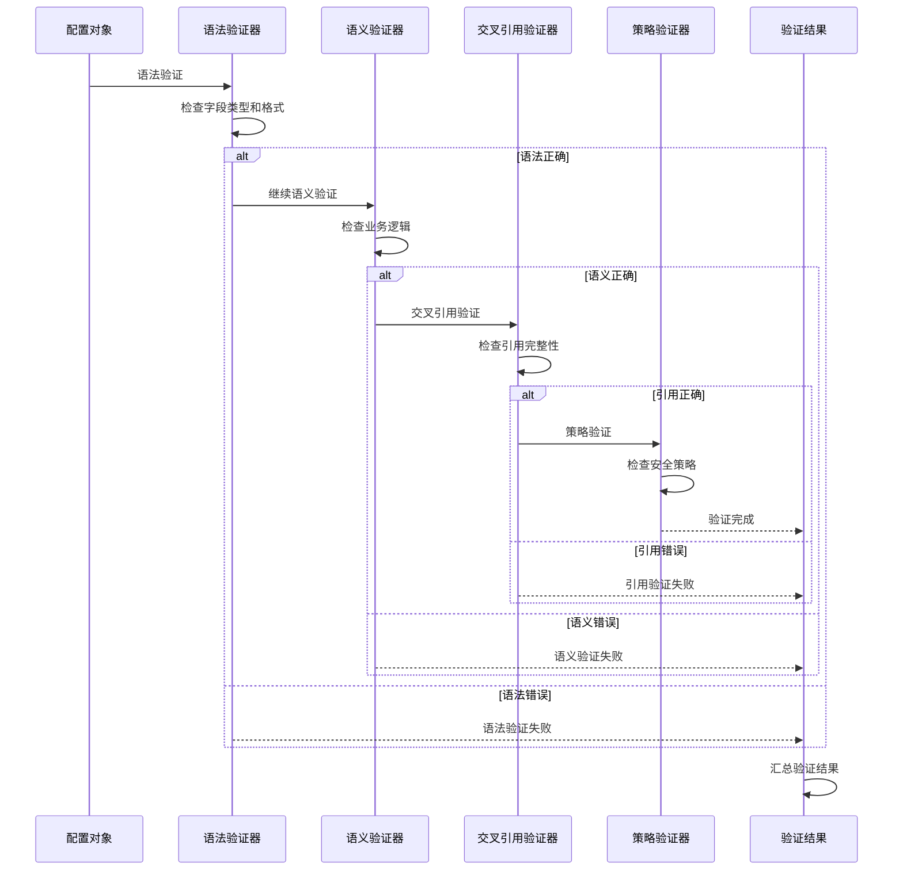
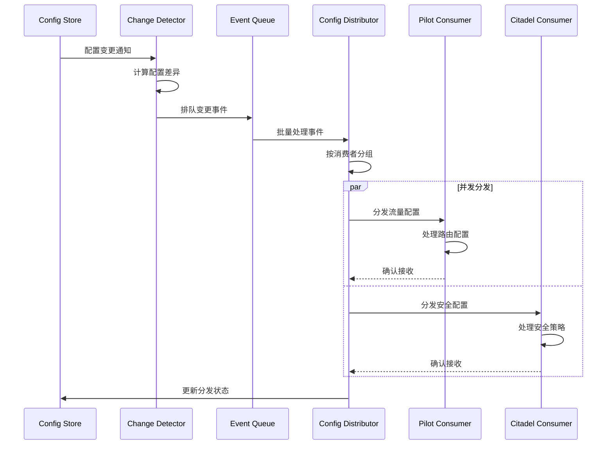

# Galley 架构解析

## 组件定位

### 在整体架构中的位置和作用

Galley 是 Istio 控制平面的配置管理组件，负责配置验证、转换和分发。在 Istio 1.5+ 版本中，Galley 已经整合到 Istiod 中，但其配置管理架构和验证机制仍然是理解 Istio 配置系统的关键。



### 与其他组件的关系和依赖

- **上游依赖**：Kubernetes API Server、文件系统、外部配置源
- **平级组件**：为 Pilot（流量）、Citadel（安全）提供配置服务
- **下游服务**：配置验证、转换后的数据分发给其他组件
- **外部集成**：支持多种配置源和配置协议

### 责任边界和接口定义

**核心职责：**
- 配置摄取和标准化
- 配置语法和语义验证
- 配置转换和格式化
- 配置分发和版本管理

**接口定义：**
- **北向接口**：Kubernetes API、MCP、文件系统接口
- **南向接口**：配置分发 API、事件通知接口
- **东西向接口**：与 Pilot、Citadel 的配置接口
- **管理接口**：Webhook、验证 API、状态报告

## 设计目标

### 解决的核心问题

1. **配置统一管理**：统一处理来自多种源的配置
2. **配置验证**：确保配置的正确性和一致性
3. **配置转换**：将高级配置转换为底层格式
4. **配置分发**：高效的配置变更传播机制
5. **版本控制**：配置的版本管理和回滚支持

### 性能和可扩展性目标

- **配置处理延迟**：< 100ms (P99)
- **支持配置数量**：10K+ 配置对象
- **验证性能**：< 50ms 验证延迟
- **分发延迟**：< 200ms 配置分发
- **内存效率**：线性内存增长

### 安全和可靠性要求

- **配置验证**：严格的语法和语义验证
- **访问控制**：基于 RBAC 的配置访问控制
- **审计日志**：完整的配置变更审计记录
- **故障隔离**：配置错误的隔离和恢复
- **数据完整性**：配置数据的完整性保护

## 内部架构设计

### 模块结构图



### 关键接口

#### 配置源接口

```go
// 配置源接口
type Source interface {
    // 启动配置源
    Start(stop <-chan struct{}) error
    
    // 获取配置
    Get() []config.Config
    
    // 监听配置变更
    Watch(handler func([]config.Config)) error
    
    // 获取源信息
    GetSourceInfo() SourceInfo
}

// Kubernetes 配置源
type KubernetesSource struct {
    client     kubernetes.Interface
    istioClient versioned.Interface
    informers  map[schema.GroupVersionKind]cache.SharedIndexInformer
    store      model.ConfigStore
}

func (k *KubernetesSource) Watch(handler func([]config.Config)) error {
    for gvk, informer := range k.informers {
        informer.AddEventHandler(cache.ResourceEventHandlerFuncs{
            AddFunc: func(obj interface{}) {
                config := k.convertToConfig(obj, gvk)
                handler([]config.Config{config})
            },
            UpdateFunc: func(oldObj, newObj interface{}) {
                config := k.convertToConfig(newObj, gvk)
                handler([]config.Config{config})
            },
            DeleteFunc: func(obj interface{}) {
                config := k.convertToConfig(obj, gvk)
                config.DeletionTimestamp = time.Now()
                handler([]config.Config{config})
            },
        })
    }
    return nil
}
```

#### 配置验证接口

```go
// 配置验证器接口
type ConfigValidator interface {
    // 验证配置
    Validate(config config.Config) (*validation.Result, error)
    
    // 批量验证
    ValidateBatch(configs []config.Config) ([]*validation.Result, error)
    
    // 获取验证规则
    GetValidationRules() []ValidationRule
}

// 多层验证器
type MultiLevelValidator struct {
    syntaxValidator   SyntaxValidator
    semanticValidator SemanticValidator
    crossRefValidator CrossReferenceValidator
    policyValidator   PolicyValidator
}

func (m *MultiLevelValidator) Validate(config config.Config) (*validation.Result, error) {
    result := &validation.Result{
        Config: config,
        Valid:  true,
        Errors: []validation.Error{},
    }
    
    // 1. 语法验证
    if syntaxResult, err := m.syntaxValidator.Validate(config); err != nil {
        return nil, err
    } else if !syntaxResult.Valid {
        result.Valid = false
        result.Errors = append(result.Errors, syntaxResult.Errors...)
        return result, nil // 语法错误时不继续验证
    }
    
    // 2. 语义验证
    if semanticResult, err := m.semanticValidator.Validate(config); err != nil {
        return nil, err
    } else if !semanticResult.Valid {
        result.Valid = false
        result.Errors = append(result.Errors, semanticResult.Errors...)
    }
    
    // 3. 交叉引用验证
    if crossRefResult, err := m.crossRefValidator.Validate(config); err != nil {
        return nil, err
    } else if !crossRefResult.Valid {
        result.Valid = false
        result.Errors = append(result.Errors, crossRefResult.Errors...)
    }
    
    // 4. 策略验证
    if policyResult, err := m.policyValidator.Validate(config); err != nil {
        return nil, err
    } else if !policyResult.Valid {
        result.Valid = false
        result.Errors = append(result.Errors, policyResult.Errors...)
    }
    
    return result, nil
}
```

#### Webhook 服务接口

```go
// Admission Webhook 处理器
type AdmissionWebhookHandler struct {
    validator ConfigValidator
    mutator   ConfigMutator
    logger    *log.Logger
}

func (a *AdmissionWebhookHandler) HandleAdmission(w http.ResponseWriter, r *http.Request) {
    body, err := ioutil.ReadAll(r.Body)
    if err != nil {
        http.Error(w, err.Error(), http.StatusBadRequest)
        return
    }
    
    var admissionReview admissionv1.AdmissionReview
    if err := json.Unmarshal(body, &admissionReview); err != nil {
        http.Error(w, err.Error(), http.StatusBadRequest)
        return
    }
    
    req := admissionReview.Request
    var response *admissionv1.AdmissionResponse
    
    // 解析配置对象
    config, err := a.parseConfig(req.Object.Raw)
    if err != nil {
        response = &admissionv1.AdmissionResponse{
            UID:     req.UID,
            Allowed: false,
            Result: &metav1.Status{
                Message: fmt.Sprintf("Failed to parse config: %v", err),
            },
        }
    } else {
        response = a.processAdmission(config, req)
    }
    
    admissionReview.Response = response
    respBytes, _ := json.Marshal(admissionReview)
    w.Header().Set("Content-Type", "application/json")
    w.Write(respBytes)
}

func (a *AdmissionWebhookHandler) processAdmission(config config.Config, req *admissionv1.AdmissionRequest) *admissionv1.AdmissionResponse {
    // 验证配置
    validationResult, err := a.validator.Validate(config)
    if err != nil {
        return &admissionv1.AdmissionResponse{
            UID:     req.UID,
            Allowed: false,
            Result: &metav1.Status{
                Message: fmt.Sprintf("Validation error: %v", err),
            },
        }
    }
    
    if !validationResult.Valid {
        errorMessages := make([]string, len(validationResult.Errors))
        for i, err := range validationResult.Errors {
            errorMessages[i] = err.Message
        }
        
        return &admissionv1.AdmissionResponse{
            UID:     req.UID,
            Allowed: false,
            Result: &metav1.Status{
                Message: fmt.Sprintf("Configuration validation failed: %s", 
                    strings.Join(errorMessages, "; ")),
            },
        }
    }
    
    // 应用变异（如果需要）
    patches, err := a.mutator.Mutate(config)
    if err != nil {
        return &admissionv1.AdmissionResponse{
            UID:     req.UID,
            Allowed: false,
            Result: &metav1.Status{
                Message: fmt.Sprintf("Mutation error: %v", err),
            },
        }
    }
    
    response := &admissionv1.AdmissionResponse{
        UID:     req.UID,
        Allowed: true,
    }
    
    if len(patches) > 0 {
        patchBytes, _ := json.Marshal(patches)
        patchType := admissionv1.PatchTypeJSONPatch
        response.Patch = patchBytes
        response.PatchType = &patchType
    }
    
    return response
}
```

### 数据模型

#### 配置对象模型

```go
// 配置对象
type Config struct {
    ConfigMeta
    Spec   proto.Message
    Status proto.Message
}

type ConfigMeta struct {
    Type              string
    Group             string
    Version           string
    Name              string
    Namespace         string
    Labels            map[string]string
    Annotations       map[string]string
    ResourceVersion   string
    CreationTimestamp time.Time
    DeletionTimestamp *time.Time
}

// 配置快照
type ConfigSnapshot struct {
    Version   string
    Timestamp time.Time
    Configs   map[ConfigKey]Config
    Checksum  string
}

// 配置变更事件
type ConfigEvent struct {
    Type      EventType
    Config    Config
    OldConfig *Config
    Timestamp time.Time
    Source    string
}

type EventType int

const (
    EventAdd EventType = iota
    EventUpdate
    EventDelete
)
```

#### 验证结果模型

```go
// 验证结果
type ValidationResult struct {
    Config    Config
    Valid     bool
    Errors    []ValidationError
    Warnings  []ValidationWarning
    Timestamp time.Time
}

type ValidationError struct {
    Code     string
    Message  string
    Field    string
    Value    interface{}
    Severity Severity
}

type ValidationWarning struct {
    Code     string
    Message  string
    Field    string
    Value    interface{}
}

type Severity int

const (
    SeverityInfo Severity = iota
    SeverityWarning
    SeverityError
    SeverityCritical
)
```

#### 配置存储模型

```go
// 配置存储接口
type ConfigStore interface {
    // 获取配置
    Get(typ, name, namespace string) *Config
    
    // 列出配置
    List(typ, namespace string) []Config
    
    // 创建配置
    Create(config Config) (*Config, error)
    
    // 更新配置
    Update(config Config) (*Config, error)
    
    // 删除配置
    Delete(typ, name, namespace string) error
    
    // 监听变更
    Watch(handler func(ConfigEvent)) error
}

// 内存配置存储
type MemoryConfigStore struct {
    data      map[ConfigKey]Config
    mutex     sync.RWMutex
    handlers  []func(ConfigEvent)
    version   int64
}

func (m *MemoryConfigStore) Create(config Config) (*Config, error) {
    m.mutex.Lock()
    defer m.mutex.Unlock()
    
    key := ConfigKey{
        Type:      config.Type,
        Name:      config.Name,
        Namespace: config.Namespace,
    }
    
    if _, exists := m.data[key]; exists {
        return nil, fmt.Errorf("config already exists: %v", key)
    }
    
    // 设置创建时间和版本
    config.CreationTimestamp = time.Now()
    config.ResourceVersion = fmt.Sprintf("%d", atomic.AddInt64(&m.version, 1))
    
    m.data[key] = config
    
    // 触发事件
    event := ConfigEvent{
        Type:      EventAdd,
        Config:    config,
        Timestamp: time.Now(),
        Source:    "memory-store",
    }
    
    go m.notifyHandlers(event)
    
    return &config, nil
}
```

## 工作流程

### 启动和初始化



### 配置处理流程



### 配置验证流程



### 配置分发流程



## 技术细节

### 配置验证算法

#### 语法验证实现

```go
type SyntaxValidator struct {
    schemas map[string]*jsonschema.Schema
    mutex   sync.RWMutex
}

func (s *SyntaxValidator) Validate(config config.Config) (*ValidationResult, error) {
    s.mutex.RLock()
    schema, exists := s.schemas[config.Type]
    s.mutex.RUnlock()
    
    if !exists {
        return &ValidationResult{
            Config: config,
            Valid:  false,
            Errors: []ValidationError{{
                Code:     "SCHEMA_NOT_FOUND",
                Message:  fmt.Sprintf("No schema found for config type: %s", config.Type),
                Field:    "type",
                Severity: SeverityError,
            }},
        }, nil
    }
    
    // 将配置转换为 JSON 进行验证
    configJSON, err := protojson.Marshal(config.Spec)
    if err != nil {
        return nil, fmt.Errorf("failed to marshal config to JSON: %v", err)
    }
    
    var configData interface{}
    if err := json.Unmarshal(configJSON, &configData); err != nil {
        return nil, fmt.Errorf("failed to unmarshal JSON: %v", err)
    }
    
    // 执行 JSON Schema 验证
    result := schema.Validate(configData)
    
    validationResult := &ValidationResult{
        Config: config,
        Valid:  result.Valid(),
        Errors: []ValidationError{},
    }
    
    // 转换验证错误
    for _, err := range result.Errors() {
        validationResult.Errors = append(validationResult.Errors, ValidationError{
            Code:     "SYNTAX_ERROR",
            Message:  err.Description(),
            Field:    err.PropertyPath(),
            Value:    err.Value(),
            Severity: SeverityError,
        })
    }
    
    return validationResult, nil
}
```

#### 交叉引用验证

```go
type CrossReferenceValidator struct {
    configStore ConfigStore
    refCache    map[string][]string
    mutex       sync.RWMutex
}

func (c *CrossReferenceValidator) Validate(config config.Config) (*ValidationResult, error) {
    result := &ValidationResult{
        Config: config,
        Valid:  true,
        Errors: []ValidationError{},
    }
    
    // 提取配置中的引用
    references := c.extractReferences(config)
    
    for _, ref := range references {
        if !c.validateReference(ref) {
            result.Valid = false
            result.Errors = append(result.Errors, ValidationError{
                Code:     "REFERENCE_NOT_FOUND",
                Message:  fmt.Sprintf("Referenced resource not found: %s", ref.String()),
                Field:    ref.Field,
                Value:    ref.Value,
                Severity: SeverityError,
            })
        }
    }
    
    return result, nil
}

func (c *CrossReferenceValidator) extractReferences(config config.Config) []ConfigReference {
    var references []ConfigReference
    
    switch config.Type {
    case "VirtualService":
        vs := config.Spec.(*networking.VirtualService)
        
        // 检查 Gateway 引用
        for _, gateway := range vs.Gateways {
            if gateway != "mesh" {
                references = append(references, ConfigReference{
                    Type:      "Gateway",
                    Name:      gateway,
                    Namespace: config.Namespace,
                    Field:     "gateways",
                    Value:     gateway,
                })
            }
        }
        
        // 检查 DestinationRule 引用
        for _, http := range vs.Http {
            for _, route := range http.Route {
                if route.Destination != nil {
                    references = append(references, ConfigReference{
                        Type:      "Service",
                        Name:      route.Destination.Host,
                        Namespace: config.Namespace,
                        Field:     "destination.host",
                        Value:     route.Destination.Host,
                    })
                }
            }
        }
        
    case "DestinationRule":
        dr := config.Spec.(*networking.DestinationRule)
        
        // 检查服务引用
        references = append(references, ConfigReference{
            Type:      "Service",
            Name:      dr.Host,
            Namespace: config.Namespace,
            Field:     "host",
            Value:     dr.Host,
        })
    }
    
    return references
}
```

### 配置缓存优化

#### 多级缓存实现

```go
type MultiLevelConfigCache struct {
    l1Cache    *sync.Map  // 内存缓存
    l2Cache    *lru.Cache // LRU 缓存
    persistent PersistentStore
    metrics    *CacheMetrics
    mutex      sync.RWMutex
}

func (m *MultiLevelConfigCache) Get(key ConfigKey) (*Config, bool) {
    // L1 缓存查找
    if value, ok := m.l1Cache.Load(key); ok {
        m.metrics.IncL1Hit()
        return value.(*Config), true
    }
    
    // L2 缓存查找
    if value, ok := m.l2Cache.Get(key); ok {
        config := value.(*Config)
        m.l1Cache.Store(key, config)
        m.metrics.IncL2Hit()
        return config, true
    }
    
    // 持久化存储查找
    config, err := m.persistent.Get(key)
    if err != nil {
        m.metrics.IncMiss()
        return nil, false
    }
    
    // 更新缓存
    m.l1Cache.Store(key, config)
    m.l2Cache.Add(key, config)
    m.metrics.IncPersistentHit()
    
    return config, true
}

func (m *MultiLevelConfigCache) Set(key ConfigKey, config *Config) {
    // 更新所有级别的缓存
    m.l1Cache.Store(key, config)
    m.l2Cache.Add(key, config)
    
    // 异步更新持久化存储
    go func() {
        if err := m.persistent.Set(key, config); err != nil {
            log.Errorf("Failed to update persistent cache: %v", err)
        }
    }()
    
    m.metrics.IncWrite()
}

func (m *MultiLevelConfigCache) Invalidate(key ConfigKey) {
    m.l1Cache.Delete(key)
    m.l2Cache.Remove(key)
    
    go func() {
        if err := m.persistent.Delete(key); err != nil {
            log.Errorf("Failed to delete from persistent cache: %v", err)
        }
    }()
    
    m.metrics.IncInvalidation()
}
```

### 事件处理优化

#### 批量事件处理

```go
type BatchEventProcessor struct {
    eventQueue    chan ConfigEvent
    batchSize     int
    batchTimeout  time.Duration
    handlers      []EventHandler
    metrics       *EventMetrics
    stopCh        chan struct{}
}

func (b *BatchEventProcessor) Start() {
    go b.processBatches()
}

func (b *BatchEventProcessor) processBatches() {
    ticker := time.NewTicker(b.batchTimeout)
    defer ticker.Stop()
    
    var batch []ConfigEvent
    
    for {
        select {
        case event := <-b.eventQueue:
            batch = append(batch, event)
            
            // 达到批量大小时立即处理
            if len(batch) >= b.batchSize {
                b.processBatch(batch)
                batch = batch[:0] // 重置批次
            }
            
        case <-ticker.C:
            // 超时时处理当前批次
            if len(batch) > 0 {
                b.processBatch(batch)
                batch = batch[:0]
            }
            
        case <-b.stopCh:
            // 处理剩余事件
            if len(batch) > 0 {
                b.processBatch(batch)
            }
            return
        }
    }
}

func (b *BatchEventProcessor) processBatch(batch []ConfigEvent) {
    startTime := time.Now()
    defer func() {
        b.metrics.RecordBatchProcessingTime(time.Since(startTime))
        b.metrics.IncBatchesProcessed()
    }()
    
    // 合并重复事件
    merged := b.mergeEvents(batch)
    
    // 并发处理事件
    var wg sync.WaitGroup
    for _, handler := range b.handlers {
        wg.Add(1)
        go func(h EventHandler) {
            defer wg.Done()
            h.HandleBatch(merged)
        }(handler)
    }
    wg.Wait()
    
    b.metrics.AddEventsProcessed(len(merged))
}

func (b *BatchEventProcessor) mergeEvents(events []ConfigEvent) []ConfigEvent {
    eventMap := make(map[ConfigKey]*ConfigEvent)
    
    // 按配置键合并事件，保留最新的事件
    for _, event := range events {
        key := ConfigKey{
            Type:      event.Config.Type,
            Name:      event.Config.Name,
            Namespace: event.Config.Namespace,
        }
        
        if existing, ok := eventMap[key]; ok {
            // 合并事件，保留最新的
            if event.Timestamp.After(existing.Timestamp) {
                eventMap[key] = &event
            }
        } else {
            eventMap[key] = &event
        }
    }
    
    // 转换为切片
    var merged []ConfigEvent
    for _, event := range eventMap {
        merged = append(merged, *event)
    }
    
    return merged
}
```

## 架构配置

### Webhook 配置

```yaml
# Galley Admission Webhook 配置
apiVersion: admissionregistration.k8s.io/v1
kind: ValidatingAdmissionWebhook
metadata:
  name: istio-galley-validation
  namespace: istio-system
spec:
  clientConfig:
    service:
      name: istio-galley
      namespace: istio-system
      path: "/admitpilot"
  rules:
  - operations: ["CREATE", "UPDATE"]
    apiGroups: ["networking.istio.io"]
    apiVersions: ["v1alpha3", "v1beta1"]
    resources: ["*"]
  - operations: ["CREATE", "UPDATE"]
    apiGroups: ["security.istio.io"]
    apiVersions: ["v1beta1"]
    resources: ["*"]
  admissionReviewVersions: ["v1", "v1beta1"]
  sideEffects: None
  failurePolicy: Fail
  timeoutSeconds: 30

---
# Galley Mutating Webhook 配置  
apiVersion: admissionregistration.k8s.io/v1
kind: MutatingAdmissionWebhook
metadata:
  name: istio-galley-mutation
  namespace: istio-system
spec:
  clientConfig:
    service:
      name: istio-galley
      namespace: istio-system
      path: "/inject"
  rules:
  - operations: ["CREATE"]
    apiGroups: [""]
    apiVersions: ["v1"]
    resources: ["pods"]
  admissionReviewVersions: ["v1", "v1beta1"]
  sideEffects: None
  failurePolicy: Ignore
  timeoutSeconds: 30
```

### 性能调优配置

```yaml
# Galley 环境变量配置
apiVersion: apps/v1
kind: Deployment
metadata:
  name: istio-galley
  namespace: istio-system
spec:
  template:
    spec:
      containers:
      - name: galley
        env:
        # 验证配置
        - name: GALLEY_VALIDATION_TIMEOUT
          value: "30s"                    # 验证超时时间
        - name: GALLEY_VALIDATION_BATCH_SIZE
          value: "100"                    # 批量验证大小
        - name: GALLEY_VALIDATION_WORKERS
          value: "10"                     # 验证工作协程数
        
        # 缓存配置
        - name: GALLEY_CONFIG_CACHE_SIZE
          value: "10000"                  # 配置缓存大小
        - name: GALLEY_CONFIG_CACHE_TTL
          value: "30m"                    # 缓存过期时间
        - name: GALLEY_ENABLE_CONFIG_CACHE
          value: "true"                   # 启用配置缓存
        
        # 事件处理配置
        - name: GALLEY_EVENT_BATCH_SIZE
          value: "50"                     # 事件批量处理大小
        - name: GALLEY_EVENT_BATCH_TIMEOUT
          value: "100ms"                  # 事件批量超时
        - name: GALLEY_EVENT_QUEUE_SIZE
          value: "1000"                   # 事件队列大小
        
        # Webhook 配置
        - name: GALLEY_WEBHOOK_PORT
          value: "9443"                   # Webhook 端口
        - name: GALLEY_WEBHOOK_CERT_DIR
          value: "/etc/certs"             # 证书目录
        - name: GALLEY_WEBHOOK_TLS_MIN_VERSION
          value: "1.2"                    # 最小 TLS 版本
        
        resources:
          requests:
            memory: "256Mi"
            cpu: "100m"
          limits:
            memory: "1Gi"
            cpu: "1000m"
```

### 监控配置

```yaml
# Galley 指标配置
apiVersion: v1
kind: ConfigMap
metadata:
  name: galley-metrics-config
  namespace: istio-system
data:
  metrics.yaml: |
    # 配置验证指标
    galley_validation_total:
      type: counter
      help: "Total number of validations"
      labels: ["type", "result"]
    
    galley_validation_duration_seconds:
      type: histogram
      help: "Validation duration"
      buckets: [0.001, 0.01, 0.1, 1, 10]
    
    galley_validation_errors_total:
      type: counter
      help: "Total validation errors"
      labels: ["type", "error_code"]
    
    # 配置处理指标
    galley_config_events_total:
      type: counter
      help: "Total config events processed"
      labels: ["type", "operation", "source"]
    
    galley_config_cache_hit_ratio:
      type: gauge
      help: "Config cache hit ratio"
      labels: ["cache_level"]
    
    # Webhook 指标
    galley_webhook_requests_total:
      type: counter
      help: "Total webhook requests"
      labels: ["webhook", "result"]
    
    galley_webhook_duration_seconds:
      type: histogram
      help: "Webhook request duration"
      buckets: [0.001, 0.01, 0.1, 1, 10, 30]

---
# ServiceMonitor for Prometheus
apiVersion: monitoring.coreos.com/v1
kind: ServiceMonitor
metadata:
  name: galley-metrics
  namespace: istio-system
spec:
  selector:
    matchLabels:
      app: galley
  endpoints:
  - port: monitoring
    interval: 15s
    path: /metrics
```

### 高可用配置

```yaml
# Galley 高可用部署
apiVersion: apps/v1
kind: Deployment
metadata:
  name: istio-galley
  namespace: istio-system
spec:
  replicas: 2                           # 多实例部署
  strategy:
    rollingUpdate:
      maxSurge: 1
      maxUnavailable: 0                 # 零停机更新
  template:
    spec:
      affinity:
        podAntiAffinity:                # Pod 反亲和性
          requiredDuringSchedulingIgnoredDuringExecution:
          - labelSelector:
              matchLabels:
                app: galley
            topologyKey: kubernetes.io/hostname
      containers:
      - name: galley
        image: gcr.io/istio-release/galley:1.20.0
        ports:
        - containerPort: 9443
          name: webhook
        - containerPort: 15014
          name: monitoring
        readinessProbe:
          httpGet:
            path: /ready
            port: 15014
          initialDelaySeconds: 5
          periodSeconds: 5
        livenessProbe:
          httpGet:
            path: /ready
            port: 15014
          initialDelaySeconds: 15
          periodSeconds: 15
        volumeMounts:
        - name: certs
          mountPath: /etc/certs
          readOnly: true
        - name: config
          mountPath: /etc/config
          readOnly: true
      volumes:
      - name: certs
        secret:
          secretName: galley-certs
      - name: config
        configMap:
          name: galley-config

---
# HPA 自动扩缩容
apiVersion: autoscaling/v2
kind: HorizontalPodAutoscaler
metadata:
  name: galley-hpa
  namespace: istio-system
spec:
  scaleTargetRef:
    apiVersion: apps/v1
    kind: Deployment
    name: istio-galley
  minReplicas: 2
  maxReplicas: 5
  metrics:
  - type: Resource
    resource:
      name: cpu
      target:
        type: Utilization
        averageUtilization: 70
  - type: Resource
    resource:
      name: memory
      target:
        type: Utilization
        averageUtilization: 80
```

## 故障排除和运维

### 常见问题诊断

#### 配置验证失败

```bash
# 检查 Galley 状态
kubectl get pods -n istio-system -l app=galley

# 查看验证日志
kubectl logs -n istio-system -l app=galley | grep -i validation

# 测试 Webhook 连接
kubectl get validatingwebhookconfiguration istio-galley-validation -o yaml

# 手动验证配置
istioctl validate -f config.yaml
```

#### Webhook 服务问题

```bash
# 检查 Webhook 服务
kubectl get svc istio-galley -n istio-system

# 检查 Webhook 证书
kubectl get secret galley-certs -n istio-system -o yaml

# 测试 Webhook 端点
kubectl exec -n istio-system deployment/istio-galley -- curl -k https://localhost:9443/ready
```

#### 配置分发延迟

```bash
# 检查配置事件
kubectl get events -n istio-system --field-selector involvedObject.name=istio-galley

# 查看配置缓存状态
kubectl exec -n istio-system deployment/istio-galley -- curl localhost:15014/debug/config_cache

# 监控配置处理性能
kubectl exec -n istio-system deployment/istio-galley -- curl localhost:15014/metrics | grep galley_config
```

### 监控和告警

#### 关键指标

```prometheus
# 验证相关指标
rate(galley_validation_total[5m])                    # 验证速率
rate(galley_validation_errors_total[5m])             # 验证错误率
histogram_quantile(0.99, galley_validation_duration_seconds_bucket) # 验证延迟

# Webhook 指标
rate(galley_webhook_requests_total[5m])              # Webhook 请求速率
rate(galley_webhook_requests_total{result="error"}[5m]) # Webhook 错误率
histogram_quantile(0.95, galley_webhook_duration_seconds_bucket) # Webhook 延迟

# 配置处理指标
rate(galley_config_events_total[5m])                 # 配置事件处理速率
galley_config_cache_hit_ratio                        # 缓存命中率
```

#### 告警规则

```yaml
groups:
- name: galley.rules
  rules:
  - alert: GalleyValidationErrors
    expr: rate(galley_validation_errors_total[5m]) > 0.1
    for: 2m
    labels:
      severity: warning
    annotations:
      summary: "High validation error rate"
      
  - alert: GalleyWebhookLatency
    expr: histogram_quantile(0.95, galley_webhook_duration_seconds_bucket) > 5
    for: 3m
    labels:
      severity: warning
    annotations:
      summary: "High webhook latency"
      
  - alert: GalleyDown
    expr: up{job="galley"} == 0
    for: 1m
    labels:
      severity: critical
    annotations:
      summary: "Galley is down"
      
  - alert: GalleyCacheMissRate
    expr: galley_config_cache_hit_ratio < 0.8
    for: 5m
    labels:
      severity: warning
    annotations:
      summary: "Low cache hit rate"
```

## 最佳实践

### 配置验证

1. **分层验证**：实施语法、语义、引用、策略多层验证
2. **性能优化**：使用缓存和批处理提高验证性能
3. **错误信息**：提供清晰的错误信息和修复建议
4. **验证覆盖**：确保所有配置类型都有相应的验证规则

### Webhook 管理

1. **证书管理**：定期轮换 Webhook TLS 证书
2. **超时设置**：合理设置 Webhook 超时时间
3. **故障策略**：设置适当的失败策略
4. **监控告警**：监控 Webhook 性能和错误率

### 性能优化

1. **缓存策略**：使用多级缓存提高配置访问性能
2. **批量处理**：批量处理配置事件减少延迟
3. **并发控制**：合理设置并发度避免资源竞争
4. **资源调优**：根据负载调整资源配置

### 运维建议

1. **多实例部署**：部署多个实例确保高可用
2. **配置备份**：定期备份配置数据
3. **版本管理**：维护配置版本历史
4. **监控覆盖**：全面监控配置处理流程

## 参考资料

- [Galley 设计文档](https://github.com/istio/istio/blob/master/galley/doc/design.md)
- [Istio 配置验证](https://istio.io/latest/docs/ops/configuration/validation/)
- [Kubernetes Admission Controllers](https://kubernetes.io/docs/reference/access-authn-authz/admission-controllers/)
- [配置最佳实践](https://istio.io/latest/docs/ops/best-practices/deployment/)
