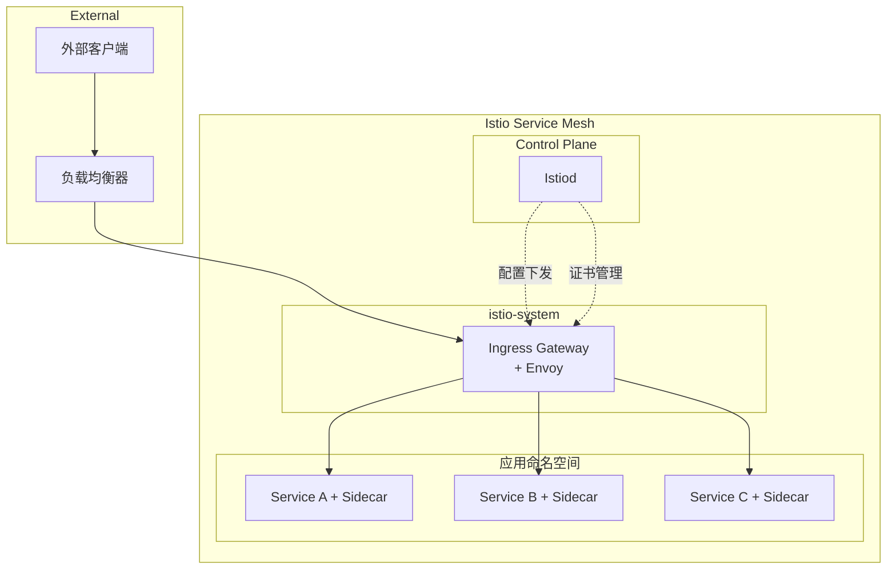
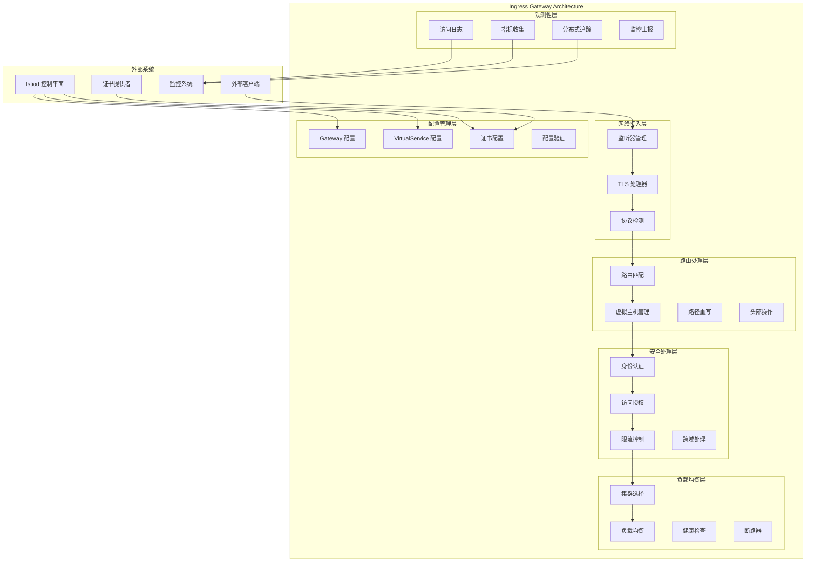
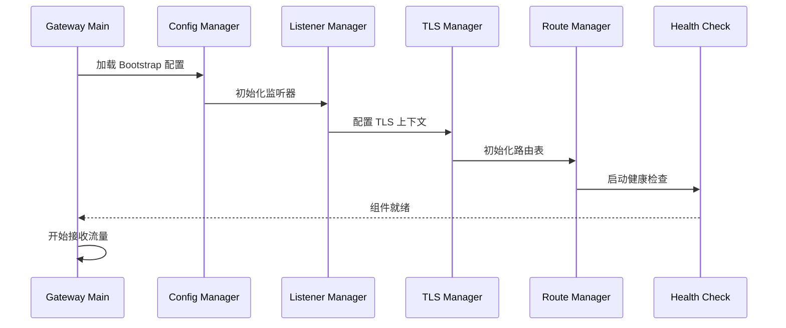
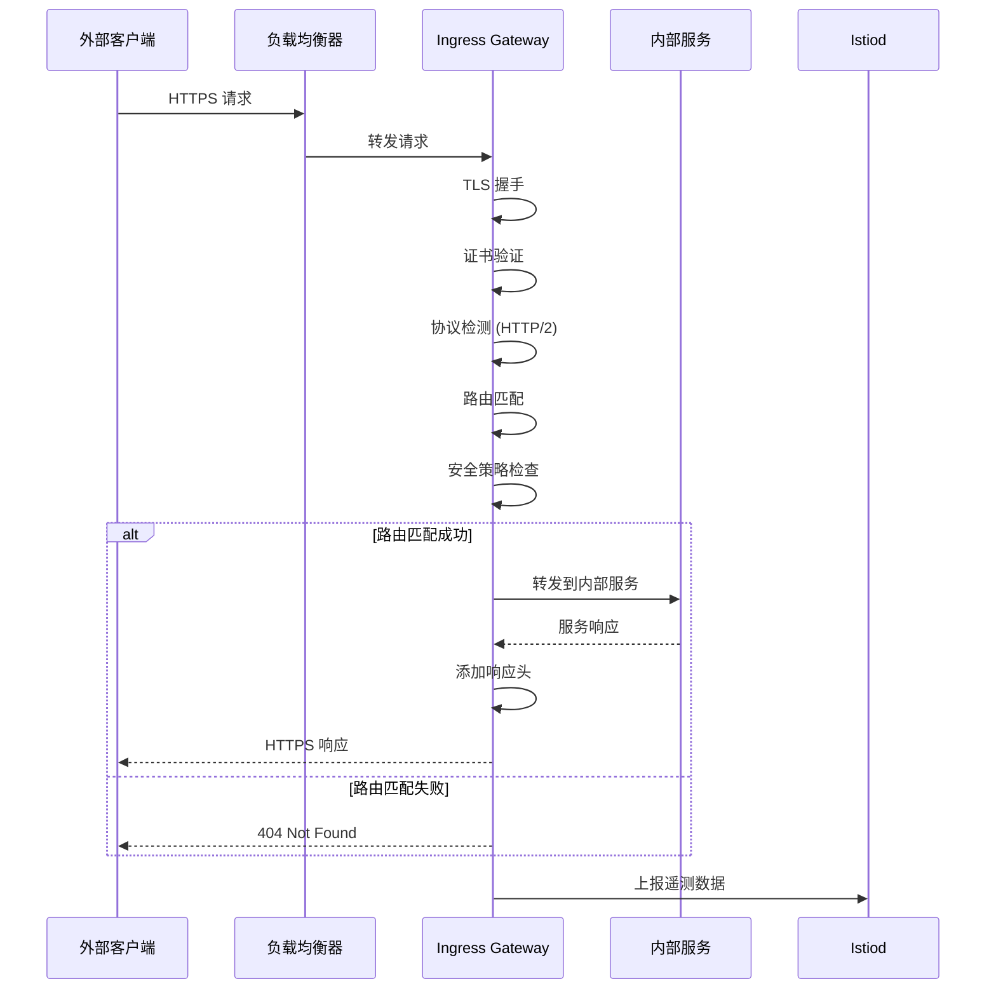
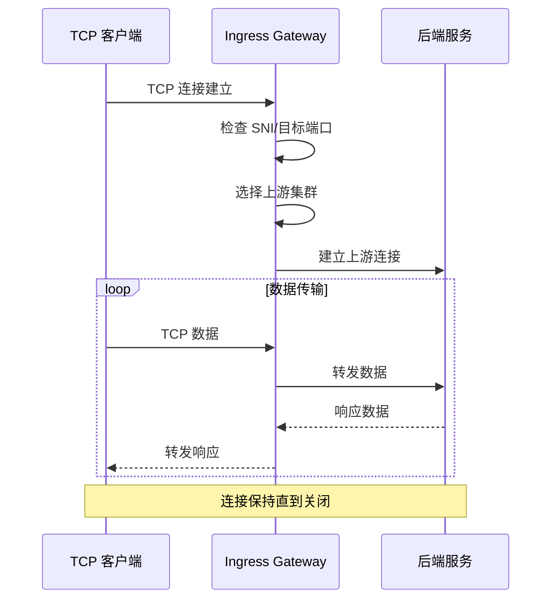
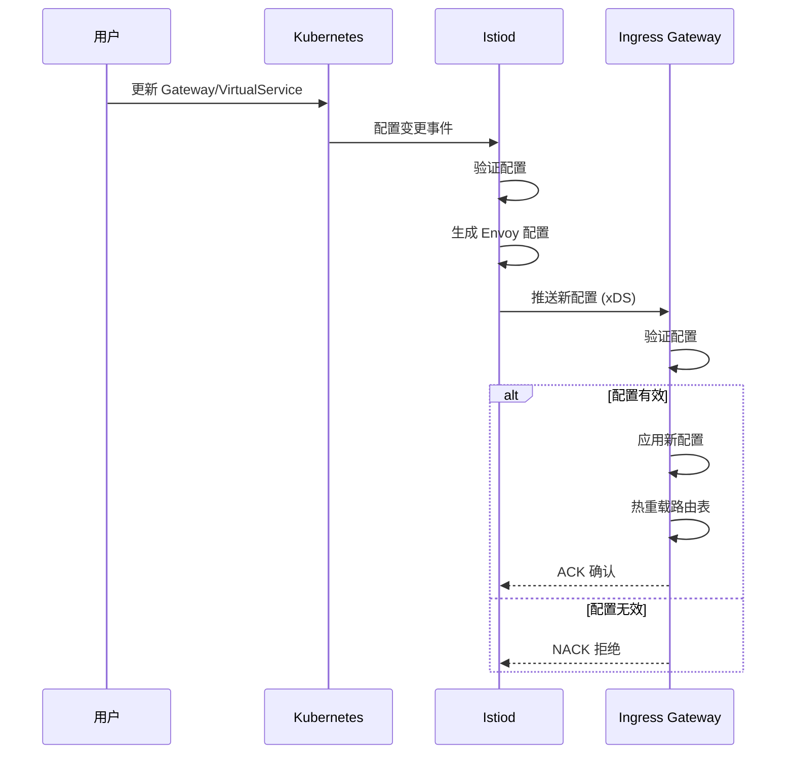

# Ingress Gateway 架构解析

## 组件定位

### 在整体架构中的位置和作用

Ingress Gateway 是 Istio 服务网格的边缘代理组件，负责处理从外部进入服务网格的南北向流量。它作为服务网格的入口点，为外部客户端提供访问内部服务的统一接口。



### 与其他组件的关系和依赖

- **上游依赖**：外部负载均衡器、DNS 服务、TLS 证书
- **控制平面连接**：从 Istiod 接收路由配置和证书
- **下游服务**：路由到服务网格内的各种服务
- **安全集成**：与 Istio 安全策略和证书管理集成

### 责任边界和接口定义

**核心职责：**
- 南北向流量接入和路由
- TLS 终止和证书管理
- 外部流量的安全策略执行
- 协议转换和头部处理

**接口定义：**
- **北向接口**：HTTP/HTTPS、gRPC、TCP 协议接入
- **南向接口**：到内部服务的路由转发
- **管理接口**：健康检查、指标暴露、配置管理
- **安全接口**：TLS 握手、证书验证、JWT 验证

## 设计目标

### 解决的核心问题

1. **统一入口**：为服务网格提供统一的外部访问入口
2. **安全边界**：在网格边缘实施安全策略和访问控制
3. **协议适配**：处理不同协议的外部流量
4. **高可用性**：提供高可用的流量接入能力
5. **可观测性**：收集外部流量的监控和审计数据

### 性能和可扩展性目标

- **吞吐量**：支持 10K+ 并发连接
- **延迟**：< 5ms 额外延迟 (P99)
- **TLS 握手**：< 100ms TLS 握手时间
- **可扩展性**：支持水平扩展到多个实例
- **资源效率**：单实例支持大量并发连接

### 安全和可靠性要求

- **TLS 终止**：支持现代 TLS 协议和密码套件
- **证书管理**：自动证书更新和轮换
- **DDoS 防护**：基础的 DDoS 防护能力
- **故障恢复**：快速故障检测和流量转移
- **零停机更新**：支持配置热更新

## 内部架构设计

### 模块结构图



### 关键接口

#### 配置接口

```yaml
# Gateway 配置接口
apiVersion: networking.istio.io/v1beta1
kind: Gateway
metadata:
  name: gateway-interface
spec:
  selector:
    istio: ingressgateway
  servers:
  - port:
      number: 80
      name: http
      protocol: HTTP
    hosts:
    - "*.example.com"
  - port:
      number: 443
      name: https
      protocol: HTTPS
    tls:
      mode: SIMPLE
      credentialName: example-tls
    hosts:
    - "*.example.com"
```

#### 路由配置接口

```yaml
# VirtualService 路由接口
apiVersion: networking.istio.io/v1beta1
kind: VirtualService
metadata:
  name: routing-interface
spec:
  hosts:
  - "api.example.com"
  gateways:
  - gateway-interface
  http:
  - match:
    - uri:
        prefix: "/api/v1"
    route:
    - destination:
        host: api-service
        port:
          number: 8080
  - match:
    - uri:
        prefix: "/api/v2"
    route:
    - destination:
        host: api-service-v2
        port:
          number: 8080
```

#### 管理接口

```http
# 健康检查接口
GET /healthz/ready
Response: 200 OK

# 统计接口
GET /stats/prometheus
Response: Prometheus 格式指标

# 配置接口
GET /config_dump
Response: JSON 格式的完整配置

# 日志级别调整
POST /logging?level=debug
Response: 200 OK
```

### 数据模型

#### 核心数据结构

```go
// Gateway 配置模型
type GatewayConfig struct {
    Name      string
    Namespace string
    Selector  map[string]string
    Servers   []Server
}

type Server struct {
    Port     Port
    Hosts    []string
    TLS      *TLSOptions
    Name     string
}

// 路由配置模型
type RouteConfig struct {
    Name         string
    VirtualHosts []VirtualHost
    HTTPFilters  []HTTPFilter
}

type VirtualHost struct {
    Name    string
    Domains []string
    Routes  []Route
}

// TLS 配置模型
type TLSConfig struct {
    Mode           TLSMode
    ServerCert     string
    PrivateKey     string
    CACertificates string
    SNI            string
}
```

#### 运行时状态管理

```go
// 连接状态跟踪
type ConnectionTracker struct {
    ActiveConnections int64
    TotalConnections  int64
    SSLConnections    int64
    ConnectionErrors  int64
    LastActivity      time.Time
}

// 路由状态统计
type RouteStats struct {
    RequestCount    int64
    ResponseTime    time.Duration
    ErrorRate       float64
    UpstreamHealth  bool
}

// TLS 证书状态
type CertificateStatus struct {
    ValidFrom    time.Time
    ValidTo      time.Time
    Issuer       string
    Subject      string
    SerialNumber string
    IsExpired    bool
}
```

## 工作流程

### 启动和初始化



### 请求处理流程

#### HTTPS 请求处理



#### TCP 代理流程



### 配置动态更新



## 技术细节

### TLS 处理优化

#### TLS 握手优化

```cpp
class TLSContextManager {
private:
    struct TLSContext {
        SSL_CTX* ssl_ctx;
        std::string cert_chain;
        std::string private_key;
        std::chrono::system_clock::time_point expiry;
    };
    
    std::unordered_map<std::string, TLSContext> contexts_;
    std::shared_mutex contexts_mutex_;
    
public:
    SSL_CTX* getTLSContext(const std::string& sni) {
        std::shared_lock<std::shared_mutex> lock(contexts_mutex_);
        auto it = contexts_.find(sni);
        if (it != contexts_.end() && 
            it->second.expiry > std::chrono::system_clock::now()) {
            return it->second.ssl_ctx;
        }
        return nullptr;
    }
    
    void updateTLSContext(const std::string& sni, 
                         const std::string& cert, 
                         const std::string& key) {
        std::unique_lock<std::shared_mutex> lock(contexts_mutex_);
        
        SSL_CTX* new_ctx = createSSLContext(cert, key);
        if (new_ctx) {
            auto& context = contexts_[sni];
            if (context.ssl_ctx) {
                SSL_CTX_free(context.ssl_ctx);
            }
            context.ssl_ctx = new_ctx;
            context.cert_chain = cert;
            context.private_key = key;
            context.expiry = extractCertExpiry(cert);
        }
    }
};
```

#### ALPN 协议协商

```cpp
class ALPNHandler {
private:
    static const std::vector<std::string> supported_protocols_{
        "h2", "http/1.1", "http/1.0"
    };
    
public:
    static int alpn_select_callback(SSL* ssl,
                                   const unsigned char** out,
                                   unsigned char* outlen,
                                   const unsigned char* in,
                                   unsigned int inlen,
                                   void* arg) {
        
        // 优先选择 HTTP/2
        if (SSL_select_next_proto((unsigned char**)out, outlen,
                                 (const unsigned char*)"h2\x08http/1.1", 12,
                                 in, inlen) == OPENSSL_NPN_NEGOTIATED) {
            return SSL_TLSEXT_ERR_OK;
        }
        
        // 回退到 HTTP/1.1
        *out = (const unsigned char*)"http/1.1";
        *outlen = 8;
        return SSL_TLSEXT_ERR_OK;
    }
};
```

### 路由匹配算法

#### 高效路由表

```cpp
class RouteTable {
private:
    struct RouteEntry {
        std::string host_pattern;
        std::string path_pattern;
        RouteAction action;
        int priority;
        std::regex compiled_regex;
    };
    
    // 按优先级排序的路由表
    std::vector<RouteEntry> routes_;
    
    // 精确匹配的快速查找表
    std::unordered_map<std::string, RouteAction> exact_matches_;
    
public:
    RouteAction findRoute(const std::string& host, 
                         const std::string& path) {
        
        // 首先尝试精确匹配
        std::string key = host + path;
        auto it = exact_matches_.find(key);
        if (it != exact_matches_.end()) {
            return it->second;
        }
        
        // 遍历正则表达式匹配
        for (const auto& route : routes_) {
            if (std::regex_match(host, route.compiled_regex)) {
                if (matchPath(path, route.path_pattern)) {
                    return route.action;
                }
            }
        }
        
        return RouteAction::NOT_FOUND;
    }
    
private:
    bool matchPath(const std::string& path, 
                   const std::string& pattern) {
        if (pattern.back() == '*') {
            // 前缀匹配
            std::string prefix = pattern.substr(0, pattern.length() - 1);
            return path.substr(0, prefix.length()) == prefix;
        } else {
            // 精确匹配
            return path == pattern;
        }
    }
};
```

### 负载均衡策略

#### 加权轮询算法

```cpp
class WeightedRoundRobinBalancer {
private:
    struct Endpoint {
        std::string address;
        int weight;
        int current_weight;
        bool healthy;
    };
    
    std::vector<Endpoint> endpoints_;
    std::mutex mutex_;
    
public:
    std::string selectEndpoint() {
        std::lock_guard<std::mutex> lock(mutex_);
        
        if (endpoints_.empty()) {
            return "";
        }
        
        int total_weight = 0;
        Endpoint* selected = nullptr;
        
        for (auto& endpoint : endpoints_) {
            if (!endpoint.healthy) continue;
            
            endpoint.current_weight += endpoint.weight;
            total_weight += endpoint.weight;
            
            if (!selected || 
                endpoint.current_weight > selected->current_weight) {
                selected = &endpoint;
            }
        }
        
        if (selected) {
            selected->current_weight -= total_weight;
            return selected->address;
        }
        
        return "";
    }
    
    void updateEndpointHealth(const std::string& address, bool healthy) {
        std::lock_guard<std::mutex> lock(mutex_);
        for (auto& endpoint : endpoints_) {
            if (endpoint.address == address) {
                endpoint.healthy = healthy;
                break;
            }
        }
    }
};
```

## 架构配置

### 关键配置参数

#### Gateway 基础配置

```yaml
apiVersion: networking.istio.io/v1beta1
kind: Gateway
metadata:
  name: production-gateway
  namespace: istio-system
spec:
  selector:
    istio: ingressgateway
  servers:
  # HTTP 重定向到 HTTPS
  - port:
      number: 80
      name: http
      protocol: HTTP
    hosts:
    - "*.example.com"
    tls:
      httpsRedirect: true
      
  # HTTPS 配置
  - port:
      number: 443
      name: https
      protocol: HTTPS
    hosts:
    - "*.example.com"
    tls:
      mode: SIMPLE
      credentialName: example-com-tls
      minProtocolVersion: TLSV1_2
      maxProtocolVersion: TLSV1_3
      cipherSuites:
      - "ECDHE-RSA-AES128-GCM-SHA256"
      - "ECDHE-RSA-AES256-GCM-SHA384"
      
  # gRPC 配置
  - port:
      number: 443
      name: grpc-tls
      protocol: GRPC
    hosts:
    - "grpc.example.com"
    tls:
      mode: SIMPLE
      credentialName: grpc-example-com-tls
```

#### 高可用配置

```yaml
apiVersion: apps/v1
kind: Deployment
metadata:
  name: istio-ingressgateway
  namespace: istio-system
spec:
  replicas: 3                           # 多实例部署
  strategy:
    rollingUpdate:
      maxSurge: 1
      maxUnavailable: 0                 # 零停机更新
  template:
    spec:
      affinity:
        podAntiAffinity:                # Pod 反亲和性
          requiredDuringSchedulingIgnoredDuringExecution:
          - labelSelector:
              matchLabels:
                app: istio-ingressgateway
            topologyKey: kubernetes.io/hostname
      containers:
      - name: istio-proxy
        resources:
          requests:
            memory: "128Mi"
            cpu: "100m"
          limits:
            memory: "1Gi"
            cpu: "2000m"
        env:
        # 性能调优参数
        - name: PILOT_ENABLE_WORKLOAD_ENTRY_AUTOREGISTRATION
          value: "true"
        - name: ISTIO_META_ROUTER_MODE
          value: "sni-dnat"
        # 连接池配置
        - name: PILOT_HTTP10
          value: "1"
        readinessProbe:
          httpGet:
            path: /healthz/ready
            port: 15021
          initialDelaySeconds: 1
          periodSeconds: 2
        livenessProbe:
          httpGet:
            path: /healthz/ready
            port: 15021
          initialDelaySeconds: 10
          periodSeconds: 10
```

#### 安全策略配置

```yaml
# JWT 验证
apiVersion: security.istio.io/v1beta1
kind: RequestAuthentication
metadata:
  name: gateway-jwt
  namespace: istio-system
spec:
  selector:
    matchLabels:
      istio: ingressgateway
  jwtRules:
  - issuer: "https://accounts.google.com"
    jwksUri: "https://www.googleapis.com/oauth2/v3/certs"
    audiences:
    - "your-app-id.googleusercontent.com"
    
---
# 访问控制
apiVersion: security.istio.io/v1beta1
kind: AuthorizationPolicy
metadata:
  name: gateway-authz
  namespace: istio-system
spec:
  selector:
    matchLabels:
      istio: ingressgateway
  rules:
  # 允许来自特定 IP 的访问
  - from:
    - source:
        ipBlocks: ["10.0.0.0/8", "172.16.0.0/12"]
    to:
    - operation:
        methods: ["GET", "POST"]
        
  # 基于 JWT 的访问控制
  - from:
    - source:
        requestPrincipals: ["*"]
    to:
    - operation:
        methods: ["GET", "POST", "PUT", "DELETE"]
    when:
    - key: request.auth.claims[role]
      values: ["user", "admin"]
```

### 性能调优

#### 连接和缓冲区优化

```yaml
apiVersion: v1
kind: ConfigMap
metadata:
  name: istio-gateway-config
  namespace: istio-system
data:
  custom_bootstrap.json: |
    {
      "static_resources": {
        "listeners": [
          {
            "name": "listener_0",
            "address": {
              "socket_address": {
                "address": "0.0.0.0",
                "port_value": 8080
              }
            },
            "per_connection_buffer_limit_bytes": 32768,
            "listener_filters": [
              {
                "name": "envoy.filters.listener.tls_inspector"
              }
            ]
          }
        ]
      },
      "cluster_manager": {
        "upstream_connection_options": {
          "tcp_keepalive": {
            "keepalive_probes": 3,
            "keepalive_time": 30,
            "keepalive_interval": 5
          }
        }
      },
      "stats_config": {
        "histogram_bucket_settings": [
          {
            "match": {
              "prefix": "http"
            },
            "buckets": [0.5, 1, 5, 10, 25, 50, 100, 250, 500, 1000, 2500, 5000, 10000]
          }
        ]
      }
    }
```

#### TLS 性能优化

```yaml
env:
# TLS 会话复用
- name: PILOT_ENABLE_TLS_SESSION_RESUMPTION
  value: "true"
# TLS 1.3 0-RTT
- name: PILOT_ENABLE_TLS_EARLY_DATA
  value: "true"
# OCSP Stapling
- name: PILOT_ENABLE_OCSP_STAPLING
  value: "true"
```

### 容量规划

#### 资源需求评估

**基准容量指标：**
- **并发连接数**：5K-20K 每实例
- **请求速率**：10K-50K RPS 每实例
- **TLS 握手**：1K-5K 每秒每实例
- **内存使用**：100MB-500MB 每实例
- **CPU 使用**：0.5-2 core 每实例

#### 扩容策略

```yaml
# HPA 自动扩容
apiVersion: autoscaling/v2
kind: HorizontalPodAutoscaler
metadata:
  name: istio-ingressgateway-hpa
  namespace: istio-system
spec:
  scaleTargetRef:
    apiVersion: apps/v1
    kind: Deployment
    name: istio-ingressgateway
  minReplicas: 2
  maxReplicas: 10
  metrics:
  - type: Resource
    resource:
      name: cpu
      target:
        type: Utilization
        averageUtilization: 70
  - type: Resource
    resource:
      name: memory
      target:
        type: Utilization
        averageUtilization: 80
  - type: Pods
    pods:
      metric:
        name: envoy_http_downstream_cx_active
      target:
        type: AverageValue
        averageValue: "1000"
```

## 故障排除和运维

### 常见问题诊断

#### TLS 配置问题

```bash
# 检查证书状态
kubectl exec -it istio-ingressgateway-xxx -n istio-system -- openssl s_client -connect localhost:443 -servername example.com

# 查看证书详情
kubectl get secret example-com-tls -n istio-system -o yaml

# 检查 TLS 配置
istioctl proxy-config listeners istio-ingressgateway-xxx.istio-system --port 443 -o json
```

#### 路由问题

```bash
# 检查路由配置
istioctl proxy-config routes istio-ingressgateway-xxx.istio-system -o json

# 查看虚拟主机配置
istioctl proxy-config routes istio-ingressgateway-xxx.istio-system --name http.8080 -o json

# 测试路由匹配
curl -H "Host: api.example.com" http://gateway-ip/api/v1/test
```

#### 性能问题

```bash
# 检查连接状态
kubectl exec -it istio-ingressgateway-xxx -n istio-system -- curl localhost:15000/stats | grep downstream_cx

# 查看请求统计
kubectl exec -it istio-ingressgateway-xxx -n istio-system -- curl localhost:15000/stats | grep http

# 检查上游集群状态
kubectl exec -it istio-ingressgateway-xxx -n istio-system -- curl localhost:15000/clusters
```

### 监控和指标

#### 关键性能指标

```prometheus
# 请求速率
rate(envoy_cluster_upstream_rq_total{cluster_name=~"outbound.*"}[5m])

# 请求延迟分布
histogram_quantile(0.99, 
  rate(envoy_http_downstream_rq_time_bucket{envoy_http_conn_manager_prefix="http"}[5m])
)

# TLS 握手延迟
histogram_quantile(0.95,
  rate(envoy_http_downstream_cx_ssl_handshake_bucket[5m])
)

# 错误率
rate(envoy_http_downstream_rq_total{envoy_response_code!~"2.."}[5m]) /
rate(envoy_http_downstream_rq_total[5m])

# 连接数
envoy_http_downstream_cx_active{envoy_http_conn_manager_prefix="http"}

# 证书有效期
(envoy_server_cert_expiry_timestamp - time()) / 86400
```

#### 告警规则

```yaml
groups:
- name: ingress-gateway.rules
  rules:
  - alert: IngressGatewayDown
    expr: up{job="istio-proxy", pod=~"istio-ingressgateway-.*"} == 0
    for: 1m
    labels:
      severity: critical
    annotations:
      summary: "Ingress Gateway is down"
      
  - alert: IngressGatewayHighErrorRate
    expr: |
      (
        rate(envoy_http_downstream_rq_total{pod=~"istio-ingressgateway-.*",envoy_response_code!~"2.."}[5m]) /
        rate(envoy_http_downstream_rq_total{pod=~"istio-ingressgateway-.*"}[5m])
      ) > 0.05
    for: 2m
    labels:
      severity: warning
    annotations:
      summary: "Ingress Gateway high error rate"
      
  - alert: IngressGatewayHighLatency
    expr: |
      histogram_quantile(0.99,
        rate(envoy_http_downstream_rq_time_bucket{pod=~"istio-ingressgateway-.*"}[5m])
      ) > 5000
    for: 5m
    labels:
      severity: warning
    annotations:
      summary: "Ingress Gateway high latency"
      
  - alert: IngressGatewayCertificateExpiry
    expr: |
      (envoy_server_cert_expiry_timestamp{pod=~"istio-ingressgateway-.*"} - time()) / 86400 < 30
    for: 1h
    labels:
      severity: warning
    annotations:
      summary: "Ingress Gateway certificate expiring soon"
```

## 最佳实践

### 安全配置

1. **TLS 配置**：使用现代 TLS 版本和密码套件
2. **证书管理**：定期轮换证书，监控证书有效期
3. **访问控制**：实施基于来源 IP 和身份的访问控制
4. **安全头部**：添加安全相关的 HTTP 头部

### 性能优化

1. **连接复用**：启用 HTTP/2 和连接复用
2. **缓存策略**：合理配置缓存头部
3. **压缩**：启用响应压缩
4. **资源调优**：根据流量模式调整资源配置

### 运维建议

1. **多实例部署**：至少部署 2 个实例确保高可用
2. **滚动更新**：使用零停机滚动更新策略
3. **监控告警**：设置完善的监控和告警
4. **日志审计**：启用详细的访问日志记录

## 参考资料

- [Istio Gateway 官方文档](https://istio.io/latest/docs/reference/config/networking/gateway/)
- [Envoy Gateway 配置](https://www.envoyproxy.io/docs/envoy/latest/configuration/listeners/listeners)
- [TLS 最佳实践](https://istio.io/latest/docs/ops/configuration/traffic-management/tls-configuration/)
- [性能调优指南](https://istio.io/latest/docs/ops/deployment/performance-and-scalability/)
