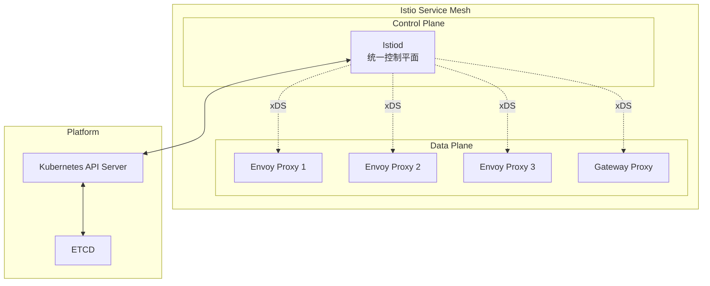
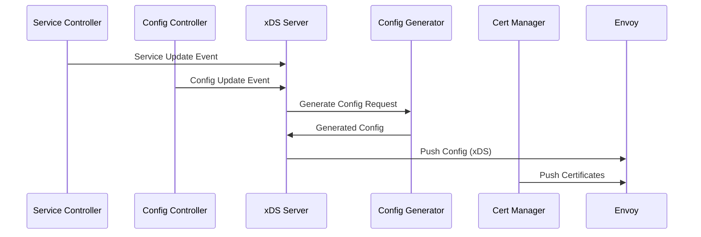
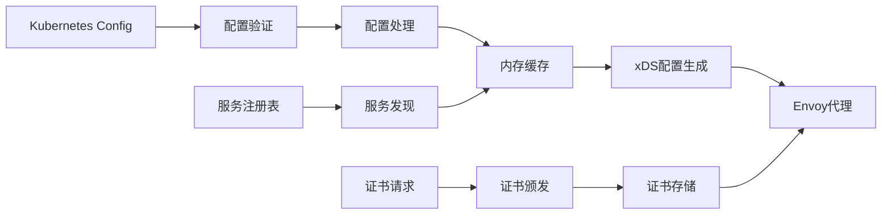
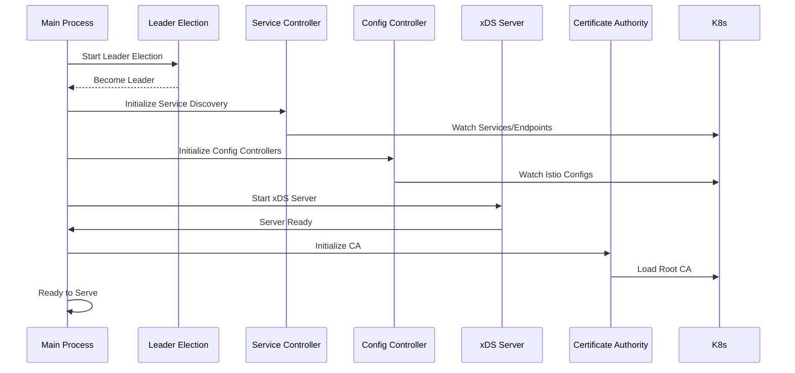
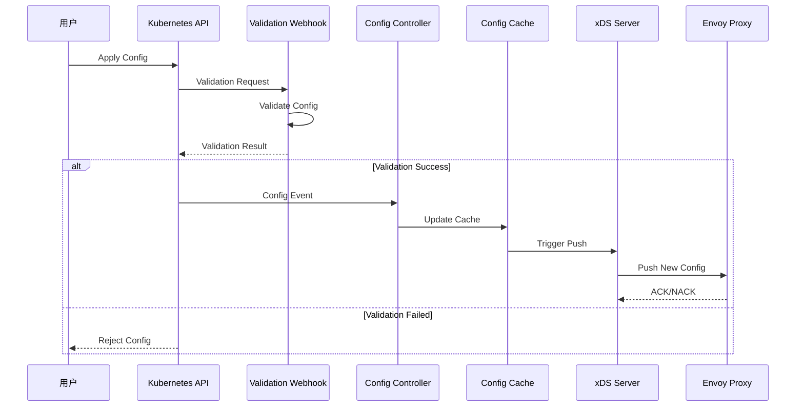
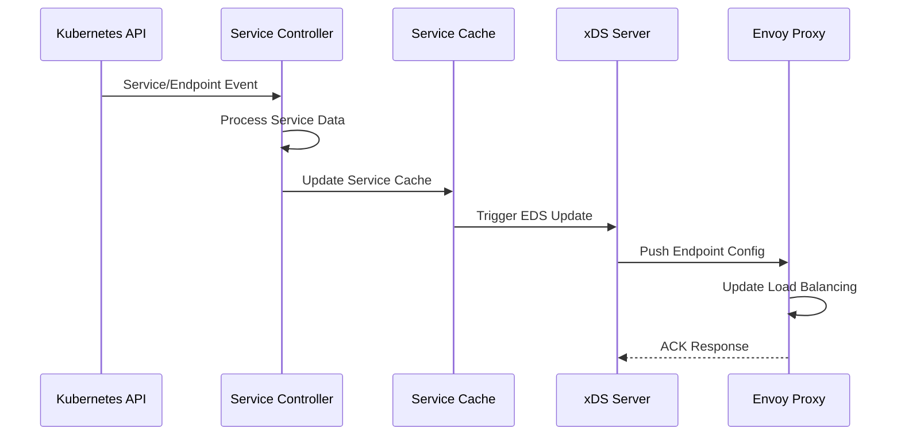
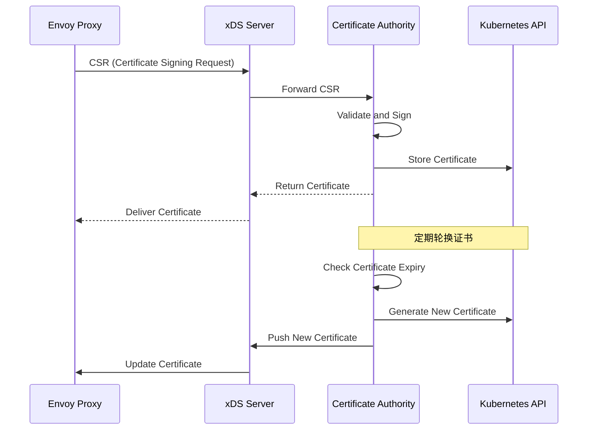
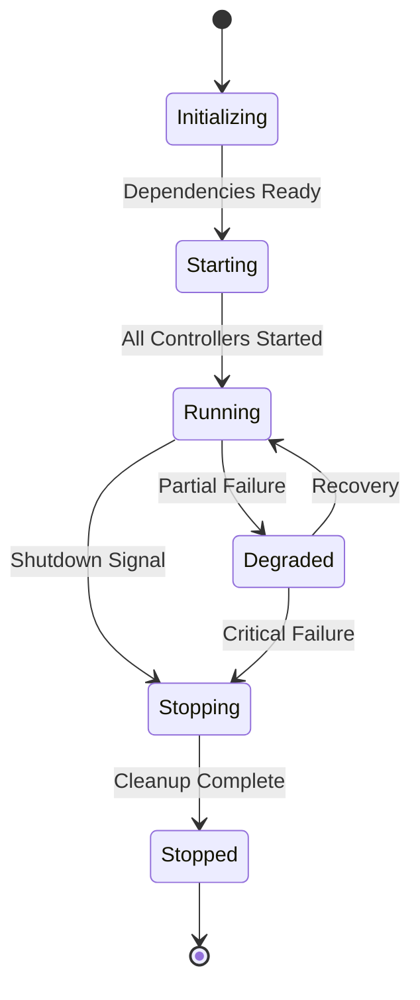

# Istiod 架构解析

## 组件定位

### 在整体架构中的位置和作用

Istiod 是 Istio 服务网格的统一控制平面，位于架构的核心位置。它整合了原先分散的 Pilot、Citadel、Galley 等组件的功能，作为单一的控制平面组件运行。



### 与其他组件的关系和依赖

- **上游依赖**：Kubernetes API Server、服务注册表、配置存储
- **下游服务**：所有 Envoy 代理实例（Sidecar 和 Gateway）
- **平级交互**：监控系统、日志系统、外部身份提供者

### 责任边界和接口定义

**核心职责：**
- 服务发现和配置管理
- 证书颁发和安全策略管理
- 配置验证和分发
- 遥测配置管理

**接口定义：**
- **北向接口**：Kubernetes API、REST API、Webhook
- **南向接口**：xDS gRPC API、证书分发接口
- **管理接口**：健康检查、指标暴露、调试接口

## 设计目标

### 解决的核心问题

1. **运维复杂性**：将多个控制平面组件整合为单一组件
2. **配置一致性**：确保所有代理获得一致的配置
3. **性能优化**：减少组件间通信开销
4. **高可用性**：简化故障转移和恢复机制

### 性能和可扩展性目标

- **配置下发延迟**：< 1秒 (P99)
- **支持代理数量**：单实例支持 1000+ 代理
- **内存使用**：< 1GB (1000 代理场景)
- **CPU 使用**：< 1 core (稳态运行)

### 安全和可靠性要求

- **零停机升级**：支持滚动升级
- **配置回滚**：支持配置变更回滚
- **故障隔离**：单个代理故障不影响其他代理
- **安全通信**：所有通信使用 TLS 加密

## 内部架构设计

### 模块结构图

```mermaid
graph TB
    subgraph "Istiod Internal Architecture"
        subgraph "Server Framework"
            GRPCServer[gRPC Server]
            HTTPServer[HTTP Server]
            WebhookServer[Webhook Server]
        end
        
        subgraph "Pilot Module"
            ServiceDiscovery[Service Discovery]
            ConfigController[Config Controller]
            XDSServer[xDS Server]
            EnvoyConfigGen[Envoy Config Generator]
        end
        
        subgraph "Citadel Module"
            CA[Certificate Authority]
            CertManager[Certificate Manager]
            SecretController[Secret Controller]
            CSRController[CSR Controller]
        end
        
        subgraph "Galley Module"
            ConfigValidation[Config Validation]
            ConfigProcessor[Config Processor]
            ValidationWebhook[Validation Webhook]
            ConversionWebhook[Conversion Webhook]
        end
        
        subgraph "Common Infrastructure"
            LeaderElection[Leader Election]
            HealthCheck[Health Check]
            Metrics[Metrics]
            Logging[Logging]
        end
    end
    
    subgraph "External Dependencies"
        K8sAPI[Kubernetes API]
        ConfigStore[Config Store]
        SecretStore[Secret Store]
    end
    
    GRPCServer --> XDSServer
    HTTPServer --> HealthCheck
    WebhookServer --> ValidationWebhook
    WebhookServer --> ConversionWebhook
    
    ServiceDiscovery --> K8sAPI
    ConfigController --> ConfigStore
    XDSServer --> EnvoyConfigGen
    
    CA --> SecretStore
    CertManager --> K8sAPI
    SecretController --> SecretStore
    
    ConfigValidation --> ConfigProcessor
    ValidationWebhook --> ConfigValidation
```



### 关键接口

#### 对外提供的 API 接口

1. **xDS gRPC API**
   ```protobuf
   service AggregatedDiscoveryService {
     rpc StreamAggregatedResources(stream DiscoveryRequest) 
       returns (stream DiscoveryResponse);
   }
   ```

2. **Webhook API**
   ```yaml
   # Validation Webhook
   POST /validate
   Content-Type: application/json
   
   # Conversion Webhook  
   POST /convert
   Content-Type: application/json
   ```

3. **管理 API**
   ```http
   GET /ready        # 就绪检查
   GET /healthz      # 健康检查
   GET /metrics      # Prometheus 指标
   GET /debug/       # 调试接口
   ```

#### 内部模块间的接口



### 数据模型

#### 核心数据结构定义

```go
// 服务发现数据模型
type Service struct {
    Hostname    string
    Namespace   string
    Ports       []Port
    Endpoints   []Endpoint
    Labels      map[string]string
}

// 配置数据模型
type Config struct {
    Type        string
    Name        string
    Namespace   string
    Spec        interface{}
    Labels      map[string]string
    Annotations map[string]string
}

// 代理状态模型
type ProxyState struct {
    ProxyID     string
    Node        *Node
    Metadata    map[string]string
    ConfigHash  string
    LastUpdate  time.Time
}
```

#### 数据持久化策略

- **配置数据**：存储在 Kubernetes ETCD 中
- **运行时状态**：内存缓存，定期同步
- **证书数据**：Kubernetes Secret 存储
- **审计日志**：文件系统或外部日志系统

#### 数据流转和变换



## 工作流程

### 启动和初始化



### 核心业务流程

#### 配置变更处理流程



#### 服务发现流程



#### 证书管理流程



### 生命周期管理

#### 组件的生命周期状态



#### 优雅启动和关闭

**启动流程：**
1. 加载配置文件
2. 初始化日志和指标
3. 启动 Leader Election
4. 初始化各个控制器
5. 启动 gRPC 和 HTTP 服务器
6. 等待所有组件就绪

**关闭流程：**
1. 停止接收新连接
2. 完成正在处理的请求
3. 停止各个控制器
4. 清理资源和连接
5. 记录关闭日志

#### 运行时的状态监控

```go
// 健康检查指标
type HealthStatus struct {
    ServiceDiscovery bool    // 服务发现状态
    ConfigSync       bool    // 配置同步状态
    CertificateCA    bool    // CA 状态
    XDSServer        bool    // xDS 服务状态
    LeaderElection   bool    // Leader 状态
}

// 性能指标
type PerformanceMetrics struct {
    ConnectedProxies int64   // 连接的代理数量
    ConfigPushRate   float64 // 配置推送频率
    ConfigLatency    float64 // 配置延迟
    MemoryUsage      int64   // 内存使用量
    CPUUsage         float64 // CPU 使用率
}
```

## 技术细节

### 核心算法

#### xDS 配置生成算法

```go
func GenerateEnvoyConfig(proxy *ProxyState, services []Service, configs []Config) *EnvoyConfig {
    // 1. 构建监听器配置
    listeners := buildListeners(proxy, configs)
    
    // 2. 构建路由配置
    routes := buildRoutes(proxy, configs, services)
    
    // 3. 构建集群配置
    clusters := buildClusters(proxy, services, configs)
    
    // 4. 构建端点配置
    endpoints := buildEndpoints(proxy, services)
    
    // 5. 构建过滤器链
    filters := buildFilters(proxy, configs)
    
    return &EnvoyConfig{
        Listeners: listeners,
        Routes:    routes,
        Clusters:  clusters,
        Endpoints: endpoints,
        Filters:   filters,
    }
}
```

**时间复杂度：** O(n*m) - n为服务数量，m为配置数量
**空间复杂度：** O(n+m) - 线性空间复杂度

#### 配置增量推送算法

```go
func CalculateConfigDelta(oldConfig, newConfig *EnvoyConfig) *ConfigDelta {
    delta := &ConfigDelta{}
    
    // 计算监听器变更
    delta.Listeners = calculateResourceDelta(oldConfig.Listeners, newConfig.Listeners)
    
    // 计算路由变更
    delta.Routes = calculateResourceDelta(oldConfig.Routes, newConfig.Routes)
    
    // 计算集群变更
    delta.Clusters = calculateResourceDelta(oldConfig.Clusters, newConfig.Clusters)
    
    // 计算端点变更
    delta.Endpoints = calculateResourceDelta(oldConfig.Endpoints, newConfig.Endpoints)
    
    return delta
}
```

### 并发和锁机制

#### 并发模型

```go
// 主要的并发组件
type Istiod struct {
    // 服务发现控制器 - 独立 goroutine
    serviceController *ServiceController
    
    // 配置控制器 - 每个资源类型一个 goroutine
    configControllers map[string]*ConfigController
    
    // xDS 服务器 - 每个连接一个 goroutine
    xdsServer *XDSServer
    
    // CA 服务 - 独立 goroutine 池
    certificateAuthority *CA
}
```

#### 线程安全机制

```go
// 使用读写锁保护共享缓存
type ConfigCache struct {
    mu    sync.RWMutex
    cache map[string]*Config
}

func (c *ConfigCache) Get(key string) *Config {
    c.mu.RLock()
    defer c.mu.RUnlock()
    return c.cache[key]
}

func (c *ConfigCache) Set(key string, config *Config) {
    c.mu.Lock()
    defer c.mu.Unlock()
    c.cache[key] = config
}
```

#### 死锁避免策略

1. **锁顺序**：始终按照固定顺序获取多个锁
2. **超时机制**：设置锁获取超时时间
3. **锁分离**：将大锁拆分为多个小锁
4. **无锁设计**：使用 channel 和 atomic 操作

### 网络通信

#### 通信协议和消息格式

```protobuf
// xDS gRPC 接口定义
service AggregatedDiscoveryService {
  rpc StreamAggregatedResources(stream DiscoveryRequest) 
    returns (stream DiscoveryResponse);
}

message DiscoveryRequest {
  string version_info = 1;
  Node node = 2;
  repeated string resource_names = 3;
  string type_url = 4;
  string response_nonce = 5;
  Status error_detail = 6;
}

message DiscoveryResponse {
  string version_info = 1;
  repeated google.protobuf.Any resources = 2;
  bool canary = 3;
  string type_url = 4;
  string nonce = 5;
  ControlPlane control_plane = 6;
}
```

#### 连接管理和重连机制

```go
type ConnectionManager struct {
    connections map[string]*Connection
    mu          sync.RWMutex
    
    // 重连参数
    initialInterval time.Duration
    maxInterval     time.Duration
    backoffFactor   float64
}

func (cm *ConnectionManager) handleDisconnection(conn *Connection) {
    go func() {
        backoff := cm.initialInterval
        for {
            time.Sleep(backoff)
            if cm.reconnect(conn) {
                break
            }
            backoff = time.Duration(float64(backoff) * cm.backoffFactor)
            if backoff > cm.maxInterval {
                backoff = cm.maxInterval
            }
        }
    }()
}
```

#### 负载均衡和故障转移

- **xDS 连接负载均衡**：客户端选择最近的 Istiod 实例
- **配置一致性**：所有 Istiod 实例保持配置一致
- **故障转移**：客户端自动重连到健康的实例

## 架构配置

### 关键配置参数

#### 性能相关的配置项

```yaml
apiVersion: v1
kind: ConfigMap
metadata:
  name: istio
  namespace: istio-system
data:
  mesh: |
    defaultConfig:
      # 代理连接配置
      proxyStatsMatcher:
        exclusionRegexps:
        - ".*_cx_.*"
      # 配置推送批处理
      pushTimeout: 30s
      # 证书轮换配置
      certRefreshDelay: 300s
---
apiVersion: apps/v1
kind: Deployment
metadata:
  name: istiod
spec:
  template:
    spec:
      containers:
      - name: discovery
        env:
        # 性能调优参数
        - name: PILOT_PUSH_THROTTLE
          value: "100"                    # 推送限流
        - name: PILOT_DEBOUNCE_AFTER
          value: "100ms"                  # 配置防抖
        - name: PILOT_DEBOUNCE_MAX
          value: "10s"                    # 最大防抖时间
        - name: PILOT_MAX_REQUESTS_PER_SECOND
          value: "25"                     # 每秒最大请求数
        resources:
          requests:
            memory: "512Mi"
            cpu: "500m"
          limits:
            memory: "2Gi"
            cpu: "2000m"
```

#### 安全相关的配置项

```yaml
env:
# CA 配置
- name: ROOT_CA_DIR
  value: "/etc/cacerts"              # 根证书目录
- name: WORKLOAD_CERT_TTL
  value: "24h"                       # 工作负载证书有效期
- name: CITADEL_ENABLE_WORKLOAD_CERT_ROTATION
  value: "true"                      # 启用证书自动轮换
- name: PILOT_ENABLE_WORKLOAD_ENTRY_AUTOREGISTRATION
  value: "true"                      # 启用工作负载自动注册

# TLS 配置
- name: PILOT_ENABLE_TLS_ON_SIDECAR_INGRESS
  value: "true"                      # 入口 TLS
- name: PILOT_SCOPE_GATEWAY_TO_NAMESPACE
  value: "false"                     # 网关命名空间隔离
```

#### 集群和分布式配置

```yaml
env:
# 多集群配置
- name: PILOT_ENABLE_REMOTE_JWKS_CACHE
  value: "true"                      # 远程 JWKS 缓存
- name: PILOT_JWKS_RESOLVER_INSECURE_SKIP_VERIFY
  value: "false"                     # JWKS 证书验证
- name: EXTERNAL_ISTIOD
  value: "false"                     # 外部 Istiod 模式

# Leader Election 配置
- name: PILOT_ENABLE_LEADER_ELECTION
  value: "true"                      # 启用 Leader 选举
- name: LEADER_ELECTION_NAMESPACE
  value: "istio-system"              # Leader 选举命名空间
```

### 性能调优

#### 性能瓶颈识别

**主要性能瓶颈：**
1. **内存使用**：大量代理连接导致内存消耗
2. **CPU 使用**：频繁的配置生成和推送
3. **网络 I/O**：xDS 连接和配置分发
4. **锁竞争**：并发访问共享缓存

**监控指标：**
```prometheus
# CPU 使用率
rate(container_cpu_usage_seconds_total{pod=~"istiod-.*"}[5m])

# 内存使用
container_memory_working_set_bytes{pod=~"istiod-.*"}

# 连接的代理数量
pilot_xds_clients

# 配置推送频率
rate(pilot_xds_pushes_total[5m])

# 配置推送延迟
histogram_quantile(0.99, pilot_proxy_convergence_time_bucket)
```

#### 调优参数和策略

**内存优化：**
```yaml
env:
- name: PILOT_FILTER_GATEWAY_CLUSTER_CONFIG
  value: "true"                      # 过滤网关集群配置
- name: PILOT_ENABLE_AMBIENT_CONTROLLERS
  value: "false"                     # 禁用 Ambient 模式控制器（如不需要）
```

**CPU 优化：**
```yaml
env:
- name: PILOT_PUSH_THROTTLE
  value: "200"                       # 增加推送限流
- name: PILOT_DEBOUNCE_AFTER
  value: "200ms"                     # 增加防抖时间
```

**网络优化：**
```yaml
env:
- name: PILOT_MAX_REQUESTS_PER_SECOND
  value: "50"                        # 增加请求限制
- name: PILOT_PUSH_BURST
  value: "100"                       # 推送突发限制
```

### 容量规划

#### 资源需求评估

**基准容量（每个 Istiod 实例）：**
- **代理数量**：500-1000 个
- **服务数量**：100-500 个
- **配置数量**：50-200 个
- **内存需求**：512MB-2GB
- **CPU 需求**：0.5-2 core

**扩容指标：**
```yaml
# 内存使用率超过 80%
(container_memory_working_set_bytes / container_spec_memory_limit_bytes) > 0.8

# CPU 使用率超过 70%
rate(container_cpu_usage_seconds_total[5m]) > 0.7

# 配置推送延迟超过 5 秒
histogram_quantile(0.95, pilot_proxy_convergence_time_bucket) > 5
```

#### 扩容策略和触发条件

**水平扩容：**
```yaml
apiVersion: autoscaling/v2
kind: HorizontalPodAutoscaler
metadata:
  name: istiod-hpa
spec:
  scaleTargetRef:
    apiVersion: apps/v1
    kind: Deployment
    name: istiod
  minReplicas: 2
  maxReplicas: 5
  metrics:
  - type: Resource
    resource:
      name: cpu
      target:
        type: Utilization
        averageUtilization: 70
  - type: Resource
    resource:
      name: memory
      target:
        type: Utilization
        averageUtilization: 80
```

**垂直扩容：**
```yaml
apiVersion: autoscaling.k8s.io/v1
kind: VerticalPodAutoscaler
metadata:
  name: istiod-vpa
spec:
  targetRef:
    apiVersion: apps/v1
    kind: Deployment
    name: istiod
  updatePolicy:
    updateMode: "Auto"
  resourcePolicy:
    containerPolicies:
    - containerName: discovery
      maxAllowed:
        cpu: 4
        memory: 8Gi
      minAllowed:
        cpu: 100m
        memory: 256Mi
```

#### 成本优化建议

1. **资源右调整**：定期评估实际资源使用情况
2. **区域部署**：在多个可用区部署以提高可用性
3. **缓存优化**：启用适当的缓存以减少计算开销
4. **配置精简**：移除不必要的配置和功能
5. **监控优化**：优化指标收集以减少开销

## 故障排除和运维

### 常见问题和解决方案

#### 配置推送失败

**症状：** Envoy 代理收不到最新配置
**排查步骤：**
```bash
# 检查 Istiod 状态
kubectl get pods -n istio-system -l app=istiod

# 查看 Istiod 日志
kubectl logs -n istio-system deployment/istiod

# 检查 xDS 连接
istioctl proxy-status

# 检查配置同步状态
istioctl proxy-config cluster <pod-name>.<namespace>
```

#### 内存泄漏

**症状：** Istiod 内存持续增长
**排查步骤：**
```bash
# 监控内存使用趋势
kubectl top pods -n istio-system -l app=istiod

# 检查连接的代理数量
curl http://istiod-pod-ip:15014/debug/registryz

# 分析内存分配
curl http://istiod-pod-ip:15014/debug/pprof/heap
```

### 监控和告警

#### 关键指标

```prometheus
# Istiod 可用性
up{job="istiod"}

# 配置推送成功率
rate(pilot_xds_pushes_total{type!="eds"}[5m]) / rate(pilot_xds_push_attempts_total{type!="eds"}[5m])

# 证书颁发延迟
histogram_quantile(0.99, citadel_server_csr_sign_duration_seconds_bucket)

# 内存和 CPU 使用
rate(container_cpu_usage_seconds_total{pod=~"istiod-.*"}[5m])
container_memory_working_set_bytes{pod=~"istiod-.*"}
```

#### 告警规则

```yaml
groups:
- name: istiod.rules
  rules:
  - alert: IstiodDown
    expr: up{job="istiod"} == 0
    for: 1m
    labels:
      severity: critical
    annotations:
      summary: "Istiod is down"
      
  - alert: IstiodHighMemoryUsage
    expr: (container_memory_working_set_bytes{pod=~"istiod-.*"} / container_spec_memory_limit_bytes{pod=~"istiod-.*"}) > 0.9
    for: 5m
    labels:
      severity: warning
    annotations:
      summary: "Istiod high memory usage"
      
  - alert: ConfigPushLatencyHigh
    expr: histogram_quantile(0.99, pilot_proxy_convergence_time_bucket) > 10
    for: 2m
    labels:
      severity: warning
    annotations:
      summary: "High config push latency"
```

## 参考资料

- [Istiod 官方架构文档](https://istio.io/latest/docs/ops/deployment/architecture/)
- [xDS 协议规范](https://www.envoyproxy.io/docs/envoy/latest/api-docs/xds_protocol)
- [Istio 性能调优指南](https://istio.io/latest/docs/ops/deployment/performance-and-scalability/)
- [源码分析](https://github.com/istio/istio/tree/master/pilot)
