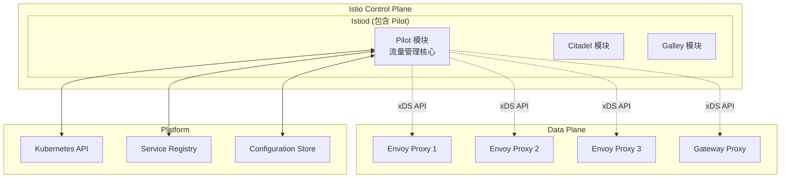
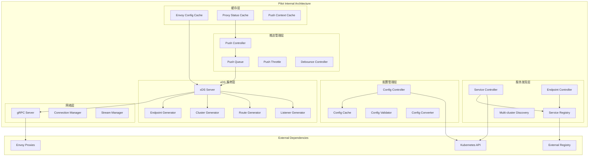
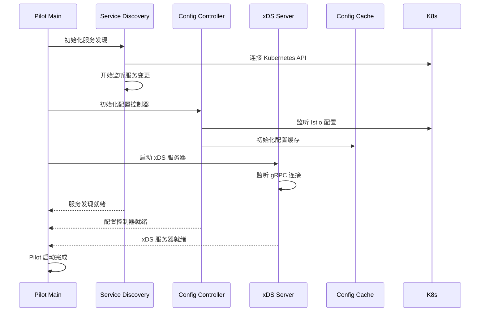
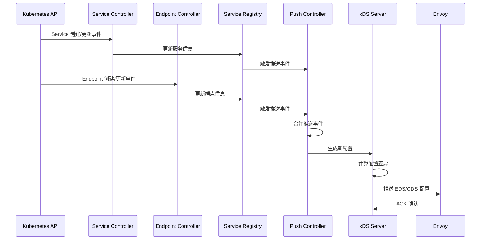
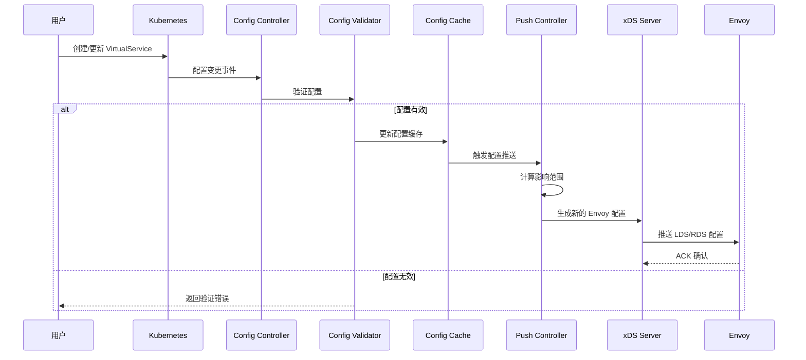
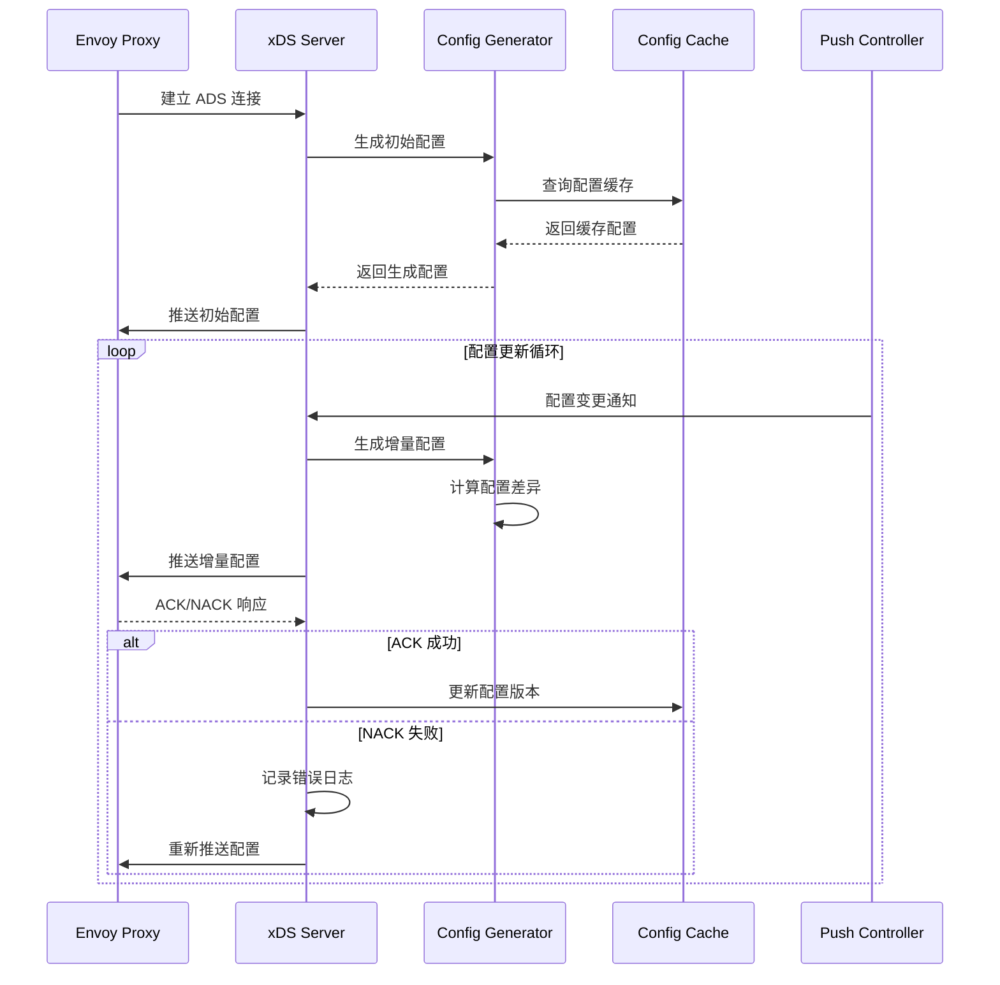

# Pilot 架构解析

## 组件定位

### 在整体架构中的位置和作用

Pilot 是 Istio 控制平面的核心流量管理组件，负责服务发现、流量管理和配置分发。在 Istio 1.5+ 版本中，Pilot 已经整合到 Istiod 中，但其核心功能和架构设计仍然是理解 Istio 流量管理的关键。



### 与其他组件的关系和依赖

- **上游依赖**：Kubernetes API Server、服务注册表、配置存储
- **平级组件**：与 Citadel（安全）、Galley（配置）模块协作
- **下游服务**：所有 Envoy 代理实例（Sidecar 和 Gateway）
- **外部集成**：支持多种服务注册表（Consul、Eureka 等）

### 责任边界和接口定义

**核心职责：**
- 服务发现和注册表管理
- 流量路由配置生成和分发
- 负载均衡策略管理
- 故障注入和流量镜像配置

**接口定义：**
- **北向接口**：Kubernetes API、外部服务注册表 API
- **南向接口**：xDS gRPC API（LDS、RDS、CDS、EDS）
- **东西向接口**：与 Citadel、Galley 的内部 API
- **管理接口**：调试、健康检查、指标暴露

## 设计目标

### 解决的核心问题

1. **服务发现**：自动发现和管理服务实例
2. **配置分发**：将高级路由规则转换为 Envoy 配置
3. **流量管理**：实现复杂的流量路由和负载均衡
4. **配置一致性**：确保所有代理获得一致的配置
5. **性能优化**：高效的配置生成和分发机制

### 性能和可扩展性目标

- **配置推送延迟**：< 1秒 (P99)
- **支持服务数量**：10K+ 服务实例
- **支持代理数量**：1K+ Envoy 代理
- **配置生成速度**：< 100ms 每个代理
- **内存效率**：线性内存增长

### 安全和可靠性要求

- **配置验证**：严格的配置语法和语义验证
- **渐进式推送**：支持金丝雀配置推送
- **回滚机制**：配置错误时的快速回滚
- **高可用性**：支持多实例部署和故障转移

## 内部架构设计

### 模块结构图



### 关键接口

#### xDS API 接口

```protobuf
// Aggregated Discovery Service
service AggregatedDiscoveryService {
  rpc StreamAggregatedResources(stream DiscoveryRequest) 
    returns (stream DiscoveryResponse);
}

// Listener Discovery Service
service ListenerDiscoveryService {
  rpc StreamListeners(stream DiscoveryRequest) 
    returns (stream DiscoveryResponse);
  rpc FetchListeners(DiscoveryRequest) 
    returns (DiscoveryResponse);
}

// Route Discovery Service  
service RouteDiscoveryService {
  rpc StreamRoutes(stream DiscoveryRequest) 
    returns (stream DiscoveryResponse);
  rpc FetchRoutes(DiscoveryRequest) 
    returns (DiscoveryResponse);
}

// Cluster Discovery Service
service ClusterDiscoveryService {
  rpc StreamClusters(stream DiscoveryRequest) 
    returns (stream DiscoveryResponse);
  rpc FetchClusters(DiscoveryRequest) 
    returns (DiscoveryResponse);
}

// Endpoint Discovery Service
service EndpointDiscoveryService {
  rpc StreamEndpoints(stream DiscoveryRequest) 
    returns (stream DiscoveryResponse);
  rpc FetchEndpoints(DiscoveryRequest) 
    returns (DiscoveryResponse);
}
```

#### 服务发现接口

```go
// Service Registry 接口
type ServiceDiscovery interface {
    // 获取所有服务
    Services() ([]*Service, error)
    
    // 获取服务实例
    InstancesByPort(service *Service, port int, labels LabelsCollection) ([]*ServiceInstance, error)
    
    // 获取代理服务实例
    GetProxyServiceInstances(proxy *Proxy) ([]*ServiceInstance, error)
    
    // 获取代理工作负载标签
    GetProxyWorkloadLabels(proxy *Proxy) (LabelsCollection, error)
    
    // 运行服务发现
    Run(stop <-chan struct{})
}

// 服务实例定义
type ServiceInstance struct {
    Service     *Service
    ServicePort *Port
    Endpoint    NetworkEndpoint
    Labels      Labels
}

// 网络端点定义
type NetworkEndpoint struct {
    Family   AddressFamily
    Address  string
    Port     int
    Network  string
    Locality *Locality
}
```

#### 配置转换接口

```go
// 配置生成器接口
type ConfigGenerator interface {
    // 生成监听器配置
    BuildListeners(proxy *Proxy, push *PushContext) []*listener.Listener
    
    // 生成集群配置
    BuildClusters(proxy *Proxy, push *PushContext) []*cluster.Cluster
    
    // 生成路由配置
    BuildHTTPRoutes(proxy *Proxy, push *PushContext, routeNames []string) []*route.RouteConfiguration
    
    // 生成端点配置
    BuildEndpoints(proxy *Proxy, push *PushContext) []*endpoint.ClusterLoadAssignment
}

// 推送上下文
type PushContext struct {
    Mesh             *meshconfig.MeshConfig
    ServiceDiscovery ServiceDiscovery
    ServiceByHostname map[host.Name]*Service
    VirtualServices   []config.Config
    DestinationRules  []config.Config
    Gateways          []config.Config
    Sidecars          []config.Config
}
```

### 数据模型

#### 核心数据结构

```go
// 服务定义
type Service struct {
    Hostname       host.Name
    DefaultAddress string
    Ports          PortList
    Location       LocationType
    Resolution     Resolution
    MeshExternal   bool
    Labels         Labels
    Attributes     ServiceAttributes
}

// 代理配置
type Proxy struct {
    Type           NodeType
    ID             string
    DNSDomain      string
    Labels         map[string]string
    Annotations    map[string]string
    IPAddresses    []string
    Locality       *core.Locality
    ConfigNamespace string
    Metadata       *NodeMetadata
    SidecarScope   *SidecarScope
    PrevSidecarScope *SidecarScope
}

// 推送请求
type PushRequest struct {
    Full              bool
    ConfigsUpdated    map[ConfigKey]struct{}
    Reason            []TriggerReason
    Start             time.Time
    Push              *PushContext
}

// xDS 连接
type Connection struct {
    ID            string
    proxy         *Proxy
    Certificates  []string
    conID         uint32
    pushChannel   chan *Event
    initialized   bool
    stop          chan struct{}
}
```

#### 配置缓存机制

```go
// 配置缓存
type XdsCache struct {
    // 按资源类型缓存
    listeners map[string]*discovery.Resource
    clusters  map[string]*discovery.Resource
    routes    map[string]*discovery.Resource
    endpoints map[string]*discovery.Resource
    
    // 缓存元数据
    versions  map[string]string
    nonces    map[string]string
    
    // 并发控制
    mu sync.RWMutex
}

func (c *XdsCache) Get(proxyID string, resourceType string) *discovery.Resource {
    c.mu.RLock()
    defer c.mu.RUnlock()
    
    switch resourceType {
    case v3.ListenerType:
        return c.listeners[proxyID]
    case v3.ClusterType:
        return c.clusters[proxyID]
    case v3.RouteType:
        return c.routes[proxyID]
    case v3.EndpointType:
        return c.endpoints[proxyID]
    }
    return nil
}
```

## 工作流程

### 启动和初始化



### 服务发现流程



### 配置变更处理



### xDS 配置推送流程



## 技术细节

### 配置生成算法

#### 监听器生成算法

```go
func (configgen *ConfigGeneratorImpl) BuildListeners(proxy *Proxy, push *PushContext) []*listener.Listener {
    var listeners []*listener.Listener
    
    switch proxy.Type {
    case SidecarProxy:
        // 生成 Sidecar 监听器
        listeners = append(listeners, configgen.buildSidecarInboundListeners(proxy, push)...)
        listeners = append(listeners, configgen.buildSidecarOutboundListeners(proxy, push)...)
        
    case Router:
        // 生成 Gateway 监听器
        listeners = append(listeners, configgen.buildGatewayListeners(proxy, push)...)
    }
    
    return listeners
}

func (configgen *ConfigGeneratorImpl) buildSidecarInboundListeners(proxy *Proxy, push *PushContext) []*listener.Listener {
    var listeners []*listener.Listener
    
    // 为每个服务端口创建监听器
    for _, service := range proxy.SidecarScope.Services() {
        for _, port := range service.Ports {
            if port.Protocol.IsHTTP() {
                listener := configgen.buildHTTPInboundListener(proxy, service, port, push)
                listeners = append(listeners, listener)
            } else {
                listener := configgen.buildTCPInboundListener(proxy, service, port, push)
                listeners = append(listeners, listener)
            }
        }
    }
    
    return listeners
}
```

#### 路由生成算法

```go
func (configgen *ConfigGeneratorImpl) BuildHTTPRoutes(proxy *Proxy, push *PushContext, routeNames []string) []*route.RouteConfiguration {
    var routeConfigs []*route.RouteConfiguration
    
    for _, routeName := range routeNames {
        virtualHosts := configgen.buildVirtualHosts(proxy, push, routeName)
        
        routeConfig := &route.RouteConfiguration{
            Name:         routeName,
            VirtualHosts: virtualHosts,
            ValidateClusters: &wrappers.BoolValue{Value: false},
        }
        
        routeConfigs = append(routeConfigs, routeConfig)
    }
    
    return routeConfigs
}

func (configgen *ConfigGeneratorImpl) buildVirtualHosts(proxy *Proxy, push *PushContext, routeName string) []*route.VirtualHost {
    var virtualHosts []*route.VirtualHost
    
    // 获取相关的 VirtualService 配置
    virtualServices := push.VirtualServicesForGateway(proxy, routeName)
    
    for _, vs := range virtualServices {
        for _, host := range vs.Spec.(*networking.VirtualService).Hosts {
            routes := configgen.buildHTTPRoutesForVirtualService(proxy, push, vs, host)
            
            virtualHost := &route.VirtualHost{
                Name:    fmt.Sprintf("%s:%s", vs.Name, host),
                Domains: []string{host},
                Routes:  routes,
            }
            
            virtualHosts = append(virtualHosts, virtualHost)
        }
    }
    
    return virtualHosts
}
```

### 推送优化机制

#### 增量推送算法

```go
type PushQueue struct {
    pending     map[string]*PushRequest
    mu          sync.Mutex
    cond        *sync.Cond
    connections map[string]*Connection
}

func (pq *PushQueue) Enqueue(proxy *Proxy, req *PushRequest) {
    pq.mu.Lock()
    defer pq.mu.Unlock()
    
    // 合并推送请求
    if existing, ok := pq.pending[proxy.ID]; ok {
        existing.ConfigsUpdated = mergeMaps(existing.ConfigsUpdated, req.ConfigsUpdated)
        existing.Reason = append(existing.Reason, req.Reason...)
    } else {
        pq.pending[proxy.ID] = req
    }
    
    pq.cond.Signal()
}

func (pq *PushQueue) Run() {
    for {
        pq.mu.Lock()
        for len(pq.pending) == 0 {
            pq.cond.Wait()
        }
        
        // 批量处理推送请求
        batch := make(map[string]*PushRequest)
        for proxyID, req := range pq.pending {
            batch[proxyID] = req
            delete(pq.pending, proxyID)
        }
        pq.mu.Unlock()
        
        // 并发推送配置
        var wg sync.WaitGroup
        for proxyID, req := range batch {
            wg.Add(1)
            go func(pID string, r *PushRequest) {
                defer wg.Done()
                pq.pushToProxy(pID, r)
            }(proxyID, req)
        }
        wg.Wait()
    }
}
```

#### 防抖动机制

```go
type DebounceController struct {
    configUpdates chan ConfigUpdateEvent
    pushQueue     *PushQueue
    debounceAfter time.Duration
    debounceMax   time.Duration
}

func (dc *DebounceController) Run() {
    var timer *time.Timer
    var pending []ConfigUpdateEvent
    
    for {
        select {
        case event := <-dc.configUpdates:
            pending = append(pending, event)
            
            if timer == nil {
                timer = time.NewTimer(dc.debounceAfter)
            }
            
        case <-timer.C:
            if len(pending) > 0 {
                // 合并所有待处理事件
                merged := dc.mergeConfigEvents(pending)
                dc.pushQueue.Enqueue(merged)
                pending = pending[:0]
            }
            timer = nil
            
        case <-time.After(dc.debounceMax):
            if len(pending) > 0 && timer != nil {
                // 强制推送，避免过度延迟
                merged := dc.mergeConfigEvents(pending)
                dc.pushQueue.Enqueue(merged)
                pending = pending[:0]
                timer.Stop()
                timer = nil
            }
        }
    }
}
```

### 服务注册表抽象

#### 多注册表支持

```go
type AggregateController struct {
    registries []ServiceDiscovery
    storeLock  sync.RWMutex
    services   map[host.Name]*Service
    handlers   []func(Service, Event)
}

func (a *AggregateController) Services() ([]*Service, error) {
    a.storeLock.RLock()
    defer a.storeLock.RUnlock()
    
    var services []*Service
    for _, svc := range a.services {
        services = append(services, svc)
    }
    
    return services, nil
}

func (a *AggregateController) InstancesByPort(svc *Service, port int, labels LabelsCollection) ([]*ServiceInstance, error) {
    var instances []*ServiceInstance
    
    // 从所有注册表聚合实例
    for _, registry := range a.registries {
        registryInstances, err := registry.InstancesByPort(svc, port, labels)
        if err == nil {
            instances = append(instances, registryInstances...)
        }
    }
    
    return instances, nil
}

func (a *AggregateController) handleServiceEvent(svc *Service, event Event) {
    a.storeLock.Lock()
    defer a.storeLock.Unlock()
    
    switch event {
    case EventAdd, EventUpdate:
        a.services[svc.Hostname] = svc
    case EventDelete:
        delete(a.services, svc.Hostname)
    }
    
    // 通知所有处理器
    for _, handler := range a.handlers {
        handler(*svc, event)
    }
}
```

## 架构配置

### 性能调优参数

```yaml
# Pilot 环境变量配置
env:
# 推送限流配置
- name: PILOT_PUSH_THROTTLE
  value: "100"                    # 每秒最大推送数
- name: PILOT_PUSH_BURST
  value: "100"                    # 推送突发限制

# 防抖配置
- name: PILOT_DEBOUNCE_AFTER
  value: "100ms"                  # 防抖延迟
- name: PILOT_DEBOUNCE_MAX
  value: "10s"                    # 最大防抖时间

# 缓存配置
- name: PILOT_ENABLE_CONFIG_DISTRIBUTION_TRACKING
  value: "true"                   # 启用配置分发跟踪
- name: PILOT_ENABLE_STATUS
  value: "true"                   # 启用状态报告

# 服务发现配置
- name: PILOT_ENABLE_WORKLOAD_ENTRY_AUTOREGISTRATION
  value: "true"                   # 启用工作负载自动注册
- name: PILOT_ENABLE_CROSS_CLUSTER_WORKLOAD_ENTRY
  value: "true"                   # 启用跨集群工作负载

# xDS 配置
- name: PILOT_ENABLE_XDS_IDENTITY_CHECK
  value: "true"                   # 启用 xDS 身份检查
- name: PILOT_XDS_CACHE_SIZE
  value: "30000"                  # xDS 缓存大小
```

### 监控和指标

#### 关键指标

```prometheus
# Pilot 可用性
pilot_k8s_cfg_events_total          # 配置事件总数
pilot_services                      # 服务数量
pilot_xds_clients                   # 连接的客户端数
pilot_xds_pushes_total              # 推送总数
pilot_xds_push_errors_total         # 推送错误数

# 性能指标
pilot_proxy_convergence_time        # 代理配置收敛时间
pilot_xds_config_size_bytes         # 配置大小
pilot_xds_write_timeout_total       # 写入超时数
pilot_total_xds_internal_errors     # 内部错误数
```

#### 告警规则

```yaml
groups:
- name: pilot.rules
  rules:
  - alert: PilotConfigPushErrors
    expr: rate(pilot_xds_push_errors_total[5m]) > 0.1
    for: 2m
    labels:
      severity: warning
    annotations:
      summary: "Pilot config push error rate high"
      
  - alert: PilotProxyConvergenceHigh
    expr: histogram_quantile(0.99, pilot_proxy_convergence_time_bucket) > 10
    for: 5m
    labels:
      severity: warning
    annotations:
      summary: "Pilot proxy convergence time high"
      
  - alert: PilotXDSClientsDropped
    expr: increase(pilot_xds_clients[1m]) < -10
    for: 1m
    labels:
      severity: warning
    annotations:
      summary: "Large number of XDS clients disconnected"
```

## 故障排除和运维

### 常见问题诊断

#### 配置不生效

```bash
# 检查 Pilot 状态
kubectl get pods -n istio-system -l app=istiod

# 查看 Pilot 日志
kubectl logs -n istio-system -l app=istiod -c discovery

# 检查 xDS 连接状态
istioctl proxy-status

# 查看配置分发状态
istioctl proxy-config cluster productpage-v1-123456.default
```

#### 服务发现问题

```bash
# 检查服务注册状态
istioctl proxy-config endpoints productpage-v1-123456.default

# 查看服务列表
kubectl get services -A

# 检查端点状态
kubectl get endpoints -A

# 调试服务发现
istioctl proxy-config cluster productpage-v1-123456.default --fqdn reviews.default.svc.cluster.local
```

### 性能调优

#### 推送性能优化

```bash
# 监控推送性能
kubectl exec -n istio-system deployment/istiod -- curl localhost:15014/debug/push_status

# 查看配置缓存状态
kubectl exec -n istio-system deployment/istiod -- curl localhost:15014/debug/config_cache

# 检查内存使用
kubectl top pods -n istio-system -l app=istiod
```

#### 配置规模优化

```bash
# 检查配置数量
kubectl get virtualservices,destinationrules,gateways,serviceentries -A | wc -l

# 分析配置大小
istioctl proxy-config dump productpage-v1-123456.default | jq '.configs | length'

# 优化配置选择器
kubectl get sidecar -A -o yaml
```

## 最佳实践

### 配置管理

1. **命名空间隔离**：使用命名空间隔离不同环境的配置
2. **标签选择器**：合理使用标签选择器减少配置影响范围
3. **配置验证**：部署前验证配置语法和语义
4. **渐进式变更**：使用金丝雀发布进行配置变更

### 性能优化

1. **合理配置推送限流**：避免配置推送过于频繁
2. **优化服务发现**：减少不必要的服务注册
3. **配置缓存**：启用配置缓存提高性能
4. **监控关键指标**：持续监控 Pilot 性能指标

### 故障恢复

1. **多实例部署**：部署多个 Pilot 实例确保高可用
2. **配置备份**：定期备份重要配置
3. **故障演练**：定期进行故障恢复演练
4. **监控告警**：设置完善的监控和告警机制

## 参考资料

- [Pilot 设计文档](https://github.com/istio/istio/blob/master/pilot/doc/design.md)
- [xDS 协议规范](https://www.envoyproxy.io/docs/envoy/latest/api-docs/xds_protocol)
- [Istio 流量管理](https://istio.io/latest/docs/concepts/traffic-management/)
- [服务网格架构](https://istio.io/latest/docs/ops/deployment/architecture/)
