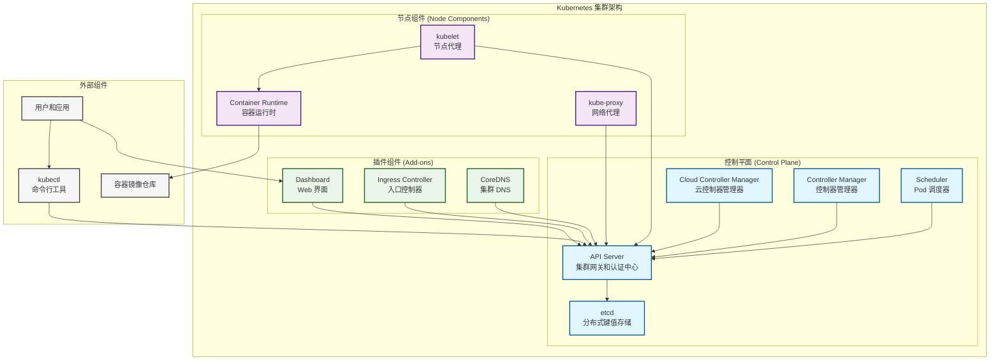

# Kubernetes 技术资源集合

## 概述

Kubernetes 是一个开源的容器编排平台，用于自动化部署、扩展和管理容器化应用程序。本资源集合提供完整的 Kubernetes 技术文档、实用脚本、配置模板和官方示例。

## 核心架构



## 目录结构

```
kubernetes/
├── README.md                    # 总体介绍和导航
├── knowledge/                   # 技术知识文档
│   ├── 01-core-concepts/       # 核心概念详解
│   ├── 02-architecture/        # 系统架构分析
│   ├── 03-working-principles/  # 工作原理解析
│   ├── 04-observability/       # 可观测性实施
│   ├── 05-optimization/        # 性能优化指南
│   ├── 06-troubleshooting/     # 故障排除方法
│   └── 07-best-practices/      # 最佳实践总结
├── scripts/                    # 自动化脚本集合
│   ├── install/               # 安装部署脚本
│   ├── configure/             # 配置管理脚本
│   ├── deploy/                # 应用部署脚本
│   ├── maintain/              # 运维管理脚本
│   ├── monitor/               # 监控检查脚本
│   ├── utils/                 # 工具辅助脚本
│   └── uninstall/             # 卸载清理脚本
├── templates/                  # 配置模板库
│   ├── workloads/             # 工作负载模板
│   ├── services/              # 服务配置模板
│   ├── configuration/         # 配置管理模板
│   ├── storage/               # 存储配置模板
│   ├── security/              # 安全策略模板
│   ├── monitoring/            # 监控配置模板
│   ├── ci-cd/                 # CI/CD 集成模板
│   └── examples/              # 完整应用示例
└── examples/                   # 官方示例集合
    ├── scripts/               # 示例运行脚本
    ├── official/              # 官方示例代码
    └── configs/               # 示例配置文件
```

## 技术知识体系

### 01. 核心概念 ([详细文档](knowledge/01-core-concepts/README.md))

#### 工作负载资源
- **[Pod](knowledge/01-core-concepts/pod.md)**: Kubernetes 最小部署单元，包含一个或多个容器
- **[Deployment](knowledge/01-core-concepts/deployment.md)**: 无状态应用的声明式部署和管理
- **[StatefulSet](knowledge/01-core-concepts/statefulset.md)**: 有状态应用的部署，提供稳定标识和存储
- **[DaemonSet](knowledge/01-core-concepts/daemonset.md)**: 确保每个节点运行特定 Pod 副本
- **[Job/CronJob](knowledge/01-core-concepts/job.md)**: 批处理任务和定时任务管理

#### 服务发现和负载均衡
- **[Service](knowledge/01-core-concepts/service.md)**: 提供稳定的网络端点和负载均衡
- **[Ingress](knowledge/01-core-concepts/ingress.md)**: HTTP/HTTPS 路由和外部访问控制
- **[Endpoints](knowledge/01-core-concepts/endpoints.md)**: 服务端点的动态维护

#### 配置和存储
- **[ConfigMap](knowledge/01-core-concepts/configmap.md)**: 非敏感配置数据的存储和管理
- **[Secret](knowledge/01-core-concepts/secret.md)**: 敏感信息的安全存储和访问控制
- **[PersistentVolume](knowledge/01-core-concepts/persistentvolume.md)**: 集群级持久化存储资源
- **[StorageClass](knowledge/01-core-concepts/storageclass.md)**: 动态存储供应和管理

#### 安全和访问控制
- **[RBAC](knowledge/01-core-concepts/role.md)**: 基于角色的访问控制机制
- **[ServiceAccount](knowledge/01-core-concepts/serviceaccount.md)**: Pod 身份标识和 API 访问控制
- **[NetworkPolicy](knowledge/01-core-concepts/networkpolicy.md)**: 网络访问控制和微分段安全

#### 集群管理
- **[Namespace](knowledge/01-core-concepts/namespace.md)**: 资源隔离和多租户管理
- **[ResourceQuota](knowledge/01-core-concepts/resourcequota.md)**: 资源配额和使用限制
- **[Node](knowledge/01-core-concepts/node.md)**: 集群工作节点的管理和维护

### 02. 系统架构 ([详细文档](knowledge/02-architecture/README.md))

#### 控制平面组件
- **[API Server](knowledge/02-architecture/api-server.md)**: 集群 API 网关，提供认证、授权和准入控制
- **[etcd](knowledge/02-architecture/etcd.md)**: 分布式键值存储，保存集群状态和配置
- **[Scheduler](knowledge/02-architecture/scheduler.md)**: Pod 调度决策和资源分配优化
- **[Controller Manager](knowledge/02-architecture/controller-manager.md)**: 控制器生命周期管理和状态协调

#### 节点组件
- **[kubelet](knowledge/02-architecture/kubelet.md)**: 节点代理，管理 Pod 生命周期和资源监控
- **[kube-proxy](knowledge/02-architecture/kube-proxy.md)**: 网络代理，实现服务发现和负载均衡
- **[Container Runtime](knowledge/02-architecture/container-runtime.md)**: 容器运行时，支持 CRI 标准接口

#### 网络和存储
- **[CoreDNS](knowledge/02-architecture/coredns.md)**: 集群 DNS 服务和服务发现
- **CNI 网络插件**: 容器网络接口和网络策略实现
- **CSI 存储驱动**: 容器存储接口和动态供应

### 03. 工作原理 ([详细文档](knowledge/03-working-principles/README.md))

#### 核心原理
- **声明式 API**: 描述期望状态，系统自动协调实现
- **控制器模式**: Watch-Reconcile 循环，持续状态同步
- **调度算法**: 过滤和评分机制，优化资源分配
- **服务发现**: DNS 解析和端点维护机制

### 04. 可观测性 ([详细文档](knowledge/04-observability/README.md))

#### 监控指标
- **系统监控**: CPU、内存、磁盘、网络资源监控
- **应用监控**: 业务指标、性能指标、错误率监控
- **集群监控**: Kubernetes 组件和资源对象状态监控

#### 日志管理
- **日志收集**: Fluentd、Filebeat 等日志收集器配置
- **日志存储**: Elasticsearch、Loki 等日志存储后端
- **日志分析**: Kibana、Grafana 等日志分析和可视化

#### 链路追踪
- **分布式追踪**: Jaeger、Zipkin 链路追踪系统
- **OpenTelemetry**: 统一可观测性框架和多信号关联
- **性能分析**: 瓶颈识别和性能优化指导

### 05. 性能优化 ([详细文档](knowledge/05-optimization/README.md))

#### 资源优化
- **CPU 和内存配置**: requests 和 limits 的合理设置
- **存储性能优化**: 存储类选择和 I/O 性能调优
- **网络性能优化**: CNI 插件选择和网络拓扑优化

#### 调度优化
- **节点亲和性**: 基于节点标签的调度约束
- **Pod 亲和性**: 基于 Pod 标签的调度策略
- **资源调度算法**: 自定义调度器和调度策略

### 06. 故障排除 ([详细文档](knowledge/06-troubleshooting/README.md))

#### 常见问题诊断
- **Pod 启动失败**: 镜像拉取、资源不足、配置错误诊断
- **网络连接问题**: 服务发现、DNS 解析、网络策略排查
- **存储挂载问题**: PV/PVC 绑定、存储类配置、权限问题

#### 调试工具和方法
- **kubectl 调试**: 日志查看、事件排查、资源状态检查
- **集群诊断**: 组件状态检查、配置验证、性能分析
- **应用调试**: 容器调试、网络测试、存储测试

### 07. 最佳实践 ([详细文档](knowledge/07-best-practices/README.md))

#### 安全最佳实践
- **RBAC 权限控制**: 最小权限原则和权限分离
- **Pod 安全策略**: 安全上下文和运行时安全
- **网络安全**: 网络策略和服务网格安全

#### 运维最佳实践
- **资源管理**: 配额设置和资源监控
- **高可用部署**: 多副本、反亲和性、故障转移
- **备份恢复**: etcd 备份、应用数据备份、灾难恢复

## 自动化脚本

### 安装部署脚本
```bash
# Kubernetes 集群安装
./scripts/install/install-kubernetes.sh

# 组件安装
./scripts/install/install-monitoring.sh
./scripts/install/install-ingress.sh
```

### 配置管理脚本
```bash
# 集群配置
./scripts/configure/configure-cluster.sh
./scripts/configure/configure-network.sh
./scripts/configure/configure-storage.sh

# 安全配置
./scripts/configure/configure-rbac.sh
./scripts/configure/configure-security.sh
```

### 运维管理脚本
```bash
# 健康检查
./scripts/maintain/health-check.sh

# 备份恢复
./scripts/maintain/backup-cluster.sh
./scripts/maintain/restore-cluster.sh

# 资源清理
./scripts/maintain/cleanup-resources.sh
```

### 监控检查脚本
```bash
# 集群监控
./scripts/monitor/cluster-monitor.sh

# 应用监控
./scripts/monitor/application-monitor.sh

# 性能监控
./scripts/monitor/performance-monitor.sh
```

## 配置模板库

### 工作负载模板
- **Deployment 模板**: 无状态应用部署配置
- **StatefulSet 模板**: 有状态应用部署配置
- **DaemonSet 模板**: 系统服务部署配置
- **Job/CronJob 模板**: 批处理和定时任务配置

### 服务配置模板
- **Service 模板**: 服务发现和负载均衡配置
- **Ingress 模板**: HTTP/HTTPS 路由配置
- **NetworkPolicy 模板**: 网络安全策略配置

### 存储配置模板
- **PersistentVolume 模板**: 持久化存储配置
- **StorageClass 模板**: 动态存储供应配置
- **StatefulSet 存储模板**: 有状态应用存储配置

### 安全策略模板
- **RBAC 模板**: 角色和权限配置
- **Pod Security Policy 模板**: Pod 安全策略配置
- **NetworkPolicy 模板**: 网络访问控制配置

### 监控配置模板
- **Prometheus 配置**: 指标收集和存储配置
- **Grafana Dashboard**: 监控面板配置
- **Alertmanager 配置**: 告警规则和通知配置

## Core Commands Reference

### 集群管理
```bash
# 集群信息
kubectl cluster-info
kubectl get nodes
kubectl describe node <node-name>

# 组件状态
kubectl get componentstatuses
kubectl get all --all-namespaces
```

### 资源管理
```bash
# 创建和更新
kubectl apply -f <file.yaml>
kubectl create -f <file.yaml>

# 查看资源
kubectl get <resource>
kubectl describe <resource> <name>
kubectl get <resource> -o yaml

# 删除资源
kubectl delete -f <file.yaml>
kubectl delete <resource> <name>
```

### 应用部署
```bash
# 部署应用
kubectl create deployment <name> --image=<image>
kubectl expose deployment <name> --port=<port>

# 扩缩容
kubectl scale deployment <name> --replicas=<count>

# 滚动更新
kubectl set image deployment/<name> <container>=<image>
kubectl rollout status deployment/<name>
kubectl rollout undo deployment/<name>
```

### 故障排除
```bash
# 查看日志
kubectl logs <pod-name>
kubectl logs -f <pod-name> -c <container-name>

# 进入容器
kubectl exec -it <pod-name> -- /bin/bash

# 端口转发
kubectl port-forward <pod-name> <local-port>:<pod-port>

# 查看事件
kubectl get events --sort-by=.metadata.creationTimestamp
```

### 配置管理
```bash
# ConfigMap 管理
kubectl create configmap <name> --from-file=<file>
kubectl create configmap <name> --from-literal=<key>=<value>

# Secret 管理
kubectl create secret generic <name> --from-file=<file>
kubectl create secret tls <name> --cert=<cert-file> --key=<key-file>
```

## 技术规范

### API 版本兼容性
- **稳定版本 (v1)**: 长期支持，向后兼容
- **Beta 版本 (v1beta1)**: 功能完整，API 可能变化
- **Alpha 版本 (v1alpha1)**: 实验性功能，不建议生产使用

### 资源限制规范
- **CPU**: 以 millicores 为单位，1000m = 1 CPU core
- **内存**: 以字节为单位，支持 Ki、Mi、Gi 等单位
- **存储**: 以字节为单位，支持各种存储类型和访问模式

### 标签和注解规范
- **标签**: 用于资源选择和组织，支持等值和集合选择器
- **注解**: 用于存储任意元数据，不用于资源选择
- **命名规范**: 遵循 DNS 子域名规范，支持反向域名格式

### 网络模型
- **Pod 网络**: 每个 Pod 分配唯一 IP 地址
- **Service 网络**: ClusterIP 范围内的虚拟 IP 地址
- **端口范围**: NodePort 默认范围 30000-32767

## 相关技术栈

### 容器技术
- **[Docker](../docker/README.md)**: 容器运行时和镜像管理
- **containerd**: 轻量级容器运行时
- **CRI-O**: 专为 Kubernetes 设计的容器运行时

### 服务网格
- **[Istio](../istio/README.md)**: 服务网格和流量管理
- **Linkerd**: 轻量级服务网格
- **Consul Connect**: HashiCorp 服务网格解决方案

### CI/CD 集成
- **[Tekton](../cicd/tekton/README.md)**: Kubernetes 原生 CI/CD
- **[Argo CD](../cicd/argo/README.md)**: GitOps 持续部署
- **Jenkins X**: 云原生 CI/CD 平台

### 本地开发
- **[Kind](../kind/README.md)**: Docker 中的 Kubernetes
- **Minikube**: 本地 Kubernetes 集群
- **k3s**: 轻量级 Kubernetes 发行版

## 官方资源

### 官方文档
- [Kubernetes 官方文档](https://kubernetes.io/docs/)
- [kubectl 命令参考](https://kubernetes.io/docs/reference/kubectl/)
- [API 参考文档](https://kubernetes.io/docs/reference/kubernetes-api/)

### 社区资源
- [Kubernetes GitHub](https://github.com/kubernetes/kubernetes)
- [CNCF 项目](https://www.cncf.io/projects/)
- [社区论坛](https://discuss.kubernetes.io/)

### 认证培训
- [CKA - Certified Kubernetes Administrator](https://www.cncf.io/certification/cka/)
- [CKAD - Certified Kubernetes Application Developer](https://www.cncf.io/certification/ckad/)
- [CKS - Certified Kubernetes Security Specialist](https://www.cncf.io/certification/cks/)

---

通过本技术资源集合，你可以全面掌握 Kubernetes 的核心技术概念、架构原理、最佳实践和运维技能，构建高可用、高性能的容器化应用平台。
