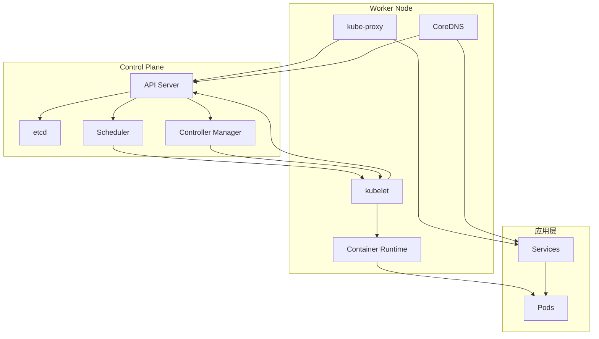

# Kubernetes 技术资料

本目录包含 Kubernetes 的核心技术资料，按照模块化的方式组织，便于学习和参考。

## 目录结构

### [知识体系](./knowledge/)

#### [01-核心概念](./knowledge/01-core-concepts/)
- [Kubernetes 核心概念](./knowledge/01-core-concepts/README.md) - 基础概念、整体架构图和组件基础信息

#### [02-架构详解](./knowledge/02-architecture/)
- [架构概览](./knowledge/02-architecture/README.md) - 整体架构交互和组件关系
- [API Server](./knowledge/02-architecture/api-server.md) - 集群统一入口，认证授权、准入控制
- [etcd](./knowledge/02-architecture/etcd.md) - 分布式键值存储，Raft 共识算法
- [Scheduler](./knowledge/02-architecture/scheduler.md) - Pod 调度器，调度算法和策略
- [Controller Manager](./knowledge/02-architecture/controller-manager.md) - 控制器管理器，控制器模式
- [kubelet](./knowledge/02-architecture/kubelet.md) - 节点代理，Pod 生命周期管理
- [kube-proxy](./knowledge/02-architecture/kube-proxy.md) - 网络代理，服务发现和负载均衡
- [Container Runtime](./knowledge/02-architecture/container-runtime.md) - 容器运行时，CRI 接口
- [CoreDNS](./knowledge/02-architecture/coredns.md) - 集群 DNS 服务，服务发现

## 技术特点

### 架构设计
- **微服务架构**: 各组件职责单一，松耦合设计
- **声明式 API**: 用户声明期望状态，系统自动协调
- **控制器模式**: 持续监控和调节系统状态
- **插件化扩展**: 支持 CRI、CNI、CSI 等接口扩展

### 核心能力
- **容器编排**: 自动化部署、扩缩和管理容器
- **服务发现**: 内置 DNS 和服务注册发现
- **负载均衡**: 多种负载均衡策略和会话保持
- **存储编排**: 持久化存储的动态供应和管理
- **网络管理**: 容器网络的自动配置和策略控制

### 可靠性保障
- **高可用**: 多副本部署和故障自动转移
- **弹性伸缩**: 基于指标的自动扩缩容
- **滚动更新**: 零停机的应用更新和回滚
- **健康检查**: 多层次的健康监测和自愈机制

## 组件交互图

## 核心概念速览

| 概念 | 作用 | 特点 |
|------|------|------|
| **Pod** | 最小部署单元 | 包含一个或多个容器，共享网络和存储 |
| **Service** | 服务抽象 | 提供稳定的网络端点和负载均衡 |
| **Deployment** | 部署管理 | 声明式更新，滚动发布，版本控制 |
| **Namespace** | 资源隔离 | 逻辑分组，权限控制，资源配额 |
| **ConfigMap** | 配置管理 | 非敏感配置数据的存储和注入 |
| **Secret** | 密钥管理 | 敏感信息的安全存储和使用 |
| **Volume** | 存储管理 | 持久化数据存储和共享 |

## 学习建议

### 学习路径
1. **基础概念** - 理解 Kubernetes 的基本概念和设计理念
2. **架构原理** - 深入学习各组件的工作原理和交互方式
3. **实践操作** - 通过实际部署和操作加深理解
4. **高级特性** - 学习网络、存储、安全等高级功能
5. **生产运维** - 掌握监控、故障排除和性能优化

### 重点关注
- **API Server** - 作为集群入口，理解其认证授权机制
- **etcd** - 作为数据存储，理解其一致性保证
- **Scheduler** - 理解调度算法和资源分配策略
- **kubelet** - 理解 Pod 生命周期和容器管理
- **网络模型** - 理解 Service、Endpoint 和 DNS 解析

## 相关技术

### 容器技术
- **Docker** - 容器化平台
- **containerd** - 容器运行时
- **CRI-O** - OCI 兼容的容器运行时

### 网络技术
- **CNI** - 容器网络接口
- **Flannel** - 简单的覆盖网络
- **Calico** - 网络策略和路由
- **Cilium** - 基于 eBPF 的网络和安全

### 存储技术
- **CSI** - 容器存储接口
- **Persistent Volumes** - 持久化存储
- **Storage Classes** - 动态存储供应

### 监控技术
- **Prometheus** - 指标收集和告警
- **Grafana** - 可视化仪表板
- **Jaeger** - 分布式链路追踪
- **Fluentd** - 日志收集和转发

## 扩展阅读

- [Kubernetes 官方文档](https://kubernetes.io/docs/)
- [CNCF 项目](https://www.cncf.io/projects/)
- [Kubernetes SIGs](https://github.com/kubernetes/community/blob/master/sig-list.md)
- [云原生技术栈](https://landscape.cncf.io/)
