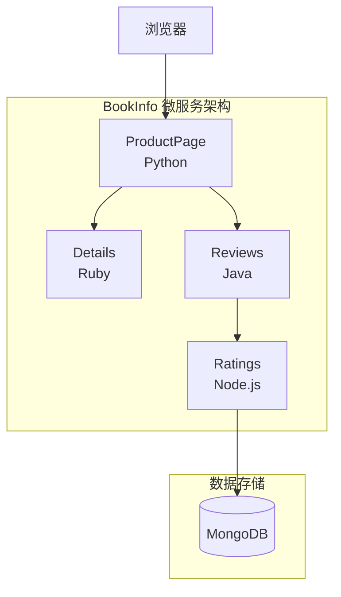
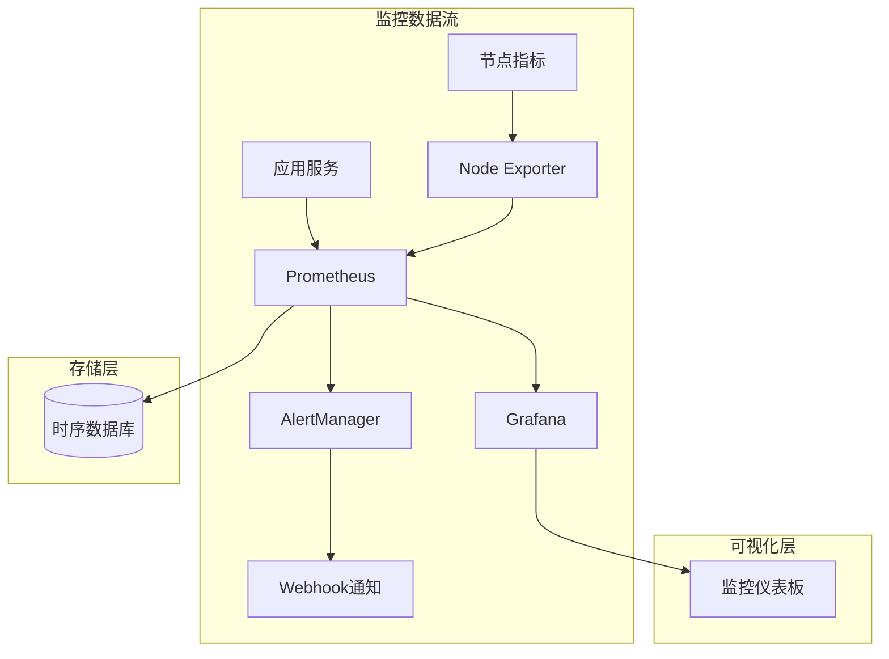
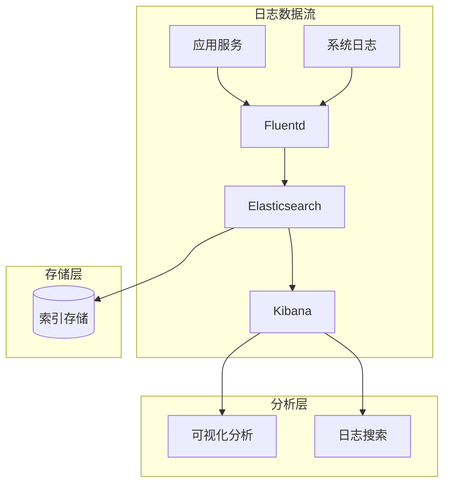

# Kubernetes 官方示例集合

## 一键体验

```bash
# 获取所有官方示例
./scripts/fetch-examples.sh

# 部署示例环境
./scripts/deploy-examples.sh

# 运行指定示例
./scripts/run-examples.sh bookinfo

# 清理环境
./scripts/cleanup-examples.sh
```

## 支持的示例

| 示例名称 | 类型 | 说明 | 运行时间 | 访问方式 |
|---------|------|------|---------|---------|
| bookinfo | 微服务 | 图书信息应用，展示微服务架构 | 5分钟 | http://localhost:9080 |
| helloworld | 基础 | Hello World应用，最简单的部署示例 | 1分钟 | http://localhost:5000 |
| httpbin | 网络测试 | HTTP测试服务，用于网络调试 | 2分钟 | http://localhost:8080 |
| nginx | Web服务 | Nginx Web服务器部署示例 | 2分钟 | http://localhost:8000 |
| mysql | 数据库 | MySQL数据库部署示例 | 3分钟 | localhost:3306 |
| redis | 缓存 | Redis缓存服务部署示例 | 2分钟 | localhost:6379 |
| monitoring | 监控 | Prometheus + Grafana监控栈 | 8分钟 | http://localhost:3000 |
| logging | 日志 | ELK日志收集和分析栈 | 10分钟 | http://localhost:5601 |

## 系统要求

### 硬件要求
- **CPU**: 最少2核，推荐4核
- **内存**: 最少4GB，推荐8GB
- **磁盘**: 最少10GB可用空间，推荐20GB
- **网络**: 可访问官方仓库和镜像仓库

### 软件要求
- **操作系统**: Linux/macOS/Windows 10+
- **Kubernetes**: 1.20+ (支持kind、minikube、Docker Desktop等)
- **kubectl**: 与集群版本兼容
- **工具**: curl, git, bash 4.0+

### 可选工具
- **Helm**: 3.0+ (用于复杂应用部署)
- **Docker**: 用于本地镜像构建
- **jq**: 用于JSON数据处理

## 快速开始

### 1. 环境检查
```bash
# 检查Kubernetes集群
kubectl cluster-info

# 检查节点状态
kubectl get nodes

# 检查工具版本
./scripts/check-prerequisites.sh
```

### 2. 部署基础示例
```bash
# 部署Hello World示例
./scripts/run-examples.sh helloworld

# 访问应用
curl http://localhost:5000
```

### 3. 部署复杂示例
```bash
# 部署BookInfo微服务应用
./scripts/run-examples.sh bookinfo

# 查看服务状态
kubectl get all -n examples

# 访问应用
open http://localhost:9080/productpage
```

## 示例详细说明

### BookInfo 微服务应用
BookInfo 是一个多语言微服务应用，展示了现代微服务架构的典型模式：



**特性展示**：
- 多语言服务通信
- 服务发现和负载均衡
- 分布式追踪
- 监控和日志收集

### 监控栈示例
完整的监控解决方案，包含指标收集、存储、可视化和告警：



**监控能力**：
- 集群资源监控
- 应用性能监控
- 自定义业务指标
- 告警和通知

### 日志收集栈示例
企业级日志收集、存储、搜索和分析解决方案：



**日志能力**：
- 多源日志收集
- 实时日志处理
- 全文搜索和分析
- 日志可视化和告警

## 脚本详细说明

### 环境检查脚本 (check-prerequisites.sh)
```bash
#!/bin/bash
# 检查运行环境和依赖

check_kubernetes() {
    if ! kubectl cluster-info >/dev/null 2>&1; then
        echo "❌ Kubernetes集群不可用"
        return 1
    fi
    echo "✅ Kubernetes集群正常"
}

check_resources() {
    local nodes=$(kubectl get nodes --no-headers | wc -l)
    local cpu=$(kubectl top nodes --no-headers | awk '{sum += $3} END {print sum}')
    local memory=$(kubectl top nodes --no-headers | awk '{sum += $5} END {print sum}')
    
    echo "📊 集群资源状态:"
    echo "   节点数量: ${nodes}"
    echo "   CPU使用: ${cpu}m"
    echo "   内存使用: ${memory}Mi"
}
```

### 示例获取脚本 (fetch-examples.sh)
```bash
#!/bin/bash
# 自动获取官方示例代码

fetch_kubernetes_examples() {
    local repo_url="https://github.com/kubernetes/examples.git"
    local target_dir="./official/kubernetes"
    
    if [[ -d "${target_dir}" ]]; then
        echo "🔄 更新Kubernetes官方示例..."
        git -C "${target_dir}" pull
    else
        echo "📥 获取Kubernetes官方示例..."
        git clone --depth 1 "${repo_url}" "${target_dir}"
    fi
}

fetch_istio_examples() {
    local repo_url="https://github.com/istio/istio.git"
    local target_dir="./official/istio"
    
    echo "📥 获取Istio官方示例..."
    git clone --depth 1 "${repo_url}" "${target_dir}"
    
    # 只保留samples目录
    mv "${target_dir}/samples" "./official/istio-samples"
    rm -rf "${target_dir}"
}
```

### 部署脚本 (deploy-examples.sh)
```bash
#!/bin/bash
# 自动部署官方示例

deploy_bookinfo() {
    echo "🚀 部署BookInfo微服务应用..."
    
    # 创建命名空间
    kubectl create namespace examples --dry-run=client -o yaml | kubectl apply -f -
    
    # 部署应用
    kubectl apply -f official/istio-samples/bookinfo/platform/kube/bookinfo.yaml -n examples
    
    # 等待部署完成
    kubectl wait --for=condition=available --timeout=300s deployment --all -n examples
    
    # 创建Gateway和VirtualService
    kubectl apply -f official/istio-samples/bookinfo/networking/bookinfo-gateway.yaml -n examples
    
    echo "✅ BookInfo部署完成"
    echo "🌐 访问地址: http://localhost:9080/productpage"
}

deploy_monitoring() {
    echo "🚀 部署监控栈..."
    
    # 使用Helm部署Prometheus
    helm repo add prometheus-community https://prometheus-community.github.io/helm-charts
    helm repo update
    
    helm install prometheus prometheus-community/kube-prometheus-stack \
        --namespace monitoring \
        --create-namespace \
        --set grafana.service.type=NodePort \
        --set prometheus.service.type=NodePort
    
    echo "✅ 监控栈部署完成"
    echo "🌐 Grafana访问: http://localhost:3000 (admin/prom-operator)"
}
```

### 运行脚本 (run-examples.sh)
```bash
#!/bin/bash
# 运行和测试官方示例

usage() {
    cat << EOF
用法: $0 <example_name> [action]

示例名称:
  bookinfo      - 图书信息微服务应用
  helloworld    - Hello World基础示例
  httpbin       - HTTP测试服务
  nginx         - Web服务器示例
  mysql         - MySQL数据库示例
  redis         - Redis缓存示例
  monitoring    - Prometheus监控栈
  logging       - ELK日志栈

操作:
  start         - 启动示例（默认）
  test          - 测试示例功能
  logs          - 查看示例日志
  status        - 查看示例状态
  stop          - 停止示例
EOF
}

start_example() {
    local example_name="$1"
    
    case "${example_name}" in
        "bookinfo")
            start_bookinfo
            setup_port_forward "productpage" 9080 9080
            ;;
        "helloworld")
            start_helloworld
            setup_port_forward "helloworld" 5000 5000
            ;;
        "httpbin")
            start_httpbin
            setup_port_forward "httpbin" 8080 8000
            ;;
        "monitoring")
            start_monitoring
            setup_monitoring_access
            ;;
        *)
            echo "❌ 不支持的示例: ${example_name}"
            usage
            return 1
            ;;
    esac
}

test_example() {
    local example_name="$1"
    
    case "${example_name}" in
        "bookinfo")
            test_bookinfo
            ;;
        "helloworld")
            test_helloworld
            ;;
        "httpbin")
            test_httpbin
            ;;
        *)
            echo "⚠️  暂不支持测试示例: ${example_name}"
            ;;
    esac
}
```

### 清理脚本 (cleanup-examples.sh)
```bash
#!/bin/bash
# 清理示例环境

cleanup_all() {
    echo "🧹 清理所有示例资源..."
    
    # 删除examples命名空间
    if kubectl get namespace examples >/dev/null 2>&1; then
        kubectl delete namespace examples --timeout=60s
    fi
    
    # 删除monitoring命名空间
    if kubectl get namespace monitoring >/dev/null 2>&1; then
        helm uninstall prometheus -n monitoring || true
        kubectl delete namespace monitoring --timeout=60s
    fi
    
    # 停止所有端口转发
    pkill -f "kubectl port-forward" || true
    
    # 清理本地文件
    rm -rf ./official/
    
    echo "✅ 清理完成"
}

cleanup_single() {
    local example_name="$1"
    
    echo "🧹 清理示例: ${example_name}"
    
    # 删除相关资源
    kubectl delete all,configmap,secret,ingress,networkpolicy \
        -l app="${example_name}" -n examples --ignore-not-found=true
    
    # 停止相关端口转发
    pkill -f "kubectl port-forward.*${example_name}" || true
    
    echo "✅ ${example_name} 清理完成"
}
```

## 示例配置文件

### 示例列表配置 (configs/examples-list.yaml)
```yaml
examples:
  - name: bookinfo
    type: microservice
    description: "多语言微服务应用示例"
    source:
      type: git
      url: "https://github.com/istio/istio.git"
      path: "samples/bookinfo"
      branch: "master"
    requirements:
      cpu: "2"
      memory: "4Gi"
      storage: "10Gi"
    ports:
      - name: "productpage"
        port: 9080
        targetPort: 9080
    healthCheck:
      path: "/health"
      port: 9080
    tags: ["microservice", "demo", "istio"]

  - name: helloworld
    type: basic
    description: "最简单的Hello World应用"
    source:
      type: git
      url: "https://github.com/kubernetes/examples.git"
      path: "hello-world"
      branch: "master"
    requirements:
      cpu: "100m"
      memory: "128Mi"
      storage: "1Gi"
    ports:
      - name: "http"
        port: 5000
        targetPort: 5000
    healthCheck:
      path: "/"
      port: 5000
    tags: ["basic", "demo", "beginner"]

  - name: monitoring
    type: stack
    description: "Prometheus + Grafana监控栈"
    source:
      type: helm
      repository: "https://prometheus-community.github.io/helm-charts"
      chart: "kube-prometheus-stack"
      version: "latest"
    requirements:
      cpu: "4"
      memory: "8Gi"
      storage: "50Gi"
    ports:
      - name: "grafana"
        port: 3000
        targetPort: 3000
      - name: "prometheus"
        port: 9090
        targetPort: 9090
    healthCheck:
      path: "/api/health"
      port: 3000
    tags: ["monitoring", "prometheus", "grafana"]
```

### 环境配置 (configs/environment.yaml)
```yaml
environment:
  cluster:
    name: "examples-cluster"
    provider: "kind"  # kind, minikube, docker-desktop, gke, eks, aks
    
  namespace:
    examples: "examples"
    monitoring: "monitoring"
    logging: "logging"
    
  resources:
    limits:
      cpu: "8"
      memory: "16Gi"
      storage: "100Gi"
    requests:
      cpu: "2"
      memory: "4Gi"
      storage: "20Gi"
      
  network:
    portRange: "30000-32767"
    loadBalancer: false
    ingress: false
    
  storage:
    storageClass: "standard"
    persistent: false
    
  security:
    rbac: true
    networkPolicies: false
    podSecurityStandards: "baseline"
```

## 故障排除

### 常见问题

#### 1. 集群资源不足
```bash
# 检查资源使用情况
kubectl top nodes
kubectl top pods --all-namespaces

# 清理未使用的资源
kubectl delete pods --field-selector=status.phase=Succeeded --all-namespaces
kubectl delete pods --field-selector=status.phase=Failed --all-namespaces
```

#### 2. 镜像拉取失败
```bash
# 使用国内镜像源
export REGISTRY_MIRROR="registry.cn-hangzhou.aliyuncs.com"

# 手动拉取镜像
docker pull ${REGISTRY_MIRROR}/library/nginx:latest
docker tag ${REGISTRY_MIRROR}/library/nginx:latest nginx:latest
```

#### 3. 端口冲突
```bash
# 查看端口占用
netstat -tulpn | grep :8080

# 使用不同端口
kubectl port-forward service/my-service 8081:8080
```

#### 4. 权限问题
```bash
# 检查当前用户权限
kubectl auth can-i create pods

# 创建管理员角色绑定
kubectl create clusterrolebinding my-admin --clusterrole=cluster-admin --user=$(whoami)
```

### 调试技巧

#### 1. 查看详细日志
```bash
# 查看Pod日志
kubectl logs -f deployment/my-app -n examples

# 查看事件
kubectl get events --sort-by=.metadata.creationTimestamp -n examples

# 描述资源状态
kubectl describe pod my-pod -n examples
```

#### 2. 网络调试
```bash
# 测试Pod间连通性
kubectl exec -it pod1 -- ping pod2

# 测试服务访问
kubectl exec -it pod1 -- curl http://my-service:8080

# 查看DNS解析
kubectl exec -it pod1 -- nslookup my-service
```

#### 3. 资源调试
```bash
# 查看资源配额
kubectl describe quota -n examples

# 查看限制范围
kubectl describe limitrange -n examples

# 查看节点条件
kubectl describe nodes
```

## 最佳实践

### 1. 环境隔离
- 使用独立的命名空间运行示例
- 设置适当的资源配额和限制
- 避免与生产环境资源冲突

### 2. 资源管理
- 及时清理不需要的示例资源
- 监控集群资源使用情况
- 使用标签和选择器管理资源

### 3. 安全考虑
- 不在生产集群运行示例
- 使用最小权限原则
- 定期更新示例和依赖

### 4. 网络配置
- 使用NodePort或端口转发访问服务
- 避免直接暴露敏感服务
- 配置适当的网络策略

## 扩展使用

### 1. 自定义示例
```bash
# 添加自定义示例到配置文件
vim configs/examples-list.yaml

# 实现自定义部署逻辑
vim scripts/deploy-custom.sh
```

### 2. 集成开发环境
```bash
# 在开发环境中运行示例
./scripts/run-examples.sh --env=development

# 挂载本地代码目录
./scripts/run-examples.sh --mount-source=/path/to/code
```

### 3. CI/CD集成
```bash
# 在CI/CD流水线中使用
./scripts/fetch-examples.sh
./scripts/deploy-examples.sh --test-mode
./scripts/run-tests.sh
./scripts/cleanup-examples.sh
```

## 相关资源

### 官方示例仓库
- [Kubernetes Examples](https://github.com/kubernetes/examples)
- [Istio Samples](https://github.com/istio/istio/tree/master/samples)
- [Helm Charts](https://github.com/helm/charts)

### 学习资源
- [Kubernetes Tutorials](https://kubernetes.io/docs/tutorials/)
- [Play with Kubernetes](https://labs.play-with-k8s.com/)
- [Katacoda Kubernetes](https://www.katacoda.com/courses/kubernetes)

### 工具和平台
- [Kind](https://kind.sigs.k8s.io/) - Docker中的Kubernetes
- [Minikube](https://minikube.sigs.k8s.io/) - 本地Kubernetes集群
- [K3s](https://k3s.io/) - 轻量级Kubernetes
