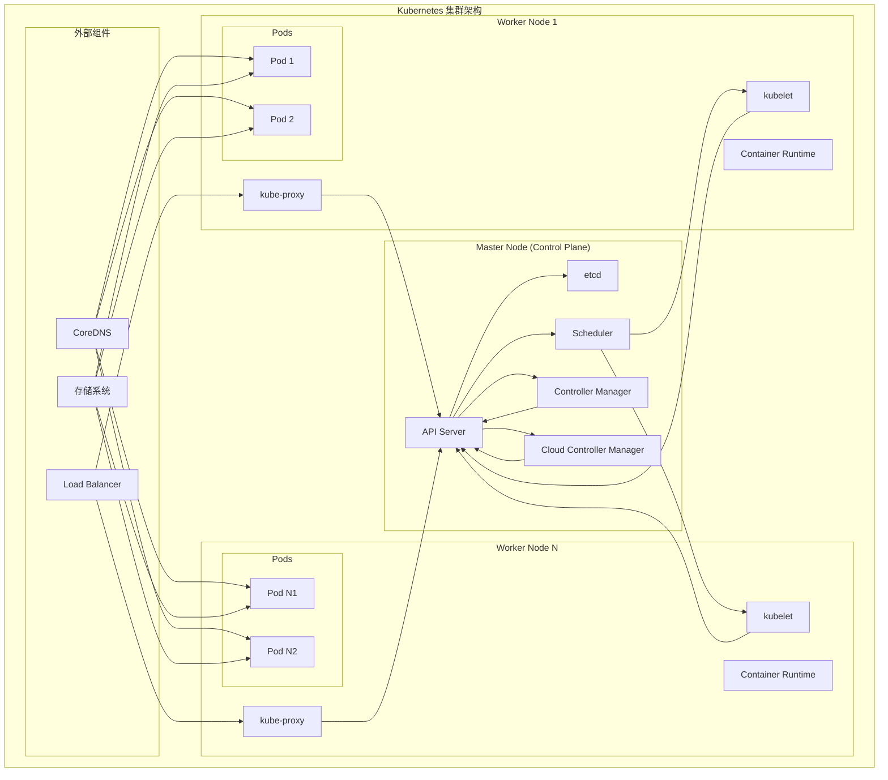

# Kubernetes 核心概念

## 概述

Kubernetes (K8s) 是一个开源的容器编排平台，用于自动化部署、扩缩和管理容器化应用程序。它提供了一个完整的容器集群管理系统，能够在多个主机上运行容器化应用。

## 整体架构图



## 核心组件

### Control Plane 组件

#### 1. API Server
- **作用**: Kubernetes 集群的前端，所有 REST 命令都要通过它处理
- **功能**: 
  - 提供 RESTful API 接口
  - 身份验证和授权
  - 准入控制
  - API 对象的 CRUD 操作

#### 2. etcd
- **作用**: 一致性和高可用的键值数据库，保存整个集群的状态信息
- **功能**:
  - 存储集群配置数据
  - 存储 API 对象状态
  - 提供分布式锁服务
  - 服务发现

#### 3. Scheduler
- **作用**: 负责资源的调度，按照预定的调度策略将 Pod 调度到相应的机器上
- **功能**:
  - Pod 调度决策
  - 资源需求评估
  - 节点可用性检查
  - 调度策略执行

#### 4. Controller Manager
- **作用**: 负责维护集群的状态，比如故障检测、自动扩展、滚动更新等
- **功能**:
  - 节点控制器：负责在节点出现故障时进行通知和响应
  - 副本控制器：负责为系统中的每个副本控制器对象维护正确数量的 Pod
  - 端点控制器：填充端点（Endpoints）对象
  - 服务账户和令牌控制器：为新的命名空间创建默认账户和 API 访问令牌

#### 5. Cloud Controller Manager
- **作用**: 云控制器管理器是指嵌入特定云的控制逻辑的控制平面组件
- **功能**:
  - 节点控制器：用于在节点终止响应后检查云提供商以确定节点是否已被删除
  - 路由控制器：用于在底层云基础架构中设置路由
  - 服务控制器：用于创建、更新和删除云提供商负载均衡器

### Node 组件

#### 1. kubelet
- **作用**: 主要的节点代理，它会监视已分配给节点的 Pod
- **功能**:
  - Pod 生命周期管理
  - 容器健康检查
  - 资源监控
  - 与 API Server 通信

#### 2. kube-proxy
- **作用**: 网络代理，运行在集群中每个节点上，维护节点上的网络规则
- **功能**:
  - 服务发现
  - 负载均衡
  - 网络规则维护
  - 流量转发

#### 3. Container Runtime
- **作用**: 负责运行容器的软件
- **支持的运行时**:
  - Docker
  - containerd
  - CRI-O
  - 任何实现 Kubernetes CRI (容器运行时接口) 的软件

### 插件组件

#### 1. DNS
- **作用**: 为 Kubernetes 服务提供 DNS 记录
- **实现**: CoreDNS

#### 2. Web 界面（仪表盘）
- **作用**: Kubernetes 集群的通用的基于 Web 的 UI
- **功能**: 集群管理和故障排除

#### 3. 容器资源监控
- **作用**: 将关于容器的一些常见的时间序列度量值保存到一个集中的数据库中
- **实现**: Prometheus、Grafana

#### 4. 集群层面日志
- **作用**: 负责将容器的日志数据保存到一个集中的日志存储中
- **实现**: Elasticsearch、Fluentd、Kibana (EFK 堆栈)

## 基本概念

### Pod
- **定义**: Kubernetes 中最小的部署单元，包含一个或多个容器
- **特点**: 
  - 共享网络和存储
  - 生命周期一致
  - 原子性调度单元

### Service
- **定义**: 定义了一种访问 Pod 的策略，通常通过 Label Selector 来访问
- **类型**:
  - ClusterIP：集群内部访问
  - NodePort：通过节点端口访问
  - LoadBalancer：通过云提供商的负载均衡器访问
  - ExternalName：通过 DNS 映射访问

### Deployment
- **定义**: 为 Pod 和 ReplicaSet 提供声明式的更新能力
- **功能**:
  - 滚动更新
  - 回滚
  - 暂停和恢复
  - 扩缩容

### Namespace
- **定义**: 在物理集群的基础上提供虚拟集群，用于多租户环境
- **作用**:
  - 资源隔离
  - 权限控制
  - 资源配额管理

### ConfigMap 和 Secret
- **ConfigMap**: 用来保存非机密性的配置信息
- **Secret**: 用来保存机密性的配置信息，如密码、OAuth 令牌和 SSH 密钥

### Volume
- **定义**: Pod 中能够被多个容器访问的共享目录
- **类型**:
  - emptyDir：临时存储
  - hostPath：挂载主机目录
  - persistentVolumeClaim：持久化存储声明
  - configMap：配置文件挂载
  - secret：密钥文件挂载

## 工作流程

```mermaid
sequenceDiagram
    participant User as 用户
    participant API as API Server
    participant ETCD as etcd
    participant SCH as Scheduler
    participant KUBELET as kubelet
    participant RUNTIME as Container Runtime

    User->>API: 提交 Pod 创建请求
    API->>ETCD: 验证并存储 Pod 规格
    API->>SCH: 通知新 Pod 需要调度
    SCH->>API: 查询节点信息
    API->>ETCD: 获取节点状态
    ETCD->>API: 返回节点信息
    API->>SCH: 返回节点信息
    SCH->>API: 提交调度决策
    API->>ETCD: 更新 Pod 绑定信息
    KUBELET->>API: 获取 Pod 规格
    API->>KUBELET: 返回 Pod 规格
    KUBELET->>RUNTIME: 创建容器
    RUNTIME->>KUBELET: 返回容器状态
    KUBELET->>API: 报告 Pod 状态
    API->>ETCD: 更新 Pod 状态
