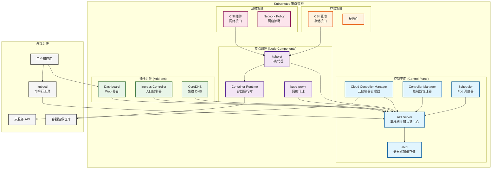
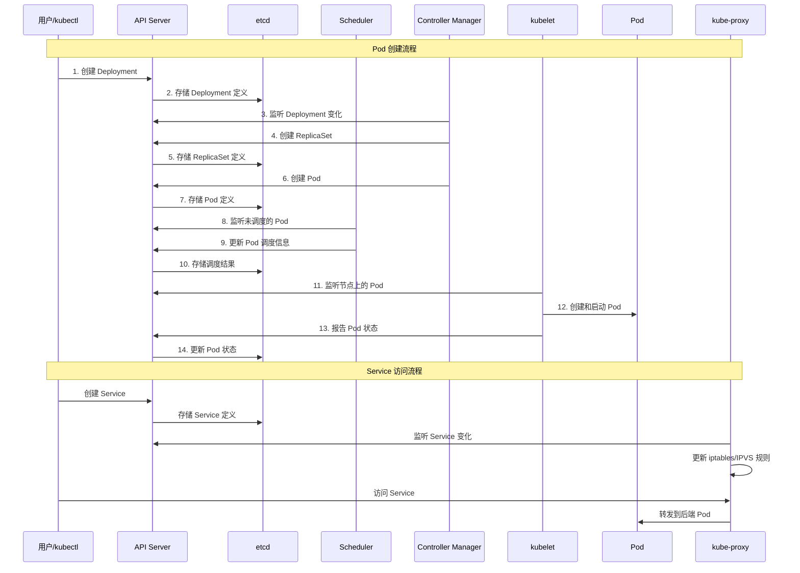
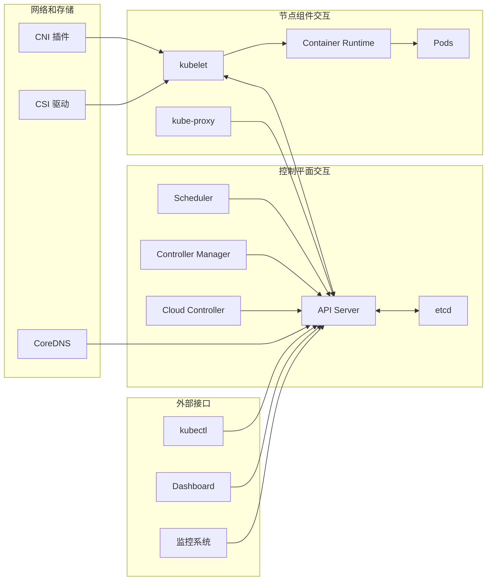
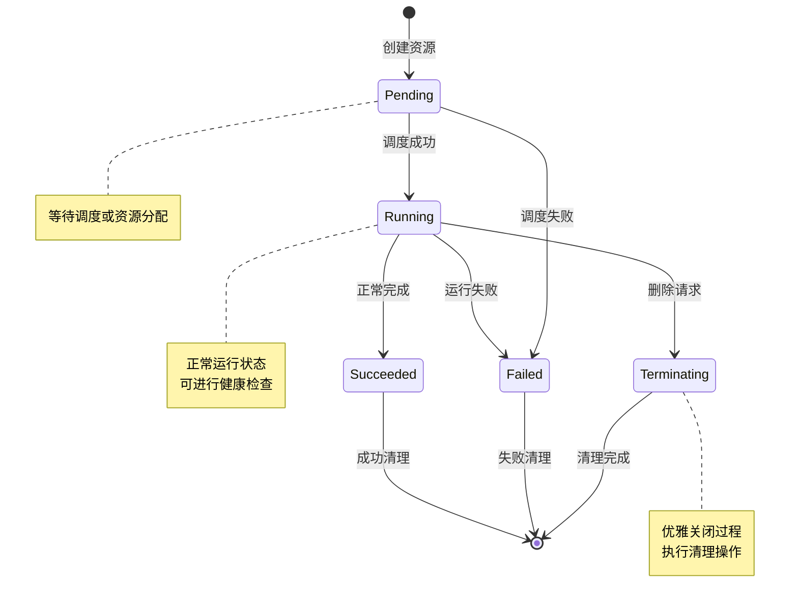

# Kubernetes 核心概念

## 项目概述

Kubernetes 是一个开源的容器编排平台，用于自动化部署、扩展和管理容器化应用程序。它提供了一个可移植、可扩展的平台，用于管理容器化的工作负载和服务，促进了声明式配置和自动化。

## 核心价值

Kubernetes 解决了以下主要问题：

- **容器编排复杂性**：简化了大规模容器应用的部署和管理
- **应用可移植性**：提供了跨云和本地环境的统一抽象层
- **资源利用效率**：通过智能调度和自动扩缩容优化资源使用
- **服务可靠性**：内置故障恢复、健康检查和自愈能力
- **运维自动化**：减少手动运维工作，提高系统稳定性

## 整体架构图

## 组件分类

### 控制平面组件
负责集群的全局决策（如调度）和检测及响应集群事件

### 节点组件
在每个节点上运行，维护运行的 Pod 并提供 Kubernetes 运行环境

### 插件组件
实现集群功能的可选组件，通常以 Pod 形式运行

### 存储系统
提供持久化存储抽象和管理能力

### 网络系统
实现集群网络通信和策略控制

## 概念索引表格

| 概念/资源名称 | 功能描述 | 作用域/适用场景 | 详细文档链接 |
|--------------|----------|-----------------|-------------|
| **工作负载资源** |
| Pod | Kubernetes 最小部署单元，包含一个或多个容器 | 命名空间级/所有应用场景 | [Pod 详解](./pod.md) |
| Deployment | 无状态应用的声明式部署和管理 | 命名空间级/无状态应用 | [Deployment 详解](./deployment.md) |
| ReplicaSet | 确保指定数量的 Pod 副本运行 | 命名空间级/副本管理 | [ReplicaSet 详解](./replicaset.md) |
| StatefulSet | 有状态应用的部署，提供稳定标识和存储 | 命名空间级/有状态应用 | [StatefulSet 详解](./statefulset.md) |
| DaemonSet | 确保每个节点运行特定 Pod 副本 | 命名空间级/系统服务 | [DaemonSet 详解](./daemonset.md) |
| Job | 运行一次性任务到完成 | 命名空间级/批处理任务 | [Job 详解](./job.md) |
| CronJob | 基于时间调度的定时任务 | 命名空间级/定时任务 | [CronJob 详解](./cronjob.md) |
| **服务发现和负载均衡** |
| Service | 提供稳定的网络端点和负载均衡 | 命名空间级/服务暴露 | [Service 详解](./service.md) |
| Ingress | HTTP/HTTPS 路由和外部访问控制 | 命名空间级/外部访问 | [Ingress 详解](./ingress.md) |
| Endpoints | 服务端点的动态维护 | 命名空间级/服务发现 | [Endpoints 详解](./endpoints.md) |
| **配置和存储** |
| ConfigMap | 非敏感配置数据的存储和管理 | 命名空间级/配置管理 | [ConfigMap 详解](./configmap.md) |
| Secret | 敏感信息的安全存储和访问控制 | 命名空间级/敏感数据 | [Secret 详解](./secret.md) |
| Volume | Pod 内容器间数据共享和持久化 | Pod 级/数据存储 | [Volume 详解](./volume.md) |
| PersistentVolume | 集群级持久化存储资源 | 集群级/持久存储 | [PersistentVolume 详解](./persistentvolume.md) |
| PersistentVolumeClaim | 用户对存储资源的申请 | 命名空间级/存储申请 | [PersistentVolumeClaim 详解](./persistentvolumeclaim.md) |
| StorageClass | 动态存储供应和管理 | 集群级/存储类型 | [StorageClass 详解](./storageclass.md) |
| **安全和访问控制** |
| ServiceAccount | Pod 身份标识和 API 访问控制 | 命名空间级/身份认证 | [ServiceAccount 详解](./serviceaccount.md) |
| Role/ClusterRole | 权限定义和资源操作控制 | 命名空间级/集群级 | [Role 详解](./role.md) |
| RoleBinding/ClusterRoleBinding | 权限与用户/组的绑定关系 | 命名空间级/集群级 | [RoleBinding 详解](./rolebinding.md) |
| NetworkPolicy | 网络访问控制和微分段安全 | 命名空间级/网络安全 | [NetworkPolicy 详解](./networkpolicy.md) |
| **集群管理** |
| Namespace | 资源隔离和多租户管理 | 集群级/资源组织 | [Namespace 详解](./namespace.md) |
| Node | 集群工作节点的管理和维护 | 集群级/节点管理 | [Node 详解](./node.md) |
| LimitRange | 资源使用限制和默认值设置 | 命名空间级/资源控制 | [LimitRange 详解](./limitrange.md) |
| ResourceQuota | 资源配额和使用限制 | 命名空间级/配额管理 | [ResourceQuota 详解](./resourcequota.md) |
| PriorityClass | Pod 优先级定义和调度控制 | 集群级/调度优先级 | [PriorityClass 详解](./priorityclass.md) |
| PodDisruptionBudget | Pod 中断预算和可用性保证 | 命名空间级/高可用 | [PodDisruptionBudget 详解](./poddisruptionbudget.md) |

## 核心工作流程图

## 组件交互关系图

## 资源生命周期管理

## 核心概念说明

### 1. 声明式 API
- **特性**：描述期望状态而非执行步骤
- **优势**：简化操作、支持版本控制、便于自动化
- **实现**：通过 YAML/JSON 定义资源规格

### 2. 控制器模式
- **工作原理**：监听 API 对象变化，持续协调状态
- **核心流程**：观察 → 分析 → 行动
- **容错机制**：自动重试和故障恢复

### 3. 标签和选择器
- **标签**：键值对形式的元数据标识
- **选择器**：基于标签的查询和匹配机制
- **作用**：实现资源的松耦合关联

### 4. 服务发现机制
- **DNS 解析**：自动解析服务名称到 IP 地址
- **环境变量**：向 Pod 注入服务信息
- **API 查询**：动态查询服务端点信息

### 5. 资源管理模型
- **请求 (Requests)**：Pod 运行的最小资源需求
- **限制 (Limits)**：Pod 可使用的最大资源量
- **服务质量等级**：Guaranteed、Burstable、BestEffort

## 最佳实践要点

### 资源命名和组织
- 使用一致的命名规范
- 合理使用命名空间进行资源隔离
- 通过标签建立资源关联关系

### 配置管理
- 配置与代码分离
- 敏感信息使用 Secret 存储
- 使用 ConfigMap 管理应用配置

### 安全性
- 启用 RBAC 权限控制
- 最小权限原则
- 定期更新和安全扫描

### 可靠性
- 多副本部署
- 健康检查配置
- 资源限制设置
- 故障恢复机制

## 相关概念

本章节的核心概念与以下架构和工作原理密切相关：

- **[系统架构](../02-architecture/README.md)**：了解各组件的架构设计和交互关系
- **[工作原理](../03-working-principles/README.md)**：深入理解核心机制的实现原理
- **[最佳实践](../07-best-practices/README.md)**：学习生产环境的配置和使用建议

## 参考资料

### 官方文档
- [Kubernetes 概念](https://kubernetes.io/docs/concepts/)
- [API 对象](https://kubernetes.io/docs/concepts/overview/working-with-objects/kubernetes-objects/)
- [工作负载](https://kubernetes.io/docs/concepts/workloads/)

### 深入学习资源
- [Kubernetes 官方教程](https://kubernetes.io/docs/tutorials/)
- [CNCF 云原生技术栈](https://landscape.cncf.io/)
- [Kubernetes 设计文档](https://github.com/kubernetes/community/tree/master/contributors/design-proposals)

### 社区最佳实践
- [12-Factor App](https://12factor.net/)
- [Kubernetes 生产最佳实践](https://kubernetes.io/docs/setup/best-practices/)
- [CNCF 云原生安全白皮书](https://github.com/cncf/sig-security/blob/master/security-whitepaper/cloud-native-security-whitepaper.md)
