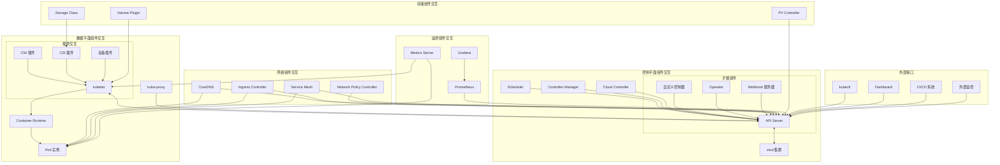
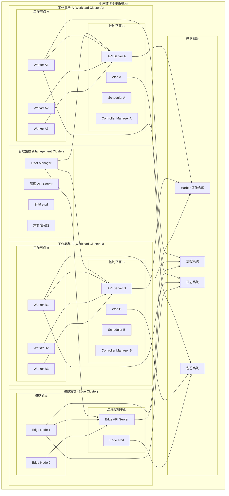
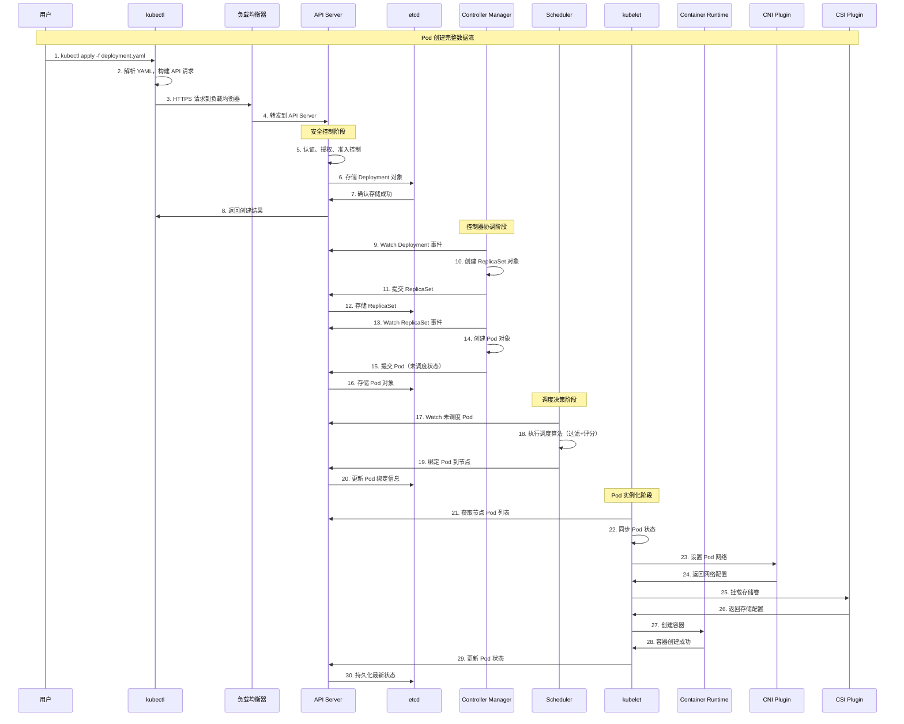
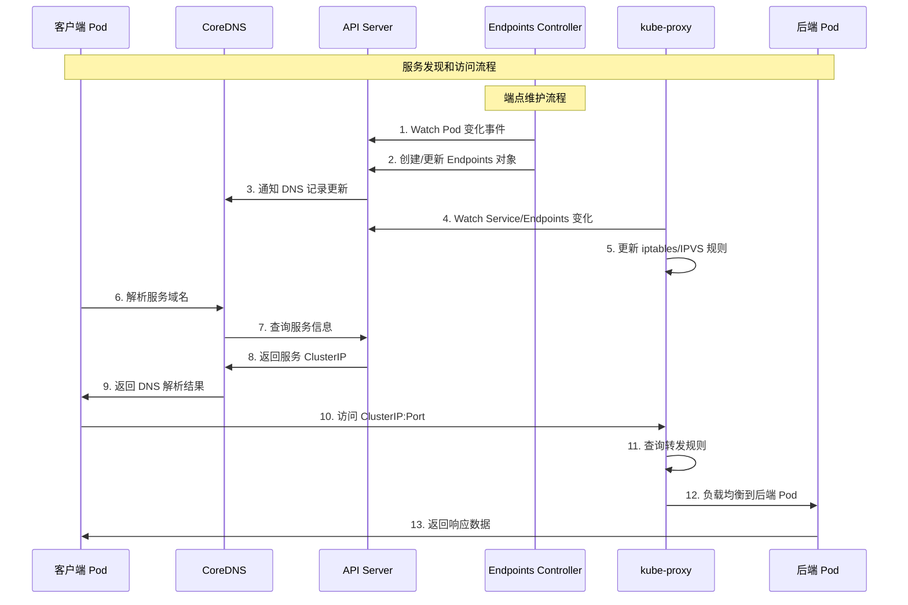
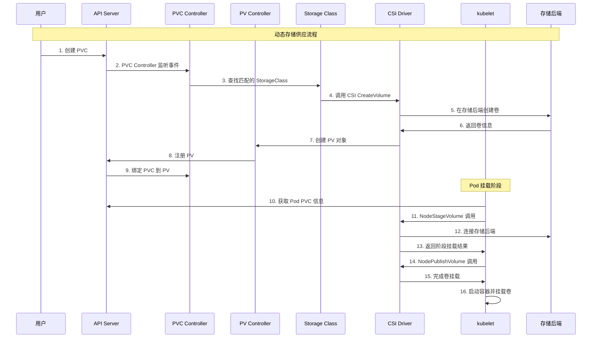
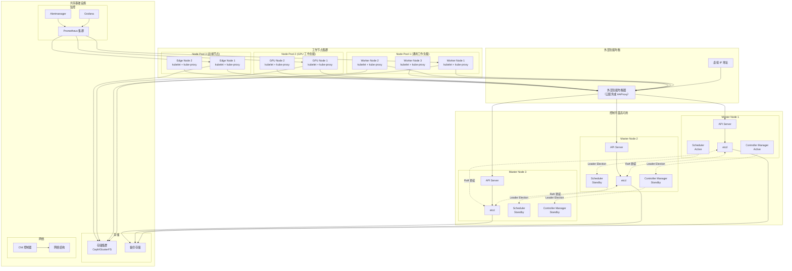
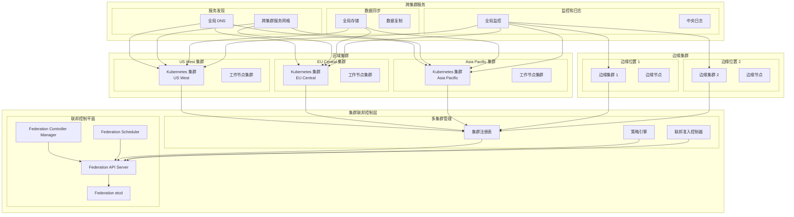

# Kubernetes 系统架构

## 设计理念

Kubernetes 采用了分布式、微服务化和声明式的架构设计理念，通过控制器模式和插件化架构实现了高度自动化的容器编排平台。

### 核心设计思想
- **声明式 API**：用户描述期望状态，系统自动协调实现
- **分离关注点**：控制平面与数据平面职责分离
- **可扩展架构**：通过标准接口支持插件化扩展
- **最终一致性**：分布式系统的状态收敛模型

### 设计原则
- **单一职责**：每个组件职责明确，功能专一
- **松耦合**：组件间通过标准接口交互
- **高可用**：无单点故障，支持故障自动恢复
- **水平扩展**：支持大规模集群部署

## 架构演进

### v1.0-v1.5: 基础架构期 (2015-2017)
- **里程碑**：建立核心 API 对象模型和基础架构
- **主要特性**：
  - 确立 Pod、Service、ReplicaSet 等核心概念
  - 实现基本的调度和服务发现机制
  - 引入 RBAC 安全模型
- **技术决策**：选择 etcd 作为数据存储，采用控制器模式

### v1.6-v1.12: 功能完善期 (2017-2018)
- **里程碑**：引入标准化接口和增强功能
- **主要特性**：
  - 引入 CRI、CNI、CSI 接口标准
  - 支持自定义资源定义 (CRD)
  - 增强网络和存储功能
  - 改进调度器算法
- **技术决策**：插件化架构，生态系统开放化

### v1.13-v1.18: 稳定性提升期 (2019-2020)
- **里程碑**：企业级特性和稳定性增强
- **主要特性**：
  - 优化大规模集群性能
  - 增强安全性和可观测性
  - 支持 Windows 容器
  - 改进资源管理和调度
- **技术决策**：性能优化和企业级功能强化

### v1.19-至今: 云原生深化期 (2020-)
- **里程碑**：云原生生态深度集成
- **主要特性**：
  - 增强边缘计算支持
  - 优化资源管理和调度效率
  - 深化云原生生态集成
  - 支持 Serverless 工作负载
- **技术决策**：云原生标准化和智能化运维

## 关键架构特点

### 分布式架构
- **水平扩展能力**：支持数千节点的大规模集群
- **无单点故障**：所有组件都支持高可用部署
- **地理分布**：支持跨地域的集群部署
- **网络容错**：能够处理网络分区和延迟

### 声明式模型
- **期望状态管理**：用户声明期望的最终状态
- **自动协调**：系统持续协调实际状态与期望状态
- **幂等操作**：相同操作执行多次结果一致
- **版本控制**：支持配置的版本管理和回滚

### 插件化生态
- **标准接口**：CRI、CNI、CSI 等标准化接口
- **可扩展性**：支持自定义控制器和 CRD
- **生态丰富**：庞大的插件和工具生态系统
- **厂商中立**：不绑定特定技术栈或云厂商

## 整体架构图

### 系统分层架构

```mermaid
graph TB
    subgraph "用户接口层 (User Interface Layer)"
        KUBECTL[kubectl CLI]
        DASHBOARD[Kubernetes Dashboard]
        API_CLIENT[API 客户端]
        HELM[Helm/Operator]
        IDE[IDE 集成]
    end
    
    subgraph "API 网关层 (API Gateway Layer)"
        subgraph "负载均衡"
            EXT_LB[外部负载均衡器]
            INT_LB[内部负载均衡器]
        end
        subgraph "API 服务"
            API_SERVER[API Server]
            API_AGGREGATOR[API 聚合器]
            WEBHOOK[Webhook 服务器]
        end
    end
    
    subgraph "控制平面 (Control Plane)"
        subgraph "核心控制器"
            SCHEDULER[调度器 (Scheduler)]
            CONTROLLER_MANAGER[控制器管理器]
            CLOUD_CONTROLLER[云控制器管理器]
        end
        subgraph "数据存储"
            ETCD_CLUSTER[etcd 集群]
            BACKUP_SYSTEM[备份系统]
        end
        subgraph "扩展控制器"
            CUSTOM_CONTROLLER[自定义控制器]
            OPERATOR[Operator]
            CRD_CONTROLLER[CRD 控制器]
        end
    end
    
    subgraph "数据平面 (Data Plane)"
        subgraph "节点代理"
            KUBELET[kubelet]
            KUBE_PROXY[kube-proxy]
        end
        subgraph "容器运行时"
            CONTAINER_RUNTIME[容器运行时]
            POD_SANDBOX[Pod 沙箱]
            CONTAINER[容器实例]
        end
        subgraph "网络插件"
            CNI_PLUGIN[CNI 插件]
            NETWORK_DRIVER[网络驱动]
            LOAD_BALANCER[负载均衡器]
        end
        subgraph "存储插件"
            CSI_PLUGIN[CSI 插件]
            VOLUME_DRIVER[存储驱动]
            PERSISTENT_VOLUME[持久卷]
        end
    end
    
    subgraph "基础设施层 (Infrastructure Layer)"
        subgraph "计算资源"
            PHYSICAL_NODES[物理节点]
            VIRTUAL_MACHINES[虚拟机]
            CLOUD_INSTANCES[云实例]
        end
        subgraph "网络基础设施"
            NETWORK_FABRIC[网络结构]
            SDN[软件定义网络]
            FIREWALL[防火墙]
        end
        subgraph "存储基础设施"
            BLOCK_STORAGE[块存储]
            OBJECT_STORAGE[对象存储]
            FILE_STORAGE[文件存储]
        end
    end
    
    %% 用户接口层连接
    KUBECTL --> EXT_LB
    DASHBOARD --> EXT_LB
    API_CLIENT --> EXT_LB
    HELM --> EXT_LB
    IDE --> EXT_LB
    
    %% API 网关层连接
    EXT_LB --> API_SERVER
    INT_LB --> API_SERVER
    API_SERVER --> API_AGGREGATOR
    API_SERVER --> WEBHOOK
    
    %% 控制平面连接
    API_SERVER <--> ETCD_CLUSTER
    SCHEDULER --> API_SERVER
    CONTROLLER_MANAGER --> API_SERVER
    CLOUD_CONTROLLER --> API_SERVER
    CUSTOM_CONTROLLER --> API_SERVER
    OPERATOR --> API_SERVER
    CRD_CONTROLLER --> API_SERVER
    ETCD_CLUSTER --> BACKUP_SYSTEM
    
    %% 数据平面连接
    KUBELET --> API_SERVER
    KUBE_PROXY --> API_SERVER
    KUBELET --> CONTAINER_RUNTIME
    CONTAINER_RUNTIME --> POD_SANDBOX
    POD_SANDBOX --> CONTAINER
    KUBELET --> CNI_PLUGIN
    KUBELET --> CSI_PLUGIN
    CNI_PLUGIN --> NETWORK_DRIVER
    CSI_PLUGIN --> VOLUME_DRIVER
    VOLUME_DRIVER --> PERSISTENT_VOLUME
    
    %% 基础设施连接
    KUBELET --> PHYSICAL_NODES
    KUBELET --> VIRTUAL_MACHINES
    KUBELET --> CLOUD_INSTANCES
    CNI_PLUGIN --> NETWORK_FABRIC
    CNI_PLUGIN --> SDN
    CSI_PLUGIN --> BLOCK_STORAGE
    CSI_PLUGIN --> OBJECT_STORAGE
    CSI_PLUGIN --> FILE_STORAGE
    
    %% 样式定义
    classDef userLayer fill:#e3f2fd,stroke:#1976d2,stroke-width:2px
    classDef apiLayer fill:#f3e5f5,stroke:#7b1fa2,stroke-width:2px
    classDef controlLayer fill:#e8f5e8,stroke:#388e3c,stroke-width:2px
    classDef dataLayer fill:#fff3e0,stroke:#f57c00,stroke-width:2px
    classDef infraLayer fill:#fce4ec,stroke:#c2185b,stroke-width:2px
    
    class KUBECTL,DASHBOARD,API_CLIENT,HELM,IDE userLayer
    class EXT_LB,INT_LB,API_SERVER,API_AGGREGATOR,WEBHOOK apiLayer
    class SCHEDULER,CONTROLLER_MANAGER,CLOUD_CONTROLLER,ETCD_CLUSTER,BACKUP_SYSTEM,CUSTOM_CONTROLLER,OPERATOR,CRD_CONTROLLER controlLayer
    class KUBELET,KUBE_PROXY,CONTAINER_RUNTIME,POD_SANDBOX,CONTAINER,CNI_PLUGIN,NETWORK_DRIVER,LOAD_BALANCER,CSI_PLUGIN,VOLUME_DRIVER,PERSISTENT_VOLUME dataLayer
    class PHYSICAL_NODES,VIRTUAL_MACHINES,CLOUD_INSTANCES,NETWORK_FABRIC,SDN,FIREWALL,BLOCK_STORAGE,OBJECT_STORAGE,FILE_STORAGE infraLayer
```

### 组件交互架构



### 部署架构拓扑



## 组件架构索引

| 组件名称 | 架构层级 | 主要职责 | 依赖关系 | 详细文档 |
|---------|----------|----------|----------|----------|
| **控制平面组件** |
| [API Server](./api-server.md) | API 网关层 | 集群 API 网关、认证授权、准入控制、数据持久化 | etcd | [架构详解](./api-server.md) |
| [etcd](./etcd.md) | 数据存储层 | 分布式键值存储、集群状态管理、配置存储 | 无 | [架构详解](./etcd.md) |
| [Scheduler](./scheduler.md) | 控制层 | Pod 调度决策、资源分配优化、调度策略执行 | API Server | [架构详解](./scheduler.md) |
| [Controller Manager](./controller-manager.md) | 控制层 | 内置控制器管理、状态协调、生命周期管理 | API Server | [架构详解](./controller-manager.md) |
| **节点组件** |
| [kubelet](./kubelet.md) | 数据平面 | 节点代理、Pod 生命周期管理、资源监控、健康检查 | API Server, Container Runtime | [架构详解](./kubelet.md) |
| [kube-proxy](./kube-proxy.md) | 数据平面 | 网络代理、服务发现、负载均衡、流量转发 | API Server | [架构详解](./kube-proxy.md) |
| [Container Runtime](./container-runtime.md) | 运行时层 | 容器生命周期管理、镜像管理、资源隔离 | kubelet (via CRI) | [架构详解](./container-runtime.md) |
| **插件组件** |
| [CoreDNS](./coredns.md) | 服务发现层 | 集群 DNS 服务、服务发现、域名解析 | API Server | [架构详解](./coredns.md) |

## 数据流分析

### Pod 创建完整数据流



### 服务发现和负载均衡数据流



### 存储卷生命周期数据流



## 架构决策记录 (ADR)

### ADR-001: 采用声明式 API 设计

**状态**: 已采纳  
**日期**: 2014-07-10  
**决策者**: Kubernetes 核心团队  

**背景**: 早期容器编排系统多采用命令式接口，用户需要明确指定每个操作步骤，这增加了使用复杂度并且难以实现自动化。

**决策**: 采用声明式 API 设计，用户只需描述期望的最终状态，系统自动协调达成。

**后果**:
- ✅ **优势**：
  - 提高了系统的可预测性和幂等性
  - 简化了客户端的使用复杂度  
  - 支持更好的自动化和自愈能力
  - 便于版本控制和回滚操作
- ❌ **劣势**：
  - 增加了控制器的实现复杂度
  - 状态收敛可能存在延迟
  - 调试和故障诊断更加困难

### ADR-002: 选择 etcd 作为数据存储

**状态**: 已采纳  
**日期**: 2014-08-15  
**决策者**: Kubernetes 存储团队  

**背景**: 需要选择一个可靠的分布式数据存储解决方案来保存集群状态，要求支持强一致性、高可用和良好的性能。

**决策**: 选择 etcd 作为集群状态存储后端。

**后果**:
- ✅ **优势**：
  - 提供了强一致性保证
  - 支持分布式锁和 leader 选举
  - 具有良好的性能和可靠性
  - 提供 Watch 机制支持事件驱动
- ❌ **劣势**：
  - 单点故障风险，需要集群部署
  - 存储容量有限，不适合大数据量
  - 网络分区敏感，要求低延迟网络

### ADR-003: 实现 CRI/CNI/CSI 接口标准

**状态**: 已采纳  
**日期**: 2016-12-19  
**决策者**: Kubernetes SIG Node, SIG Network, SIG Storage  

**背景**: 为了支持多种容器运行时、网络和存储解决方案，避免 Kubernetes 核心与特定实现强耦合。

**决策**: 定义 CRI（容器运行时接口）、CNI（容器网络接口）、CSI（容器存储接口）标准，实现插件化架构。

**后果**:
- ✅ **优势**：
  - 提高了生态系统的开放性和兼容性
  - 允许用户选择最适合的技术栈
  - 促进了社区创新和贡献
  - 降低了 Kubernetes 核心的维护复杂度
- ❌ **劣势**：
  - 增加了接口设计和维护的复杂度
  - 可能导致不同实现间的兼容性问题
  - 接口演进需要考虑向后兼容性

### ADR-004: 采用控制器模式

**状态**: 已采纳  
**日期**: 2015-03-20  
**决策者**: Kubernetes 架构团队  

**背景**: 需要实现自动化的状态管理和故障恢复，确保系统能够持续维护期望状态。

**决策**: 采用控制器模式，通过 Watch-Reconcile 循环持续监控和协调系统状态。

**后果**:
- ✅ **优势**：
  - 实现了强大的自愈能力
  - 支持可扩展的控制逻辑
  - 降低了人工运维成本
  - 提供了统一的编程模型
- ❌ **劣势**：
  - 增加了系统的整体复杂性
  - 控制器间可能存在冲突
  - 调试困难，特别是在多控制器场景
  - 状态收敛可能存在延迟

## 部署架构设计

### 单集群高可用架构



### 多集群联邦架构



### 混合云架构

```mermaid
graph TB
    subgraph "本地数据中心"
        subgraph "本地控制平面"
            ON_PREM_API[本地 API Server]
            ON_PREM_ETCD[本地 etcd]
            ON_PREM_CONTROLLER[本地控制器]
        end
        
        subgraph "本地工作节点"
            ON_PREM_NODES[本地工作节点]
            ON_PREM_STORAGE[本地存储]
        end
    end
    
    subgraph "公有云 A"
        subgraph "云控制平面 A"
            CLOUD_A_API[云 API Server A]
            CLOUD_A_ETCD[云 etcd A]
            CLOUD_A_CONTROLLER[云控制器 A]
        end
        
        subgraph "云工作节点 A"
            CLOUD_A_NODES[云工作节点 A]
            CLOUD_A_STORAGE[云存储 A]
        end
    end
    
    subgraph "公有云 B"
        subgraph "云控制平面 B"
            CLOUD_B_API[云 API Server B]
            CLOUD_B_ETCD[云 etcd B]
            CLOUD_B_CONTROLLER[云控制器 B]
        end
        
        subgraph "云工作节点 B"
            CLOUD_B_NODES[云工作节点 B]
            CLOUD_B_STORAGE[云存储 B]
        end
    end
    
    subgraph "跨云管理层"
        subgraph "统一控制平面"
            MULTI_CLOUD_API[多云 API Gateway]
            CLUSTER_MANAGER[集群管理器]
            POLICY_MANAGER[策略管理器]
        end
        
        subgraph "跨云网络"
            VPN_GATEWAY[VPN 网关]
            SD_WAN[SD-WAN]
            NETWORK_MESH[网络网格]
        end
        
        subgraph "统一服务"
            GLOBAL_LB[全局负载均衡]
            CROSS_CLOUD_DNS[跨云 DNS]
            UNIFIED_MONITORING[统一监控]
        end
    end
    
    %% 跨云连接
    MULTI_CLOUD_API --> ON_PREM_API
    MULTI_CLOUD_API --> CLOUD_A_API
    MULTI_CLOUD_API --> CLOUD_B_API
    
    CLUSTER_MANAGER --> ON_PREM_CONTROLLER
    CLUSTER_MANAGER --> CLOUD_A_CONTROLLER
    CLUSTER_MANAGER --> CLOUD_B_CONTROLLER
    
    %% 网络连接
    VPN_GATEWAY --> ON_PREM_NODES
    VPN_GATEWAY --> CLOUD_A_NODES
    VPN_GATEWAY --> CLOUD_B_NODES
    
    SD_WAN --> VPN_GATEWAY
    NETWORK_MESH --> SD_WAN
    
    %% 统一服务
    GLOBAL_LB --> ON_PREM_NODES
    GLOBAL_LB --> CLOUD_A_NODES
    GLOBAL_LB --> CLOUD_B_NODES
    
    CROSS_CLOUD_DNS --> GLOBAL_LB
    UNIFIED_MONITORING --> ON_PREM_NODES
    UNIFIED_MONITORING --> CLOUD_A_NODES
    UNIFIED_MONITORING --> CLOUD_B_NODES
```



## 技术选型理由

### 编程语言选择：Go

**选择原因**：
- **性能优势**：编译型语言，运行效率高，内存占用小
- **并发支持**：原生 goroutine 支持，适合高并发场景
- **生态丰富**：Google 支持，云原生生态系统发达
- **代码简洁**：语法简单，代码可读性和维护性好
- **工具链完善**：内置测试、性能分析、依赖管理工具

**替代方案比较**：
- **Java**：生态成熟但启动慢、内存占用大
- **Python**：开发效率高但性能较差
- **C++**：性能最佳但开发复杂度高
- **Rust**：内存安全但学习曲线陡峭

### 通信协议选择：gRPC

**选择原因**：
- **高性能**：基于 HTTP/2，支持多路复用和流式传输
- **类型安全**：Protocol Buffers 提供强类型检查和代码生成
- **跨语言支持**：支持多种编程语言，便于生态扩展
- **双向流**：支持客户端和服务端的双向流式通信
- **内置特性**：负载均衡、超时、重试等特性内置

**替代方案比较**：
- **REST HTTP**：简单易用但性能较差
- **消息队列**：异步通信但复杂度高
- **TCP Socket**：性能好但需要自定义协议

### 数据存储选择：etcd

**选择原因**：
- **强一致性**：基于 Raft 协议，提供强一致性保证
- **高可用**：支持集群部署，无单点故障
- **Watch 机制**：提供实时的数据变更通知
- **分布式锁**：支持分布式锁和 leader 选举
- **运维简单**：配置简单，运维成本低

**替代方案比较**：
- **Consul**：功能丰富但复杂度高
- **ZooKeeper**：成熟稳定但 Java 生态
- **数据库**：功能强大但过于重量级

### 容器运行时接口：CRI

**设计原因**：
- **插件化架构**：支持多种容器运行时实现
- **标准化接口**：统一的接口规范，降低集成复杂度
- **生态开放**：鼓励社区创新和多样化解决方案
- **未来扩展**：支持新的容器技术和安全特性

**主要实现**：
- **containerd**：CNCF 项目，轻量级高性能
- **CRI-O**：专为 Kubernetes 设计，安全性强
- **Docker**：生态成熟但架构复杂（已弃用）

## 已知限制

### 规模限制

#### 集群规模限制
- **节点数量**：建议不超过 5,000 个节点
- **Pod 数量**：单节点建议不超过 110 个 Pod
- **API 对象**：单个 etcd 集群建议不超过 100万个对象
- **网络规模**：单个集群建议不超过 30万个服务端点

#### 性能限制
- **API 请求 QPS**：单个 API Server 建议不超过 3000 QPS
- **etcd 写入**：建议不超过 1000 writes/sec
- **调度性能**：建议 Pod 调度延迟不超过 100ms (99th percentile)
- **网络延迟**：控制平面组件间延迟建议不超过 50ms

### 网络限制

#### 跨地域限制
- **网络延迟**：控制平面组件对网络延迟敏感（建议 < 50ms）
- **带宽需求**：大规模集群需要充足的网络带宽
- **分区容错**：网络分区可能导致集群不可用
- **DNS 依赖**：依赖稳定的 DNS 解析服务

#### 安全限制
- **网络策略**：CNI 插件功能限制影响网络安全策略
- **流量加密**：大规模场景下 TLS 加密可能影响性能
- **证书管理**：证书轮换和管理复杂度高

### 存储限制

#### 本地存储限制
- **数据持久化**：hostPath 卷的可移植性和安全性问题
- **性能瓶颈**：本地磁盘 I/O 性能影响 etcd 性能
- **容量限制**：本地存储容量不足时影响 Pod 调度

#### 分布式存储限制
- **一致性模型**：分布式存储的一致性和性能权衡
- **网络依赖**：分布式存储对网络质量要求高
- **故障恢复**：存储故障时的数据恢复复杂度高

### 安全限制

#### 认证授权限制
- **RBAC 复杂性**：大规模场景下 RBAC 规则管理复杂
- **证书轮换**：证书到期和轮换的运维复杂度
- **多租户隔离**：命名空间级别的隔离不够彻底

#### 容器安全限制
- **特权容器**：特权容器的安全风险
- **镜像安全**：容器镜像的漏洞扫描和管理
- **运行时安全**：容器运行时的安全防护能力

## 未来演进路线

### 短期目标 (6-12 个月)

#### 性能优化
- **调度器增强**：改进调度算法，支持更大规模集群
- **API Server 优化**：提升 API 处理性能和可扩展性
- **etcd 优化**：改进 etcd 性能和存储效率
- **网络性能**：优化 kube-proxy 和 CNI 插件性能

#### 边缘计算支持
- **边缘节点管理**：改进边缘节点的连接和管理能力
- **离线运行**：支持边缘节点的离线运行模式
- **资源约束**：优化在资源受限环境下的运行
- **安全通信**：增强边缘节点的安全通信能力

### 中期目标 (1-2 年)

#### 多集群管理
- **原生多集群**：Kubernetes 核心原生支持多集群管理
- **跨集群调度**：支持跨集群的工作负载调度
- **联邦网络**：跨集群的网络互通和服务发现
- **统一管理**：多集群的统一配置和策略管理

#### Serverless 集成
- **函数即服务**：原生支持 FaaS 工作负载
- **事件驱动**：基于事件的自动扩缩容
- **冷启动优化**：减少 Serverless 函数的冷启动时间
- **成本优化**：按需计费和资源优化

#### AI/ML 优化
- **GPU 调度**：改进 GPU 资源的调度和管理
- **分布式训练**：支持大规模分布式机器学习训练
- **模型服务**：优化机器学习模型的部署和服务
- **资源弹性**：根据训练需求动态调整资源

### 长期愿景 (2+ 年)

#### 智能化运维
- **AI 驱动**：使用 AI 技术进行智能运维和故障预测
- **自动调优**：基于历史数据和负载模式的自动调优
- **预测性扩容**：基于业务预测的自动扩容
- **智能故障处理**：自动化的故障检测、诊断和恢复

#### 量子计算支持
- **量子资源调度**：支持量子计算资源的调度和管理
- **混合计算**：经典计算和量子计算的混合调度
- **量子网络**：量子通信网络的支持和管理

#### 绿色计算
- **能耗优化**：优化集群和工作负载的能源消耗
- **碳足迹跟踪**：跟踪和报告集群的碳排放
- **绿色调度**：基于能源效率的调度策略
- **可持续发展**：支持企业的可持续发展目标

#### 下一代架构
- **WebAssembly 支持**：支持 WebAssembly 作为容器替代方案
- **边缘原生**：专为边缘计算设计的轻量级架构
- **新存储模型**：支持新兴的存储技术和模型
- **安全提升**：零信任安全模型和机密计算支持

## 相关概念

本章节的系统架构与以下技术知识密切相关：

- **[核心概念](../01-core-concepts/README.md)**：理解架构中各组件对应的核心概念和对象
- **[工作原理](../03-working-principles/README.md)**：深入了解架构组件的内部工作机制
- **[可观测性](../04-observability/README.md)**：了解如何监控和观测架构组件的运行状态
- **[最佳实践](../07-best-practices/README.md)**：学习架构设计和部署的最佳实践

## 参考资料

### 官方文档
- [Kubernetes 集群架构](https://kubernetes.io/docs/concepts/architecture/)
- [组件工具和概念](https://kubernetes.io/docs/concepts/overview/components/)
- [设计原则和理念](https://kubernetes.io/docs/concepts/architecture/principles/)

### 深入学习资源
- [Kubernetes 设计文档](https://github.com/kubernetes/community/tree/master/contributors/design-proposals)
- [CNCF 架构白皮书](https://www.cncf.io/reports/)
- [Kubernetes 源码分析](https://github.com/kubernetes/kubernetes)

### 社区最佳实践
- [生产就绪清单](https://kubernetes.io/docs/setup/best-practices/)
- [大规模 Kubernetes 部署](https://kubernetes.io/docs/setup/best-practices/cluster-large/)
- [Kubernetes 安全最佳实践](https://kubernetes.io/docs/concepts/security/)
