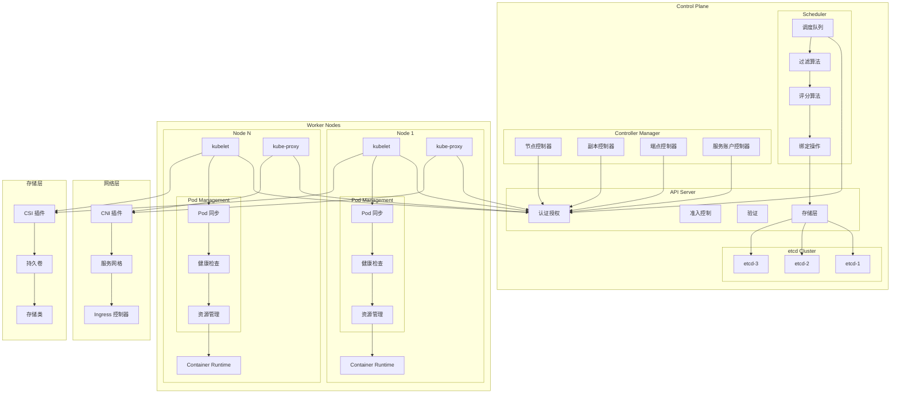
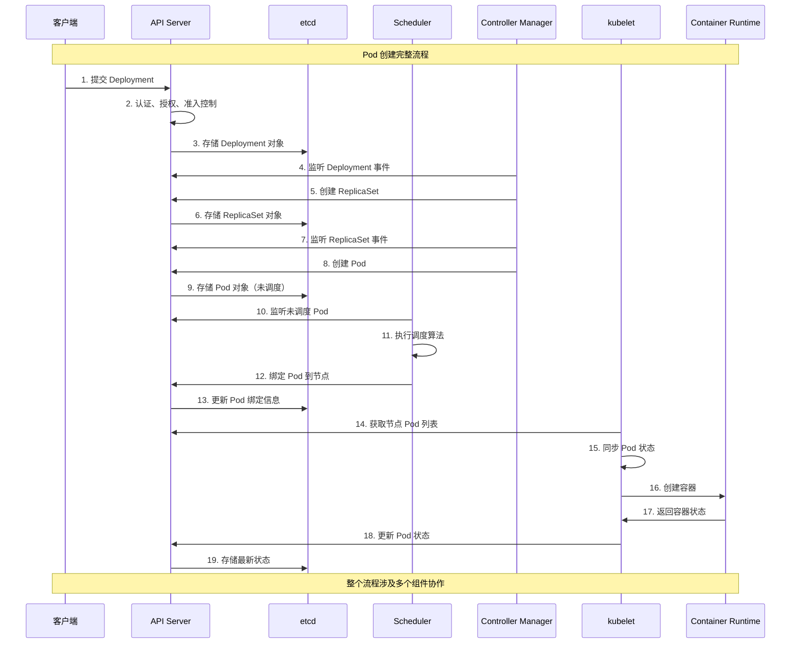

# Kubernetes 架构详解

## 概述

本目录包含 Kubernetes 各核心组件的详细架构原理和实现机制。每个组件按照单独的文件进行组织，便于深入学习和理解。

## 目录结构

- [API Server](./api-server.md) - Kubernetes 集群的统一入口
- [etcd](./etcd.md) - 分布式键值存储数据库
- [Scheduler](./scheduler.md) - Pod 调度器
- [Controller Manager](./controller-manager.md) - 控制器管理器
- [kubelet](./kubelet.md) - 节点代理
- [kube-proxy](./kube-proxy.md) - 网络代理
- [Container Runtime](./container-runtime.md) - 容器运行时
- [CoreDNS](./coredns.md) - 集群 DNS 服务

## 整体交互架构

## 数据流向图

## 组件交互模式

### 声明式 API 模式
- 用户声明期望状态
- 控制器持续监控实际状态
- 自动调节使实际状态趋向期望状态

### 控制器模式
- Watch：监听资源变化
- Reconcile：协调状态差异
- Update：更新资源状态

### 事件驱动模式
- 基于事件的异步通信
- 组件间松耦合
- 高可扩展性和容错性

## 核心特性

### 高可用性
- 多副本部署
- leader 选举机制
- 自动故障转移

### 可扩展性
- 插件化架构
- CRI/CNI/CSI 接口
- 自定义资源和控制器

### 安全性
- RBAC 授权
- 网络策略
- Pod 安全策略
- 密钥管理

### 可观测性
- 指标收集
- 日志聚合
- 分布式追踪
- 事件记录
