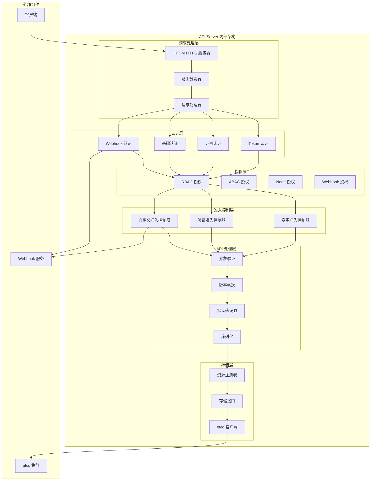
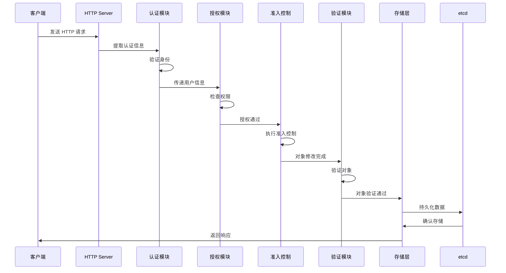
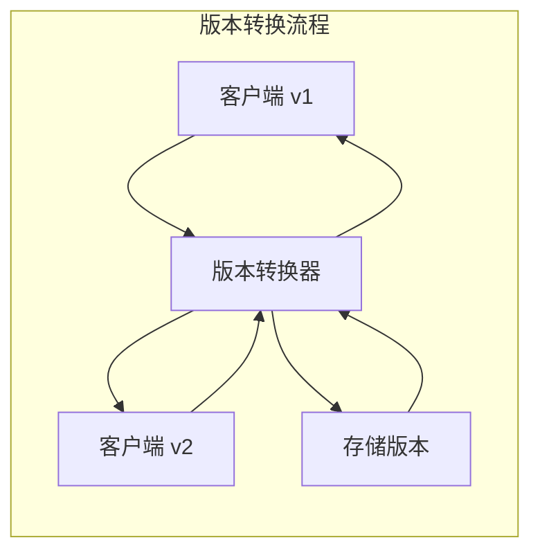

# API Server 架构详解

## 概述

API Server 是 Kubernetes 集群的统一入口和控制中心，负责处理所有的 REST API 请求，进行身份验证、授权、准入控制，并将数据持久化到 etcd 中。

## 核心架构



## 详细工作原理

### 1. 请求处理流程



### 2. 认证机制详解

#### Token 认证
- **Service Account Token**: 用于 Pod 内服务访问
- **Bootstrap Token**: 用于节点注册
- **OIDC Token**: 集成外部身份提供者
- **Static Token**: 静态令牌文件

#### 证书认证
- **客户端证书**: X.509 证书认证
- **CA 验证**: 证书颁发机构验证
- **证书链**: 多级证书验证

#### Webhook 认证
- **外部认证**: 委托给外部服务
- **Token Review**: 令牌审查 API
- **缓存机制**: 认证结果缓存

### 3. 授权机制详解

#### RBAC (基于角色的访问控制)
```yaml
# 角色定义示例
apiVersion: rbac.authorization.k8s.io/v1
kind: Role
metadata:
  namespace: default
  name: pod-reader
rules:
- apiGroups: [""]
  resources: ["pods"]
  verbs: ["get", "watch", "list"]
---
# 角色绑定示例
apiVersion: rbac.authorization.k8s.io/v1
kind: RoleBinding
metadata:
  name: read-pods
  namespace: default
subjects:
- kind: User
  name: jane
  apiGroup: rbac.authorization.k8s.io
roleRef:
  kind: Role
  name: pod-reader
  apiGroup: rbac.authorization.k8s.io
```

#### 权限检查算法
1. 提取请求信息（用户、组、资源、动作）
2. 查找适用的角色和集群角色
3. 检查角色绑定和集群角色绑定
4. 评估规则匹配
5. 返回授权决策

### 4. 准入控制器详解

#### 内置准入控制器
- **NamespaceLifecycle**: 防止在终止中的命名空间创建对象
- **LimitRanger**: 强制执行资源限制
- **ServiceAccount**: 自动挂载服务账户
- **ResourceQuota**: 强制执行资源配额
- **PodSecurityPolicy**: 执行 Pod 安全策略

#### 动态准入控制
```yaml
# 变更准入控制器示例
apiVersion: admissionregistration.k8s.io/v1
kind: MutatingAdmissionWebhook
metadata:
  name: example-mutating-webhook
webhooks:
- name: mutate.example.com
  clientConfig:
    service:
      name: example-webhook-service
      namespace: example
      path: "/mutate"
  rules:
  - operations: ["CREATE"]
    apiGroups: [""]
    apiVersions: ["v1"]
    resources: ["pods"]
```

### 5. API 版本管理

#### 版本策略
- **Alpha**: 默认禁用，可能包含错误
- **Beta**: 默认启用，向后兼容
- **Stable**: 生产就绪，长期支持

#### 版本转换


### 6. 存储层架构

#### 存储接口
```go
type Storage interface {
    Create(ctx context.Context, key string, obj, out runtime.Object, ttl uint64) error
    Delete(ctx context.Context, key string, out runtime.Object, preconditions *Preconditions) error
    Watch(ctx context.Context, key string, resourceVersion string, p SelectionPredicate) (watch.Interface, error)
    Get(ctx context.Context, key string, resourceVersion string, objPtr runtime.Object, ignoreNotFound bool) error
    List(ctx context.Context, key string, resourceVersion string, p SelectionPredicate, listObj runtime.Object) error
    GuaranteedUpdate(ctx context.Context, key string, ptrToType runtime.Object, ignoreNotFound bool, preconditions *Preconditions, tryUpdate UpdateFunc, cachedExistingObject runtime.Object) error
}
```

#### etcd 集成
- **键空间设计**: `/registry/{group}/{resource}/{namespace}/{name}`
- **序列化格式**: Protobuf 或 JSON
- **压缩策略**: 定期压缩历史版本
- **备份恢复**: 定期备份 etcd 数据

### 7. 高可用配置

#### 多实例部署
```yaml
apiVersion: v1
kind: Pod
metadata:
  name: kube-apiserver
spec:
  containers:
  - name: kube-apiserver
    image: k8s.gcr.io/kube-apiserver:v1.21.0
    command:
    - kube-apiserver
    - --etcd-servers=https://etcd-1:2379,https://etcd-2:2379,https://etcd-3:2379
    - --bind-address=0.0.0.0
    - --secure-port=6443
    - --advertise-address=192.168.1.100
    - --allow-privileged=true
    - --service-cluster-ip-range=10.96.0.0/12
    - --enable-admission-plugins=NodeRestriction,ResourceQuota
    - --audit-log-maxage=30
    - --audit-log-maxbackup=3
    - --audit-log-maxsize=100
    - --audit-log-path=/var/log/audit.log
```

#### 负载均衡
- **外部负载均衡器**: HAProxy、NGINX、云负载均衡器
- **健康检查**: `/healthz` 端点检查
- **会话保持**: 基于客户端证书的会话保持

### 8. 性能优化

#### 缓存机制
- **Watch 缓存**: 缓存资源变更事件
- **LIST 缓存**: 缓存列表请求结果
- **对象缓存**: 缓存常用对象

#### 请求限制
- **请求速率限制**: 防止 API 过载
- **并发限制**: 限制同时处理的请求数
- **请求大小限制**: 限制请求体大小

#### 监控指标
```yaml
# 关键监控指标
- apiserver_request_duration_seconds
- apiserver_request_total
- etcd_request_duration_seconds
- authentication_attempts
- authorization_decisions
```

### 9. 安全最佳实践

#### TLS 配置
- **最小 TLS 版本**: TLS 1.2
- **密码套件**: 强加密算法
- **证书轮换**: 定期轮换证书

#### 审计日志
```yaml
apiVersion: audit.k8s.io/v1
kind: Policy
rules:
- level: Metadata
  resources:
  - group: ""
    resources: ["secrets", "configmaps"]
- level: RequestResponse
  resources:
  - group: ""
    resources: ["pods"]
```

#### 网络安全
- **网络策略**: 限制网络访问
- **防火墙规则**: 只开放必要端口
- **VPN 访问**: 管理员访问通过 VPN

## 故障排除

### 常见问题诊断

#### 认证失败
```bash
# 检查证书有效性
openssl x509 -in client.crt -text -noout

# 检查 Service Account Token
kubectl get serviceaccount default -o yaml
```

#### 授权失败
```bash
# 检查用户权限
kubectl auth can-i create pods --as=user@example.com

# 查看角色绑定
kubectl get rolebindings,clusterrolebindings -o wide
```

#### 性能问题
```bash
# 查看 API Server 指标
curl -k https://localhost:6443/metrics

# 检查 etcd 延迟
etcdctl endpoint status --cluster -w table
```