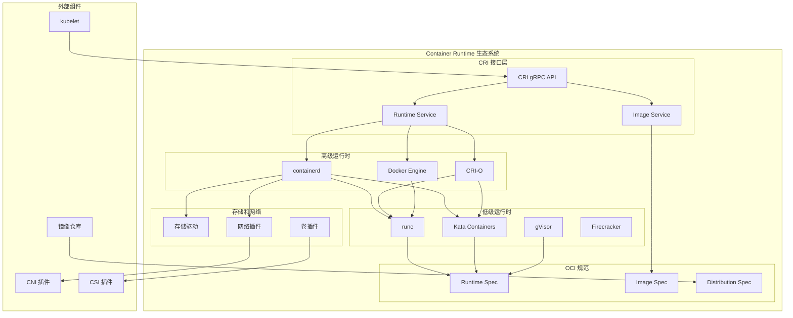
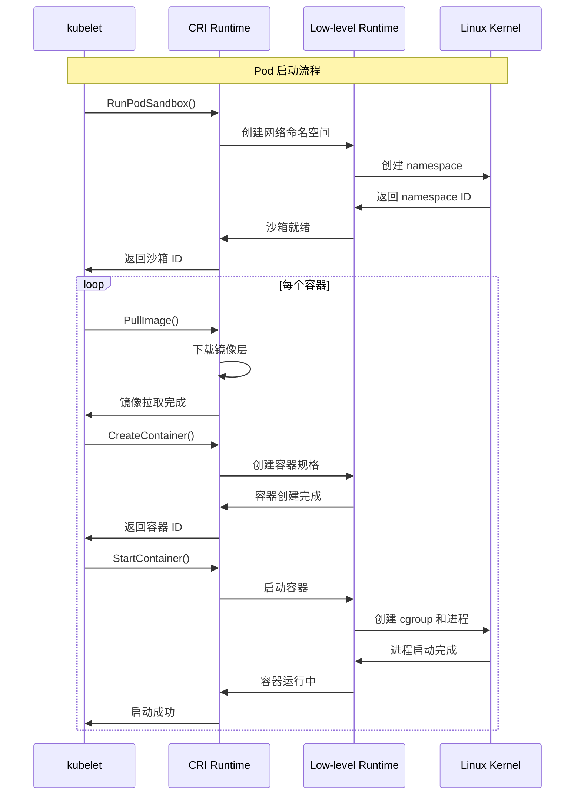
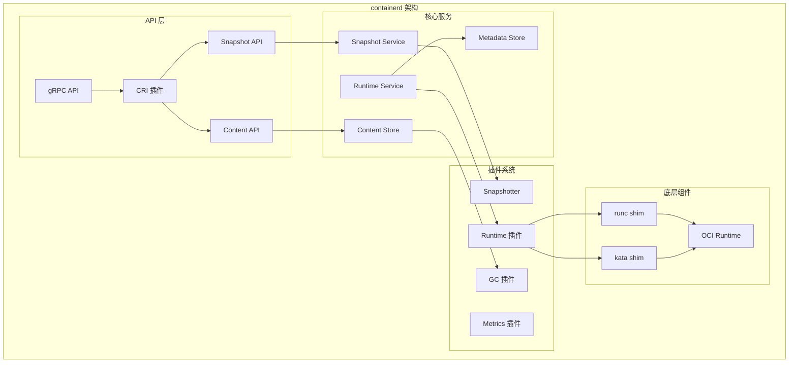
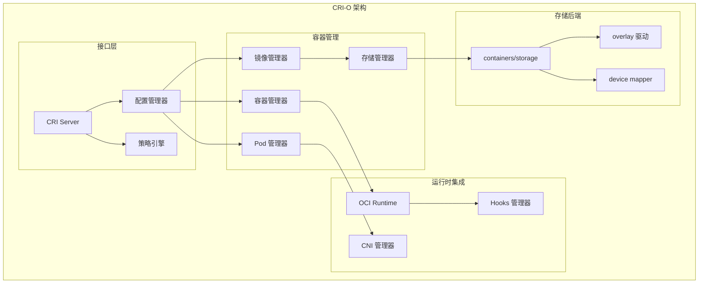
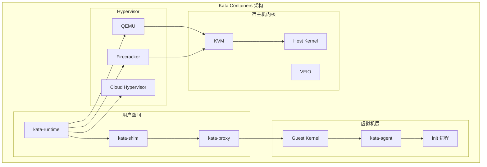
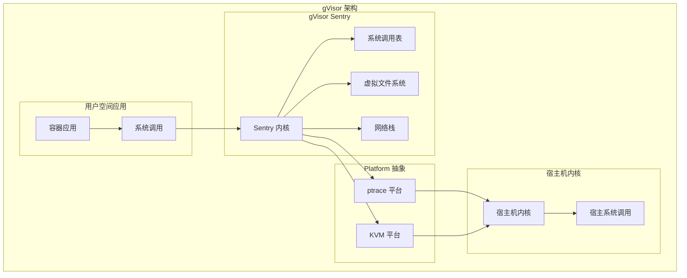
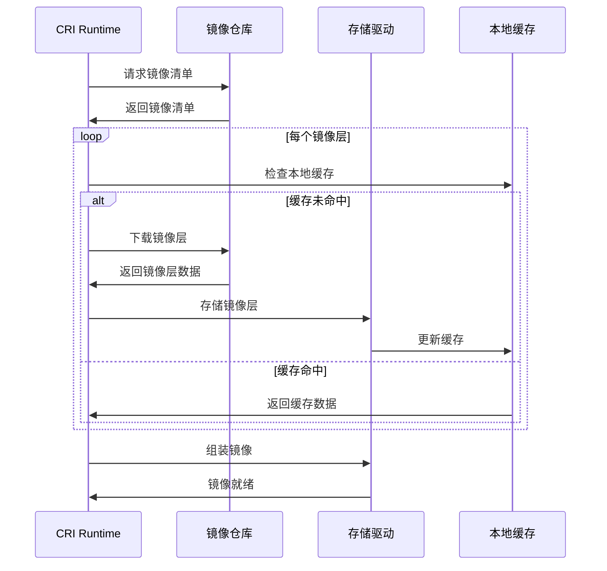

# Container Runtime 架构详解

## 概述

Container Runtime 是 Kubernetes 中负责实际运行容器的底层组件。它通过 Container Runtime Interface (CRI) 与 kubelet 交互，管理容器和镜像的生命周期。

## 核心架构



## CRI 接口详解

### 1. CRI 服务定义

```protobuf
// Runtime Service - 容器和 Pod 沙箱管理
service RuntimeService {
    // 版本信息
    rpc Version(VersionRequest) returns (VersionResponse);
    
    // Pod 沙箱管理
    rpc RunPodSandbox(RunPodSandboxRequest) returns (RunPodSandboxResponse);
    rpc StopPodSandbox(StopPodSandboxRequest) returns (StopPodSandboxResponse);
    rpc RemovePodSandbox(RemovePodSandboxRequest) returns (RemovePodSandboxResponse);
    rpc PodSandboxStatus(PodSandboxStatusRequest) returns (PodSandboxStatusResponse);
    rpc ListPodSandbox(ListPodSandboxRequest) returns (ListPodSandboxResponse);
    
    // 容器管理
    rpc CreateContainer(CreateContainerRequest) returns (CreateContainerResponse);
    rpc StartContainer(StartContainerRequest) returns (StartContainerResponse);
    rpc StopContainer(StopContainerRequest) returns (StopContainerResponse);
    rpc RemoveContainer(RemoveContainerRequest) returns (RemoveContainerResponse);
    rpc ListContainers(ListContainersRequest) returns (ListContainersResponse);
    rpc ContainerStatus(ContainerStatusRequest) returns (ContainerStatusResponse);
    
    // 容器执行
    rpc ExecSync(ExecSyncRequest) returns (ExecSyncResponse);
    rpc Exec(ExecRequest) returns (ExecResponse);
    rpc Attach(AttachRequest) returns (AttachResponse);
    rpc PortForward(PortForwardRequest) returns (PortForwardResponse);
    
    // 日志和状态
    rpc ContainerStats(ContainerStatsRequest) returns (ContainerStatsResponse);
    rpc ListContainerStats(ListContainerStatsRequest) returns (ListContainerStatsResponse);
    rpc UpdateRuntimeConfig(UpdateRuntimeConfigRequest) returns (UpdateRuntimeConfigResponse);
    rpc Status(StatusRequest) returns (StatusResponse);
}

// Image Service - 镜像管理
service ImageService {
    rpc ListImages(ListImagesRequest) returns (ListImagesResponse);
    rpc ImageStatus(ImageStatusRequest) returns (ImageStatusResponse);
    rpc PullImage(PullImageRequest) returns (PullImageResponse);
    rpc RemoveImage(RemoveImageRequest) returns (RemoveImageResponse);
    rpc ImageFsInfo(ImageFsInfoRequest) returns (ImageFsInfoResponse);
}
```

### 2. CRI 调用流程



## 主要 Runtime 实现

### 1. containerd

#### 架构特点


#### 配置示例
```toml
# /etc/containerd/config.toml
version = 2

[plugins]
  [plugins."io.containerd.grpc.v1.cri"]
    sandbox_image = "k8s.gcr.io/pause:3.5"
    
    [plugins."io.containerd.grpc.v1.cri".containerd]
      default_runtime_name = "runc"
      
      [plugins."io.containerd.grpc.v1.cri".containerd.runtimes]
        [plugins."io.containerd.grpc.v1.cri".containerd.runtimes.runc]
          runtime_type = "io.containerd.runc.v2"
          [plugins."io.containerd.grpc.v1.cri".containerd.runtimes.runc.options]
            SystemdCgroup = true
            
        [plugins."io.containerd.grpc.v1.cri".containerd.runtimes.kata]
          runtime_type = "io.containerd.kata.v2"
          
    [plugins."io.containerd.grpc.v1.cri".registry]
      [plugins."io.containerd.grpc.v1.cri".registry.mirrors]
        [plugins."io.containerd.grpc.v1.cri".registry.mirrors."docker.io"]
          endpoint = ["https://registry-1.docker.io"]
```

### 2. CRI-O

#### 架构特点


#### 配置示例
```toml
# /etc/crio/crio.conf
[crio]
log_level = "info"
log_dir = "/var/log/crio/pods"
version_file = "/var/run/crio/version"

[crio.api]
listen = "/var/run/crio/crio.sock"
stream_address = "127.0.0.1"
stream_port = "0"

[crio.runtime]
default_runtime = "runc"
no_pivot = false
decryption_keys_path = "/etc/crio/keys/"
conmon = "/usr/bin/conmon"
cgroup_manager = "systemd"
default_capabilities = [
    "CHOWN", "DAC_OVERRIDE", "FSETID", "FOWNER",
    "NET_RAW", "SETGID", "SETUID", "SETPCAP",
    "NET_BIND_SERVICE", "SYS_CHROOT", "KILL"
]

[crio.runtime.runtimes.runc]
runtime_path = "/usr/bin/runc"
runtime_type = "oci"

[crio.runtime.runtimes.kata]
runtime_path = "/usr/bin/kata-runtime"
runtime_type = "oci"

[crio.image]
default_transport = "docker://"
pause_image = "k8s.gcr.io/pause:3.5"

[crio.network]
network_dir = "/etc/cni/net.d/"
plugin_dirs = ["/opt/cni/bin/"]
```

## OCI 规范实现

### 1. Runtime Specification

```json
{
  "ociVersion": "1.0.0",
  "process": {
    "terminal": false,
    "user": {
      "uid": 0,
      "gid": 0
    },
    "args": [
      "/bin/sh",
      "-c",
      "echo hello world"
    ],
    "env": [
      "PATH=/usr/local/sbin:/usr/local/bin:/usr/sbin:/usr/bin:/sbin:/bin",
      "TERM=xterm"
    ],
    "cwd": "/",
    "capabilities": {
      "bounding": ["CAP_AUDIT_WRITE", "CAP_KILL", "CAP_NET_BIND_SERVICE"],
      "effective": ["CAP_AUDIT_WRITE", "CAP_KILL", "CAP_NET_BIND_SERVICE"],
      "inheritable": ["CAP_AUDIT_WRITE", "CAP_KILL", "CAP_NET_BIND_SERVICE"],
      "permitted": ["CAP_AUDIT_WRITE", "CAP_KILL", "CAP_NET_BIND_SERVICE"]
    },
    "rlimits": [{
      "type": "RLIMIT_NOFILE",
      "hard": 1024,
      "soft": 1024
    }]
  },
  "root": {
    "path": "rootfs",
    "readonly": true
  },
  "hostname": "container",
  "mounts": [{
    "destination": "/proc",
    "type": "proc",
    "source": "proc"
  }, {
    "destination": "/dev",
    "type": "tmpfs",
    "source": "tmpfs",
    "options": ["nosuid", "strictatime", "mode=755", "size=65536k"]
  }],
  "linux": {
    "resources": {
      "devices": [{
        "allow": false,
        "access": "rwm"
      }],
      "memory": {
        "limit": 134217728
      },
      "cpu": {
        "quota": 20000,
        "period": 100000
      }
    },
    "namespaces": [{
      "type": "pid"
    }, {
      "type": "network"
    }, {
      "type": "ipc"
    }, {
      "type": "uts"
    }, {
      "type": "mount"
    }]
  }
}
```

### 2. Image Specification

```json
{
  "schemaVersion": 2,
  "mediaType": "application/vnd.oci.image.manifest.v1+json",
  "config": {
    "mediaType": "application/vnd.oci.image.config.v1+json",
    "size": 1234,
    "digest": "sha256:83c..."
  },
  "layers": [{
    "mediaType": "application/vnd.oci.image.layer.v1.tar+gzip",
    "size": 5312,
    "digest": "sha256:2c26b..."
  }, {
    "mediaType": "application/vnd.oci.image.layer.v1.tar+gzip",
    "size": 977,
    "digest": "sha256:4fce..."
  }],
  "annotations": {
    "org.opencontainers.image.created": "2023-01-01T00:00:00Z",
    "org.opencontainers.image.authors": "Example <example@example.com>",
    "org.opencontainers.image.url": "https://example.com",
    "org.opencontainers.image.documentation": "https://example.com/docs",
    "org.opencontainers.image.source": "https://github.com/example/example",
    "org.opencontainers.image.version": "1.0.0",
    "org.opencontainers.image.revision": "abc123",
    "org.opencontainers.image.vendor": "Example Inc.",
    "org.opencontainers.image.licenses": "MIT",
    "org.opencontainers.image.title": "Example Image",
    "org.opencontainers.image.description": "Example container image"
  }
}
```

## 安全运行时

### 1. Kata Containers

#### 架构原理


#### 配置示例
```toml
# /etc/kata-containers/configuration.toml
[hypervisor.qemu]
path = "/usr/bin/qemu-system-x86_64"
kernel = "/usr/share/kata-containers/vmlinuz.container"
image = "/usr/share/kata-containers/kata-containers.img"
machine_type = "q35"
default_vcpus = 1
default_memory = 2048
disable_block_device_use = false
shared_fs = "virtio-9p"
virtio_fs_daemon = "/usr/bin/virtiofsd"

[runtime]
enable_debug = false
internetworking_model = "tcfilter"
disable_guest_seccomp = true
disable_new_netns = false
enable_pprof = false
```

### 2. gVisor

#### 架构原理


## 镜像管理

### 1. 镜像拉取流程



### 2. 存储驱动

```yaml
# 存储驱动类型
overlay2:
  描述: 现代联合文件系统
  优点:
    - 性能好
    - 内核原生支持
    - 节省磁盘空间
  适用场景: 推荐的默认选择

devicemapper:
  描述: 块级别存储驱动
  优点:
    - 稳定可靠
    - 支持精细的配额控制
  缺点:
    - 性能相对较差
    - 配置复杂

btrfs:
  描述: 写时复制文件系统
  优点:
    - 支持快照
    - 压缩和去重
  缺点:
    - 相对较新
    - 稳定性待验证

zfs:
  描述: 高级文件系统
  优点:
    - 数据完整性保证
    - 快照和克隆
  缺点:
    - 内存消耗大
    - Linux 非原生支持
```

## 性能优化

### 1. 镜像优化

```dockerfile
# 多阶段构建
FROM golang:1.19-alpine AS builder
WORKDIR /app
COPY go.mod go.sum ./
RUN go mod download
COPY . .
RUN CGO_ENABLED=0 GOOS=linux go build -o main .

FROM alpine:latest
RUN apk --no-cache add ca-certificates
WORKDIR /root/
COPY --from=builder /app/main .
CMD ["./main"]
```

### 2. 启动优化

```yaml
# 容器配置优化
apiVersion: v1
kind: Pod
spec:
  containers:
  - name: app
    image: myapp:latest
    imagePullPolicy: IfNotPresent  # 避免不必要的拉取
    resources:
      requests:
        cpu: 100m
        memory: 128Mi
      limits:
        cpu: 500m
        memory: 512Mi
    readinessProbe:
      httpGet:
        path: /health
        port: 8080
      initialDelaySeconds: 5
      periodSeconds: 5
    livenessProbe:
      httpGet:
        path: /health
        port: 8080
      initialDelaySeconds: 30
      periodSeconds: 10
  # 镜像拉取优化
  imagePullSecrets:
  - name: regcred
```

## 监控和故障排除

### 1. 监控指标

```yaml
# Container Runtime 关键指标
container_runtime_operations_total: 运行时操作总数
container_runtime_operations_duration_seconds: 操作耗时
container_runtime_operations_errors_total: 操作错误总数

# containerd 特有指标
containerd_containers: 容器数量
containerd_snapshots: 快照数量
containerd_images: 镜像数量

# CRI-O 特有指标
crio_containers: 容器数量
crio_images: 镜像数量
crio_operations_total: 操作总数
```

### 2. 故障诊断

```bash
# 检查 Container Runtime 状态
systemctl status containerd
systemctl status crio

# 查看运行时日志
journalctl -u containerd -f
journalctl -u crio -f

# 检查容器状态
crictl ps
crictl pods

# 查看镜像
crictl images

# 调试容器
crictl logs <container-id>
crictl exec -it <container-id> /bin/sh

# 检查运行时配置
crictl info
```

### 3. 常见问题

```bash
# 镜像拉取失败
# 检查网络连接
curl -I https://registry-1.docker.io

# 检查认证配置
cat /var/lib/kubelet/config.json

# 容器启动失败
# 检查容器日志
crictl logs <container-id>

# 检查资源限制
cat /sys/fs/cgroup/memory/kubepods/pod<pod-id>/<container-id>/memory.limit_in_bytes

# 性能问题
# 查看系统资源
top
iostat -x 1
sar -u 1

# 检查容器资源使用
crictl stats
```

## 最佳实践

### 1. 安全配置

```yaml
# 容器安全最佳实践
apiVersion: v1
kind: Pod
spec:
  securityContext:
    runAsNonRoot: true
    runAsUser: 1000
    fsGroup: 2000
    seccompProfile:
      type: RuntimeDefault
  containers:
  - name: app
    image: myapp:latest
    securityContext:
      allowPrivilegeEscalation: false
      readOnlyRootFilesystem: true
      capabilities:
        drop:
        - ALL
        add:
        - NET_BIND_SERVICE
    volumeMounts:
    - name: tmp
      mountPath: /tmp
    - name: var-run
      mountPath: /var/run
  volumes:
  - name: tmp
    emptyDir: {}
  - name: var-run
    emptyDir: {}
```

### 2. 资源管理

```yaml
# 资源配置建议
resources:
  requests:
    cpu: "100m"      # 最小需求
    memory: "128Mi"   # 最小需求
  limits:
    cpu: "500m"      # 最大限制
    memory: "512Mi"   # 最大限制
    ephemeral-storage: "1Gi"  # 临时存储限制
```

### 3. 镜像管理

```bash
# 镜像清理策略
# 配置镜像垃圾回收
echo 'imageGCHighThresholdPercent: 85' >> /var/lib/kubelet/config.yaml
echo 'imageGCLowThresholdPercent: 80' >> /var/lib/kubelet/config.yaml
echo 'imageMinimumGCAge: 2m' >> /var/lib/kubelet/config.yaml

# 定期清理未使用的镜像
crictl rmi --prune

# 查看镜像使用情况
crictl images | grep -v '<none>'
