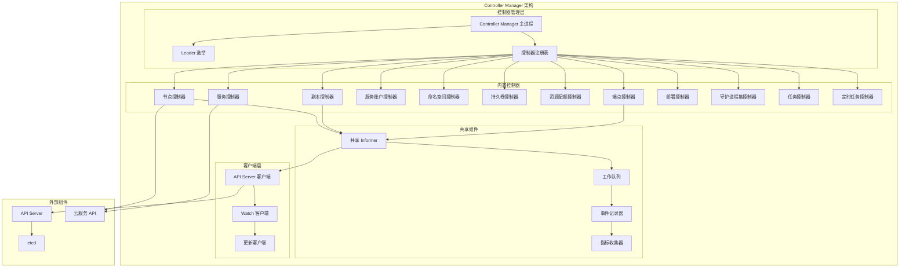
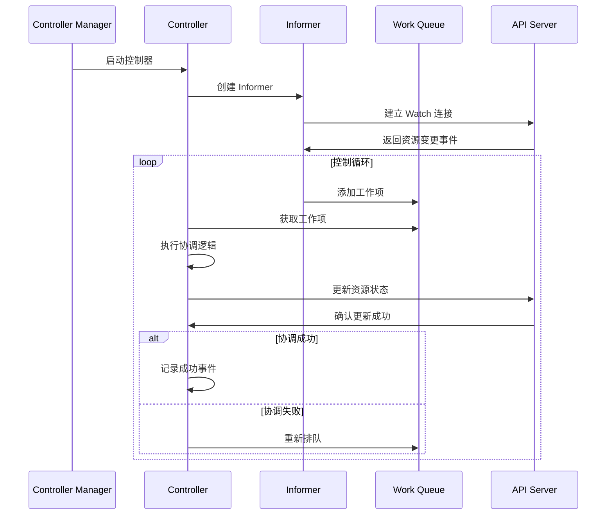
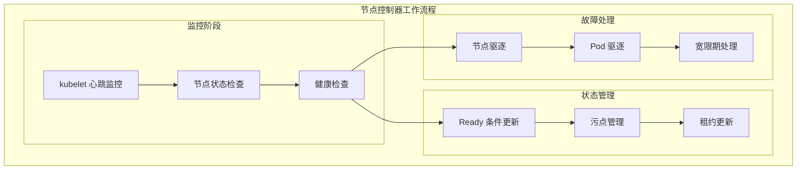
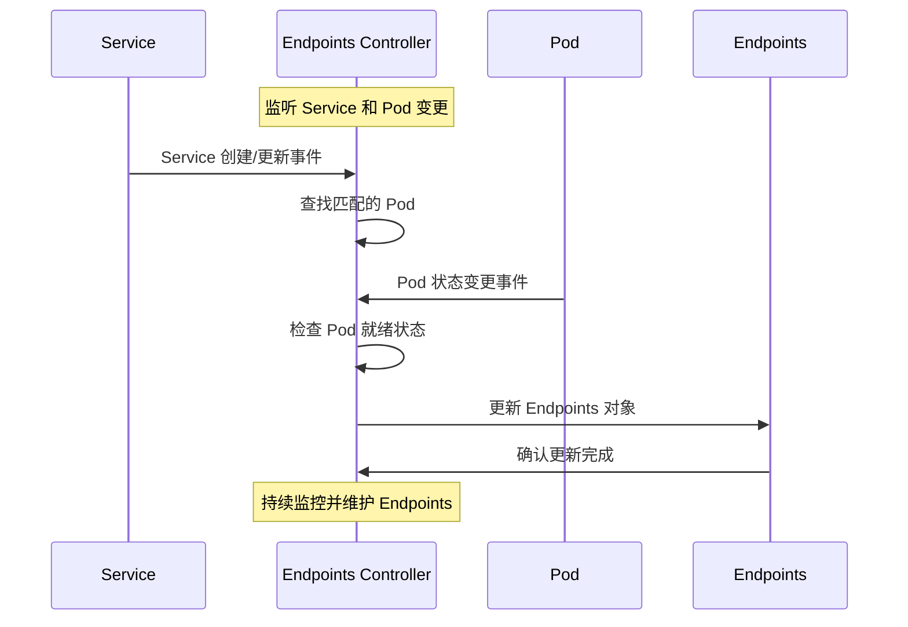
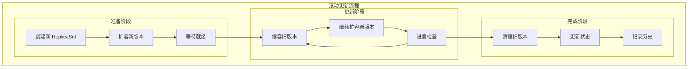
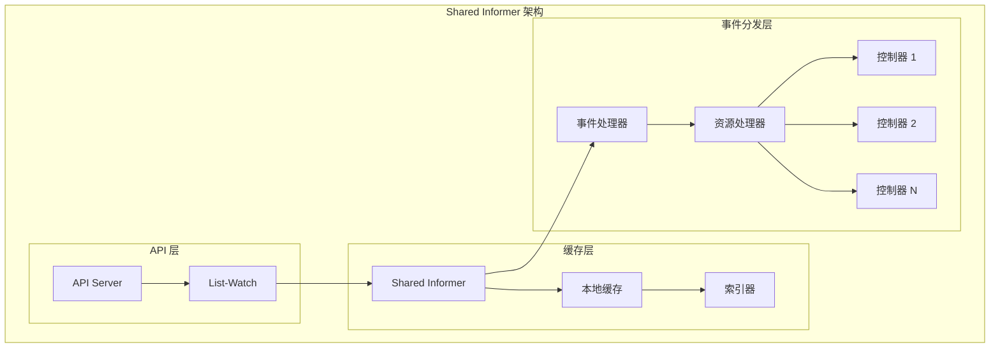
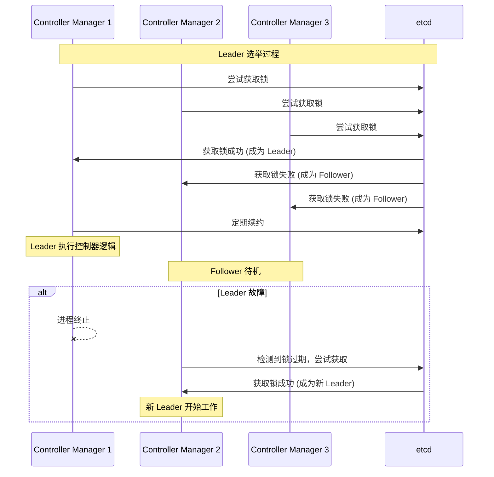

# Controller Manager 架构详解

## 概述

Controller Manager 是 Kubernetes 集群的控制器管理器，负责运行各种控制器来维护集群的期望状态。它采用控制器模式，持续监控集群状态并采取必要的操作来使实际状态与期望状态保持一致。

## 核心架构



## 控制器模式详解

### 1. 控制器工作原理

```mermaid
graph TB
    subgraph "控制器循环"
        subgraph "观察阶段"
            WATCH[监听 API 事件]
            CACHE[本地缓存更新]
            INFORMER[Informer 机制]
        end
        
        subgraph "分析阶段"
            CURRENT_STATE[获取当前状态]
            DESIRED_STATE[获取期望状态]
            DIFF[状态差异分析]
        end
        
        subgraph "执行阶段"
            RECONCILE[协调操作]
            API_CALL[API 调用]
            STATUS_UPDATE[状态更新]
        end
        
        subgraph "反馈阶段"
            EVENT[事件记录]
            METRICS_UPDATE[指标更新]
            ERROR_HANDLE[错误处理]
        end
    end
    
    WATCH --> CACHE
    CACHE --> INFORMER
    INFORMER --> CURRENT_STATE
    
    CURRENT_STATE --> DESIRED_STATE
    DESIRED_STATE --> DIFF
    
    DIFF --> RECONCILE
    RECONCILE --> API_CALL
    API_CALL --> STATUS_UPDATE
    
    STATUS_UPDATE --> EVENT
    EVENT --> METRICS_UPDATE
    METRICS_UPDATE --> ERROR_HANDLE
    
    ERROR_HANDLE --> WATCH
```



### 2. 控制器生命周期



## 核心控制器详解

### 1. 节点控制器 (Node Controller)

#### 功能职责
- 监控节点健康状态
- 处理节点故障
- 管理节点生命周期
- 更新节点状态

#### 工作机制


#### 配置参数
```yaml
# 节点控制器关键配置
node-monitor-period: 5s          # 节点监控周期
node-monitor-grace-period: 40s   # 节点监控宽限期
pod-eviction-timeout: 5m         # Pod 驱逐超时
large-cluster-size-threshold: 50 # 大集群阈值
unhealthy-zone-threshold: 0.55   # 不健康区域阈值
```

### 2. 副本控制器 (ReplicaSet Controller)

#### 功能职责
- 维护指定数量的 Pod 副本
- 处理 Pod 创建和删除
- 监控 Pod 健康状态
- 执行滚动更新

#### 协调逻辑
```go
// 副本控制器协调逻辑
func (rsc *ReplicaSetController) syncReplicaSet(key string) error {
    // 1. 获取 ReplicaSet 对象
    rs, err := rsc.rsLister.ReplicaSets(namespace).Get(name)
    if err != nil {
        return err
    }
    
    // 2. 获取匹配的 Pod 列表
    pods, err := rsc.getPodsForReplicaSet(rs)
    if err != nil {
        return err
    }
    
    // 3. 计算需要的副本数量
    diff := int(*rs.Spec.Replicas) - len(pods)
    
    // 4. 执行协调操作
    if diff > 0 {
        // 创建新的 Pod
        return rsc.slowStartBatch(diff, controller.SlowStartInitialBatchSize, func() error {
            return rsc.createPod(rs)
        })
    } else if diff < 0 {
        // 删除多余的 Pod
        return rsc.deletePods(-diff, pods)
    }
    
    return nil
}
```

### 3. 端点控制器 (Endpoints Controller)

#### 功能职责
- 维护 Service 和 Pod 之间的映射
- 更新 Endpoints 对象
- 处理 Pod 就绪状态变更
- 管理服务发现信息

#### 工作流程


### 4. 部署控制器 (Deployment Controller)

#### 功能职责
- 管理 ReplicaSet 生命周期
- 执行滚动更新策略
- 处理部署回滚
- 维护版本历史

#### 滚动更新机制


### 5. 任务控制器 (Job Controller)

#### 功能职责
- 管理批处理任务
- 处理 Pod 失败重试
- 维护任务完成状态
- 执行清理策略

#### 任务状态管理
```yaml
# Job 状态转换
apiVersion: batch/v1
kind: Job
status:
  conditions:
  - type: Suspended    # 暂停状态
    status: "True"
  - type: Complete     # 完成状态
    status: "True"
  - type: Failed       # 失败状态
    status: "False"
  active: 0           # 活跃 Pod 数量
  succeeded: 3        # 成功 Pod 数量
  failed: 1           # 失败 Pod 数量
  completionTime: "2023-01-01T12:00:00Z"
  startTime: "2023-01-01T11:00:00Z"
```

## 共享组件详解

### 1. Shared Informer 机制

#### 架构设计


#### 实现机制
```go
// Shared Informer 实现
type sharedInformer struct {
    objectType    runtime.Object
    resyncPeriod  time.Duration
    clock         clock.Clock
    
    // 本地缓存
    store cache.Store
    
    // 控制器列表
    controllers map[*controller]bool
    
    // 事件分发
    processor *sharedProcessor
}

// 添加事件处理器
func (s *sharedInformer) AddEventHandler(handler cache.ResourceEventHandler) {
    s.processor.addListener(newProcessListener(handler, 0, 0, s.clock))
}

// 事件分发处理
func (p *sharedProcessor) distribute(obj interface{}, sync bool) {
    for _, listener := range p.listeners {
        listener.add(obj)
    }
}
```

### 2. Work Queue 机制

#### 队列类型
```go
// 基础队列接口
type Interface interface {
    Add(item interface{})
    Len() int
    Get() (item interface{}, shutdown bool)
    Done(item interface{})
    ShutDown()
    ShuttingDown() bool
}

// 延时队列
type DelayingInterface interface {
    Interface
    AddAfter(item interface{}, duration time.Duration)
}

// 限速队列
type RateLimitingInterface interface {
    DelayingInterface
    AddRateLimited(item interface{})
    Forget(item interface{})
    NumRequeues(item interface{}) int
}
```

#### 限速策略
```go
// 指数退避限速器
func NewItemExponentialFailureRateLimiter(baseDelay time.Duration, maxDelay time.Duration) RateLimiter {
    return &ItemExponentialFailureRateLimiter{
        failures:    map[interface{}]int{},
        baseDelay:   baseDelay,
        maxDelay:    maxDelay,
    }
}

// 固定延时限速器
func NewItemFastSlowRateLimiter(fastDelay, slowDelay time.Duration, maxFastAttempts int) RateLimiter {
    return &ItemFastSlowRateLimiter{
        failures:        map[interface{}]int{},
        fastDelay:       fastDelay,
        slowDelay:       slowDelay,
        maxFastAttempts: maxFastAttempts,
    }
}
```

## 高可用和性能优化

### 1. Leader 选举机制

#### 选举过程


#### 配置示例
```yaml
# Leader 选举配置
apiVersion: v1
kind: Pod
metadata:
  name: kube-controller-manager
spec:
  containers:
  - name: kube-controller-manager
    image: k8s.gcr.io/kube-controller-manager:v1.21.0
    command:
    - kube-controller-manager
    - --leader-elect=true
    - --leader-elect-lease-duration=15s
    - --leader-elect-renew-deadline=10s
    - --leader-elect-retry-period=2s
    - --leader-elect-resource-lock=leases
    - --leader-elect-resource-name=kube-controller-manager
    - --leader-elect-resource-namespace=kube-system
```

### 2. 性能优化策略

#### 并发控制
```yaml
# 控制器并发配置
concurrent-deployment-syncs: 5        # 部署控制器并发数
concurrent-replicaset-syncs: 5        # 副本集控制器并发数
concurrent-endpoint-syncs: 5          # 端点控制器并发数
concurrent-namespace-syncs: 10        # 命名空间控制器并发数
concurrent-service-syncs: 1           # 服务控制器并发数
```

#### 缓存优化
```go
// 控制器缓存配置
type ControllerOptions struct {
    // 缓存同步超时
    CacheSyncTimeout time.Duration
    
    // Informer 重同步周期
    ResyncPeriod time.Duration
    
    // 工作队列大小
    WorkerCount int
    
    // 事件记录器
    EventRecorder record.EventRecorder
}
```

## 监控和故障排除

### 1. 关键监控指标

```yaml
# Controller Manager 监控指标
controller_manager_leader_election_master_status: Leader 状态
workqueue_adds_total: 工作队列添加总数
workqueue_depth: 工作队列深度
workqueue_queue_duration_seconds: 队列等待时间
workqueue_work_duration_seconds: 工作处理时间
rest_client_requests_total: API 请求总数
rest_client_request_duration_seconds: API 请求延迟
```

### 2. 故障诊断

#### 常见问题
```bash
# 检查 Controller Manager 状态
kubectl get pods -n kube-system -l component=kube-controller-manager

# 查看控制器日志
kubectl logs -n kube-system kube-controller-manager-master

# 检查 Leader 选举状态
kubectl get lease -n kube-system kube-controller-manager

# 查看控制器指标
curl http://localhost:10252/metrics
```

#### 性能问题排查
```bash
# 查看工作队列指标
curl http://localhost:10252/metrics | grep workqueue

# 分析 API 请求延迟
curl http://localhost:10252/metrics | grep rest_client_request_duration

# 检查内存使用情况
kubectl top pod -n kube-system -l component=kube-controller-manager
```

## 最佳实践

### 1. 控制器配置优化

```yaml
# 生产环境推荐配置
apiVersion: v1
kind: Pod
metadata:
  name: kube-controller-manager
spec:
  containers:
  - name: kube-controller-manager
    image: k8s.gcr.io/kube-controller-manager:v1.21.0
    resources:
      requests:
        cpu: 200m
        memory: 512Mi
      limits:
        cpu: 500m
        memory: 1Gi
    command:
    - kube-controller-manager
    - --bind-address=0.0.0.0
    - --secure-port=10257
    - --kubeconfig=/etc/kubernetes/controller-manager.conf
    - --authentication-kubeconfig=/etc/kubernetes/controller-manager.conf
    - --authorization-kubeconfig=/etc/kubernetes/controller-manager.conf
    - --client-ca-file=/etc/kubernetes/pki/ca.crt
    - --requestheader-client-ca-file=/etc/kubernetes/pki/front-proxy-ca.crt
    - --root-ca-file=/etc/kubernetes/pki/ca.crt
    - --service-account-private-key-file=/etc/kubernetes/pki/sa.key
    - --cluster-signing-cert-file=/etc/kubernetes/pki/ca.crt
    - --cluster-signing-key-file=/etc/kubernetes/pki/ca.key
    - --use-service-account-credentials=true
    - --controllers=*,bootstrapsigner,tokencleaner
    - --leader-elect=true
    - --concurrent-deployment-syncs=10
    - --concurrent-replicaset-syncs=10
    - --concurrent-endpoint-syncs=10
    - --kube-api-qps=100
    - --kube-api-burst=100
```

### 2. 自定义控制器开发

```go
// 自定义控制器框架
func main() {
    cfg, err := clientcmd.BuildConfigFromFlags("", kubeconfig)
    if err != nil {
        klog.Fatalf("Error building kubeconfig: %s", err.Error())
    }

    kubeClient, err := kubernetes.NewForConfig(cfg)
    if err != nil {
        klog.Fatalf("Error building kubernetes clientset: %s", err.Error())
    }

    kubeInformerFactory := kubeinformers.NewSharedInformerFactory(kubeClient, time.Second*30)

    controller := NewController(kubeClient, kubeInformerFactory.Apps().V1().Deployments())

    stopCh := signals.SetupSignalHandler()

    kubeInformerFactory.Start(stopCh)

    if err = controller.Run(2, stopCh); err != nil {
        klog.Fatalf("Error running controller: %s", err.Error())
    }
}
```