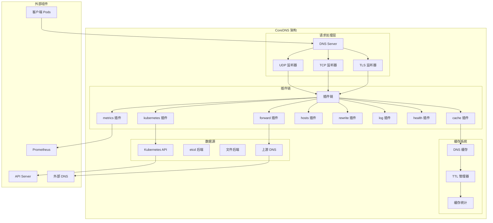
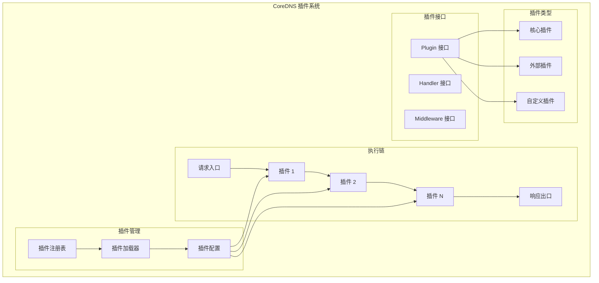
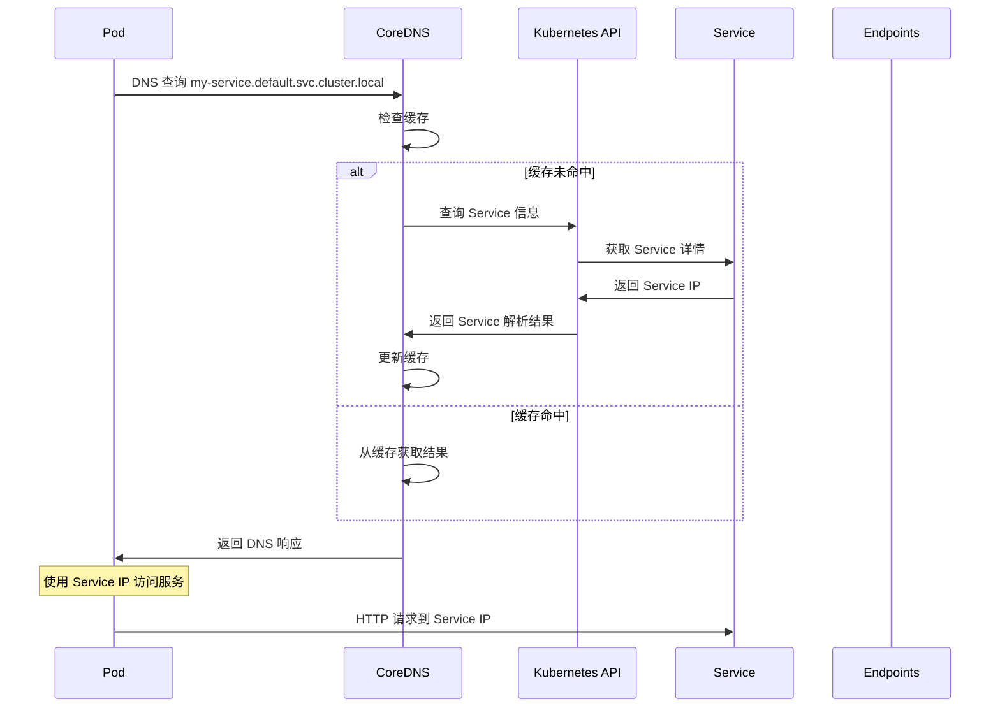
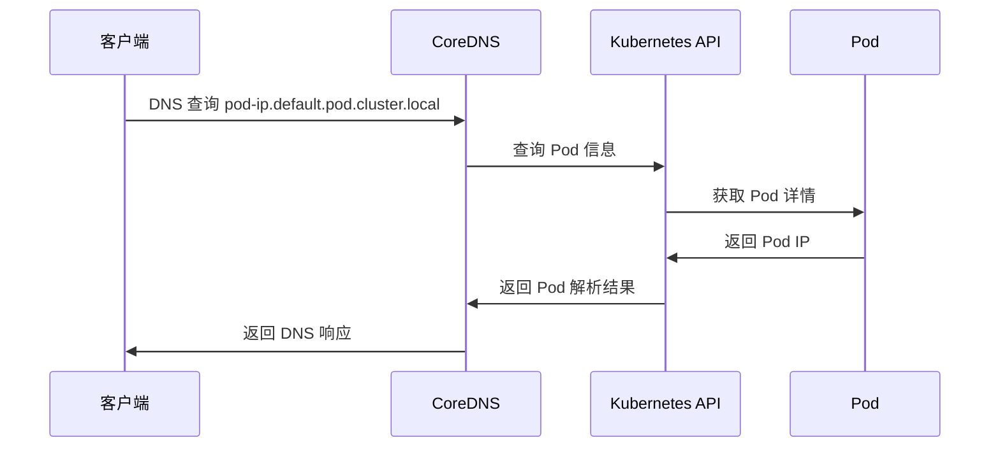
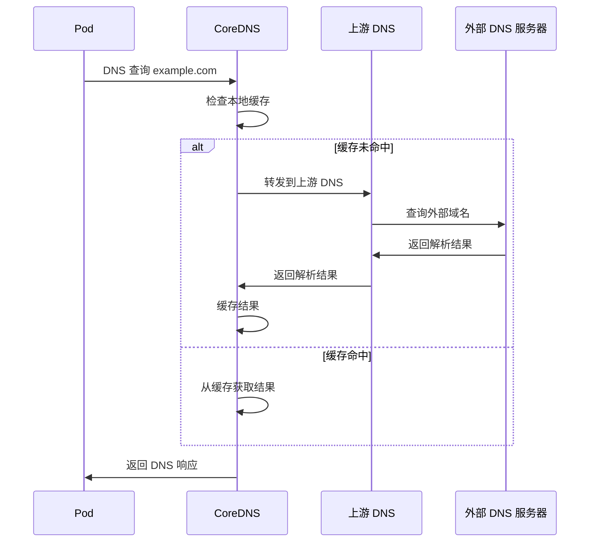

# CoreDNS 架构详解

## 概述

CoreDNS 是 Kubernetes 集群的默认 DNS 服务器，负责为集群内的服务发现和名称解析提供支持。它采用插件化架构，提供灵活的 DNS 解析和服务发现功能。

## 核心架构



## 插件系统详解

### 1. 插件架构



### 2. 核心插件详解

#### kubernetes 插件
```go
// kubernetes 插件配置
kubernetes cluster.local in-addr.arpa ip6.arpa {
    pods insecure
    fallthrough in-addr.arpa ip6.arpa
    ttl 30
}
```

**功能特性:**
- Service 名称解析
- Pod 名称解析
- 端点发现
- 反向 DNS 查询
- 自动服务发现

#### forward 插件
```go
// forward 插件配置
forward . /etc/resolv.conf {
    max_concurrent 1000
    policy random
    health_check 5s
}
```

**功能特性:**
- 上游 DNS 转发
- 负载均衡策略
- 健康检查
- 并发控制

#### cache 插件
```go
// cache 插件配置
cache 30 {
    success 9984 30
    denial 9984 5
    prefetch 2 60s 10%
}
```

**功能特性:**
- DNS 响应缓存
- TTL 管理
- 预取机制
- 缓存统计

## DNS 解析流程

### 1. Service 解析流程



### 2. Pod 解析流程



### 3. 外部域名解析



## 配置管理

### 1. Corefile 配置

```bash
# /etc/coredns/Corefile
.:53 {
    errors
    health {
       lameduck 5s
    }
    ready
    kubernetes cluster.local in-addr.arpa ip6.arpa {
       pods insecure
       fallthrough in-addr.arpa ip6.arpa
       ttl 30
    }
    prometheus :9153
    forward . /etc/resolv.conf {
       max_concurrent 1000
    }
    cache 30
    loop
    reload
    loadbalance
}
```

### 2. 插件配置详解

#### kubernetes 插件配置
```bash
kubernetes cluster.local in-addr.arpa ip6.arpa {
    # 启用 Pod 解析（不安全模式）
    pods insecure
    
    # 启用端点解析
    endpoint_pod_names
    
    # 回退处理
    fallthrough in-addr.arpa ip6.arpa
    
    # TTL 设置
    ttl 30
    
    # 监听的命名空间
    namespaces default kube-system
    
    # 忽略空的服务
    ignore empty_service
}
```

#### forward 插件配置
```bash
forward . 8.8.8.8 8.8.4.4 {
    # 最大并发数
    max_concurrent 1000
    
    # 负载均衡策略
    policy random
    
    # 健康检查
    health_check 5s
    
    # 强制使用 TCP
    force_tcp
    
    # 首选 UDP
    prefer_udp
    
    # 超时设置
    expire 10s
}
```

#### cache 插件配置
```bash
cache 300 {
    # 成功响应缓存
    success 9984 300
    
    # 失败响应缓存
    denial 9984 60
    
    # 预取配置
    prefetch 10 60s 10%
    
    # 服务过期设置
    serve_stale 5s
}
```

## 服务发现机制

### 1. 服务类型和解析

```yaml
# ClusterIP Service 解析
apiVersion: v1
kind: Service
metadata:
  name: my-service
  namespace: default
spec:
  type: ClusterIP
  ports:
  - port: 80
    targetPort: 8080
  selector:
    app: my-app

# DNS 解析记录:
# my-service.default.svc.cluster.local -> ClusterIP
# _http._tcp.my-service.default.svc.cluster.local -> SRV record
```

```yaml
# Headless Service 解析
apiVersion: v1
kind: Service
metadata:
  name: headless-service
  namespace: default
spec:
  clusterIP: None  # Headless
  ports:
  - port: 80
  selector:
    app: my-app

# DNS 解析记录:
# headless-service.default.svc.cluster.local -> Pod IPs
# pod-name.headless-service.default.svc.cluster.local -> Pod IP
```

### 2. DNS 记录类型

```yaml
# A 记录 - IPv4 地址
my-service.default.svc.cluster.local.     30    IN    A       10.96.0.100

# AAAA 记录 - IPv6 地址  
my-service.default.svc.cluster.local.     30    IN    AAAA    2001:db8::1

# SRV 记录 - 服务记录
_http._tcp.my-service.default.svc.cluster.local. 30 IN SRV 0 100 80 my-service.default.svc.cluster.local.

# PTR 记录 - 反向解析
100.0.96.10.in-addr.arpa.                 30    IN    PTR     my-service.default.svc.cluster.local.

# CNAME 记录 - 别名记录
alias.default.svc.cluster.local.          30    IN    CNAME   my-service.default.svc.cluster.local.
```

## 性能优化

### 1. 缓存优化

```bash
# 缓存配置优化
cache 300 {
    # 增大成功缓存时间
    success 9984 300
    
    # 减少失败缓存时间
    denial 9984 30
    
    # 启用预取
    prefetch 5 60s 10%
    
    # 启用过期服务
    serve_stale 10s
}
```

### 2. 并发优化

```bash
# forward 插件并发优化
forward . 8.8.8.8 8.8.4.4 {
    # 增加并发数
    max_concurrent 2000
    
    # 使用随机策略
    policy random
    
    # 减少健康检查间隔
    health_check 2s
}
```

### 3. 资源配置

```yaml
# CoreDNS 部署优化
apiVersion: apps/v1
kind: Deployment
metadata:
  name: coredns
  namespace: kube-system
spec:
  replicas: 3  # 增加副本数
  template:
    spec:
      containers:
      - name: coredns
        image: k8s.gcr.io/coredns/coredns:v1.8.4
        resources:
          requests:
            cpu: 100m
            memory: 70Mi
          limits:
            cpu: 1000m     # 增加 CPU 限制
            memory: 512Mi  # 增加内存限制
        args:
        - -conf
        - /etc/coredns/Corefile
        - -dns.port=53
        ports:
        - containerPort: 53
          name: dns
          protocol: UDP
        - containerPort: 53
          name: dns-tcp
          protocol: TCP
        - containerPort: 9153
          name: metrics
          protocol: TCP
```

## 监控和可观测性

### 1. 监控指标

```yaml
# CoreDNS 关键监控指标
coredns_dns_requests_total: DNS 请求总数
coredns_dns_request_duration_seconds: DNS 请求延迟
coredns_dns_responses_total: DNS 响应总数
coredns_forward_requests_total: 转发请求总数
coredns_cache_hits_total: 缓存命中总数
coredns_cache_misses_total: 缓存未命中总数
coredns_kubernetes_dns_programming_duration_seconds: Kubernetes DNS 编程延迟
```

### 2. 日志配置

```bash
# 启用详细日志
.:53 {
    log {
        class denial error
        format combined
    }
    errors
    kubernetes cluster.local {
        pods insecure
        fallthrough in-addr.arpa ip6.arpa
    }
    forward . 8.8.8.8
    cache 30
}
```

### 3. 健康检查

```yaml
# CoreDNS 健康检查配置
apiVersion: v1
kind: Pod
spec:
  containers:
  - name: coredns
    image: k8s.gcr.io/coredns/coredns:v1.8.4
    ports:
    - containerPort: 8080
      name: health
    livenessProbe:
      httpGet:
        path: /health
        port: 8080
        scheme: HTTP
      initialDelaySeconds: 60
      timeoutSeconds: 5
      successThreshold: 1
      failureThreshold: 5
    readinessProbe:
      httpGet:
        path: /ready
        port: 8181
        scheme: HTTP
      initialDelaySeconds: 30
      timeoutSeconds: 2
      successThreshold: 1
      failureThreshold: 3
```

## 故障排除

### 1. 常见问题诊断

```bash
# 检查 CoreDNS Pod 状态
kubectl get pods -n kube-system -l k8s-app=kube-dns

# 查看 CoreDNS 日志
kubectl logs -n kube-system -l k8s-app=kube-dns

# 检查 CoreDNS 配置
kubectl get configmap coredns -n kube-system -o yaml

# 测试 DNS 解析
kubectl run test-dns --image=busybox --rm -it -- nslookup kubernetes.default
```

### 2. DNS 解析测试

```bash
# 在集群内测试 DNS 解析
kubectl exec -it test-pod -- nslookup my-service.default.svc.cluster.local

# 测试外部域名解析
kubectl exec -it test-pod -- nslookup google.com

# 测试反向 DNS 解析
kubectl exec -it test-pod -- nslookup 10.96.0.1

# 使用 dig 进行详细测试
kubectl exec -it test-pod -- dig @10.96.0.10 my-service.default.svc.cluster.local
```

### 3. 性能问题排查

```bash
# 查看 CoreDNS 指标
curl http://coredns-service:9153/metrics

# 分析 DNS 查询延迟
kubectl exec -it test-pod -- time nslookup my-service.default.svc.cluster.local

# 检查缓存命中率
curl http://coredns-service:9153/metrics | grep cache_hits

# 查看转发请求统计
curl http://coredns-service:9153/metrics | grep forward_requests
```

## 高级配置

### 1. 多区域配置

```bash
# 多区域 Corefile 配置
cluster.local:53 {
    kubernetes cluster.local in-addr.arpa ip6.arpa {
        pods insecure
        fallthrough in-addr.arpa ip6.arpa
    }
    cache 30
}

example.local:53 {
    file /etc/coredns/example.local.db
    cache 300
}

.:53 {
    forward . 8.8.8.8 8.8.4.4
    cache 30
}
```

### 2. 自定义插件开发

```go
// 自定义插件示例
package example

import (
    "context"
    "github.com/coredns/coredns/plugin"
    "github.com/miekg/dns"
)

type Example struct {
    Next plugin.Handler
}

func (e Example) ServeDNS(ctx context.Context, w dns.ResponseWriter, r *dns.Msg) (int, error) {
    // 自定义逻辑
    if r.Question[0].Name == "example.com." {
        m := new(dns.Msg)
        m.SetReply(r)
        rr, _ := dns.NewRR("example.com. 300 IN A 1.2.3.4")
        m.Answer = append(m.Answer, rr)
        w.WriteMsg(m)
        return dns.RcodeSuccess, nil
    }
    
    // 传递给下一个插件
    return plugin.NextOrFailure(e.Name(), e.Next, ctx, w, r)
}

func (e Example) Name() string { return "example" }
```

### 3. 安全配置

```bash
# 安全强化配置
.:53 {
    # 启用错误日志
    errors
    
    # 健康检查
    health
    
    # 启用指标（限制访问）
    prometheus :9153 {
        allow 10.0.0.0/8
    }
    
    # DNS over TLS
    tls cert.pem key.pem
    
    # 限制递归查询
    forward . 8.8.8.8 {
        policy first
        health_check 5s
    }
    
    # 缓存配置
    cache 30 {
        success 1024
        denial 1024
    }
    
    # 防止 DNS 放大攻击
    bufsize 512
}
```

## 最佳实践

### 1. 部署配置

```yaml
# 推荐的 CoreDNS 部署配置
apiVersion: apps/v1
kind: Deployment
metadata:
  name: coredns
  namespace: kube-system
spec:
  replicas: 2
  strategy:
    type: RollingUpdate
    rollingUpdate:
      maxUnavailable: 1
      maxSurge: 25%
  template:
    spec:
      priorityClassName: system-cluster-critical
      serviceAccountName: coredns
      containers:
      - name: coredns
        image: k8s.gcr.io/coredns/coredns:v1.8.4
        resources:
          limits:
            memory: 512Mi
            cpu: 1000m
          requests:
            cpu: 100m
            memory: 70Mi
        args: [ "-conf", "/etc/coredns/Corefile" ]
        volumeMounts:
        - name: config-volume
          mountPath: /etc/coredns
          readOnly: true
        ports:
        - containerPort: 53
          name: dns
          protocol: UDP
        - containerPort: 53
          name: dns-tcp
          protocol: TCP
        - containerPort: 9153
          name: metrics
          protocol: TCP
        securityContext:
          allowPrivilegeEscalation: false
          capabilities:
            add:
            - NET_BIND_SERVICE
            drop:
            - all
          readOnlyRootFilesystem: true
      dnsPolicy: Default
      volumes:
      - name: config-volume
        configMap:
          name: coredns
          items:
          - key: Corefile
            path: Corefile
```

### 2. 监控告警

```yaml
# CoreDNS 监控规则
groups:
- name: coredns
  rules:
  - alert: CoreDNSDown
    expr: up{job="coredns"} == 0
    for: 5m
    
  - alert: CoreDNSHighErrorRate
    expr: rate(coredns_dns_responses_total{rcode!="NOERROR"}[5m]) > 0.1
    for: 5m
    
  - alert: CoreDNSHighLatency
    expr: histogram_quantile(0.99, rate(coredns_dns_request_duration_seconds_bucket[5m])) > 1
    for: 10m
    
  - alert: CoreDNSLowCacheHitRate
    expr: rate(coredns_cache_hits_total[5m]) / rate(coredns_dns_requests_total[5m]) < 0.8
    for: 15m
```

### 3. 容量规划

```yaml
# 容量规划建议
小型集群 (< 50 节点):
  replicas: 2
  resources:
    requests:
      cpu: 100m
      memory: 70Mi
    limits:
      cpu: 500m
      memory: 256Mi

中型集群 (50-200 节点):
  replicas: 3
  resources:
    requests:
      cpu: 200m
      memory: 128Mi
    limits:
      cpu: 1000m
      memory: 512Mi

大型集群 (> 200 节点):
  replicas: 5
  resources:
    requests:
      cpu: 500m
      memory: 256Mi
    limits:
      cpu: 2000m
      memory: 1Gi
