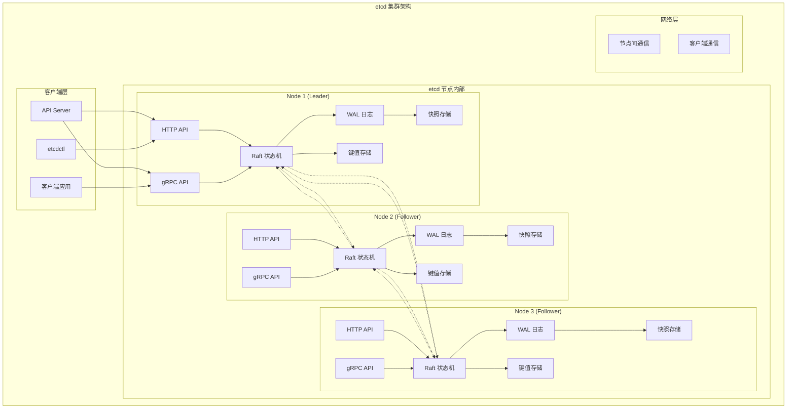
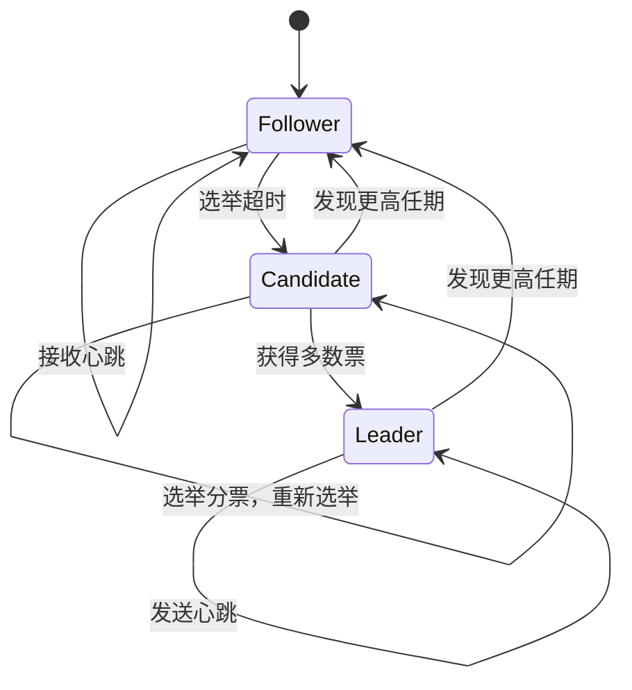
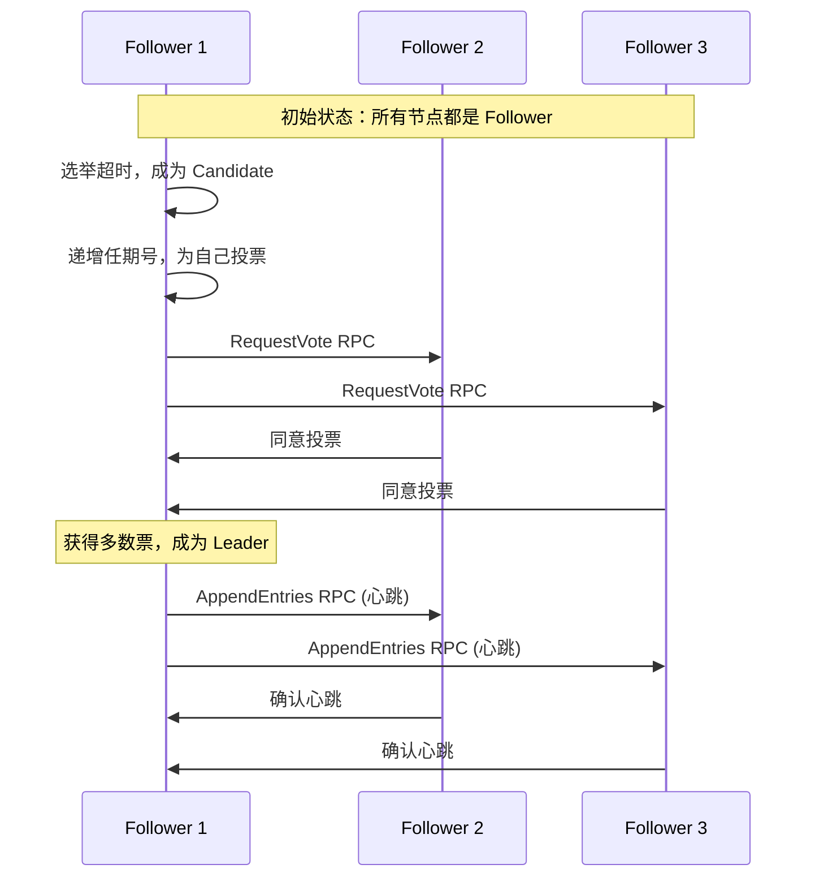
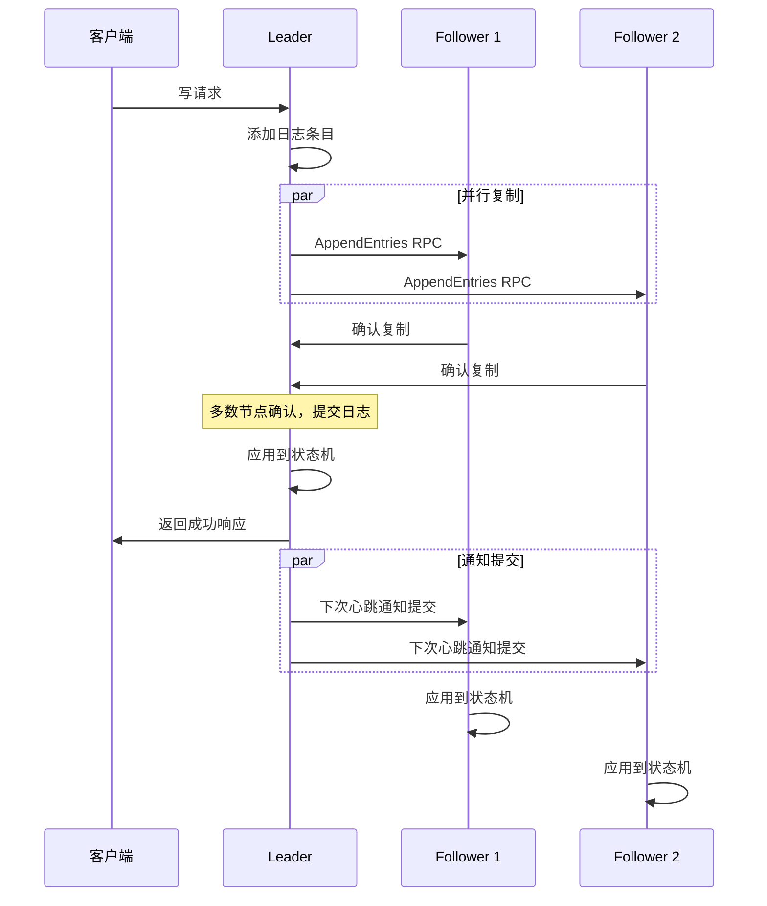
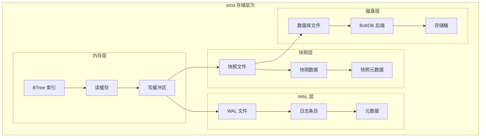
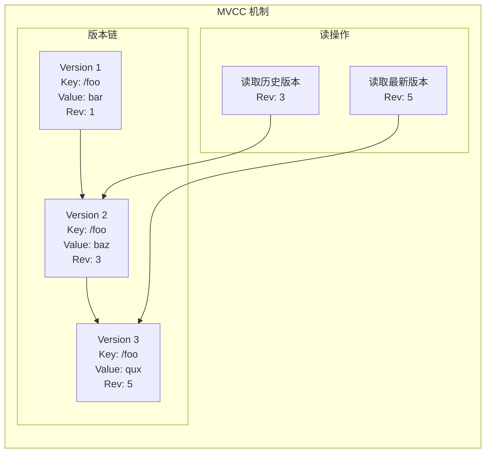
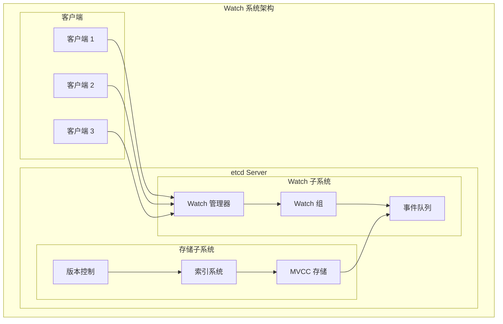
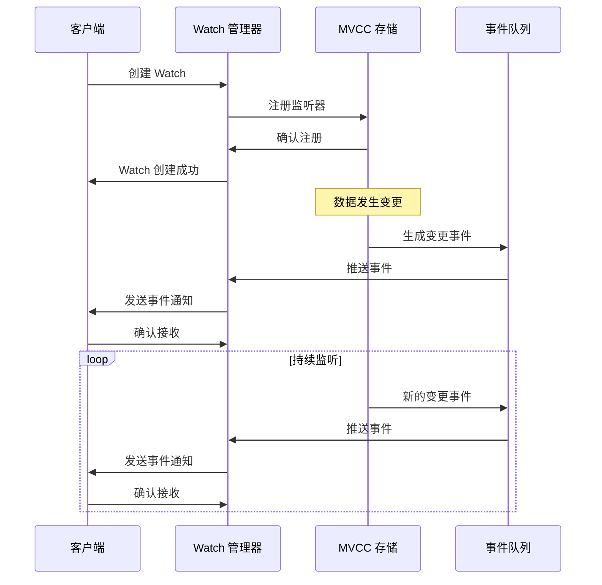

# etcd 架构详解

## 概述

etcd 是 Kubernetes 集群的分布式键值存储数据库，基于 Raft 共识算法实现强一致性，负责存储集群的所有配置信息和状态数据。

## 核心架构



## Raft 共识算法详解

### 1. 节点状态转换



### 2. Leader 选举过程



### 3. 日志复制机制



## 存储架构详解

### 1. 数据存储结构



### 2. 键值存储设计

#### 键空间组织
```
/registry/
├── apiregistration.k8s.io/
│   └── apiservices/
├── apps/
│   ├── deployments/
│   ├── replicasets/
│   └── daemonsets/
├── /
│   ├── pods/
│   ├── services/
│   ├── configmaps/
│   └── secrets/
└── extensions/
    └── ingresses/
```

#### 版本控制机制
```go
type KeyValue struct {
    Key            []byte
    CreateRevision int64  // 创建时的全局版本号
    ModRevision    int64  // 最后修改时的全局版本号
    Version        int64  // 键的版本号（递增）
    Value          []byte
    Lease          int64  // 租约 ID
}
```

### 3. 事务处理

#### MVCC (多版本并发控制)


#### 事务语义
```yaml
# 事务示例：原子性更新多个键
# 条件：如果 /foo 的版本是 1
# 成功：设置 /foo = "bar", /count = "1"
# 失败：设置 /error = "conflict"

txn:
  compare:
    - key: "/foo"
      target: "VERSION"
      version: 1
  success:
    - request_put:
        key: "/foo"
        value: "bar"
    - request_put:
        key: "/count"
        value: "1"
  failure:
    - request_put:
        key: "/error"
        value: "conflict"
```

## Watch 机制详解

### 1. Watch 架构



### 2. Watch 事件流



## 性能优化

### 1. 读性能优化

#### 读优化策略
- **序列化读**: 可以从任何节点读取，不保证强一致性
- **线性化读**: 从 Leader 读取，保证强一致性
- **本地读缓存**: 在内存中缓存热点数据

```go
// 线性化读配置
clientv3.OpGet("key", clientv3.WithSerializable()) // 序列化读
clientv3.OpGet("key")                              // 线性化读
```

### 2. 写性能优化

#### 批量写入
```go
// 批量操作减少网络往返
txn := client.Txn(ctx)
txn.Then(
    clientv3.OpPut("key1", "value1"),
    clientv3.OpPut("key2", "value2"),
    clientv3.OpPut("key3", "value3"),
)
txn.Commit()
```

#### 异步写入
```go
// 异步写入提高吞吐量
ch := make(chan clientv3.OpResponse, 100)
for i := 0; i < 100; i++ {
    go func(i int) {
        resp, err := client.Put(ctx, fmt.Sprintf("key%d", i), fmt.Sprintf("value%d", i))
        ch <- clientv3.OpResponse{Put: resp, Err: err}
    }(i)
}
```

### 3. 存储优化

#### 压缩策略
```yaml
# 自动压缩配置
--auto-compaction-mode=periodic
--auto-compaction-retention=1h

# 手动压缩
etcdctl compact 1000
```

#### 碎片整理
```bash
# 碎片整理命令
etcdctl defrag

# 检查碎片情况
etcdctl endpoint status --cluster -w table
```

## 运维管理

### 1. 集群部署配置

#### 静态配置
```yaml
# etcd.yaml
name: etcd-1
data-dir: /var/lib/etcd
listen-client-urls: https://10.0.0.1:2379
advertise-client-urls: https://10.0.0.1:2379
listen-peer-urls: https://10.0.0.1:2380
initial-advertise-peer-urls: https://10.0.0.1:2380
initial-cluster: etcd-1=https://10.0.0.1:2380,etcd-2=https://10.0.0.2:2380,etcd-3=https://10.0.0.3:2380
initial-cluster-state: new
initial-cluster-token: etcd-cluster-1

# 安全配置
client-cert-auth: true
trusted-ca-file: /etc/etcd/ca.crt
cert-file: /etc/etcd/server.crt
key-file: /etc/etcd/server.key
peer-client-cert-auth: true
peer-trusted-ca-file: /etc/etcd/ca.crt
peer-cert-file: /etc/etcd/peer.crt
peer-key-file: /etc/etcd/peer.key
```

### 2. 监控指标

#### 关键指标
```yaml
# 性能指标
- etcd_server_has_leader: 是否有 Leader
- etcd_server_leader_changes_seen_total: Leader 变更次数
- etcd_server_proposals_committed_total: 提交的提案数
- etcd_server_proposals_applied_total: 应用的提案数
- etcd_disk_wal_fsync_duration_seconds: WAL fsync 延迟
- etcd_disk_backend_commit_duration_seconds: 后端提交延迟

# 容量指标
- etcd_mvcc_db_total_size_in_bytes: 数据库总大小
- etcd_mvcc_db_total_size_in_use_in_bytes: 使用中的数据库大小
- etcd_server_quota_backend_bytes: 后端配额

# 网络指标
- etcd_network_client_grpc_received_bytes_total: gRPC 接收字节数
- etcd_network_client_grpc_sent_bytes_total: gRPC 发送字节数
```

### 3. 备份恢复

#### 备份策略
```bash
# 创建快照备份
etcdctl snapshot save backup.db \
  --endpoints=https://127.0.0.1:2379 \
  --cacert=/etc/etcd/ca.crt \
  --cert=/etc/etcd/server.crt \
  --key=/etc/etcd/server.key

# 验证快照
etcdctl snapshot status backup.db -w table
```

#### 恢复流程
```bash
# 从快照恢复
etcdctl snapshot restore backup.db \
  --name etcd-1 \
  --initial-cluster etcd-1=https://10.0.0.1:2380,etcd-2=https://10.0.0.2:2380,etcd-3=https://10.0.0.3:2380 \
  --initial-cluster-token etcd-cluster-1 \
  --initial-advertise-peer-urls https://10.0.0.1:2380
```

## 故障排除

### 1. 常见问题诊断

#### 集群健康检查
```bash
# 检查集群状态
etcdctl endpoint health --cluster

# 检查成员列表
etcdctl member list

# 检查性能
etcdctl check perf
```

#### 网络分区处理
```bash
# 检查网络连通性
etcdctl endpoint status --cluster -w table

# 查看 Leader 状态
etcdctl endpoint status --cluster | grep "true"
```

### 2. 性能问题调优

#### 慢查询分析
```bash
# 启用慢查询日志
--log-level=debug
--enable-pprof

# 分析慢查询
curl http://localhost:2379/debug/pprof/trace
```

#### I/O 优化
```yaml
# 磁盘优化配置
--wal-dir=/fast-ssd/etcd/wal
--data-dir=/ssd/etcd/data
--max-wals=5
--max-snapshots=5
```