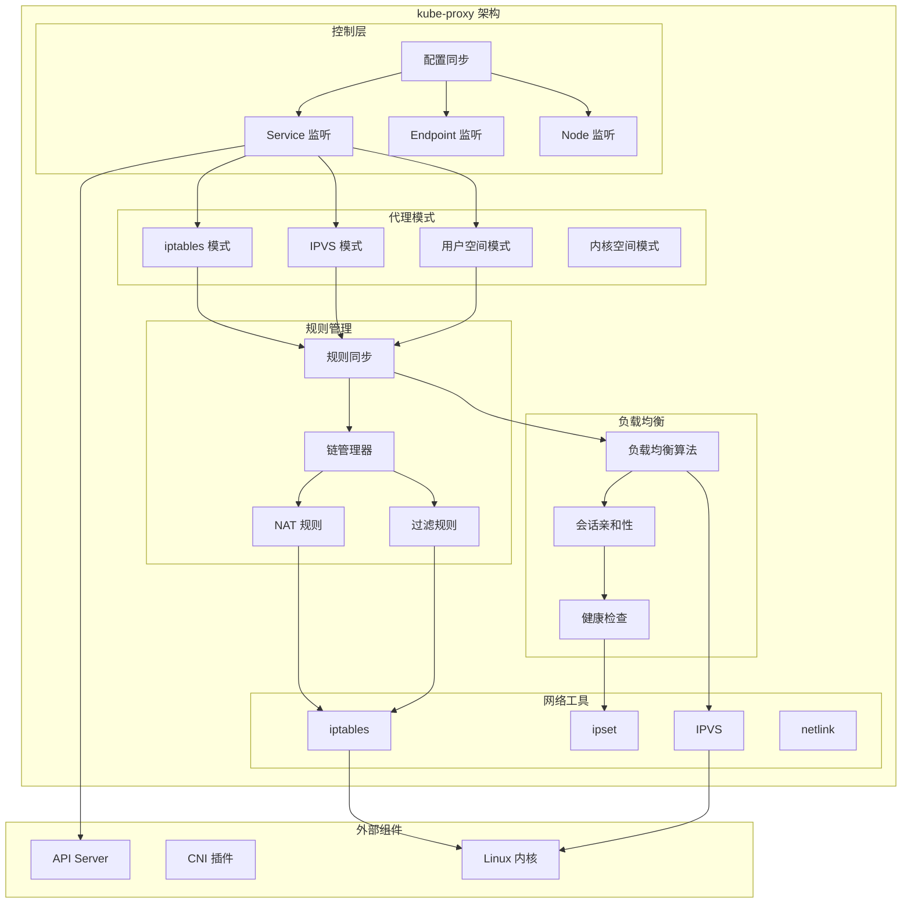
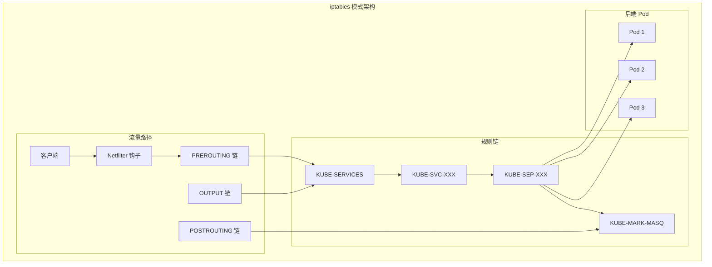
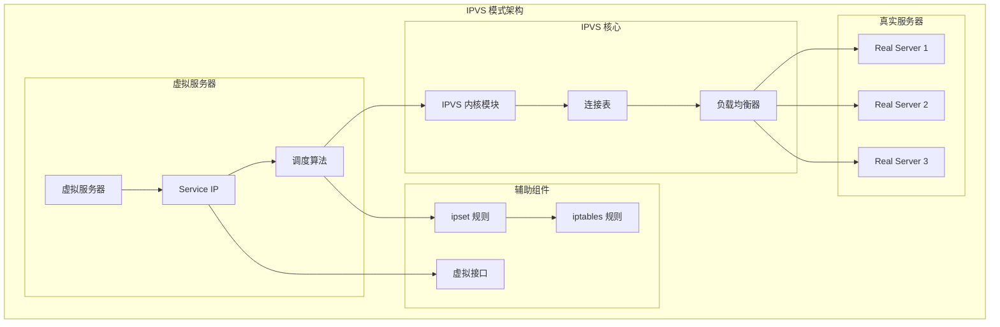
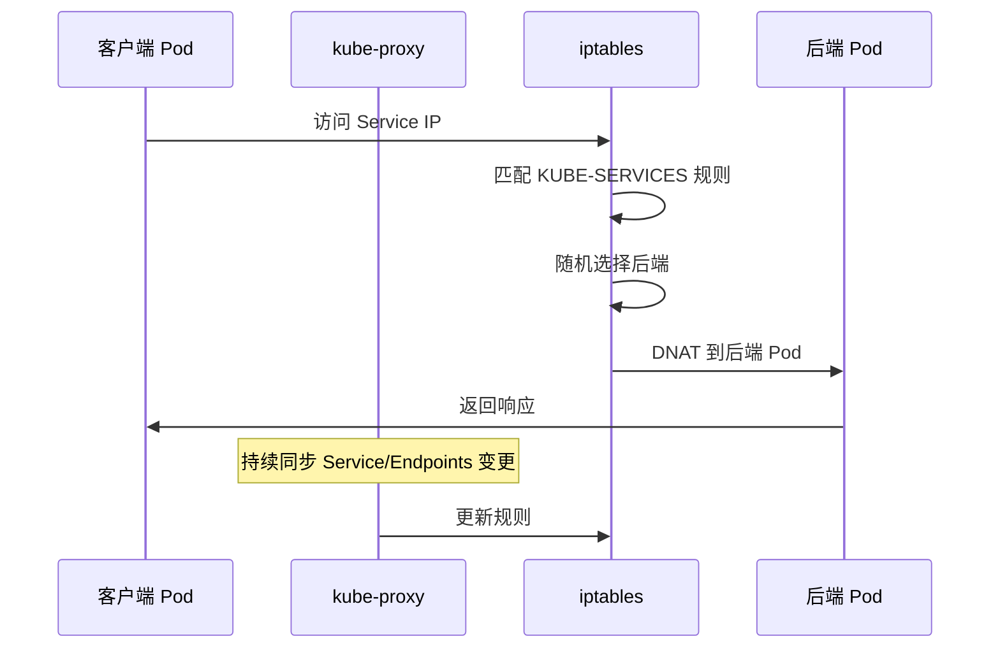
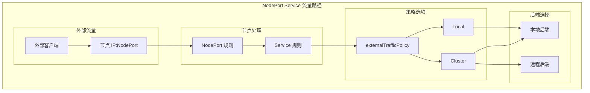
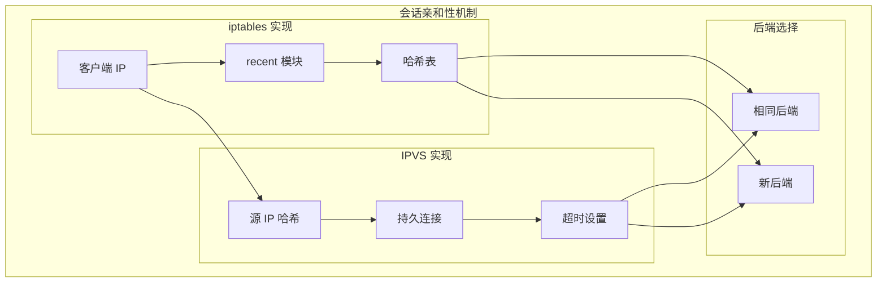
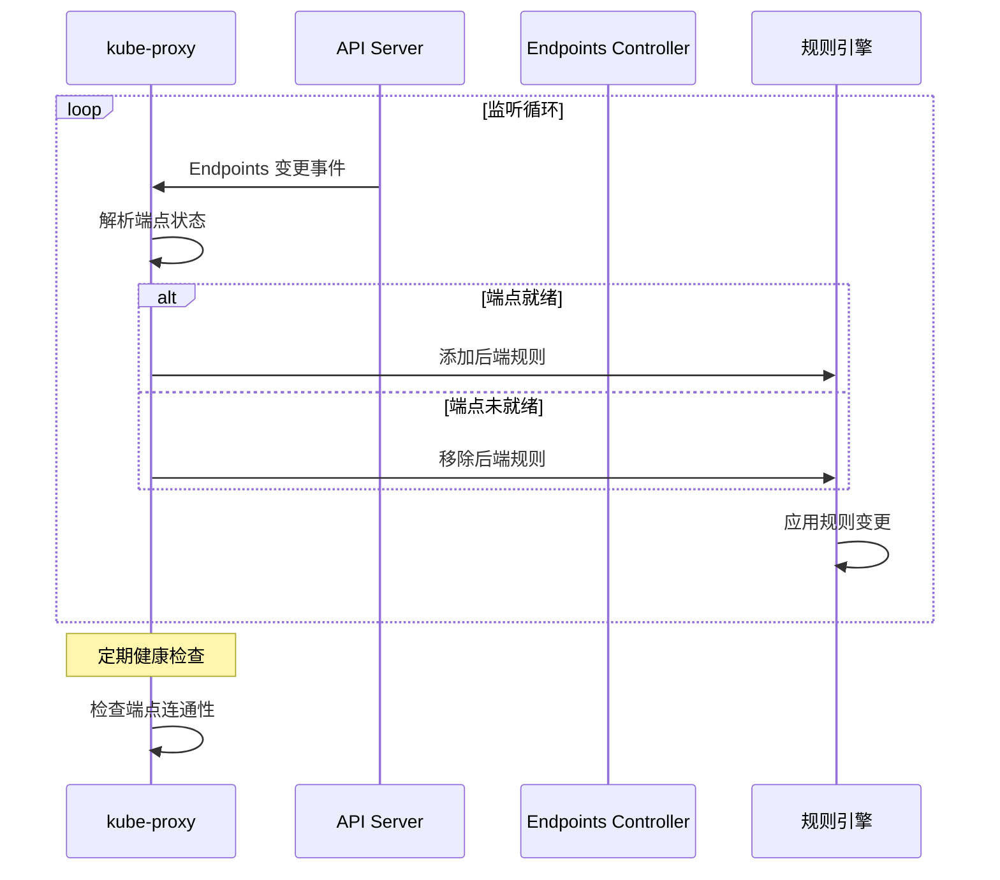
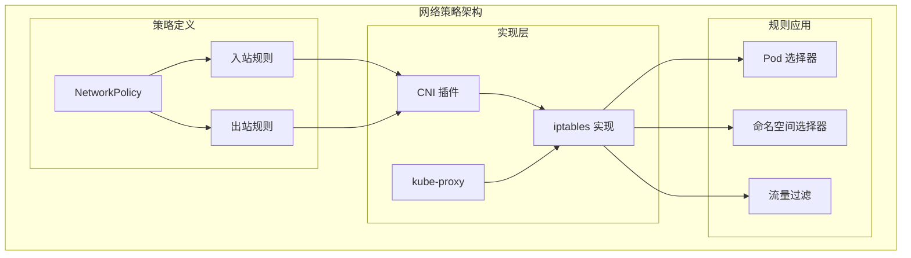

# kube-proxy 架构详解

## 概述

kube-proxy 是运行在每个节点上的网络代理，负责维护节点上的网络规则，实现 Service 的负载均衡和服务发现。它是 Kubernetes 网络模型的核心实现组件。

## 核心架构



## 代理模式详解

### 1. iptables 模式

#### 工作原理


#### iptables 规则示例
```bash
# Service 主链规则
-A KUBE-SERVICES -d 10.96.0.1/32 -p tcp -m tcp --dport 443 -j KUBE-SVC-NPX46M4PTMTKRN6Y

# Service 分发规则
-A KUBE-SVC-NPX46M4PTMTKRN6Y -m statistic --mode random --probability 0.33333333349 -j KUBE-SEP-ID6YWIT3F6WNZ47P
-A KUBE-SVC-NPX46M4PTMTKRN6Y -m statistic --mode random --probability 0.50000000000 -j KUBE-SEP-YCS0DXZDXPBD4J4C
-A KUBE-SVC-NPX46M4PTMTKRN6Y -j KUBE-SEP-4EZBCR6Q4P6MZRM4

# Endpoint 规则
-A KUBE-SEP-ID6YWIT3F6WNZ47P -s 10.244.0.2/32 -j KUBE-MARK-MASQ
-A KUBE-SEP-ID6YWIT3F6WNZ47P -p tcp -m tcp -j DNAT --to-destination 10.244.0.2:8080

# MASQUERADE 规则
-A KUBE-MARK-MASQ -j MARK --set-xmark 0x4000/0x4000
-A KUBE-POSTROUTING -m mark --mark 0x4000/0x4000 -j MASQUERADE
```

### 2. IPVS 模式

#### 工作原理


#### IPVS 配置示例
```bash
# 查看 IPVS 规则
ipvsadm -L -n
# IP Virtual Server version 1.2.1 (size=4096)
# Prot LocalAddress:Port Scheduler Flags
#   -> RemoteAddress:Port           Forward Weight ActiveConn InActConn
# TCP  10.96.0.1:443 rr
#   -> 10.244.0.2:8080             Masq    1      0          0
#   -> 10.244.0.3:8080             Masq    1      0          0
#   -> 10.244.0.4:8080             Masq    1      0          0

# IPVS 调度算法
rr    # Round Robin
wrr   # Weighted Round Robin
lc    # Least Connections
wlc   # Weighted Least Connections
sh    # Source Hashing
dh    # Destination Hashing
```

### 3. 模式对比

```yaml
# 性能对比
iptables 模式:
  优点:
    - 成熟稳定，兼容性好
    - 无需额外内核模块
    - 规则清晰，易于调试
  缺点:
    - 性能随 Service 数量线性下降
    - 规则数量庞大时性能差
    - 负载均衡算法有限

IPVS 模式:
  优点:
    - 高性能，O(1) 查找复杂度
    - 丰富的负载均衡算法
    - 支持会话保持
    - 更好的网络吞吐量
  缺点:
    - 需要 IPVS 内核模块
    - 调试相对复杂
    - 对内核版本有要求
```

## Service 类型处理

### 1. ClusterIP Service



### 2. NodePort Service



### 3. LoadBalancer Service

```yaml
# LoadBalancer Service 示例
apiVersion: v1
kind: Service
metadata:
  name: my-service
spec:
  type: LoadBalancer
  ports:
  - port: 80
    targetPort: 8080
    protocol: TCP
  selector:
    app: my-app
  externalTrafficPolicy: Local  # 或 Cluster
  loadBalancerSourceRanges:
  - 10.0.0.0/8
  - 192.168.0.0/16
```

## 会话亲和性

### 1. ClientIP 亲和性



### 2. 配置示例

```yaml
# Service 会话亲和性配置
apiVersion: v1
kind: Service
metadata:
  name: my-service
spec:
  ports:
  - port: 80
    targetPort: 8080
  selector:
    app: my-app
  sessionAffinity: ClientIP
  sessionAffinityConfig:
    clientIP:
      timeoutSeconds: 10800  # 3小时
```

## 健康检查和端点管理

### 1. 端点状态同步



### 2. 端点过滤策略

```go
// 端点过滤逻辑
func (proxier *Proxier) filterEndpoints(endpoints []discovery.Endpoint) []discovery.Endpoint {
    var filtered []discovery.Endpoint
    
    for _, endpoint := range endpoints {
        // 检查端点就绪状态
        if endpoint.Conditions.Ready != nil && *endpoint.Conditions.Ready {
            // 检查端点终止状态
            if endpoint.Conditions.Terminating == nil || !*endpoint.Conditions.Terminating {
                filtered = append(filtered, endpoint)
            }
        }
    }
    
    return filtered
}
```

## 网络策略集成

### 1. NetworkPolicy 支持



### 2. 规则协调

```yaml
# NetworkPolicy 示例
apiVersion: networking.k8s.io/v1
kind: NetworkPolicy
metadata:
  name: deny-all
  namespace: production
spec:
  podSelector: {}
  policyTypes:
  - Ingress
  - Egress
  ingress:
  - from:
    - namespaceSelector:
        matchLabels:
          name: frontend
    ports:
    - protocol: TCP
      port: 8080
```

## 性能优化

### 1. 规则优化策略

```bash
# iptables 优化
# 使用 ipset 减少规则数量
ipset create KUBE-CLUSTER-IP hash:ip,port
ipset add KUBE-CLUSTER-IP 10.96.0.1,tcp:443
iptables -A KUBE-SERVICES -m set --match-set KUBE-CLUSTER-IP dst,dst -j KUBE-SVC-XXX

# IPVS 优化
# 启用连接复用
echo 1 > /proc/sys/net/ipv4/vs/conn_reuse_mode

# 调整连接超时
echo 900 > /proc/sys/net/ipv4/vs/timeout_tcp
echo 120 > /proc/sys/net/ipv4/vs/timeout_tcp_fin
```

### 2. 监控指标

```yaml
# kube-proxy 关键指标
kubeproxy_sync_proxy_rules_duration_seconds: 规则同步耗时
kubeproxy_sync_proxy_rules_last_timestamp_seconds: 最后同步时间
kubeproxy_network_programming_duration_seconds: 网络编程延迟
rest_client_requests_total: API 请求总数
rest_client_request_duration_seconds: API 请求延迟
```

## 故障排除

### 1. 常见问题诊断

```bash
# 检查 kube-proxy 状态
kubectl get pods -n kube-system -l k8s-app=kube-proxy

# 查看 kube-proxy 日志
kubectl logs -n kube-system -l k8s-app=kube-proxy

# 检查 iptables 规则
iptables -t nat -L KUBE-SERVICES
iptables -t nat -L KUBE-SVC-XXX

# 检查 IPVS 规则
ipvsadm -L -n

# 检查 Service 和 Endpoints
kubectl get svc
kubectl get endpoints
```

### 2. 网络连通性测试

```bash
# 测试 Service 连通性
kubectl run test-pod --image=busybox --rm -it -- sh
nslookup my-service
wget -O- http://my-service:80

# 检查 DNS 解析
kubectl exec -it test-pod -- nslookup kubernetes.default

# 测试跨节点连通性
kubectl exec -it pod1 -- ping <pod2-ip>
```

## 配置和部署

### 1. DaemonSet 部署

```yaml
apiVersion: apps/v1
kind: DaemonSet
metadata:
  name: kube-proxy
  namespace: kube-system
spec:
  selector:
    matchLabels:
      k8s-app: kube-proxy
  template:
    metadata:
      labels:
        k8s-app: kube-proxy
    spec:
      containers:
      - name: kube-proxy
        image: k8s.gcr.io/kube-proxy:v1.21.0
        command:
        - /usr/local/bin/kube-proxy
        - --config=/var/lib/kube-proxy/config.conf
        - --hostname-override=$(NODE_NAME)
        env:
        - name: NODE_NAME
          valueFrom:
            fieldRef:
              fieldPath: spec.nodeName
        securityContext:
          privileged: true
        volumeMounts:
        - name: kube-proxy
          mountPath: /var/lib/kube-proxy
        - name: xtables-lock
          mountPath: /run/xtables.lock
        - name: lib-modules
          mountPath: /lib/modules
          readOnly: true
      hostNetwork: true
      serviceAccountName: kube-proxy
      volumes:
      - name: kube-proxy
        configMap:
          name: kube-proxy
      - name: xtables-lock
        hostPath:
          path: /run/xtables.lock
          type: FileOrCreate
      - name: lib-modules
        hostPath:
          path: /lib/modules
```

### 2. 配置优化

```yaml
# kube-proxy 配置
apiVersion: kubeproxy.config.k8s.io/v1alpha1
kind: KubeProxyConfiguration
bindAddress: 0.0.0.0
clientConnection:
  kubeconfig: /var/lib/kube-proxy/kubeconfig.conf
clusterCIDR: 10.244.0.0/16
configSyncPeriod: 15m0s
conntrack:
  maxPerCore: 32768
  min: 131072
  tcpCloseWaitTimeout: 1h0m0s
  tcpEstablishedTimeout: 24h0m0s
enableProfiling: false
healthzBindAddress: 0.0.0.0:10256
hostnameOverride: ""
iptables:
  masqueradeAll: false
  masqueradeBit: 14
  minSyncPeriod: 0s
  syncPeriod: 30s
ipvs:
  excludeCIDRs: null
  minSyncPeriod: 0s
  scheduler: "rr"
  strictARP: false
  syncPeriod: 30s
  tcpFinTimeout: 0s
  tcpTimeout: 0s
  udpTimeout: 0s
kind: KubeProxyConfiguration
metricsBindAddress: 127.0.0.1:10249
mode: "ipvs"  # 或 "iptables"
nodePortAddresses: null
oomScoreAdj: -999
portRange: ""
udpIdleTimeout: 250ms
winkernel:
  enableDSR: false
  networkName: ""
  sourceVip: ""
```

## 最佳实践

### 1. 性能调优

```bash
# 内核参数优化
echo 'net.netfilter.nf_conntrack_max = 1000000' >> /etc/sysctl.conf
echo 'net.netfilter.nf_conntrack_tcp_timeout_established = 86400' >> /etc/sysctl.conf
echo 'net.core.netdev_max_backlog = 5000' >> /etc/sysctl.conf

# IPVS 调优
echo 'net.ipv4.vs.conn_reuse_mode = 1' >> /etc/sysctl.conf
echo 'net.ipv4.vs.expire_nodest_conn = 1' >> /etc/sysctl.conf
```

### 2. 监控告警

```yaml
# kube-proxy 监控规则
groups:
- name: kube-proxy
  rules:
  - alert: KubeProxyDown
    expr: up{job="kube-proxy"} == 0
    for: 5m
    
  - alert: KubeProxyRulesSyncFailure
    expr: increase(kubeproxy_sync_proxy_rules_duration_seconds_count{quantile="0.99"}[5m]) > 0
    for: 5m
    
  - alert: KubeProxyHighLatency
    expr: histogram_quantile(0.99, kubeproxy_network_programming_duration_seconds_bucket) > 1
    for: 10m
```

### 3. 安全加固

```yaml
# RBAC 配置
apiVersion: rbac.authorization.k8s.io/v1
kind: ClusterRole
metadata:
  name: system:kube-proxy
rules:
- apiGroups: [""]
  resources: ["services", "endpoints"]
  verbs: ["get", "list", "watch"]
- apiGroups: [""]
  resources: ["nodes"]
  verbs: ["get"]
- apiGroups: ["discovery.k8s.io"]
  resources: ["endpointslices"]
  verbs: ["get", "list", "watch"]
```