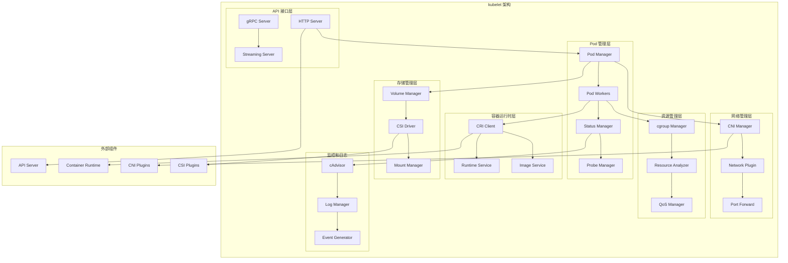
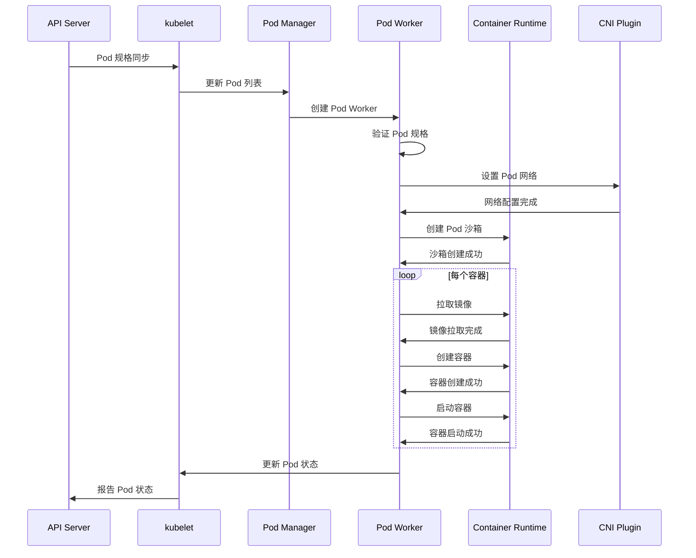
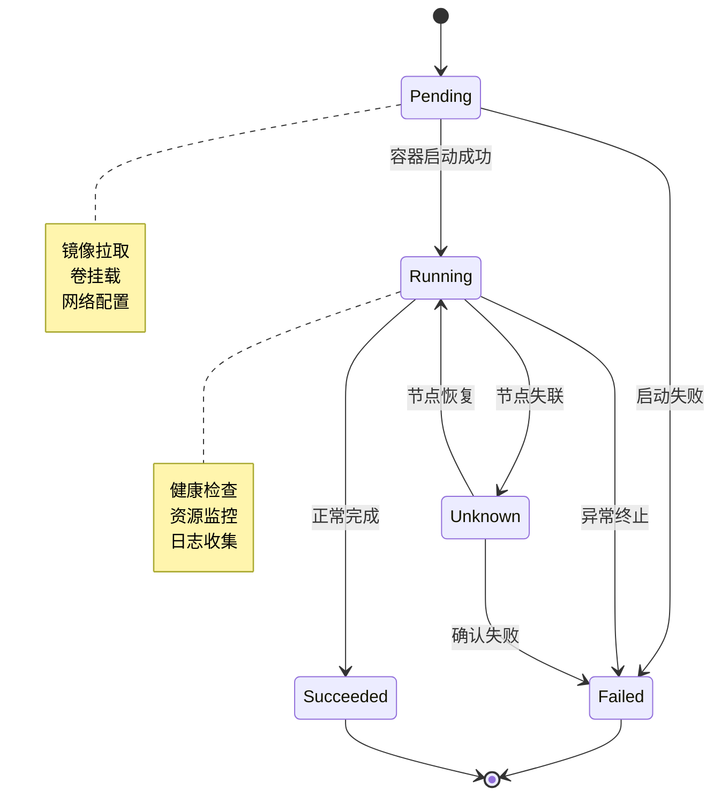
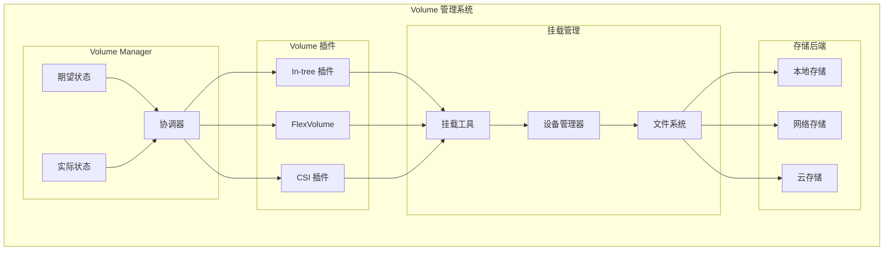
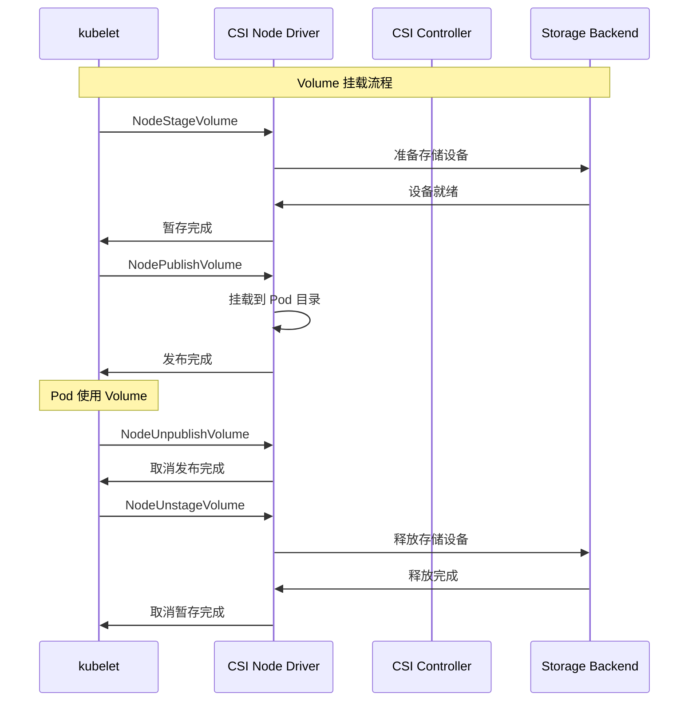
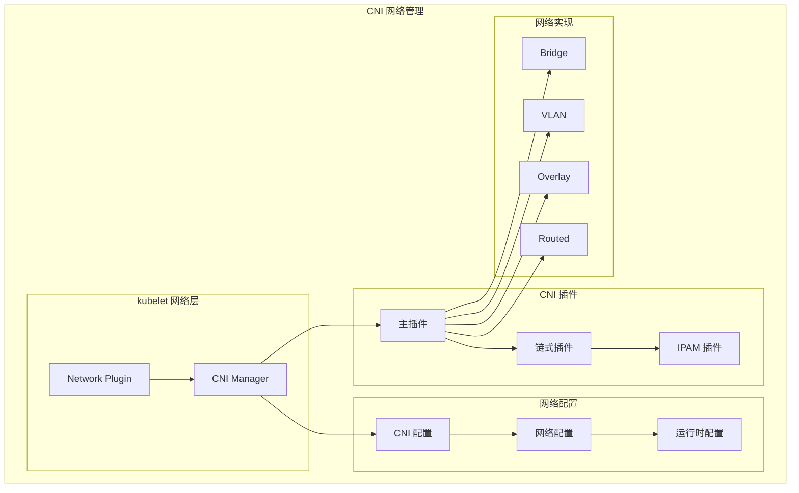
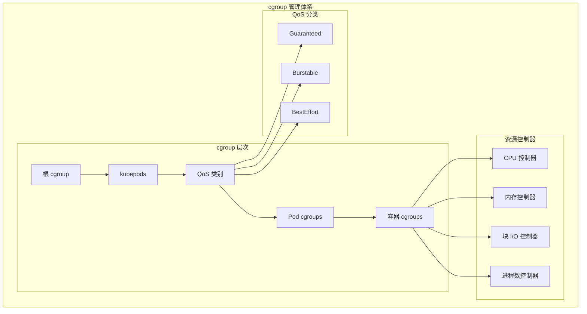
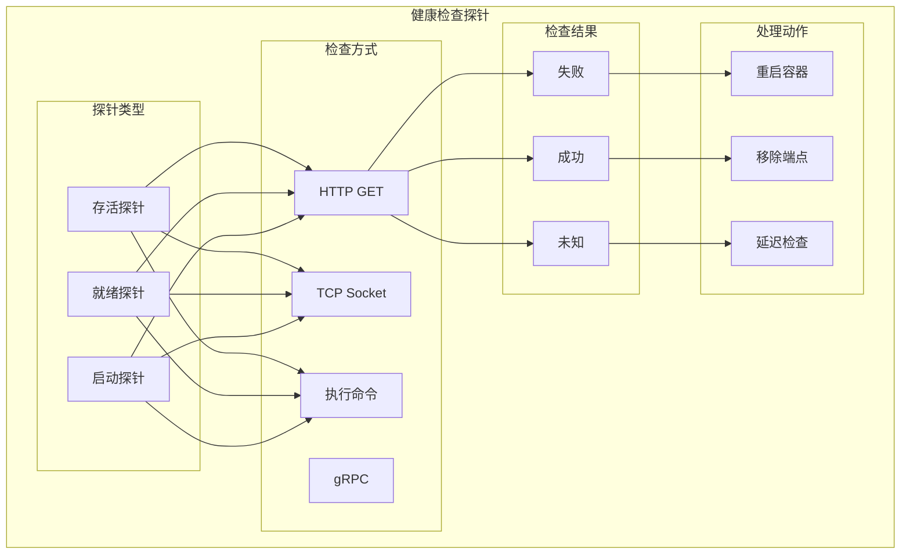
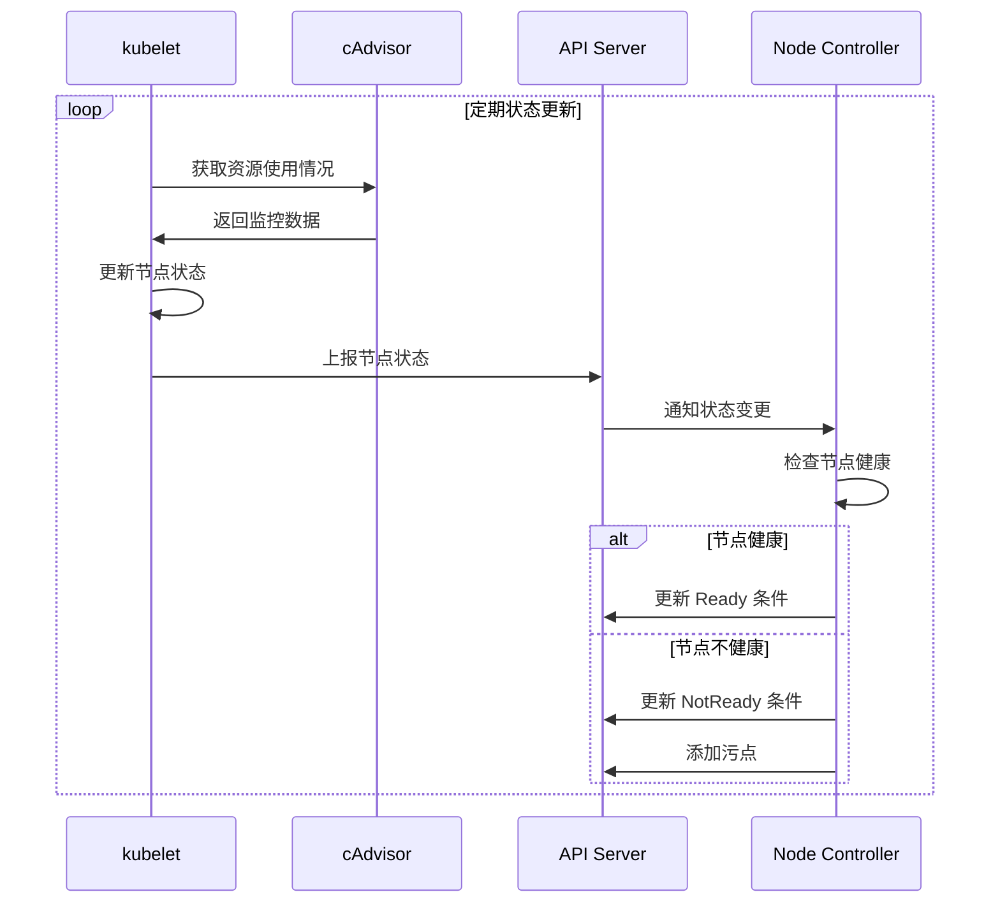

# kubelet 架构详解

## 概述

kubelet 是运行在每个节点上的主要节点代理，负责管理节点上 Pod 的生命周期、容器运行时交互、资源监控和节点状态报告。它是 Kubernetes 集群中连接 Control Plane 和 Worker Node 的关键组件。

## 核心架构



## Pod 生命周期管理

### 1. Pod 同步流程



### 2. Pod 状态机



## 容器运行时接口 (CRI)

### 1. CRI 架构

```mermaid
graph TB
    subgraph "CRI 接口层"
        subgraph "kubelet CRI 客户端"
            RUNTIME_CLIENT[Runtime Client]
            IMAGE_CLIENT[Image Client]
        end
        
        subgraph "CRI 实现"
            CRI_RUNTIME[CRI Runtime]
            subgraph "Runtime 实现"
                CONTAINERD[containerd]
                CRI_O[CRI-O]
                DOCKER[Docker (deprecated)]
            end
        end
        
        subgraph "底层容器引擎"
            OCI_RUNTIME[OCI Runtime]
            RUNC[runc]
            KATA[Kata Containers]
        end
    end
    
    RUNTIME_CLIENT --> CRI_RUNTIME
    IMAGE_CLIENT --> CRI_RUNTIME
    
    CRI_RUNTIME --> CONTAINERD
    CRI_RUNTIME --> CRI_O
    CRI_RUNTIME --> DOCKER
    
    CONTAINERD --> OCI_RUNTIME
    CRI_O --> OCI_RUNTIME
    
    OCI_RUNTIME --> RUNC
    OCI_RUNTIME --> KATA
```

### 2. CRI 服务接口

#### Runtime Service
```protobuf
service RuntimeService {
    // Pod 沙箱管理
    rpc RunPodSandbox(RunPodSandboxRequest) returns (RunPodSandboxResponse);
    rpc StopPodSandbox(StopPodSandboxRequest) returns (StopPodSandboxResponse);
    rpc RemovePodSandbox(RemovePodSandboxRequest) returns (RemovePodSandboxResponse);
    rpc PodSandboxStatus(PodSandboxStatusRequest) returns (PodSandboxStatusResponse);
    rpc ListPodSandbox(ListPodSandboxRequest) returns (ListPodSandboxResponse);
    
    // 容器管理
    rpc CreateContainer(CreateContainerRequest) returns (CreateContainerResponse);
    rpc StartContainer(StartContainerRequest) returns (StartContainerResponse);
    rpc StopContainer(StopContainerRequest) returns (StopContainerResponse);
    rpc RemoveContainer(RemoveContainerRequest) returns (RemoveContainerResponse);
    rpc ListContainers(ListContainersRequest) returns (ListContainersResponse);
    rpc ContainerStatus(ContainerStatusRequest) returns (ContainerStatusResponse);
    
    // 执行命令
    rpc ExecSync(ExecSyncRequest) returns (ExecSyncResponse);
    rpc Exec(ExecRequest) returns (ExecResponse);
    rpc Attach(AttachRequest) returns (AttachResponse);
    rpc PortForward(PortForwardRequest) returns (PortForwardResponse);
}
```

#### Image Service
```protobuf
service ImageService {
    // 镜像管理
    rpc ListImages(ListImagesRequest) returns (ListImagesResponse);
    rpc ImageStatus(ImageStatusRequest) returns (ImageStatusResponse);
    rpc PullImage(PullImageRequest) returns (PullImageResponse);
    rpc RemoveImage(RemoveImageRequest) returns (RemoveImageResponse);
    rpc ImageFsInfo(ImageFsInfoRequest) returns (ImageFsInfoResponse);
}
```

## 存储管理

### 1. Volume 管理架构



### 2. CSI 集成



## 网络管理

### 1. CNI 集成架构



### 2. Pod 网络设置流程

```bash
# CNI 调用示例
{
  "cniVersion": "1.0.0",
  "name": "my-network",
  "type": "bridge",
  "bridge": "cni0",
  "isDefaultGateway": true,
  "ipMasq": true,
  "hairpinMode": true,
  "ipam": {
    "type": "host-local",
    "subnet": "10.244.0.0/16",
    "gateway": "10.244.0.1"
  }
}
```

## 资源管理

### 1. cgroup 管理



### 2. QoS 管理策略

```yaml
# Guaranteed QoS
apiVersion: v1
kind: Pod
spec:
  containers:
  - name: app
    resources:
      requests:
        cpu: "1000m"
        memory: "1Gi"
      limits:
        cpu: "1000m"    # requests == limits
        memory: "1Gi"   # requests == limits

---
# Burstable QoS
apiVersion: v1
kind: Pod
spec:
  containers:
  - name: app
    resources:
      requests:
        cpu: "500m"
        memory: "512Mi"
      limits:
        cpu: "1000m"    # limits > requests
        memory: "1Gi"   # limits > requests

---
# BestEffort QoS
apiVersion: v1
kind: Pod
spec:
  containers:
  - name: app
    # 没有 resources 配置
```

## 健康检查

### 1. 探针类型



### 2. 探针配置示例

```yaml
apiVersion: v1
kind: Pod
spec:
  containers:
  - name: app
    image: nginx
    ports:
    - containerPort: 80
    
    # 启动探针
    startupProbe:
      httpGet:
        path: /health
        port: 80
      initialDelaySeconds: 10    # 初始延迟
      periodSeconds: 10          # 检查间隔
      timeoutSeconds: 5          # 超时时间
      failureThreshold: 30       # 失败阈值
      successThreshold: 1        # 成功阈值
    
    # 存活探针
    livenessProbe:
      httpGet:
        path: /health
        port: 80
      initialDelaySeconds: 30
      periodSeconds: 10
      timeoutSeconds: 5
      failureThreshold: 3
      successThreshold: 1
    
    # 就绪探针
    readinessProbe:
      httpGet:
        path: /ready
        port: 80
      initialDelaySeconds: 5
      periodSeconds: 5
      timeoutSeconds: 3
      failureThreshold: 3
      successThreshold: 1
```

## 节点状态管理

### 1. 节点状态报告



### 2. 节点状态结构

```yaml
# 节点状态示例
apiVersion: v1
kind: Node
status:
  conditions:
  - type: Ready
    status: "True"
    lastHeartbeatTime: "2023-01-01T12:00:00Z"
    lastTransitionTime: "2023-01-01T11:00:00Z"
    reason: KubeletReady
    message: kubelet is posting ready status
  - type: OutOfDisk
    status: "False"
    lastHeartbeatTime: "2023-01-01T12:00:00Z"
    lastTransitionTime: "2023-01-01T11:00:00Z"
    reason: KubeletHasSufficientDisk
    message: kubelet has sufficient disk space available
  - type: MemoryPressure
    status: "False"
    lastHeartbeatTime: "2023-01-01T12:00:00Z"
    lastTransitionTime: "2023-01-01T11:00:00Z"
    reason: KubeletHasSufficientMemory
    message: kubelet has sufficient memory available
  - type: DiskPressure
    status: "False"
    lastHeartbeatTime: "2023-01-01T12:00:00Z"
    lastTransitionTime: "2023-01-01T11:00:00Z"
    reason: KubeletHasNoDiskPressure
    message: kubelet has no disk pressure
  - type: PIDPressure
    status: "False"
    lastHeartbeatTime: "2023-01-01T12:00:00Z"
    lastTransitionTime: "2023-01-01T11:00:00Z"
    reason: KubeletHasSufficientPID
    message: kubelet has sufficient PID available
  capacity:
    cpu: "4"
    ephemeral-storage: "100Gi"
    hugepages-1Gi: "0"
    hugepages-2Mi: "0"
    memory: "8Gi"
    pods: "110"
  allocatable:
    cpu: "3800m"
    ephemeral-storage: "92Gi"
    hugepages-1Gi: "0"
    hugepages-2Mi: "0"
    memory: "7.5Gi"
    pods: "110"
```

## 性能优化

### 1. kubelet 配置优化

```yaml
# kubelet 配置文件
apiVersion: kubelet.config.k8s.io/v1beta1
kind: KubeletConfiguration
address: 0.0.0.0
port: 10250
readOnlyPort: 10255
authentication:
  anonymous:
    enabled: false
  webhook:
    enabled: true
  x509:
    clientCAFile: /etc/kubernetes/pki/ca.crt
authorization:
  mode: Webhook
clusterDomain: cluster.local
clusterDNS:
- 10.96.0.10
runtimeRequestTimeout: 15m
hairpinMode: hairpin-veth
maxPods: 110
podCIDR: 10.244.0.0/24
resolvConf: /etc/resolv.conf
rotateCertificates: true
serverTLSBootstrap: true
staticPodPath: /etc/kubernetes/manifests
syncFrequency: 1m
fileCheckFrequency: 20s
httpCheckFrequency: 20s
nodeStatusUpdateFrequency: 10s
nodeStatusReportFrequency: 1m
imageMinimumGCAge: 2m
imageGCHighThresholdPercent: 85
imageGCLowThresholdPercent: 80
volumeStatsAggPeriod: 1m
kubeletCgroups: /systemd/system.slice
systemCgroups: /systemd/system.slice
cgroupRoot: /
cgroupsPerQOS: true
cgroupDriver: systemd
runtimeRequestTimeout: 2m
serializeImagePulls: false
maxParallelImagePulls: 5
```

### 2. 资源限制和预留

```yaml
# 节点资源配置
kind: KubeletConfiguration
systemReserved:
  cpu: 500m
  memory: 1Gi
  ephemeral-storage: 10Gi
kubeReserved:
  cpu: 500m
  memory: 1Gi
  ephemeral-storage: 10Gi
evictionHard:
  memory.available: "100Mi"
  nodefs.available: "10%"
  nodefs.inodesFree: "5%"
  imagefs.available: "15%"
evictionSoft:
  memory.available: "200Mi"
  nodefs.available: "15%"
  nodefs.inodesFree: "10%"
  imagefs.available: "20%"
evictionSoftGracePeriod:
  memory.available: "1m30s"
  nodefs.available: "1m30s"
  nodefs.inodesFree: "1m30s"
  imagefs.available: "1m30s"
```

## 故障排除

### 1. 常见问题诊断

```bash
# 检查 kubelet 状态
systemctl status kubelet

# 查看 kubelet 日志
journalctl -u kubelet -f

# 检查 kubelet 配置
kubelet --help
cat /var/lib/kubelet/config.yaml

# 查看节点状态
kubectl describe node <node-name>

# 检查 Pod 状态
kubectl get pods -o wide
kubectl describe pod <pod-name>
```

### 2. 性能问题排查

```bash
# 查看资源使用情况
kubectl top node
kubectl top pod --all-namespaces

# 检查 cgroup 限制
cat /sys/fs/cgroup/memory/kubepods/memory.limit_in_bytes
cat /sys/fs/cgroup/cpu/kubepods/cpu.cfs_quota_us

# 分析容器运行时
crictl ps
crictl logs <container-id>
crictl stats

# 网络诊断
ip addr show
iptables -L -n
```

## 最佳实践

### 1. kubelet 部署配置

```yaml
# systemd 服务配置
[Unit]
Description=kubelet: The Kubernetes Node Agent
Documentation=https://kubernetes.io/docs/
Wants=network-online.target
After=network-online.target

[Service]
ExecStart=/usr/bin/kubelet
Restart=always
StartLimitInterval=0
RestartSec=10

[Install]
WantedBy=multi-user.target
```

### 2. 监控和告警

```yaml
# kubelet 监控指标
kubelet_running_pods: 运行中的 Pod 数量
kubelet_running_containers: 运行中的容器数量
kubelet_volume_stats_capacity_bytes: 卷容量
kubelet_volume_stats_available_bytes: 卷可用空间
kubelet_node_config_error: 节点配置错误
kubelet_pleg_relist_duration_seconds: PLEG 重新列举耗时
kubelet_pod_start_duration_seconds: Pod 启动耗时
```

### 3. 安全加固

```yaml
# 安全配置
authentication:
  webhook:
    enabled: true
    cacheTTL: 0s
authorization:
  mode: Webhook
tlsCertFile: /var/lib/kubelet/pki/kubelet.crt
tlsPrivateKeyFile: /var/lib/kubelet/pki/kubelet.key
tlsCipherSuites:
- TLS_ECDHE_ECDSA_WITH_AES_128_GCM_SHA256
- TLS_ECDHE_RSA_WITH_AES_128_GCM_SHA256
- TLS_ECDHE_ECDSA_WITH_CHACHA20_POLY1305
- TLS_ECDHE_RSA_WITH_AES_256_GCM_SHA384
- TLS_ECDHE_RSA_WITH_CHACHA20_POLY1305
- TLS_ECDHE_ECDSA_WITH_AES_256_GCM_SHA384
- TLS_RSA_WITH_AES_256_GCM_SHA384
- TLS_RSA_WITH_AES_128_GCM_SHA256
