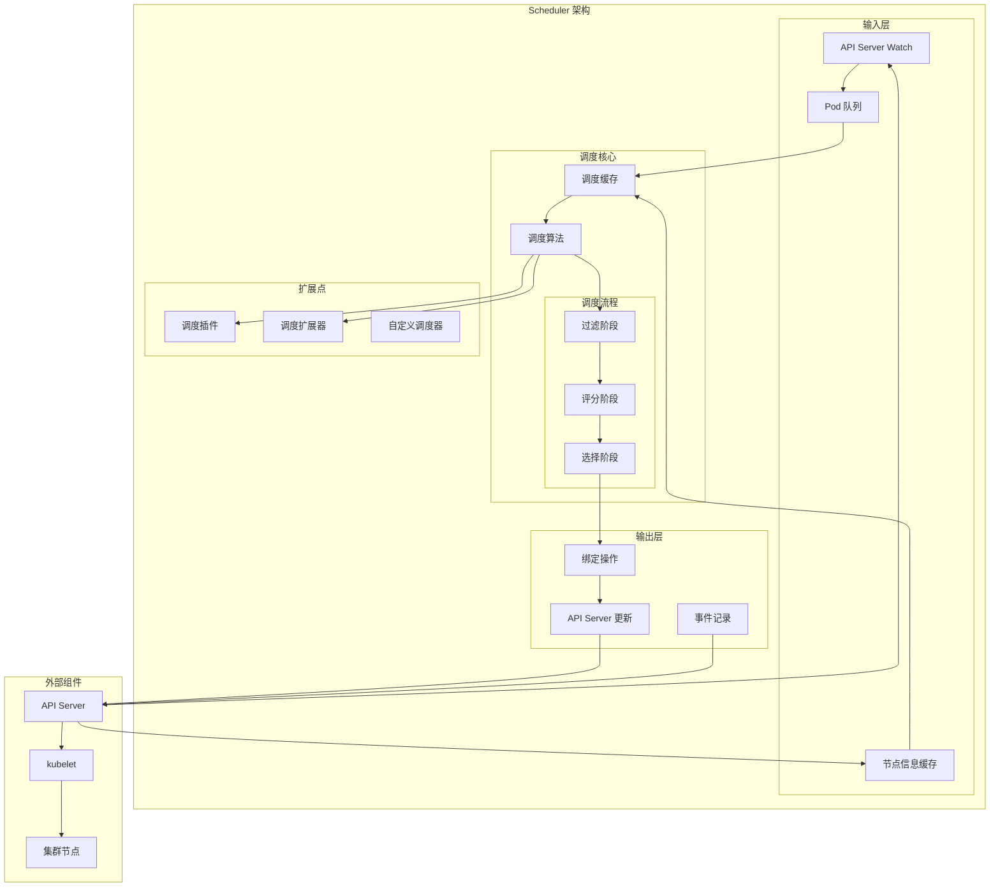
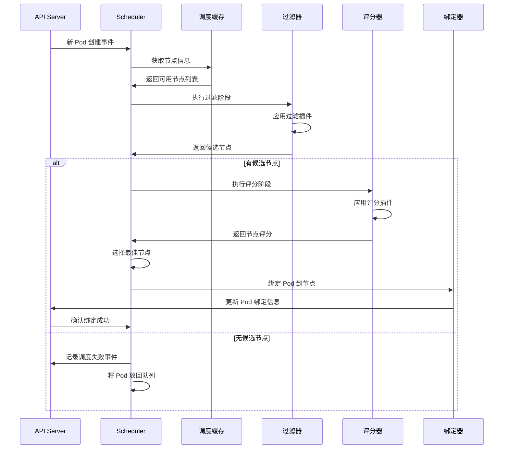
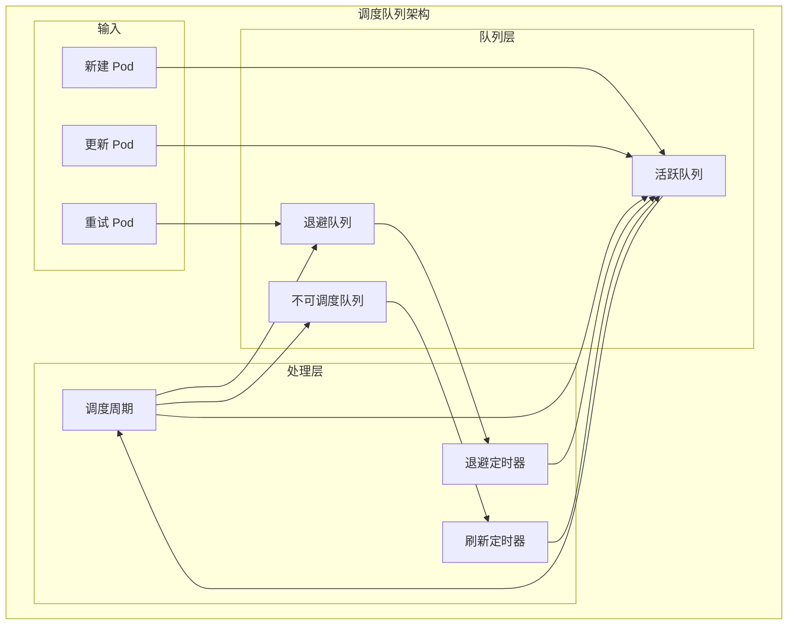
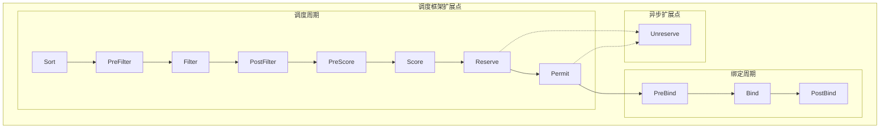
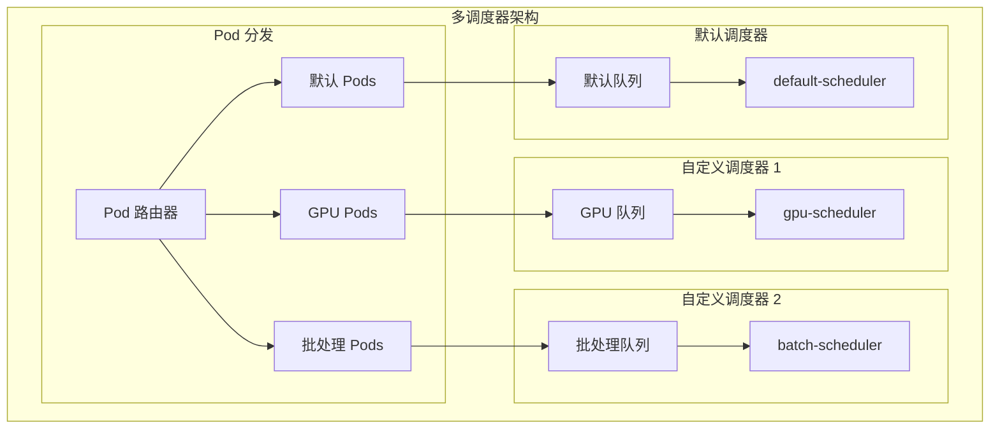

# Scheduler 架构详解

## 概述

Kubernetes Scheduler 是集群的调度器，负责将新创建的 Pod 调度到合适的节点上。它通过一系列算法和策略来确保 Pod 能够在满足资源需求和约束条件的节点上运行。

## 核心架构



## 调度流程详解

### 1. 完整调度流程



### 2. 调度队列机制



## 调度算法详解

### 1. 过滤阶段 (Filtering)

#### 内置过滤插件
```yaml
# 节点亲和性过滤
NodeAffinity:
  # 检查 Pod 的节点亲和性规则
  - requiredDuringSchedulingIgnoredDuringExecution
  - preferredDuringSchedulingIgnoredDuringExecution

# 资源过滤
NodeResourcesFit:
  # 检查节点资源是否满足 Pod 需求
  - CPU 资源
  - 内存资源
  - 存储资源
  - 扩展资源

# 污点容忍过滤
TaintToleration:
  # 检查 Pod 是否容忍节点污点
  - NoSchedule 污点
  - PreferNoSchedule 污点
  - NoExecute 污点
```

#### 过滤算法实现
```go
// 过滤插件接口
type FilterPlugin interface {
    Name() string
    Filter(ctx context.Context, state *CycleState, pod *v1.Pod, nodeInfo *NodeInfo) *Status
}

// 资源过滤示例
func (f *NodeResourcesFit) Filter(ctx context.Context, cycleState *framework.CycleState, pod *v1.Pod, nodeInfo *framework.NodeInfo) *Status {
    node := nodeInfo.Node()
    
    // 计算 Pod 资源需求
    podRequest := computePodResourceRequest(pod)
    
    // 获取节点可用资源
    allocatable := node.Status.Allocatable
    
    // 检查资源是否足够
    if !fitsRequest(podRequest, allocatable) {
        return framework.NewStatus(framework.Unschedulable, "Insufficient resources")
    }
    
    return framework.NewStatus(framework.Success, "")
}
```

### 2. 评分阶段 (Scoring)

#### 内置评分插件
```yaml
# 节点资源评分
NodeResourcesFit:
  # 根据资源利用率评分
  strategy: LeastAllocated  # 最少分配策略
  # strategy: MostAllocated   # 最多分配策略
  # strategy: RequestedToCapacityRatio  # 请求容量比策略

# 节点亲和性评分
NodeAffinity:
  # 根据亲和性偏好评分
  weight: 100

# Pod 间亲和性评分
InterPodAffinity:
  # 根据 Pod 间亲和性评分
  weight: 100

# 负载分散评分
PodTopologySpread:
  # 根据拓扑分散约束评分
  weight: 100
```

#### 评分算法实现
```go
// 评分插件接口
type ScorePlugin interface {
    Name() string
    Score(ctx context.Context, state *CycleState, pod *v1.Pod, nodeName string) (int64, *Status)
    ScoreExtensions() ScoreExtensions
}

// 资源评分示例
func (f *NodeResourcesFit) Score(ctx context.Context, cycleState *framework.CycleState, pod *v1.Pod, nodeName string) (int64, *Status) {
    nodeInfo, err := f.handle.SnapshotSharedLister().NodeInfos().Get(nodeName)
    if err != nil {
        return 0, framework.NewStatus(framework.Error, fmt.Sprintf("getting node %q from Snapshot: %v", nodeName, err))
    }
    
    // 计算资源利用率
    requested := nodeInfo.Requested
    allocatable := nodeInfo.Allocatable
    
    // 根据策略计算评分
    score := calculateScore(requested, allocatable, f.strategy)
    
    return score, framework.NewStatus(framework.Success, "")
}
```

## 调度策略详解

### 1. 节点选择策略

#### 资源分配策略
```yaml
# 最少分配策略 (LeastAllocated)
# 优先选择资源使用率低的节点
score = ((allocatable - requested) / allocatable) * 100

# 最多分配策略 (MostAllocated)  
# 优先选择资源使用率高的节点
score = (requested / allocatable) * 100

# 请求容量比策略 (RequestedToCapacityRatio)
# 根据配置的目标利用率评分
score = requestedToCapacity * 100
```

#### 亲和性和反亲和性
```yaml
# Pod 亲和性示例
apiVersion: v1
kind: Pod
metadata:
  name: web-pod
spec:
  affinity:
    podAffinity:
      requiredDuringSchedulingIgnoredDuringExecution:
      - labelSelector:
          matchExpressions:
          - key: app
            operator: In
            values:
            - database
        topologyKey: kubernetes.io/hostname
    podAntiAffinity:
      preferredDuringSchedulingIgnoredDuringExecution:
      - weight: 100
        podAffinityTerm:
          labelSelector:
            matchExpressions:
            - key: app
              operator: In
              values:
              - web
          topologyKey: kubernetes.io/hostname
```

### 2. 高级调度特性

#### 拓扑分散约束
```yaml
apiVersion: v1
kind: Pod
metadata:
  name: mypod
  labels:
    app: myapp
spec:
  topologySpreadConstraints:
  - maxSkew: 1
    topologyKey: zone
    whenUnsatisfiable: DoNotSchedule
    labelSelector:
      matchLabels:
        app: myapp
  - maxSkew: 1
    topologyKey: node
    whenUnsatisfiable: ScheduleAnyway
    labelSelector:
      matchLabels:
        app: myapp
```

#### 污点和容忍
```yaml
# 节点污点
kubectl taint nodes node1 key1=value1:NoSchedule

# Pod 容忍
apiVersion: v1
kind: Pod
metadata:
  name: nginx
spec:
  tolerations:
  - key: "key1"
    operator: "Equal"
    value: "value1"
    effect: "NoSchedule"
  - key: "key2"
    operator: "Exists"
    effect: "NoExecute"
    tolerationSeconds: 3600
```

## 调度框架详解

### 1. 调度框架扩展点



### 2. 自定义调度插件

#### 插件实现示例
```go
// 自定义调度插件
type CustomPlugin struct {
    handle framework.Handle
}

// 实现 FilterPlugin 接口
func (cp *CustomPlugin) Name() string {
    return "CustomPlugin"
}

func (cp *CustomPlugin) Filter(ctx context.Context, state *framework.CycleState, pod *v1.Pod, nodeInfo *framework.NodeInfo) *framework.Status {
    // 自定义过滤逻辑
    node := nodeInfo.Node()
    
    // 检查自定义标签
    if node.Labels["custom-label"] != "allowed" {
        return framework.NewStatus(framework.Unschedulable, "Node does not have required custom label")
    }
    
    return framework.NewStatus(framework.Success, "")
}

// 实现 ScorePlugin 接口
func (cp *CustomPlugin) Score(ctx context.Context, state *framework.CycleState, pod *v1.Pod, nodeName string) (int64, *framework.Status) {
    // 自定义评分逻辑
    nodeInfo, err := cp.handle.SnapshotSharedLister().NodeInfos().Get(nodeName)
    if err != nil {
        return 0, framework.NewStatus(framework.Error, err.Error())
    }
    
    // 根据自定义指标计算评分
    score := calculateCustomScore(nodeInfo.Node())
    
    return score, framework.NewStatus(framework.Success, "")
}
```

#### 插件配置
```yaml
apiVersion: kubescheduler.config.k8s.io/v1beta3
kind: KubeSchedulerConfiguration
profiles:
- schedulerName: custom-scheduler
  plugins:
    filter:
      enabled:
      - name: CustomPlugin
    score:
      enabled:
      - name: CustomPlugin
  pluginConfig:
  - name: CustomPlugin
    args:
      customParam: "value"
```

## 多调度器架构

### 1. 多调度器部署



### 2. 调度器选择

```yaml
# 指定调度器的 Pod
apiVersion: v1
kind: Pod
metadata:
  name: gpu-pod
spec:
  schedulerName: gpu-scheduler  # 指定使用 GPU 调度器
  containers:
  - name: gpu-container
    image: tensorflow/tensorflow:latest-gpu
    resources:
      limits:
        nvidia.com/gpu: 1
```

## 性能优化

### 1. 调度性能指标

```yaml
# 关键性能指标
scheduler_scheduling_duration_seconds: 调度延迟
scheduler_pending_pods: 待调度 Pod 数量
scheduler_queue_incoming_pods_total: 队列接收 Pod 总数
scheduler_framework_extension_point_duration_seconds: 扩展点执行时间
scheduler_plugin_execution_duration_seconds: 插件执行时间
```

### 2. 性能调优策略

#### 批量调度
```yaml
# 批量调度配置
apiVersion: kubescheduler.config.k8s.io/v1beta3
kind: KubeSchedulerConfiguration
profiles:
- schedulerName: batch-scheduler
  plugins:
    queueSort:
      enabled:
      - name: PrioritySort
  pluginConfig:
  - name: PrioritySort
    args:
      batchSize: 100  # 批量处理大小
```

#### 缓存优化
```go
// 节点信息缓存
type NodeInfoCache struct {
    mu          sync.RWMutex
    nodes       map[string]*NodeInfo
    generation  int64
    lastUpdate  time.Time
}

// 增量更新缓存
func (cache *NodeInfoCache) UpdateNode(node *v1.Node) {
    cache.mu.Lock()
    defer cache.mu.Unlock()
    
    nodeInfo := cache.nodes[node.Name]
    if nodeInfo == nil {
        nodeInfo = NewNodeInfo()
        cache.nodes[node.Name] = nodeInfo
    }
    
    nodeInfo.SetNode(node)
    cache.generation++
    cache.lastUpdate = time.Now()
}
```

## 故障排除

### 1. 调度失败诊断

#### 常见调度失败原因
```bash
# 查看调度失败事件
kubectl describe pod unscheduled-pod

# 常见失败原因
# 1. 资源不足
# 2. 节点亲和性不匹配
# 3. 污点不被容忍
# 4. Pod 间亲和性约束
# 5. 拓扑分散约束
```

#### 调度器日志分析
```bash
# 查看调度器日志
kubectl logs -n kube-system deployment/kube-scheduler

# 启用详细日志
--v=2  # 基本调度信息
--v=4  # 详细调度决策
--v=6  # 更详细的调试信息
```

### 2. 性能问题排查

#### 调度延迟分析
```bash
# 监控调度延迟
kubectl top pods --sort-by=.metadata.creationTimestamp

# 查看调度器性能指标
curl http://scheduler:10251/metrics | grep scheduler_scheduling_duration
```

#### 队列积压分析
```bash
# 查看待调度 Pod
kubectl get pods --all-namespaces --field-selector=status.phase=Pending

# 分析队列状态
curl http://scheduler:10251/metrics | grep scheduler_pending_pods
```

## 最佳实践

### 1. 调度策略设计

#### 资源管理
```yaml
# 合理设置资源请求和限制
resources:
  requests:
    cpu: 100m
    memory: 128Mi
  limits:
    cpu: 500m
    memory: 512Mi
```

#### 亲和性配置
```yaml
# 合理使用亲和性
affinity:
  nodeAffinity:
    preferredDuringSchedulingIgnoredDuringExecution:  # 使用偏好而非强制
    - weight: 1
      preference:
        matchExpressions:
        - key: node-type
          operator: In
          values:
          - compute-optimized
```

### 2. 调度器运维

#### 监控告警
```yaml
# 调度器监控规则
groups:
- name: scheduler
  rules:
  - alert: SchedulerDown
    expr: up{job="kube-scheduler"} == 0
    for: 5m
    
  - alert: HighSchedulingLatency
    expr: histogram_quantile(0.99, scheduler_scheduling_duration_seconds_bucket) > 1
    for: 10m
    
  - alert: TooManyPendingPods
    expr: scheduler_pending_pods > 100
    for: 5m
```

#### 高可用部署
```yaml
# 多副本调度器部署
apiVersion: apps/v1
kind: Deployment
metadata:
  name: kube-scheduler
  namespace: kube-system
spec:
  replicas: 3
  selector:
    matchLabels:
      component: kube-scheduler
  template:
    spec:
      containers:
      - name: kube-scheduler
        image: k8s.gcr.io/kube-scheduler:v1.21.0
        command:
        - kube-scheduler
        - --leader-elect=true
        - --lock-object-name=kube-scheduler
        - --lock-object-namespace=kube-system
