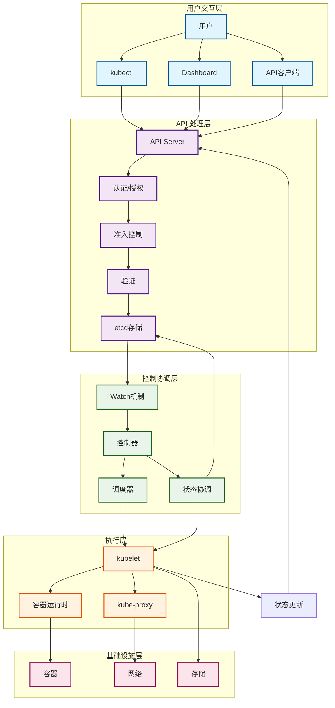
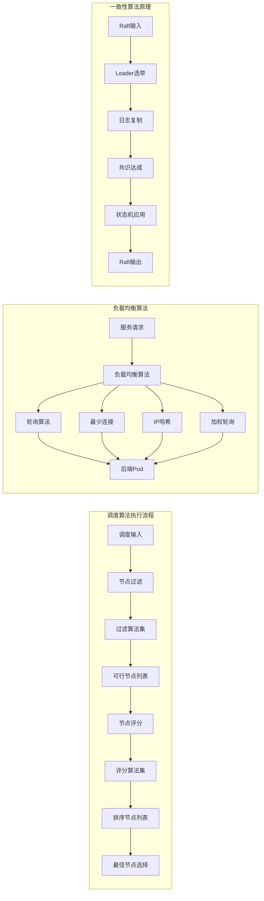
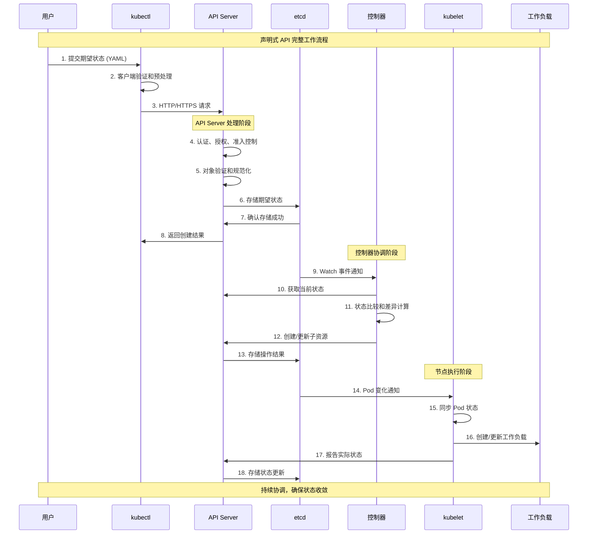
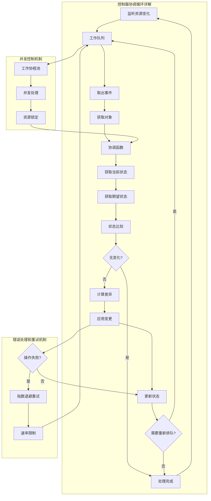
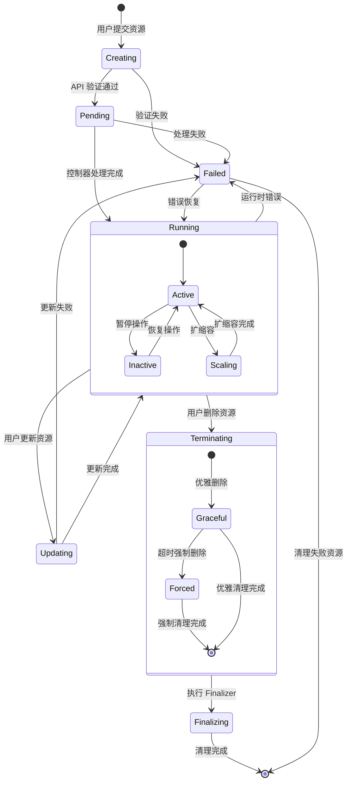
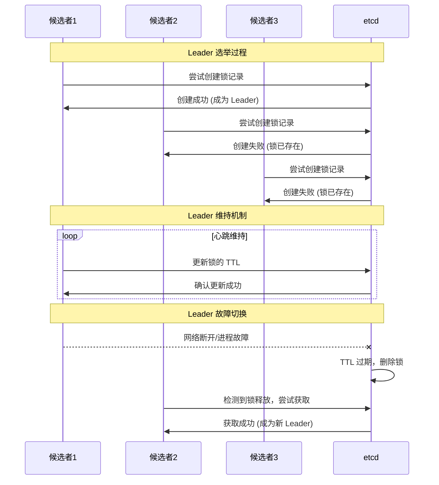
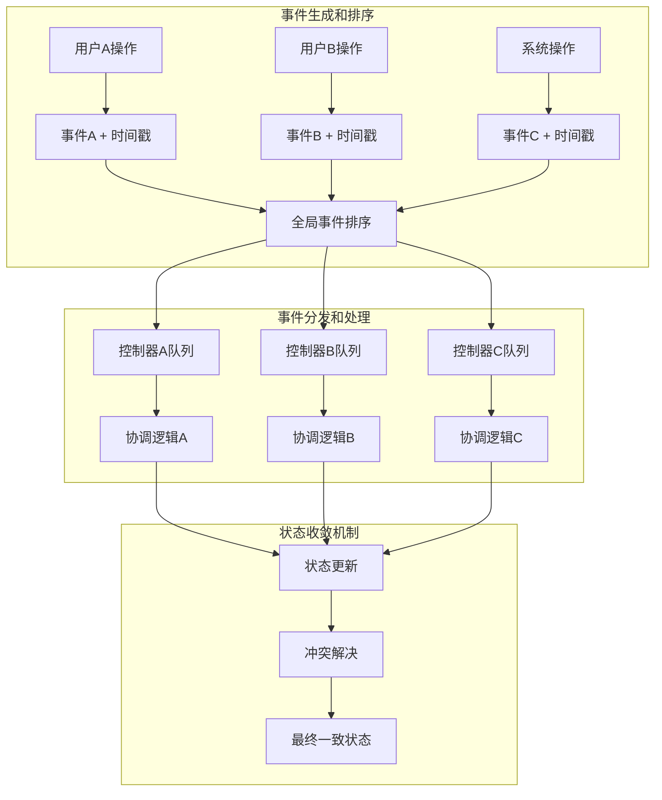
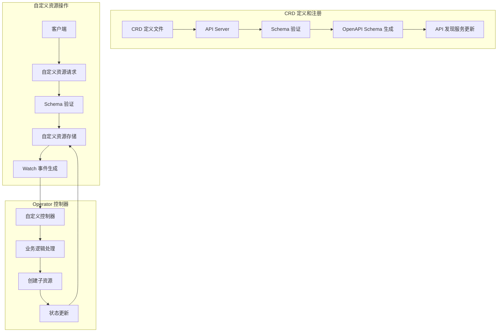
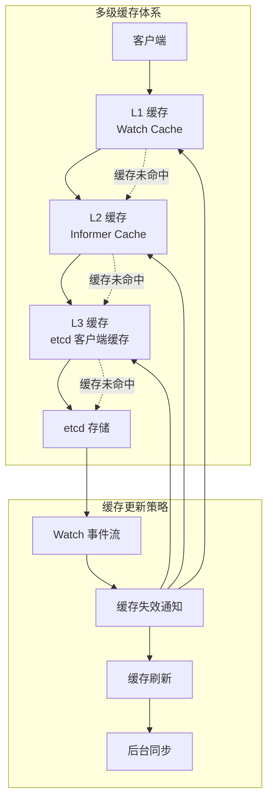

# Kubernetes 工作原理

## 核心工作机制

Kubernetes 通过声明式 API 和控制器模式实现自动化的容器编排。系统的核心工作原理基于以下关键机制：

### 声明式设计原理
- **期望状态管理**：用户声明期望的最终状态，系统自动协调达成
- **幂等性操作**：相同的操作执行多次结果一致
- **最终一致性**：系统最终会收敛到期望状态
- **状态驱动**：基于状态变化而不是指令序列驱动

### 控制器模式原理
- **Watch-Reconcile 循环**：持续监控实际状态与期望状态的差异
- **自愈能力**：自动检测并修复故障
- **可扩展性**：支持自定义控制器扩展功能
- **事件驱动**：基于资源变化事件触发协调逻辑

### 分布式协调原理
- **Leader 选举**：确保关键组件的高可用性
- **分布式锁**：协调多个组件的并发操作
- **最终一致性**：通过异步协调实现数据一致性
- **故障隔离**：组件故障不会影响其他组件

## 关键创新点

### 声明式 vs 命令式架构

**传统命令式模型的局限**：
- 用户必须指定具体的执行步骤
- 难以处理故障和状态不一致
- 不支持自动恢复和自愈
- 操作的幂等性难以保证

**Kubernetes 声明式模型的优势**：
- 用户只需描述期望的最终状态
- 系统自动处理执行细节和异常情况
- 内置自愈和故障恢复能力
- 操作天然具备幂等性

### 控制器模式 vs 传统调度

**传统集中式调度的问题**：
- 单点调度器负责所有决策
- 扩展性有限，单点故障风险高
- 难以处理复杂的约束和依赖关系
- 调度逻辑难以扩展和定制

**Kubernetes 控制器模式的创新**：
- 分布式控制器各司其职
- 高度可扩展，支持自定义控制器
- 通过协作实现复杂的编排逻辑
- 插件化架构支持灵活扩展

### 资源抽象 vs 基础设施绑定

**传统基础设施绑定的限制**：
- 应用与特定硬件和环境耦合
- 迁移和扩展困难
- 资源利用率低
- 运维复杂度高

**Kubernetes 资源抽象的价值**：
- 应用与底层基础设施解耦
- 支持跨云和混合云部署
- 动态资源分配和调度
- 统一的资源管理接口

## 技术优势来源

### 高可扩展性的设计基础
- **水平扩展架构**：通过增加节点实现集群扩展
- **微服务化组件**：每个组件可独立扩展和升级
- **插件化设计**：通过 CRI/CNI/CSI 接口支持插件扩展
- **自定义资源**：通过 CRD 扩展 API 和功能

### 高可用性的实现机制
- **无状态设计**：核心组件设计为无状态，便于水平扩展
- **Leader 选举**：确保关键组件的高可用性
- **故障隔离**：组件间松耦合，单点故障不影响全局
- **自动恢复**：内置的故障检测和自动恢复机制

### 强一致性的保证方式
- **etcd 分布式存储**：基于 Raft 算法保证数据一致性
- **乐观锁机制**：通过资源版本号防止并发冲突
- **原子操作**：确保资源操作的原子性
- **事务性更新**：支持多资源的事务性更新

## 工作原理层次图

### 宏观层面：系统整体协调流程



### 组件层面：核心组件内部机制

```mermaid
graph TB
    subgraph "API Server 内部处理机制"
        HTTP_REQ[HTTP请求] --> AUTH_CHECK[认证检查]
        AUTH_CHECK --> AUTHZ_CHECK[授权检查]
        AUTHZ_CHECK --> MUTATING_ADMISSION[变更准入]
        MUTATING_ADMISSION --> VALIDATING_ADMISSION[验证准入]
        VALIDATING_ADMISSION --> OBJECT_VALIDATION[对象验证]
        OBJECT_VALIDATION --> VERSION_CONVERSION[版本转换]
        VERSION_CONVERSION --> ETCD_WRITE[etcd写入]
        ETCD_WRITE --> WATCH_NOTIFY[Watch通知]
    end
    
    subgraph "调度器内部算法"
        UNSCHEDULED_POD[未调度Pod] --> SCHEDULING_QUEUE[调度队列]
        SCHEDULING_QUEUE --> PREDICATES_FILTER[过滤算法]
        PREDICATES_FILTER --> PRIORITIES_SCORE[评分算法]
        PRIORITIES_SCORE --> BINDING[绑定操作]
        BINDING --> ASSUME_POD[Pod假设]
        ASSUME_POD --> BINDING_CONFIRM[绑定确认]
    end
    
    subgraph "控制器协调循环"
        WATCH_EVENT[Watch事件] --> EVENT_QUEUE[事件队列]
        EVENT_QUEUE --> RECONCILE_WORKER[协调工作器]
        RECONCILE_WORKER --> GET_CURRENT[获取当前状态]
        GET_CURRENT --> GET_DESIRED[获取期望状态]
        GET_DESIRED --> COMPARE_STATE[状态比较]
        COMPARE_STATE --> EXECUTE_ACTION[执行动作]
        EXECUTE_ACTION --> UPDATE_STATUS[更新状态]
    end
    
    subgraph "kubelet Pod 管理"
        POD_SYNC[Pod同步] --> POD_MANAGER[Pod管理器]
        POD_MANAGER --> CONTAINER_MANAGER[容器管理器]
        CONTAINER_MANAGER --> IMAGE_MANAGER[镜像管理器]
        IMAGE_MANAGER --> VOLUME_MANAGER[卷管理器]
        VOLUME_MANAGER --> STATUS_MANAGER[状态管理器]
        STATUS_MANAGER --> POD_SYNC
    end
```



### 算法层面：关键算法执行逻辑



## 核心工作流程

### 声明式 API 处理流程



### 控制器协调循环机制



### 资源生命周期状态机



## 原理文档索引

| 组件/机制名称 | 原理复杂度 | 核心算法类型 | 性能特性 | 详细文档 |
|--------------|------------|--------------|----------|----------|
| **API 层工作原理** |
| [API Server 请求处理](./api-server.md) | 中级 | 流水线处理 | 高并发、低延迟 | [详细原理](./api-server.md) |
| [认证授权机制](./authentication.md) | 中级 | 权限检查算法 | 安全性优先 | [详细原理](./authentication.md) |
| [准入控制器](./admission-control.md) | 高级 | 策略评估引擎 | 可扩展性强 | [详细原理](./admission-control.md) |
| [资源版本控制](./resource-versioning.md) | 中级 | 乐观锁算法 | 并发控制 | [详细原理](./resource-versioning.md) |
| **调度层工作原理** |
| [调度器算法](./scheduler.md) | 高级 | 多阶段调度算法 | 可扩展、可配置 | [详细原理](./scheduler.md) |
| [节点过滤算法](./node-filtering.md) | 中级 | 约束满足算法 | 高效筛选 | [详细原理](./node-filtering.md) |
| [节点评分算法](./node-scoring.md) | 中级 | 多目标优化 | 负载均衡 | [详细原理](./node-scoring.md) |
| [抢占调度机制](./preemption.md) | 高级 | 优先级调度 | 资源优化 | [详细原理](./preemption.md) |
| **控制层工作原理** |
| [控制器协调循环](./controller-loop.md) | 高级 | 事件驱动循环 | 自愈能力强 | [详细原理](./controller-loop.md) |
| [垃圾回收机制](./garbage-collection.md) | 中级 | 图遍历算法 | 资源清理 | [详细原理](./garbage-collection.md) |
| [资源依赖管理](./owner-references.md) | 中级 | 层次关系维护 | 级联操作 | [详细原理](./owner-references.md) |
| [状态同步机制](./state-synchronization.md) | 高级 | 分布式一致性 | 数据一致性 | [详细原理](./state-synchronization.md) |
| **执行层工作原理** |
| [kubelet Pod 管理](./kubelet.md) | 高级 | 生命周期管理 | 节点级编排 | [详细原理](./kubelet.md) |
| [容器运行时接口](./container-runtime.md) | 中级 | CRI 协议 | 运行时抽象 | [详细原理](./container-runtime.md) |
| [网络代理机制](./kube-proxy.md) | 中级 | 流量代理算法 | 服务发现 | [详细原理](./kube-proxy.md) |
| [卷管理机制](./volume-management.md) | 中级 | 存储抽象 | 数据持久化 | [详细原理](./volume-management.md) |
| **存储层工作原理** |
| [etcd 一致性算法](./etcd.md) | 高级 | Raft 共识算法 | 强一致性 | [详细原理](./etcd.md) |
| [Watch 机制原理](./watch-mechanism.md) | 中级 | 事件流处理 | 实时通知 | [详细原理](./watch-mechanism.md) |
| [数据序列化](./serialization.md) | 基础 | Protobuf/JSON | 高效传输 | [详细原理](./serialization.md) |
| [缓存机制](./caching.md) | 中级 | 多级缓存 | 性能优化 | [详细原理](./caching.md) |

## 高级工作机制

### 分布式协调原理

#### Leader 选举实现机制



#### 分布式锁机制

```go
// 分布式锁实现示例
type DistributedLock struct {
    client   etcd.Client
    key      string
    ttl      time.Duration
    session  concurrency.Session
    mutex    *concurrency.Mutex
}

func (l *DistributedLock) TryLock(ctx context.Context) error {
    // 1. 创建 etcd 会话
    session, err := concurrency.NewSession(
        l.client, 
        concurrency.WithTTL(int(l.ttl.Seconds())),
    )
    if err != nil {
        return fmt.Errorf("failed to create session: %v", err)
    }
    l.session = *session
    
    // 2. 创建互斥锁
    l.mutex = concurrency.NewMutex(session, l.key)
    
    // 3. 非阻塞获取锁
    select {
    case <-ctx.Done():
        l.session.Close()
        return ctx.Err()
    default:
        err := l.mutex.TryLock(ctx)
        if err != nil {
            l.session.Close()
            return fmt.Errorf("failed to acquire lock: %v", err)
        }
        return nil
    }
}

func (l *DistributedLock) Unlock() error {
    defer l.session.Close()
    if l.mutex != nil {
        return l.mutex.Unlock(context.Background())
    }
    return nil
}

func (l *DistributedLock) KeepAlive(ctx context.Context) error {
    // 维持会话活跃状态
    keepAliveChan, err := l.session.Client().KeepAlive(ctx, l.session.Lease())
    if err != nil {
        return err
    }
    
    go func() {
        for keepAliveResp := range keepAliveChan {
            if keepAliveResp == nil {
                break
            }
            // 处理 keep alive 响应
        }
    }()
    
    return nil
}
```

### 最终一致性保证机制

#### 事件序列化和处理



#### 乐观锁冲突处理

```go
// 乐观锁冲突检测和解决示例
func (c *Controller) UpdateResourceWithRetry(
    ctx context.Context, 
    obj *unstructured.Unstructured,
    updateFunc func(*unstructured.Unstructured) error,
) error {
    return retry.RetryOnConflict(retry.DefaultRetry, func() error {
        // 1. 获取最新的资源版本
        current, err := c.dynamicClient.Resource(obj.GroupVersionResource()).
            Namespace(obj.GetNamespace()).
            Get(ctx, obj.GetName(), metav1.GetOptions{})
        if err != nil {
            return err
        }
        
        // 2. 应用更新逻辑
        if err := updateFunc(current); err != nil {
            return err
        }
        
        // 3. 尝试更新，如果资源版本冲突会自动重试
        _, err = c.dynamicClient.Resource(obj.GroupVersionResource()).
            Namespace(obj.GetNamespace()).
            Update(ctx, current, metav1.UpdateOptions{})
        
        return err
    })
}

// 冲突解决策略
func resolveConflict(current, desired *unstructured.Unstructured) error {
    // 1. 合并策略：保留用户修改，应用系统更新
    currentSpec := current.Object["spec"]
    desiredSpec := desired.Object["spec"]
    
    // 2. 字段级合并
    mergedSpec := mergeSpecs(currentSpec, desiredSpec)
    current.Object["spec"] = mergedSpec
    
    // 3. 保留用户自定义标签和注解
    mergeMetadata(current, desired)
    
    return nil
}

func mergeSpecs(current, desired interface{}) interface{} {
    // 实现深度合并逻辑
    // 保留用户修改的字段
    // 应用系统控制的字段
    return mergeDeep(current, desired)
}
```

### 扩展机制原理

#### CRD 和 Operator 模式



#### Webhook 扩展机制

```go
// Admission Webhook 实现示例
type WebhookServer struct {
    server *http.Server
}

func (ws *WebhookServer) mutate(w http.ResponseWriter, r *http.Request) {
    // 1. 解析 AdmissionReview 请求
    body, err := ioutil.ReadAll(r.Body)
    if err != nil {
        http.Error(w, err.Error(), http.StatusInternalServerError)
        return
    }
    
    var admissionReview v1.AdmissionReview
    if err := json.Unmarshal(body, &admissionReview); err != nil {
        http.Error(w, err.Error(), http.StatusBadRequest)
        return
    }
    
    // 2. 提取请求对象
    req := admissionReview.Request
    obj := &unstructured.Unstructured{}
    if err := json.Unmarshal(req.Object.Raw, obj); err != nil {
        http.Error(w, err.Error(), http.StatusBadRequest)
        return
    }
    
    // 3. 执行变更逻辑
    patch, err := ws.createPatch(obj)
    if err != nil {
        http.Error(w, err.Error(), http.StatusInternalServerError)
        return
    }
    
    // 4. 构造响应
    response := &v1.AdmissionResponse{
        UID:     req.UID,
        Allowed: true,
        Patch:   patch,
        PatchType: func() *v1.PatchType {
            pt := v1.PatchTypeJSONPatch
            return &pt
        }(),
    }
    
    admissionReview.Response = response
    respBytes, _ := json.Marshal(admissionReview)
    w.Header().Set("Content-Type", "application/json")
    w.Write(respBytes)
}

func (ws *WebhookServer) createPatch(obj *unstructured.Unstructured) ([]byte, error) {
    // 创建 JSON Patch 操作
    patches := []map[string]interface{}{
        {
            "op":    "add",
            "path":  "/metadata/labels/webhook-modified",
            "value": "true",
        },
        {
            "op":    "add",
            "path":  "/metadata/annotations/modification-time",
            "value": time.Now().Format(time.RFC3339),
        },
    }
    
    return json.Marshal(patches)
}
```

## 性能优化原理

### 缓存层次架构



### 并发控制和负载均衡

```go
// 工作队列并发控制示例
type WorkQueue struct {
    queue       []string
    dirty       sets.String
    processing  sets.String
    cond        *sync.Cond
    shutDown    bool
    rateLimiter workqueue.RateLimiter
}

func (q *WorkQueue) AddRateLimited(item string) {
    q.cond.L.Lock()
    defer q.cond.L.Unlock()
    
    if q.shutDown {
        return
    }
    
    // 速率限制检查
    delay := q.rateLimiter.When(item)
    if delay > 0 {
        time.AfterFunc(delay, func() {
            q.Add(item)
        })
        return
    }
    
    q.addInternal(item)
}

func (q *WorkQueue) addInternal(item string) {
    if q.dirty.Has(item) {
        return
    }
    
    q.dirty.Insert(item)
    if !q.processing.Has(item) {
        q.queue = append(q.queue, item)
    }
    q.cond.Signal()
}

// 负载均衡算法实现
type LoadBalancer interface {
    Select(endpoints []Endpoint, request *Request) (*Endpoint, error)
}

// 加权轮询负载均衡
type WeightedRoundRobinLB struct {
    endpoints    []WeightedEndpoint
    currentIndex int
    mutex        sync.Mutex
}

type WeightedEndpoint struct {
    Endpoint      Endpoint
    Weight        int
    CurrentWeight int
}

func (lb *WeightedRoundRobinLB) Select(endpoints []Endpoint, request *Request) (*Endpoint, error) {
    lb.mutex.Lock()
    defer lb.mutex.Unlock()
    
    if len(lb.endpoints) == 0 {
        return nil, errors.New("no endpoints available")
    }
    
    // 计算当前权重
    totalWeight := 0
    var selected *WeightedEndpoint
    
    for i := range lb.endpoints {
        ep := &lb.endpoints[i]
        ep.CurrentWeight += ep.Weight
        totalWeight += ep.Weight
        
        if selected == nil || ep.CurrentWeight > selected.CurrentWeight {
            selected = ep
        }
    }
    
    if selected != nil {
        selected.CurrentWeight -= totalWeight
        return &selected.Endpoint, nil
    }
    
    return nil, errors.New("no endpoint selected")
}
```

## 相关概念

本章节的工作原理与以下技术知识密切相关：

- **[核心概念](../01-core-concepts/README.md)**：理解工作原理中涉及的基础概念和对象
- **[系统架构](../02-architecture/README.md)**：了解各组件在架构中的位置和交互关系
- **[可观测性](../04-observability/README.md)**：通过监控理解系统的实际工作状况
- **[最佳实践](../07-best-practices/README.md)**：学习如何正确应用这些工作原理

## 参考资料

### 官方文档
- [Kubernetes 设计原理](https://kubernetes.io/docs/concepts/architecture/principles/)
- [控制器模式](https://kubernetes.io/docs/concepts/architecture/controller/)
- [API 机制](https://kubernetes.io/docs/concepts/overview/kubernetes-api/)

### 深入学习资源
- [Kubernetes 源码分析](https://github.com/kubernetes/kubernetes)
- [设计提案文档](https://github.com/kubernetes/community/tree/master/contributors/design-proposals)
- [CNCF 技术规范](https://www.cncf.io/projects/)

### 社区最佳实践
- [编写控制器最佳实践](https://github.com/kubernetes/community/blob/master/contributors/devel/sig-api-machinery/controllers.md)
- [API 设计指南](https://github.com/kubernetes/community/blob/master/contributors/devel/sig-architecture/api-conventions.md)
- [操作员模式指南](https://operatorhub.io/)
