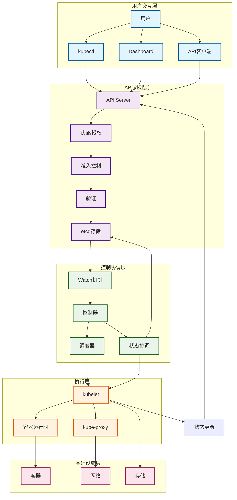
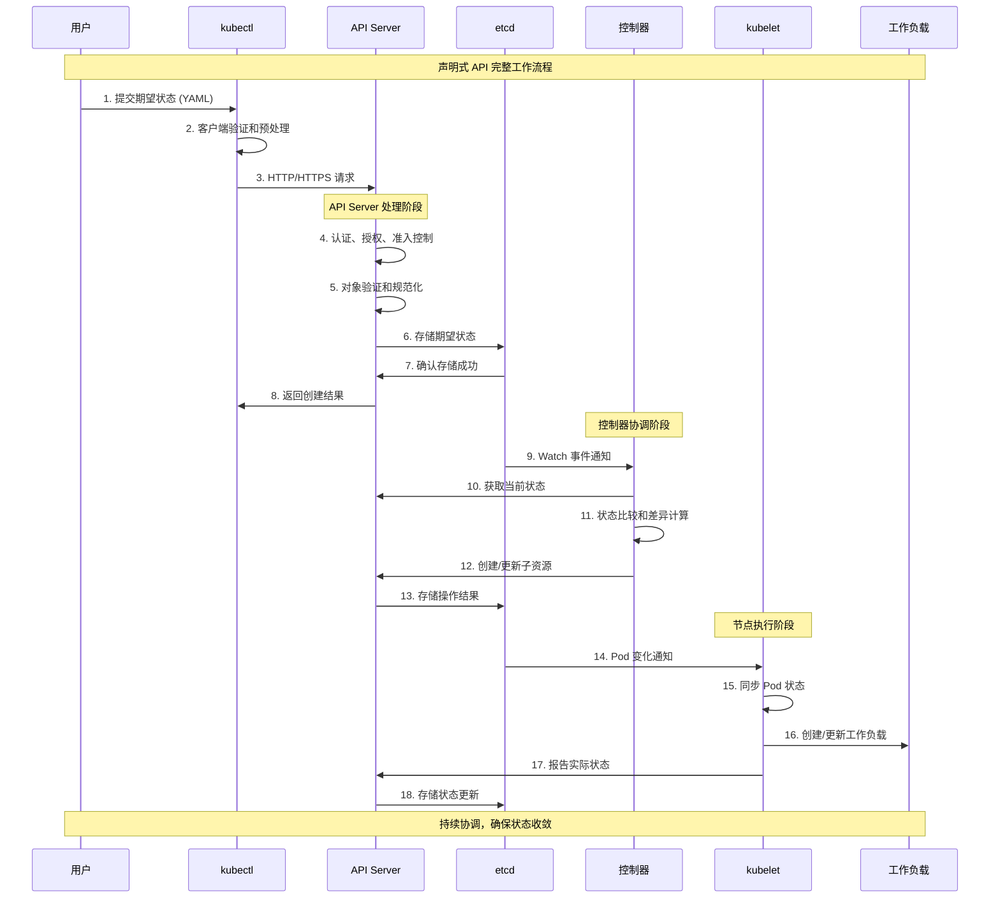
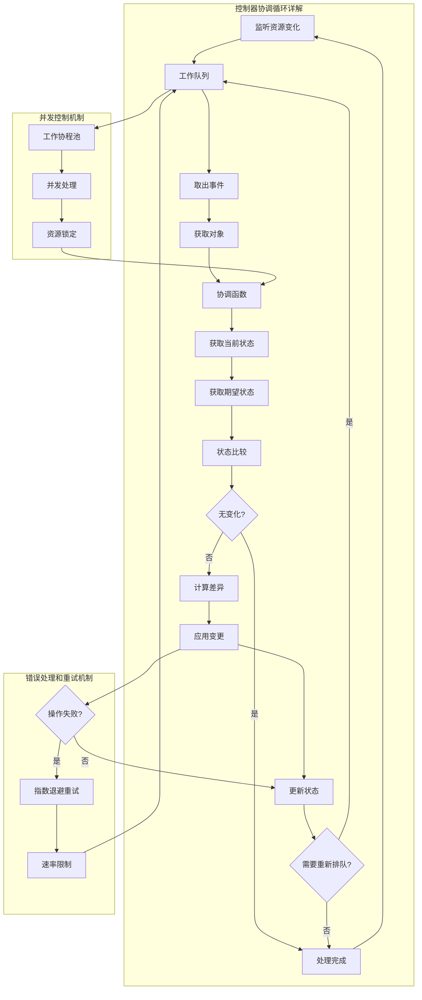

# Kubernetes 工作原理

## 概述

Kubernetes 通过声明式 API 和控制器模式实现自动化的容器编排。本章节详细介绍 Kubernetes 的核心工作原理，包括 API 处理、调度机制、控制器协调、存储管理等关键技术。

## 核心工作机制

### 声明式设计原理
- **期望状态管理**：用户声明期望的最终状态，系统自动协调达成
- **幂等性操作**：相同的操作执行多次结果一致
- **最终一致性**：系统最终会收敛到期望状态
- **状态驱动**：基于状态变化而不是指令序列驱动

### 控制器模式原理
- **Watch-Reconcile 循环**：持续监控实际状态与期望状态的差异
- **自愈能力**：自动检测并修复故障
- **可扩展性**：支持自定义控制器扩展功能
- **事件驱动**：基于资源变化事件触发协调逻辑

### 分布式协调原理
- **Leader 选举**：确保关键组件的高可用性
- **分布式锁**：协调多个组件的并发操作
- **最终一致性**：通过异步协调实现数据一致性
- **故障隔离**：组件故障不会影响其他组件

## 系统整体协调流程

## 工作原理文档索引

### API 层工作原理
| 组件/机制 | 复杂度 | 核心算法 | 性能特性 | 文档链接 |
|-----------|--------|----------|----------|----------|
| [API Server 请求处理](./api-server.md) | 中级 | 流水线处理 | 高并发、低延迟 | [详细原理](./api-server.md) |
| [认证授权机制](./authentication.md) | 中级 | 权限检查算法 | 安全性优先 | [详细原理](./authentication.md) |
| [准入控制器](./admission-control.md) | 高级 | 策略评估引擎 | 可扩展性强 | [详细原理](./admission-control.md) |
| [资源版本控制](./resource-versioning.md) | 中级 | 乐观锁算法 | 并发控制 | [详细原理](./resource-versioning.md) |

### 调度层工作原理
| 组件/机制 | 复杂度 | 核心算法 | 性能特性 | 文档链接 |
|-----------|--------|----------|----------|----------|
| 调度器算法 | 高级 | 多阶段调度算法 | 可扩展、可配置 | [即将添加] |
| 节点过滤算法 | 中级 | 约束满足算法 | 高效筛选 | [即将添加] |
| 节点评分算法 | 中级 | 多目标优化 | 负载均衡 | [即将添加] |
| 抢占调度机制 | 高级 | 优先级调度 | 资源优化 | [即将添加] |

### 控制层工作原理
| 组件/机制 | 复杂度 | 核心算法 | 性能特性 | 文档链接 |
|-----------|--------|----------|----------|----------|
| 控制器协调循环 | 高级 | 事件驱动循环 | 自愈能力强 | [即将添加] |
| 垃圾回收机制 | 中级 | 图遍历算法 | 资源清理 | [即将添加] |
| 资源依赖管理 | 中级 | 层次关系维护 | 级联操作 | [即将添加] |
| 状态同步机制 | 高级 | 分布式一致性 | 数据一致性 | [即将添加] |

### 执行层工作原理
| 组件/机制 | 复杂度 | 核心算法 | 性能特性 | 文档链接 |
|-----------|--------|----------|----------|----------|
| kubelet Pod 管理 | 高级 | 生命周期管理 | 节点级编排 | [即将添加] |
| 容器运行时接口 | 中级 | CRI 协议 | 运行时抽象 | [即将添加] |
| 网络代理机制 | 中级 | 流量代理算法 | 服务发现 | [即将添加] |
| 卷管理机制 | 中级 | 存储抽象 | 数据持久化 | [即将添加] |

### 存储层工作原理
| 组件/机制 | 复杂度 | 核心算法 | 性能特性 | 文档链接 |
|-----------|--------|----------|----------|----------|
| etcd 一致性算法 | 高级 | Raft 共识算法 | 强一致性 | [即将添加] |
| Watch 机制原理 | 中级 | 事件流处理 | 实时通知 | [即将添加] |
| 数据序列化 | 基础 | Protobuf/JSON | 高效传输 | [即将添加] |
| 缓存机制 | 中级 | 多级缓存 | 性能优化 | [即将添加] |

## 核心工作流程

### 声明式 API 处理流程

### 控制器协调循环机制

## 技术优势分析

### 声明式 vs 命令式架构

**传统命令式模型的局限**：
- 用户必须指定具体的执行步骤
- 难以处理故障和状态不一致
- 不支持自动恢复和自愈
- 操作的幂等性难以保证

**Kubernetes 声明式模型的优势**：
- 用户只需描述期望的最终状态
- 系统自动处理执行细节和异常情况
- 内置自愈和故障恢复能力
- 操作天然具备幂等性

### 控制器模式 vs 传统调度

**传统集中式调度的问题**：
- 单点调度器负责所有决策
- 扩展性有限，单点故障风险高
- 难以处理复杂的约束和依赖关系
- 调度逻辑难以扩展和定制

**Kubernetes 控制器模式的创新**：
- 分布式控制器各司其职
- 高度可扩展，支持自定义控制器
- 通过协作实现复杂的编排逻辑
- 插件化架构支持灵活扩展

### 资源抽象 vs 基础设施绑定

**传统基础设施绑定的限制**：
- 应用与特定硬件和环境耦合
- 迁移和扩展困难
- 资源利用率低
- 运维复杂度高

**Kubernetes 资源抽象的价值**：
- 应用与底层基础设施解耦
- 支持跨云和混合云部署
- 动态资源分配和调度
- 统一的资源管理接口

## 关键创新点

### 高可扩展性的设计基础
- **水平扩展架构**：通过增加节点实现集群扩展
- **微服务化组件**：每个组件可独立扩展和升级
- **插件化设计**：通过 CRI/CNI/CSI 接口支持插件扩展
- **自定义资源**：通过 CRD 扩展 API 和功能

### 高可用性的实现机制
- **无状态设计**：核心组件设计为无状态，便于水平扩展
- **Leader 选举**：确保关键组件的高可用性
- **故障隔离**：组件间松耦合，单点故障不影响全局
- **自动恢复**：内置的故障检测和自动恢复机制

### 强一致性的保证方式
- **etcd 分布式存储**：基于 Raft 算法保证数据一致性
- **乐观锁机制**：通过资源版本号防止并发冲突
- **原子操作**：确保资源操作的原子性
- **事务性更新**：支持多资源的事务性更新

## 相关概念

本章节的工作原理与以下技术知识密切相关：

- **[核心概念](../01-core-concepts/README.md)**：理解工作原理中涉及的基础概念和对象
- **[系统架构](../02-architecture/README.md)**：了解各组件在架构中的位置和交互关系
- **[可观测性](../04-observability/README.md)**：通过监控理解系统的实际工作状况
- **[最佳实践](../07-best-practices/README.md)**：学习如何正确应用这些工作原理

## 参考资料

### 官方文档
- [Kubernetes 设计原理](https://kubernetes.io/docs/concepts/architecture/principles/)
- [控制器模式](https://kubernetes.io/docs/concepts/architecture/controller/)
- [API 机制](https://kubernetes.io/docs/concepts/overview/kubernetes-api/)

### 深入学习资源  
- [Kubernetes 源码分析](https://github.com/kubernetes/kubernetes)
- [设计提案文档](https://github.com/kubernetes/community/tree/master/contributors/design-proposals)
- [CNCF 技术规范](https://www.cncf.io/projects/)

### 社区最佳实践
- [编写控制器最佳实践](https://github.com/kubernetes/community/blob/master/contributors/devel/sig-api-machinery/controllers.md)
- [API 设计指南](https://github.com/kubernetes/community/blob/master/contributors/devel/sig-architecture/api-conventions.md)
- [操作员模式指南](https://operatorhub.io/)
