# 准入控制器

## 概述

准入控制器（Admission Controllers）是 Kubernetes API Server 处理请求过程中的关键组件，在对象持久化到 etcd 之前对请求进行验证和变更。它们提供了一种灵活的机制来实施集群策略、安全规则和资源管理。

## 准入控制流程

```mermaid
graph TB
    subgraph "准入控制处理流程"
        API_REQUEST[API 请求] --> AUTH_PASSED[认证授权通过]
        AUTH_PASSED --> MUTATING_PHASE[变更准入阶段]
        MUTATING_PHASE --> VALIDATING_PHASE[验证准入阶段]
        VALIDATING_PHASE --> OBJECT_VALIDATION[对象验证]
        OBJECT_VALIDATION --> ETCD_STORAGE[etcd 存储]
        
        MUTATING_PHASE --> MUTATING_CONTROLLERS[变更控制器]
        MUTATING_CONTROLLERS --> OBJECT_MODIFIED[对象变更]
        OBJECT_MODIFIED --> VALIDATING_PHASE
        
        VALIDATING_PHASE --> VALIDATING_CONTROLLERS[验证控制器]
        VALIDATING_CONTROLLERS --> VALIDATION_RESULT[验证结果]
        VALIDATION_RESULT --> REJECT[拒绝请求]
        VALIDATION_RESULT --> OBJECT_VALIDATION
    end
    
    %% 样式定义
    classDef requestFlow fill:#e3f2fd,stroke:#1976d2,stroke-width:2px
    classDef mutatingPhase fill:#e8f5e8,stroke:#388e3c,stroke-width:2px
    classDef validatingPhase fill:#fff3e0,stroke:#f57c00,stroke-width:2px
    classDef rejectPath fill:#ffebee,stroke:#d32f2f,stroke-width:2px
    
    class API_REQUEST,AUTH_PASSED,OBJECT_VALIDATION,ETCD_STORAGE requestFlow
    class MUTATING_PHASE,MUTATING_CONTROLLERS,OBJECT_MODIFIED mutatingPhase
    class VALIDATING_PHASE,VALIDATING_CONTROLLERS,VALIDATION_RESULT validatingPhase
    class REJECT rejectPath
```



## 准入控制器类型

### 变更准入控制器（Mutating Admission Controllers）

变更准入控制器可以修改请求中的对象，在验证准入控制器之前执行。

#### 常见变更准入控制器

1. **DefaultStorageClass**
```go
// DefaultStorageClass 控制器实现示例
func (d *DefaultStorageClassAdmission) Admit(ctx context.Context, a admission.Attributes, o admission.ObjectInterfaces) error {
    if a.GetResource().GroupResource() != (schema.GroupResource{Resource: "persistentvolumeclaims"}) {
        return nil
    }
    
    pvc, ok := a.GetObject().(*v1.PersistentVolumeClaim)
    if !ok {
        return admission.NewForbidden(a, fmt.Errorf("expected PVC but got %T", a.GetObject()))
    }
    
    // 如果没有指定存储类，设置默认存储类
    if pvc.Spec.StorageClassName == nil || *pvc.Spec.StorageClassName == "" {
        defaultClass, err := d.getDefaultStorageClass()
        if err != nil {
            return err
        }
        
        if defaultClass != nil {
            pvc.Spec.StorageClassName = &defaultClass.Name
        }
    }
    
    return nil
}
```

2. **MutatingAdmissionWebhook**
```go
// Webhook 变更准入控制器
type MutatingWebhook struct {
    webhookClient *rest.RESTClient
}

func (m *MutatingWebhook) Admit(ctx context.Context, a admission.Attributes, o admission.ObjectInterfaces) error {
    // 构造 AdmissionReview 请求
    admissionReview := &admissionv1.AdmissionReview{
        TypeMeta: metav1.TypeMeta{
            APIVersion: "admission.k8s.io/v1",
            Kind:       "AdmissionReview",
        },
        Request: &admissionv1.AdmissionRequest{
            UID:       a.GetUID(),
            Kind:      a.GetKind(),
            Resource:  a.GetResource(),
            Name:      a.GetName(),
            Namespace: a.GetNamespace(),
            Operation: admissionv1.Operation(a.GetOperation()),
            Object:    runtime.RawExtension{Object: a.GetObject()},
        },
    }
    
    // 发送请求到 Webhook
    result, err := m.callWebhook(ctx, admissionReview)
    if err != nil {
        return err
    }
    
    // 处理响应
    if !result.Response.Allowed {
        return admission.NewForbidden(a, fmt.Errorf("webhook denied: %s", result.Response.Result.Message))
    }
    
    // 应用 JSON Patch
    if result.Response.Patch != nil {
        return m.applyPatch(a.GetObject(), result.Response.Patch, result.Response.PatchType)
    }
    
    return nil
}
```

### 验证准入控制器（Validating Admission Controllers）

验证准入控制器对请求进行验证，但不能修改对象。

#### 常见验证准入控制器

1. **ResourceQuota**
```go
// ResourceQuota 控制器实现示例
type ResourceQuotaAdmission struct {
    quotaLister    v1listers.ResourceQuotaLister
    usageCalculator UsageCalculator
}

func (r *ResourceQuotaAdmission) Validate(ctx context.Context, a admission.Attributes, o admission.ObjectInterfaces) error {
    if a.GetOperation() != admission.Create && a.GetOperation() != admission.Update {
        return nil
    }
    
    // 获取命名空间的资源配额
    quotas, err := r.quotaLister.ResourceQuotas(a.GetNamespace()).List(labels.Everything())
    if err != nil {
        return err
    }
    
    for _, quota := range quotas {
        // 计算资源使用量
        usage, err := r.usageCalculator.CalculateUsage(a.GetNamespace(), quota.Spec.Hard)
        if err != nil {
            return err
        }
        
        // 计算新对象的资源需求
        newUsage := r.calculateNewUsage(a.GetObject(), quota.Spec.Hard)
        
        // 检查是否超出配额
        for resource, hardLimit := range quota.Spec.Hard {
            currentUsage := usage[resource]
            requestedUsage := newUsage[resource]
            
            if currentUsage.Add(requestedUsage).Cmp(hardLimit) > 0 {
                return admission.NewForbidden(a, fmt.Errorf(
                    "exceeded quota: requested: %v, used: %v, limited: %v",
                    requestedUsage, currentUsage, hardLimit))
            }
        }
    }
    
    return nil
}
```

2. **ValidatingAdmissionWebhook**
```yaml
# ValidatingAdmissionWebhook 配置示例
apiVersion: admissionregistration.k8s.io/v1
kind: ValidatingAdmissionWebhook
metadata:
  name: validation.example.com
webhooks:
- name: pod-validation.example.com
  clientConfig:
    service:
      name: webhook-service
      namespace: webhook-system
      path: "/validate"
  rules:
  - operations: ["CREATE", "UPDATE"]
    apiGroups: [""]
    apiVersions: ["v1"]
    resources: ["pods"]
  admissionReviewVersions: ["v1", "v1beta1"]
  sideEffects: None
  failurePolicy: Fail
```

## 内置准入控制器

### 核心准入控制器

1. **AlwaysPullImages**
   - 强制设置镜像拉取策略为 Always
   - 确保总是从镜像仓库拉取最新镜像
   - 提高安全性，防止使用本地缓存的恶意镜像

2. **DefaultIngressClass**
   - 为没有指定 IngressClass 的 Ingress 设置默认类
   - 简化 Ingress 配置
   - 确保 Ingress 资源有有效的类

3. **DefaultTolerationSeconds**
   - 为 Pod 设置默认的污点容忍时间
   - 配置节点不可用时的 Pod 驱逐行为
   - 提高集群的容错能力

4. **LimitRanger**
```go
// LimitRanger 实现示例
type LimitRangerAdmission struct {
    limitRangeLister v1listers.LimitRangeLister
}

func (l *LimitRangerAdmission) Admit(ctx context.Context, a admission.Attributes, o admission.ObjectInterfaces) error {
    // 获取命名空间的 LimitRange
    limitRanges, err := l.limitRangeLister.LimitRanges(a.GetNamespace()).List(labels.Everything())
    if err != nil {
        return err
    }
    
    for _, limitRange := range limitRanges {
        if err := l.applyLimitRange(a.GetObject(), limitRange); err != nil {
            return admission.NewForbidden(a, err)
        }
    }
    
    return nil
}

func (l *LimitRangerAdmission) applyLimitRange(obj runtime.Object, limitRange *v1.LimitRange) error {
    switch o := obj.(type) {
    case *v1.Pod:
        return l.applyPodLimits(o, limitRange)
    case *v1.PersistentVolumeClaim:
        return l.applyPVCLimits(o, limitRange)
    default:
        return nil
    }
}
```

### 安全相关准入控制器

1. **PodSecurityPolicy**（已废弃）
2. **SecurityContextDeny**
3. **ServiceAccount**

```go
// ServiceAccount 准入控制器
func (s *ServiceAccountAdmission) Admit(ctx context.Context, a admission.Attributes, o admission.ObjectInterfaces) error {
    if a.GetResource().GroupResource() != (schema.GroupResource{Resource: "pods"}) {
        return nil
    }
    
    pod, ok := a.GetObject().(*v1.Pod)
    if !ok {
        return admission.NewForbidden(a, fmt.Errorf("expected Pod but got %T", a.GetObject()))
    }
    
    // 设置默认 ServiceAccount
    if len(pod.Spec.ServiceAccountName) == 0 {
        pod.Spec.ServiceAccountName = "default"
    }
    
    // 验证 ServiceAccount 存在
    _, err := s.serviceAccountLister.ServiceAccounts(a.GetNamespace()).Get(pod.Spec.ServiceAccountName)
    if err != nil {
        return admission.NewForbidden(a, fmt.Errorf("ServiceAccount %s not found", pod.Spec.ServiceAccountName))
    }
    
    return nil
}
```

## 自定义准入控制器

### Admission Webhook 开发

#### Webhook 服务器实现
```go
// Webhook 服务器实现
type WebhookServer struct {
    server *http.Server
    certPath string
    keyPath  string
}

func (ws *WebhookServer) Start() error {
    mux := http.NewServeMux()
    mux.HandleFunc("/mutate", ws.handleMutate)
    mux.HandleFunc("/validate", ws.handleValidate)
    
    ws.server = &http.Server{
        Addr:    ":8443",
        Handler: mux,
    }
    
    return ws.server.ListenAndServeTLS(ws.certPath, ws.keyPath)
}

func (ws *WebhookServer) handleMutate(w http.ResponseWriter, r *http.Request) {
    body, err := ioutil.ReadAll(r.Body)
    if err != nil {
        http.Error(w, err.Error(), http.StatusBadRequest)
        return
    }
    
    var admissionReview admissionv1.AdmissionReview
    if err := json.Unmarshal(body, &admissionReview); err != nil {
        http.Error(w, err.Error(), http.StatusBadRequest)
        return
    }
    
    response := ws.mutate(&admissionReview)
    admissionReview.Response = response
    admissionReview.Response.UID = admissionReview.Request.UID
    
    respBytes, _ := json.Marshal(admissionReview)
    w.Header().Set("Content-Type", "application/json")
    w.Write(respBytes)
}

func (ws *WebhookServer) mutate(ar *admissionv1.AdmissionReview) *admissionv1.AdmissionResponse {
    req := ar.Request
    
    // 解析对象
    var obj runtime.Object
    if err := json.Unmarshal(req.Object.Raw, &obj); err != nil {
        return &admissionv1.AdmissionResponse{
            Allowed: false,
            Result: &metav1.Status{
                Message: err.Error(),
            },
        }
    }
    
    // 生成 JSON Patch
    patches := ws.createPatches(obj)
    patchBytes, _ := json.Marshal(patches)
    
    return &admissionv1.AdmissionResponse{
        Allowed: true,
        Patch:   patchBytes,
        PatchType: func() *admissionv1.PatchType {
            pt := admissionv1.PatchTypeJSONPatch
            return &pt
        }(),
    }
}
```

#### JSON Patch 生成
```go
// JSON Patch 操作类型
type PatchOperation struct {
    Op    string      `json:"op"`
    Path  string      `json:"path"`
    Value interface{} `json:"value,omitempty"`
}

func (ws *WebhookServer) createPatches(obj runtime.Object) []PatchOperation {
    var patches []PatchOperation
    
    switch o := obj.(type) {
    case *v1.Pod:
        patches = append(patches, ws.createPodPatches(o)...)
    case *appsv1.Deployment:
        patches = append(patches, ws.createDeploymentPatches(o)...)
    }
    
    return patches
}

func (ws *WebhookServer) createPodPatches(pod *v1.Pod) []PatchOperation {
    var patches []PatchOperation
    
    // 添加标签
    if pod.Labels == nil {
        patches = append(patches, PatchOperation{
            Op:    "add",
            Path:  "/metadata/labels",
            Value: map[string]string{},
        })
    }
    
    patches = append(patches, PatchOperation{
        Op:    "add",
        Path:  "/metadata/labels/webhook-mutated",
        Value: "true",
    })
    
    // 添加注解
    patches = append(patches, PatchOperation{
        Op:    "add",
        Path:  "/metadata/annotations/mutation-timestamp",
        Value: time.Now().Format(time.RFC3339),
    })
    
    // 设置资源限制
    for i, container := range pod.Spec.Containers {
        if container.Resources.Limits == nil {
            patches = append(patches, PatchOperation{
                Op:   "add",
                Path: fmt.Sprintf("/spec/containers/%d/resources/limits", i),
                Value: v1.ResourceList{
                    v1.ResourceCPU:    resource.MustParse("100m"),
                    v1.ResourceMemory: resource.MustParse("128Mi"),
                },
            })
        }
    }
    
    return patches
}
```

### 准入控制器注册

#### MutatingAdmissionWebhook 配置
```yaml
apiVersion: admissionregistration.k8s.io/v1
kind: MutatingAdmissionWebhook
metadata:
  name: mutating-webhook.example.com
webhooks:
- name: pod-mutating.example.com
  clientConfig:
    service:
      name: webhook-service
      namespace: webhook-system
      path: "/mutate"
    caBundle: LS0tLS1CRUdJTi... # base64 编码的 CA 证书
  rules:
  - operations: ["CREATE", "UPDATE"]
    apiGroups: [""]
    apiVersions: ["v1"]
    resources: ["pods"]
  namespaceSelector:
    matchLabels:
      webhook: "enabled"
  admissionReviewVersions: ["v1", "v1beta1"]
  sideEffects: None
  failurePolicy: Fail
  reinvocationPolicy: Never
```

#### ValidatingAdmissionWebhook 配置
```yaml
apiVersion: admissionregistration.k8s.io/v1
kind: ValidatingAdmissionWebhook
metadata:
  name: validating-webhook.example.com
webhooks:
- name: pod-validation.example.com
  clientConfig:
    service:
      name: webhook-service
      namespace: webhook-system
      path: "/validate"
    caBundle: LS0tLS1CRUdJTi...
  rules:
  - operations: ["CREATE", "UPDATE"]
    apiGroups: [""]
    apiVersions: ["v1"]
    resources: ["pods"]
  objectSelector:
    matchLabels:
      environment: "production"
  admissionReviewVersions: ["v1"]
  sideEffects: None
  failurePolicy: Fail
  timeoutSeconds: 10
```

## 高级特性

### 选择器配置

#### 命名空间选择器
```yaml
namespaceSelector:
  matchLabels:
    environment: production
  matchExpressions:
  - key: team
    operator: In
    values: ["backend", "frontend"]
```

#### 对象选择器
```yaml
objectSelector:
  matchLabels:
    webhook: enabled
  matchExpressions:
  - key: app
    operator: NotIn
    values: ["system"]
```

### 故障策略

1. **Fail**：Webhook 失败时拒绝请求
2. **Ignore**：Webhook 失败时忽略并继续处理

### 重新调用策略

1. **Never**：从不重新调用（默认）
2. **IfNeeded**：如果其他 Webhook 修改了对象则重新调用

## 性能优化

### 缓存机制
```go
// Webhook 客户端缓存
type CachedWebhookClient struct {
    client *http.Client
    cache  *lru.Cache
    ttl    time.Duration
}

func (c *CachedWebhookClient) CallWebhook(ctx context.Context, webhook *Webhook, review *admissionv1.AdmissionReview) (*admissionv1.AdmissionReview, error) {
    // 生成缓存键
    cacheKey := c.generateCacheKey(webhook, review)
    
    // 检查缓存
    if cached, ok := c.cache.Get(cacheKey); ok {
        if entry, ok := cached.(*CacheEntry); ok && time.Since(entry.Timestamp) < c.ttl {
            return entry.Response, nil
        }
    }
    
    // 调用 Webhook
    response, err := c.callWebhookInternal(ctx, webhook, review)
    if err != nil {
        return nil, err
    }
    
    // 缓存结果
    c.cache.Add(cacheKey, &CacheEntry{
        Response:  response,
        Timestamp: time.Now(),
    })
    
    return response, nil
}
```

### 批量处理
```go
// 批量准入控制处理
type BatchAdmissionController struct {
    batchSize    int
    batchTimeout time.Duration
    queue        chan *admissionRequest
}

func (b *BatchAdmissionController) processBatch() {
    ticker := time.NewTicker(b.batchTimeout)
    defer ticker.Stop()
    
    var batch []*admissionRequest
    
    for {
        select {
        case req := <-b.queue:
            batch = append(batch, req)
            if len(batch) >= b.batchSize {
                b.handleBatch(batch)
                batch = nil
            }
            
        case <-ticker.C:
            if len(batch) > 0 {
                b.handleBatch(batch)
                batch = nil
            }
        }
    }
}
```

## 监控和调试

### 指标收集
```go
// 准入控制器指标
var (
    admissionDuration = prometheus.NewHistogramVec(
        prometheus.HistogramOpts{
            Name: "admission_controller_duration_seconds",
            Help: "Duration of admission controller processing",
        },
        []string{"controller", "operation", "result"},
    )
    
    admissionTotal = prometheus.NewCounterVec(
        prometheus.CounterOpts{
            Name: "admission_controller_total",
            Help: "Total number of admission controller invocations",
        },
        []string{"controller", "operation", "result"},
    )
)

func recordAdmissionMetrics(controller, operation, result string, duration time.Duration) {
    admissionDuration.WithLabelValues(controller, operation, result).Observe(duration.Seconds())
    admissionTotal.WithLabelValues(controller, operation, result).Inc()
}
```

### 日志记录
```go
// 结构化日志记录
func (a *AdmissionController) logAdmissionDecision(
    attrs admission.Attributes, 
    decision string, 
    reason string, 
    duration time.Duration) {
    
    log.WithFields(logrus.Fields{
        "controller": a.name,
        "resource":   attrs.GetResource().String(),
        "namespace":  attrs.GetNamespace(),
        "name":       attrs.GetName(),
        "operation":  attrs.GetOperation(),
        "decision":   decision,
        "reason":     reason,
        "duration":   duration,
        "user":       attrs.GetUserInfo().GetName(),
    }).Info("Admission decision made")
}
```

## 最佳实践

### 开发最佳实践
1. **幂等性**：确保准入控制器操作是幂等的
2. **性能优化**：避免执行耗时操作
3. **错误处理**：提供清晰的错误信息
4. **版本兼容**：支持多个 API 版本

### 部署最佳实践
1. **高可用性**：部署多个 Webhook 实例
2. **证书管理**：使用自动证书轮换
3. **监控告警**：监控 Webhook 的健康状态
4. **故障恢复**：配置适当的故障策略

### 安全最佳实践
1. **最小权限**：只请求必要的权限
2. **输入验证**：验证所有输入数据
3. **安全传输**：使用 TLS 加密通信
4. **审计日志**：记录所有准入决策
