# API Server 请求处理机制

## 概述

API Server 是 Kubernetes 集群的控制平面核心组件，负责处理所有的 RESTful API 请求。它采用流水线式的处理架构，确保请求的安全性、合法性和一致性。

## 处理流程架构

```mermaid
graph TB
    subgraph "API Server 内部处理机制"
        HTTP_REQ[HTTP请求] --> AUTH_CHECK[认证检查]
        AUTH_CHECK --> AUTHZ_CHECK[授权检查]
        AUTHZ_CHECK --> MUTATING_ADMISSION[变更准入]
        MUTATING_ADMISSION --> VALIDATING_ADMISSION[验证准入]
        VALIDATING_ADMISSION --> OBJECT_VALIDATION[对象验证]
        OBJECT_VALIDATION --> VERSION_CONVERSION[版本转换]
        VERSION_CONVERSION --> ETCD_WRITE[etcd写入]
        ETCD_WRITE --> WATCH_NOTIFY[Watch通知]
    end
    
    %% 样式定义
    classDef processStep fill:#e3f2fd,stroke:#1976d2,stroke-width:2px
    classDef storageStep fill:#e8f5e8,stroke:#388e3c,stroke-width:2px
    classDef notifyStep fill:#fff3e0,stroke:#f57c00,stroke-width:2px
    
    class HTTP_REQ,AUTH_CHECK,AUTHZ_CHECK,MUTATING_ADMISSION,VALIDATING_ADMISSION,OBJECT_VALIDATION,VERSION_CONVERSION processStep
    class ETCD_WRITE storageStep
    class WATCH_NOTIFY notifyStep
```



## 处理阶段详解

### 1. HTTP 请求接收
- **协议支持**：HTTP/HTTPS、HTTP/2
- **内容类型**：JSON、YAML、Protobuf
- **请求方法**：GET、POST、PUT、PATCH、DELETE
- **路径解析**：解析 API 版本、资源类型、命名空间等

### 2. 认证检查（Authentication）
- **客户端证书认证**：验证 x509 客户端证书
- **Bearer Token 认证**：验证服务账户令牌
- **基础认证**：用户名/密码验证（不推荐）
- **OpenID Connect**：集成外部身份提供商

### 3. 授权检查（Authorization）
- **RBAC 授权**：基于角色的访问控制
- **ABAC 授权**：基于属性的访问控制
- **Webhook 授权**：自定义授权逻辑
- **Node 授权**：节点特定的授权策略

### 4. 准入控制（Admission Control）

#### 变更准入控制器（Mutating Admission）
- **默认值设置**：为字段设置默认值
- **资源限制注入**：注入资源配额和限制
- **标签和注解添加**：自动添加管理标签
- **Pod 安全策略**：应用安全策略

#### 验证准入控制器（Validating Admission）
- **资源配额验证**：检查资源配额限制
- **命名约定验证**：验证命名规范
- **安全策略验证**：验证安全配置
- **自定义验证逻辑**：通过 Webhook 实现

### 5. 对象验证（Object Validation）
- **Schema 验证**：验证对象结构的正确性
- **字段验证**：验证字段值的合法性
- **引用验证**：验证对象引用的有效性
- **版本兼容性检查**：确保 API 版本兼容

### 6. 版本转换（Version Conversion）
- **内部版本转换**：转换为内部存储版本
- **字段映射**：处理不同版本间的字段差异
- **默认值填充**：填充版本特定的默认值
- **废弃字段处理**：处理废弃字段的兼容性

### 7. 存储操作（Storage Operations）
- **etcd 写入**：将对象持久化到 etcd
- **事务性保证**：确保写入操作的原子性
- **冲突检测**：检测并处理版本冲突
- **一致性保证**：维护数据的一致性

### 8. 事件通知（Watch Notifications）
- **Watch 事件生成**：生成资源变化事件
- **事件分发**：将事件分发给所有观察者
- **事件过滤**：根据选择器过滤事件
- **事件序列化**：将事件序列化为传输格式

## 性能优化机制

### 请求处理优化
```go
// 请求处理配置示例
type ServerConfig struct {
    // 并发请求处理数
    MaxRequestsInFlight int
    // 请求超时时间
    RequestTimeout time.Duration
    // 最大请求体大小
    MaxRequestBodyBytes int64
    // 连接池配置
    HTTPClientConfig HTTPClientConfig
}

// 并发控制实现
type RequestLimiter struct {
    semaphore    chan struct{}
    activeCount  int64
    waitingCount int64
}

func (rl *RequestLimiter) Acquire() bool {
    select {
    case rl.semaphore <- struct{}{}:
        atomic.AddInt64(&rl.activeCount, 1)
        return true
    default:
        atomic.AddInt64(&rl.waitingCount, 1)
        return false
    }
}

func (rl *RequestLimiter) Release() {
    <-rl.semaphore
    atomic.AddInt64(&rl.activeCount, -1)
}
```

### 缓存机制
- **Watch 缓存**：缓存最近的 Watch 事件
- **对象缓存**：缓存频繁访问的对象
- **Schema 缓存**：缓存 OpenAPI Schema
- **认证结果缓存**：缓存认证和授权结果

### 批处理优化
- **批量写入**：将多个写入操作批量处理
- **事件聚合**：聚合相似的 Watch 事件
- **请求合并**：合并相似的读取请求
- **延迟写入**：延迟非关键的写入操作

## 错误处理机制

### 错误分类
- **客户端错误（4xx）**：请求格式错误、认证失败等
- **服务器错误（5xx）**：内部错误、存储不可用等
- **网络错误**：连接超时、网络中断等
- **资源错误**：资源不存在、版本冲突等

### 错误恢复策略
```go
// 错误重试配置
type RetryConfig struct {
    MaxRetries    int
    InitialDelay  time.Duration
    MaxDelay      time.Duration
    BackoffFactor float64
}

// 指数退避重试实现
func (c *Client) retryWithBackoff(ctx context.Context, operation func() error) error {
    delay := c.retryConfig.InitialDelay
    
    for attempt := 0; attempt < c.retryConfig.MaxRetries; attempt++ {
        err := operation()
        if err == nil {
            return nil
        }
        
        if !isRetryableError(err) {
            return err
        }
        
        select {
        case <-ctx.Done():
            return ctx.Err()
        case <-time.After(delay):
            delay = time.Duration(float64(delay) * c.retryConfig.BackoffFactor)
            if delay > c.retryConfig.MaxDelay {
                delay = c.retryConfig.MaxDelay
            }
        }
    }
    
    return errors.New("max retries exceeded")
}
```

## 监控和调试

### 关键指标
- **请求延迟**：P50、P95、P99 延迟分布
- **请求速率**：每秒处理的请求数
- **错误率**：各类错误的发生率
- **资源使用**：CPU、内存、网络使用情况

### 调试工具
- **审计日志**：记录所有 API 请求的详细信息
- **请求追踪**：端到端的请求追踪
- **性能分析**：CPU 和内存性能分析
- **事件监控**：监控 Watch 事件的生成和处理

## 最佳实践

### 客户端最佳实践
- **使用适当的超时**：设置合理的请求超时时间
- **实现指数退避**：对失败请求进行指数退避重试
- **批量操作**：使用批量 API 减少请求数量
- **缓存结果**：缓存不变的查询结果

### 服务端配置优化
- **调整并发限制**：根据集群规模调整并发请求数
- **优化存储配置**：配置合适的 etcd 参数
- **启用压缩**：启用 HTTP 压缩减少网络传输
- **配置负载均衡**：在多个 API Server 间进行负载均衡

## 故障排查

### 常见问题
1. **认证失败**：检查客户端证书和令牌配置
2. **授权被拒绝**：检查 RBAC 权限配置
3. **请求超时**：检查网络连接和服务器负载
4. **版本不兼容**：检查客户端和服务器的 API 版本

### 诊断步骤
1. **检查日志**：查看 API Server 的错误日志
2. **验证配置**：验证认证和授权配置
3. **测试连接**：使用 kubectl 测试基本连接
4. **监控指标**：检查性能和错误指标

## 安全考虑

### 安全加固
- **启用 HTTPS**：强制使用 HTTPS 加密传输
- **客户端证书验证**：验证客户端证书的有效性
- **审计启用**：启用详细的审计日志记录
- **网络隔离**：使用网络策略限制访问

### 权限最小化
- **最小权限原则**：只授予必要的最小权限
- **定期权限审查**：定期审查和清理不必要的权限
- **服务账户管理**：合理管理服务账户权限
- **命名空间隔离**：使用命名空间进行权限隔离
