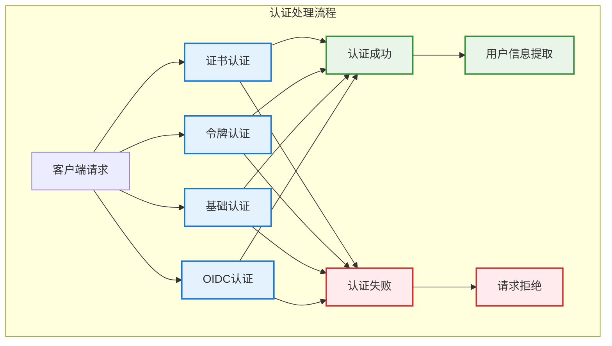
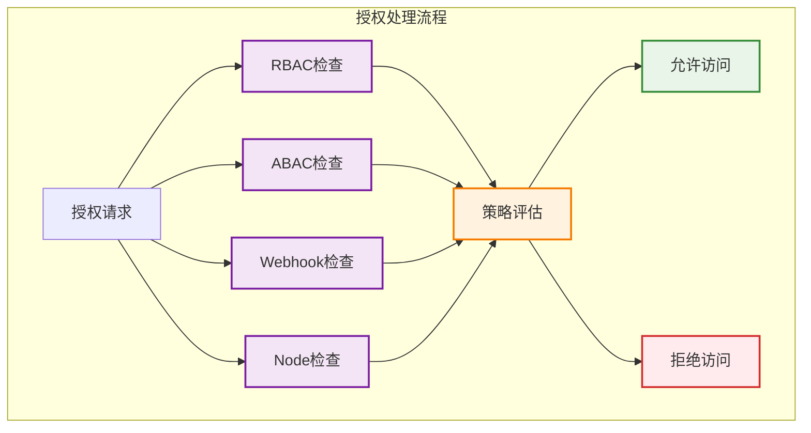

# 认证授权机制

## 概述

Kubernetes 的认证授权机制是确保集群安全的核心组件，通过多层次的安全检查确保只有合法的用户和服务能够访问集群资源。

## 认证机制（Authentication）

### 认证流程



### 认证方式详解

#### 1. 客户端证书认证
```yaml
# 客户端证书配置示例
apiVersion: v1
kind: Config
clusters:
- cluster:
    certificate-authority-data: LS0tLS1CRUdJTi...
    server: https://kubernetes.example.com:6443
  name: kubernetes
contexts:
- context:
    cluster: kubernetes
    user: admin
  name: admin@kubernetes
current-context: admin@kubernetes
users:
- name: admin
  user:
    client-certificate-data: LS0tLS1CRUdJTi...
    client-key-data: LS0tLS1CRUdJTi...
```

**证书验证过程**：
- **证书链验证**：验证证书的签发链
- **有效期检查**：确认证书未过期
- **吊销列表检查**：检查证书是否被吊销
- **用户信息提取**：从证书 Subject 中提取用户信息

#### 2. Bearer Token 认证
```go
// ServiceAccount Token 验证示例
type TokenAuthenticator struct {
    tokenFile string
    keyFile   string
}

func (t *TokenAuthenticator) AuthenticateToken(ctx context.Context, token string) (*authenticator.Response, bool, error) {
    // 1. 解析 JWT Token
    claims, err := t.parseJWTToken(token)
    if err != nil {
        return nil, false, err
    }
    
    // 2. 验证 Token 签名
    if !t.verifyTokenSignature(token, claims) {
        return nil, false, errors.New("invalid token signature")
    }
    
    // 3. 检查 Token 有效期
    if claims.ExpiresAt.Before(time.Now()) {
        return nil, false, errors.New("token expired")
    }
    
    // 4. 提取用户信息
    userInfo := &user.DefaultInfo{
        Name:   claims.Subject,
        Groups: claims.Groups,
        Extra:  claims.Extra,
    }
    
    return &authenticator.Response{
        User: userInfo,
    }, true, nil
}
```

#### 3. OpenID Connect（OIDC）认证
```yaml
# OIDC 配置示例
apiVersion: v1
kind: Config
users:
- name: oidc-user
  user:
    auth-provider:
      name: oidc
      config:
        idp-issuer-url: https://accounts.google.com
        client-id: kubernetes
        client-secret: secret
        refresh-token: refresh_token_here
        idp-certificate-authority-data: LS0tLS1CRUdJTi...
```

## 授权机制（Authorization）

### 授权模式



### RBAC（基于角色的访问控制）

#### RBAC 核心概念
- **Role/ClusterRole**：定义权限集合
- **RoleBinding/ClusterRoleBinding**：将角色绑定到用户或服务账户
- **Subject**：权限的主体（用户、组、服务账户）

#### RBAC 实现示例
```go
// RBAC 授权检查实现
type RBACAuthorizer struct {
    roleGetter       rbaclisters.RoleLister
    roleBindingGetter rbaclisters.RoleBindingLister
    clusterRoleGetter rbaclisters.ClusterRoleLister
    clusterRoleBindingGetter rbaclisters.ClusterRoleBindingLister
}

func (r *RBACAuthorizer) Authorize(ctx context.Context, a authorizer.Attributes) (authorizer.Decision, string, error) {
    // 1. 获取用户信息
    user := a.GetUser()
    if user == nil {
        return authorizer.DecisionNoOpinion, "no user info", nil
    }
    
    // 2. 检查 ClusterRoleBinding
    if decision, reason := r.checkClusterRoleBindings(user, a); decision != authorizer.DecisionNoOpinion {
        return decision, reason, nil
    }
    
    // 3. 检查 RoleBinding（命名空间级别）
    if a.GetNamespace() != "" {
        if decision, reason := r.checkRoleBindings(user, a); decision != authorizer.DecisionNoOpinion {
            return decision, reason, nil
        }
    }
    
    return authorizer.DecisionNoOpinion, "no matching role found", nil
}

func (r *RBACAuthorizer) checkClusterRoleBindings(user user.Info, a authorizer.Attributes) (authorizer.Decision, string) {
    clusterRoleBindings, _ := r.clusterRoleBindingGetter.List(labels.Everything())
    
    for _, binding := range clusterRoleBindings {
        if r.subjectMatches(binding.Subjects, user) {
            clusterRole, _ := r.clusterRoleGetter.Get(binding.RoleRef.Name)
            if clusterRole != nil && r.ruleMatches(clusterRole.Rules, a) {
                return authorizer.DecisionAllow, fmt.Sprintf("allowed by ClusterRoleBinding %s", binding.Name)
            }
        }
    }
    
    return authorizer.DecisionNoOpinion, ""
}
```

#### RBAC 配置示例
```yaml
# ClusterRole 定义
apiVersion: rbac.authorization.k8s.io/v1
kind: ClusterRole
metadata:
  name: pod-reader
rules:
- apiGroups: [""]
  resources: ["pods"]
  verbs: ["get", "watch", "list"]
- apiGroups: ["apps"]
  resources: ["deployments"]
  verbs: ["get", "list"]

---
# ClusterRoleBinding 定义
apiVersion: rbac.authorization.k8s.io/v1
kind: ClusterRoleBinding
metadata:
  name: read-pods-global
subjects:
- kind: User
  name: jane
  apiGroup: rbac.authorization.k8s.io
- kind: ServiceAccount
  name: pod-reader
  namespace: default
roleRef:
  kind: ClusterRole
  name: pod-reader
  apiGroup: rbac.authorization.k8s.io
```

### ABAC（基于属性的访问控制）

#### ABAC 策略文件
```json
{
  "apiVersion": "abac.authorization.kubernetes.io/v1beta1",
  "kind": "Policy",
  "spec": {
    "user": "alice",
    "namespace": "projectCaribou",
    "resource": "pods",
    "readonly": true
  }
}
```

#### ABAC 评估逻辑
```go
// ABAC 策略评估
type ABACAuthorizer struct {
    policyFile string
    policies   []ABACPolicy
}

type ABACPolicy struct {
    User       string                 `json:"user,omitempty"`
    Group      string                 `json:"group,omitempty"`
    Namespace  string                 `json:"namespace,omitempty"`
    Resource   string                 `json:"resource,omitempty"`
    Readonly   bool                   `json:"readonly,omitempty"`
    APIGroup   string                 `json:"apiGroup,omitempty"`
    Extra      map[string]interface{} `json:"extra,omitempty"`
}

func (a *ABACAuthorizer) Authorize(ctx context.Context, attr authorizer.Attributes) (authorizer.Decision, string, error) {
    for _, policy := range a.policies {
        if a.matchesPolicy(policy, attr) {
            return authorizer.DecisionAllow, "allowed by ABAC policy", nil
        }
    }
    return authorizer.DecisionNoOpinion, "no matching ABAC policy", nil
}

func (a *ABACAuthorizer) matchesPolicy(policy ABACPolicy, attr authorizer.Attributes) bool {
    // 检查用户匹配
    if policy.User != "" && policy.User != attr.GetUser().GetName() {
        return false
    }
    
    // 检查组匹配
    if policy.Group != "" && !contains(attr.GetUser().GetGroups(), policy.Group) {
        return false
    }
    
    // 检查命名空间匹配
    if policy.Namespace != "" && policy.Namespace != attr.GetNamespace() {
        return false
    }
    
    // 检查资源匹配
    if policy.Resource != "" && policy.Resource != attr.GetResource() {
        return false
    }
    
    // 检查只读权限
    if policy.Readonly && !attr.IsReadOnly() {
        return false
    }
    
    return true
}
```

### Webhook 授权

#### Webhook 配置
```yaml
# Webhook 授权配置
apiVersion: v1
kind: Config
clusters:
- name: webhook
  cluster:
    server: https://authz.example.com/authorize
    certificate-authority-data: LS0tLS1CRUdJTi...
users:
- name: webhook
  user:
    client-certificate-data: LS0tLS1CRUdJTi...
    client-key-data: LS0tLS1CRUdJTi...
contexts:
- context:
    cluster: webhook
    user: webhook
  name: webhook
current-context: webhook
```

#### Webhook 请求和响应
```go
// Webhook 授权请求
type SubjectAccessReview struct {
    APIVersion string `json:"apiVersion"`
    Kind       string `json:"kind"`
    Spec       SubjectAccessReviewSpec `json:"spec"`
}

type SubjectAccessReviewSpec struct {
    ResourceAttributes *ResourceAttributes `json:"resourceAttributes,omitempty"`
    User               string              `json:"user,omitempty"`
    Groups             []string            `json:"groups,omitempty"`
    Extra              map[string][]string `json:"extra,omitempty"`
}

type ResourceAttributes struct {
    Namespace   string `json:"namespace,omitempty"`
    Verb        string `json:"verb,omitempty"`
    Group       string `json:"group,omitempty"`
    Version     string `json:"version,omitempty"`
    Resource    string `json:"resource,omitempty"`
    Subresource string `json:"subresource,omitempty"`
    Name        string `json:"name,omitempty"`
}

// Webhook 授权响应
type SubjectAccessReviewStatus struct {
    Allowed bool   `json:"allowed"`
    Reason  string `json:"reason,omitempty"`
}
```

## 高级认证授权特性

### 服务账户（ServiceAccount）

#### 自动令牌挂载
```yaml
# ServiceAccount 配置
apiVersion: v1
kind: ServiceAccount
metadata:
  name: my-service-account
  namespace: default
automountServiceAccountToken: true
secrets:
- name: my-service-account-token
```

#### Pod 中的服务账户使用
```yaml
# Pod 使用 ServiceAccount
apiVersion: v1
kind: Pod
metadata:
  name: my-pod
spec:
  serviceAccountName: my-service-account
  containers:
  - name: my-container
    image: nginx
    volumeMounts:
    - name: kube-api-access
      mountPath: /var/run/secrets/kubernetes.io/serviceaccount
      readOnly: true
```

### TokenRequest API

#### 动态令牌生成
```go
// TokenRequest API 使用示例
func requestServiceAccountToken(client kubernetes.Interface, namespace, serviceAccount string) (string, error) {
    tokenRequest := &authenticationv1.TokenRequest{
        Spec: authenticationv1.TokenRequestSpec{
            Audiences: []string{"https://kubernetes.default.svc"},
            ExpirationSeconds: &[]int64{3600}[0], // 1小时过期
        },
    }
    
    result, err := client.CoreV1().
        ServiceAccounts(namespace).
        CreateToken(context.TODO(), serviceAccount, tokenRequest, metav1.CreateOptions{})
    
    if err != nil {
        return "", err
    }
    
    return result.Status.Token, nil
}
```

### 用户模拟（User Impersonation）

#### 模拟配置
```go
// 用户模拟请求
func impersonateUser(config *rest.Config, username string, groups []string) *rest.Config {
    impersonationConfig := rest.CopyConfig(config)
    impersonationConfig.Impersonate = rest.ImpersonationConfig{
        UserName: username,
        Groups:   groups,
        Extra: map[string][]string{
            "department": {"engineering"},
        },
    }
    return impersonationConfig
}
```

## 安全最佳实践

### 认证安全
1. **证书管理**：
   - 定期轮换客户端证书
   - 使用强加密算法
   - 妥善保管私钥文件
   - 设置适当的证书有效期

2. **令牌安全**：
   - 使用短期令牌
   - 定期轮换服务账户令牌
   - 避免在代码中硬编码令牌
   - 使用安全的令牌存储方式

### 授权安全
1. **最小权限原则**：
   - 只授予必要的最小权限
   - 定期审查权限配置
   - 使用命名空间隔离
   - 避免使用 cluster-admin 权限

2. **权限监控**：
   - 启用审计日志
   - 监控权限使用情况
   - 定期清理不必要的权限
   - 实施权限变更审批流程

## 故障排查

### 常见认证问题
1. **证书过期**：
   ```bash
   # 检查证书有效期
   openssl x509 -in client.crt -text -noout | grep "Not After"
   ```

2. **令牌无效**：
   ```bash
   # 验证服务账户令牌
   kubectl auth can-i get pods --as=system:serviceaccount:default:my-sa
   ```

### 常见授权问题
1. **权限不足**：
   ```bash
   # 检查用户权限
   kubectl auth can-i create pods --as=user:alice
   
   # 检查具体权限
   kubectl auth can-i "*" "*" --as=user:alice
   ```

2. **角色绑定错误**：
   ```bash
   # 检查角色绑定
   kubectl get rolebindings,clusterrolebindings -A | grep alice
   ```

## 监控和审计

### 认证授权指标
- **认证成功率**：认证请求的成功百分比
- **授权拒绝率**：授权请求的拒绝百分比
- **令牌使用情况**：服务账户令牌的使用统计
- **权限检查延迟**：权限检查的响应时间

### 审计日志配置
```yaml
# 审计策略配置
apiVersion: audit.k8s.io/v1
kind: Policy
rules:
- level: Metadata
  namespaces: ["default"]
  verbs: ["get", "list", "create", "update", "patch", "delete"]
  resources:
  - group: ""
    resources: ["pods", "services"]
- level: RequestResponse
  namespaces: ["kube-system"]
  verbs: ["create", "update", "patch", "delete"]
  resources:
  - group: ""
    resources: ["*"]
