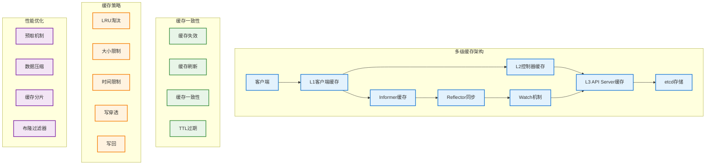

# 缓存机制

## 概述

Kubernetes 缓存机制是提升系统性能的关键组件，通过多级缓存架构减少对 etcd 的直接访问，提高数据读取速度和系统响应能力。缓存机制涵盖了 API Server 缓存、控制器缓存、以及客户端缓存等多个层次，实现了高效的数据访问和一致性保证。

## 缓存架构



## API Server 缓存

### 内存缓存实现

```go
// API Server 缓存接口
type APIServerCache interface {
    Get(ctx context.Context, key string, opts GetOptions) (runtime.Object, error)
    Set(ctx context.Context, key string, obj runtime.Object, ttl time.Duration) error
    Delete(ctx context.Context, key string) error
    List(ctx context.Context, prefix string, opts ListOptions) ([]runtime.Object, error)
    Watch(ctx context.Context, key string, opts WatchOptions) (watch.Interface, error)
}

// 内存缓存实现
type MemoryCache struct {
    // 数据存储
    data     map[string]*CacheEntry
    indexes  map[string]map[string]*CacheEntry // 索引支持
    
    // 淘汰策略
    lru      *LRUCache
    
    // 配置
    maxSize      int
    defaultTTL   time.Duration
    
    // 统计信息
    hits         int64
    misses       int64
    evictions    int64
    
    // 同步控制
    mutex        sync.RWMutex
    
    // 过期清理
    cleanupTimer *time.Timer
    
    logger klog.Logger
}

type CacheEntry struct {
    Key        string
    Object     runtime.Object
    CreateTime time.Time
    TTL        time.Duration
    AccessTime time.Time
    Version    string
    
    // 索引字段
    Namespace  string
    Kind       string
    Name       string
    Labels     map[string]string
}

func NewMemoryCache(maxSize int, defaultTTL time.Duration) *MemoryCache {
    cache := &MemoryCache{
        data:       make(map[string]*CacheEntry),
        indexes:    make(map[string]map[string]*CacheEntry),
        lru:        NewLRUCache(maxSize),
        maxSize:    maxSize,
        defaultTTL: defaultTTL,
        logger:     klog.WithName("memory-cache"),
    }
    
    // 启动清理定时器
    cache.startCleanupTimer()
    
    return cache
}

func (c *MemoryCache) Get(ctx context.Context, key string, opts GetOptions) (runtime.Object, error) {
    c.mutex.RLock()
    defer c.mutex.RUnlock()
    
    entry, exists := c.data[key]
    if !exists {
        atomic.AddInt64(&c.misses, 1)
        return nil, ErrCacheMiss
    }
    
    // 检查是否过期
    if c.isExpired(entry) {
        atomic.AddInt64(&c.misses, 1)
        go c.evictEntry(key) // 异步清理过期条目
        return nil, ErrCacheMiss
    }
    
    // 更新访问时间和 LRU
    entry.AccessTime = time.Now()
    c.lru.Access(key)
    
    atomic.AddInt64(&c.hits, 1)
    
    c.logger.V(5).Info("Cache hit", "key", key)
    return entry.Object.DeepCopyObject(), nil
}

func (c *MemoryCache) Set(ctx context.Context, key string, obj runtime.Object, ttl time.Duration) error {
    c.mutex.Lock()
    defer c.mutex.Unlock()
    
    if ttl == 0 {
        ttl = c.defaultTTL
    }
    
    // 检查容量限制
    if len(c.data) >= c.maxSize {
        c.evictLRU()
    }
    
    // 创建缓存条目
    entry := &CacheEntry{
        Key:        key,
        Object:     obj.DeepCopyObject(),
        CreateTime: time.Now(),
        TTL:        ttl,
        AccessTime: time.Now(),
    }
    
    // 提取元数据
    if err := c.extractMetadata(entry); err != nil {
        return err
    }
    
    // 存储条目
    c.data[key] = entry
    c.lru.Add(key)
    
    // 更新索引
    c.updateIndexes(entry)
    
    c.logger.V(5).Info("Cache set", 
        "key", key,
        "ttl", ttl,
        "kind", entry.Kind)
    
    return nil
}

func (c *MemoryCache) Delete(ctx context.Context, key string) error {
    c.mutex.Lock()
    defer c.mutex.Unlock()
    
    return c.evictEntry(key)
}

func (c *MemoryCache) List(ctx context.Context, prefix string, opts ListOptions) ([]runtime.Object, error) {
    c.mutex.RLock()
    defer c.mutex.RUnlock()
    
    var results []runtime.Object
    
    if opts.LabelSelector != nil {
        // 使用标签索引
        return c.listByLabels(opts.LabelSelector)
    }
    
    if opts.FieldSelector != nil {
        // 使用字段索引
        return c.listByFields(opts.FieldSelector)
    }
    
    // 前缀匹配
    for key, entry := range c.data {
        if !strings.HasPrefix(key, prefix) {
            continue
        }
        
        if c.isExpired(entry) {
            go c.evictEntry(key)
            continue
        }
        
        results = append(results, entry.Object.DeepCopyObject())
    }
    
    return results, nil
}

func (c *MemoryCache) extractMetadata(entry *CacheEntry) error {
    accessor, err := meta.Accessor(entry.Object)
    if err != nil {
        return err
    }
    
    entry.Namespace = accessor.GetNamespace()
    entry.Name = accessor.GetName()
    entry.Labels = accessor.GetLabels()
    entry.Version = accessor.GetResourceVersion()
    
    gvk := entry.Object.GetObjectKind().GroupVersionKind()
    entry.Kind = gvk.Kind
    
    return nil
}

func (c *MemoryCache) updateIndexes(entry *CacheEntry) {
    // 命名空间索引
    if entry.Namespace != "" {
        c.addToIndex("namespace", entry.Namespace, entry)
    }
    
    // 类型索引
    c.addToIndex("kind", entry.Kind, entry)
    
    // 标签索引
    for key, value := range entry.Labels {
        labelKey := fmt.Sprintf("label:%s=%s", key, value)
        c.addToIndex("label", labelKey, entry)
    }
}

func (c *MemoryCache) addToIndex(indexType, indexKey string, entry *CacheEntry) {
    if c.indexes[indexType] == nil {
        c.indexes[indexType] = make(map[string]*CacheEntry)
    }
    c.indexes[indexType][indexKey] = entry
}

func (c *MemoryCache) isExpired(entry *CacheEntry) bool {
    if entry.TTL <= 0 {
        return false
    }
    return time.Since(entry.CreateTime) > entry.TTL
}

func (c *MemoryCache) evictEntry(key string) error {
    if entry, exists := c.data[key]; exists {
        delete(c.data, key)
        c.lru.Remove(key)
        c.removeFromIndexes(entry)
        atomic.AddInt64(&c.evictions, 1)
        
        c.logger.V(5).Info("Cache entry evicted", "key", key)
    }
    return nil
}

func (c *MemoryCache) evictLRU() {
    if key := c.lru.RemoveLRU(); key != "" {
        c.evictEntry(key)
    }
}

func (c *MemoryCache) startCleanupTimer() {
    c.cleanupTimer = time.NewTimer(time.Minute)
    go c.cleanupLoop()
}

func (c *MemoryCache) cleanupLoop() {
    for {
        select {
        case <-c.cleanupTimer.C:
            c.cleanup()
            c.cleanupTimer.Reset(time.Minute)
        }
    }
}

func (c *MemoryCache) cleanup() {
    c.mutex.Lock()
    defer c.mutex.Unlock()
    
    var expiredKeys []string
    
    for key, entry := range c.data {
        if c.isExpired(entry) {
            expiredKeys = append(expiredKeys, key)
        }
    }
    
    for _, key := range expiredKeys {
        c.evictEntry(key)
    }
    
    c.logger.V(4).Info("Cache cleanup completed", 
        "expiredCount", len(expiredKeys),
        "totalEntries", len(c.data))
}

func (c *MemoryCache) GetStats() CacheStats {
    c.mutex.RLock()
    defer c.mutex.RUnlock()
    
    hits := atomic.LoadInt64(&c.hits)
    misses := atomic.LoadInt64(&c.misses)
    evictions := atomic.LoadInt64(&c.evictions)
    
    hitRate := float64(0)
    if hits+misses > 0 {
        hitRate = float64(hits) / float64(hits+misses)
    }
    
    return CacheStats{
        Hits:      hits,
        Misses:    misses,
        Evictions: evictions,
        HitRate:   hitRate,
        Size:      len(c.data),
        MaxSize:   c.maxSize,
    }
}

type CacheStats struct {
    Hits      int64
    Misses    int64
    Evictions int64
    HitRate   float64
    Size      int
    MaxSize   int
}
```

### LRU 缓存实现

```go
// LRU 缓存实现
type LRUCache struct {
    capacity int
    items    map[string]*LRUNode
    head     *LRUNode
    tail     *LRUNode
    
    mutex sync.Mutex
}

type LRUNode struct {
    Key  string
    Prev *LRUNode
    Next *LRUNode
}

func NewLRUCache(capacity int) *LRUCache {
    lru := &LRUCache{
        capacity: capacity,
        items:    make(map[string]*LRUNode),
    }
    
    // 创建哨兵节点
    lru.head = &LRUNode{}
    lru.tail = &LRUNode{}
    lru.head.Next = lru.tail
    lru.tail.Prev = lru.head
    
    return lru
}

func (lru *LRUCache) Add(key string) {
    lru.mutex.Lock()
    defer lru.mutex.Unlock()
    
    if node, exists := lru.items[key]; exists {
        lru.moveToHead(node)
        return
    }
    
    node := &LRUNode{Key: key}
    lru.items[key] = node
    lru.addToHead(node)
    
    if len(lru.items) > lru.capacity {
        tail := lru.removeTail()
        delete(lru.items, tail.Key)
    }
}

func (lru *LRUCache) Access(key string) {
    lru.mutex.Lock()
    defer lru.mutex.Unlock()
    
    if node, exists := lru.items[key]; exists {
        lru.moveToHead(node)
    }
}

func (lru *LRUCache) Remove(key string) {
    lru.mutex.Lock()
    defer lru.mutex.Unlock()
    
    if node, exists := lru.items[key]; exists {
        lru.removeNode(node)
        delete(lru.items, key)
    }
}

func (lru *LRUCache) RemoveLRU() string {
    lru.mutex.Lock()
    defer lru.mutex.Unlock()
    
    if len(lru.items) == 0 {
        return ""
    }
    
    tail := lru.removeTail()
    delete(lru.items, tail.Key)
    return tail.Key
}

func (lru *LRUCache) addToHead(node *LRUNode) {
    node.Prev = lru.head
    node.Next = lru.head.Next
    
    lru.head.Next.Prev = node
    lru.head.Next = node
}

func (lru *LRUCache) removeNode(node *LRUNode) {
    node.Prev.Next = node.Next
    node.Next.Prev = node.Prev
}

func (lru *LRUCache) moveToHead(node *LRUNode) {
    lru.removeNode(node)
    lru.addToHead(node)
}

func (lru *LRUCache) removeTail() *LRUNode {
    tail := lru.tail.Prev
    lru.removeNode(tail)
    return tail
}
```

## 控制器缓存（Informer）

### Informer 缓存实现

```go
// Informer 缓存管理器
type InformerCache struct {
    // 存储接口
    store cache.Store
    
    // 索引器
    indexer cache.Indexer
    
    // 控制器
    controller cache.Controller
    
    // 事件处理器
    eventHandlers []cache.ResourceEventHandler
    
    // 同步状态
    hasSynced cache.InformerSynced
    
    // 配置
    resyncPeriod time.Duration
    
    logger klog.Logger
}

func NewInformerCache(
    lw cache.ListerWatcher,
    objType runtime.Object,
    resyncPeriod time.Duration,
    indexers cache.Indexers,
) *InformerCache {
    
    // 创建索引器存储
    store := cache.NewIndexer(cache.MetaNamespaceKeyFunc, indexers)
    
    // 创建 Informer 缓存
    ic := &InformerCache{
        store:        store,
        indexer:      store,
        resyncPeriod: resyncPeriod,
        logger:       klog.WithName("informer-cache"),
    }
    
    // 创建控制器
    ic.controller = cache.NewController(
        lw,
        objType,
        resyncPeriod,
        ic,
    )
    
    return ic
}

func (ic *InformerCache) Run(stopCh <-chan struct{}) {
    ic.logger.Info("Starting informer cache")
    
    go ic.controller.Run(stopCh)
    
    // 等待初始同步完成
    if !cache.WaitForCacheSync(stopCh, ic.controller.HasSynced) {
        ic.logger.Error(nil, "Failed to sync informer cache")
        return
    }
    
    ic.logger.Info("Informer cache synced")
    
    <-stopCh
    ic.logger.Info("Shutting down informer cache")
}

func (ic *InformerCache) AddEventHandler(handler cache.ResourceEventHandler) {
    ic.eventHandlers = append(ic.eventHandlers, handler)
}

func (ic *InformerCache) AddEventHandlerWithResyncPeriod(
    handler cache.ResourceEventHandler,
    resyncPeriod time.Duration,
) {
    // 包装处理器以支持不同的重同步周期
    wrappedHandler := &resyncAwareHandler{
        handler:      handler,
        resyncPeriod: resyncPeriod,
        lastResync:   time.Now(),
    }
    ic.eventHandlers = append(ic.eventHandlers, wrappedHandler)
}

func (ic *InformerCache) GetStore() cache.Store {
    return ic.store
}

func (ic *InformerCache) GetIndexer() cache.Indexer {
    return ic.indexer
}

func (ic *InformerCache) HasSynced() bool {
    return ic.controller.HasSynced()
}

// 实现 cache.ResourceEventHandler 接口
func (ic *InformerCache) OnAdd(obj interface{}) {
    ic.logger.V(5).Info("Object added to cache", "key", ic.getKey(obj))
    
    for _, handler := range ic.eventHandlers {
        handler.OnAdd(obj)
    }
}

func (ic *InformerCache) OnUpdate(oldObj, newObj interface{}) {
    ic.logger.V(5).Info("Object updated in cache", "key", ic.getKey(newObj))
    
    for _, handler := range ic.eventHandlers {
        handler.OnUpdate(oldObj, newObj)
    }
}

func (ic *InformerCache) OnDelete(obj interface{}) {
    ic.logger.V(5).Info("Object deleted from cache", "key", ic.getKey(obj))
    
    for _, handler := range ic.eventHandlers {
        handler.OnDelete(obj)
    }
}

func (ic *InformerCache) getKey(obj interface{}) string {
    key, err := cache.MetaNamespaceKeyFunc(obj)
    if err != nil {
        return "<unknown>"
    }
    return key
}

// 支持不同重同步周期的处理器包装
type resyncAwareHandler struct {
    handler      cache.ResourceEventHandler
    resyncPeriod time.Duration
    lastResync   time.Time
    mutex        sync.Mutex
}

func (h *resyncAwareHandler) OnAdd(obj interface{}) {
    h.handler.OnAdd(obj)
}

func (h *resyncAwareHandler) OnUpdate(oldObj, newObj interface{}) {
    h.mutex.Lock()
    defer h.mutex.Unlock()
    
    now := time.Now()
    if now.Sub(h.lastResync) >= h.resyncPeriod {
        h.lastResync = now
        // 触发重同步
        h.handler.OnUpdate(oldObj, newObj)
    } else {
        h.handler.OnUpdate(oldObj, newObj)
    }
}

func (h *resyncAwareHandler) OnDelete(obj interface{}) {
    h.handler.OnDelete(obj)
}
```

### 共享 Informer 工厂

```go
// 共享 Informer 工厂
type SharedInformerFactory struct {
    client       kubernetes.Interface
    namespace    string
    resyncPeriod time.Duration
    
    // Informer 缓存
    informers map[reflect.Type]cache.SharedIndexInformer
    
    // 启动状态
    startedInformers map[reflect.Type]bool
    started          bool
    
    // 同步控制
    mutex sync.Mutex
    
    logger klog.Logger
}

func NewSharedInformerFactory(
    client kubernetes.Interface,
    resyncPeriod time.Duration,
) *SharedInformerFactory {
    return &SharedInformerFactory{
        client:           client,
        resyncPeriod:     resyncPeriod,
        informers:        make(map[reflect.Type]cache.SharedIndexInformer),
        startedInformers: make(map[reflect.Type]bool),
        logger:           klog.WithName("shared-informer-factory"),
    }
}

func (f *SharedInformerFactory) ForResource(resource schema.GroupVersionResource) cache.SharedIndexInformer {
    return f.InformerFor(&metav1.PartialObjectMetadata{}, func() cache.SharedIndexInformer {
        return cache.NewSharedIndexInformer(
            f.createListWatcher(resource),
            &metav1.PartialObjectMetadata{},
            f.resyncPeriod,
            cache.Indexers{},
        )
    })
}

func (f *SharedInformerFactory) InformerFor(obj runtime.Object, newFunc func() cache.SharedIndexInformer) cache.SharedIndexInformer {
    f.mutex.Lock()
    defer f.mutex.Unlock()
    
    objType := reflect.TypeOf(obj)
    
    if informer, exists := f.informers[objType]; exists {
        return informer
    }
    
    informer := newFunc()
    f.informers[objType] = informer
    
    // 如果工厂已经启动，立即启动这个 Informer
    if f.started {
        go f.startInformerLocked(objType, informer)
    }
    
    return informer
}

func (f *SharedInformerFactory) Start(stopCh <-chan struct{}) {
    f.mutex.Lock()
    defer f.mutex.Unlock()
    
    if f.started {
        return
    }
    
    f.started = true
    
    // 启动所有 Informer
    for objType, informer := range f.informers {
        if !f.startedInformers[objType] {
            go f.startInformerLocked(objType, informer)
        }
    }
    
    <-stopCh
}

func (f *SharedInformerFactory) startInformerLocked(objType reflect.Type, informer cache.SharedIndexInformer) {
    f.startedInformers[objType] = true
    informer.Run(make(<-chan struct{}))
}

func (f *SharedInformerFactory) WaitForCacheSync(stopCh <-chan struct{}) map[reflect.Type]bool {
    informers := make(map[reflect.Type]cache.SharedIndexInformer)
    
    f.mutex.Lock()
    for objType, informer := range f.informers {
        if f.startedInformers[objType] {
            informers[objType] = informer
        }
    }
    f.mutex.Unlock()
    
    result := make(map[reflect.Type]bool)
    for objType, informer := range informers {
        result[objType] = cache.WaitForCacheSync(stopCh, informer.HasSynced)
    }
    
    return result
}

func (f *SharedInformerFactory) createListWatcher(resource schema.GroupVersionResource) cache.ListerWatcher {
    return &cache.ListWatch{
        ListFunc: func(options metav1.ListOptions) (runtime.Object, error) {
            return f.client.CoreV1().RESTClient().
                Get().
                Namespace(f.namespace).
                Resource(resource.Resource).
                VersionedParams(&options, metav1.ParameterCodec).
                Do(context.TODO()).
                Get()
        },
        WatchFunc: func(options metav1.ListOptions) (watch.Interface, error) {
            options.Watch = true
            return f.client.CoreV1().RESTClient().
                Get().
                Namespace(f.namespace).
                Resource(resource.Resource).
                VersionedParams(&options, metav1.ParameterCodec).
                Watch(context.TODO())
        },
    }
}
```

## 分布式缓存

### Redis 缓存实现

```go
// Redis 缓存实现
type RedisCache struct {
    client  *redis.Client
    prefix  string
    codec   runtime.Codec
    
    // 配置
    defaultTTL time.Duration
    maxRetries int
    
    // 连接池
    pool *redis.Pool
    
    logger klog.Logger
}

func NewRedisCache(config *RedisConfig, codec runtime.Codec) *RedisCache {
    client := redis.NewClient(&redis.Options{
        Addr:     config.Addr,
        Password: config.Password,
        DB:       config.DB,
        PoolSize: config.PoolSize,
    })
    
    return &RedisCache{
        client:     client,
        prefix:     config.Prefix,
        codec:      codec,
        defaultTTL: config.DefaultTTL,
        maxRetries: config.MaxRetries,
        logger:     klog.WithName("redis-cache"),
    }
}

func (r *RedisCache) Get(ctx context.Context, key string, obj runtime.Object) error {
    fullKey := r.getFullKey(key)
    
    data, err := r.client.Get(ctx, fullKey).Bytes()
    if err != nil {
        if err == redis.Nil {
            return ErrCacheMiss
        }
        return err
    }
    
    // 反序列化数据
    _, _, err = r.codec.Decode(data, nil, obj)
    if err != nil {
        r.logger.Error(err, "Failed to decode cached object", "key", key)
        // 删除损坏的缓存条目
        r.client.Del(ctx, fullKey)
        return ErrCacheMiss
    }
    
    r.logger.V(5).Info("Redis cache hit", "key", key)
    return nil
}

func (r *RedisCache) Set(ctx context.Context, key string, obj runtime.Object, ttl time.Duration) error {
    if ttl == 0 {
        ttl = r.defaultTTL
    }
    
    // 序列化对象
    var buf bytes.Buffer
    if err := r.codec.Encode(obj, &buf); err != nil {
        return err
    }
    
    fullKey := r.getFullKey(key)
    
    err := r.client.Set(ctx, fullKey, buf.Bytes(), ttl).Err()
    if err != nil {
        r.logger.Error(err, "Failed to set cache", "key", key)
        return err
    }
    
    r.logger.V(5).Info("Redis cache set", "key", key, "ttl", ttl)
    return nil
}

func (r *RedisCache) Delete(ctx context.Context, key string) error {
    fullKey := r.getFullKey(key)
    return r.client.Del(ctx, fullKey).Err()
}

func (r *RedisCache) DeletePattern(ctx context.Context, pattern string) error {
    fullPattern := r.getFullKey(pattern)
    
    keys, err := r.client.Keys(ctx, fullPattern).Result()
    if err != nil {
        return err
    }
    
    if len(keys) == 0 {
        return nil
    }
    
    return r.client.Del(ctx, keys...).Err()
}

func (r *RedisCache) Exists(ctx context.Context, key string) (bool, error) {
    fullKey := r.getFullKey(key)
    count, err := r.client.Exists(ctx, fullKey).Result()
    return count > 0, err
}

func (r *RedisCache) TTL(ctx context.Context, key string) (time.Duration, error) {
    fullKey := r.getFullKey(key)
    return r.client.TTL(ctx, fullKey).Result()
}

func (r *RedisCache) getFullKey(key string) string {
    if r.prefix == "" {
        return key
    }
    return fmt.Sprintf("%s:%s", r.prefix, key)
}

// 批量操作支持
func (r *RedisCache) MGet(ctx context.Context, keys []string) (map[string]runtime.Object, error) {
    if len(keys) == 0 {
        return make(map[string]runtime.Object), nil
    }
    
    fullKeys := make([]string, len(keys))
    for i, key := range keys {
        fullKeys[i] = r.getFullKey(key)
    }
    
    values, err := r.client.MGet(ctx, fullKeys...).Result()
    if err != nil {
        return nil, err
    }
    
    result := make(map[string]runtime.Object)
    
    for i, val := range values {
        if val == nil {
            continue
        }
        
        data, ok := val.(string)
        if !ok {
            continue
        }
        
        obj := &unstructured.Unstructured{}
        if _, _, err := r.codec.Decode([]byte(data), nil, obj); err != nil {
            r.logger.Error(err, "Failed to decode cached object", "key", keys[i])
            continue
        }
        
        result[keys[i]] = obj
    }
    
    return result, nil
}

func (r *RedisCache) MSet(ctx context.Context, items map[string]runtime.Object, ttl time.Duration) error {
    if len(items) == 0 {
        return nil
    }
    
    pipe := r.client.Pipeline()
    
    for key, obj := range items {
        var buf bytes.Buffer
        if err := r.codec.Encode(obj, &buf); err != nil {
            return err
        }
        
        fullKey := r.getFullKey(key)
        pipe.Set(ctx, fullKey, buf.Bytes(), ttl)
    }
    
    _, err := pipe.Exec(ctx)
    return err
}

type RedisConfig struct {
    Addr       string
    Password   string
    DB         int
    PoolSize   int
    Prefix     string
    DefaultTTL time.Duration
    MaxRetries int
}
```

### 分布式缓存一致性

```go
// 缓存一致性管理器
type CacheCoherenceManager struct {
    caches    []Cache
    publisher MessagePublisher
    
    // 失效策略
    invalidationStrategy InvalidationStrategy
    
    // 同步控制
    mutex sync.RWMutex
    
    logger klog.Logger
}

type Cache interface {
    Get(ctx context.Context, key string, obj runtime.Object) error
    Set(ctx context.Context, key string, obj runtime.Object, ttl time.Duration) error
    Delete(ctx context.Context, key string) error
    Invalidate(ctx context.Context, keys []string) error
}

type MessagePublisher interface {
    Publish(ctx context.Context, topic string, message []byte) error
    Subscribe(ctx context.Context, topic string, handler func([]byte)) error
}

type InvalidationStrategy interface {
    ShouldInvalidate(old, new runtime.Object) bool
    GetInvalidationKeys(obj runtime.Object) []string
}

func NewCacheCoherenceManager(
    caches []Cache,
    publisher MessagePublisher,
    strategy InvalidationStrategy,
) *CacheCoherenceManager {
    
    ccm := &CacheCoherenceManager{
        caches:               caches,
        publisher:           publisher,
        invalidationStrategy: strategy,
        logger:              klog.WithName("cache-coherence"),
    }
    
    // 订阅失效消息
    ccm.subscribeInvalidationMessages()
    
    return ccm
}

func (ccm *CacheCoherenceManager) OnObjectUpdate(old, new runtime.Object) {
    if !ccm.invalidationStrategy.ShouldInvalidate(old, new) {
        return
    }
    
    keys := ccm.invalidationStrategy.GetInvalidationKeys(new)
    if len(keys) == 0 {
        return
    }
    
    ccm.invalidateKeys(context.Background(), keys)
}

func (ccm *CacheCoherenceManager) OnObjectDelete(obj runtime.Object) {
    keys := ccm.invalidationStrategy.GetInvalidationKeys(obj)
    ccm.invalidateKeys(context.Background(), keys)
}

func (ccm *CacheCoherenceManager) invalidateKeys(ctx context.Context, keys []string) {
    // 构建失效消息
    message := &InvalidationMessage{
        Keys:      keys,
        Timestamp: time.Now(),
    }
    
    data, err := json.Marshal(message)
    if err != nil {
        ccm.logger.Error(err, "Failed to marshal invalidation message")
        return
    }
    
    // 发布失效消息
    if err := ccm.publisher.Publish(ctx, "cache.invalidation", data); err != nil {
        ccm.logger.Error(err, "Failed to publish invalidation message")
        return
    }
    
    ccm.logger.V(4).Info("Published invalidation message", "keys", keys)
}

func (ccm *CacheCoherenceManager) subscribeInvalidationMessages() {
    ccm.publisher.Subscribe(context.Background(), "cache.invalidation", func(data []byte) {
        var message InvalidationMessage
        if err := json.Unmarshal(data, &message); err != nil {
            ccm.logger.Error(err, "Failed to unmarshal invalidation message")
            return
        }
        
        ccm.handleInvalidationMessage(&message)
    })
}

func (ccm *CacheCoherenceManager) handleInvalidationMessage(message *InvalidationMessage) {
    ctx := context.Background()
    
    ccm.mutex.RLock()
    caches := make([]Cache, len(ccm.caches))
    copy(caches, ccm.caches)
    ccm.mutex.RUnlock()
    
    // 并行失效所有缓存
    var wg sync.WaitGroup
    for _, cache := range caches {
        wg.Add(1)
        go func(c Cache) {
            defer wg.Done()
            
            if err := c.Invalidate(ctx, message.Keys); err != nil {
                ccm.logger.Error(err, "Failed to invalidate cache")
            }
        }(cache)
    }
    
    wg.Wait()
    
    ccm.logger.V(4).Info("Processed invalidation message", 
        "keys", message.Keys,
        "timestamp", message.Timestamp)
}

type InvalidationMessage struct {
    Keys      []string  `json:"keys"`
    Timestamp time.Time `json:"timestamp"`
}

// 默认失效策略
type DefaultInvalidationStrategy struct{}

func (s *DefaultInvalidationStrategy) ShouldInvalidate(old, new runtime.Object) bool {
    if old == nil || new == nil {
        return true
    }
    
    oldAccessor, err1 := meta.Accessor(old)
    newAccessor, err2 := meta.Accessor(new)
    
    if err1 != nil || err2 != nil {
        return true
    }
    
    // 检查资源版本是否变化
    return oldAccessor.GetResourceVersion() != newAccessor.GetResourceVersion()
}

func (s *DefaultInvalidationStrategy) GetInvalidationKeys(obj runtime.Object) []string {
    accessor, err := meta.Accessor(obj)
    if err != nil {
        return nil
    }
    
    gvk := obj.GetObjectKind().GroupVersionKind()
    
    var keys []string
    
    // 对象键
    objKey := fmt.Sprintf("%s/%s/%s/%s", 
        gvk.Group, gvk.Version, gvk.Kind, 
        cache.MetaNamespaceKeyFunc(obj))
    keys = append(keys, objKey)
    
    // 列表键
    listKey := fmt.Sprintf("%s/%s/%s/list", gvk.Group, gvk.Version, gvk.Kind)
    keys = append(keys, listKey)
    
    // 命名空间列表键
    if accessor.GetNamespace() != "" {
        nsListKey := fmt.Sprintf("%s/%s/%s/%s/list", 
            gvk.Group, gvk.Version, gvk.Kind, accessor.GetNamespace())
        keys = append(keys, nsListKey)
    }
    
    return keys
}
```

## 缓存预热和预取

### 缓存预热机制

```go
// 缓存预热管理器
type CacheWarmupManager struct {
    cache        Cache
    client       kubernetes.Interface
    warmupRules  []WarmupRule
    
    // 预热状态
    warmupStatus map[string]*WarmupStatus
    
    // 配置
    batchSize    int
    parallelism  int
    
    mutex  sync.RWMutex
    logger klog.Logger
}

type WarmupRule struct {
    Resource     schema.GroupVersionResource
    Namespace    string
    LabelSelector string
    FieldSelector string
    Priority     int
    TTL          time.Duration
}

type WarmupStatus struct {
    Rule         *WarmupRule
    StartTime    time.Time
    EndTime      time.Time
    Success      bool
    ItemsWarmed  int
    Error        error
}

func NewCacheWarmupManager(
    cache Cache,
    client kubernetes.Interface,
    batchSize, parallelism int,
) *CacheWarmupManager {
    
    return &CacheWarmupManager{
        cache:        cache,
        client:       client,
        warmupStatus: make(map[string]*WarmupStatus),
        batchSize:    batchSize,
        parallelism:  parallelism,
        logger:       klog.WithName("cache-warmup"),
    }
}

func (cwm *CacheWarmupManager) AddWarmupRule(rule WarmupRule) {
    cwm.mutex.Lock()
    defer cwm.mutex.Unlock()
    
    cwm.warmupRules = append(cwm.warmupRules, rule)
    
    // 按优先级排序
    sort.Slice(cwm.warmupRules, func(i, j int) bool {
        return cwm.warmupRules[i].Priority > cwm.warmupRules[j].Priority
    })
}

func (cwm *CacheWarmupManager) StartWarmup(ctx context.Context) error {
    cwm.logger.Info("Starting cache warmup", "rules", len(cwm.warmupRules))
    
    for _, rule := range cwm.warmupRules {
        if err := cwm.warmupResource(ctx, rule); err != nil {
            cwm.logger.Error(err, "Failed to warmup resource", "resource", rule.Resource)
            continue
        }
    }
    
    cwm.logger.Info("Cache warmup completed")
    return nil
}

func (cwm *CacheWarmupManager) warmupResource(ctx context.Context, rule WarmupRule) error {
    ruleKey := cwm.getRuleKey(rule)
    
    status := &WarmupStatus{
        Rule:      &rule,
        StartTime: time.Now(),
    }
    
    cwm.mutex.Lock()
    cwm.warmupStatus[ruleKey] = status
    cwm.mutex.Unlock()
    
    defer func() {
        status.EndTime = time.Now()
    }()
    
    cwm.logger.Info("Starting resource warmup", "resource", rule.Resource)
    
    // 构建列表选项
    listOptions := metav1.ListOptions{}
    if rule.LabelSelector != "" {
        listOptions.LabelSelector = rule.LabelSelector
    }
    if rule.FieldSelector != "" {
        listOptions.FieldSelector = rule.FieldSelector
    }
    
    // 获取资源列表
    list, err := cwm.listResource(ctx, rule.Resource, rule.Namespace, listOptions)
    if err != nil {
        status.Error = err
        return err
    }
    
    items, err := meta.ExtractList(list)
    if err != nil {
        status.Error = err
        return err
    }
    
    // 批量预热
    if err := cwm.warmupItems(ctx, items, rule.TTL); err != nil {
        status.Error = err
        return err
    }
    
    status.Success = true
    status.ItemsWarmed = len(items)
    
    cwm.logger.Info("Resource warmup completed",
        "resource", rule.Resource,
        "items", len(items))
    
    return nil
}

func (cwm *CacheWarmupManager) warmupItems(ctx context.Context, items []runtime.Object, ttl time.Duration) error {
    // 分批处理
    batches := cwm.splitIntoBatches(items)
    
    // 并行预热
    errCh := make(chan error, len(batches))
    semaphore := make(chan struct{}, cwm.parallelism)
    
    var wg sync.WaitGroup
    for _, batch := range batches {
        wg.Add(1)
        go func(batch []runtime.Object) {
            defer wg.Done()
            
            semaphore <- struct{}{}
            defer func() { <-semaphore }()
            
            errCh <- cwm.warmupBatch(ctx, batch, ttl)
        }(batch)
    }
    
    wg.Wait()
    close(errCh)
    
    // 收集错误
    var errors []error
    for err := range errCh {
        if err != nil {
            errors = append(errors, err)
        }
    }
    
    if len(errors) > 0 {
        return fmt.Errorf("warmup failed with %d errors: %v", len(errors), errors[0])
    }
    
    return nil
}

func (cwm *CacheWarmupManager) warmupBatch(ctx context.Context, items []runtime.Object, ttl time.Duration) error {
    for _, item := range items {
        key, err := cwm.getCacheKey(item)
        if err != nil {
            continue
        }
        
        if err := cwm.cache.Set(ctx, key, item, ttl); err != nil {
            cwm.logger.Error(err, "Failed to cache item", "key", key)
            continue
        }
    }
    
    return nil
}

func (cwm *CacheWarmupManager) splitIntoBatches(items []runtime.Object) [][]runtime.Object {
    var batches [][]runtime.Object
    
    for i := 0; i < len(items); i += cwm.batchSize {
        end := i + cwm.batchSize
        if end > len(items) {
            end = len(items)
        }
        batches = append(batches, items[i:end])
    }
    
    return batches
}

func (cwm *CacheWarmupManager) listResource(
    ctx context.Context,
    resource schema.GroupVersionResource,
    namespace string,
    listOptions metav1.ListOptions,
) (runtime.Object, error) {
    
    // 构建 REST 客户端请求
    req := cwm.client.CoreV1().RESTClient().
        Get().
        Resource(resource.Resource).
        VersionedParams(&listOptions, metav1.ParameterCodec)
    
    if namespace != "" {
        req = req.Namespace(namespace)
    }
    
    return req.Do(ctx).Get()
}

func (cwm *CacheWarmupManager) getCacheKey(obj runtime.Object) (string, error) {
    accessor, err := meta.Accessor(obj)
    if err != nil {
        return "", err
    }
    
    gvk := obj.GetObjectKind().GroupVersionKind()
    
    if accessor.GetNamespace() != "" {
        return fmt.Sprintf("%s/%s/%s/%s/%s",
            gvk.Group, gvk.Version, gvk.Kind,
            accessor.GetNamespace(), accessor.GetName()), nil
    }
    
    return fmt.Sprintf("%s/%s/%s/%s",
        gvk.Group, gvk.Version, gvk.Kind,
        accessor.GetName()), nil
}

func (cwm *CacheWarmupManager) getRuleKey(rule WarmupRule) string {
    return fmt.Sprintf("%s/%s/%s",
        rule.Resource.String(),
        rule.Namespace,
        rule.LabelSelector)
}

func (cwm *CacheWarmupManager) GetWarmupStatus() map[string]*WarmupStatus {
    cwm.mutex.RLock()
    defer cwm.mutex.RUnlock()
    
    result := make(map[string]*WarmupStatus)
    for k, v := range cwm.warmupStatus {
        result[k] = v
    }
    
    return result
}
```

## 监控和调试

### 缓存性能指标

```go
// 缓存性能指标
var (
    cacheHits = prometheus.NewCounterVec(
        prometheus.CounterOpts{
            Name: "kubernetes_cache_hits_total",
            Help: "Total number of cache hits",
        },
        []string{"cache_type", "cache_level"},
    )
    
    cacheMisses = prometheus.NewCounterVec(
        prometheus.CounterOpts{
            Name: "kubernetes_cache_misses_total",
            Help: "Total number of cache misses",
        },
        []string{"cache_type", "cache_level"},
    )
    
    cacheEvictions = prometheus.NewCounterVec(
        prometheus.CounterOpts{
            Name: "kubernetes_cache_evictions_total",
            Help: "Total number of cache evictions",
        },
        []string{"cache_type", "eviction_reason"},
    )
    
    cacheSize = prometheus.NewGaugeVec(
        prometheus.GaugeOpts{
            Name: "kubernetes_cache_size_bytes",
            Help: "Current cache size in bytes",
        },
        []string{"cache_type"},
    )
    
    cacheOperationDuration = prometheus.NewHistogramVec(
        prometheus.HistogramOpts{
            Name: "kubernetes_cache_operation_duration_seconds",
            Help: "Time taken for cache operations",
        },
        []string{"cache_type", "operation"},
    )
)

// 监控包装器
type InstrumentedCache struct {
    cache     Cache
    cacheType string
    logger    klog.Logger
}

func NewInstrumentedCache(cache Cache, cacheType string) *InstrumentedCache {
    return &InstrumentedCache{
        cache:     cache,
        cacheType: cacheType,
        logger:    klog.WithName("instrumented-cache"),
    }
}

func (ic *InstrumentedCache) Get(ctx context.Context, key string, obj runtime.Object) error {
    start := time.Now()
    err := ic.cache.Get(ctx, key, obj)
    duration := time.Since(start)
    
    cacheOperationDuration.WithLabelValues(ic.cacheType, "get").Observe(duration.Seconds())
    
    if err == nil {
        cacheHits.WithLabelValues(ic.cacheType, "L1").Inc()
        ic.logger.V(5).Info("Cache hit", "key", key, "duration", duration)
    } else if err == ErrCacheMiss {
        cacheMisses.WithLabelValues(ic.cacheType, "L1").Inc()
        ic.logger.V(5).Info("Cache miss", "key", key, "duration", duration)
    } else {
        ic.logger.Error(err, "Cache get error", "key", key)
    }
    
    return err
}

func (ic *InstrumentedCache) Set(ctx context.Context, key string, obj runtime.Object, ttl time.Duration) error {
    start := time.Now()
    err := ic.cache.Set(ctx, key, obj, ttl)
    duration := time.Since(start)
    
    cacheOperationDuration.WithLabelValues(ic.cacheType, "set").Observe(duration.Seconds())
    
    if err != nil {
        ic.logger.Error(err, "Cache set error", "key", key)
    } else {
        ic.logger.V(5).Info("Cache set", "key", key, "ttl", ttl, "duration", duration)
    }
    
    return err
}

func (ic *InstrumentedCache) Delete(ctx context.Context, key string) error {
    start := time.Now()
    err := ic.cache.Delete(ctx, key)
    duration := time.Since(start)
    
    cacheOperationDuration.WithLabelValues(ic.cacheType, "delete").Observe(duration.Seconds())
    
    if err != nil {
        ic.logger.Error(err, "Cache delete error", "key", key)
    } else {
        ic.logger.V(5).Info("Cache delete", "key", key, "duration", duration)
    }
    
    return err
}
```

## 最佳实践

### 缓存设计原则

1. **层次化缓存**：
   - L1：本地内存缓存（最快访问）
   - L2：分布式缓存（中等延迟）
   - L3：持久化存储（最高延迟）

2. **一致性策略**：
   - 强一致性：适用于关键数据
   - 最终一致性：适用于可容忍短暂不一致的场景
   - 弱一致性：适用于统计类数据

3. **缓存键设计**：
   - 使用层次化命名空间
   - 包含版本信息
   - 支持批量操作
   - 避免键冲突

### 性能优化策略

1. **合理设置 TTL**：
   - 频繁更新的数据：短 TTL
   - 静态配置数据：长 TTL
   - 基于访问模式动态调整

2. **预取策略**：
   - 根据访问模式预取相关数据
   - 在低峰期进行预热
   - 使用布隆过滤器避免无效预取

3. **内存管理**：
   - 合理设置缓存大小限制
   - 实现高效的淘汰策略
   - 监控内存使用情况

### 故障排查

1. **缓存命中率低**：
   - 检查缓存键生成逻辑
   - 分析数据访问模式
   - 调整 TTL 和淘汰策略

2. **缓存不一致**：
   - 验证失效策略
   - 检查时钟同步
   - 分析并发更新场景

3. **性能问题**：
   - 监控缓存操作延迟
   - 分析热点数据分布
   - 优化序列化性能

Kubernetes 的多级缓存机制为系统提供了高效的数据访问能力，是实现高性能和可扩展性的重要基础设施。
