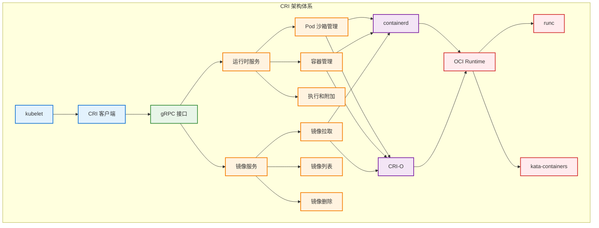

# 容器运行时接口（CRI）

## 概述

容器运行时接口（Container Runtime Interface，CRI）是 Kubernetes 定义的一套标准接口，用于连接 kubelet 和容器运行时。通过 CRI，Kubernetes 实现了与底层容器运行时的解耦，支持多种容器运行时（如 containerd、CRI-O、Docker 等）的插拔式使用。

## CRI 架构



## CRI 接口定义

### 核心服务接口

```go
// CRI 运行时服务接口
type RuntimeService interface {
    // Pod 沙箱管理
    RunPodSandbox(config *runtimeapi.PodSandboxConfig, runtimeHandler string) (string, error)
    StopPodSandbox(podSandboxID string) error
    RemovePodSandbox(podSandboxID string) error
    PodSandboxStatus(podSandboxID string) (*runtimeapi.PodSandboxStatus, error)
    ListPodSandbox(filter *runtimeapi.PodSandboxFilter) ([]*runtimeapi.PodSandbox, error)
    
    // 容器管理
    CreateContainer(podSandboxID string, config *runtimeapi.ContainerConfig, sandboxConfig *runtimeapi.PodSandboxConfig) (string, error)
    StartContainer(containerID string) error
    StopContainer(containerID string, timeout int64) error
    RemoveContainer(containerID string) error
    ListContainers(filter *runtimeapi.ContainerFilter) ([]*runtimeapi.Container, error)
    ContainerStatus(containerID string) (*runtimeapi.ContainerStatus, error)
    
    // 执行和附加
    ExecSync(containerID string, cmd []string, timeout time.Duration) (stdout []byte, stderr []byte, err error)
    Exec(req *runtimeapi.ExecRequest) (*runtimeapi.ExecResponse, error)
    Attach(req *runtimeapi.AttachRequest) (*runtimeapi.AttachResponse, error)
    
    // 统计信息
    ContainerStats(containerID string) (*runtimeapi.ContainerStats, error)
    ListContainerStats(filter *runtimeapi.ContainerStatsFilter) ([]*runtimeapi.ContainerStats, error)
    
    // 运行时信息
    Version(apiVersion string) (*runtimeapi.VersionResponse, error)
    Status() (*runtimeapi.RuntimeStatus, error)
    
    // 更新运行时配置
    UpdateRuntimeConfig(runtimeConfig *runtimeapi.RuntimeConfig) error
}

// CRI 镜像服务接口
type ImageService interface {
    // 镜像管理
    PullImage(image *runtimeapi.ImageSpec, auth *runtimeapi.AuthConfig, podSandboxConfig *runtimeapi.PodSandboxConfig) (string, error)
    ImageStatus(image *runtimeapi.ImageSpec) (*runtimeapi.Image, error)
    RemoveImage(image *runtimeapi.ImageSpec) error
    ListImages(filter *runtimeapi.ImageFilter) ([]*runtimeapi.Image, error)
    
    // 镜像文件系统
    ImageFsInfo() ([]*runtimeapi.FilesystemUsage, error)
}

// gRPC 客户端实现
type grpcRuntimeService struct {
    timeout       time.Duration
    runtimeClient runtimeapi.RuntimeServiceClient
    imageClient   runtimeapi.ImageServiceClient
}

func NewGRPCRuntimeService(endpoint string, connectionTimeout time.Duration) (RuntimeService, ImageService, error) {
    conn, err := grpc.Dial(endpoint, grpc.WithInsecure(), grpc.WithTimeout(connectionTimeout))
    if err != nil {
        return nil, nil, fmt.Errorf("failed to connect to %s: %v", endpoint, err)
    }
    
    service := &grpcRuntimeService{
        timeout:       connectionTimeout,
        runtimeClient: runtimeapi.NewRuntimeServiceClient(conn),
        imageClient:   runtimeapi.NewImageServiceClient(conn),
    }
    
    return service, service, nil
}
```

### Pod 沙箱管理

```go
// Pod 沙箱配置
func (r *grpcRuntimeService) RunPodSandbox(config *runtimeapi.PodSandboxConfig, runtimeHandler string) (string, error) {
    ctx, cancel := getContextWithTimeout(r.timeout)
    defer cancel()
    
    req := &runtimeapi.RunPodSandboxRequest{
        Config:         config,
        RuntimeHandler: runtimeHandler,
    }
    
    resp, err := r.runtimeClient.RunPodSandbox(ctx, req)
    if err != nil {
        return "", err
    }
    
    if resp.PodSandboxId == "" {
        return "", fmt.Errorf("PodSandboxId is not set for sandbox %q", config.GetMetadata())
    }
    
    return resp.PodSandboxId, nil
}

func (r *grpcRuntimeService) StopPodSandbox(podSandboxID string) error {
    if podSandboxID == "" {
        return fmt.Errorf("ID cannot be empty")
    }
    
    ctx, cancel := getContextWithTimeout(r.timeout)
    defer cancel()
    
    req := &runtimeapi.StopPodSandboxRequest{
        PodSandboxId: podSandboxID,
    }
    
    _, err := r.runtimeClient.StopPodSandbox(ctx, req)
    return err
}

func (r *grpcRuntimeService) PodSandboxStatus(podSandboxID string) (*runtimeapi.PodSandboxStatus, error) {
    if podSandboxID == "" {
        return nil, fmt.Errorf("ID cannot be empty")
    }
    
    ctx, cancel := getContextWithTimeout(r.timeout)
    defer cancel()
    
    req := &runtimeapi.PodSandboxStatusRequest{
        PodSandboxId: podSandboxID,
        Verbose:      true,
    }
    
    resp, err := r.runtimeClient.PodSandboxStatus(ctx, req)
    if err != nil {
        return nil, err
    }
    
    return resp.Status, nil
}

// Pod 沙箱配置构建
func makePodSandboxConfig(pod *v1.Pod, attempt uint32) (*runtimeapi.PodSandboxConfig, error) {
    podUID := string(pod.UID)
    podName := pod.Name
    podNamespace := pod.Namespace
    
    // 基础元数据
    config := &runtimeapi.PodSandboxConfig{
        Metadata: &runtimeapi.PodSandboxMetadata{
            Name:      podName,
            Namespace: podNamespace,
            Uid:       podUID,
            Attempt:   attempt,
        },
        Labels:      newPodLabels(pod),
        Annotations: newPodAnnotations(pod),
    }
    
    // DNS 配置
    if dnsConfig, err := parseDNSOptions(pod.Spec.DNSConfig); err != nil {
        return nil, fmt.Errorf("failed to parse DNS options: %v", err)
    } else if dnsConfig != nil {
        config.DnsConfig = dnsConfig
    }
    
    // 网络配置
    if pod.Spec.HostNetwork {
        config.Linux = &runtimeapi.LinuxPodSandboxConfig{
            SecurityContext: &runtimeapi.LinuxSandboxSecurityContext{
                NamespaceOptions: &runtimeapi.NamespaceOption{
                    Network: runtimeapi.NamespaceMode_NODE,
                },
            },
        }
    } else {
        config.Linux = &runtimeapi.LinuxPodSandboxConfig{
            SecurityContext: &runtimeapi.LinuxSandboxSecurityContext{
                NamespaceOptions: &runtimeapi.NamespaceOption{
                    Network: runtimeapi.NamespaceMode_POD,
                },
            },
        }
    }
    
    // 安全上下文
    if pod.Spec.SecurityContext != nil {
        sc := pod.Spec.SecurityContext
        
        if sc.FSGroup != nil {
            config.Linux.SecurityContext.SupplementalGroups = append(
                config.Linux.SecurityContext.SupplementalGroups, *sc.FSGroup)
        }
        
        if sc.SupplementalGroups != nil {
            for _, group := range sc.SupplementalGroups {
                config.Linux.SecurityContext.SupplementalGroups = append(
                    config.Linux.SecurityContext.SupplementalGroups, group)
            }
        }
        
        if sc.RunAsUser != nil {
            config.Linux.SecurityContext.RunAsUser = &runtimeapi.Int64Value{
                Value: *sc.RunAsUser,
            }
        }
        
        if sc.RunAsGroup != nil {
            config.Linux.SecurityContext.RunAsGroup = &runtimeapi.Int64Value{
                Value: *sc.RunAsGroup,
            }
        }
    }
    
    return config, nil
}
```

### 容器管理

```go
// 容器创建和启动
func (r *grpcRuntimeService) CreateContainer(podSandboxID string, config *runtimeapi.ContainerConfig, sandboxConfig *runtimeapi.PodSandboxConfig) (string, error) {
    ctx, cancel := getContextWithTimeout(r.timeout)
    defer cancel()
    
    req := &runtimeapi.CreateContainerRequest{
        PodSandboxId:  podSandboxID,
        Config:        config,
        SandboxConfig: sandboxConfig,
    }
    
    resp, err := r.runtimeClient.CreateContainer(ctx, req)
    if err != nil {
        return "", err
    }
    
    if resp.ContainerId == "" {
        return "", fmt.Errorf("ContainerId is not set")
    }
    
    return resp.ContainerId, nil
}

func (r *grpcRuntimeService) StartContainer(containerID string) error {
    if containerID == "" {
        return fmt.Errorf("ID cannot be empty")
    }
    
    ctx, cancel := getContextWithTimeout(r.timeout)
    defer cancel()
    
    req := &runtimeapi.StartContainerRequest{
        ContainerId: containerID,
    }
    
    _, err := r.runtimeClient.StartContainer(ctx, req)
    return err
}

func (r *grpcRuntimeService) ContainerStatus(containerID string) (*runtimeapi.ContainerStatus, error) {
    if containerID == "" {
        return nil, fmt.Errorf("ID cannot be empty")
    }
    
    ctx, cancel := getContextWithTimeout(r.timeout)
    defer cancel()
    
    req := &runtimeapi.ContainerStatusRequest{
        ContainerId: containerID,
        Verbose:     true,
    }
    
    resp, err := r.runtimeClient.ContainerStatus(ctx, req)
    if err != nil {
        return nil, err
    }
    
    return resp.Status, nil
}

// 容器配置构建
func makeContainerConfig(pod *v1.Pod, container *v1.Container, podIP string, restartCount int) (*runtimeapi.ContainerConfig, error) {
    config := &runtimeapi.ContainerConfig{
        Metadata: &runtimeapi.ContainerMetadata{
            Name:    container.Name,
            Attempt: uint32(restartCount),
        },
        Image:       &runtimeapi.ImageSpec{Image: container.Image},
        Command:     container.Command,
        Args:        container.Args,
        WorkingDir:  container.WorkingDir,
        Labels:      newContainerLabels(container, pod),
        Annotations: newContainerAnnotations(container, pod, restartCount),
        Devices:     makeDevices(pod, container),
        CDIDevices:  makeCDIDevices(pod, container),
    }
    
    // 环境变量
    envs, err := makeEnvironmentVariables(pod, container, podIP)
    if err != nil {
        return nil, err
    }
    config.Envs = envs
    
    // 挂载点
    mounts := makeMounts(pod, container)
    config.Mounts = mounts
    
    // 日志路径
    config.LogPath = buildContainerLogsPath(container.Name, restartCount)
    
    // Linux 特定配置
    config.Linux = &runtimeapi.LinuxContainerConfig{}
    
    // 资源限制
    if container.Resources.Limits != nil || container.Resources.Requests != nil {
        config.Linux.Resources = &runtimeapi.LinuxContainerResources{}
        
        // CPU 限制
        if cpuLimit := container.Resources.Limits.Cpu(); cpuLimit != nil {
            config.Linux.Resources.CpuQuota = cpuLimit.MilliValue()
        }
        
        if cpuRequest := container.Resources.Requests.Cpu(); cpuRequest != nil {
            config.Linux.Resources.CpuShares = cpuRequest.MilliValue()
        }
        
        // 内存限制
        if memLimit := container.Resources.Limits.Memory(); memLimit != nil {
            config.Linux.Resources.MemoryLimitInBytes = memLimit.Value()
        }
        
        // OOM 分数调整
        config.Linux.Resources.OomScoreAdj = calculateOOMScoreAdj(pod, container)
    }
    
    // 安全上下文
    if container.SecurityContext != nil {
        config.Linux.SecurityContext = makeLinuxSecurityContext(container.SecurityContext, pod.Spec.SecurityContext)
    }
    
    return config, nil
}

func makeLinuxSecurityContext(containerSC *v1.SecurityContext, podSC *v1.PodSecurityContext) *runtimeapi.LinuxContainerSecurityContext {
    sc := &runtimeapi.LinuxContainerSecurityContext{
        Capabilities:   &runtimeapi.Capability{},
        Privileged:     containerSC.Privileged != nil && *containerSC.Privileged,
        ReadonlyRootfs: containerSC.ReadOnlyRootFilesystem != nil && *containerSC.ReadOnlyRootFilesystem,
    }
    
    // 用户和组 ID
    if containerSC.RunAsUser != nil {
        sc.RunAsUser = &runtimeapi.Int64Value{Value: *containerSC.RunAsUser}
    } else if podSC != nil && podSC.RunAsUser != nil {
        sc.RunAsUser = &runtimeapi.Int64Value{Value: *podSC.RunAsUser}
    }
    
    if containerSC.RunAsGroup != nil {
        sc.RunAsGroup = &runtimeapi.Int64Value{Value: *containerSC.RunAsGroup}
    } else if podSC != nil && podSC.RunAsGroup != nil {
        sc.RunAsGroup = &runtimeapi.Int64Value{Value: *podSC.RunAsGroup}
    }
    
    // 权限设置
    if containerSC.Capabilities != nil {
        if containerSC.Capabilities.Add != nil {
            for _, cap := range containerSC.Capabilities.Add {
                sc.Capabilities.AddCapabilities = append(sc.Capabilities.AddCapabilities, string(cap))
            }
        }
        
        if containerSC.Capabilities.Drop != nil {
            for _, cap := range containerSC.Capabilities.Drop {
                sc.Capabilities.DropCapabilities = append(sc.Capabilities.DropCapabilities, string(cap))
            }
        }
    }
    
    // SELinux 选项
    if containerSC.SELinuxOptions != nil {
        sc.SelinuxOptions = &runtimeapi.SELinuxOption{
            User:  containerSC.SELinuxOptions.User,
            Role:  containerSC.SELinuxOptions.Role,
            Type:  containerSC.SELinuxOptions.Type,
            Level: containerSC.SELinuxOptions.Level,
        }
    }
    
    return sc
}
```

### 执行和附加操作

```go
// 容器内执行命令
func (r *grpcRuntimeService) ExecSync(containerID string, cmd []string, timeout time.Duration) (stdout []byte, stderr []byte, err error) {
    if containerID == "" {
        return nil, nil, fmt.Errorf("ID cannot be empty")
    }
    
    ctx, cancel := getContextWithTimeout(timeout)
    defer cancel()
    
    req := &runtimeapi.ExecSyncRequest{
        ContainerId: containerID,
        Cmd:         cmd,
        Timeout:     int64(timeout.Seconds()),
    }
    
    resp, err := r.runtimeClient.ExecSync(ctx, req)
    if err != nil {
        return nil, nil, err
    }
    
    return resp.Stdout, resp.Stderr, nil
}

func (r *grpcRuntimeService) Exec(req *runtimeapi.ExecRequest) (*runtimeapi.ExecResponse, error) {
    ctx, cancel := getContextWithTimeout(r.timeout)
    defer cancel()
    
    resp, err := r.runtimeClient.Exec(ctx, req)
    if err != nil {
        return nil, err
    }
    
    return resp, nil
}

func (r *grpcRuntimeService) Attach(req *runtimeapi.AttachRequest) (*runtimeapi.AttachResponse, error) {
    ctx, cancel := getContextWithTimeout(r.timeout)
    defer cancel()
    
    resp, err := r.runtimeClient.Attach(ctx, req)
    if err != nil {
        return nil, err
    }
    
    return resp, nil
}

// 流式操作处理器
type StreamingRuntime struct {
    server streaming.Server
    config *streaming.Config
}

func NewStreamingRuntime(config *streaming.Config) (*StreamingRuntime, error) {
    server, err := streaming.NewServer(config, &streamingRuntimeHandler{})
    if err != nil {
        return nil, err
    }
    
    return &StreamingRuntime{
        server: server,
        config: config,
    }, nil
}

type streamingRuntimeHandler struct {
    runtime RuntimeService
}

func (s *streamingRuntimeHandler) Exec(containerID string, cmd []string, stdin io.Reader, stdout, stderr io.WriteCloser, tty bool, resize <-chan remotecommand.TerminalSize) error {
    return s.exec(containerID, cmd, stdin, stdout, stderr, tty, resize)
}

func (s *streamingRuntimeHandler) Attach(containerID string, stdin io.Reader, stdout, stderr io.WriteCloser, tty bool, resize <-chan remotecommand.TerminalSize) error {
    return s.attach(containerID, stdin, stdout, stderr, tty, resize)
}

func (s *streamingRuntimeHandler) exec(containerID string, cmd []string, stdin io.Reader, stdout, stderr io.WriteCloser, tty bool, resize <-chan remotecommand.TerminalSize) error {
    defer stdout.Close()
    defer stderr.Close()
    
    // 创建执行请求
    req := &runtimeapi.ExecRequest{
        ContainerId: containerID,
        Cmd:         cmd,
        Tty:         tty,
        Stdin:       stdin != nil,
        Stdout:      stdout != nil,
        Stderr:      stderr != nil && !tty,
    }
    
    // 执行命令
    resp, err := s.runtime.Exec(req)
    if err != nil {
        return fmt.Errorf("failed to exec in container: %v", err)
    }
    
    // 处理流
    return s.handleStreaming(resp.Url, stdin, stdout, stderr, tty, resize)
}
```

## 镜像管理

### 镜像服务实现

```go
// 镜像拉取
func (r *grpcRuntimeService) PullImage(image *runtimeapi.ImageSpec, auth *runtimeapi.AuthConfig, podSandboxConfig *runtimeapi.PodSandboxConfig) (string, error) {
    ctx, cancel := getContextWithTimeout(r.timeout)
    defer cancel()
    
    req := &runtimeapi.PullImageRequest{
        Image:         image,
        Auth:          auth,
        SandboxConfig: podSandboxConfig,
    }
    
    resp, err := r.imageClient.PullImage(ctx, req)
    if err != nil {
        return "", err
    }
    
    if resp.ImageRef == "" {
        return "", fmt.Errorf("ImageRef is not set")
    }
    
    return resp.ImageRef, nil
}

func (r *grpcRuntimeService) ImageStatus(image *runtimeapi.ImageSpec) (*runtimeapi.Image, error) {
    ctx, cancel := getContextWithTimeout(r.timeout)
    defer cancel()
    
    req := &runtimeapi.ImageStatusRequest{
        Image:   image,
        Verbose: true,
    }
    
    resp, err := r.imageClient.ImageStatus(ctx, req)
    if err != nil {
        return nil, err
    }
    
    return resp.Image, nil
}

func (r *grpcRuntimeService) RemoveImage(image *runtimeapi.ImageSpec) error {
    if image == nil {
        return fmt.Errorf("ImageSpec cannot be nil")
    }
    
    ctx, cancel := getContextWithTimeout(r.timeout)
    defer cancel()
    
    req := &runtimeapi.RemoveImageRequest{
        Image: image,
    }
    
    _, err := r.imageClient.RemoveImage(ctx, req)
    return err
}

func (r *grpcRuntimeService) ListImages(filter *runtimeapi.ImageFilter) ([]*runtimeapi.Image, error) {
    ctx, cancel := getContextWithTimeout(r.timeout)
    defer cancel()
    
    req := &runtimeapi.ListImagesRequest{
        Filter: filter,
    }
    
    resp, err := r.imageClient.ListImages(ctx, req)
    if err != nil {
        return nil, err
    }
    
    return resp.Images, nil
}

// 镜像管理器
type ImageManager struct {
    imageService     ImageService
    backOff          *flowcontrol.Backoff
    recorder         record.EventRecorder
    imageStatsProvider ImageStatsProvider
    
    // 镜像拉取配置
    imagePullSecrets []v1.Secret
    imagePullPolicy  v1.PullPolicy
    
    // 镜像缓存
    imageCache *ImageCache
    
    // 并发控制
    pullingSemaphore chan struct{}
}

func (m *ImageManager) PullImage(pod *v1.Pod, container *v1.Container, pullSecrets []v1.Secret) (string, error) {
    start := time.Now()
    defer func() {
        metrics.ImagePullDuration.Observe(time.Since(start).Seconds())
    }()
    
    spec := &runtimeapi.ImageSpec{Image: container.Image}
    
    // 检查镜像是否已存在
    imageStatus, err := m.imageService.ImageStatus(spec)
    if err != nil {
        return "", fmt.Errorf("failed to get image status: %v", err)
    }
    
    // 根据拉取策略决定是否需要拉取
    shouldPull := m.shouldPullImage(container, imageStatus)
    if !shouldPull {
        if imageStatus != nil {
            return imageStatus.Id, nil
        }
        return "", fmt.Errorf("image not found and pull policy is Never")
    }
    
    // 获取并发许可
    m.pullingSemaphore <- struct{}{}
    defer func() { <-m.pullingSemaphore }()
    
    // 检查退避状态
    if m.backOff.IsInBackOffSinceUpdate(container.Image, m.backOff.Clock.Now()) {
        return "", fmt.Errorf("image pull is in backoff")
    }
    
    // 构建认证配置
    auth, err := m.getAuthConfig(container.Image, pullSecrets)
    if err != nil {
        return "", fmt.Errorf("failed to get auth config: %v", err)
    }
    
    // 构建沙箱配置（用于镜像拉取的网络配置）
    sandboxConfig, err := makePodSandboxConfig(pod, 0)
    if err != nil {
        return "", fmt.Errorf("failed to make sandbox config: %v", err)
    }
    
    // 执行镜像拉取
    imageRef, err := m.imageService.PullImage(spec, auth, sandboxConfig)
    if err != nil {
        m.backOff.Next(container.Image, m.backOff.Clock.Now())
        return "", fmt.Errorf("failed to pull image %q: %v", container.Image, err)
    }
    
    m.backOff.Reset(container.Image)
    return imageRef, nil
}

func (m *ImageManager) shouldPullImage(container *v1.Container, imageStatus *runtimeapi.Image) bool {
    switch container.ImagePullPolicy {
    case v1.PullAlways:
        return true
    case v1.PullNever:
        return false
    case v1.PullIfNotPresent:
        return imageStatus == nil
    default:
        // 默认策略：latest 标签总是拉取，其他标签仅在不存在时拉取
        if imageStatus == nil {
            return true
        }
        
        if strings.HasSuffix(container.Image, ":latest") || !strings.Contains(container.Image, ":") {
            return true
        }
        
        return false
    }
}

func (m *ImageManager) getAuthConfig(image string, pullSecrets []v1.Secret) (*runtimeapi.AuthConfig, error) {
    keyring, err := credentialprovider.NewDockerKeyring()
    if err != nil {
        return nil, fmt.Errorf("failed to create docker keyring: %v", err)
    }
    
    // 添加 pull secrets 到 keyring
    for _, secret := range pullSecrets {
        if secret.Type != v1.SecretTypeDockerConfigJson {
            continue
        }
        
        dockerConfigJSON := secret.Data[v1.DockerConfigJsonKey]
        if len(dockerConfigJSON) == 0 {
            continue
        }
        
        var dockerConfig credentialprovider.DockerConfigJSON
        if err := json.Unmarshal(dockerConfigJSON, &dockerConfig); err != nil {
            continue
        }
        
        keyring.Add(dockerConfig.Auths)
    }
    
    // 查找镜像的认证信息
    creds, withCredentials := keyring.Lookup(image)
    if !withCredentials {
        return nil, nil
    }
    
    if len(creds) == 0 {
        return nil, nil
    }
    
    // 使用第一个匹配的认证信息
    cred := creds[0]
    return &runtimeapi.AuthConfig{
        Username: cred.Username,
        Password: cred.Password,
        Auth:     cred.Auth,
    }, nil
}
```

## 运行时适配器

### containerd 适配器

```go
// containerd CRI 服务器
type CRIService struct {
    // containerd 客户端
    client *containerd.Client
    
    // 镜像服务
    imageService images.Store
    
    // 容器服务
    containerService containers.Store
    
    // 任务服务
    taskService tasks.TaskService
    
    // 快照服务
    snapshotter snapshots.Snapshotter
    
    // 网络命名空间管理
    netPlugin cni.CNI
    
    // 配置
    config *Config
}

func NewCRIService(config *Config) (*CRIService, error) {
    // 连接到 containerd
    client, err := containerd.New(config.ContainerdEndpoint)
    if err != nil {
        return nil, fmt.Errorf("failed to connect to containerd: %v", err)
    }
    
    // 初始化网络插件
    netPlugin, err := cni.New(cni.WithMinNetworkCount(2),
        cni.WithPluginConfDir(config.NetworkPluginConfDir),
        cni.WithPluginDir([]string{config.NetworkPluginBinDir}))
    if err != nil {
        return nil, fmt.Errorf("failed to initialize CNI: %v", err)
    }
    
    service := &CRIService{
        client:           client,
        imageService:     client.ImageService(),
        containerService: client.ContainerService(),
        taskService:      client.TaskService(),
        snapshotter:      client.SnapshotService(config.Snapshotter),
        netPlugin:        netPlugin,
        config:           config,
    }
    
    return service, nil
}

// 实现 CRI 运行时服务
func (c *CRIService) RunPodSandbox(ctx context.Context, r *runtimeapi.RunPodSandboxRequest) (*runtimeapi.RunPodSandboxResponse, error) {
    config := r.GetConfig()
    
    // 创建网络命名空间
    netNSPath, err := c.setupPodNetwork(ctx, config)
    if err != nil {
        return nil, fmt.Errorf("failed to setup pod network: %v", err)
    }
    
    // 创建沙箱容器
    sandboxImage := c.config.SandboxImage
    image, err := c.ensureImageExists(ctx, sandboxImage, config)
    if err != nil {
        return nil, fmt.Errorf("failed to ensure sandbox image: %v", err)
    }
    
    // 创建容器规范
    spec, err := c.makeSandboxContainerSpec(config, image, netNSPath)
    if err != nil {
        return nil, fmt.Errorf("failed to make sandbox spec: %v", err)
    }
    
    // 创建容器
    sandboxName := makeSandboxName(config)
    container, err := c.client.NewContainer(ctx, sandboxName,
        containerd.WithImage(image),
        containerd.WithSpec(spec),
        containerd.WithContainerLabels(makeSandboxLabels(config)),
        containerd.WithSnapshotter(c.config.Snapshotter))
    if err != nil {
        return nil, fmt.Errorf("failed to create sandbox container: %v", err)
    }
    
    // 启动容器任务
    task, err := container.NewTask(ctx, cio.NullIO)
    if err != nil {
        return nil, fmt.Errorf("failed to create sandbox task: %v", err)
    }
    
    if err := task.Start(ctx); err != nil {
        return nil, fmt.Errorf("failed to start sandbox task: %v", err)
    }
    
    return &runtimeapi.RunPodSandboxResponse{
        PodSandboxId: container.ID(),
    }, nil
}

func (c *CRIService) CreateContainer(ctx context.Context, r *runtimeapi.CreateContainerRequest) (*runtimeapi.CreateContainerResponse, error) {
    config := r.GetConfig()
    sandboxConfig := r.GetSandboxConfig()
    sandboxID := r.GetPodSandboxId()
    
    // 获取沙箱容器
    sandbox, err := c.client.LoadContainer(ctx, sandboxID)
    if err != nil {
        return nil, fmt.Errorf("failed to find sandbox: %v", err)
    }
    
    // 确保镜像存在
    image, err := c.ensureImageExists(ctx, config.GetImage().GetImage(), sandboxConfig)
    if err != nil {
        return nil, fmt.Errorf("failed to ensure image: %v", err)
    }
    
    // 创建容器规范
    spec, err := c.makeContainerSpec(config, sandboxConfig, sandbox)
    if err != nil {
        return nil, fmt.Errorf("failed to make container spec: %v", err)
    }
    
    // 创建容器
    containerName := makeContainerName(sandboxConfig, config)
    container, err := c.client.NewContainer(ctx, containerName,
        containerd.WithImage(image),
        containerd.WithSpec(spec),
        containerd.WithContainerLabels(makeContainerLabels(config, sandboxConfig)),
        containerd.WithSnapshotter(c.config.Snapshotter))
    if err != nil {
        return nil, fmt.Errorf("failed to create container: %v", err)
    }
    
    return &runtimeapi.CreateContainerResponse{
        ContainerId: container.ID(),
    }, nil
}

func (c *CRIService) StartContainer(ctx context.Context, r *runtimeapi.StartContainerRequest) (*runtimeapi.StartContainerResponse, error) {
    containerID := r.GetContainerId()
    
    // 加载容器
    container, err := c.client.LoadContainer(ctx, containerID)
    if err != nil {
        return nil, fmt.Errorf("failed to find container: %v", err)
    }
    
    // 创建任务
    task, err := container.NewTask(ctx, cio.LogFile(c.getContainerLogPath(containerID)))
    if err != nil {
        return nil, fmt.Errorf("failed to create task: %v", err)
    }
    
    // 启动任务
    if err := task.Start(ctx); err != nil {
        return nil, fmt.Errorf("failed to start task: %v", err)
    }
    
    return &runtimeapi.StartContainerResponse{}, nil
}
```

### CRI-O 适配器

```go
// CRI-O 服务器实现
type Server struct {
    // 配置
    config *config.Config
    
    // 运行时
    runtime RuntimeServer
    
    // 镜像服务
    images ImageServer
    
    // 存储
    store storage.Store
    
    // 网络
    netPlugin ocicni.CNIPlugin
    
    // 监控
    monitorCh chan struct{}
    
    // 锁
    stateLock sync.Locker
}

func New(ctx context.Context, config *config.Config) (*Server, error) {
    store, err := getStore(config)
    if err != nil {
        return nil, err
    }
    
    imageService, err := storage.GetImageService(ctx, store, config.DefaultTransport, config.InsecureRegistries, config.Registries)
    if err != nil {
        return nil, err
    }
    
    storageRuntimeService := storage.GetRuntimeService(ctx, imageService, config.PauseImage, config.PauseCommand)
    
    runtime := oci.New(config.RuntimePath, config.Conmon, config.ConmonEnv, config.CgroupManager, config.ContainerExitsDir, config.LogLevel, config.NoPivot, config.SystemdCgroup)
    
    netPlugin, err := ocicni.InitCNI(config.DefaultNetwork, config.NetworkDir, config.PluginDirs...)
    if err != nil {
        return nil, err
    }
    
    server := &Server{
        config:    config,
        runtime:   &runtimeService{runtime: runtime, store: store, storageRuntimeService: storageRuntimeService},
        images:    &imageService{store: store, imageService: imageService},
        store:     store,
        netPlugin: netPlugin,
        stateLock: &sync.RWMutex{},
    }
    
    return server, nil
}

// 实现 CRI 接口
func (s *Server) RunPodSandbox(ctx context.Context, req *runtimeapi.RunPodSandboxRequest) (resp *runtimeapi.RunPodSandboxResponse, err error) {
    config := req.GetConfig()
    
    s.stateLock.Lock()
    defer s.stateLock.Unlock()
    
    // 创建沙箱
    sb, err := sandbox.New(config.GetMetadata().GetUid(), config.GetMetadata().GetNamespace(), config.GetMetadata().GetName(), config.GetLogDirectory(), "", config.GetLabels(), kubeAnnotations(config.GetAnnotations()), "", "", false, false, false, "", "/pause", "", "", config.GetLinux().GetSecurityContext(), s.config.CgroupManager)
    if err != nil {
        return nil, err
    }
    
    // 设置网络
    if err := s.setPodSandboxMountLabel(sb, config); err != nil {
        return nil, err
    }
    
    if err := s.runPodSandbox(ctx, sb, config); err != nil {
        return nil, err
    }
    
    resp = &runtimeapi.RunPodSandboxResponse{
        PodSandboxId: sb.ID(),
    }
    
    return resp, nil
}

func (s *Server) CreateContainer(ctx context.Context, req *runtimeapi.CreateContainerRequest) (resp *runtimeapi.CreateContainerResponse, err error) {
    config := req.GetConfig()
    sandboxConfig := req.GetSandboxConfig()
    
    s.stateLock.Lock()
    defer s.stateLock.Unlock()
    
    // 获取沙箱
    sb := s.getSandbox(req.GetPodSandboxId())
    if sb == nil {
        return nil, fmt.Errorf("sandbox not found")
    }
    
    // 创建容器
    ctr, err := s.createSandboxContainer(ctx, sb, config, sandboxConfig)
    if err != nil {
        return nil, err
    }
    
    resp = &runtimeapi.CreateContainerResponse{
        ContainerId: ctr.ID(),
    }
    
    return resp, nil
}

func (s *Server) StartContainer(ctx context.Context, req *runtimeapi.StartContainerRequest) (resp *runtimeapi.StartContainerResponse, err error) {
    s.stateLock.Lock()
    defer s.stateLock.Unlock()
    
    ctr := s.getContainer(req.GetContainerId())
    if ctr == nil {
        return nil, fmt.Errorf("container not found")
    }
    
    err = s.runtime.StartContainer(ctr)
    if err != nil {
        return nil, fmt.Errorf("failed to start container: %v", err)
    }
    
    resp = &runtimeapi.StartContainerResponse{}
    return resp, nil
}
```

## 性能优化

### 并发控制和缓存

```go
// CRI 性能优化器
type CRIOptimizer struct {
    // 连接池
    connectionPool *ConnectionPool
    
    // 请求缓存
    requestCache *RequestCache
    
    // 并发控制
    semaphore *Semaphore
    
    // 批量处理
    batchProcessor *BatchProcessor
}

// 连接池
type ConnectionPool struct {
    connections chan *grpc.ClientConn
    factory     func() (*grpc.ClientConn, error)
    maxSize     int
    currentSize int32
    mutex       sync.Mutex
}

func NewConnectionPool(endpoint string, maxSize int) *ConnectionPool {
    pool := &ConnectionPool{
        connections: make(chan *grpc.ClientConn, maxSize),
        maxSize:     maxSize,
        factory: func() (*grpc.ClientConn, error) {
            return grpc.Dial(endpoint, grpc.WithInsecure())
        },
    }
    
    // 预先创建一些连接
    for i := 0; i < maxSize/2; i++ {
        if conn, err := pool.factory(); err == nil {
            pool.connections <- conn
            atomic.AddInt32(&pool.currentSize, 1)
        }
    }
    
    return pool
}

func (p *ConnectionPool) Get() (*grpc.ClientConn, error) {
    select {
    case conn := <-p.connections:
        return conn, nil
    default:
        // 如果池中没有连接，创建新的
        if atomic.LoadInt32(&p.currentSize) < int32(p.maxSize) {
            conn, err := p.factory()
            if err != nil {
                return nil, err
            }
            atomic.AddInt32(&p.currentSize, 1)
            return conn, nil
        }
        
        // 等待可用连接
        conn := <-p.connections
        return conn, nil
    }
}

func (p *ConnectionPool) Put(conn *grpc.ClientConn) {
    select {
    case p.connections <- conn:
        // 成功放回池中
    default:
        // 池已满，关闭连接
        conn.Close()
        atomic.AddInt32(&p.currentSize, -1)
    }
}

// 请求缓存
type RequestCache struct {
    cache *sync.Map
    ttl   time.Duration
}

type CacheEntry struct {
    Data      interface{}
    Timestamp time.Time
}

func (c *RequestCache) Get(key string) (interface{}, bool) {
    if entry, ok := c.cache.Load(key); ok {
        cacheEntry := entry.(*CacheEntry)
        if time.Since(cacheEntry.Timestamp) < c.ttl {
            return cacheEntry.Data, true
        }
        c.cache.Delete(key)
    }
    return nil, false
}

func (c *RequestCache) Set(key string, data interface{}) {
    entry := &CacheEntry{
        Data:      data,
        Timestamp: time.Now(),
    }
    c.cache.Store(key, entry)
}

// 批量处理器
type BatchProcessor struct {
    requests    chan BatchRequest
    batchSize   int
    batchTimeout time.Duration
    processor   func([]BatchRequest) error
}

type BatchRequest struct {
    Type     string
    Data     interface{}
    Response chan BatchResponse
}

type BatchResponse struct {
    Data  interface{}
    Error error
}

func (bp *BatchProcessor) Start() {
    go bp.processBatches()
}

func (bp *BatchProcessor) processBatches() {
    ticker := time.NewTicker(bp.batchTimeout)
    defer ticker.Stop()
    
    var batch []BatchRequest
    
    for {
        select {
        case req := <-bp.requests:
            batch = append(batch, req)
            
            if len(batch) >= bp.batchSize {
                bp.executeBatch(batch)
                batch = nil
            }
            
        case <-ticker.C:
            if len(batch) > 0 {
                bp.executeBatch(batch)
                batch = nil
            }
        }
    }
}

func (bp *BatchProcessor) executeBatch(batch []BatchRequest) {
    if err := bp.processor(batch); err != nil {
        // 发送错误响应
        for _, req := range batch {
            req.Response <- BatchResponse{Error: err}
        }
    }
}
```

## 监控和调试

### CRI 指标

```go
// CRI 监控指标
type CRIMetrics struct {
    // 运行时操作指标
    runtimeOperations *prometheus.CounterVec
    runtimeLatency    *prometheus.HistogramVec
    
    // 镜像操作指标
    imageOperations *prometheus.CounterVec
    imageLatency    *prometheus.HistogramVec
    
    // 容器状态指标
    containerStates *prometheus.GaugeVec
    
    // 错误统计
    errorCount *prometheus.CounterVec
}

func NewCRIMetrics() *CRIMetrics {
    return &CRIMetrics{
        runtimeOperations: prometheus.NewCounterVec(
            prometheus.CounterOpts{
                Name: "kubelet_cri_runtime_operations_total",
                Help: "Cumulative number of runtime operations by operation type",
            },
            []string{"operation_type", "result"},
        ),
        runtimeLatency: prometheus.NewHistogramVec(
            prometheus.HistogramOpts{
                Name: "kubelet_cri_runtime_operations_duration_seconds",
                Help: "Duration of runtime operations in seconds",
                Buckets: []float64{0.005, 0.025, 0.1, 0.25, 0.5, 1.0, 2.5, 5.0, 10.0},
            },
            []string{"operation_type"},
        ),
        containerStates: prometheus.NewGaugeVec(
            prometheus.GaugeOpts{
                Name: "kubelet_containers",
                Help: "Number of containers currently running",
            },
            []string{"state"},
        ),
    }
}

func (m *CRIMetrics) RecordOperation(operation string, start time.Time, err error) {
    duration := time.Since(start)
    
    result := "success"
    if err != nil {
        result = "error"
    }
    
    m.runtimeOperations.WithLabelValues(operation, result).Inc()
    m.runtimeLatency.WithLabelValues(operation).Observe(duration.Seconds())
}
```

## 最佳实践

### CRI 实现建议

1. **接口实现**：
   - 严格遵循 CRI 规范
   - 实现完整的错误处理
   - 支持超时和取消
   - 提供详细的状态信息

2. **性能优化**：
   - 使用连接池
   - 实现请求缓存
   - 支持并发控制
   - 优化序列化性能

3. **安全考虑**：
   - 验证输入参数
   - 实施权限控制
   - 使用安全的默认值
   - 审计关键操作

### 故障排查

1. **CRI 问题诊断**：
   ```bash
   # 检查 CRI 运行时状态
   crictl info
   
   # 列出容器和沙箱
   crictl ps
   crictl pods
   
   # 检查日志
   crictl logs <container-id>
   ```

2. **常见问题解决**：
   - **连接超时**：检查运行时套接字权限
   - **镜像拉取失败**：验证网络和认证配置
   - **容器启动失败**：检查运行时和内核配置
   - **性能问题**：优化网络和存储配置
