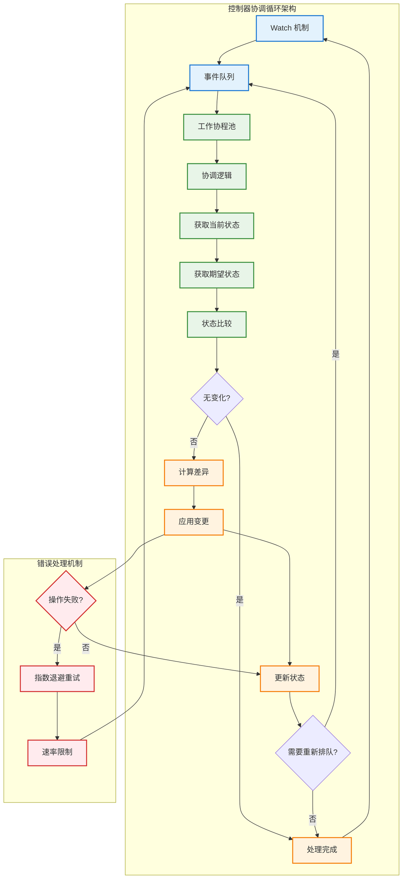

# 控制器协调循环

## 概述

控制器协调循环是 Kubernetes 实现声明式 API 和自愈能力的核心机制。每个控制器都运行一个持续的协调循环，监控资源的实际状态与期望状态之间的差异，并采取行动使实际状态收敛到期望状态。

## 控制器架构



## 控制器核心实现

### 控制器接口定义

```go
// 控制器接口
type Controller interface {
    Run(ctx context.Context, workers int) error
    Shutdown()
}

// 通用控制器实现
type GenericController struct {
    name        string
    queue       workqueue.RateLimitingInterface
    informer    cache.SharedIndexInformer
    reconciler  Reconciler
    logger      klog.Logger
    metrics     *ControllerMetrics
}

// 协调器接口
type Reconciler interface {
    Reconcile(ctx context.Context, req Request) (Result, error)
}

// 请求对象
type Request struct {
    NamespacedName types.NamespacedName
}

// 协调结果
type Result struct {
    Requeue      bool
    RequeueAfter time.Duration
}
```

### 控制器初始化

```go
// 控制器构造函数
func NewGenericController(
    name string,
    informer cache.SharedIndexInformer,
    reconciler Reconciler,
    logger klog.Logger,
) *GenericController {
    
    controller := &GenericController{
        name:       name,
        queue:      workqueue.NewNamedRateLimitingQueue(workqueue.DefaultControllerRateLimiter(), name),
        informer:   informer,
        reconciler: reconciler,
        logger:     logger,
        metrics:    NewControllerMetrics(name),
    }
    
    // 设置事件处理器
    informer.AddEventHandler(cache.ResourceEventHandlerFuncs{
        AddFunc:    controller.handleAdd,
        UpdateFunc: controller.handleUpdate,
        DeleteFunc: controller.handleDelete,
    })
    
    return controller
}

// 事件处理器
func (c *GenericController) handleAdd(obj interface{}) {
    c.enqueue(obj)
}

func (c *GenericController) handleUpdate(oldObj, newObj interface{}) {
    // 检查资源版本是否真的发生了变化
    oldMeta, err := meta.Accessor(oldObj)
    if err != nil {
        return
    }
    
    newMeta, err := meta.Accessor(newObj)
    if err != nil {
        return
    }
    
    // 只有资源版本变化时才处理更新事件
    if oldMeta.GetResourceVersion() != newMeta.GetResourceVersion() {
        c.enqueue(newObj)
    }
}

func (c *GenericController) handleDelete(obj interface{}) {
    // 处理删除事件可能收到的 DeletedFinalStateUnknown 对象
    if tombstone, ok := obj.(cache.DeletedFinalStateUnknown); ok {
        obj = tombstone.Obj
    }
    c.enqueue(obj)
}

func (c *GenericController) enqueue(obj interface{}) {
    key, err := cache.MetaNamespaceKeyFunc(obj)
    if err != nil {
        c.logger.Error(err, "Failed to get key for object", "object", obj)
        return
    }
    
    c.queue.Add(key)
    c.metrics.RecordQueueAdd()
}
```

### 控制器运行逻辑

```go
// 控制器启动
func (c *GenericController) Run(ctx context.Context, workers int) error {
    defer c.queue.ShutDown()
    
    c.logger.Info("Starting controller", "name", c.name, "workers", workers)
    
    // 等待缓存同步
    c.logger.Info("Waiting for informer caches to sync")
    if !cache.WaitForCacheSync(ctx.Done(), c.informer.HasSynced) {
        return fmt.Errorf("failed to wait for caches to sync")
    }
    
    c.logger.Info("Starting workers")
    
    // 启动工作协程
    for i := 0; i < workers; i++ {
        go wait.UntilWithContext(ctx, c.runWorker, time.Second)
    }
    
    <-ctx.Done()
    c.logger.Info("Shutting down controller", "name", c.name)
    
    return nil
}

// 工作协程
func (c *GenericController) runWorker(ctx context.Context) {
    for c.processNextWorkItem(ctx) {
    }
}

func (c *GenericController) processNextWorkItem(ctx context.Context) bool {
    // 从队列中获取下一个工作项
    obj, shutdown := c.queue.Get()
    if shutdown {
        return false
    }
    
    defer c.queue.Done(obj)
    
    // 处理工作项
    err := c.processItem(ctx, obj.(string))
    if err == nil {
        // 处理成功，从队列中移除
        c.queue.Forget(obj)
        c.metrics.RecordSuccess()
        return true
    }
    
    // 处理失败，重新排队
    c.handleError(err, obj)
    return true
}

func (c *GenericController) processItem(ctx context.Context, key string) error {
    startTime := time.Now()
    defer func() {
        c.metrics.RecordDuration(time.Since(startTime))
    }()
    
    // 解析 key
    namespace, name, err := cache.SplitMetaNamespaceKey(key)
    if err != nil {
        c.logger.Error(err, "Invalid key", "key", key)
        return nil // 不重新排队
    }
    
    // 构造请求
    req := Request{
        NamespacedName: types.NamespacedName{
            Namespace: namespace,
            Name:      name,
        },
    }
    
    // 执行协调逻辑
    result, err := c.reconciler.Reconcile(ctx, req)
    if err != nil {
        c.metrics.RecordError()
        return err
    }
    
    // 处理重新排队
    if result.Requeue {
        c.queue.AddAfter(key, result.RequeueAfter)
    }
    
    return nil
}

func (c *GenericController) handleError(err error, obj interface{}) {
    key := obj.(string)
    
    // 检查重试次数
    if c.queue.NumRequeues(obj) < 5 {
        c.logger.Error(err, "Error processing item, retrying", "key", key, "retries", c.queue.NumRequeues(obj))
        c.queue.AddRateLimited(obj)
        return
    }
    
    // 超过最大重试次数，放弃处理
    c.logger.Error(err, "Dropping item out of queue", "key", key)
    c.queue.Forget(obj)
    c.metrics.RecordFailure()
}
```

## 具体控制器实现示例

### Deployment 控制器

```go
// Deployment 控制器
type DeploymentController struct {
    client          kubernetes.Interface
    deploymentLister appslisters.DeploymentLister
    replicaSetLister appslisters.ReplicaSetLister
    podLister       corelisters.PodLister
    
    queue   workqueue.RateLimitingInterface
    logger  klog.Logger
}

func (dc *DeploymentController) Reconcile(ctx context.Context, req Request) (Result, error) {
    logger := dc.logger.WithValues("deployment", req.NamespacedName)
    
    // 1. 获取 Deployment 对象
    deployment, err := dc.deploymentLister.Deployments(req.Namespace).Get(req.Name)
    if err != nil {
        if errors.IsNotFound(err) {
            logger.Info("Deployment not found, may have been deleted")
            return Result{}, nil
        }
        return Result{}, err
    }
    
    // 2. 检查是否需要协调
    if deployment.Generation <= deployment.Status.ObservedGeneration {
        logger.V(4).Info("Deployment generation not changed, skipping")
        return Result{}, nil
    }
    
    // 3. 执行协调逻辑
    if err := dc.reconcileDeployment(ctx, deployment); err != nil {
        logger.Error(err, "Failed to reconcile deployment")
        return Result{}, err
    }
    
    return Result{}, nil
}

func (dc *DeploymentController) reconcileDeployment(ctx context.Context, deployment *appsv1.Deployment) error {
    // 1. 获取所有相关的 ReplicaSets
    replicaSets, err := dc.getReplicaSetsForDeployment(deployment)
    if err != nil {
        return err
    }
    
    // 2. 根据部署策略处理 ReplicaSets
    switch deployment.Spec.Strategy.Type {
    case appsv1.RollingUpdateDeploymentStrategyType:
        return dc.rolloutRolling(ctx, deployment, replicaSets)
    case appsv1.RecreateDeploymentStrategyType:
        return dc.rolloutRecreate(ctx, deployment, replicaSets)
    default:
        return fmt.Errorf("unsupported deployment strategy: %s", deployment.Spec.Strategy.Type)
    }
}

func (dc *DeploymentController) rolloutRolling(
    ctx context.Context,
    deployment *appsv1.Deployment,
    allRS []*appsv1.ReplicaSet,
) error {
    
    // 1. 找到新的和旧的 ReplicaSets
    newRS, oldRSs := dc.getAllReplicaSetsAndSyncRevision(deployment, allRS)
    
    // 2. 如果新的 ReplicaSet 不存在，创建它
    if newRS == nil {
        newRS, err := dc.createReplicaSet(ctx, deployment)
        if err != nil {
            return err
        }
        allRS = append(allRS, newRS)
    }
    
    // 3. 计算缩放参数
    maxUnavailable := deployment.Spec.Strategy.RollingUpdate.MaxUnavailable
    maxSurge := deployment.Spec.Strategy.RollingUpdate.MaxSurge
    
    // 4. 执行滚动更新
    return dc.reconcileNewReplicaSet(ctx, deployment, allRS, newRS, maxSurge, maxUnavailable)
}

func (dc *DeploymentController) reconcileNewReplicaSet(
    ctx context.Context,
    deployment *appsv1.Deployment,
    allRS []*appsv1.ReplicaSet,
    newRS *appsv1.ReplicaSet,
    maxSurge *intstr.IntOrString,
    maxUnavailable *intstr.IntOrString,
) error {
    
    // 计算期望的副本数
    desiredReplicas := *deployment.Spec.Replicas
    
    // 计算最大可用和最大不可用数量
    maxUnavailableCount, err := intstr.GetValueFromIntOrPercent(maxUnavailable, int(desiredReplicas), false)
    if err != nil {
        return err
    }
    
    maxSurgeCount, err := intstr.GetValueFromIntOrPercent(maxSurge, int(desiredReplicas), true)
    if err != nil {
        return err
    }
    
    // 计算当前可用的副本数
    availableReplicas := dc.getAvailableReplicaCountForReplicaSets(allRS)
    totalReplicas := dc.getReplicaCountForReplicaSets(allRS)
    
    // 计算新 ReplicaSet 应该扩展到的副本数
    newRSReplicas := int32(0)
    if availableReplicas+int32(maxSurgeCount) >= desiredReplicas {
        // 可以继续扩展新的 ReplicaSet
        newRSReplicas = desiredReplicas - totalReplicas + newRS.Spec.Replicas
        if newRSReplicas > desiredReplicas {
            newRSReplicas = desiredReplicas
        }
    }
    
    // 更新新 ReplicaSet 的副本数
    if newRS.Spec.Replicas != newRSReplicas {
        return dc.scaleReplicaSet(ctx, newRS, newRSReplicas, deployment)
    }
    
    return nil
}
```

### Service 控制器

```go
// Service 控制器
type ServiceController struct {
    client        kubernetes.Interface
    serviceLister corelisters.ServiceLister
    endpointsLister corelisters.EndpointsLister
    podLister     corelisters.PodLister
    
    logger klog.Logger
}

func (sc *ServiceController) Reconcile(ctx context.Context, req Request) (Result, error) {
    logger := sc.logger.WithValues("service", req.NamespacedName)
    
    // 1. 获取 Service 对象
    service, err := sc.serviceLister.Services(req.Namespace).Get(req.Name)
    if err != nil {
        if errors.IsNotFound(err) {
            // Service 被删除，清理对应的 Endpoints
            return sc.cleanupEndpoints(ctx, req.Namespace, req.Name)
        }
        return Result{}, err
    }
    
    // 2. 跳过 Headless Service 或外部服务
    if service.Spec.ClusterIP == "None" || service.Spec.Type == v1.ServiceTypeExternalName {
        logger.V(4).Info("Skipping headless or external service")
        return Result{}, nil
    }
    
    // 3. 协调 Endpoints
    if err := sc.reconcileEndpoints(ctx, service); err != nil {
        logger.Error(err, "Failed to reconcile endpoints")
        return Result{}, err
    }
    
    return Result{}, nil
}

func (sc *ServiceController) reconcileEndpoints(ctx context.Context, service *v1.Service) error {
    // 1. 获取匹配的 Pods
    pods, err := sc.getPodsForService(service)
    if err != nil {
        return err
    }
    
    // 2. 构建 Endpoints 子集
    subsets := sc.buildEndpointSubsets(service, pods)
    
    // 3. 获取或创建 Endpoints 对象
    endpoints, err := sc.endpointsLister.Endpoints(service.Namespace).Get(service.Name)
    if err != nil {
        if errors.IsNotFound(err) {
            // 创建新的 Endpoints
            endpoints = &v1.Endpoints{
                ObjectMeta: metav1.ObjectMeta{
                    Name:      service.Name,
                    Namespace: service.Namespace,
                    OwnerReferences: []metav1.OwnerReference{
                        *metav1.NewControllerRef(service, schema.GroupVersionKind{
                            Group:   "",
                            Version: "v1",
                            Kind:    "Service",
                        }),
                    },
                },
                Subsets: subsets,
            }
            _, err := sc.client.CoreV1().Endpoints(service.Namespace).Create(ctx, endpoints, metav1.CreateOptions{})
            return err
        }
        return err
    }
    
    // 4. 更新 Endpoints
    if !reflect.DeepEqual(endpoints.Subsets, subsets) {
        endpoints = endpoints.DeepCopy()
        endpoints.Subsets = subsets
        _, err := sc.client.CoreV1().Endpoints(service.Namespace).Update(ctx, endpoints, metav1.UpdateOptions{})
        return err
    }
    
    return nil
}

func (sc *ServiceController) buildEndpointSubsets(service *v1.Service, pods []*v1.Pod) []v1.EndpointSubset {
    subsets := make(map[string]*v1.EndpointSubset)
    
    for _, pod := range pods {
        if !sc.isPodReady(pod) {
            continue
        }
        
        // 为每个端口创建 subset
        for _, port := range service.Spec.Ports {
            portName := port.Name
            if portName == "" {
                portName = fmt.Sprintf("port-%d", port.Port)
            }
            
            subset, exists := subsets[portName]
            if !exists {
                subset = &v1.EndpointSubset{
                    Ports: []v1.EndpointPort{
                        {
                            Name:     port.Name,
                            Port:     port.TargetPort.IntVal,
                            Protocol: port.Protocol,
                        },
                    },
                }
                subsets[portName] = subset
            }
            
            // 添加 Pod IP 到地址列表
            subset.Addresses = append(subset.Addresses, v1.EndpointAddress{
                IP: pod.Status.PodIP,
                TargetRef: &v1.ObjectReference{
                    Kind:      "Pod",
                    Namespace: pod.Namespace,
                    Name:      pod.Name,
                    UID:       pod.UID,
                },
            })
        }
    }
    
    // 转换为切片
    result := make([]v1.EndpointSubset, 0, len(subsets))
    for _, subset := range subsets {
        result = append(result, *subset)
    }
    
    return result
}
```

## 高级控制器特性

### 多资源协调

```go
// 多资源控制器
type MultiResourceController struct {
    client           kubernetes.Interface
    deploymentLister appslisters.DeploymentLister
    serviceLister    corelisters.ServiceLister
    ingressLister    networkinglisters.IngressLister
    
    queue  workqueue.RateLimitingInterface
    logger klog.Logger
}

func (mrc *MultiResourceController) Reconcile(ctx context.Context, req Request) (Result, error) {
    logger := mrc.logger.WithValues("application", req.NamespacedName)
    
    // 1. 获取主资源（例如 Deployment）
    deployment, err := mrc.deploymentLister.Deployments(req.Namespace).Get(req.Name)
    if err != nil {
        if errors.IsNotFound(err) {
            return mrc.cleanupResources(ctx, req.Namespace, req.Name)
        }
        return Result{}, err
    }
    
    // 2. 协调相关资源
    if err := mrc.reconcileService(ctx, deployment); err != nil {
        return Result{}, err
    }
    
    if err := mrc.reconcileIngress(ctx, deployment); err != nil {
        return Result{}, err
    }
    
    return Result{}, nil
}

func (mrc *MultiResourceController) reconcileService(ctx context.Context, deployment *appsv1.Deployment) error {
    // 检查是否需要 Service
    if !mrc.needsService(deployment) {
        return mrc.deleteService(ctx, deployment.Namespace, deployment.Name)
    }
    
    // 构建期望的 Service
    desiredService := mrc.buildService(deployment)
    
    // 获取现有的 Service
    existingService, err := mrc.serviceLister.Services(deployment.Namespace).Get(deployment.Name)
    if err != nil {
        if errors.IsNotFound(err) {
            // 创建新的 Service
            _, err := mrc.client.CoreV1().Services(deployment.Namespace).Create(ctx, desiredService, metav1.CreateOptions{})
            return err
        }
        return err
    }
    
    // 更新 Service
    if mrc.serviceNeedsUpdate(existingService, desiredService) {
        existingService = existingService.DeepCopy()
        existingService.Spec = desiredService.Spec
        _, err := mrc.client.CoreV1().Services(deployment.Namespace).Update(ctx, existingService, metav1.UpdateOptions{})
        return err
    }
    
    return nil
}
```

### 状态管理和报告

```go
// 状态管理器
type StatusManager struct {
    client kubernetes.Interface
    logger klog.Logger
}

func (sm *StatusManager) UpdateDeploymentStatus(
    ctx context.Context,
    deployment *appsv1.Deployment,
    replicaSets []*appsv1.ReplicaSet,
) error {
    
    // 计算状态
    status := sm.calculateDeploymentStatus(deployment, replicaSets)
    
    // 检查状态是否需要更新
    if reflect.DeepEqual(deployment.Status, status) {
        return nil
    }
    
    // 更新状态
    deployment = deployment.DeepCopy()
    deployment.Status = status
    
    _, err := sm.client.AppsV1().Deployments(deployment.Namespace).UpdateStatus(ctx, deployment, metav1.UpdateOptions{})
    if err != nil {
        sm.logger.Error(err, "Failed to update deployment status", "deployment", klog.KObj(deployment))
        return err
    }
    
    sm.logger.V(4).Info("Updated deployment status", "deployment", klog.KObj(deployment), "status", status)
    return nil
}

func (sm *StatusManager) calculateDeploymentStatus(
    deployment *appsv1.Deployment,
    replicaSets []*appsv1.ReplicaSet,
) appsv1.DeploymentStatus {
    
    status := appsv1.DeploymentStatus{
        ObservedGeneration: deployment.Generation,
    }
    
    // 计算副本数量
    for _, rs := range replicaSets {
        status.Replicas += rs.Status.Replicas
        status.ReadyReplicas += rs.Status.ReadyReplicas
        status.AvailableReplicas += rs.Status.AvailableReplicas
        status.UnavailableReplicas += rs.Status.Replicas - rs.Status.AvailableReplicas
    }
    
    // 更新条件
    status.Conditions = sm.updateDeploymentConditions(deployment, status)
    
    return status
}

func (sm *StatusManager) updateDeploymentConditions(
    deployment *appsv1.Deployment,
    status appsv1.DeploymentStatus,
) []appsv1.DeploymentCondition {
    
    conditions := deployment.Status.Conditions
    
    // 更新 Available 条件
    availableCondition := sm.newDeploymentCondition(
        appsv1.DeploymentAvailable,
        status.AvailableReplicas >= *deployment.Spec.Replicas,
        "MinimumReplicasAvailable",
        "Deployment has minimum availability",
    )
    conditions = sm.setDeploymentCondition(&conditions, *availableCondition)
    
    // 更新 Progressing 条件
    progressingCondition := sm.newDeploymentCondition(
        appsv1.DeploymentProgressing,
        status.UnavailableReplicas == 0,
        "NewReplicaSetAvailable",
        "ReplicaSet has successfully progressed",
    )
    conditions = sm.setDeploymentCondition(&conditions, *progressingCondition)
    
    return conditions
}
```

## 控制器性能优化

### 批量处理

```go
// 批量处理控制器
type BatchController struct {
    client       kubernetes.Interface
    queue        workqueue.RateLimitingInterface
    batchSize    int
    batchTimeout time.Duration
    
    batchChan chan batchItem
    logger    klog.Logger
}

type batchItem struct {
    key       string
    timestamp time.Time
}

func (bc *BatchController) Run(ctx context.Context) error {
    go bc.runBatchProcessor(ctx)
    
    // 运行常规的工作处理器
    for i := 0; i < 3; i++ {
        go wait.UntilWithContext(ctx, bc.runWorker, time.Second)
    }
    
    <-ctx.Done()
    return nil
}

func (bc *BatchController) runBatchProcessor(ctx context.Context) {
    batch := make([]batchItem, 0, bc.batchSize)
    timer := time.NewTimer(bc.batchTimeout)
    defer timer.Stop()
    
    for {
        select {
        case item := <-bc.batchChan:
            batch = append(batch, item)
            
            // 检查是否达到批量大小
            if len(batch) >= bc.batchSize {
                bc.processBatch(ctx, batch)
                batch = batch[:0] // 重置切片
                timer.Reset(bc.batchTimeout)
            }
            
        case <-timer.C:
            // 超时处理
            if len(batch) > 0 {
                bc.processBatch(ctx, batch)
                batch = batch[:0]
            }
            timer.Reset(bc.batchTimeout)
            
        case <-ctx.Done():
            return
        }
    }
}

func (bc *BatchController) processBatch(ctx context.Context, batch []batchItem) {
    bc.logger.V(4).Info("Processing batch", "size", len(batch))
    
    // 按命名空间分组
    byNamespace := make(map[string][]string)
    for _, item := range batch {
        namespace, name, _ := cache.SplitMetaNamespaceKey(item.key)
        byNamespace[namespace] = append(byNamespace[namespace], name)
    }
    
    // 批量处理每个命名空间的对象
    for namespace, names := range byNamespace {
        if err := bc.processBatchForNamespace(ctx, namespace, names); err != nil {
            bc.logger.Error(err, "Failed to process batch for namespace", "namespace", namespace)
        }
    }
}
```

### 缓存优化

```go
// 缓存优化控制器
type CachedController struct {
    client  kubernetes.Interface
    cache   *sync.Map // 使用 sync.Map 作为本地缓存
    
    informer cache.SharedIndexInformer
    queue    workqueue.RateLimitingInterface
    logger   klog.Logger
}

func (cc *CachedController) Reconcile(ctx context.Context, req Request) (Result, error) {
    // 1. 先从本地缓存查找
    if cached, ok := cc.cache.Load(req.NamespacedName.String()); ok {
        if cachedObj, ok := cached.(*CachedObject); ok {
            if time.Since(cachedObj.LastUpdate) < 30*time.Second {
                cc.logger.V(5).Info("Using cached object", "key", req.NamespacedName)
                return cc.reconcileFromCache(ctx, cachedObj)
            }
        }
    }
    
    // 2. 从 API Server 获取最新对象
    obj, err := cc.getObjectFromInformer(req.NamespacedName)
    if err != nil {
        if errors.IsNotFound(err) {
            // 从缓存中删除
            cc.cache.Delete(req.NamespacedName.String())
            return Result{}, nil
        }
        return Result{}, err
    }
    
    // 3. 更新缓存
    cachedObj := &CachedObject{
        Object:     obj,
        LastUpdate: time.Now(),
    }
    cc.cache.Store(req.NamespacedName.String(), cachedObj)
    
    // 4. 执行协调逻辑
    return cc.reconcileObject(ctx, obj)
}

type CachedObject struct {
    Object     metav1.Object
    LastUpdate time.Time
}

// 周期性清理过期缓存
func (cc *CachedController) startCacheCleanup(ctx context.Context) {
    ticker := time.NewTicker(5 * time.Minute)
    defer ticker.Stop()
    
    for {
        select {
        case <-ticker.C:
            cc.cleanupExpiredCache()
        case <-ctx.Done():
            return
        }
    }
}

func (cc *CachedController) cleanupExpiredCache() {
    now := time.Now()
    expiredKeys := make([]string, 0)
    
    cc.cache.Range(func(key, value interface{}) bool {
        if cachedObj, ok := value.(*CachedObject); ok {
            if now.Sub(cachedObj.LastUpdate) > 10*time.Minute {
                expiredKeys = append(expiredKeys, key.(string))
            }
        }
        return true
    })
    
    for _, key := range expiredKeys {
        cc.cache.Delete(key)
    }
    
    cc.logger.V(4).Info("Cleaned up expired cache entries", "count", len(expiredKeys))
}
```

## 监控和调试

### 控制器指标

```go
// 控制器监控指标
type ControllerMetrics struct {
    reconcileDuration prometheus.HistogramVec
    reconcileTotal    prometheus.CounterVec
    queueLength       prometheus.GaugeVec
    workDuration      prometheus.HistogramVec
}

func NewControllerMetrics(controllerName string) *ControllerMetrics {
    return &ControllerMetrics{
        reconcileDuration: *prometheus.NewHistogramVec(
            prometheus.HistogramOpts{
                Name: "controller_reconcile_duration_seconds",
                Help: "Time taken to reconcile resources",
                Buckets: prometheus.DefBuckets,
            },
            []string{"controller", "result"},
        ),
        reconcileTotal: *prometheus.NewCounterVec(
            prometheus.CounterOpts{
                Name: "controller_reconcile_total",
                Help: "Total number of reconcile attempts",
            },
            []string{"controller", "result"},
        ),
        queueLength: *prometheus.NewGaugeVec(
            prometheus.GaugeOpts{
                Name: "controller_queue_length",
                Help: "Current length of work queue",
            },
            []string{"controller"},
        ),
        workDuration: *prometheus.NewHistogramVec(
            prometheus.HistogramOpts{
                Name: "controller_work_duration_seconds",
                Help: "Time taken to process work items",
            },
            []string{"controller"},
        ),
    }
}

func (cm *ControllerMetrics) RecordReconcile(controller, result string, duration time.Duration) {
    cm.reconcileDuration.WithLabelValues(controller, result).Observe(duration.Seconds())
    cm.reconcileTotal.WithLabelValues(controller, result).Inc()
}

func (cm *ControllerMetrics) UpdateQueueLength(controller string, length int) {
    cm.queueLength.WithLabelValues(controller).Set(float64(length))
}
```

### 事件记录

```go
// 事件记录器
type EventRecorder struct {
    recorder record.EventRecorder
    logger   klog.Logger
}

func (er *EventRecorder) RecordReconcileEvent(
    obj metav1.Object,
    eventType string,
    reason string,
    message string,
) {
    er.recorder.Event(obj, eventType, reason, message)
    er.logger.Info("Recorded event",
        "object", klog.KObj(obj),
        "type", eventType,
        "reason", reason,
        "message", message)
}

func (er *EventRecorder) RecordWarning(obj metav1.Object, reason, message string) {
    er.RecordReconcileEvent(obj, v1.EventTypeWarning, reason, message)
}

func (er *EventRecorder) RecordNormal(obj metav1.Object, reason, message string) {
    er.RecordReconcileEvent(obj, v1.EventTypeNormal, reason, message)
}
```

## 最佳实践

### 控制器设计原则

1. **幂等性**：确保相同的输入产生相同的输出
2. **最终一致性**：系统最终会收敛到期望状态
3. **故障隔离**：单个对象的处理失败不应影响其他对象
4. **性能优化**：合理使用缓存和批处理机制

### 错误处理策略

1. **指数退避重试**：对临时性错误进行重试
2. **最大重试限制**：避免无限重试消耗资源
3. **错误分类**：区分可重试和不可重试的错误
4. **事件记录**：记录重要的错误和状态变化

### 性能调优建议

1. **工作协程数量**：根据集群规模调整工作协程数
2. **队列配置**：合理配置限流和重试参数
3. **缓存策略**：使用本地缓存减少 API 调用
4. **批量处理**：对相关操作进行批量处理

### 监控和告警

1. **关键指标监控**：监控协调延迟、队列长度、错误率
2. **告警设置**：设置合适的告警阈值
3. **日志记录**：记录关键操作和错误信息
4. **性能分析**：定期分析控制器性能瓶颈
