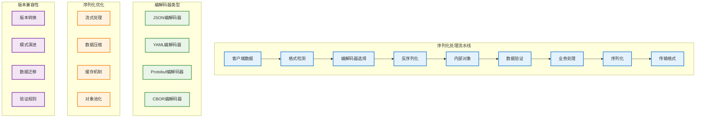

# 数据序列化

## 概述

Kubernetes 数据序列化机制负责在不同组件间高效传输和存储数据。通过支持多种序列化格式（JSON、YAML、Protocol Buffers），Kubernetes 实现了灵活的数据交换和持久化存储。序列化机制不仅影响系统性能，还关系到 API 兼容性和数据完整性。

## 序列化架构



## 序列化框架核心

### 编解码器接口

```go
// 序列化器接口
type Serializer interface {
    Encode(obj runtime.Object, w io.Writer) error
    Decode(data []byte, defaults *schema.GroupVersionKind, into runtime.Object) (runtime.Object, *schema.GroupVersionKind, error)
    Identifier() runtime.Identifier
}

// 编解码器工厂
type CodecFactory struct {
    scheme      *runtime.Scheme
    serializers map[runtime.Identifier]Serializer
    universal   runtime.Decoder
    
    // 配置
    pretty      bool
    strict      bool
    
    logger klog.Logger
}

func NewCodecFactory(scheme *runtime.Scheme) *CodecFactory {
    factory := &CodecFactory{
        scheme:      scheme,
        serializers: make(map[runtime.Identifier]Serializer),
        logger:      klog.WithName("codec-factory"),
    }
    
    // 注册内置序列化器
    factory.registerBuiltinSerializers()
    
    // 创建通用解码器
    factory.universal = factory.UniversalDecoder()
    
    return factory
}

func (f *CodecFactory) registerBuiltinSerializers() {
    // JSON 序列化器
    jsonSerializer := NewJSONSerializer(f.scheme, f.pretty, f.strict)
    f.serializers[jsonSerializer.Identifier()] = jsonSerializer
    
    // YAML 序列化器  
    yamlSerializer := NewYAMLSerializer(f.scheme)
    f.serializers[yamlSerializer.Identifier()] = yamlSerializer
    
    // Protobuf 序列化器
    protobufSerializer := NewProtobufSerializer(f.scheme)
    f.serializers[protobufSerializer.Identifier()] = protobufSerializer
}

func (f *CodecFactory) SupportedMediaTypes() []runtime.SerializerInfo {
    var mediaTypes []runtime.SerializerInfo
    
    for _, serializer := range f.serializers {
        info := runtime.SerializerInfo{
            MediaType:        serializer.Identifier().MediaType,
            EncodesAsText:    serializer.Identifier().EncodesAsText,
            Serializer:       serializer,
            PrettySerializer: serializer,
        }
        mediaTypes = append(mediaTypes, info)
    }
    
    return mediaTypes
}

func (f *CodecFactory) EncoderForVersion(serializer runtime.Encoder, gv runtime.GroupVersioner) runtime.Encoder {
    return &versioningEncoder{
        encoder:    serializer,
        convertor:  f.scheme,
        versioner:  gv,
    }
}

func (f *CodecFactory) DecoderToVersion(serializer runtime.Decoder, gv runtime.GroupVersioner) runtime.Decoder {
    return &versioningDecoder{
        decoder:   serializer,
        convertor: f.scheme,
        versioner: gv,
    }
}

func (f *CodecFactory) CodecForVersions(encoder runtime.Encoder, decoder runtime.Decoder, encode, decode runtime.GroupVersioner) runtime.Codec {
    return &codec{
        encoder: f.EncoderForVersion(encoder, encode),
        decoder: f.DecoderToVersion(decoder, decode),
    }
}

// 通用编解码器
type codec struct {
    encoder runtime.Encoder
    decoder runtime.Decoder
}

func (c *codec) Encode(obj runtime.Object, w io.Writer) error {
    return c.encoder.Encode(obj, w)
}

func (c *codec) Decode(data []byte, defaults *schema.GroupVersionKind, into runtime.Object) (runtime.Object, *schema.GroupVersionKind, error) {
    return c.decoder.Decode(data, defaults, into)
}
```

### JSON 序列化器

```go
// JSON 序列化器实现
type JSONSerializer struct {
    scheme *runtime.Scheme
    pretty bool
    strict bool
    
    // 对象池
    encoderPool sync.Pool
    decoderPool sync.Pool
    
    logger klog.Logger
}

func NewJSONSerializer(scheme *runtime.Scheme, pretty, strict bool) *JSONSerializer {
    js := &JSONSerializer{
        scheme: scheme,
        pretty: pretty,
        strict: strict,
        logger: klog.WithName("json-serializer"),
    }
    
    // 初始化对象池
    js.encoderPool = sync.Pool{
        New: func() interface{} {
            return json.NewEncoder(nil)
        },
    }
    
    js.decoderPool = sync.Pool{
        New: func() interface{} {
            return json.NewDecoder(nil)
        },
    }
    
    return js
}

func (s *JSONSerializer) Encode(obj runtime.Object, w io.Writer) error {
    encoder := s.encoderPool.Get().(*json.Encoder)
    defer s.encoderPool.Put(encoder)
    
    // 重置编码器输出
    encoder.SetOutput(w)
    
    if s.pretty {
        encoder.SetIndent("", "  ")
    }
    
    // 序列化对象
    return encoder.Encode(obj)
}

func (s *JSONSerializer) Decode(data []byte, defaults *schema.GroupVersionKind, into runtime.Object) (runtime.Object, *schema.GroupVersionKind, error) {
    var actual *schema.GroupVersionKind
    
    // 检测对象类型
    if actual = s.detectGVK(data); actual == nil {
        if defaults == nil {
            return nil, nil, fmt.Errorf("unable to determine object type")
        }
        actual = defaults
    }
    
    // 创建目标对象
    if into == nil {
        var err error
        into, err = s.scheme.New(*actual)
        if err != nil {
            return nil, actual, err
        }
    }
    
    // 获取解码器
    decoder := s.decoderPool.Get().(*json.Decoder)
    defer s.decoderPool.Put(decoder)
    
    // 配置解码器
    reader := bytes.NewReader(data)
    decoder.Reset(reader)
    
    if s.strict {
        decoder.DisallowUnknownFields()
    }
    
    // 执行反序列化
    if err := decoder.Decode(into); err != nil {
        return nil, actual, err
    }
    
    return into, actual, nil
}

func (s *JSONSerializer) detectGVK(data []byte) *schema.GroupVersionKind {
    var typeMeta metav1.TypeMeta
    
    if err := json.Unmarshal(data, &typeMeta); err != nil {
        return nil
    }
    
    if typeMeta.APIVersion == "" || typeMeta.Kind == "" {
        return nil
    }
    
    gv, err := schema.ParseGroupVersion(typeMeta.APIVersion)
    if err != nil {
        return nil
    }
    
    return &schema.GroupVersionKind{
        Group:   gv.Group,
        Version: gv.Version,
        Kind:    typeMeta.Kind,
    }
}

func (s *JSONSerializer) Identifier() runtime.Identifier {
    return runtime.Identifier{
        MediaType:     "application/json",
        EncodesAsText: true,
    }
}

// JSON 流式处理器
type JSONStreamSerializer struct {
    *JSONSerializer
    framer runtime.Framer
}

func NewJSONStreamSerializer(js *JSONSerializer) *JSONStreamSerializer {
    return &JSONStreamSerializer{
        JSONSerializer: js,
        framer:         json.Framer,
    }
}

func (s *JSONStreamSerializer) Encode(obj runtime.Object, w io.Writer) error {
    // 使用帧分隔符
    frameWriter := s.framer.NewFrameWriter(w)
    defer frameWriter.Close()
    
    return s.JSONSerializer.Encode(obj, frameWriter)
}

func (s *JSONStreamSerializer) Decode(stream io.ReadCloser) (runtime.Object, error) {
    frameReader := s.framer.NewFrameReader(stream)
    defer frameReader.Close()
    
    frame, err := frameReader.Read()
    if err != nil {
        return nil, err
    }
    
    obj, _, err := s.JSONSerializer.Decode(frame, nil, nil)
    return obj, err
}
```

### Protocol Buffers 序列化器

```go
// Protocol Buffers 序列化器
type ProtobufSerializer struct {
    scheme       *runtime.Scheme
    convertor    runtime.ObjectConvertor
    
    // 缓存
    typeRegistry map[schema.GroupVersionKind]proto.Message
    mutex        sync.RWMutex
    
    logger klog.Logger
}

func NewProtobufSerializer(scheme *runtime.Scheme) *ProtobufSerializer {
    return &ProtobufSerializer{
        scheme:       scheme,
        convertor:    scheme,
        typeRegistry: make(map[schema.GroupVersionKind]proto.Message),
        logger:       klog.WithName("protobuf-serializer"),
    }
}

func (s *ProtobufSerializer) Encode(obj runtime.Object, w io.Writer) error {
    // 转换为 protobuf 消息
    pbMessage, err := s.convertToProtobuf(obj)
    if err != nil {
        return err
    }
    
    // 序列化为二进制格式
    data, err := proto.Marshal(pbMessage)
    if err != nil {
        return err
    }
    
    // 写入长度前缀
    if err := s.writeVarint(w, uint64(len(data))); err != nil {
        return err
    }
    
    // 写入数据
    _, err = w.Write(data)
    return err
}

func (s *ProtobufSerializer) Decode(data []byte, defaults *schema.GroupVersionKind, into runtime.Object) (runtime.Object, *schema.GroupVersionKind, error) {
    reader := bytes.NewReader(data)
    
    // 读取长度前缀
    length, err := s.readVarint(reader)
    if err != nil {
        return nil, nil, err
    }
    
    // 读取消息数据
    messageData := make([]byte, length)
    if _, err := io.ReadFull(reader, messageData); err != nil {
        return nil, nil, err
    }
    
    // 检测消息类型
    gvk, err := s.detectProtobufType(messageData)
    if err != nil {
        if defaults == nil {
            return nil, nil, err
        }
        gvk = defaults
    }
    
    // 创建目标对象
    if into == nil {
        into, err = s.scheme.New(*gvk)
        if err != nil {
            return nil, gvk, err
        }
    }
    
    // 反序列化
    if err := s.unmarshalProtobuf(messageData, into); err != nil {
        return nil, gvk, err
    }
    
    return into, gvk, nil
}

func (s *ProtobufSerializer) convertToProtobuf(obj runtime.Object) (proto.Message, error) {
    // 检查对象是否已经是 protobuf 消息
    if pbMsg, ok := obj.(proto.Message); ok {
        return pbMsg, nil
    }
    
    // 获取对象的 GVK
    gvk := obj.GetObjectKind().GroupVersionKind()
    
    // 查找对应的 protobuf 类型
    pbType, err := s.getProtobufType(gvk)
    if err != nil {
        return nil, err
    }
    
    // 转换对象
    return s.convertObjectToProtobuf(obj, pbType)
}

func (s *ProtobufSerializer) getProtobufType(gvk schema.GroupVersionKind) (proto.Message, error) {
    s.mutex.RLock()
    pbType, exists := s.typeRegistry[gvk]
    s.mutex.RUnlock()
    
    if exists {
        return pbType, nil
    }
    
    // 动态查找 protobuf 类型
    pbType, err := s.lookupProtobufType(gvk)
    if err != nil {
        return nil, err
    }
    
    // 缓存类型
    s.mutex.Lock()
    s.typeRegistry[gvk] = pbType
    s.mutex.Unlock()
    
    return pbType, nil
}

func (s *ProtobufSerializer) lookupProtobufType(gvk schema.GroupVersionKind) (proto.Message, error) {
    // 根据 GVK 查找对应的 protobuf 类型
    // 这里需要根据实际的 protobuf 定义来实现
    
    switch gvk.Kind {
    case "Pod":
        return &corev1pb.Pod{}, nil
    case "Service":
        return &corev1pb.Service{}, nil
    case "Deployment":
        return &appsv1pb.Deployment{}, nil
    default:
        return nil, fmt.Errorf("unsupported protobuf type for %v", gvk)
    }
}

func (s *ProtobufSerializer) convertObjectToProtobuf(obj runtime.Object, pbType proto.Message) (proto.Message, error) {
    // 首先转换为 JSON
    jsonData, err := json.Marshal(obj)
    if err != nil {
        return nil, err
    }
    
    // 然后从 JSON 转换为 protobuf
    if err := protojson.Unmarshal(jsonData, pbType); err != nil {
        return nil, err
    }
    
    return pbType, nil
}

func (s *ProtobufSerializer) unmarshalProtobuf(data []byte, into runtime.Object) error {
    // 获取目标对象的 protobuf 类型
    gvk := into.GetObjectKind().GroupVersionKind()
    pbType, err := s.getProtobufType(gvk)
    if err != nil {
        return err
    }
    
    // 创建新的 protobuf 消息实例
    pbMessage := proto.Clone(pbType)
    proto.Reset(pbMessage)
    
    // 反序列化 protobuf 数据
    if err := proto.Unmarshal(data, pbMessage); err != nil {
        return err
    }
    
    // 转换为目标对象
    return s.convertProtobufToObject(pbMessage, into)
}

func (s *ProtobufSerializer) convertProtobufToObject(pbMsg proto.Message, into runtime.Object) error {
    // 转换为 JSON
    jsonData, err := protojson.Marshal(pbMsg)
    if err != nil {
        return err
    }
    
    // 从 JSON 反序列化到目标对象
    return json.Unmarshal(jsonData, into)
}

func (s *ProtobufSerializer) writeVarint(w io.Writer, value uint64) error {
    buf := make([]byte, binary.MaxVarintLen64)
    n := binary.PutUvarint(buf, value)
    _, err := w.Write(buf[:n])
    return err
}

func (s *ProtobufSerializer) readVarint(r io.Reader) (uint64, error) {
    buf := make([]byte, 1)
    var value uint64
    var shift uint
    
    for {
        if _, err := r.Read(buf); err != nil {
            return 0, err
        }
        
        b := buf[0]
        value |= uint64(b&0x7F) << shift
        
        if b&0x80 == 0 {
            break
        }
        
        shift += 7
        if shift >= 64 {
            return 0, fmt.Errorf("varint too long")
        }
    }
    
    return value, nil
}

func (s *ProtobufSerializer) detectProtobufType(data []byte) (*schema.GroupVersionKind, error) {
    // 这里需要实现 protobuf 消息类型检测
    // 可以通过消息的字段特征来判断类型
    return nil, fmt.Errorf("protobuf type detection not implemented")
}

func (s *ProtobufSerializer) Identifier() runtime.Identifier {
    return runtime.Identifier{
        MediaType:     "application/vnd.kubernetes.protobuf",
        EncodesAsText: false,
    }
}
```

### YAML 序列化器

```go
// YAML 序列化器
type YAMLSerializer struct {
    scheme *runtime.Scheme
    
    // JSON 序列化器用于实际处理
    jsonSerializer *JSONSerializer
    
    logger klog.Logger
}

func NewYAMLSerializer(scheme *runtime.Scheme) *YAMLSerializer {
    return &YAMLSerializer{
        scheme:         scheme,
        jsonSerializer: NewJSONSerializer(scheme, false, false),
        logger:         klog.WithName("yaml-serializer"),
    }
}

func (s *YAMLSerializer) Encode(obj runtime.Object, w io.Writer) error {
    // 先序列化为 JSON
    var jsonBuf bytes.Buffer
    if err := s.jsonSerializer.Encode(obj, &jsonBuf); err != nil {
        return err
    }
    
    // 转换 JSON 到 YAML
    yamlData, err := yaml.JSONToYAML(jsonBuf.Bytes())
    if err != nil {
        return err
    }
    
    _, err = w.Write(yamlData)
    return err
}

func (s *YAMLSerializer) Decode(data []byte, defaults *schema.GroupVersionKind, into runtime.Object) (runtime.Object, *schema.GroupVersionKind, error) {
    // 转换 YAML 到 JSON
    jsonData, err := yaml.YAMLToJSON(data)
    if err != nil {
        return nil, nil, err
    }
    
    // 使用 JSON 序列化器进行反序列化
    return s.jsonSerializer.Decode(jsonData, defaults, into)
}

func (s *YAMLSerializer) Identifier() runtime.Identifier {
    return runtime.Identifier{
        MediaType:     "application/yaml",
        EncodesAsText: true,
    }
}

// 多文档 YAML 序列化器
type MultiDocumentYAMLSerializer struct {
    *YAMLSerializer
}

func NewMultiDocumentYAMLSerializer(yamlSerializer *YAMLSerializer) *MultiDocumentYAMLSerializer {
    return &MultiDocumentYAMLSerializer{
        YAMLSerializer: yamlSerializer,
    }
}

func (s *MultiDocumentYAMLSerializer) EncodeList(objects []runtime.Object, w io.Writer) error {
    for i, obj := range objects {
        if i > 0 {
            // 写入文档分隔符
            if _, err := w.Write([]byte("---\n")); err != nil {
                return err
            }
        }
        
        if err := s.Encode(obj, w); err != nil {
            return err
        }
    }
    
    return nil
}

func (s *MultiDocumentYAMLSerializer) DecodeList(data []byte) ([]runtime.Object, error) {
    var objects []runtime.Object
    
    // 分割多文档 YAML
    docs := bytes.Split(data, []byte("---"))
    
    for _, doc := range docs {
        doc = bytes.TrimSpace(doc)
        if len(doc) == 0 {
            continue
        }
        
        obj, _, err := s.Decode(doc, nil, nil)
        if err != nil {
            return nil, err
        }
        
        objects = append(objects, obj)
    }
    
    return objects, nil
}
```

## 版本转换机制

### 版本转换器

```go
// 版本转换器
type versioningEncoder struct {
    encoder   runtime.Encoder
    convertor runtime.ObjectConvertor
    versioner runtime.GroupVersioner
}

func (e *versioningEncoder) Encode(obj runtime.Object, w io.Writer) error {
    // 获取目标版本
    targetGV := e.versioner.KindForGroupVersionKinds([]schema.GroupVersionKind{
        obj.GetObjectKind().GroupVersionKind(),
    })
    
    if targetGV.Empty() {
        return fmt.Errorf("no suitable target version found")
    }
    
    // 转换到目标版本
    converted, err := e.convertor.ConvertToVersion(obj, e.versioner)
    if err != nil {
        return err
    }
    
    // 编码转换后的对象
    return e.encoder.Encode(converted, w)
}

type versioningDecoder struct {
    decoder   runtime.Decoder
    convertor runtime.ObjectConvertor
    versioner runtime.GroupVersioner
}

func (d *versioningDecoder) Decode(data []byte, defaults *schema.GroupVersionKind, into runtime.Object) (runtime.Object, *schema.GroupVersionKind, error) {
    // 使用底层解码器解码
    obj, gvk, err := d.decoder.Decode(data, defaults, into)
    if err != nil {
        return nil, gvk, err
    }
    
    // 如果指定了目标版本器，进行版本转换
    if d.versioner != nil {
        converted, err := d.convertor.ConvertToVersion(obj, d.versioner)
        if err != nil {
            return obj, gvk, err
        }
        obj = converted
    }
    
    return obj, gvk, nil
}

// 版本转换管理器
type ConversionManager struct {
    scheme    *runtime.Scheme
    converters map[schema.GroupVersionKind]map[schema.GroupVersionKind]ConversionFunc
    
    mutex  sync.RWMutex
    logger klog.Logger
}

type ConversionFunc func(in, out runtime.Object) error

func NewConversionManager(scheme *runtime.Scheme) *ConversionManager {
    return &ConversionManager{
        scheme:     scheme,
        converters: make(map[schema.GroupVersionKind]map[schema.GroupVersionKind]ConversionFunc),
        logger:     klog.WithName("conversion-manager"),
    }
}

func (cm *ConversionManager) RegisterConversion(
    from, to schema.GroupVersionKind,
    fn ConversionFunc,
) {
    cm.mutex.Lock()
    defer cm.mutex.Unlock()
    
    if cm.converters[from] == nil {
        cm.converters[from] = make(map[schema.GroupVersionKind]ConversionFunc)
    }
    
    cm.converters[from][to] = fn
    
    cm.logger.V(4).Info("Registered conversion",
        "from", from,
        "to", to)
}

func (cm *ConversionManager) Convert(obj runtime.Object, targetGVK schema.GroupVersionKind) (runtime.Object, error) {
    sourceGVK := obj.GetObjectKind().GroupVersionKind()
    
    if sourceGVK == targetGVK {
        return obj, nil
    }
    
    // 查找直接转换函数
    if converter := cm.findConverter(sourceGVK, targetGVK); converter != nil {
        return cm.executeConversion(obj, targetGVK, converter)
    }
    
    // 查找通过中间版本的转换路径
    path := cm.findConversionPath(sourceGVK, targetGVK)
    if len(path) == 0 {
        return nil, fmt.Errorf("no conversion path from %v to %v", sourceGVK, targetGVK)
    }
    
    return cm.executeConversionPath(obj, path)
}

func (cm *ConversionManager) findConverter(from, to schema.GroupVersionKind) ConversionFunc {
    cm.mutex.RLock()
    defer cm.mutex.RUnlock()
    
    if converters, exists := cm.converters[from]; exists {
        if converter, exists := converters[to]; exists {
            return converter
        }
    }
    
    return nil
}

func (cm *ConversionManager) findConversionPath(from, to schema.GroupVersionKind) []schema.GroupVersionKind {
    // 使用 BFS 查找最短转换路径
    queue := [][]schema.GroupVersionKind{{from}}
    visited := make(map[schema.GroupVersionKind]bool)
    visited[from] = true
    
    for len(queue) > 0 {
        path := queue[0]
        queue = queue[1:]
        
        current := path[len(path)-1]
        
        if current == to {
            return path
        }
        
        // 查找所有可能的下一步转换
        cm.mutex.RLock()
        if converters, exists := cm.converters[current]; exists {
            for next := range converters {
                if !visited[next] {
                    visited[next] = true
                    newPath := make([]schema.GroupVersionKind, len(path)+1)
                    copy(newPath, path)
                    newPath[len(path)] = next
                    queue = append(queue, newPath)
                }
            }
        }
        cm.mutex.RUnlock()
    }
    
    return nil
}

func (cm *ConversionManager) executeConversion(obj runtime.Object, targetGVK schema.GroupVersionKind, converter ConversionFunc) (runtime.Object, error) {
    // 创建目标对象
    target, err := cm.scheme.New(targetGVK)
    if err != nil {
        return nil, err
    }
    
    // 执行转换
    if err := converter(obj, target); err != nil {
        return nil, err
    }
    
    return target, nil
}

func (cm *ConversionManager) executeConversionPath(obj runtime.Object, path []schema.GroupVersionKind) (runtime.Object, error) {
    current := obj
    
    for i := 1; i < len(path); i++ {
        sourceGVK := path[i-1]
        targetGVK := path[i]
        
        converter := cm.findConverter(sourceGVK, targetGVK)
        if converter == nil {
            return nil, fmt.Errorf("missing converter from %v to %v", sourceGVK, targetGVK)
        }
        
        target, err := cm.executeConversion(current, targetGVK, converter)
        if err != nil {
            return nil, err
        }
        
        current = target
    }
    
    return current, nil
}
```

## 性能优化

### 对象池化

```go
// 序列化对象池
type SerializerPool struct {
    jsonEncoders sync.Pool
    jsonDecoders sync.Pool
    yamlBuffers  sync.Pool
    
    // 统计信息
    hits   int64
    misses int64
    
    logger klog.Logger
}

func NewSerializerPool() *SerializerPool {
    pool := &SerializerPool{
        logger: klog.WithName("serializer-pool"),
    }
    
    // JSON 编码器池
    pool.jsonEncoders = sync.Pool{
        New: func() interface{} {
            atomic.AddInt64(&pool.misses, 1)
            return &jsonEncoder{
                encoder: json.NewEncoder(nil),
            }
        },
    }
    
    // JSON 解码器池
    pool.jsonDecoders = sync.Pool{
        New: func() interface{} {
            atomic.AddInt64(&pool.misses, 1)
            return &jsonDecoder{
                decoder: json.NewDecoder(nil),
            }
        },
    }
    
    // YAML 缓冲区池
    pool.yamlBuffers = sync.Pool{
        New: func() interface{} {
            atomic.AddInt64(&pool.misses, 1)
            return &bytes.Buffer{}
        },
    }
    
    return pool
}

type jsonEncoder struct {
    encoder *json.Encoder
    writer  io.Writer
}

func (e *jsonEncoder) Reset(w io.Writer) {
    e.writer = w
    e.encoder.SetOutput(w)
}

func (e *jsonEncoder) Encode(obj interface{}) error {
    return e.encoder.Encode(obj)
}

type jsonDecoder struct {
    decoder *json.Decoder
    reader  io.Reader
}

func (d *jsonDecoder) Reset(r io.Reader) {
    d.reader = r
    d.decoder.Reset(r)
}

func (d *jsonDecoder) Decode(obj interface{}) error {
    return d.decoder.Decode(obj)
}

func (p *SerializerPool) GetJSONEncoder(w io.Writer) *jsonEncoder {
    atomic.AddInt64(&p.hits, 1)
    encoder := p.jsonEncoders.Get().(*jsonEncoder)
    encoder.Reset(w)
    return encoder
}

func (p *SerializerPool) PutJSONEncoder(encoder *jsonEncoder) {
    p.jsonEncoders.Put(encoder)
}

func (p *SerializerPool) GetJSONDecoder(r io.Reader) *jsonDecoder {
    atomic.AddInt64(&p.hits, 1)
    decoder := p.jsonDecoders.Get().(*jsonDecoder)
    decoder.Reset(r)
    return decoder
}

func (p *SerializerPool) PutJSONDecoder(decoder *jsonDecoder) {
    p.jsonDecoders.Put(decoder)
}

func (p *SerializerPool) GetBuffer() *bytes.Buffer {
    atomic.AddInt64(&p.hits, 1)
    buf := p.yamlBuffers.Get().(*bytes.Buffer)
    buf.Reset()
    return buf
}

func (p *SerializerPool) PutBuffer(buf *bytes.Buffer) {
    if buf.Len() > 64*1024 { // 避免内存泄漏
        return
    }
    p.yamlBuffers.Put(buf)
}

func (p *SerializerPool) GetStats() PoolStats {
    hits := atomic.LoadInt64(&p.hits)
    misses := atomic.LoadInt64(&p.misses)
    
    return PoolStats{
        Hits:    hits,
        Misses:  misses,
        HitRate: float64(hits) / float64(hits+misses),
    }
}

type PoolStats struct {
    Hits    int64
    Misses  int64
    HitRate float64
}
```

### 压缩和缓存

```go
// 压缩序列化器
type CompressingSerializer struct {
    serializer runtime.Serializer
    compressor Compressor
    threshold  int // 压缩阈值
    
    // 缓存
    cache     map[string][]byte
    cacheMux  sync.RWMutex
    maxCache  int
    
    logger klog.Logger
}

type Compressor interface {
    Compress(data []byte) ([]byte, error)
    Decompress(data []byte) ([]byte, error)
    Algorithm() string
}

func NewCompressingSerializer(serializer runtime.Serializer, compressor Compressor) *CompressingSerializer {
    return &CompressingSerializer{
        serializer: serializer,
        compressor: compressor,
        threshold:  1024, // 1KB
        cache:      make(map[string][]byte),
        maxCache:   1000,
        logger:     klog.WithName("compressing-serializer"),
    }
}

func (cs *CompressingSerializer) Encode(obj runtime.Object, w io.Writer) error {
    // 检查缓存
    cacheKey := cs.getCacheKey(obj)
    if data := cs.getFromCache(cacheKey); data != nil {
        _, err := w.Write(data)
        return err
    }
    
    // 序列化对象
    var buf bytes.Buffer
    if err := cs.serializer.Encode(obj, &buf); err != nil {
        return err
    }
    
    data := buf.Bytes()
    
    // 如果数据大于阈值，进行压缩
    if len(data) > cs.threshold {
        compressed, err := cs.compressor.Compress(data)
        if err != nil {
            cs.logger.Error(err, "Failed to compress data")
        } else if len(compressed) < len(data) {
            // 添加压缩标识
            data = cs.addCompressionHeader(compressed)
            cs.logger.V(4).Info("Data compressed",
                "originalSize", len(buf.Bytes()),
                "compressedSize", len(compressed),
                "ratio", float64(len(compressed))/float64(len(buf.Bytes())))
        }
    }
    
    // 缓存结果
    cs.putToCache(cacheKey, data)
    
    _, err := w.Write(data)
    return err
}

func (cs *CompressingSerializer) Decode(data []byte, defaults *schema.GroupVersionKind, into runtime.Object) (runtime.Object, *schema.GroupVersionKind, error) {
    // 检查是否压缩
    if cs.isCompressed(data) {
        decompressed, err := cs.decompress(data)
        if err != nil {
            return nil, nil, err
        }
        data = decompressed
    }
    
    return cs.serializer.Decode(data, defaults, into)
}

func (cs *CompressingSerializer) getCacheKey(obj runtime.Object) string {
    // 使用对象的类型和内容哈希作为缓存键
    gvk := obj.GetObjectKind().GroupVersionKind()
    hash := cs.hashObject(obj)
    return fmt.Sprintf("%s/%s", gvk.String(), hash)
}

func (cs *CompressingSerializer) hashObject(obj runtime.Object) string {
    hasher := sha256.New()
    
    // 简化的哈希实现，实际应该更加精确
    if accessor, err := meta.Accessor(obj); err == nil {
        hasher.Write([]byte(accessor.GetName()))
        hasher.Write([]byte(accessor.GetNamespace()))
        hasher.Write([]byte(accessor.GetResourceVersion()))
    }
    
    return hex.EncodeToString(hasher.Sum(nil))[:16]
}

func (cs *CompressingSerializer) getFromCache(key string) []byte {
    cs.cacheMux.RLock()
    defer cs.cacheMux.RUnlock()
    
    if data, exists := cs.cache[key]; exists {
        return data
    }
    return nil
}

func (cs *CompressingSerializer) putToCache(key string, data []byte) {
    cs.cacheMux.Lock()
    defer cs.cacheMux.Unlock()
    
    // 检查缓存大小限制
    if len(cs.cache) >= cs.maxCache {
        cs.evictFromCache()
    }
    
    cs.cache[key] = data
}

func (cs *CompressingSerializer) evictFromCache() {
    // 简单的随机驱逐策略
    count := len(cs.cache) / 4 // 驱逐 25%
    i := 0
    for key := range cs.cache {
        if i >= count {
            break
        }
        delete(cs.cache, key)
        i++
    }
}

func (cs *CompressingSerializer) addCompressionHeader(data []byte) []byte {
    // 添加压缩算法标识
    header := []byte(cs.compressor.Algorithm())
    result := make([]byte, len(header)+1+len(data))
    copy(result, header)
    result[len(header)] = 0x00 // 分隔符
    copy(result[len(header)+1:], data)
    return result
}

func (cs *CompressingSerializer) isCompressed(data []byte) bool {
    // 检查压缩标识
    algorithm := cs.compressor.Algorithm()
    if len(data) < len(algorithm)+1 {
        return false
    }
    
    return string(data[:len(algorithm)]) == algorithm && data[len(algorithm)] == 0x00
}

func (cs *CompressingSerializer) decompress(data []byte) ([]byte, error) {
    algorithm := cs.compressor.Algorithm()
    headerLen := len(algorithm) + 1
    
    if len(data) <= headerLen {
        return nil, fmt.Errorf("invalid compressed data")
    }
    
    return cs.compressor.Decompress(data[headerLen:])
}

// GZIP 压缩器实现
type GzipCompressor struct{}

func (gc *GzipCompressor) Compress(data []byte) ([]byte, error) {
    var buf bytes.Buffer
    writer := gzip.NewWriter(&buf)
    
    if _, err := writer.Write(data); err != nil {
        writer.Close()
        return nil, err
    }
    
    if err := writer.Close(); err != nil {
        return nil, err
    }
    
    return buf.Bytes(), nil
}

func (gc *GzipCompressor) Decompress(data []byte) ([]byte, error) {
    reader, err := gzip.NewReader(bytes.NewReader(data))
    if err != nil {
        return nil, err
    }
    defer reader.Close()
    
    return ioutil.ReadAll(reader)
}

func (gc *GzipCompressor) Algorithm() string {
    return "gzip"
}
```

## 监控和调试

### 序列化性能指标

```go
// 序列化性能指标
var (
    serializationDuration = prometheus.NewHistogramVec(
        prometheus.HistogramOpts{
            Name: "kubernetes_serialization_duration_seconds",
            Help: "Time taken for serialization operations",
        },
        []string{"format", "operation", "object_type"},
    )
    
    serializationSize = prometheus.NewHistogramVec(
        prometheus.HistogramOpts{
            Name: "kubernetes_serialization_size_bytes",
            Help: "Size of serialized data",
        },
        []string{"format", "object_type"},
    )
    
    serializationErrors = prometheus.NewCounterVec(
        prometheus.CounterOpts{
            Name: "kubernetes_serialization_errors_total",
            Help: "Total number of serialization errors",
        },
        []string{"format", "operation", "error_type"},
    )
    
    serializationCacheHits = prometheus.NewCounterVec(
        prometheus.CounterOpts{
            Name: "kubernetes_serialization_cache_hits_total",
            Help: "Total number of serialization cache hits",
        },
        []string{"cache_type"},
    )
)

// 性能监控包装器
type InstrumentedSerializer struct {
    serializer runtime.Serializer
    format     string
    logger     klog.Logger
}

func NewInstrumentedSerializer(serializer runtime.Serializer, format string) *InstrumentedSerializer {
    return &InstrumentedSerializer{
        serializer: serializer,
        format:     format,
        logger:     klog.WithName("instrumented-serializer"),
    }
}

func (is *InstrumentedSerializer) Encode(obj runtime.Object, w io.Writer) error {
    start := time.Now()
    objectType := obj.GetObjectKind().GroupVersionKind().Kind
    
    // 使用计数写入器测量大小
    cw := &countingWriter{Writer: w}
    
    err := is.serializer.Encode(obj, cw)
    duration := time.Since(start)
    
    // 记录指标
    serializationDuration.WithLabelValues(is.format, "encode", objectType).Observe(duration.Seconds())
    
    if err != nil {
        serializationErrors.WithLabelValues(is.format, "encode", err.Error()).Inc()
    } else {
        serializationSize.WithLabelValues(is.format, objectType).Observe(float64(cw.count))
    }
    
    is.logger.V(4).Info("Encode completed",
        "format", is.format,
        "objectType", objectType,
        "duration", duration,
        "size", cw.count,
        "error", err)
    
    return err
}

func (is *InstrumentedSerializer) Decode(data []byte, defaults *schema.GroupVersionKind, into runtime.Object) (runtime.Object, *schema.GroupVersionKind, error) {
    start := time.Now()
    var objectType string
    if defaults != nil {
        objectType = defaults.Kind
    }
    
    obj, gvk, err := is.serializer.Decode(data, defaults, into)
    duration := time.Since(start)
    
    if gvk != nil {
        objectType = gvk.Kind
    }
    
    // 记录指标
    serializationDuration.WithLabelValues(is.format, "decode", objectType).Observe(duration.Seconds())
    
    if err != nil {
        serializationErrors.WithLabelValues(is.format, "decode", err.Error()).Inc()
    } else {
        serializationSize.WithLabelValues(is.format, objectType).Observe(float64(len(data)))
    }
    
    is.logger.V(4).Info("Decode completed",
        "format", is.format,
        "objectType", objectType,
        "duration", duration,
        "dataSize", len(data),
        "error", err)
    
    return obj, gvk, err
}

type countingWriter struct {
    io.Writer
    count int64
}

func (cw *countingWriter) Write(p []byte) (n int, err error) {
    n, err = cw.Writer.Write(p)
    cw.count += int64(n)
    return
}

func (is *InstrumentedSerializer) Identifier() runtime.Identifier {
    return is.serializer.Identifier()
}
```

## 最佳实践

### 序列化优化指南

1. **格式选择**：
   - **JSON**：人类可读，广泛支持，调试友好
   - **YAML**：配置文件友好，支持注释和多文档
   - **Protobuf**：高效压缩，快速序列化，版本兼容

2. **性能优化**：
   - 使用对象池减少内存分配
   - 实现智能缓存策略
   - 合理使用压缩算法
   - 避免频繁的版本转换

3. **兼容性保证**：
   - 实现向前和向后兼容的转换
   - 使用渐进式模式演进
   - 提供多版本支持
   - 实现优雅的降级机制

### 故障排查

1. **序列化问题诊断**：
   ```bash
   # 检查对象序列化
   kubectl get pod nginx-pod -o json
   kubectl get pod nginx-pod -o yaml
   
   # 验证数据格式
   kubectl get pod nginx-pod -o json | jq .
   kubectl get pod nginx-pod -o yaml | yq .
   ```

2. **常见问题解决**：
   - **序列化失败**：检查对象结构和字段类型
   - **版本转换错误**：验证转换函数和映射关系
   - **性能问题**：分析序列化耗时和数据大小
   - **兼容性问题**：检查 API 版本和模式变更

Kubernetes 的数据序列化机制为系统提供了灵活、高效的数据交换能力，是实现 API 兼容性和系统性能的重要基础。
