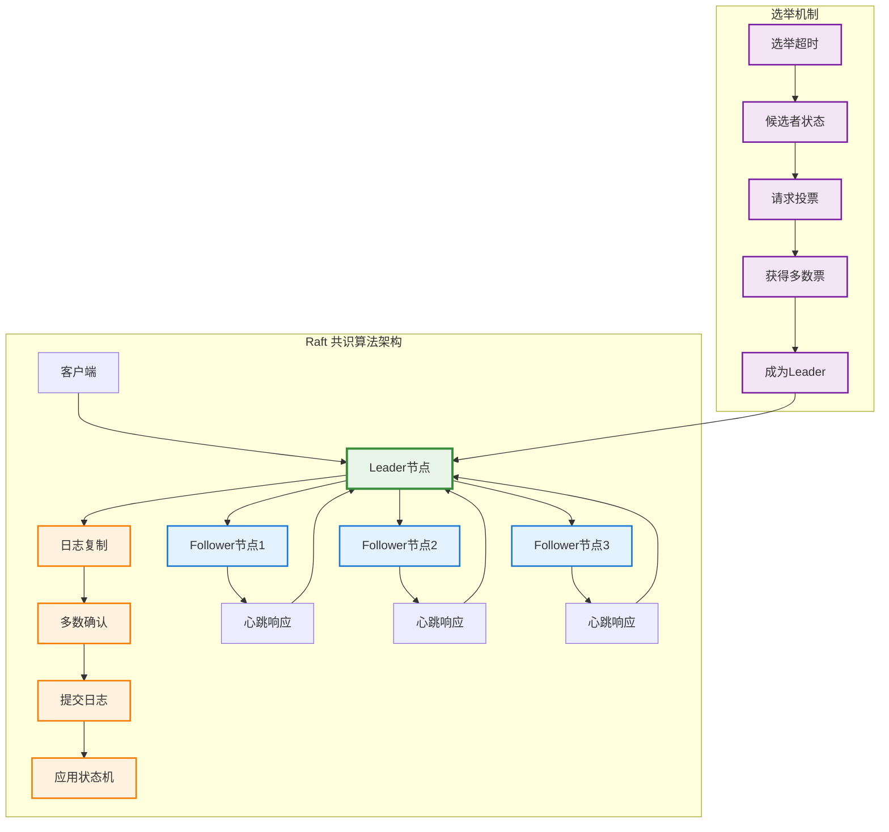

# etcd 一致性算法

## 概述

etcd 是 Kubernetes 的核心数据存储，基于 Raft 共识算法实现强一致性分布式存储。作为 Kubernetes 集群的"大脑"，etcd 负责存储所有集群状态信息，并确保在分布式环境中数据的一致性、可用性和持久性。

## Raft 共识算法架构



## Raft 算法核心实现

### 节点状态管理

```go
// Raft 节点状态
type NodeState int

const (
    Follower NodeState = iota
    Candidate
    Leader
)

// Raft 节点实现
type RaftNode struct {
    // 节点标识
    id       uint64
    state    NodeState
    term     uint64
    votedFor uint64
    
    // 日志相关
    log         []LogEntry
    commitIndex uint64
    lastApplied uint64
    
    // Leader 特有状态
    nextIndex  map[uint64]uint64
    matchIndex map[uint64]uint64
    
    // 网络和存储接口
    transport  Transport
    storage    Storage
    
    // 配置
    peers           []uint64
    electionTimeout time.Duration
    heartbeatTimeout time.Duration
    
    // 同步控制
    mutex          sync.RWMutex
    applyCh        chan ApplyMsg
    electionTimer  *time.Timer
    heartbeatTimer *time.Timer
    
    logger klog.Logger
}

// 日志条目
type LogEntry struct {
    Term    uint64
    Index   uint64
    Command []byte
    Type    EntryType
}

type EntryType int

const (
    EntryNormal EntryType = iota
    EntryConfig
)

// 应用消息
type ApplyMsg struct {
    Index   uint64
    Command []byte
    Term    uint64
}

func NewRaftNode(id uint64, peers []uint64, transport Transport, storage Storage) *RaftNode {
    node := &RaftNode{
        id:               id,
        state:            Follower,
        term:             0,
        votedFor:         0,
        peers:           peers,
        transport:       transport,
        storage:         storage,
        nextIndex:       make(map[uint64]uint64),
        matchIndex:      make(map[uint64]uint64),
        electionTimeout: time.Duration(150+rand.Intn(150)) * time.Millisecond,
        heartbeatTimeout: 50 * time.Millisecond,
        applyCh:         make(chan ApplyMsg, 1000),
        logger:          klog.WithName("raft"),
    }
    
    // 从存储恢复状态
    node.loadState()
    
    // 启动选举定时器
    node.resetElectionTimer()
    
    return node
}
```

### Leader 选举机制

```go
// Leader 选举实现
func (r *RaftNode) startElection() {
    r.mutex.Lock()
    defer r.mutex.Unlock()
    
    r.logger.Info("Starting election", "term", r.term+1, "node", r.id)
    
    // 转换为候选者状态
    r.state = Candidate
    r.term++
    r.votedFor = r.id
    r.persistState()
    
    // 重置选举定时器
    r.resetElectionTimer()
    
    // 获得自己的选票
    votes := 1
    
    // 向其他节点请求投票
    for _, peer := range r.peers {
        if peer == r.id {
            continue
        }
        
        go r.requestVote(peer, &votes)
    }
}

func (r *RaftNode) requestVote(peer uint64, votes *int) {
    r.mutex.RLock()
    lastLogIndex := uint64(len(r.log))
    lastLogTerm := uint64(0)
    if lastLogIndex > 0 {
        lastLogTerm = r.log[lastLogIndex-1].Term
    }
    
    req := &RequestVoteRequest{
        Term:         r.term,
        CandidateID:  r.id,
        LastLogIndex: lastLogIndex,
        LastLogTerm:  lastLogTerm,
    }
    r.mutex.RUnlock()
    
    resp, err := r.transport.RequestVote(peer, req)
    if err != nil {
        r.logger.Error(err, "Failed to request vote", "peer", peer)
        return
    }
    
    r.mutex.Lock()
    defer r.mutex.Unlock()
    
    if resp.Term > r.term {
        r.convertToFollower(resp.Term)
        return
    }
    
    if r.state != Candidate || resp.Term != r.term {
        return
    }
    
    if resp.VoteGranted {
        *votes++
        if *votes > len(r.peers)/2 {
            r.convertToLeader()
        }
    }
}

// 投票请求处理
func (r *RaftNode) HandleRequestVote(req *RequestVoteRequest) *RequestVoteResponse {
    r.mutex.Lock()
    defer r.mutex.Unlock()
    
    resp := &RequestVoteResponse{
        Term:        r.term,
        VoteGranted: false,
    }
    
    // 如果请求的 term 更新，更新自己的 term
    if req.Term > r.term {
        r.convertToFollower(req.Term)
    }
    
    // 检查是否可以投票
    if req.Term == r.term &&
        (r.votedFor == 0 || r.votedFor == req.CandidateID) &&
        r.isLogUpToDate(req.LastLogIndex, req.LastLogTerm) {
        
        r.votedFor = req.CandidateID
        r.persistState()
        r.resetElectionTimer()
        resp.VoteGranted = true
        
        r.logger.Info("Granted vote", "candidate", req.CandidateID, "term", req.Term)
    }
    
    return resp
}

func (r *RaftNode) isLogUpToDate(lastLogIndex, lastLogTerm uint64) bool {
    myLastIndex := uint64(len(r.log))
    myLastTerm := uint64(0)
    
    if myLastIndex > 0 {
        myLastTerm = r.log[myLastIndex-1].Term
    }
    
    if lastLogTerm > myLastTerm {
        return true
    }
    
    if lastLogTerm == myLastTerm && lastLogIndex >= myLastIndex {
        return true
    }
    
    return false
}
```

### 日志复制机制

```go
// 日志复制实现
func (r *RaftNode) convertToLeader() {
    r.logger.Info("Became leader", "term", r.term, "node", r.id)
    
    r.state = Leader
    
    // 初始化 Leader 状态
    for _, peer := range r.peers {
        r.nextIndex[peer] = uint64(len(r.log)) + 1
        r.matchIndex[peer] = 0
    }
    
    // 停止选举定时器，启动心跳定时器
    r.electionTimer.Stop()
    r.heartbeatTimer = time.NewTimer(r.heartbeatTimeout)
    
    // 立即发送心跳
    go r.sendHeartbeats()
}

func (r *RaftNode) sendHeartbeats() {
    for {
        select {
        case <-r.heartbeatTimer.C:
            if r.state != Leader {
                return
            }
            
            r.replicateLog()
            r.heartbeatTimer.Reset(r.heartbeatTimeout)
            
        default:
            if r.state != Leader {
                return
            }
            time.Sleep(10 * time.Millisecond)
        }
    }
}

func (r *RaftNode) replicateLog() {
    r.mutex.RLock()
    defer r.mutex.RUnlock()
    
    for _, peer := range r.peers {
        if peer == r.id {
            continue
        }
        
        go r.replicateLogToPeer(peer)
    }
}

func (r *RaftNode) replicateLogToPeer(peer uint64) {
    r.mutex.RLock()
    
    nextIndex := r.nextIndex[peer]
    prevLogIndex := nextIndex - 1
    prevLogTerm := uint64(0)
    
    if prevLogIndex > 0 && prevLogIndex <= uint64(len(r.log)) {
        prevLogTerm = r.log[prevLogIndex-1].Term
    }
    
    entries := []LogEntry{}
    if nextIndex <= uint64(len(r.log)) {
        entries = r.log[nextIndex-1:]
    }
    
    req := &AppendEntriesRequest{
        Term:         r.term,
        LeaderID:     r.id,
        PrevLogIndex: prevLogIndex,
        PrevLogTerm:  prevLogTerm,
        Entries:      entries,
        LeaderCommit: r.commitIndex,
    }
    r.mutex.RUnlock()
    
    resp, err := r.transport.AppendEntries(peer, req)
    if err != nil {
        r.logger.Error(err, "Failed to append entries", "peer", peer)
        return
    }
    
    r.mutex.Lock()
    defer r.mutex.Unlock()
    
    if resp.Term > r.term {
        r.convertToFollower(resp.Term)
        return
    }
    
    if r.state != Leader || resp.Term != r.term {
        return
    }
    
    if resp.Success {
        // 更新 nextIndex 和 matchIndex
        r.nextIndex[peer] = nextIndex + uint64(len(entries))
        r.matchIndex[peer] = r.nextIndex[peer] - 1
        
        // 尝试更新 commitIndex
        r.updateCommitIndex()
    } else {
        // 日志不匹配，回退 nextIndex
        if r.nextIndex[peer] > 1 {
            r.nextIndex[peer]--
        }
    }
}

// 日志追加处理
func (r *RaftNode) HandleAppendEntries(req *AppendEntriesRequest) *AppendEntriesResponse {
    r.mutex.Lock()
    defer r.mutex.Unlock()
    
    resp := &AppendEntriesResponse{
        Term:    r.term,
        Success: false,
    }
    
    // 如果请求的 term 更新，更新自己的 term
    if req.Term > r.term {
        r.convertToFollower(req.Term)
    }
    
    if req.Term < r.term {
        return resp
    }
    
    // 重置选举定时器
    r.resetElectionTimer()
    
    // 检查日志一致性
    if req.PrevLogIndex > 0 {
        if req.PrevLogIndex > uint64(len(r.log)) ||
            r.log[req.PrevLogIndex-1].Term != req.PrevLogTerm {
            return resp
        }
    }
    
    // 处理日志条目
    if len(req.Entries) > 0 {
        // 删除冲突的条目
        startIndex := req.PrevLogIndex
        for i, entry := range req.Entries {
            logIndex := startIndex + uint64(i) + 1
            if logIndex <= uint64(len(r.log)) {
                if r.log[logIndex-1].Term != entry.Term {
                    r.log = r.log[:logIndex-1]
                    break
                }
            }
        }
        
        // 追加新条目
        for i, entry := range req.Entries {
            logIndex := startIndex + uint64(i) + 1
            if logIndex > uint64(len(r.log)) {
                r.log = append(r.log, entry)
            }
        }
        
        r.persistLog()
    }
    
    // 更新 commitIndex
    if req.LeaderCommit > r.commitIndex {
        r.commitIndex = min(req.LeaderCommit, uint64(len(r.log)))
        r.applyLog()
    }
    
    resp.Success = true
    return resp
}

func (r *RaftNode) updateCommitIndex() {
    if r.state != Leader {
        return
    }
    
    // 找到大多数节点已复制的最大索引
    for index := uint64(len(r.log)); index > r.commitIndex; index-- {
        if r.log[index-1].Term != r.term {
            continue
        }
        
        count := 1 // 自己
        for _, peer := range r.peers {
            if peer != r.id && r.matchIndex[peer] >= index {
                count++
            }
        }
        
        if count > len(r.peers)/2 {
            r.commitIndex = index
            r.applyLog()
            break
        }
    }
}
```

### 状态持久化

```go
// 状态持久化接口
type Storage interface {
    SaveState(term, votedFor uint64) error
    LoadState() (term, votedFor uint64, err error)
    SaveLog(entries []LogEntry) error
    LoadLog() ([]LogEntry, error)
    SaveSnapshot(index, term uint64, data []byte) error
    LoadSnapshot() (index, term uint64, data []byte, err error)
}

// 文件存储实现
type FileStorage struct {
    dataDir string
    logger  klog.Logger
}

func NewFileStorage(dataDir string) *FileStorage {
    return &FileStorage{
        dataDir: dataDir,
        logger:  klog.WithName("file-storage"),
    }
}

func (f *FileStorage) SaveState(term, votedFor uint64) error {
    state := &PersistentState{
        Term:     term,
        VotedFor: votedFor,
    }
    
    data, err := json.Marshal(state)
    if err != nil {
        return err
    }
    
    statePath := filepath.Join(f.dataDir, "state.json")
    tempPath := statePath + ".tmp"
    
    // 原子写入
    if err := ioutil.WriteFile(tempPath, data, 0600); err != nil {
        return err
    }
    
    return os.Rename(tempPath, statePath)
}

func (f *FileStorage) LoadState() (uint64, uint64, error) {
    statePath := filepath.Join(f.dataDir, "state.json")
    
    data, err := ioutil.ReadFile(statePath)
    if err != nil {
        if os.IsNotExist(err) {
            return 0, 0, nil
        }
        return 0, 0, err
    }
    
    var state PersistentState
    if err := json.Unmarshal(data, &state); err != nil {
        return 0, 0, err
    }
    
    return state.Term, state.VotedFor, nil
}

func (f *FileStorage) SaveLog(entries []LogEntry) error {
    logPath := filepath.Join(f.dataDir, "log.json")
    tempPath := logPath + ".tmp"
    
    data, err := json.Marshal(entries)
    if err != nil {
        return err
    }
    
    if err := ioutil.WriteFile(tempPath, data, 0600); err != nil {
        return err
    }
    
    return os.Rename(tempPath, logPath)
}

func (f *FileStorage) LoadLog() ([]LogEntry, error) {
    logPath := filepath.Join(f.dataDir, "log.json")
    
    data, err := ioutil.ReadFile(logPath)
    if err != nil {
        if os.IsNotExist(err) {
            return []LogEntry{}, nil
        }
        return nil, err
    }
    
    var entries []LogEntry
    if err := json.Unmarshal(data, &entries); err != nil {
        return nil, err
    }
    
    return entries, nil
}

type PersistentState struct {
    Term     uint64 `json:"term"`
    VotedFor uint64 `json:"votedFor"`
}

// 节点状态持久化
func (r *RaftNode) persistState() {
    if err := r.storage.SaveState(r.term, r.votedFor); err != nil {
        r.logger.Error(err, "Failed to persist state")
    }
}

func (r *RaftNode) loadState() {
    term, votedFor, err := r.storage.LoadState()
    if err != nil {
        r.logger.Error(err, "Failed to load state")
        return
    }
    
    r.term = term
    r.votedFor = votedFor
    
    // 加载日志
    log, err := r.storage.LoadLog()
    if err != nil {
        r.logger.Error(err, "Failed to load log")
        return
    }
    
    r.log = log
}

func (r *RaftNode) persistLog() {
    if err := r.storage.SaveLog(r.log); err != nil {
        r.logger.Error(err, "Failed to persist log")
    }
}
```

## etcd 集群架构

### 集群配置和发现

```go
// etcd 集群配置
type ClusterConfig struct {
    Name                string
    InitialCluster      string
    InitialClusterState string
    InitialClusterToken string
    
    // 网络配置
    ListenPeerUrls    []string
    ListenClientUrls  []string
    AdvertisePeerUrls []string
    AdvertiseClientUrls []string
    
    // 存储配置
    DataDir        string
    MaxSnapshots   int
    MaxWALs        int
    SnapshotCount  int
    
    // 性能配置
    HeartbeatInterval      time.Duration
    ElectionTimeout        time.Duration
    MaxRequestBytes        int
    MaxConcurrentStreams   int
    
    Logger klog.Logger
}

// etcd 服务器实现
type EtcdServer struct {
    config      *ClusterConfig
    raftNode    *RaftNode
    kvStore     *KVStore
    transport   *Transport
    
    // 客户端服务
    clientServer *ClientServer
    peerServer   *PeerServer
    
    // 状态
    cluster      *Cluster
    applier      *Applier
    
    stopCh       chan struct{}
    logger       klog.Logger
}

func NewEtcdServer(config *ClusterConfig) (*EtcdServer, error) {
    server := &EtcdServer{
        config: config,
        kvStore: NewKVStore(),
        stopCh:  make(chan struct{}),
        logger:  config.Logger.WithName("etcd-server"),
    }
    
    // 初始化传输层
    transport, err := NewTransport(config)
    if err != nil {
        return nil, err
    }
    server.transport = transport
    
    // 初始化 Raft 节点
    storage := NewFileStorage(config.DataDir)
    raftNode := NewRaftNode(server.getNodeID(), server.getPeers(), transport, storage)
    server.raftNode = raftNode
    
    // 初始化集群管理
    server.cluster = NewCluster(config)
    
    // 初始化状态机应用器
    server.applier = NewApplier(server.kvStore, server.logger)
    
    // 初始化客户端和对等服务
    server.clientServer = NewClientServer(server)
    server.peerServer = NewPeerServer(server)
    
    return server, nil
}

func (s *EtcdServer) Start() error {
    s.logger.Info("Starting etcd server")
    
    // 启动 Raft 节点
    go s.raftNode.Run()
    
    // 启动状态机应用器
    go s.runApplier()
    
    // 启动传输层
    if err := s.transport.Start(); err != nil {
        return err
    }
    
    // 启动客户端服务
    if err := s.clientServer.Start(); err != nil {
        return err
    }
    
    // 启动对等服务
    if err := s.peerServer.Start(); err != nil {
        return err
    }
    
    s.logger.Info("etcd server started successfully")
    return nil
}

func (s *EtcdServer) runApplier() {
    for {
        select {
        case applyMsg := <-s.raftNode.applyCh:
            if err := s.applier.Apply(applyMsg); err != nil {
                s.logger.Error(err, "Failed to apply command", "index", applyMsg.Index)
            }
            
        case <-s.stopCh:
            return
        }
    }
}
```

### 键值存储实现

```go
// KV 存储接口
type KVStore interface {
    Put(key, value []byte, lease int64) (*PutResponse, error)
    Get(key []byte, opts *GetOptions) (*GetResponse, error)
    Delete(key []byte, opts *DeleteOptions) (*DeleteResponse, error)
    Txn(ops []TxnOp) (*TxnResponse, error)
    Compact(revision int64) error
    Watch(key []byte, opts *WatchOptions) *Watcher
}

// 内存 KV 存储实现
type MemoryKVStore struct {
    // 多版本存储
    kvindex   *kvindex
    revisions map[int64]*Revision
    
    // 当前状态
    currentRev int64
    compactRev int64
    
    // 监听器管理
    watchers   map[int64]*Watcher
    watcherSeq int64
    
    // 租约管理
    lessor *Lessor
    
    mutex  sync.RWMutex
    logger klog.Logger
}

type kvindex struct {
    tree *btree.BTree
}

type KeyIndex struct {
    key       []byte
    revisions []int64
    deleted   bool
}

type Revision struct {
    Rev    int64
    Key    []byte
    Value  []byte
    Lease  int64
    Delete bool
}

func NewMemoryKVStore() *MemoryKVStore {
    return &MemoryKVStore{
        kvindex:   &kvindex{tree: btree.New(32)},
        revisions: make(map[int64]*Revision),
        watchers:  make(map[int64]*Watcher),
        lessor:    NewLessor(),
        logger:    klog.WithName("kv-store"),
    }
}

func (kv *MemoryKVStore) Put(key, value []byte, lease int64) (*PutResponse, error) {
    kv.mutex.Lock()
    defer kv.mutex.Unlock()
    
    // 生成新的修订版本
    rev := kv.currentRev + 1
    kv.currentRev = rev
    
    // 获取旧值
    var prevKV *KeyValue
    if keyIndex := kv.kvindex.get(key); keyIndex != nil {
        if len(keyIndex.revisions) > 0 {
            lastRev := keyIndex.revisions[len(keyIndex.revisions)-1]
            if revision := kv.revisions[lastRev]; revision != nil && !revision.Delete {
                prevKV = &KeyValue{
                    Key:   revision.Key,
                    Value: revision.Value,
                    Rev:   revision.Rev,
                    Lease: revision.Lease,
                }
            }
        }
    }
    
    // 创建新的修订版本
    revision := &Revision{
        Rev:    rev,
        Key:    copyBytes(key),
        Value:  copyBytes(value),
        Lease:  lease,
        Delete: false,
    }
    
    kv.revisions[rev] = revision
    
    // 更新索引
    kv.kvindex.put(key, rev)
    
    // 处理租约
    if lease > 0 {
        kv.lessor.Attach(lease, key)
    }
    
    // 通知监听器
    event := &Event{
        Type: EventTypePut,
        KV: &KeyValue{
            Key:   copyBytes(key),
            Value: copyBytes(value),
            Rev:   rev,
            Lease: lease,
        },
        PrevKV: prevKV,
    }
    kv.notifyWatchers(event)
    
    return &PutResponse{
        Header: &ResponseHeader{Revision: rev},
        PrevKV: prevKV,
    }, nil
}

func (kv *MemoryKVStore) Get(key []byte, opts *GetOptions) (*GetResponse, error) {
    kv.mutex.RLock()
    defer kv.mutex.RUnlock()
    
    var kvs []*KeyValue
    
    if opts.Prefix {
        // 前缀查询
        kvs = kv.getRange(key, nil, opts.Revision)
    } else {
        // 单键查询
        if kv := kv.getSingle(key, opts.Revision); kv != nil {
            kvs = []*KeyValue{kv}
        }
    }
    
    return &GetResponse{
        Header: &ResponseHeader{Revision: kv.currentRev},
        KVs:    kvs,
        Count:  int64(len(kvs)),
    }, nil
}

func (kv *MemoryKVStore) getSingle(key []byte, revision int64) *KeyValue {
    keyIndex := kv.kvindex.get(key)
    if keyIndex == nil {
        return nil
    }
    
    // 查找指定修订版本或最新版本
    var targetRev int64
    if revision == 0 {
        if len(keyIndex.revisions) == 0 {
            return nil
        }
        targetRev = keyIndex.revisions[len(keyIndex.revisions)-1]
    } else {
        // 查找小于等于指定修订版本的最大版本
        for i := len(keyIndex.revisions) - 1; i >= 0; i-- {
            if keyIndex.revisions[i] <= revision {
                targetRev = keyIndex.revisions[i]
                break
            }
        }
    }
    
    if targetRev == 0 {
        return nil
    }
    
    rev := kv.revisions[targetRev]
    if rev == nil || rev.Delete {
        return nil
    }
    
    return &KeyValue{
        Key:   rev.Key,
        Value: rev.Value,
        Rev:   rev.Rev,
        Lease: rev.Lease,
    }
}

func (kv *MemoryKVStore) getRange(start, end []byte, revision int64) []*KeyValue {
    var kvs []*KeyValue
    
    kv.kvindex.tree.AscendGreaterOrEqual(&KeyIndex{key: start}, func(item btree.Item) bool {
        keyIndex := item.(*KeyIndex)
        
        // 检查是否超出范围
        if end != nil && bytes.Compare(keyIndex.key, end) >= 0 {
            return false
        }
        
        if keyValue := kv.getSingle(keyIndex.key, revision); keyValue != nil {
            kvs = append(kvs, keyValue)
        }
        
        return true
    })
    
    return kvs
}
```

### 监听机制实现

```go
// Watch 实现
type Watcher struct {
    id       int64
    key      []byte
    prefix   bool
    startRev int64
    
    eventCh  chan *Event
    cancelCh chan struct{}
    
    logger klog.Logger
}

type Event struct {
    Type   EventType
    KV     *KeyValue
    PrevKV *KeyValue
}

type EventType int

const (
    EventTypePut EventType = iota
    EventTypeDelete
)

func (kv *MemoryKVStore) Watch(key []byte, opts *WatchOptions) *Watcher {
    kv.mutex.Lock()
    defer kv.mutex.Unlock()
    
    watcherID := kv.watcherSeq + 1
    kv.watcherSeq = watcherID
    
    watcher := &Watcher{
        id:       watcherID,
        key:      copyBytes(key),
        prefix:   opts.Prefix,
        startRev: opts.StartRevision,
        eventCh:  make(chan *Event, 100),
        cancelCh: make(chan struct{}),
        logger:   kv.logger.WithName("watcher"),
    }
    
    kv.watchers[watcherID] = watcher
    
    // 发送历史事件
    if opts.StartRevision > 0 && opts.StartRevision <= kv.currentRev {
        go kv.sendHistoricalEvents(watcher)
    }
    
    return watcher
}

func (kv *MemoryKVStore) sendHistoricalEvents(watcher *Watcher) {
    kv.mutex.RLock()
    defer kv.mutex.RUnlock()
    
    for rev := watcher.startRev; rev <= kv.currentRev; rev++ {
        revision := kv.revisions[rev]
        if revision == nil {
            continue
        }
        
        if kv.matchKey(watcher, revision.Key) {
            event := &Event{
                Type: EventTypePut,
                KV: &KeyValue{
                    Key:   revision.Key,
                    Value: revision.Value,
                    Rev:   revision.Rev,
                    Lease: revision.Lease,
                },
            }
            
            if revision.Delete {
                event.Type = EventTypeDelete
            }
            
            select {
            case watcher.eventCh <- event:
            case <-watcher.cancelCh:
                return
            }
        }
    }
}

func (kv *MemoryKVStore) notifyWatchers(event *Event) {
    for _, watcher := range kv.watchers {
        if kv.matchKey(watcher, event.KV.Key) {
            select {
            case watcher.eventCh <- event:
            default:
                // 缓冲区已满，跳过事件
                watcher.logger.Warn("Watcher event buffer full, dropping event")
            }
        }
    }
}

func (kv *MemoryKVStore) matchKey(watcher *Watcher, key []byte) bool {
    if watcher.prefix {
        return bytes.HasPrefix(key, watcher.key)
    }
    return bytes.Equal(watcher.key, key)
}

func (w *Watcher) Events() <-chan *Event {
    return w.eventCh
}

func (w *Watcher) Cancel() {
    close(w.cancelCh)
}
```

## 性能优化

### 压缩和快照

```go
// 压缩机制
type Compactor struct {
    kv           *MemoryKVStore
    retentionPeriod time.Duration
    compactInterval time.Duration
    
    stopCh chan struct{}
    logger klog.Logger
}

func NewCompactor(kv *MemoryKVStore, retention, interval time.Duration) *Compactor {
    return &Compactor{
        kv:              kv,
        retentionPeriod: retention,
        compactInterval: interval,
        stopCh:          make(chan struct{}),
        logger:          klog.WithName("compactor"),
    }
}

func (c *Compactor) Start() {
    go c.run()
}

func (c *Compactor) run() {
    ticker := time.NewTicker(c.compactInterval)
    defer ticker.Stop()
    
    for {
        select {
        case <-ticker.C:
            if err := c.compact(); err != nil {
                c.logger.Error(err, "Failed to compact")
            }
            
        case <-c.stopCh:
            return
        }
    }
}

func (c *Compactor) compact() error {
    c.kv.mutex.Lock()
    defer c.kv.mutex.Unlock()
    
    // 计算压缩版本
    compactRev := c.kv.currentRev - int64(c.retentionPeriod.Minutes())
    if compactRev <= c.kv.compactRev {
        return nil
    }
    
    c.logger.Info("Starting compaction", "compactRev", compactRev)
    
    // 清理旧版本
    var removedCount int
    for rev := c.kv.compactRev + 1; rev < compactRev; rev++ {
        if revision := c.kv.revisions[rev]; revision != nil {
            delete(c.kv.revisions, rev)
            removedCount++
        }
    }
    
    // 更新压缩版本
    c.kv.compactRev = compactRev
    
    c.logger.Info("Compaction completed", 
        "compactRev", compactRev,
        "removedRevisions", removedCount)
    
    return nil
}

// 快照机制
type Snapshotter struct {
    kv            *MemoryKVStore
    storage       Storage
    snapshotCount int
    
    logger klog.Logger
}

func NewSnapshotter(kv *MemoryKVStore, storage Storage, count int) *Snapshotter {
    return &Snapshotter{
        kv:            kv,
        storage:       storage,
        snapshotCount: count,
        logger:        klog.WithName("snapshotter"),
    }
}

func (s *Snapshotter) CreateSnapshot() error {
    s.kv.mutex.RLock()
    defer s.kv.mutex.RUnlock()
    
    s.logger.Info("Creating snapshot", "revision", s.kv.currentRev)
    
    // 序列化状态
    snapshot := &Snapshot{
        Revision:  s.kv.currentRev,
        CompactRev: s.kv.compactRev,
        KVs:       make(map[string]*KeyValue),
    }
    
    // 收集所有当前有效的键值对
    s.kv.kvindex.tree.Ascend(func(item btree.Item) bool {
        keyIndex := item.(*KeyIndex)
        if kv := s.kv.getSingle(keyIndex.key, 0); kv != nil {
            snapshot.KVs[string(keyIndex.key)] = kv
        }
        return true
    })
    
    // 序列化快照
    data, err := json.Marshal(snapshot)
    if err != nil {
        return err
    }
    
    // 保存快照
    return s.storage.SaveSnapshot(snapshot.Revision, 0, data)
}

func (s *Snapshotter) LoadSnapshot() error {
    index, _, data, err := s.storage.LoadSnapshot()
    if err != nil {
        return err
    }
    
    if len(data) == 0 {
        return nil
    }
    
    s.logger.Info("Loading snapshot", "revision", index)
    
    var snapshot Snapshot
    if err := json.Unmarshal(data, &snapshot); err != nil {
        return err
    }
    
    s.kv.mutex.Lock()
    defer s.kv.mutex.Unlock()
    
    // 恢复状态
    s.kv.currentRev = snapshot.Revision
    s.kv.compactRev = snapshot.CompactRev
    s.kv.kvindex = &kvindex{tree: btree.New(32)}
    s.kv.revisions = make(map[int64]*Revision)
    
    // 恢复键值对
    for key, kv := range snapshot.KVs {
        revision := &Revision{
            Rev:    kv.Rev,
            Key:    []byte(key),
            Value:  kv.Value,
            Lease:  kv.Lease,
            Delete: false,
        }
        
        s.kv.revisions[kv.Rev] = revision
        s.kv.kvindex.put([]byte(key), kv.Rev)
    }
    
    s.logger.Info("Snapshot loaded successfully", 
        "revision", snapshot.Revision,
        "kvCount", len(snapshot.KVs))
    
    return nil
}

type Snapshot struct {
    Revision   int64               `json:"revision"`
    CompactRev int64               `json:"compactRev"`
    KVs        map[string]*KeyValue `json:"kvs"`
}
```

## 监控和调试

### 性能指标

```go
// etcd 性能指标
var (
    raftProposalsDuration = prometheus.NewHistogramVec(
        prometheus.HistogramOpts{
            Name: "etcd_raft_proposals_duration_seconds",
            Help: "Time taken to process Raft proposals",
        },
        []string{"result"},
    )
    
    leaderElectionsDuration = prometheus.NewHistogram(
        prometheus.HistogramOpts{
            Name: "etcd_leader_elections_duration_seconds",
            Help: "Time taken for leader elections",
        },
    )
    
    kvOperationsDuration = prometheus.NewHistogramVec(
        prometheus.HistogramOpts{
            Name: "etcd_kv_operations_duration_seconds",
            Help: "Time taken for KV operations",
        },
        []string{"operation"},
    )
    
    watchersCount = prometheus.NewGauge(
        prometheus.GaugeOpts{
            Name: "etcd_watchers_count",
            Help: "Current number of active watchers",
        },
    )
)

// 监控收集器
type MetricsCollector struct {
    server *EtcdServer
    logger klog.Logger
}

func NewMetricsCollector(server *EtcdServer) *MetricsCollector {
    return &MetricsCollector{
        server: server,
        logger: klog.WithName("metrics-collector"),
    }
}

func (m *MetricsCollector) Start() {
    go m.collectMetrics()
}

func (m *MetricsCollector) collectMetrics() {
    ticker := time.NewTicker(30 * time.Second)
    defer ticker.Stop()
    
    for {
        select {
        case <-ticker.C:
            m.updateMetrics()
        }
    }
}

func (m *MetricsCollector) updateMetrics() {
    // 更新监听器数量
    m.server.kvStore.mutex.RLock()
    watcherCount := len(m.server.kvStore.watchers)
    m.server.kvStore.mutex.RUnlock()
    
    watchersCount.Set(float64(watcherCount))
    
    // 更新其他指标...
}
```

## 最佳实践

### 集群部署

1. **奇数节点部署**：
   - 部署 3、5 或 7 个节点
   - 避免网络分区时的脑裂问题
   - 平衡可用性和性能

2. **网络配置**：
   - 低延迟网络连接
   - 专用网络段
   - 防火墙配置

3. **存储配置**：
   - 使用 SSD 存储
   - 独立的数据目录
   - 定期备份

### 性能调优

1. **内存配置**：
   - 合理设置堆大小
   - 监控内存使用情况
   - 定期压缩和快照

2. **网络优化**：
   - 调整心跳间隔
   - 优化批量大小
   - 使用 HTTP/2

3. **监控告警**：
   - 设置关键指标监控
   - 配置告警阈值
   - 定期健康检查

### 故障处理

1. **数据恢复**：
   - 从快照恢复
   - WAL 日志重放
   - 集群重建

2. **性能问题**：
   - 慢查询分析
   - 压缩策略调整
   - 资源扩容

这套 etcd 一致性算法实现确保了 Kubernetes 集群状态的强一致性和高可用性，为整个系统提供了可靠的数据存储基础。
