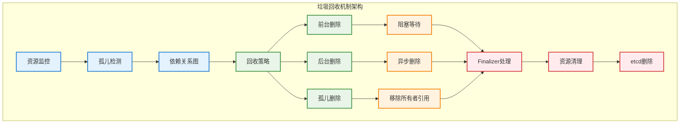

# 垃圾回收机制

## 概述

Kubernetes 的垃圾回收机制（Garbage Collection）负责自动清理集群中不再需要的资源，包括删除孤立的 Pod、回收未使用的资源以及级联删除相关联的对象。这个机制确保集群资源的高效利用和状态的一致性。

## 垃圾回收架构



## 所有者引用机制

### OwnerReference 结构

```go
// 所有者引用定义
type OwnerReference struct {
    APIVersion         string `json:"apiVersion"`
    Kind              string `json:"kind"`
    Name              string `json:"name"`
    UID               types.UID `json:"uid"`
    Controller        *bool `json:"controller,omitempty"`
    BlockOwnerDeletion *bool `json:"blockOwnerDeletion,omitempty"`
}

// 对象元数据中的所有者引用
type ObjectMeta struct {
    Name            string `json:"name,omitempty"`
    Namespace       string `json:"namespace,omitempty"`
    UID             types.UID `json:"uid,omitempty"`
    OwnerReferences []OwnerReference `json:"ownerReferences,omitempty"`
    Finalizers      []string `json:"finalizers,omitempty"`
    // ... 其他字段
}
```

### 所有者引用设置

```go
// 设置所有者引用的工具函数
func SetOwnerReference(owner, dependent metav1.Object, scheme *runtime.Scheme) error {
    ownerGVK, err := apiutil.GVKForObject(owner, scheme)
    if err != nil {
        return err
    }
    
    ownerRef := metav1.OwnerReference{
        APIVersion: ownerGVK.GroupVersion().String(),
        Kind:       ownerGVK.Kind,
        Name:       owner.GetName(),
        UID:        owner.GetUID(),
    }
    
    // 设置控制器引用
    controllerRef := true
    ownerRef.Controller = &controllerRef
    
    // 设置阻塞删除
    blockDeletion := true
    ownerRef.BlockOwnerDeletion = &blockDeletion
    
    // 添加到依赖对象的所有者引用列表
    ownerRefs := dependent.GetOwnerReferences()
    ownerRefs = append(ownerRefs, ownerRef)
    dependent.SetOwnerReferences(ownerRefs)
    
    return nil
}

// 创建控制器引用
func NewControllerRef(owner metav1.Object, gvk schema.GroupVersionKind) *metav1.OwnerReference {
    isController := true
    blockOwnerDeletion := true
    
    return &metav1.OwnerReference{
        APIVersion:         gvk.GroupVersion().String(),
        Kind:              gvk.Kind,
        Name:              owner.GetName(),
        UID:               owner.GetUID(),
        Controller:        &isController,
        BlockOwnerDeletion: &blockOwnerDeletion,
    }
}
```

## 垃圾收集器实现

### 核心垃圾收集器

```go
// 垃圾收集器主结构
type GarbageCollector struct {
    restMapper     meta.RESTMapper
    metadataClient metadata.Interface
    
    // 依赖关系图
    dependencyGraphBuilder *GraphBuilder
    
    // 删除处理器
    deletionWorkers int
    deletionQueue   workqueue.RateLimitingInterface
    
    // 监控器
    monitors    []monitor
    monitorLock sync.RWMutex
    
    // 停止信号
    stopCh <-chan struct{}
}

// 垃圾收集器接口
type GarbageCollectorInterface interface {
    Run(workers int, stopCh <-chan struct{})
    Sync(logger klog.Logger) error
}

func NewGarbageCollector(
    metadataClient metadata.Interface,
    mapper meta.RESTMapper,
    ignoredResources map[schema.GroupResource]struct{},
    sharedInformers controller.InformerFactory,
) (*GarbageCollector, error) {
    
    gc := &GarbageCollector{
        restMapper:     mapper,
        metadataClient: metadataClient,
        deletionQueue:  workqueue.NewNamedRateLimitingQueue(workqueue.DefaultControllerRateLimiter(), "garbage_collector_delete"),
        deletionWorkers: 5,
    }
    
    // 初始化依赖关系图构建器
    gc.dependencyGraphBuilder = NewDependencyGraphBuilder(
        metadataClient,
        mapper,
        ignoredResources,
        sharedInformers,
        gc,
    )
    
    return gc, nil
}

func (gc *GarbageCollector) Run(workers int, stopCh <-chan struct{}) {
    defer runtime.HandleCrash()
    defer gc.deletionQueue.ShutDown()
    
    klog.InfoS("Starting garbage collector")
    defer klog.InfoS("Shutting down garbage collector")
    
    gc.stopCh = stopCh
    
    // 启动依赖关系图构建器
    go gc.dependencyGraphBuilder.Run(stopCh)
    
    // 启动删除工作协程
    for i := 0; i < workers; i++ {
        go wait.Until(gc.runDeleteWorker, time.Second, stopCh)
    }
    
    // 启动监控协程
    go wait.Until(gc.runMonitor, 30*time.Second, stopCh)
    
    <-stopCh
}

func (gc *GarbageCollector) runDeleteWorker() {
    for gc.processNextDeleteItem() {
    }
}

func (gc *GarbageCollector) processNextDeleteItem() bool {
    item, quit := gc.deletionQueue.Get()
    if quit {
        return false
    }
    defer gc.deletionQueue.Done(item)
    
    action := item.(*deleteAction)
    err := gc.processDeleteAction(action)
    
    if err != nil {
        if !errors.IsNotFound(err) {
            klog.V(2).InfoS("Failed to delete item, requeuing", "item", action.identity, "error", err)
            gc.deletionQueue.AddRateLimited(item)
        }
    } else {
        gc.deletionQueue.Forget(item)
    }
    
    return true
}
```

### 依赖关系图构建

```go
// 依赖关系图构建器
type GraphBuilder struct {
    restMapper     meta.RESTMapper
    metadataClient metadata.Interface
    
    // 图存储
    uidToNode *uidToNode
    
    // 事件处理器
    eventQueue workqueue.RateLimitingInterface
    
    // 忽略的资源
    ignoredResources map[schema.GroupResource]struct{}
}

// 图节点结构
type node struct {
    identity objectReference
    
    // 依赖关系
    dependents map[*node]struct{}
    owners     map[*node]struct{}
    
    // 删除状态
    deletingDependents bool
    beingDeleted       bool
    
    // 虚拟节点（用于不存在的所有者）
    virtual bool
}

// 对象引用
type objectReference struct {
    OwnerReference metav1.OwnerReference
    Namespace      string
}

func (gb *GraphBuilder) addNode(obj *metav1.PartialObjectMetadata) {
    gb.uidToNode.Write(func(uidToNode map[types.UID]*node) {
        n := uidToNode[obj.UID]
        if n == nil {
            n = &node{
                identity: objectReference{
                    OwnerReference: metav1.OwnerReference{
                        APIVersion: obj.APIVersion,
                        Kind:       obj.Kind,
                        Name:       obj.Name,
                        UID:        obj.UID,
                    },
                    Namespace: obj.Namespace,
                },
                dependents: make(map[*node]struct{}),
                owners:     make(map[*node]struct{}),
            }
            uidToNode[obj.UID] = n
        }
        
        // 设置删除状态
        if obj.DeletionTimestamp != nil {
            n.beingDeleted = true
        }
        
        // 处理所有者引用
        for _, ownerRef := range obj.OwnerReferences {
            ownerNode := uidToNode[ownerRef.UID]
            if ownerNode == nil {
                // 创建虚拟所有者节点
                ownerNode = &node{
                    identity: objectReference{
                        OwnerReference: ownerRef,
                        Namespace:      obj.Namespace,
                    },
                    dependents: make(map[*node]struct{}),
                    owners:     make(map[*node]struct{}),
                    virtual:    true,
                }
                uidToNode[ownerRef.UID] = ownerNode
            }
            
            // 建立依赖关系
            n.owners[ownerNode] = struct{}{}
            ownerNode.dependents[n] = struct{}{}
        }
    })
}

func (gb *GraphBuilder) removeNode(uid types.UID) {
    gb.uidToNode.Write(func(uidToNode map[types.UID]*node) {
        n := uidToNode[uid]
        if n == nil {
            return
        }
        
        // 移除与其他节点的关系
        for dependent := range n.dependents {
            delete(dependent.owners, n)
        }
        
        for owner := range n.owners {
            delete(owner.dependents, n)
        }
        
        delete(uidToNode, uid)
    })
}
```

## 删除策略实现

### 前台删除（Foreground Deletion）

```go
// 前台删除实现
func (gc *GarbageCollector) processForegroundDeletion(
    item *metav1.PartialObjectMetadata,
    policy metav1.DeletionPropagation,
) error {
    
    klog.V(2).InfoS("Processing foreground deletion", "item", klog.KObj(item))
    
    // 1. 设置 deletingDependents finalizer
    if !hasFinalizer(item, metav1.FinalizerDeleteDependents) {
        return gc.addFinalizerToItem(item, metav1.FinalizerDeleteDependents)
    }
    
    // 2. 获取所有依赖对象
    dependents, err := gc.getDependents(item)
    if err != nil {
        return err
    }
    
    // 3. 删除所有依赖对象
    for _, dependent := range dependents {
        if !dependent.GetDeletionTimestamp().IsZero() {
            continue // 已经在删除中
        }
        
        if err := gc.deleteObject(dependent, &policy); err != nil {
            return err
        }
    }
    
    // 4. 检查是否所有依赖都已删除
    remainingDependents, err := gc.getDependents(item)
    if err != nil {
        return err
    }
    
    if len(remainingDependents) == 0 {
        // 5. 移除 finalizer，允许对象被删除
        return gc.removeFinalizerFromItem(item, metav1.FinalizerDeleteDependents)
    }
    
    klog.V(4).InfoS("Waiting for dependents to be deleted", 
        "item", klog.KObj(item), 
        "remaining", len(remainingDependents))
    
    return nil
}

func (gc *GarbageCollector) addFinalizerToItem(
    item *metav1.PartialObjectMetadata,
    finalizer string,
) error {
    
    // 构建补丁
    patch := map[string]interface{}{
        "metadata": map[string]interface{}{
            "finalizers": append(item.Finalizers, finalizer),
        },
    }
    
    patchBytes, err := json.Marshal(patch)
    if err != nil {
        return err
    }
    
    // 应用补丁
    gvr := schema.GroupVersionResource{
        Group:    item.GroupVersionKind().Group,
        Version:  item.GroupVersionKind().Version,
        Resource: gc.restMapper.ResourceFor(item.GroupVersionKind()).Resource,
    }
    
    _, err = gc.metadataClient.Resource(gvr).
        Namespace(item.Namespace).
        Patch(context.TODO(), item.Name, types.MergePatchType, patchBytes, metav1.PatchOptions{})
    
    return err
}
```

### 后台删除（Background Deletion）

```go
// 后台删除实现
func (gc *GarbageCollector) processBackgroundDeletion(
    item *metav1.PartialObjectMetadata,
) error {
    
    klog.V(2).InfoS("Processing background deletion", "item", klog.KObj(item))
    
    // 1. 获取所有依赖对象
    dependents, err := gc.getDependents(item)
    if err != nil {
        return err
    }
    
    // 2. 异步删除所有依赖对象
    backgroundPolicy := metav1.DeletePropagationBackground
    
    for _, dependent := range dependents {
        if !dependent.GetDeletionTimestamp().IsZero() {
            continue // 已经在删除中
        }
        
        // 将删除操作加入队列，异步处理
        deleteAction := &deleteAction{
            identity: objectReference{
                OwnerReference: metav1.OwnerReference{
                    APIVersion: dependent.APIVersion,
                    Kind:       dependent.Kind,
                    Name:       dependent.Name,
                    UID:        dependent.UID,
                },
                Namespace: dependent.Namespace,
            },
            policy: &backgroundPolicy,
        }
        
        gc.deletionQueue.Add(deleteAction)
    }
    
    return nil
}

// 删除操作结构
type deleteAction struct {
    identity objectReference
    policy   *metav1.DeletionPropagation
}

func (gc *GarbageCollector) processDeleteAction(action *deleteAction) error {
    item, err := gc.getObject(action.identity)
    if err != nil {
        if errors.IsNotFound(err) {
            return nil // 对象已删除
        }
        return err
    }
    
    return gc.deleteObject(item, action.policy)
}

func (gc *GarbageCollector) deleteObject(
    item *metav1.PartialObjectMetadata,
    policy *metav1.DeletionPropagation,
) error {
    
    deleteOptions := metav1.DeleteOptions{}
    if policy != nil {
        deleteOptions.PropagationPolicy = policy
    }
    
    gvr := schema.GroupVersionResource{
        Group:    item.GroupVersionKind().Group,
        Version:  item.GroupVersionKind().Version,
        Resource: gc.restMapper.ResourceFor(item.GroupVersionKind()).Resource,
    }
    
    err := gc.metadataClient.Resource(gvr).
        Namespace(item.Namespace).
        Delete(context.TODO(), item.Name, deleteOptions)
    
    if errors.IsNotFound(err) {
        return nil
    }
    
    return err
}
```

### 孤儿删除（Orphan Deletion）

```go
// 孤儿删除实现
func (gc *GarbageCollector) processOrphanDeletion(
    item *metav1.PartialObjectMetadata,
) error {
    
    klog.V(2).InfoS("Processing orphan deletion", "item", klog.KObj(item))
    
    // 1. 获取所有依赖对象
    dependents, err := gc.getDependents(item)
    if err != nil {
        return err
    }
    
    // 2. 移除依赖对象的所有者引用
    for _, dependent := range dependents {
        if err := gc.removeOwnerReference(dependent, item); err != nil {
            return err
        }
    }
    
    return nil
}

func (gc *GarbageCollector) removeOwnerReference(
    dependent *metav1.PartialObjectMetadata,
    owner *metav1.PartialObjectMetadata,
) error {
    
    // 查找并移除所有者引用
    var newOwnerRefs []metav1.OwnerReference
    for _, ownerRef := range dependent.OwnerReferences {
        if ownerRef.UID != owner.UID {
            newOwnerRefs = append(newOwnerRefs, ownerRef)
        }
    }
    
    // 如果没有变化，跳过更新
    if len(newOwnerRefs) == len(dependent.OwnerReferences) {
        return nil
    }
    
    // 构建补丁
    patch := map[string]interface{}{
        "metadata": map[string]interface{}{
            "ownerReferences": newOwnerRefs,
        },
    }
    
    patchBytes, err := json.Marshal(patch)
    if err != nil {
        return err
    }
    
    // 应用补丁
    gvr := schema.GroupVersionResource{
        Group:    dependent.GroupVersionKind().Group,
        Version:  dependent.GroupVersionKind().Version,
        Resource: gc.restMapper.ResourceFor(dependent.GroupVersionKind()).Resource,
    }
    
    _, err = gc.metadataClient.Resource(gvr).
        Namespace(dependent.Namespace).
        Patch(context.TODO(), dependent.Name, types.MergePatchType, patchBytes, metav1.PatchOptions{})
    
    return err
}
```

## Finalizer 机制

### Finalizer 处理

```go
// Finalizer 管理器
type FinalizerManager struct {
    client client.Client
    logger klog.Logger
}

// 添加 Finalizer
func (fm *FinalizerManager) AddFinalizer(
    ctx context.Context,
    obj client.Object,
    finalizer string,
) error {
    
    if controllerutil.ContainsFinalizer(obj, finalizer) {
        return nil // 已经存在
    }
    
    controllerutil.AddFinalizer(obj, finalizer)
    
    err := fm.client.Update(ctx, obj)
    if err != nil {
        fm.logger.Error(err, "Failed to add finalizer", 
            "object", klog.KObj(obj), 
            "finalizer", finalizer)
        return err
    }
    
    fm.logger.V(4).Info("Added finalizer", 
        "object", klog.KObj(obj), 
        "finalizer", finalizer)
    
    return nil
}

// 移除 Finalizer
func (fm *FinalizerManager) RemoveFinalizer(
    ctx context.Context,
    obj client.Object,
    finalizer string,
) error {
    
    if !controllerutil.ContainsFinalizer(obj, finalizer) {
        return nil // 不存在
    }
    
    controllerutil.RemoveFinalizer(obj, finalizer)
    
    err := fm.client.Update(ctx, obj)
    if err != nil {
        fm.logger.Error(err, "Failed to remove finalizer", 
            "object", klog.KObj(obj), 
            "finalizer", finalizer)
        return err
    }
    
    fm.logger.V(4).Info("Removed finalizer", 
        "object", klog.KObj(obj), 
        "finalizer", finalizer)
    
    return nil
}

// 处理 Finalizer 清理逻辑
func (fm *FinalizerManager) HandleFinalizerCleanup(
    ctx context.Context,
    obj client.Object,
    finalizer string,
    cleanupFunc func(context.Context, client.Object) error,
) error {
    
    if !obj.GetDeletionTimestamp().IsZero() && 
       controllerutil.ContainsFinalizer(obj, finalizer) {
        
        // 执行清理逻辑
        if err := cleanupFunc(ctx, obj); err != nil {
            return err
        }
        
        // 移除 Finalizer
        return fm.RemoveFinalizer(ctx, obj, finalizer)
    }
    
    return nil
}
```

### 自定义 Finalizer 示例

```go
// 自定义控制器中的 Finalizer 使用
type MyResourceController struct {
    client.Client
    finalizerManager *FinalizerManager
}

const MyResourceFinalizer = "myresource.example.com/finalizer"

func (r *MyResourceController) Reconcile(ctx context.Context, req ctrl.Request) (ctrl.Result, error) {
    var myResource MyResource
    if err := r.Get(ctx, req.NamespacedName, &myResource); err != nil {
        return ctrl.Result{}, client.IgnoreNotFound(err)
    }
    
    // 处理删除逻辑
    if !myResource.GetDeletionTimestamp().IsZero() {
        return r.handleDeletion(ctx, &myResource)
    }
    
    // 添加 Finalizer（如果不存在）
    if err := r.finalizerManager.AddFinalizer(ctx, &myResource, MyResourceFinalizer); err != nil {
        return ctrl.Result{}, err
    }
    
    // 正常的协调逻辑
    return r.reconcileNormal(ctx, &myResource)
}

func (r *MyResourceController) handleDeletion(ctx context.Context, myResource *MyResource) (ctrl.Result, error) {
    return ctrl.Result{}, r.finalizerManager.HandleFinalizerCleanup(
        ctx,
        myResource,
        MyResourceFinalizer,
        r.cleanup,
    )
}

func (r *MyResourceController) cleanup(ctx context.Context, obj client.Object) error {
    myResource := obj.(*MyResource)
    
    // 执行清理逻辑，例如：
    // 1. 清理外部资源
    // 2. 删除相关的子资源
    // 3. 通知外部系统
    
    log.Info("Cleaning up MyResource", "name", myResource.Name)
    
    // 删除相关的 ConfigMap
    configMap := &corev1.ConfigMap{}
    if err := r.Get(ctx, types.NamespacedName{
        Name:      myResource.Name + "-config",
        Namespace: myResource.Namespace,
    }, configMap); err == nil {
        if err := r.Delete(ctx, configMap); err != nil {
            return err
        }
    }
    
    return nil
}
```

## 性能优化

### 批量处理

```go
// 批量垃圾回收处理器
type BatchGarbageCollector struct {
    *GarbageCollector
    
    batchSize    int
    batchTimeout time.Duration
    batchQueue   chan *deleteAction
}

func (bgc *BatchGarbageCollector) processBatchDeletion() {
    batch := make([]*deleteAction, 0, bgc.batchSize)
    timer := time.NewTimer(bgc.batchTimeout)
    defer timer.Stop()
    
    for {
        select {
        case action := <-bgc.batchQueue:
            batch = append(batch, action)
            
            if len(batch) >= bgc.batchSize {
                bgc.executeBatch(batch)
                batch = batch[:0]
                timer.Reset(bgc.batchTimeout)
            }
            
        case <-timer.C:
            if len(batch) > 0 {
                bgc.executeBatch(batch)
                batch = batch[:0]
            }
            timer.Reset(bgc.batchTimeout)
            
        case <-bgc.stopCh:
            return
        }
    }
}

func (bgc *BatchGarbageCollector) executeBatch(batch []*deleteAction) {
    // 按资源类型和命名空间分组
    groups := bgc.groupByResource(batch)
    
    for gvr, actions := range groups {
        go bgc.deleteBatchForResource(gvr, actions)
    }
}

func (bgc *BatchGarbageCollector) groupByResource(batch []*deleteAction) map[schema.GroupVersionResource][]*deleteAction {
    groups := make(map[schema.GroupVersionResource][]*deleteAction)
    
    for _, action := range batch {
        gvr := schema.GroupVersionResource{
            Group:    action.identity.OwnerReference.APIVersion,
            Version:  "", // 从 APIVersion 中提取
            Resource: "", // 需要从 RESTMapper 获取
        }
        
        groups[gvr] = append(groups[gvr], action)
    }
    
    return groups
}
```

### 缓存优化

```go
// 带缓存的垃圾收集器
type CachedGarbageCollector struct {
    *GarbageCollector
    
    dependencyCache *lru.Cache
    orphanCache     *lru.Cache
}

func (cgc *CachedGarbageCollector) getDependentsWithCache(
    owner *metav1.PartialObjectMetadata,
) ([]*metav1.PartialObjectMetadata, error) {
    
    cacheKey := string(owner.UID)
    
    // 检查缓存
    if cached, ok := cgc.dependencyCache.Get(cacheKey); ok {
        if entry, ok := cached.(*DependencyEntry); ok {
            if time.Since(entry.Timestamp) < 30*time.Second {
                return entry.Dependents, nil
            }
        }
    }
    
    // 从 API 获取
    dependents, err := cgc.getDependents(owner)
    if err != nil {
        return nil, err
    }
    
    // 更新缓存
    cgc.dependencyCache.Add(cacheKey, &DependencyEntry{
        Dependents: dependents,
        Timestamp:  time.Now(),
    })
    
    return dependents, nil
}

type DependencyEntry struct {
    Dependents []*metav1.PartialObjectMetadata
    Timestamp  time.Time
}
```

## 监控和调试

### 垃圾回收指标

```go
// 垃圾回收监控指标
var (
    gcDuration = prometheus.NewHistogramVec(
        prometheus.HistogramOpts{
            Name: "garbage_collector_duration_seconds",
            Help: "Time taken to process garbage collection",
        },
        []string{"operation"},
    )
    
    gcObjectsTotal = prometheus.NewCounterVec(
        prometheus.CounterOpts{
            Name: "garbage_collector_objects_total",
            Help: "Total number of objects processed by garbage collector",
        },
        []string{"operation", "result"},
    )
    
    gcOrphansFound = prometheus.NewGaugeVec(
        prometheus.GaugeOpts{
            Name: "garbage_collector_orphans_found",
            Help: "Number of orphaned objects found",
        },
        []string{"resource"},
    )
)

func recordGCMetrics(operation, result string, duration time.Duration, count int) {
    gcDuration.WithLabelValues(operation).Observe(duration.Seconds())
    gcObjectsTotal.WithLabelValues(operation, result).Add(float64(count))
}
```

### 调试工具

```go
// 垃圾回收调试器
type GCDebugger struct {
    gc     *GarbageCollector
    logger klog.Logger
}

func (gcd *GCDebugger) DumpDependencyGraph() string {
    var output strings.Builder
    
    gcd.gc.dependencyGraphBuilder.uidToNode.Read(func(uidToNode map[types.UID]*node) {
        output.WriteString("Dependency Graph:\n")
        
        for uid, node := range uidToNode {
            output.WriteString(fmt.Sprintf("Node: %s (%s)\n", uid, node.identity.OwnerReference.Name))
            output.WriteString(fmt.Sprintf("  Virtual: %v\n", node.virtual))
            output.WriteString(fmt.Sprintf("  Being Deleted: %v\n", node.beingDeleted))
            output.WriteString(fmt.Sprintf("  Deleting Dependents: %v\n", node.deletingDependents))
            
            if len(node.owners) > 0 {
                output.WriteString("  Owners:\n")
                for owner := range node.owners {
                    output.WriteString(fmt.Sprintf("    %s\n", owner.identity.OwnerReference.Name))
                }
            }
            
            if len(node.dependents) > 0 {
                output.WriteString("  Dependents:\n")
                for dependent := range node.dependents {
                    output.WriteString(fmt.Sprintf("    %s\n", dependent.identity.OwnerReference.Name))
                }
            }
            
            output.WriteString("\n")
        }
    })
    
    return output.String()
}

func (gcd *GCDebugger) AnalyzeOrphans() map[string][]string {
    orphans := make(map[string][]string)
    
    gcd.gc.dependencyGraphBuilder.uidToNode.Read(func(uidToNode map[types.UID]*node) {
        for _, node := range uidToNode {
            if len(node.owners) == 0 && !node.virtual {
                kind := node.identity.OwnerReference.Kind
                orphans[kind] = append(orphans[kind], node.identity.OwnerReference.Name)
            }
        }
    })
    
    return orphans
}
```

## 最佳实践

### 设计原则

1. **正确设置所有者引用**：
   - 确保子资源有正确的 OwnerReference
   - 使用 Controller 字段标识控制器
   - 合理使用 BlockOwnerDeletion

2. **Finalizer 使用**：
   - 只在需要清理外部资源时使用
   - 确保 Finalizer 逻辑是幂等的
   - 避免 Finalizer 死锁

3. **删除策略选择**：
   - 前台删除：需要确保依赖完全清理
   - 后台删除：快速响应，异步清理
   - 孤儿删除：保留依赖对象

### 性能优化建议

1. **批量操作**：
   - 使用批量删除减少 API 调用
   - 合理设置批量大小和超时

2. **缓存使用**：
   - 缓存依赖关系查询结果
   - 设置合适的缓存TTL

3. **监控优化**：
   - 监控垃圾回收性能指标
   - 设置合适的告警阈值

### 故障排查

1. **常见问题诊断**：
   ```bash
   # 检查对象的所有者引用
   kubectl get <resource> <name> -o yaml | grep -A 10 ownerReferences
   
   # 检查 Finalizer
   kubectl get <resource> <name> -o yaml | grep -A 5 finalizers
   
   # 查看垃圾回收器日志
   kubectl logs -n kube-system deployment/kube-controller-manager | grep garbage
   ```

2. **删除卡住处理**：
   - 检查 Finalizer 是否正常处理
   - 验证控制器是否正常运行
   - 检查依赖对象的删除状态
   - 必要时手动移除 Finalizer
