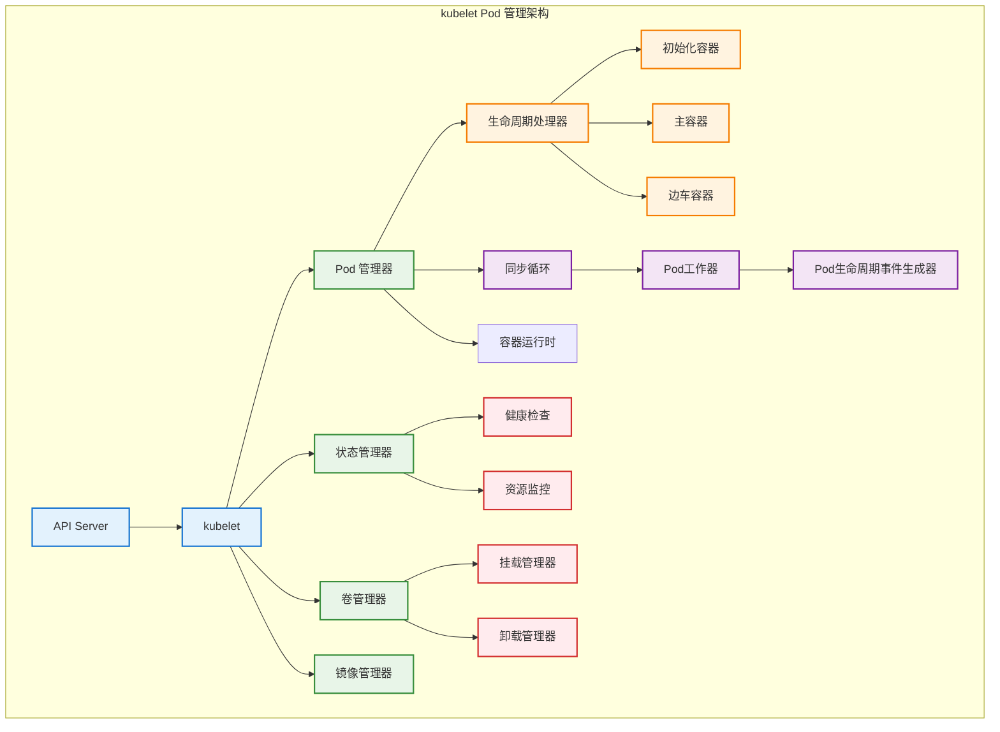

# kubelet Pod 管理

## 概述

kubelet 是 Kubernetes 集群中每个节点上运行的主要代理程序，负责管理节点上 Pod 的完整生命周期。它通过与容器运行时交互，实现 Pod 的创建、启动、监控、更新和删除，确保 Pod 的实际状态与期望状态保持一致。

## kubelet 架构



## Pod 生命周期管理

### Pod 同步循环

```go
// kubelet 主控制器
type Kubelet struct {
    // 核心组件
    podManager        PodManager
    statusManager     StatusManager
    volumeManager     VolumeManager
    imageManager      ImageManager
    containerRuntime  Runtime
    
    // 同步机制
    syncLoopMonitor   monitor.Monitor
    pleg             PodLifecycleEventGenerator
    podWorkers       PodWorkers
    
    // 配置和状态
    nodeName         string
    nodeStatus       NodeStatus
    kubeletConfig    *kubeletconfig.KubeletConfiguration
    
    // 工作队列
    workQueue        workqueue.DelayingInterface
    podKiller        PodKiller
}

func (kl *Kubelet) Run(updates <-chan PodUpdate) {
    klog.InfoS("Starting kubelet main sync loop")
    
    // 启动各个管理器
    go kl.volumeManager.Run(kl.sourcesReady, wait.NeverStop)
    go kl.statusManager.Start()
    go kl.pleg.Start()
    
    // 启动同步循环
    kl.syncLoop(updates, kl)
}

func (kl *Kubelet) syncLoop(updates <-chan PodUpdate, handler SyncHandler) {
    klog.InfoS("Starting kubelet sync loop")
    
    syncTicker := time.NewTicker(time.Second)
    defer syncTicker.Stop()
    
    housekeepingTicker := time.NewTicker(time.Second * 2)
    defer housekeepingTicker.Stop()
    
    plegCh := kl.pleg.Watch()
    
    for {
        select {
        case update := <-updates:
            // 处理 Pod 更新
            handler.HandlePodAdditions(update.Pods)
            
        case e := <-plegCh:
            // 处理 Pod 生命周期事件
            if isSyncPodWorthy(e) {
                handler.HandlePodSyncs([]*v1.Pod{e.Data.(*v1.Pod)})
            }
            
        case <-syncTicker.C:
            // 定期同步所有 Pod
            handler.HandlePodSyncs(kl.podManager.GetPods())
            
        case <-housekeepingTicker.C:
            // 清理工作
            handler.HandlePodCleanups()
        }
    }
}

// Pod 同步处理器
func (kl *Kubelet) HandlePodAdditions(pods []*v1.Pod) {
    start := kl.clock.Now()
    sort.Sort(sliceutils.PodsByCreationTime(pods))
    
    for _, pod := range pods {
        existingPods := kl.podManager.GetPods()
        
        // 添加到 Pod 管理器
        kl.podManager.AddPod(pod)
        
        // 检查是否为镜像 Pod
        if kubetypes.IsMirrorPod(pod) {
            kl.handleMirrorPod(pod, start)
            continue
        }
        
        // 检查是否为静态 Pod
        if kubetypes.IsStaticPod(pod) {
            kl.handleStaticPod(pod, start)
            continue
        }
        
        // 普通 Pod 处理
        kl.dispatchWork(pod, kubetypes.SyncPodCreate, mirrorPod, start)
    }
}
```

### Pod Worker 实现

```go
// Pod 工作器管理
type PodWorkers interface {
    UpdatePod(options *UpdatePodOptions)
    ForgetNonExistingPodWorkers(desiredPods map[types.UID]empty.Empty)
    ForgetWorker(uid types.UID)
}

type podWorkers struct {
    // 同步锁
    podLock sync.Mutex
    
    // Pod 工作器映射
    podUpdates map[types.UID]chan UpdatePodOptions
    
    // 工作状态
    isWorking map[types.UID]bool
    
    // 最后已知的 Pod 状态
    lastUndeliveredWorkUpdate map[types.UID]UpdatePodOptions
    
    // 同步处理函数
    podSyncHandler SyncPodFn
}

type UpdatePodOptions struct {
    Pod        *v1.Pod
    MirrorPod  *v1.Pod
    UpdateType kubetypes.SyncPodType
    OnCompleteFunc []func()
    StartTime time.Time
}

func (p *podWorkers) UpdatePod(options *UpdatePodOptions) {
    pod := options.Pod
    uid := pod.UID
    
    p.podLock.Lock()
    defer p.podLock.Unlock()
    
    // 获取或创建 Pod 工作器
    podUpdates, exists := p.podUpdates[uid]
    if !exists {
        podUpdates = make(chan UpdatePodOptions, 1)
        p.podUpdates[uid] = podUpdates
        
        // 启动 Pod 工作器协程
        go func() {
            defer runtime.HandleCrash()
            p.managePodLoop(podUpdates)
        }()
    }
    
    // 发送更新请求
    if !p.isWorking[uid] {
        p.isWorking[uid] = true
        podUpdates <- *options
    } else {
        // 如果正在工作，保存最新的更新
        p.lastUndeliveredWorkUpdate[uid] = *options
    }
}

func (p *podWorkers) managePodLoop(podUpdates <-chan UpdatePodOptions) {
    for update := range podUpdates {
        err := func() error {
            // 执行 Pod 同步
            return p.podSyncHandler(update.Pod, update.MirrorPod, update.UpdateType)
        }()
        
        // 执行完成回调
        for _, onCompleteFunc := range update.OnCompleteFunc {
            onCompleteFunc()
        }
        
        p.wrapUp(update.Pod.UID, err)
    }
}

func (p *podWorkers) wrapUp(uid types.UID, syncErr error) {
    p.podLock.Lock()
    defer p.podLock.Unlock()
    
    // 检查是否有待处理的更新
    if lastUpdate, exists := p.lastUndeliveredWorkUpdate[uid]; exists {
        delete(p.lastUndeliveredWorkUpdate, uid)
        p.podUpdates[uid] <- lastUpdate
    } else {
        p.isWorking[uid] = false
    }
}
```

### Pod 同步核心逻辑

```go
// Pod 同步函数
func (kl *Kubelet) SyncPod(pod *v1.Pod, mirrorPod *v1.Pod, podStatus *kubecontainer.PodStatus, updateType kubetypes.SyncPodType) error {
    start := time.Now()
    defer func() {
        metrics.PodSyncDuration.Observe(metrics.SinceInSeconds(start))
    }()
    
    // 1. 如果 Pod 正在被删除，进行清理
    if pod.DeletionTimestamp != nil {
        return kl.killPod(pod, nil, podStatus, nil)
    }
    
    // 2. 检查 Pod 是否可以在此节点上运行
    if err := canRunPod(pod); err != nil {
        kl.rejectPod(pod, err.Error())
        return err
    }
    
    // 3. 创建 Pod 目录
    if err := kl.makePodDataDirs(pod); err != nil {
        kl.recorder.Eventf(pod, v1.EventTypeWarning, events.FailedToMakePodDataDirectories, "error making pod data directories: %v", err)
        return err
    }
    
    // 4. 等待卷挂载
    if !kl.podIsTerminated(pod) {
        if err := kl.volumeManager.WaitForAttachAndMount(pod); err != nil {
            kl.recorder.Eventf(pod, v1.EventTypeWarning, events.FailedMountVolume, "Unable to attach or mount volumes: %v", err)
            return err
        }
    }
    
    // 5. 获取 pull secrets
    pullSecrets, err := kl.getPullSecretsForPod(pod)
    if err != nil {
        kl.recorder.Eventf(pod, v1.EventTypeWarning, events.FailedToGetPullSecrets, "Unable to get pull secrets: %v", err)
        return err
    }
    
    // 6. 调用容器运行时同步 Pod
    result := kl.containerRuntime.SyncPod(pod, podStatus, pullSecrets, kl.backOff)
    kl.reasonCache.Update(pod.UID, result)
    
    if err := result.Error(); err != nil {
        for _, r := range result.SyncResults {
            if r.Error != kubecontainer.ErrCrashLoopBackOff && r.Error != images.ErrImagePullBackOff {
                kl.recorder.Eventf(pod, v1.EventTypeWarning, events.FailedSync, "Error syncing pod: %v", r.Error)
            }
        }
        return err
    }
    
    return nil
}

// 容器运行时 Pod 同步
func (m *kubeGenericRuntimeManager) SyncPod(pod *v1.Pod, podStatus *kubecontainer.PodStatus, pullSecrets []v1.Secret, backOff *flowcontrol.Backoff) PodSyncResult {
    result := PodSyncResult{}
    
    // 1. 计算沙箱和容器的变化
    podContainerChanges := m.computePodActions(pod, podStatus)
    klog.V(3).InfoS("computePodActions got for pod", "podActions", podContainerChanges, "pod", klog.KObj(pod))
    
    if podContainerChanges.CreateSandbox {
        ref, err := ref.GetReference(legacyscheme.Scheme, pod)
        if err != nil {
            klog.ErrorS(err, "Couldn't make a ref to pod", "pod", klog.KObj(pod))
        }
        
        if podContainerChanges.SandboxID != "" {
            m.recorder.Eventf(ref, v1.EventTypeNormal, events.SandboxChanged, "Pod sandbox changed, it will be killed and re-created.")
        } else {
            klog.V(4).InfoS("SyncPod received new pod, will create a sandbox for it", "pod", klog.KObj(pod))
        }
    }
    
    // 2. 终止不需要的 Pod 沙箱
    if podContainerChanges.KillPod {
        if podContainerChanges.CreateSandbox {
            klog.V(4).InfoS("Stopping PodSandbox for pod, will start new one", "pod", klog.KObj(pod))
        } else {
            klog.V(4).InfoS("Stopping PodSandbox for pod, because all other containers are dead", "pod", klog.KObj(pod))
        }
        
        killResult := m.killPodWithSyncResult(pod, kubecontainer.ConvertPodStatusToRunningPod(m.runtimeName, podStatus), nil)
        result.AddPodSyncResult(killResult)
        if killResult.Error() != nil {
            klog.ErrorS(killResult.Error(), "killPodWithSyncResult failed")
            return result
        }
        
        if podContainerChanges.CreateSandbox {
            m.purgeInitContainers(pod, podStatus)
        }
    } else {
        // 3. 终止不需要的容器
        for containerID, containerInfo := range podContainerChanges.ContainersToKill {
            klog.V(3).InfoS("Killing unwanted container for pod", "containerName", containerInfo.name, "containerID", containerID, "pod", klog.KObj(pod))
            killContainerResult := kubecontainer.NewSyncResult(kubecontainer.KillContainer, containerInfo.name)
            result.AddSyncResult(killContainerResult)
            if err := m.killContainer(pod, containerID, containerInfo.name, containerInfo.message, nil); err != nil {
                killContainerResult.Fail(kubecontainer.ErrKillContainer, err.Error())
                klog.ErrorS(err, "killContainer for pod failed", "containerName", containerInfo.name, "containerID", containerID, "pod", klog.KObj(pod))
                return result
            }
        }
    }
    
    // 4. 创建沙箱
    if podContainerChanges.CreateSandbox {
        createSandboxResult := kubecontainer.NewSyncResult(kubecontainer.CreatePodSandbox, "")
        result.AddSyncResult(createSandboxResult)
        
        podSandboxID, msg, err := m.createPodSandbox(pod, podContainerChanges.Attempt)
        if err != nil {
            createSandboxResult.Fail(kubecontainer.ErrCreatePodSandbox, msg)
            klog.ErrorS(err, "createPodSandbox for pod failed", "pod", klog.KObj(pod))
            ref, referr := ref.GetReference(legacyscheme.Scheme, pod)
            if referr != nil {
                klog.ErrorS(referr, "Couldn't make a ref to pod", "pod", klog.KObj(pod))
            }
            m.recorder.Eventf(ref, v1.EventTypeWarning, events.FailedCreatePodSandBox, "Failed to create pod sandbox: %v", err)
            return result
        }
        
        klog.V(4).InfoS("Created PodSandbox for pod", "podSandboxID", podSandboxID, "pod", klog.KObj(pod))
        podContainerChanges.SandboxID = podSandboxID
    }
    
    // 5. 启动初始化容器
    if container := podContainerChanges.NextInitContainerToStart; container != nil {
        if err := m.startContainer(podSandboxID, podSandboxConfig, container, pod, podStatus, pullSecrets, podIP, kubecontainer.ContainerTypeInit); err != nil {
            startContainerResult.Fail(err, msg)
            utilruntime.HandleError(fmt.Errorf("init container start failed: %v: %s", err, msg))
            return result
        }
        
        klog.V(4).InfoS("Completed init container for pod", "containerName", container.Name, "pod", klog.KObj(pod))
    }
    
    // 6. 启动主容器
    for _, idx := range podContainerChanges.ContainersToStart {
        start("container", metrics.StartContainer)
        container := &pod.Spec.Containers[idx]
        startContainerResult := kubecontainer.NewSyncResult(kubecontainer.StartContainer, container.Name)
        result.AddSyncResult(startContainerResult)
        
        isInBackOff, msg, err := m.doBackOff(pod, container, podStatus, backOff)
        if isInBackOff {
            startContainerResult.Fail(err, msg)
            klog.V(4).InfoS("Backing Off restarting container in pod", "containerName", container.Name, "pod", klog.KObj(pod))
            continue
        }
        
        if err := m.startContainer(podSandboxID, podSandboxConfig, container, pod, podStatus, pullSecrets, podIP, kubecontainer.ContainerTypeRegular); err != nil {
            startContainerResult.Fail(err, msg)
            utilruntime.HandleError(fmt.Errorf("container start failed: %v: %s", err, msg))
            continue
        }
    }
    
    return result
}
```

## 容器生命周期管理

### 初始化容器处理

```go
// 初始化容器管理器
type InitContainerManager struct {
    runtime  Runtime
    recorder record.EventRecorder
}

func (m *InitContainerManager) SyncInitContainers(pod *v1.Pod, podStatus *kubecontainer.PodStatus) error {
    if len(pod.Spec.InitContainers) == 0 {
        return nil
    }
    
    // 查找下一个要启动的初始化容器
    initContainerStatuses := podStatus.FindContainerStatusesByType(kubecontainer.ContainerTypeInit)
    
    for i, container := range pod.Spec.InitContainers {
        containerStatus := getContainerStatus(initContainerStatuses, container.Name)
        
        switch {
        case containerStatus == nil:
            // 容器尚未创建，需要启动
            klog.V(4).InfoS("Creating init container", "containerName", container.Name, "pod", klog.KObj(pod))
            if err := m.startInitContainer(pod, &container, podStatus); err != nil {
                return fmt.Errorf("failed to start init container %q: %v", container.Name, err)
            }
            
            // 启动后等待完成
            return fmt.Errorf("init container %q is still running", container.Name)
            
        case containerStatus.State == kubecontainer.ContainerStateRunning:
            // 容器正在运行，等待完成
            return fmt.Errorf("init container %q is still running", container.Name)
            
        case containerStatus.State == kubecontainer.ContainerStateExited:
            // 检查退出状态
            if containerStatus.ExitCode != 0 {
                return fmt.Errorf("init container %q exited with code %d", container.Name, containerStatus.ExitCode)
            }
            
            // 成功完成，继续下一个
            klog.V(4).InfoS("Init container finished", "containerName", container.Name, "pod", klog.KObj(pod))
            continue
            
        default:
            return fmt.Errorf("init container %q is in unexpected state %v", container.Name, containerStatus.State)
        }
    }
    
    // 所有初始化容器都已成功完成
    return nil
}

func (m *InitContainerManager) startInitContainer(pod *v1.Pod, container *v1.Container, podStatus *kubecontainer.PodStatus) error {
    ref, err := kubecontainer.GenerateContainerRef(pod, container)
    if err != nil {
        klog.ErrorS(err, "Can't make a ref to init container", "containerName", container.Name, "pod", klog.KObj(pod))
    }
    
    if msg, err := m.runtime.StartContainer(pod, container, ref); err != nil {
        m.recorder.Eventf(ref, v1.EventTypeWarning, events.FailedToStartContainer,
            "Failed to start init container %q: %v", container.Name, err)
        return err
    }
    
    m.recorder.Eventf(ref, v1.EventTypeNormal, events.StartedContainer,
        "Started init container %q", container.Name)
    return nil
}
```

### 健康检查机制

```go
// 健康检查管理器
type ProbeManager interface {
    AddPod(pod *v1.Pod)
    RemovePod(pod *v1.Pod)
    CleanupPods(desiredPods map[types.UID]empty.Empty)
    UpdatePodStatus(types.UID, *v1.PodStatus)
}

type manager struct {
    // 探针工作器
    workers map[probeKey]*worker
    
    // 同步锁
    workerLock sync.RWMutex
    
    // 状态管理
    statusManager status.Manager
    
    // 探针执行器
    livenessManager  results.Manager
    readinessManager results.Manager
    startupManager   results.Manager
    
    // 运行时接口
    runner           kubecontainer.CommandRunner
    refManager       *kubecontainer.RefManager
    recorder         record.EventRecorder
}

type probeKey struct {
    podUID        types.UID
    containerName string
    probeType     probeType
}

type probeType int

const (
    liveness probeType = iota
    readiness
    startup
)

func (m *manager) AddPod(pod *v1.Pod) {
    m.workerLock.Lock()
    defer m.workerLock.Unlock()
    
    key := probeKey{podUID: pod.UID}
    for _, c := range pod.Spec.Containers {
        key.containerName = c.Name
        
        if c.LivenessProbe != nil {
            key.probeType = liveness
            if _, ok := m.workers[key]; !ok {
                w := newWorker(m, liveness, pod, c)
                m.workers[key] = w
                go w.run()
            }
        }
        
        if c.ReadinessProbe != nil {
            key.probeType = readiness
            if _, ok := m.workers[key]; !ok {
                w := newWorker(m, readiness, pod, c)
                m.workers[key] = w
                go w.run()
            }
        }
        
        if c.StartupProbe != nil {
            key.probeType = startup
            if _, ok := m.workers[key]; !ok {
                w := newWorker(m, startup, pod, c)
                m.workers[key] = w
                go w.run()
            }
        }
    }
}

// 探针工作器
type worker struct {
    // 停止通道
    stopCh chan struct{}
    
    // 探针配置
    pod       *v1.Pod
    container v1.Container
    probeType probeType
    probe     *v1.Probe
    
    // 结果管理
    resultsManager results.Manager
    probeManager   *manager
    
    // 状态
    lastResult probe.Result
    resultRun  int
}

func (w *worker) run() {
    probeTickerPeriod := time.Duration(w.probe.PeriodSeconds) * time.Second
    probeTicker := time.NewTicker(probeTickerPeriod)
    defer probeTicker.Stop()
    
    for w.doProbe() {
        select {
        case <-w.stopCh:
            return
        case <-probeTicker.C:
            // 继续探测
        }
    }
}

func (w *worker) doProbe() (keepGoing bool) {
    defer func() { recover() }()
    
    status, ok := w.probeManager.statusManager.GetPodStatus(w.pod.UID)
    if !ok {
        klog.V(3).InfoS("No status for pod", "pod", klog.KObj(w.pod))
        return true
    }
    
    // 查找容器状态
    c, ok := podutil.GetContainerStatus(status.ContainerStatuses, w.container.Name)
    if !ok || len(c.ContainerID) == 0 {
        klog.V(3).InfoS("Probe target container not found", "pod", klog.KObj(w.pod), "containerName", w.container.Name)
        return true
    }
    
    if c.State.Running == nil {
        klog.V(3).InfoS("Non-running container probed", "pod", klog.KObj(w.pod), "containerName", w.container.Name)
        if !w.containerRestarting(status) {
            w.resultsManager.Set(kubecontainer.ParseContainerID(c.ContainerID), results.Failure, w.pod)
        }
        return true
    }
    
    // 执行实际探测
    result, err := w.probeManager.prober.probe(w.probeType, w.pod, status, w.container, c.ContainerID)
    if err != nil {
        klog.V(1).ErrorS(err, "Probe errored", "probeType", w.probeType, "pod", klog.KObj(w.pod), "containerName", w.container.Name)
        w.resultsManager.Set(kubecontainer.ParseContainerID(c.ContainerID), results.Failure, w.pod)
        return true
    }
    
    switch result {
    case probe.Success:
        ProberResults.With(w.proberResultsSuccessfulMetricLabels).Inc()
    case probe.Warning:
        ProberResults.With(w.proberResultsUnknownMetricLabels).Inc()
    default:
        ProberResults.With(w.proberResultsFailedMetricLabels).Inc()
    }
    
    if w.lastResult == result {
        w.resultRun++
    } else {
        w.lastResult = result
        w.resultRun = 1
    }
    
    if (result == probe.Failure && w.resultRun < int(w.probe.FailureThreshold)) ||
        (result == probe.Success && w.resultRun < int(w.probe.SuccessThreshold)) {
        return true
    }
    
    w.resultsManager.Set(kubecontainer.ParseContainerID(c.ContainerID), results.Result(result), w.pod)
    
    if w.probeType == liveness && result == probe.Failure {
        // 存活性探测失败，需要重启容器
        klog.V(1).InfoS("Liveness probe failed, restarting container", "pod", klog.KObj(w.pod), "containerName", w.container.Name)
    }
    
    return true
}
```

## 资源管理

### 资源监控和限制

```go
// 资源管理器
type ResourceManager struct {
    cadvisorInterface cadvisor.Interface
    recorder          record.EventRecorder
    
    // QoS 管理
    qosContainerManager QOSContainerManager
    
    // 内存管理
    memoryManager MemoryManager
    
    // CPU 管理
    cpuManager CPUManager
    
    // 设备管理
    deviceManager DeviceManager
}

// QoS 容器管理器
type QOSContainerManager interface {
    Start(func() v1.ResourceList, func() v1.ResourceList) error
    GetQOSContainerInfo() QOSContainerInfo
    UpdateCgroup(*v1.Pod) error
}

type qosContainerManagerImpl struct {
    cgroupManager CgroupManager
    qosContainersInfo QOSContainerInfo
    subsystems        *CgroupSubsystems
    cgroupRoot        string
    adapter           *qosContainerManagerAdapter
}

func (m *qosContainerManagerImpl) Start(getNodeAllocatable func() v1.ResourceList, getNodeCapacity func() v1.ResourceList) error {
    // 创建 QoS 级别的 cgroup
    qosConfigs := map[v1.PodQOSClass]CgroupConfig{
        v1.PodQOSGuaranteed: {
            Name:                   qosContainerName(v1.PodQOSGuaranteed),
            ResourceParameters:     getCgroupConfig(v1.PodQOSGuaranteed),
        },
        v1.PodQOSBurstable: {
            Name:                   qosContainerName(v1.PodQOSBurstable),
            ResourceParameters:     getCgroupConfig(v1.PodQOSBurstable),
        },
        v1.PodQOSBestEffort: {
            Name:                   qosContainerName(v1.PodQOSBestEffort),
            ResourceParameters:     getCgroupConfig(v1.PodQOSBestEffort),
        },
    }
    
    for qosClass, config := range qosConfigs {
        if err := m.cgroupManager.Create(config); err != nil {
            return fmt.Errorf("failed to create %v cgroup: %v", qosClass, err)
        }
        
        m.qosContainersInfo.QOSContainers[qosClass] = config.Name
    }
    
    // 定期更新 QoS cgroup 限制
    go wait.Until(func() {
        m.updateQOSCgroups(getNodeAllocatable(), getNodeCapacity())
    }, 30*time.Second, wait.NeverStop)
    
    return nil
}

func (m *qosContainerManagerImpl) updateQOSCgroups(allocatable, capacity v1.ResourceList) {
    // 更新 Burstable QoS 类的内存限制
    burstableConfig := &CgroupConfig{
        Name: m.qosContainersInfo.QOSContainers[v1.PodQOSBurstable],
        ResourceParameters: &ResourceConfig{
            Memory: allocatable.Memory().Value(),
        },
    }
    
    if err := m.cgroupManager.Update(burstableConfig); err != nil {
        klog.ErrorS(err, "Failed to update QoS cgroup config", "qosClass", v1.PodQOSBurstable)
    }
}

// CPU 管理器
type CPUManager interface {
    Start(activePods ActivePodsFunc, podStatusProvider status.PodStatusProvider, containerRuntimeService internalapi.RuntimeService) error
    AddContainer(pod *v1.Pod, container *v1.Container, containerID string) error
    RemoveContainer(containerID string) error
    State() state.State
}

type manager struct {
    policy    Policy
    state     state.State
    clientset clientset.Interface
    
    // CPU 分配状态
    assignments  state.ContainerCPUAssignments
    
    // 节点信息
    nodeAllocatableReservation v1.ResourceList
    sourcesReady              config.SourcesReady
    stateFileDirectory        string
}

func (m *manager) Start(activePods ActivePodsFunc, podStatusProvider status.PodStatusProvider, containerRuntimeService internalapi.RuntimeService) error {
    klog.InfoS("Starting CPU manager")
    
    m.sourcesReady.AddSource("cpu_manager")
    
    // 恢复状态
    if err := m.restoreState(); err != nil {
        return fmt.Errorf("could not restore state from checkpoint: %v", err)
    }
    
    // 协调现有容器的 CPU 分配
    err := m.reconcileState(activePods(), podStatusProvider, containerRuntimeService)
    if err != nil {
        return fmt.Errorf("could not reconcile state: %v", err)
    }
    
    m.sourcesReady.Set("cpu_manager", true)
    return nil
}

func (m *manager) AddContainer(pod *v1.Pod, container *v1.Container, containerID string) error {
    m.Lock()
    defer m.Unlock()
    
    if isKubeInfraContainer(pod, container) {
        return nil
    }
    
    // 应用 CPU 分配策略
    err := m.policy.Allocate(m.state, pod, container)
    if err != nil {
        klog.ErrorS(err, "AddContainer", "pod", klog.KObj(pod), "containerName", container.Name)
        return err
    }
    
    // 获取分配的 CPU 集合
    cpuset := m.state.GetCPUSet(containerID)
    if cpuset.IsEmpty() {
        return nil
    }
    
    // 更新容器的 CPU 亲和性
    err = m.updateContainerCPUSet(containerID, cpuset)
    if err != nil {
        klog.ErrorS(err, "UpdateContainerCPUSet", "containerID", containerID, "cpuset", cpuset)
        return err
    }
    
    return nil
}
```

## 状态管理

### Pod 状态同步

```go
// 状态管理器
type StatusManager interface {
    Start()
    SetPodStatus(pod *v1.Pod, status v1.PodStatus)
    SetContainerReadiness(podUID types.UID, containerID kubecontainer.ContainerID, ready bool)
    SetContainerStartup(podUID types.UID, containerID kubecontainer.ContainerID, started bool)
    TerminatePod(pod *v1.Pod)
    RemoveOrphanedStatuses(podUIDs map[types.UID]bool)
}

type manager struct {
    kubeClient clientset.Interface
    podManager kubepod.Manager
    
    // 状态缓存
    podStatuses      map[types.UID]versionedPodStatus
    podStatusesLock  sync.RWMutex
    
    // 同步通道
    podStatusChannel chan podStatusSyncRequest
    
    // API 状态版本
    apiStatusVersions map[kubetypes.MirrorPodUID]uint64
    
    // Pod 删除队列
    podDeletionSafety PodDeletionSafetyProvider
}

type versionedPodStatus struct {
    status v1.PodStatus
    version uint64
    podName string
    podNamespace string
}

type podStatusSyncRequest struct {
    podUID types.UID
    status versionedPodStatus
}

func (m *manager) Start() {
    // 启动状态同步循环
    go wait.Until(m.syncBatch, 1*time.Second, wait.NeverStop)
}

func (m *manager) SetPodStatus(pod *v1.Pod, status v1.PodStatus) {
    m.podStatusesLock.Lock()
    defer m.podStatusesLock.Unlock()
    
    // 生成新版本号
    oldStatus, found := m.podStatuses[pod.UID]
    newVersion := uint64(0)
    if found {
        newVersion = oldStatus.version + 1
    }
    
    // 标准化状态
    normalizeStatus(pod, &status)
    
    // 存储新状态
    newStatus := versionedPodStatus{
        status:       status,
        version:      newVersion,
        podName:      pod.Name,
        podNamespace: pod.Namespace,
    }
    
    m.podStatuses[pod.UID] = newStatus
    
    // 触发状态同步
    select {
    case m.podStatusChannel <- podStatusSyncRequest{pod.UID, newStatus}:
    default:
        klog.Warning("Pod status update dropped due to full channel")
    }
}

func (m *manager) syncBatch() {
    var updatedStatuses []podStatusSyncRequest
    
    // 批量收集状态更新
    func() {
        for i := 0; i < 10; i++ {
            select {
            case update := <-m.podStatusChannel:
                updatedStatuses = append(updatedStatuses, update)
            default:
                return
            }
        }
    }()
    
    if len(updatedStatuses) == 0 {
        return
    }
    
    klog.V(4).InfoS("Syncing pod statuses", "total", len(updatedStatuses))
    
    // 同步到 API Server
    for _, update := range updatedStatuses {
        m.syncPodStatus(update.podUID, update.status)
    }
}

func (m *manager) syncPodStatus(uid types.UID, status versionedPodStatus) {
    // 获取 Pod 对象
    pod, ok := m.podManager.GetPodByUID(uid)
    if !ok {
        klog.V(2).InfoS("Pod was deleted, not syncing status", "podUID", uid)
        return
    }
    
    // 检查是否为镜像 Pod
    if kubetypes.IsMirrorPod(pod) {
        m.syncMirrorPodStatus(uid, status)
        return
    }
    
    // 准备状态更新
    updatedStatus := pod.DeepCopy()
    updatedStatus.Status = status.status
    
    // 调用 API Server 更新状态
    _, err := m.kubeClient.CoreV1().Pods(updatedStatus.Namespace).UpdateStatus(context.TODO(), updatedStatus, metav1.UpdateOptions{})
    if err != nil {
        if !errors.IsNotFound(err) {
            klog.ErrorS(err, "Failed to update pod status", "pod", klog.KObj(pod))
        }
        return
    }
    
    klog.V(3).InfoS("Status for pod updated successfully", "pod", klog.KObj(pod), "statusVersion", status.version)
}

// Pod 生命周期事件生成器
type PodLifecycleEventGenerator interface {
    Start()
    Watch() chan *PodLifecycleEvent
    Healthy() (bool, error)
}

type PodLifecycleEvent struct {
    ID   types.UID
    Type PodLifeCycleEventType
    Data interface{}
}

type PodLifeCycleEventType string

const (
    ContainerStarted PodLifeCycleEventType = "ContainerStarted"
    ContainerDied    PodLifeCycleEventType = "ContainerDied"
    ContainerRemoved PodLifeCycleEventType = "ContainerRemoved"
    PodSync          PodLifeCycleEventType = "PodSync"
    ContainerChanged PodLifeCycleEventType = "ContainerChanged"
)

type GenericPLEG struct {
    // 运行时接口
    runtime Runtime
    
    // 事件通道
    eventChannel chan *PodLifecycleEvent
    
    // 状态缓存
    podRecords podRecords
    
    // 同步间隔
    relistPeriod time.Duration
    
    // 时钟
    clock clock.Clock
}

func (g *GenericPLEG) Start() {
    go wait.Until(g.relist, g.relistPeriod, wait.NeverStop)
}

func (g *GenericPLEG) relist() {
    klog.V(5).InfoS("GenericPLEG: Relisting")
    
    if lastRelistTime := g.getRelistTime(); !lastRelistTime.IsZero() {
        metrics.PLEGRelistInterval.Observe(metrics.SinceInSeconds(lastRelistTime))
    }
    
    timestamp := g.clock.Now()
    defer func() {
        metrics.PLEGRelistDuration.Observe(metrics.SinceInSeconds(timestamp))
    }()
    
    // 获取当前所有 Pod
    podList, err := g.runtime.GetPods(true)
    if err != nil {
        klog.ErrorS(err, "GenericPLEG: Unable to retrieve pods")
        return
    }
    
    g.updateRelistTime(timestamp)
    
    pods := kubecontainer.Pods(podList)
    g.podRecords.setCurrent(pods)
    
    // 比较前后状态并生成事件
    for pid := range g.podRecords {
        oldPod := g.podRecords.getOld(pid)
        pod := g.podRecords.getCurrent(pid)
        
        // 检查 Pod 级别的变化
        if oldPod == nil {
            // 新 Pod
            klog.V(4).InfoS("GenericPLEG: New pod appeared", "pod", pod.ID)
            g.eventChannel <- &PodLifecycleEvent{ID: pod.ID, Type: PodSync, Data: pod}
        } else {
            // 比较容器状态
            eventsByContainerID := map[kubecontainer.ContainerID]*PodLifecycleEvent{}
            
            for _, container := range pod.Containers {
                containerChanged, events := g.computeEvents(oldPod, pod, &container.ID)
                for _, e := range events {
                    eventsByContainerID[container.ID] = e
                }
                
                if containerChanged {
                    g.eventChannel <- &PodLifecycleEvent{ID: pod.ID, Type: ContainerChanged, Data: &ContainerInfo{
                        ID:   container.ID,
                        Name: container.Name,
                        Hash: container.Hash,
                    }}
                }
            }
            
            // 发送容器事件
            for _, e := range eventsByContainerID {
                g.eventChannel <- e
            }
        }
        
        g.podRecords.update(pid)
    }
}
```

## 性能优化

### 并发控制

```go
// Pod 工作器池
type PodWorkerPool struct {
    // 工作器配置
    maxWorkers     int
    maxQueueSize   int
    
    // 工作队列
    podQueue       workqueue.DelayingInterface
    
    // 工作器管理
    workers        []*PodWorker
    workerSemaphore chan struct{}
    
    // 统计信息
    activeWorkers  int64
    processedPods  int64
    
    // 同步锁
    mutex sync.RWMutex
}

func NewPodWorkerPool(maxWorkers, maxQueueSize int) *PodWorkerPool {
    return &PodWorkerPool{
        maxWorkers:      maxWorkers,
        maxQueueSize:    maxQueueSize,
        podQueue:        workqueue.NewNamedDelayingQueue("pod_worker"),
        workerSemaphore: make(chan struct{}, maxWorkers),
        workers:         make([]*PodWorker, maxWorkers),
    }
}

func (p *PodWorkerPool) Start(ctx context.Context, syncHandler PodSyncHandler) {
    // 启动工作器
    for i := 0; i < p.maxWorkers; i++ {
        worker := &PodWorker{
            id:          i,
            pool:        p,
            syncHandler: syncHandler,
        }
        p.workers[i] = worker
        go worker.Run(ctx)
    }
    
    // 启动队列监控
    go p.monitorQueue(ctx)
}

type PodWorker struct {
    id          int
    pool        *PodWorkerPool
    syncHandler PodSyncHandler
}

func (w *PodWorker) Run(ctx context.Context) {
    for {
        select {
        case <-ctx.Done():
            return
        default:
        }
        
        // 获取并发许可
        w.pool.workerSemaphore <- struct{}{}
        
        // 处理一个 Pod
        item, shutdown := w.pool.podQueue.Get()
        if shutdown {
            <-w.pool.workerSemaphore
            return
        }
        
        atomic.AddInt64(&w.pool.activeWorkers, 1)
        
        func() {
            defer w.pool.podQueue.Done(item)
            defer atomic.AddInt64(&w.pool.activeWorkers, -1)
            defer func() { <-w.pool.workerSemaphore }()
            
            // 执行 Pod 同步
            podWork := item.(PodWork)
            err := w.syncHandler.SyncPod(podWork.Pod, podWork.UpdateType)
            
            if err != nil {
                if w.pool.podQueue.NumRequeues(item) < 5 {
                    w.pool.podQueue.AddRateLimited(item)
                } else {
                    w.pool.podQueue.Forget(item)
                }
            } else {
                w.pool.podQueue.Forget(item)
                atomic.AddInt64(&w.pool.processedPods, 1)
            }
        }()
    }
}

// 缓存优化
type PodCache struct {
    // 多级缓存
    l1Cache *sync.Map  // 最近访问的 Pod
    l2Cache *sync.Map  // 频繁访问的 Pod
    
    // 缓存配置
    l1MaxSize int
    l2MaxSize int
    ttl       time.Duration
    
    // 访问统计
    accessStats map[types.UID]*AccessStats
    
    // 清理策略
    evictionPolicy EvictionPolicy
}

type AccessStats struct {
    Count          int64
    LastAccessTime time.Time
    Frequency      float64
}

func (c *PodCache) Get(uid types.UID) (*v1.Pod, bool) {
    // 先查 L1 缓存
    if pod, ok := c.l1Cache.Load(uid); ok {
        c.updateAccessStats(uid)
        return pod.(*v1.Pod), true
    }
    
    // 再查 L2 缓存
    if pod, ok := c.l2Cache.Load(uid); ok {
        // 提升到 L1 缓存
        c.l1Cache.Store(uid, pod)
        c.updateAccessStats(uid)
        return pod.(*v1.Pod), true
    }
    
    return nil, false
}

func (c *PodCache) Set(uid types.UID, pod *v1.Pod) {
    // 根据访问模式决定缓存级别
    stats := c.getAccessStats(uid)
    
    if stats.Frequency > 0.8 {
        c.l1Cache.Store(uid, pod)
    } else {
        c.l2Cache.Store(uid, pod)
    }
    
    // 触发清理
    go c.evictIfNecessary()
}

func (c *PodCache) evictIfNecessary() {
    // L1 缓存清理
    l1Count := 0
    c.l1Cache.Range(func(key, value interface{}) bool {
        l1Count++
        return true
    })
    
    if l1Count > c.l1MaxSize {
        c.evictionPolicy.EvictFromL1(c.l1Cache, l1Count-c.l1MaxSize)
    }
    
    // L2 缓存清理
    l2Count := 0
    c.l2Cache.Range(func(key, value interface{}) bool {
        l2Count++
        return true
    })
    
    if l2Count > c.l2MaxSize {
        c.evictionPolicy.EvictFromL2(c.l2Cache, l2Count-c.l2MaxSize)
    }
}
```

## 监控和调试

### 关键指标

```go
// kubelet 监控指标
type KubeletMetrics struct {
    // Pod 管理指标
    podSyncDuration        *prometheus.HistogramVec
    podSyncTotal          *prometheus.CounterVec
    runningPodCount       prometheus.Gauge
    
    // 容器管理指标
    containerStartDuration *prometheus.HistogramVec
    containerRestartTotal  *prometheus.CounterVec
    
    // 资源使用指标
    podCPUUsage           *prometheus.GaugeVec
    podMemoryUsage        *prometheus.GaugeVec
    
    // 健康检查指标
    probeTotal            *prometheus.CounterVec
    probeDuration         *prometheus.HistogramVec
    
    // PLEG 指标
    plegRelistDuration    prometheus.Histogram
    plegRelistInterval    prometheus.Histogram
}

func NewKubeletMetrics() *KubeletMetrics {
    return &KubeletMetrics{
        podSyncDuration: prometheus.NewHistogramVec(
            prometheus.HistogramOpts{
                Name: "kubelet_pod_sync_duration_seconds",
                Help: "Duration of pod sync operations",
                Buckets: []float64{0.01, 0.1, 1.0, 10.0, 100.0},
            },
            []string{"operation", "result"},
        ),
        runningPodCount: prometheus.NewGauge(
            prometheus.GaugeOpts{
                Name: "kubelet_running_pods",
                Help: "Number of pods currently running",
            },
        ),
        containerStartDuration: prometheus.NewHistogramVec(
            prometheus.HistogramOpts{
                Name: "kubelet_container_start_duration_seconds",
                Help: "Duration of container start operations",
                Buckets: []float64{0.1, 1.0, 10.0, 60.0},
            },
            []string{"container_type"},
        ),
        plegRelistDuration: prometheus.NewHistogram(
            prometheus.HistogramOpts{
                Name: "kubelet_pleg_relist_duration_seconds",
                Help: "Duration of PLEG relist operations",
                Buckets: []float64{0.001, 0.01, 0.1, 1.0, 10.0},
            },
        ),
    }
}
```

## 最佳实践

### Pod 管理优化

1. **资源限制配置**：
   - 合理设置 CPU 和内存限制
   - 使用 QoS 类优化资源分配
   - 配置适当的探针检查
   - 监控资源使用情况

2. **生命周期管理**：
   - 正确配置初始化容器
   - 使用优雅终止机制
   - 实施健康检查策略
   - 处理容器重启逻辑

3. **性能调优**：
   - 优化镜像拉取策略
   - 使用节点本地存储
   - 配置并发限制
   - 启用缓存机制

### 故障排查

1. **Pod 启动问题**：
   ```bash
   # 查看 kubelet 日志
   journalctl -u kubelet -f
   
   # 检查 Pod 事件
   kubectl describe pod <pod-name>
   
   # 查看容器日志
   kubectl logs <pod-name> -c <container-name>
   ```

2. **常见问题解决**：
   - **镜像拉取失败**：检查镜像仓库连接和认证
   - **资源不足**：检查节点资源配额和限制
   - **健康检查失败**：验证探针配置和应用健康状态
   - **挂载失败**：检查卷配置和存储后端

### 安全考虑

1. **容器安全**：
   - 使用非 root 用户运行容器
   - 启用 seccomp 和 AppArmor
   - 限制容器权限
   - 定期扫描镜像漏洞

2. **网络安全**：
   - 配置网络策略
   - 使用服务网格
   - 启用 TLS 加密
   - 监控网络流量
