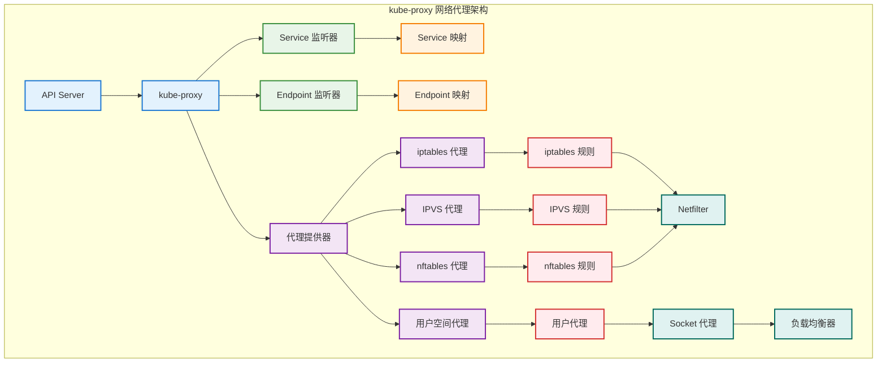

# 网络代理机制

## 概述

kube-proxy 是 Kubernetes 集群中每个节点上运行的网络代理组件，负责实现 Service 的网络规则。它通过监听 API Server 中 Service 和 Endpoints 的变化，在节点上配置相应的网络转发规则，实现服务发现和负载均衡功能。

## 网络代理架构



## 代理模式实现

### iptables 代理模式

```go
// iptables 代理器
type IptablesProxier struct {
    // 基础配置
    hostname          string
    nodeIP            net.IP
    recorder          record.EventRecorder
    healthChecker     healthcheck.Server
    
    // iptables 接口
    iptables     utiliptables.Interface
    
    // 服务和端点映射
    serviceMap        proxy.ServiceMap
    endpointsMap      proxy.EndpointsMap
    endpointSlicesMap proxy.EndpointSliceMap
    
    // 规则缓存
    existingFilterChainsData *bytes.Buffer
    filterChainsLines        [][]byte
    
    // 同步状态
    needFullSync    bool
    syncRunner      *async.BoundedFrequencyRunner
    
    // 端口范围
    nodePortAddresses []string
    
    // 配置选项
    masqueradeAll    bool
    masqueradeMark   string
    clusterCIDR      string
    
    // 指标
    metrics *proxyMetrics
}

func NewIptablesProxier(
    ipt utiliptables.Interface,
    sysctl utilsysctl.Interface,
    exec utilexec.Interface,
    syncPeriod time.Duration,
    minSyncPeriod time.Duration,
    masqueradeAll bool,
    masqueradeBit int,
    clusterCIDR string,
    hostname string,
    nodeIP net.IP,
    recorder record.EventRecorder,
    healthChecker healthcheck.Server,
    nodePortAddresses []string,
) (*IptablesProxier, error) {
    
    // 验证必要的 iptables 链和规则
    if err := ensureKubeChains(ipt); err != nil {
        return nil, fmt.Errorf("failed to ensure kube chains: %v", err)
    }
    
    proxier := &IptablesProxier{
        hostname:          hostname,
        nodeIP:            nodeIP,
        recorder:          recorder,
        healthChecker:     healthChecker,
        iptables:          ipt,
        serviceMap:        make(proxy.ServiceMap),
        endpointsMap:      make(proxy.EndpointsMap),
        endpointSlicesMap: make(proxy.EndpointSliceMap),
        masqueradeAll:     masqueradeAll,
        masqueradeMark:    fmt.Sprintf("%#08x", 1<<uint(masqueradeBit)),
        clusterCIDR:       clusterCIDR,
        nodePortAddresses: nodePortAddresses,
        needFullSync:      true,
        metrics:           newProxyMetrics(),
    }
    
    // 创建同步运行器
    proxier.syncRunner = async.NewBoundedFrequencyRunner(
        "sync-runner", proxier.syncProxyRules, minSyncPeriod, syncPeriod, 1)
    
    return proxier, nil
}

func (proxier *IptablesProxier) syncProxyRules() {
    proxier.mu.Lock()
    defer proxier.mu.Unlock()
    
    start := time.Now()
    defer func() {
        proxier.metrics.syncProxyRulesDuration.Observe(time.Since(start).Seconds())
        klog.V(4).InfoS("syncProxyRules complete", "elapsed", time.Since(start))
    }()
    
    // 构建完整的 iptables 规则
    natChains := bytes.NewBuffer(nil)
    natRules := bytes.NewBuffer(nil)
    filterChains := bytes.NewBuffer(nil)
    filterRules := bytes.NewBuffer(nil)
    
    // 写入链头
    writeLine(natChains, "*nat")
    writeLine(filterChains, "*filter")
    
    // 创建 Kubernetes 相关的链
    activeNATChains := map[utiliptables.Chain]bool{}
    for _, chainName := range kubeProxyChains {
        writeLine(natChains, utiliptables.MakeChainLine(chainName))
        activeNATChains[chainName] = true
    }
    
    activeFilterChains := map[utiliptables.Chain]bool{}
    for _, chainName := range kubeProxyFilterChains {
        writeLine(filterChains, utiliptables.MakeChainLine(chainName))
        activeFilterChains[chainName] = true
    }
    
    // 为每个服务生成规则
    for svcName, svc := range proxier.serviceMap {
        svcInfo, ok := svc.(*serviceInfo)
        if !ok {
            klog.ErrorS(nil, "Failed to cast serviceInfo", "serviceName", svcName)
            continue
        }
        
        protocol := strings.ToLower(string(svcInfo.Protocol()))
        svcNameString := svcInfo.serviceNameString
        
        // 生成 ClusterIP 规则
        if svcInfo.ClusterIP() != nil && !svcInfo.ClusterIP().IsUnspecified() {
            proxier.writeServiceToEndpointRules(natChains, natRules, svcNameString, svcInfo, proxier.endpointsMap[svcName])
        }
        
        // 生成 NodePort 规则
        if svcInfo.NodePort() != 0 {
            proxier.writeNodePortRules(natChains, natRules, svcNameString, svcInfo)
        }
        
        // 生成 LoadBalancer 规则
        if len(svcInfo.LoadBalancerIngress()) > 0 {
            proxier.writeLoadBalancerRules(natChains, natRules, filterChains, filterRules, svcNameString, svcInfo)
        }
        
        // 生成 ExternalIPs 规则
        if len(svcInfo.ExternalIPs()) > 0 {
            proxier.writeExternalIPRules(natChains, natRules, svcNameString, svcInfo)
        }
    }
    
    // 写入链尾
    writeLine(natRules, "COMMIT")
    writeLine(filterRules, "COMMIT")
    
    // 组合规则
    natLines := append(natChains.Bytes(), natRules.Bytes()...)
    filterLines := append(filterChains.Bytes(), filterRules.Bytes()...)
    
    // 应用 NAT 规则
    if err := proxier.iptables.RestoreAll(natLines, utiliptables.NoFlushTables, utiliptables.RestoreCounters); err != nil {
        klog.ErrorS(err, "Failed to execute iptables-restore for nat table")
        proxier.metrics.syncProxyRulesLastResult.Set(0)
        return
    }
    
    // 应用 Filter 规则
    if err := proxier.iptables.RestoreAll(filterLines, utiliptables.NoFlushTables, utiliptables.RestoreCounters); err != nil {
        klog.ErrorS(err, "Failed to execute iptables-restore for filter table")
        proxier.metrics.syncProxyRulesLastResult.Set(0)
        return
    }
    
    proxier.metrics.syncProxyRulesLastResult.Set(1)
    proxier.needFullSync = false
}

func (proxier *IptablesProxier) writeServiceToEndpointRules(
    natChains, natRules *bytes.Buffer,
    svcNameString string,
    svcInfo *serviceInfo,
    endpoints []proxy.Endpoint,
) {
    
    // 为服务创建链
    svcChain := servicePortChainName(svcNameString, svcInfo.Protocol())
    if chain := utiliptables.Chain(svcChain); !proxier.existingChains[chain] {
        writeLine(natChains, utiliptables.MakeChainLine(chain))
    }
    
    // 主要的 DNAT 规则
    args := []string{
        "-A", string(kubeServicesChain),
        "-m", "comment", "--comment", svcNameString,
        "-p", strings.ToLower(string(svcInfo.Protocol())),
        "-d", svcInfo.ClusterIP().String(),
        "--dport", strconv.Itoa(svcInfo.Port()),
        "-j", string(svcChain),
    }
    writeLine(natRules, args...)
    
    // 端点规则
    numEndpoints := len(endpoints)
    if numEndpoints == 0 {
        // 没有端点时跳转到 reject 链
        args := []string{
            "-A", svcChain,
            "-j", string(kubeMarkDropChain),
        }
        writeLine(natRules, args...)
        return
    }
    
    // 为每个端点生成负载均衡规则
    for i, ep := range endpoints {
        epInfo, ok := ep.(*endpointsInfo)
        if !ok {
            continue
        }
        
        // 使用统计模块进行负载均衡
        probability := 1.0 / float64(numEndpoints-i)
        
        args := []string{
            "-A", svcChain,
        }
        
        if i < numEndpoints-1 {
            args = append(args,
                "-m", "statistic",
                "--mode", "random",
                "--probability", fmt.Sprintf("%.5f", probability),
            )
        }
        
        args = append(args,
            "-j", "DNAT",
            "--to-destination", epInfo.Endpoint,
        )
        
        writeLine(natRules, args...)
    }
}
```

### IPVS 代理模式

```go
// IPVS 代理器
type IPVSProxier struct {
    // 基础配置
    hostname         string
    nodeIP           net.IP
    recorder         record.EventRecorder
    healthChecker    healthcheck.Server
    
    // IPVS 接口
    ipvs             utilipvs.Interface
    ipset            utilipset.Interface
    iptables         utiliptables.Interface
    
    // 服务和端点映射
    serviceMap        proxy.ServiceMap
    endpointsMap      proxy.EndpointsMap
    endpointSlicesMap proxy.EndpointSliceMap
    
    // IPVS 配置
    scheduler        string
    syncPeriod       time.Duration
    minSyncPeriod    time.Duration
    
    // 虚拟服务器映射
    virtualServers   map[string]*utilipvs.VirtualServer
    
    // 网络接口
    netlinkHandle    netlinkwrapper.Interface
    
    // 同步状态
    needFullSync     bool
    syncRunner       *async.BoundedFrequencyRunner
    
    // 指标
    metrics          *proxyMetrics
}

func NewIPVSProxier(
    ipt utiliptables.Interface,
    ipvs utilipvs.Interface,
    ipset utilipset.Interface,
    sysctl utilsysctl.Interface,
    exec utilexec.Interface,
    syncPeriod time.Duration,
    minSyncPeriod time.Duration,
    excludeCIDRs []string,
    strictARP bool,
    tcpTimeout time.Duration,
    tcpFinTimeout time.Duration,
    udpTimeout time.Duration,
    masqueradeAll bool,
    masqueradeBit int,
    clusterCIDR string,
    hostname string,
    nodeIP net.IP,
    recorder record.EventRecorder,
    healthChecker healthcheck.Server,
    scheduler string,
    nodePortAddresses []string,
) (*IPVSProxier, error) {
    
    // 验证 IPVS 内核模块
    if err := ipvs.Flush(); err != nil {
        return nil, fmt.Errorf("IPVS flush failed: %v", err)
    }
    
    // 创建必要的 ipset
    if err := ensureIPSets(ipset); err != nil {
        return nil, fmt.Errorf("failed to ensure ipsets: %v", err)
    }
    
    // 创建虚拟网络接口
    netlinkHandle := newNetLinkHandle()
    
    proxier := &IPVSProxier{
        hostname:          hostname,
        nodeIP:            nodeIP,
        recorder:          recorder,
        healthChecker:     healthChecker,
        ipvs:              ipvs,
        ipset:             ipset,
        iptables:          ipt,
        serviceMap:        make(proxy.ServiceMap),
        endpointsMap:      make(proxy.EndpointsMap),
        endpointSlicesMap: make(proxy.EndpointSliceMap),
        scheduler:         scheduler,
        syncPeriod:        syncPeriod,
        minSyncPeriod:     minSyncPeriod,
        virtualServers:    make(map[string]*utilipvs.VirtualServer),
        netlinkHandle:     netlinkHandle,
        needFullSync:      true,
        metrics:           newProxyMetrics(),
    }
    
    // 创建同步运行器
    proxier.syncRunner = async.NewBoundedFrequencyRunner(
        "sync-runner", proxier.syncProxyRules, minSyncPeriod, syncPeriod, 1)
    
    return proxier, nil
}

func (proxier *IPVSProxier) syncProxyRules() {
    proxier.mu.Lock()
    defer proxier.mu.Unlock()
    
    start := time.Now()
    defer func() {
        proxier.metrics.syncProxyRulesDuration.Observe(time.Since(start).Seconds())
        klog.V(4).InfoS("syncProxyRules complete", "elapsed", time.Since(start))
    }()
    
    // 获取当前的虚拟服务器
    currentVirtualServers, err := proxier.ipvs.GetVirtualServers()
    if err != nil {
        klog.ErrorS(err, "Failed to get current virtual servers")
        return
    }
    
    activeVirtualServers := make(map[string]*utilipvs.VirtualServer)
    activeIPSetEntries := make(map[string]utilipset.Entry)
    
    // 为每个服务创建 IPVS 规则
    for svcName, svc := range proxier.serviceMap {
        svcInfo, ok := svc.(*serviceInfo)
        if !ok {
            klog.ErrorS(nil, "Failed to cast serviceInfo", "serviceName", svcName)
            continue
        }
        
        protocol := convertToIPVSProtocol(svcInfo.Protocol())
        
        // 处理 ClusterIP
        if svcInfo.ClusterIP() != nil && !svcInfo.ClusterIP().IsUnspecified() {
            serv := &utilipvs.VirtualServer{
                Address:   svcInfo.ClusterIP(),
                Port:      uint16(svcInfo.Port()),
                Protocol:  protocol,
                Scheduler: proxier.scheduler,
            }
            
            if err := proxier.syncService(svcName, serv, true); err != nil {
                klog.ErrorS(err, "Failed to sync service", "serviceName", svcName)
                continue
            }
            
            activeVirtualServers[serv.String()] = serv
            
            // 添加到 cluster-ip ipset
            entry := &utilipset.Entry{
                IP:       svcInfo.ClusterIP().String(),
                Port:     svcInfo.Port(),
                Protocol: string(svcInfo.Protocol()),
                SetType:  utilipset.HashIPPort,
            }
            activeIPSetEntries[entry.String()] = *entry
        }
        
        // 处理 NodePort
        if svcInfo.NodePort() != 0 {
            for _, nodeIP := range proxier.nodePortAddresses {
                serv := &utilipvs.VirtualServer{
                    Address:   net.ParseIP(nodeIP),
                    Port:      uint16(svcInfo.NodePort()),
                    Protocol:  protocol,
                    Scheduler: proxier.scheduler,
                }
                
                if err := proxier.syncService(svcName, serv, false); err != nil {
                    klog.ErrorS(err, "Failed to sync NodePort service", "serviceName", svcName)
                    continue
                }
                
                activeVirtualServers[serv.String()] = serv
                
                // 添加到 node-port-tcp/udp ipset
                entry := &utilipset.Entry{
                    Port:     svcInfo.NodePort(),
                    Protocol: string(svcInfo.Protocol()),
                    SetType:  utilipset.BitmapPort,
                }
                activeIPSetEntries[entry.String()] = *entry
            }
        }
        
        // 处理 LoadBalancer
        for _, ingress := range svcInfo.LoadBalancerIngress() {
            if ingress.IP != "" {
                serv := &utilipvs.VirtualServer{
                    Address:   net.ParseIP(ingress.IP),
                    Port:      uint16(svcInfo.Port()),
                    Protocol:  protocol,
                    Scheduler: proxier.scheduler,
                }
                
                if err := proxier.syncService(svcName, serv, false); err != nil {
                    klog.ErrorS(err, "Failed to sync LoadBalancer service", "serviceName", svcName)
                    continue
                }
                
                activeVirtualServers[serv.String()] = serv
                
                // 添加到 load-balancer-ip ipset
                entry := &utilipset.Entry{
                    IP:       ingress.IP,
                    Port:     svcInfo.Port(),
                    Protocol: string(svcInfo.Protocol()),
                    SetType:  utilipset.HashIPPort,
                }
                activeIPSetEntries[entry.String()] = *entry
            }
        }
    }
    
    // 清理不再需要的虚拟服务器
    for _, vs := range currentVirtualServers {
        if _, ok := activeVirtualServers[vs.String()]; !ok {
            klog.V(4).InfoS("Deleting virtual server", "virtualServer", vs.String())
            if err := proxier.ipvs.DeleteVirtualServer(vs); err != nil {
                klog.ErrorS(err, "Failed to delete virtual server", "virtualServer", vs.String())
            }
        }
    }
    
    // 同步 ipset 条目
    if err := proxier.syncIPSetEntries(activeIPSetEntries); err != nil {
        klog.ErrorS(err, "Failed to sync ipset entries")
    }
    
    proxier.needFullSync = false
}

func (proxier *IPVSProxier) syncService(svcNameString string, vs *utilipvs.VirtualServer, bindAddr bool) error {
    // 检查虚拟服务器是否存在
    appliedVirtualServer, _ := proxier.ipvs.GetVirtualServer(vs)
    if appliedVirtualServer == nil {
        klog.V(3).InfoS("Adding virtual server", "virtualServer", vs.String())
        if err := proxier.ipvs.AddVirtualServer(vs); err != nil {
            return fmt.Errorf("failed to add virtual server %s: %v", vs.String(), err)
        }
    }
    
    // 绑定虚拟 IP 到虚拟接口
    if bindAddr {
        if err := proxier.netlinkHandle.EnsureAddressBind(vs.Address.String(), defaultDummyDevice); err != nil {
            return fmt.Errorf("failed to bind address %s to device %s: %v", vs.Address.String(), defaultDummyDevice, err)
        }
    }
    
    // 同步真实服务器（端点）
    curEndpoints := proxier.endpointsMap[svcNameString]
    appliedRealServers, err := proxier.ipvs.GetRealServers(vs)
    if err != nil {
        return fmt.Errorf("failed to get real servers for %s: %v", vs.String(), err)
    }
    
    activeRealServers := make(map[string]*utilipvs.RealServer)
    
    // 添加或更新真实服务器
    for _, ep := range curEndpoints {
        epInfo, ok := ep.(*endpointsInfo)
        if !ok {
            continue
        }
        
        rs := &utilipvs.RealServer{
            Address: epInfo.IP(),
            Port:    uint16(epInfo.Port()),
            Weight:  1,
        }
        
        activeRealServers[rs.String()] = rs
        
        // 检查真实服务器是否存在
        var found bool
        for _, appliedRS := range appliedRealServers {
            if appliedRS.Equal(rs) {
                found = true
                break
            }
        }
        
        if !found {
            klog.V(3).InfoS("Adding real server", "realServer", rs.String(), "virtualServer", vs.String())
            if err := proxier.ipvs.AddRealServer(vs, rs); err != nil {
                return fmt.Errorf("failed to add real server %s to %s: %v", rs.String(), vs.String(), err)
            }
        }
    }
    
    // 删除不再需要的真实服务器
    for _, appliedRS := range appliedRealServers {
        if _, ok := activeRealServers[appliedRS.String()]; !ok {
            klog.V(3).InfoS("Deleting real server", "realServer", appliedRS.String(), "virtualServer", vs.String())
            if err := proxier.ipvs.DeleteRealServer(vs, appliedRS); err != nil {
                klog.ErrorS(err, "Failed to delete real server", "realServer", appliedRS.String(), "virtualServer", vs.String())
            }
        }
    }
    
    return nil
}
```

### 用户空间代理模式

```go
// 用户空间代理器
type UserSpaceProxier struct {
    // 基础配置
    loadBalancer LoadBalancer
    mu           sync.RWMutex
    serviceMap   map[proxy.ServicePortName]*serviceInfo
    portMap      map[proxyPort]closeable
    
    // UDP 连接跟踪
    udpIdleTimeout    time.Duration
    udpConnTrackMutex sync.Mutex
    udpConnTrackMap   map[udpConnTrackKey]*udpConnTrackEntry
    
    // 网络配置
    listenIP      net.IP
    iptables      utiliptables.Interface
    hostIP        net.IP
    proxyPorts    PortAllocator
    makeProxySocket func(protocol api.Protocol, ip net.IP, port int) (ProxySocket, error)
    
    // 同步
    syncRunner *async.BoundedFrequencyRunner
    
    // 指标
    metrics *proxyMetrics
}

type ProxySocket interface {
    Addr() net.Addr
    Close() error
    ProxyLoop(service proxy.ServicePortName, info *serviceInfo, loadBalancer LoadBalancer)
}

func NewUserSpaceProxier(
    loadBalancer LoadBalancer,
    listenIP net.IP,
    iptables utiliptables.Interface,
    pr PortAllocator,
    syncPeriod time.Duration,
    minSyncPeriod time.Duration,
    udpIdleTimeout time.Duration,
) *UserSpaceProxier {
    
    proxier := &UserSpaceProxier{
        loadBalancer:      loadBalancer,
        serviceMap:        make(map[proxy.ServicePortName]*serviceInfo),
        portMap:           make(map[proxyPort]closeable),
        udpIdleTimeout:    udpIdleTimeout,
        udpConnTrackMap:   make(map[udpConnTrackKey]*udpConnTrackEntry),
        listenIP:          listenIP,
        iptables:          iptables,
        proxyPorts:        pr,
        makeProxySocket:   newProxySocket,
        metrics:           newProxyMetrics(),
    }
    
    // 创建同步运行器
    proxier.syncRunner = async.NewBoundedFrequencyRunner(
        "sync-runner", proxier.syncProxyRules, minSyncPeriod, syncPeriod, 1)
    
    return proxier
}

func (proxier *UserSpaceProxier) syncProxyRules() {
    proxier.mu.Lock()
    defer proxier.mu.Unlock()
    
    start := time.Now()
    defer func() {
        proxier.metrics.syncProxyRulesDuration.Observe(time.Since(start).Seconds())
        klog.V(4).InfoS("syncProxyRules complete", "elapsed", time.Since(start))
    }()
    
    // 为每个服务端口创建代理套接字
    for name, info := range proxier.serviceMap {
        protocol := info.protocol
        socket, err := proxier.makeProxySocket(protocol, proxier.listenIP, 0)
        if err != nil {
            klog.ErrorS(err, "Failed to create proxy socket", "service", name, "protocol", protocol)
            continue
        }
        
        // 启动代理循环
        go socket.ProxyLoop(name, info, proxier.loadBalancer)
        
        // 添加 iptables 规则
        if err := proxier.addServiceRules(info, socket.Addr()); err != nil {
            klog.ErrorS(err, "Failed to add service rules", "service", name)
            socket.Close()
            continue
        }
        
        // 记录代理端口
        proxyPort := proxyPort{protocol: protocol, host: proxier.listenIP.String(), port: socket.Addr().(*net.TCPAddr).Port}
        proxier.portMap[proxyPort] = socket
    }
}

// TCP 代理套接字
type tcpProxySocket struct {
    listener     net.Listener
    port         int
    closed       bool
    closeMutex   sync.Mutex
}

func (tcp *tcpProxySocket) Addr() net.Addr {
    return tcp.listener.Addr()
}

func (tcp *tcpProxySocket) Close() error {
    tcp.closeMutex.Lock()
    defer tcp.closeMutex.Unlock()
    
    if tcp.closed {
        return nil
    }
    
    tcp.closed = true
    return tcp.listener.Close()
}

func (tcp *tcpProxySocket) ProxyLoop(service proxy.ServicePortName, myInfo *serviceInfo, loadBalancer LoadBalancer) {
    for {
        if tcp.closed {
            break
        }
        
        // 接受连接
        inConn, err := tcp.listener.Accept()
        if err != nil {
            if !tcp.closed {
                klog.ErrorS(err, "Accept failed", "service", service)
            }
            break
        }
        
        klog.V(3).InfoS("Accepted TCP connection", "service", service, "from", inConn.RemoteAddr())
        
        // 为每个连接启动处理协程
        go func(conn net.Conn) {
            defer conn.Close()
            tcp.proxyTCP(service, myInfo, loadBalancer, conn)
        }(inConn)
    }
}

func (tcp *tcpProxySocket) proxyTCP(service proxy.ServicePortName, myInfo *serviceInfo, loadBalancer LoadBalancer, inConn net.Conn) {
    // 选择后端端点
    endpoint, err := loadBalancer.NextEndpoint(service, inConn.RemoteAddr())
    if err != nil {
        klog.ErrorS(err, "Couldn't find an endpoint", "service", service, "from", inConn.RemoteAddr())
        return
    }
    
    klog.V(3).InfoS("Mapped service to endpoint", "service", service, "endpoint", endpoint)
    
    // 连接到后端
    outConn, err := net.DialTimeout("tcp", endpoint, time.Duration(myInfo.timeoutSeconds)*time.Second)
    if err != nil {
        klog.ErrorS(err, "Dial failed", "endpoint", endpoint)
        return
    }
    defer outConn.Close()
    
    // 双向复制数据
    exitChan := make(chan bool, 2)
    
    go copyBytes("from backend", inConn, outConn, exitChan)
    go copyBytes("to backend", outConn, inConn, exitChan)
    
    <-exitChan
    klog.V(3).InfoS("TCP session closed", "service", service, "endpoint", endpoint)
}

// UDP 代理套接字
type udpProxySocket struct {
    conn         *net.UDPConn
    listenAddr   *net.UDPAddr
    closed       bool
    closeMutex   sync.Mutex
}

func (udp *udpProxySocket) ProxyLoop(service proxy.ServicePortName, myInfo *serviceInfo, loadBalancer LoadBalancer) {
    for {
        if udp.closed {
            break
        }
        
        // 读取数据包
        buffer := make([]byte, 4096)
        n, cliAddr, err := udp.conn.ReadFromUDP(buffer)
        if err != nil {
            if !udp.closed {
                klog.ErrorS(err, "ReadFromUDP failed", "service", service)
            }
            break
        }
        
        klog.V(4).InfoS("Received UDP packet", "service", service, "from", cliAddr, "size", n)
        
        // 为每个数据包启动处理协程
        go func(data []byte, clientAddr *net.UDPAddr) {
            udp.proxyUDP(service, myInfo, loadBalancer, data, clientAddr)
        }(buffer[:n], cliAddr)
    }
}

func (udp *udpProxySocket) proxyUDP(service proxy.ServicePortName, myInfo *serviceInfo, loadBalancer LoadBalancer, data []byte, clientAddr *net.UDPAddr) {
    // 选择后端端点
    endpoint, err := loadBalancer.NextEndpoint(service, clientAddr)
    if err != nil {
        klog.ErrorS(err, "Couldn't find an endpoint", "service", service, "from", clientAddr)
        return
    }
    
    klog.V(4).InfoS("Mapped service to endpoint", "service", service, "endpoint", endpoint)
    
    // 连接到后端
    serverAddr, err := net.ResolveUDPAddr("udp", endpoint)
    if err != nil {
        klog.ErrorS(err, "ResolveUDPAddr failed", "endpoint", endpoint)
        return
    }
    
    conn, err := net.DialUDP("udp", nil, serverAddr)
    if err != nil {
        klog.ErrorS(err, "ConnectUDP failed", "endpoint", endpoint)
        return
    }
    defer conn.Close()
    
    // 发送数据到后端
    _, err = conn.Write(data)
    if err != nil {
        klog.ErrorS(err, "Write failed", "endpoint", endpoint)
        return
    }
    
    // 读取响应
    conn.SetReadDeadline(time.Now().Add(time.Duration(myInfo.timeoutSeconds) * time.Second))
    response := make([]byte, 4096)
    n, err := conn.Read(response)
    if err != nil {
        if netErr, ok := err.(net.Error); ok && netErr.Timeout() {
            klog.V(4).InfoS("UDP read timeout", "endpoint", endpoint)
        } else {
            klog.ErrorS(err, "Read failed", "endpoint", endpoint)
        }
        return
    }
    
    // 发送响应回客户端
    _, err = udp.conn.WriteToUDP(response[:n], clientAddr)
    if err != nil {
        klog.ErrorS(err, "WriteToUDP failed", "clientAddr", clientAddr)
    }
    
    klog.V(4).InfoS("UDP session completed", "service", service, "endpoint", endpoint)
}
```

## 负载均衡实现

### 负载均衡算法

```go
// 负载均衡器接口
type LoadBalancer interface {
    NextEndpoint(service proxy.ServicePortName, srcAddr net.Addr) (string, error)
    NewService(service proxy.ServicePortName, sessionAffinityType v1.ServiceAffinity, affinityTimeoutSeconds int) error
    DeleteService(service proxy.ServicePortName)
    CleanupStaleStickySessions(service proxy.ServicePortName)
}

// 轮询负载均衡器
type RoundRobinLoadBalancer struct {
    lock     sync.RWMutex
    services map[proxy.ServicePortName]*RoundRobinBalancerState
}

type RoundRobinBalancerState struct {
    endpoints []string
    index     int
}

func NewRoundRobinLoadBalancer() *RoundRobinLoadBalancer {
    return &RoundRobinLoadBalancer{
        services: make(map[proxy.ServicePortName]*RoundRobinBalancerState),
    }
}

func (lb *RoundRobinLoadBalancer) NextEndpoint(service proxy.ServicePortName, srcAddr net.Addr) (string, error) {
    lb.lock.Lock()
    defer lb.lock.Unlock()
    
    state, exists := lb.services[service]
    if !exists || len(state.endpoints) == 0 {
        return "", fmt.Errorf("no endpoints available for service %s", service.String())
    }
    
    endpoint := state.endpoints[state.index%len(state.endpoints)]
    state.index++
    
    return endpoint, nil
}

func (lb *RoundRobinLoadBalancer) UpdateEndpoints(service proxy.ServicePortName, endpoints []string) {
    lb.lock.Lock()
    defer lb.lock.Unlock()
    
    state, exists := lb.services[service]
    if !exists {
        state = &RoundRobinBalancerState{}
        lb.services[service] = state
    }
    
    state.endpoints = endpoints
    state.index = 0
}

// 会话亲和性负载均衡器
type StickySessionLoadBalancer struct {
    lock               sync.RWMutex
    services           map[proxy.ServicePortName]*StickySessionBalancerState
    affinityTimeoutSeconds int
}

type StickySessionBalancerState struct {
    endpoints       []string
    index           int
    affinity        map[string]*affinityState
    affinityTimeout time.Duration
}

type affinityState struct {
    endpoint       string
    lastUsed       time.Time
}

func NewStickySessionLoadBalancer(affinityTimeoutSeconds int) *StickySessionLoadBalancer {
    return &StickySessionLoadBalancer{
        services:           make(map[proxy.ServicePortName]*StickySessionBalancerState),
        affinityTimeoutSeconds: affinityTimeoutSeconds,
    }
}

func (lb *StickySessionLoadBalancer) NextEndpoint(service proxy.ServicePortName, srcAddr net.Addr) (string, error) {
    lb.lock.Lock()
    defer lb.lock.Unlock()
    
    state, exists := lb.services[service]
    if !exists || len(state.endpoints) == 0 {
        return "", fmt.Errorf("no endpoints available for service %s", service.String())
    }
    
    clientIP := srcAddr.(*net.TCPAddr).IP.String()
    
    // 检查现有的会话亲和性
    if affinity, exists := state.affinity[clientIP]; exists {
        if time.Since(affinity.lastUsed) < state.affinityTimeout {
            // 验证端点仍然存在
            for _, endpoint := range state.endpoints {
                if endpoint == affinity.endpoint {
                    affinity.lastUsed = time.Now()
                    return affinity.endpoint, nil
                }
            }
        }
        // 亲和性过期或端点不存在，删除记录
        delete(state.affinity, clientIP)
    }
    
    // 选择新的端点
    endpoint := state.endpoints[state.index%len(state.endpoints)]
    state.index++
    
    // 记录新的亲和性
    if state.affinity == nil {
        state.affinity = make(map[string]*affinityState)
    }
    state.affinity[clientIP] = &affinityState{
        endpoint: endpoint,
        lastUsed: time.Now(),
    }
    
    return endpoint, nil
}

func (lb *StickySessionLoadBalancer) CleanupStaleStickySessions(service proxy.ServicePortName) {
    lb.lock.Lock()
    defer lb.lock.Unlock()
    
    state, exists := lb.services[service]
    if !exists {
        return
    }
    
    now := time.Now()
    for clientIP, affinity := range state.affinity {
        if now.Sub(affinity.lastUsed) > state.affinityTimeout {
            delete(state.affinity, clientIP)
        }
    }
}

// 加权轮询负载均衡器
type WeightedRoundRobinLoadBalancer struct {
    lock     sync.RWMutex
    services map[proxy.ServicePortName]*WeightedRoundRobinBalancerState
}

type WeightedRoundRobinBalancerState struct {
    endpoints []WeightedEndpoint
    weights   []int
    index     int
    current   int
}

type WeightedEndpoint struct {
    Endpoint string
    Weight   int
}

func (lb *WeightedRoundRobinLoadBalancer) NextEndpoint(service proxy.ServicePortName, srcAddr net.Addr) (string, error) {
    lb.lock.Lock()
    defer lb.lock.Unlock()
    
    state, exists := lb.services[service]
    if !exists || len(state.endpoints) == 0 {
        return "", fmt.Errorf("no endpoints available for service %s", service.String())
    }
    
    // 加权轮询算法
    for {
        state.current = (state.current + 1) % len(state.endpoints)
        if state.current == 0 {
            state.index++
        }
        
        if state.index%state.endpoints[state.current].Weight == 0 {
            return state.endpoints[state.current].Endpoint, nil
        }
    }
}
```

## 健康检查机制

### 服务健康检查

```go
// 健康检查服务器
type HealthzServer struct {
    listener    net.Listener
    httpServer  *http.Server
    recorder    record.EventRecorder
    
    // 健康检查配置
    services    map[types.NamespacedName]uint16
    endpoints   map[types.NamespacedName]int
    
    // 同步锁
    lock        sync.RWMutex
}

func NewHealthzServer(hostname string, recorder record.EventRecorder, listener net.Listener, timeout time.Duration) *HealthzServer {
    mux := http.NewServeMux()
    
    server := &HealthzServer{
        listener:  listener,
        recorder:  recorder,
        services:  make(map[types.NamespacedName]uint16),
        endpoints: make(map[types.NamespacedName]int),
    }
    
    mux.HandleFunc("/healthz", server.handleHealthz)
    mux.HandleFunc("/healthz/service/", server.handleServiceHealthz)
    
    server.httpServer = &http.Server{
        Handler:      mux,
        ReadTimeout:  timeout,
        WriteTimeout: timeout,
    }
    
    return server
}

func (hzs *HealthzServer) handleHealthz(resp http.ResponseWriter, req *http.Request) {
    resp.WriteHeader(http.StatusOK)
    resp.Write([]byte("OK"))
}

func (hzs *HealthzServer) handleServiceHealthz(resp http.ResponseWriter, req *http.Request) {
    // 解析服务名称和端口
    path := strings.TrimPrefix(req.URL.Path, "/healthz/service/")
    parts := strings.Split(path, "/")
    
    if len(parts) < 3 {
        http.Error(resp, "Invalid path", http.StatusBadRequest)
        return
    }
    
    namespace := parts[0]
    serviceName := parts[1]
    port := parts[2]
    
    svcPortName := proxy.ServicePortName{
        NamespacedName: types.NamespacedName{
            Namespace: namespace,
            Name:      serviceName,
        },
        Port: port,
    }
    
    // 检查服务健康状态
    if hzs.isServiceHealthy(svcPortName) {
        resp.WriteHeader(http.StatusOK)
        resp.Write([]byte("OK"))
    } else {
        resp.WriteHeader(http.StatusServiceUnavailable)
        resp.Write([]byte("Service Unavailable"))
    }
}

func (hzs *HealthzServer) isServiceHealthy(service proxy.ServicePortName) bool {
    hzs.lock.RLock()
    defer hzs.lock.RUnlock()
    
    // 检查服务是否存在
    _, exists := hzs.services[service.NamespacedName]
    if !exists {
        return false
    }
    
    // 检查是否有健康的端点
    endpointCount, exists := hzs.endpoints[service.NamespacedName]
    return exists && endpointCount > 0
}

func (hzs *HealthzServer) SyncServices(serviceMap map[types.NamespacedName]uint16) {
    hzs.lock.Lock()
    defer hzs.lock.Unlock()
    
    hzs.services = make(map[types.NamespacedName]uint16)
    for name, port := range serviceMap {
        hzs.services[name] = port
    }
}

func (hzs *HealthzServer) SyncEndpoints(endpointsMap map[types.NamespacedName]int) {
    hzs.lock.Lock()
    defer hzs.lock.Unlock()
    
    hzs.endpoints = make(map[types.NamespacedName]int)
    for name, count := range endpointsMap {
        hzs.endpoints[name] = count
    }
}
```

## 性能优化

### 连接跟踪优化

```go
// 连接跟踪优化器
type ConntrackOptimizer struct {
    conntrackPath string
    maxConntrack  int
    
    // UDP 连接跟踪
    udpConnTracker *UDPConnTracker
    
    // TCP 连接跟踪
    tcpConnTracker *TCPConnTracker
}

type UDPConnTracker struct {
    connections map[udpConnKey]*udpConnEntry
    timeout     time.Duration
    maxEntries  int
    mutex       sync.RWMutex
}

type udpConnKey struct {
    srcIP   string
    srcPort int
    dstIP   string
    dstPort int
}

type udpConnEntry struct {
    lastSeen time.Time
    backend  string
}

func NewUDPConnTracker(timeout time.Duration, maxEntries int) *UDPConnTracker {
    tracker := &UDPConnTracker{
        connections: make(map[udpConnKey]*udpConnEntry),
        timeout:     timeout,
        maxEntries:  maxEntries,
    }
    
    // 启动清理协程
    go tracker.cleanupLoop()
    
    return tracker
}

func (t *UDPConnTracker) Track(srcIP string, srcPort int, dstIP string, dstPort int, backend string) {
    t.mutex.Lock()
    defer t.mutex.Unlock()
    
    key := udpConnKey{
        srcIP:   srcIP,
        srcPort: srcPort,
        dstIP:   dstIP,
        dstPort: dstPort,
    }
    
    t.connections[key] = &udpConnEntry{
        lastSeen: time.Now(),
        backend:  backend,
    }
    
    // 限制连接数量
    if len(t.connections) > t.maxEntries {
        t.evictOldest()
    }
}

func (t *UDPConnTracker) GetBackend(srcIP string, srcPort int, dstIP string, dstPort int) (string, bool) {
    t.mutex.RLock()
    defer t.mutex.RUnlock()
    
    key := udpConnKey{
        srcIP:   srcIP,
        srcPort: srcPort,
        dstIP:   dstIP,
        dstPort: dstPort,
    }
    
    entry, exists := t.connections[key]
    if !exists {
        return "", false
    }
    
    // 检查是否过期
    if time.Since(entry.lastSeen) > t.timeout {
        delete(t.connections, key)
        return "", false
    }
    
    return entry.backend, true
}

func (t *UDPConnTracker) cleanupLoop() {
    ticker := time.NewTicker(t.timeout / 2)
    defer ticker.Stop()
    
    for range ticker.C {
        t.cleanup()
    }
}

func (t *UDPConnTracker) cleanup() {
    t.mutex.Lock()
    defer t.mutex.Unlock()
    
    now := time.Now()
    for key, entry := range t.connections {
        if now.Sub(entry.lastSeen) > t.timeout {
            delete(t.connections, key)
        }
    }
}

func (t *UDPConnTracker) evictOldest() {
    var oldestKey udpConnKey
    var oldestTime time.Time
    
    for key, entry := range t.connections {
        if oldestTime.IsZero() || entry.lastSeen.Before(oldestTime) {
            oldestTime = entry.lastSeen
            oldestKey = key
        }
    }
    
    delete(t.connections, oldestKey)
}

// 规则优化器
type RuleOptimizer struct {
    // 规则缓存
    ruleCache map[string][]byte
    
    // 批量操作
    batchSize int
    
    // 压缩选项
    enableCompression bool
}

func (opt *RuleOptimizer) OptimizeRules(rules []string) []string {
    if !opt.enableCompression {
        return rules
    }
    
    // 合并相似规则
    optimized := opt.mergeSimilarRules(rules)
    
    // 移除重复规则
    optimized = opt.removeDuplicateRules(optimized)
    
    // 重新排序规则以提高效率
    optimized = opt.reorderRules(optimized)
    
    return optimized
}

func (opt *RuleOptimizer) mergeSimilarRules(rules []string) []string {
    // 按规则类型分组
    groups := make(map[string][]string)
    
    for _, rule := range rules {
        ruleType := extractRuleType(rule)
        groups[ruleType] = append(groups[ruleType], rule)
    }
    
    var optimized []string
    for _, group := range groups {
        optimized = append(optimized, opt.mergeRuleGroup(group)...)
    }
    
    return optimized
}

func (opt *RuleOptimizer) mergeRuleGroup(rules []string) []string {
    // 实现规则合并逻辑
    // 例如：将多个相同目标的 DNAT 规则合并为一个规则
    return rules
}
```

## 监控和调试

### 网络代理指标

```go
// 网络代理监控指标
type ProxyMetrics struct {
    // 同步指标
    syncProxyRulesDuration    prometheus.Histogram
    syncProxyRulesLastResult  prometheus.Gauge
    
    // 规则数量
    iptablesRulesTotal        prometheus.Gauge
    ipvsServicesTotal         prometheus.Gauge
    ipvsEndpointsTotal        prometheus.Gauge
    
    // 连接指标
    proxyConnectionsTotal     *prometheus.CounterVec
    proxyConnectionsDuration  *prometheus.HistogramVec
    
    // 错误统计
    proxyErrorsTotal          *prometheus.CounterVec
}

func newProxyMetrics() *ProxyMetrics {
    return &ProxyMetrics{
        syncProxyRulesDuration: prometheus.NewHistogram(
            prometheus.HistogramOpts{
                Name: "kubeproxy_sync_proxy_rules_duration_seconds",
                Help: "SyncProxyRules latency in seconds",
                Buckets: []float64{0.001, 0.002, 0.004, 0.008, 0.016, 0.032, 0.064, 0.128, 0.256, 0.512, 1.024, 2.048, 4.096, 8.192, 16.384},
            },
        ),
        syncProxyRulesLastResult: prometheus.NewGauge(
            prometheus.GaugeOpts{
                Name: "kubeproxy_sync_proxy_rules_last_result",
                Help: "The result of the last execution of syncProxyRules",
            },
        ),
        proxyConnectionsTotal: prometheus.NewCounterVec(
            prometheus.CounterOpts{
                Name: "kubeproxy_network_programming_total",
                Help: "Cumulative kubeproxy network programming time in microseconds",
            },
            []string{"protocol"},
        ),
    }
}

func (m *ProxyMetrics) recordSyncResult(start time.Time, success bool) {
    m.syncProxyRulesDuration.Observe(time.Since(start).Seconds())
    
    if success {
        m.syncProxyRulesLastResult.Set(1)
    } else {
        m.syncProxyRulesLastResult.Set(0)
    }
}
```

## 最佳实践

### 代理模式选择

1. **iptables 模式**：
   - 适用于中小规模集群
   - 简单可靠，兼容性好
   - 规则数量影响性能
   - 适合服务数量较少的场景

2. **IPVS 模式**：
   - 适用于大规模集群
   - 性能优异，支持更多负载均衡算法
   - 需要加载内核模块
   - 适合高性能要求的场景

3. **用户空间模式**：
   - 调试和测试用途
   - 性能较差，不推荐生产使用
   - 可控性强，便于定制

### 性能调优建议

1. **内核参数优化**：
   ```bash
   # 增加连接跟踪表大小
   echo 'net.netfilter.nf_conntrack_max = 1048576' >> /etc/sysctl.conf
   
   # 优化网络缓冲区
   echo 'net.core.rmem_max = 134217728' >> /etc/sysctl.conf
   echo 'net.core.wmem_max = 134217728' >> /etc/sysctl.conf
   ```

2. **代理配置优化**：
   - 合理设置同步间隔
   - 启用规则压缩
   - 使用适当的负载均衡算法
   - 监控规则数量增长

### 故障排查

1. **网络代理问题诊断**：
   ```bash
   # 检查 kube-proxy 状态
   kubectl get pods -n kube-system | grep kube-proxy
   
   # 查看 iptables 规则
   iptables -t nat -L -n --line-numbers
   
   # 检查 IPVS 规则
   ipvsadm -L -n
   
   # 查看代理日志
   kubectl logs -n kube-system daemonset/kube-proxy
   ```

2. **常见问题解决**：
   - **服务不可访问**：检查端点和规则配置
   - **负载均衡不均匀**：验证负载均衡算法配置
   - **连接超时**：检查网络策略和防火墙规则
   - **性能问题**：优化代理模式和内核参数
