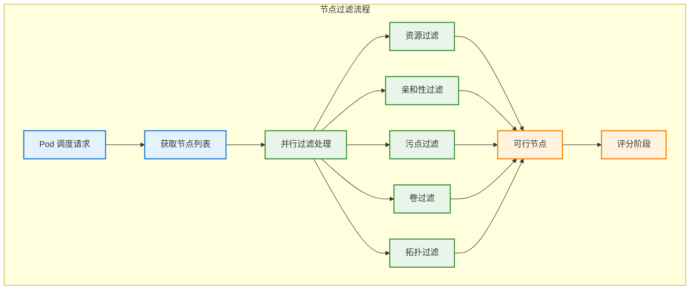

# 节点过滤算法

## 概述

节点过滤算法是 Kubernetes 调度过程的第一阶段，负责从集群中筛选出能够满足 Pod 调度需求的候选节点。过滤阶段通过一系列过滤插件来检查各种约束条件，确保只有符合要求的节点能够进入后续的评分阶段。

## 过滤算法架构



## 过滤算法实现

### 核心过滤框架

```go
// 过滤器接口定义
type FilterPlugin interface {
    Plugin
    Filter(ctx context.Context, state *CycleState, pod *v1.Pod, nodeInfo *NodeInfo) *Status
}

// 过滤执行框架
type FilterFramework struct {
    plugins []FilterPlugin
    handle  Handle
}

func (f *FilterFramework) RunFilterPlugins(
    ctx context.Context,
    state *CycleState,
    pod *v1.Pod,
    nodeInfo *NodeInfo,
) *Status {
    
    for _, plugin := range f.plugins {
        status := plugin.Filter(ctx, state, pod, nodeInfo)
        if !status.IsSuccess() {
            return status
        }
    }
    
    return NewStatus(Success, "")
}

// 并行过滤实现
func (g *genericScheduler) findNodesThatFitPod(
    ctx context.Context,
    fwk framework.Framework,
    state *framework.CycleState,
    pod *v1.Pod,
) ([]*v1.Node, framework.Diagnosis, error) {
    
    allNodes, err := g.nodeInfoSnapshot.NodeInfos().List()
    if err != nil {
        return nil, framework.Diagnosis{}, err
    }
    
    feasibleNodes := make([]*v1.Node, 0, len(allNodes))
    filteredNodesStatuses := make(framework.NodeToStatusMap)
    
    // 并行处理节点过滤
    parallelCtx, cancel := context.WithCancel(ctx)
    defer cancel()
    
    checkNode := func(i int) {
        nodeInfo := allNodes[i]
        node := nodeInfo.Node()
        
        // 执行所有过滤插件
        status := fwk.RunFilterPlugins(parallelCtx, state, pod, nodeInfo)
        
        if status.IsSuccess() {
            feasibleNodes = append(feasibleNodes, node)
        } else {
            filteredNodesStatuses[node.Name] = status
        }
    }
    
    // 使用工作池并行处理
    workqueue.ParallelizeUntil(parallelCtx, len(allNodes), checkNode)
    
    return feasibleNodes, framework.Diagnosis{
        NodeToStatusMap: filteredNodesStatuses,
    }, nil
}
```

## 核心过滤插件

### 1. NodeResourcesFit - 资源匹配过滤器

```go
// 资源匹配过滤器
type NodeResourcesFit struct {
    ignoredResources      sets.String
    ignoredResourceGroups sets.String
}

func (f *NodeResourcesFit) Filter(
    ctx context.Context,
    cycleState *framework.CycleState,
    pod *v1.Pod,
    nodeInfo *framework.NodeInfo,
) *framework.Status {
    
    node := nodeInfo.Node()
    if node == nil {
        return framework.NewStatus(framework.Error, "node not found")
    }
    
    // 检查资源可用性
    if insufficient, err := f.checkResourceAvailability(pod, nodeInfo); err != nil {
        return framework.NewStatus(framework.Error, err.Error())
    } else if len(insufficient) > 0 {
        return framework.NewStatus(framework.Unschedulable, 
            fmt.Sprintf("Insufficient %s", strings.Join(insufficient, ", ")))
    }
    
    return nil
}

func (f *NodeResourcesFit) checkResourceAvailability(
    pod *v1.Pod,
    nodeInfo *framework.NodeInfo,
) ([]string, error) {
    
    var insufficient []string
    
    // 计算 Pod 资源需求
    podRequest := f.computePodResourceRequest(pod)
    
    // 检查标准资源（CPU、内存、存储）
    if podRequest.MilliCPU > nodeInfo.Allocatable.MilliCPU {
        insufficient = append(insufficient, "cpu")
    }
    
    if podRequest.Memory > nodeInfo.Allocatable.Memory {
        insufficient = append(insufficient, "memory")
    }
    
    if podRequest.EphemeralStorage > nodeInfo.Allocatable.EphemeralStorage {
        insufficient = append(insufficient, "ephemeral-storage")
    }
    
    // 检查扩展资源
    for resourceName, quantity := range podRequest.ScalarResources {
        if f.ignoredResources.Has(string(resourceName)) {
            continue
        }
        
        if available, ok := nodeInfo.Allocatable.ScalarResources[resourceName]; !ok {
            insufficient = append(insufficient, string(resourceName))
        } else if quantity > available {
            insufficient = append(insufficient, string(resourceName))
        }
    }
    
    return insufficient, nil
}

func (f *NodeResourcesFit) computePodResourceRequest(pod *v1.Pod) *Resource {
    result := &Resource{
        ScalarResources: make(map[v1.ResourceName]int64),
    }
    
    // 计算普通容器资源
    for _, container := range pod.Spec.Containers {
        containerResource := f.computeContainerResourceRequest(&container)
        result = result.Add(containerResource)
    }
    
    // 计算初始化容器资源（取最大值）
    for _, container := range pod.Spec.InitContainers {
        containerResource := f.computeContainerResourceRequest(&container)
        result = result.MaxWith(containerResource)
    }
    
    // 计算 Pod 级别的开销
    if pod.Spec.Overhead != nil {
        overhead := &Resource{}
        if cpu, ok := pod.Spec.Overhead[v1.ResourceCPU]; ok {
            overhead.MilliCPU = cpu.MilliValue()
        }
        if memory, ok := pod.Spec.Overhead[v1.ResourceMemory]; ok {
            overhead.Memory = memory.Value()
        }
        result = result.Add(overhead)
    }
    
    return result
}
```

### 2. NodeAffinity - 节点亲和性过滤器

```go
// 节点亲和性过滤器
type NodeAffinity struct{}

func (na *NodeAffinity) Filter(
    ctx context.Context,
    cycleState *framework.CycleState,
    pod *v1.Pod,
    nodeInfo *framework.NodeInfo,
) *framework.Status {
    
    node := nodeInfo.Node()
    if node == nil {
        return framework.NewStatus(framework.Error, "node not found")
    }
    
    // 检查 nodeSelector
    if !na.checkNodeSelector(pod, node) {
        return framework.NewStatus(framework.Unschedulable, 
            "node doesn't match nodeSelector")
    }
    
    // 检查 NodeAffinity
    if !na.checkNodeAffinity(pod, node) {
        return framework.NewStatus(framework.Unschedulable, 
            "node doesn't match NodeAffinity")
    }
    
    return nil
}

func (na *NodeAffinity) checkNodeSelector(pod *v1.Pod, node *v1.Node) bool {
    if pod.Spec.NodeSelector == nil {
        return true
    }
    
    return labels.SelectorFromSet(pod.Spec.NodeSelector).Matches(labels.Set(node.Labels))
}

func (na *NodeAffinity) checkNodeAffinity(pod *v1.Pod, node *v1.Node) bool {
    if pod.Spec.Affinity == nil || pod.Spec.Affinity.NodeAffinity == nil {
        return true
    }
    
    nodeAffinity := pod.Spec.Affinity.NodeAffinity
    
    // 检查必须满足的条件
    if nodeAffinity.RequiredDuringSchedulingIgnoredDuringExecution != nil {
        return na.matchNodeSelectorTerms(
            node, 
            nodeAffinity.RequiredDuringSchedulingIgnoredDuringExecution.NodeSelectorTerms,
        )
    }
    
    return true
}

func (na *NodeAffinity) matchNodeSelectorTerms(
    node *v1.Node,
    terms []v1.NodeSelectorTerm,
) bool {
    if len(terms) == 0 {
        return true
    }
    
    for _, term := range terms {
        if na.matchNodeSelectorTerm(node, term) {
            return true
        }
    }
    
    return false
}

func (na *NodeAffinity) matchNodeSelectorTerm(
    node *v1.Node,
    term v1.NodeSelectorTerm,
) bool {
    // 检查标签匹配要求
    for _, req := range term.MatchExpressions {
        if !na.nodeMatchesLabelSelectorRequirement(node, req) {
            return false
        }
    }
    
    // 检查字段匹配要求
    for _, req := range term.MatchFields {
        if !na.nodeMatchesFieldSelectorRequirement(node, req) {
            return false
        }
    }
    
    return true
}

func (na *NodeAffinity) nodeMatchesLabelSelectorRequirement(
    node *v1.Node,
    req v1.NodeSelectorRequirement,
) bool {
    nodeLabels := labels.Set(node.Labels)
    
    switch req.Operator {
    case v1.NodeSelectorOpIn:
        if !nodeLabels.Has(req.Key) {
            return false
        }
        return sets.NewString(req.Values...).Has(nodeLabels.Get(req.Key))
        
    case v1.NodeSelectorOpNotIn:
        if !nodeLabels.Has(req.Key) {
            return true
        }
        return !sets.NewString(req.Values...).Has(nodeLabels.Get(req.Key))
        
    case v1.NodeSelectorOpExists:
        return nodeLabels.Has(req.Key)
        
    case v1.NodeSelectorOpDoesNotExist:
        return !nodeLabels.Has(req.Key)
        
    case v1.NodeSelectorOpGt:
        if !nodeLabels.Has(req.Key) {
            return false
        }
        nodeValue, err := strconv.ParseInt(nodeLabels.Get(req.Key), 10, 64)
        if err != nil {
            return false
        }
        reqValue, err := strconv.ParseInt(req.Values[0], 10, 64)
        if err != nil {
            return false
        }
        return nodeValue > reqValue
        
    case v1.NodeSelectorOpLt:
        if !nodeLabels.Has(req.Key) {
            return false
        }
        nodeValue, err := strconv.ParseInt(nodeLabels.Get(req.Key), 10, 64)
        if err != nil {
            return false
        }
        reqValue, err := strconv.ParseInt(req.Values[0], 10, 64)
        if err != nil {
            return false
        }
        return nodeValue < reqValue
        
    default:
        return false
    }
}
```

### 3. TaintToleration - 污点容忍过滤器

```go
// 污点容忍过滤器
type TaintToleration struct{}

func (tt *TaintToleration) Filter(
    ctx context.Context,
    cycleState *framework.CycleState,
    pod *v1.Pod,
    nodeInfo *framework.NodeInfo,
) *framework.Status {
    
    node := nodeInfo.Node()
    if node == nil {
        return framework.NewStatus(framework.Error, "node not found")
    }
    
    // 检查污点容忍性
    taint, isUntolerated := tt.findMatchingUntoleratedTaint(
        node.Spec.Taints,
        pod.Spec.Tolerations,
    )
    
    if isUntolerated {
        return framework.NewStatus(framework.Unschedulable,
            fmt.Sprintf("node has taint {%s: %s}, that the pod doesn't tolerate",
                taint.Key, taint.Value))
    }
    
    return nil
}

func (tt *TaintToleration) findMatchingUntoleratedTaint(
    taints []v1.Taint,
    tolerations []v1.Toleration,
) (v1.Taint, bool) {
    
    filteredTaints := tt.getFilteredTaints(taints)
    
    for _, taint := range filteredTaints {
        if !tt.tolerationsTolerateTaint(tolerations, &taint) {
            return taint, true
        }
    }
    
    return v1.Taint{}, false
}

func (tt *TaintToleration) getFilteredTaints(taints []v1.Taint) []v1.Taint {
    var filteredTaints []v1.Taint
    
    for _, taint := range taints {
        // 只考虑影响调度的污点
        if taint.Effect == v1.TaintEffectNoSchedule || 
           taint.Effect == v1.TaintEffectNoExecute {
            filteredTaints = append(filteredTaints, taint)
        }
    }
    
    return filteredTaints
}

func (tt *TaintToleration) tolerationsTolerateTaint(
    tolerations []v1.Toleration,
    taint *v1.Taint,
) bool {
    
    for _, toleration := range tolerations {
        if tt.tolerationToleratesTaint(&toleration, taint) {
            return true
        }
    }
    
    return false
}

func (tt *TaintToleration) tolerationToleratesTaint(
    toleration *v1.Toleration,
    taint *v1.Taint,
) bool {
    
    // 检查操作符
    if toleration.Operator == v1.TolerationOpExists {
        // Exists 操作符只需要检查 key 和 effect
        return toleration.Key == taint.Key && tt.tolerationEffectMatches(toleration, taint)
    }
    
    // Equal 操作符需要检查 key、value 和 effect
    if toleration.Operator == v1.TolerationOpEqual || toleration.Operator == "" {
        return toleration.Key == taint.Key &&
               toleration.Value == taint.Value &&
               tt.tolerationEffectMatches(toleration, taint)
    }
    
    return false
}

func (tt *TaintToleration) tolerationEffectMatches(
    toleration *v1.Toleration,
    taint *v1.Taint,
) bool {
    // 空 effect 表示容忍所有 effect
    if toleration.Effect == "" {
        return true
    }
    
    return toleration.Effect == taint.Effect
}
```

### 4. VolumeBinding - 卷绑定过滤器

```go
// 卷绑定过滤器
type VolumeBinding struct {
    binder VolumeBinder
}

func (vb *VolumeBinding) Filter(
    ctx context.Context,
    cycleState *framework.CycleState,
    pod *v1.Pod,
    nodeInfo *framework.NodeInfo,
) *framework.Status {
    
    node := nodeInfo.Node()
    if node == nil {
        return framework.NewStatus(framework.Error, "node not found")
    }
    
    // 检查 Pod 的卷需求
    reasons, err := vb.binder.FindPodVolumes(pod, node)
    if err != nil {
        return framework.NewStatus(framework.Error, err.Error())
    }
    
    if len(reasons.ConflictReasons) > 0 {
        return framework.NewStatus(framework.Unschedulable,
            strings.Join(reasons.ConflictReasons, ", "))
    }
    
    // 保存绑定状态到 cycle state
    if err := cycleState.Write(volumeBindingStateKey, reasons); err != nil {
        return framework.NewStatus(framework.Error, err.Error())
    }
    
    return nil
}

// 卷绑定检查实现
func (vb *volumeBinder) FindPodVolumes(pod *v1.Pod, node *v1.Node) (*PodVolumes, error) {
    podVolumes := &PodVolumes{
        StaticBindings:    make([]*v1.PersistentVolumeClaim, 0),
        DynamicProvisions: make([]*v1.PersistentVolumeClaim, 0),
    }
    
    for _, volume := range pod.Spec.Volumes {
        if volume.PersistentVolumeClaim == nil {
            continue
        }
        
        pvcName := volume.PersistentVolumeClaim.ClaimName
        pvc, err := vb.pvcLister.PersistentVolumeClaims(pod.Namespace).Get(pvcName)
        if err != nil {
            return nil, fmt.Errorf("PVC %s not found: %v", pvcName, err)
        }
        
        // 检查 PVC 绑定状态
        if pvc.Spec.VolumeName != "" {
            // 已绑定的 PVC，检查 PV 的节点亲和性
            if err := vb.checkBoundPVC(pvc, node, podVolumes); err != nil {
                podVolumes.ConflictReasons = append(podVolumes.ConflictReasons, err.Error())
            }
        } else {
            // 未绑定的 PVC，检查是否可以动态供应
            if err := vb.checkUnboundPVC(pvc, node, podVolumes); err != nil {
                podVolumes.ConflictReasons = append(podVolumes.ConflictReasons, err.Error())
            }
        }
    }
    
    return podVolumes, nil
}

func (vb *volumeBinder) checkBoundPVC(
    pvc *v1.PersistentVolumeClaim,
    node *v1.Node,
    podVolumes *PodVolumes,
) error {
    
    pv, err := vb.pvLister.Get(pvc.Spec.VolumeName)
    if err != nil {
        return fmt.Errorf("PV %s not found: %v", pvc.Spec.VolumeName, err)
    }
    
    // 检查 PV 的节点亲和性
    if pv.Spec.NodeAffinity != nil && pv.Spec.NodeAffinity.Required != nil {
        if !vb.matchNodeAffinity(node, pv.Spec.NodeAffinity.Required) {
            return fmt.Errorf("PV %s node affinity doesn't match node %s",
                pv.Name, node.Name)
        }
    }
    
    podVolumes.StaticBindings = append(podVolumes.StaticBindings, pvc)
    return nil
}

func (vb *volumeBinder) checkUnboundPVC(
    pvc *v1.PersistentVolumeClaim,
    node *v1.Node,
    podVolumes *PodVolumes,
) error {
    
    storageClassName := ""
    if pvc.Spec.StorageClassName != nil {
        storageClassName = *pvc.Spec.StorageClassName
    }
    
    // 检查存储类是否支持该节点
    if storageClassName != "" {
        storageClass, err := vb.scLister.Get(storageClassName)
        if err != nil {
            return fmt.Errorf("StorageClass %s not found: %v", storageClassName, err)
        }
        
        // 检查存储类的拓扑限制
        if err := vb.checkStorageClassTopology(storageClass, node); err != nil {
            return err
        }
    }
    
    podVolumes.DynamicProvisions = append(podVolumes.DynamicProvisions, pvc)
    return nil
}
```

### 5. TopologySpreadConstraint - 拓扑分布约束过滤器

```go
// 拓扑分布约束过滤器
type PodTopologySpread struct {
    sharedLister SharedLister
}

func (pl *PodTopologySpread) Filter(
    ctx context.Context,
    cycleState *framework.CycleState,
    pod *v1.Pod,
    nodeInfo *framework.NodeInfo,
) *framework.Status {
    
    node := nodeInfo.Node()
    if node == nil {
        return framework.NewStatus(framework.Error, "node not found")
    }
    
    // 获取 Pod 的拓扑分布约束
    constraints := pl.getTopologySpreadConstraints(pod)
    if len(constraints) == 0 {
        return nil
    }
    
    // 检查每个约束
    for _, constraint := range constraints {
        if err := pl.checkConstraint(pod, node, constraint); err != nil {
            return framework.NewStatus(framework.Unschedulable, err.Error())
        }
    }
    
    return nil
}

func (pl *PodTopologySpread) getTopologySpreadConstraints(
    pod *v1.Pod,
) []v1.TopologySpreadConstraint {
    
    return pod.Spec.TopologySpreadConstraints
}

func (pl *PodTopologySpread) checkConstraint(
    pod *v1.Pod,
    node *v1.Node,
    constraint v1.TopologySpreadConstraint,
) error {
    
    topologyKey := constraint.TopologyKey
    topologyValue, exists := node.Labels[topologyKey]
    if !exists {
        return fmt.Errorf("node %s doesn't have topology key %s", node.Name, topologyKey)
    }
    
    // 计算当前拓扑域的 Pod 分布
    distribution, err := pl.calculatePodDistribution(pod, constraint)
    if err != nil {
        return err
    }
    
    // 检查是否违反最大偏差限制
    currentCount := distribution[topologyValue]
    minCount := pl.getMinCount(distribution)
    
    if currentCount-minCount >= int32(constraint.MaxSkew) {
        return fmt.Errorf("placing pod on node %s would violate topology spread constraint", node.Name)
    }
    
    return nil
}

func (pl *PodTopologySpread) calculatePodDistribution(
    pod *v1.Pod,
    constraint v1.TopologySpreadConstraint,
) (map[string]int32, error) {
    
    selector, err := metav1.LabelSelectorAsSelector(constraint.LabelSelector)
    if err != nil {
        return nil, err
    }
    
    distribution := make(map[string]int32)
    
    // 遍历所有节点，计算 Pod 分布
    allNodes, err := pl.sharedLister.NodeInfos().List()
    if err != nil {
        return nil, err
    }
    
    for _, nodeInfo := range allNodes {
        node := nodeInfo.Node()
        topologyValue, exists := node.Labels[constraint.TopologyKey]
        if !exists {
            continue
        }
        
        // 统计该拓扑域中匹配的 Pod 数量
        count := int32(0)
        for _, podInfo := range nodeInfo.Pods {
            if podInfo.Pod.Namespace == pod.Namespace &&
               selector.Matches(labels.Set(podInfo.Pod.Labels)) {
                count++
            }
        }
        
        distribution[topologyValue] = count
    }
    
    return distribution, nil
}

func (pl *PodTopologySpread) getMinCount(distribution map[string]int32) int32 {
    if len(distribution) == 0 {
        return 0
    }
    
    minCount := int32(math.MaxInt32)
    for _, count := range distribution {
        if count < minCount {
            minCount = count
        }
    }
    
    return minCount
}
```

## 高级过滤特性

### 自定义过滤插件

```go
// 自定义过滤插件接口
type CustomFilterPlugin struct {
    name   string
    config *CustomFilterConfig
}

type CustomFilterConfig struct {
    Rules []FilterRule `json:"rules"`
}

type FilterRule struct {
    NodeSelector map[string]string `json:"nodeSelector,omitempty"`
    PodSelector  map[string]string `json:"podSelector,omitempty"`
    Action       string            `json:"action"` // "allow" or "deny"
}

func (cfp *CustomFilterPlugin) Filter(
    ctx context.Context,
    state *framework.CycleState,
    pod *v1.Pod,
    nodeInfo *framework.NodeInfo,
) *framework.Status {
    
    node := nodeInfo.Node()
    if node == nil {
        return framework.NewStatus(framework.Error, "node not found")
    }
    
    // 应用自定义规则
    for _, rule := range cfp.config.Rules {
        if cfp.matchesRule(pod, node, rule) {
            if rule.Action == "deny" {
                return framework.NewStatus(framework.Unschedulable,
                    fmt.Sprintf("denied by custom filter rule"))
            }
            // 如果是 allow 规则，继续检查其他规则
        }
    }
    
    return nil
}

func (cfp *CustomFilterPlugin) matchesRule(
    pod *v1.Pod,
    node *v1.Node,
    rule FilterRule,
) bool {
    
    // 检查节点选择器
    if len(rule.NodeSelector) > 0 {
        nodeLabels := labels.Set(node.Labels)
        if !labels.SelectorFromSet(rule.NodeSelector).Matches(nodeLabels) {
            return false
        }
    }
    
    // 检查 Pod 选择器
    if len(rule.PodSelector) > 0 {
        podLabels := labels.Set(pod.Labels)
        if !labels.SelectorFromSet(rule.PodSelector).Matches(podLabels) {
            return false
        }
    }
    
    return true
}
```

### 过滤器性能优化

```go
// 过滤器缓存
type FilterCache struct {
    cache map[string]*CacheEntry
    mutex sync.RWMutex
    ttl   time.Duration
}

type CacheEntry struct {
    result    *framework.Status
    timestamp time.Time
}

func (fc *FilterCache) Get(key string) (*framework.Status, bool) {
    fc.mutex.RLock()
    defer fc.mutex.RUnlock()
    
    entry, exists := fc.cache[key]
    if !exists {
        return nil, false
    }
    
    // 检查缓存是否过期
    if time.Since(entry.timestamp) > fc.ttl {
        return nil, false
    }
    
    return entry.result, true
}

func (fc *FilterCache) Set(key string, result *framework.Status) {
    fc.mutex.Lock()
    defer fc.mutex.Unlock()
    
    fc.cache[key] = &CacheEntry{
        result:    result,
        timestamp: time.Now(),
    }
}

// 批量过滤优化
func (g *genericScheduler) batchFilterNodes(
    ctx context.Context,
    fwk framework.Framework,
    state *framework.CycleState,
    pod *v1.Pod,
    nodes []*framework.NodeInfo,
) ([]*v1.Node, framework.Diagnosis, error) {
    
    const batchSize = 16
    feasibleNodes := make([]*v1.Node, 0, len(nodes))
    filteredNodesStatuses := make(framework.NodeToStatusMap)
    
    // 分批处理节点
    for i := 0; i < len(nodes); i += batchSize {
        end := i + batchSize
        if end > len(nodes) {
            end = len(nodes)
        }
        
        batch := nodes[i:end]
        batchResults := g.processBatch(ctx, fwk, state, pod, batch)
        
        for _, result := range batchResults {
            if result.Status.IsSuccess() {
                feasibleNodes = append(feasibleNodes, result.Node)
            } else {
                filteredNodesStatuses[result.Node.Name] = result.Status
            }
        }
    }
    
    return feasibleNodes, framework.Diagnosis{
        NodeToStatusMap: filteredNodesStatuses,
    }, nil
}
```

## 监控和调试

### 过滤器指标

```go
// 过滤器监控指标
var (
    filterDuration = prometheus.NewHistogramVec(
        prometheus.HistogramOpts{
            Name: "scheduler_filter_duration_seconds",
            Help: "Filter execution duration in seconds",
            Buckets: []float64{0.0001, 0.001, 0.01, 0.1, 1.0},
        },
        []string{"plugin", "result"},
    )
    
    filteredNodeCount = prometheus.NewCounterVec(
        prometheus.CounterOpts{
            Name: "scheduler_filtered_nodes_total",
            Help: "Total number of filtered nodes",
        },
        []string{"plugin", "reason"},
    )
    
    feasibleNodeCount = prometheus.NewHistogramVec(
        prometheus.HistogramOpts{
            Name: "scheduler_feasible_nodes",
            Help: "Number of feasible nodes after filtering",
            Buckets: prometheus.LinearBuckets(0, 10, 20),
        },
        []string{},
    )
)

func recordFilterMetrics(plugin, result string, duration time.Duration) {
    filterDuration.WithLabelValues(plugin, result).Observe(duration.Seconds())
}

func recordFilteredNodes(plugin, reason string, count int) {
    filteredNodeCount.WithLabelValues(plugin, reason).Add(float64(count))
}
```

### 过滤调试信息

```go
// 过滤调试器
type FilterDebugger struct {
    logger klog.Logger
}

func (fd *FilterDebugger) LogFilterResult(
    pod *v1.Pod,
    node *v1.Node,
    plugin string,
    status *framework.Status,
    duration time.Duration,
) {
    
    if status.IsSuccess() {
        fd.logger.V(4).InfoS("Filter plugin succeeded",
            "pod", klog.KObj(pod),
            "node", node.Name,
            "plugin", plugin,
            "duration", duration)
    } else {
        fd.logger.V(2).InfoS("Filter plugin failed",
            "pod", klog.KObj(pod),
            "node", node.Name,
            "plugin", plugin,
            "reason", status.Message(),
            "duration", duration)
    }
}

func (fd *FilterDebugger) LogFilterSummary(
    pod *v1.Pod,
    totalNodes int,
    feasibleNodes int,
    diagnosis framework.Diagnosis,
) {
    
    fd.logger.InfoS("Filter phase completed",
        "pod", klog.KObj(pod),
        "totalNodes", totalNodes,
        "feasibleNodes", feasibleNodes,
        "filteredNodes", totalNodes-feasibleNodes)
    
    // 记录过滤失败的详细信息
    for nodeName, status := range diagnosis.NodeToStatusMap {
        fd.logger.V(3).InfoS("Node filtered out",
            "pod", klog.KObj(pod),
            "node", nodeName,
            "reason", status.Message())
    }
}
```

## 最佳实践

### 过滤器配置优化

1. **合理设置资源请求**：
   - 为容器设置适当的 CPU 和内存请求
   - 避免过度分配或资源浪费
   - 考虑使用 LimitRange 设置默认值

2. **优化亲和性规则**：
   - 使用合适的节点选择器减少过滤开销
   - 避免过于复杂的亲和性表达式
   - 合理使用软性和硬性约束

3. **污点和容忍配置**：
   - 为特殊节点设置合适的污点
   - 为系统 Pod 配置相应的容忍
   - 定期清理不必要的污点

### 性能调优建议

1. **并行处理优化**：
   - 调整过滤器并发数
   - 使用批处理减少上下文切换
   - 启用过滤器缓存

2. **过滤器顺序优化**：
   - 将快速失败的过滤器放在前面
   - 根据集群特点调整过滤器优先级
   - 禁用不必要的过滤插件

3. **节点标签优化**：
   - 使用有意义的节点标签
   - 避免标签值频繁变化
   - 建立标签命名规范

### 故障排查

1. **过滤失败诊断**：
   ```bash
   # 查看 Pod 调度事件
   kubectl describe pod <pod-name>
   
   # 检查节点标签和污点
   kubectl describe node <node-name>
   
   # 查看调度器日志
   kubectl logs -n kube-system deployment/kube-scheduler
   ```

2. **常见问题解决**：
   - 资源不足：检查集群资源使用情况
   - 亲和性冲突：验证标签选择器正确性
   - 污点问题：确认容忍配置匹配
   - 卷绑定失败：检查存储类和 PV 配置
