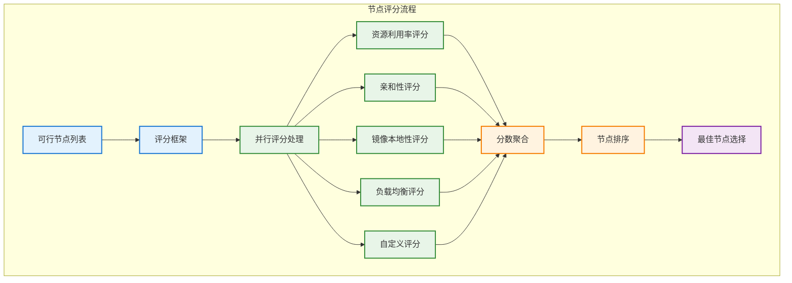

# 节点评分算法

## 概述

节点评分算法是 Kubernetes 调度过程的第二阶段，在过滤阶段筛选出候选节点后，评分阶段会对这些节点进行打分排序，选择最优节点来运行 Pod。评分算法通过多个评分插件的组合，实现负载均衡、资源优化和应用亲和性等调度目标。

## 评分算法架构



## 评分算法实现

### 评分框架核心

```go
// 评分插件接口
type ScorePlugin interface {
    Plugin
    Score(ctx context.Context, state *CycleState, pod *v1.Pod, nodeName string) (int64, *Status)
    ScoreExtensions() ScoreExtensions
}

// 评分扩展接口
type ScoreExtensions interface {
    NormalizeScore(ctx context.Context, state *CycleState, pod *v1.Pod, scores NodeScoreList) *Status
}

// 评分框架实现
type ScoringFramework struct {
    plugins []ScorePlugin
    weights map[string]int32
    handle  Handle
}

func (sf *ScoringFramework) RunScorePlugins(
    ctx context.Context,
    state *CycleState,
    pod *v1.Pod,
    nodes []*v1.Node,
) (PluginToNodeScores, *Status) {
    
    pluginToNodeScores := make(PluginToNodeScores, len(sf.plugins))
    
    // 并行执行所有评分插件
    var wg sync.WaitGroup
    errCh := make(chan error, len(sf.plugins))
    
    for i, plugin := range sf.plugins {
        wg.Add(1)
        go func(index int, pl ScorePlugin) {
            defer wg.Done()
            
            scores := make(NodeScoreList, len(nodes))
            
            // 为每个节点打分
            for j, node := range nodes {
                score, status := pl.Score(ctx, state, pod, node.Name)
                if !status.IsSuccess() {
                    errCh <- fmt.Errorf("plugin %s score failed: %v", pl.Name(), status.AsError())
                    return
                }
                scores[j] = NodeScore{
                    Name:  node.Name,
                    Score: score,
                }
            }
            
            // 标准化分数
            if pl.ScoreExtensions() != nil {
                if status := pl.ScoreExtensions().NormalizeScore(ctx, state, pod, scores); !status.IsSuccess() {
                    errCh <- fmt.Errorf("plugin %s normalize failed: %v", pl.Name(), status.AsError())
                    return
                }
            }
            
            pluginToNodeScores[pl.Name()] = scores
            
        }(i, plugin)
    }
    
    wg.Wait()
    close(errCh)
    
    // 检查错误
    if err := <-errCh; err != nil {
        return nil, NewStatus(Error, err.Error())
    }
    
    return pluginToNodeScores, nil
}

// 分数聚合
func (sf *ScoringFramework) AggregateScores(
    pluginToNodeScores PluginToNodeScores,
    nodes []*v1.Node,
) NodeScoreList {
    
    result := make(NodeScoreList, len(nodes))
    
    for i, node := range nodes {
        totalScore := int64(0)
        
        for pluginName, scores := range pluginToNodeScores {
            weight := sf.weights[pluginName]
            if weight == 0 {
                weight = 1 // 默认权重
            }
            
            pluginScore := scores[i].Score
            weightedScore := pluginScore * int64(weight)
            totalScore += weightedScore
        }
        
        result[i] = NodeScore{
            Name:  node.Name,
            Score: totalScore,
        }
    }
    
    return result
}
```

## 核心评分插件

### 1. NodeResourcesFit - 资源利用率评分

```go
// 资源利用率评分插件
type NodeResourcesFit struct {
    handle          Handle
    scoringStrategy *ScoringStrategy
}

type ScoringStrategy struct {
    Type      ScoringStrategyType
    Resources []ResourceSpec
}

type ResourceSpec struct {
    Name   string
    Weight int64
}

const (
    LeastAllocated ScoringStrategyType = "LeastAllocated"
    MostAllocated  ScoringStrategyType = "MostAllocated"
    RequestedToCapacityRatio ScoringStrategyType = "RequestedToCapacityRatio"
)

func (f *NodeResourcesFit) Score(
    ctx context.Context,
    state *CycleState,
    pod *v1.Pod,
    nodeName string,
) (int64, *Status) {
    
    nodeInfo, err := f.handle.SnapshotSharedLister().NodeInfos().Get(nodeName)
    if err != nil {
        return 0, NewStatus(Error, fmt.Sprintf("getting node %q: %v", nodeName, err))
    }
    
    return f.score(pod, nodeInfo)
}

func (f *NodeResourcesFit) score(pod *v1.Pod, nodeInfo *NodeInfo) (int64, *Status) {
    node := nodeInfo.Node()
    if node == nil {
        return 0, NewStatus(Error, "node not found")
    }
    
    // 计算资源使用情况
    allocatable := nodeInfo.Allocatable
    requested := nodeInfo.Requested
    podRequest := f.calculatePodResourceRequest(pod)
    
    switch f.scoringStrategy.Type {
    case LeastAllocated:
        return f.leastAllocatedScore(allocatable, requested, podRequest)
    case MostAllocated:
        return f.mostAllocatedScore(allocatable, requested, podRequest)
    case RequestedToCapacityRatio:
        return f.requestedToCapacityRatioScore(allocatable, requested, podRequest)
    default:
        return f.leastAllocatedScore(allocatable, requested, podRequest)
    }
}

// 最少分配策略：倾向于资源使用率低的节点
func (f *NodeResourcesFit) leastAllocatedScore(
    allocatable, requested, podRequest *Resource,
) (int64, *Status) {
    
    var totalScore float64
    var weightSum int64
    
    for _, resource := range f.scoringStrategy.Resources {
        resourceName := v1.ResourceName(resource.Name)
        weight := resource.Weight
        
        var capacity, used int64
        
        switch resourceName {
        case v1.ResourceCPU:
            capacity = allocatable.MilliCPU
            used = requested.MilliCPU + podRequest.MilliCPU
        case v1.ResourceMemory:
            capacity = allocatable.Memory
            used = requested.Memory + podRequest.Memory
        case v1.ResourceEphemeralStorage:
            capacity = allocatable.EphemeralStorage
            used = requested.EphemeralStorage + podRequest.EphemeralStorage
        default:
            // 扩展资源
            if cap, ok := allocatable.ScalarResources[resourceName]; ok {
                capacity = cap
                used = requested.ScalarResources[resourceName] + podRequest.ScalarResources[resourceName]
            } else {
                continue
            }
        }
        
        if capacity == 0 {
            continue
        }
        
        // 计算利用率（0-100）
        utilization := float64(used) / float64(capacity) * 100
        
        // 分数 = (100 - 利用率) * 权重
        score := (100 - utilization) * float64(weight)
        totalScore += score
        weightSum += weight
    }
    
    if weightSum == 0 {
        return 0, nil
    }
    
    // 返回加权平均分数
    finalScore := int64(totalScore / float64(weightSum))
    if finalScore < 0 {
        finalScore = 0
    } else if finalScore > 100 {
        finalScore = 100
    }
    
    return finalScore, nil
}

// 最多分配策略：倾向于资源使用率高的节点
func (f *NodeResourcesFit) mostAllocatedScore(
    allocatable, requested, podRequest *Resource,
) (int64, *Status) {
    
    score, status := f.leastAllocatedScore(allocatable, requested, podRequest)
    if !status.IsSuccess() {
        return 0, status
    }
    
    // 反转分数
    return 100 - score, nil
}

// 请求容量比策略：根据预定义的比例函数打分
func (f *NodeResourcesFit) requestedToCapacityRatioScore(
    allocatable, requested, podRequest *Resource,
) (int64, *Status) {
    
    var totalScore float64
    var weightSum int64
    
    for _, resource := range f.scoringStrategy.Resources {
        resourceName := v1.ResourceName(resource.Name)
        weight := resource.Weight
        
        var capacity, used int64
        
        // 获取资源容量和使用量（类似 leastAllocatedScore）
        switch resourceName {
        case v1.ResourceCPU:
            capacity = allocatable.MilliCPU
            used = requested.MilliCPU + podRequest.MilliCPU
        case v1.ResourceMemory:
            capacity = allocatable.Memory
            used = requested.Memory + podRequest.Memory
        default:
            continue
        }
        
        if capacity == 0 {
            continue
        }
        
        ratio := float64(used) / float64(capacity)
        
        // 使用分段线性函数计算分数
        score := f.calculateRatioScore(ratio) * float64(weight)
        totalScore += score
        weightSum += weight
    }
    
    if weightSum == 0 {
        return 0, nil
    }
    
    return int64(totalScore / float64(weightSum)), nil
}

func (f *NodeResourcesFit) calculateRatioScore(ratio float64) float64 {
    // 分段线性函数示例
    // 0-40%: 分数 0-20
    // 40%-80%: 分数 20-100
    // 80%-100%: 分数 100-0
    
    if ratio <= 0.4 {
        return ratio * 50 // 0-20
    } else if ratio <= 0.8 {
        return 20 + (ratio-0.4)*200 // 20-100
    } else {
        return 100 - (ratio-0.8)*500 // 100-0
    }
}
```

### 2. InterPodAffinity - Pod间亲和性评分

```go
// Pod间亲和性评分插件
type InterPodAffinity struct {
    handle Handle
}

func (pl *InterPodAffinity) Score(
    ctx context.Context,
    state *CycleState,
    pod *v1.Pod,
    nodeName string,
) (int64, *Status) {
    
    nodeInfo, err := pl.handle.SnapshotSharedLister().NodeInfos().Get(nodeName)
    if err != nil {
        return 0, NewStatus(Error, fmt.Sprintf("getting node %q: %v", nodeName, err))
    }
    
    node := nodeInfo.Node()
    if node == nil {
        return 0, NewStatus(Error, "node not found")
    }
    
    var totalScore int64
    
    // 计算 Pod 亲和性分数
    if pod.Spec.Affinity != nil && pod.Spec.Affinity.PodAffinity != nil {
        affinityScore := pl.calculateAffinityScore(pod, node, nodeInfo.Pods)
        totalScore += affinityScore
    }
    
    // 计算 Pod 反亲和性分数
    if pod.Spec.Affinity != nil && pod.Spec.Affinity.PodAntiAffinity != nil {
        antiAffinityScore := pl.calculateAntiAffinityScore(pod, node, nodeInfo.Pods)
        totalScore -= antiAffinityScore
    }
    
    return totalScore, nil
}

func (pl *InterPodAffinity) calculateAffinityScore(
    pod *v1.Pod,
    node *v1.Node,
    existingPods []*PodInfo,
) int64 {
    
    var score int64
    
    // 处理软亲和性规则
    for _, term := range pod.Spec.Affinity.PodAffinity.PreferredDuringSchedulingIgnoredDuringExecution {
        matches := 0
        
        // 统计匹配的 Pod 数量
        for _, existingPod := range existingPods {
            if pl.podMatchesAffinityTerm(existingPod.Pod, &term.PodAffinityTerm, node) {
                matches++
            }
        }
        
        // 权重 * 匹配数量
        score += int64(term.Weight * int32(matches))
    }
    
    return score
}

func (pl *InterPodAffinity) calculateAntiAffinityScore(
    pod *v1.Pod,
    node *v1.Node,
    existingPods []*PodInfo,
) int64 {
    
    var score int64
    
    // 处理软反亲和性规则
    for _, term := range pod.Spec.Affinity.PodAntiAffinity.PreferredDuringSchedulingIgnoredDuringExecution {
        matches := 0
        
        // 统计匹配的 Pod 数量
        for _, existingPod := range existingPods {
            if pl.podMatchesAffinityTerm(existingPod.Pod, &term.PodAffinityTerm, node) {
                matches++
            }
        }
        
        // 反亲和性：匹配越多分数越高（用于后续减分）
        score += int64(term.Weight * int32(matches))
    }
    
    return score
}

func (pl *InterPodAffinity) podMatchesAffinityTerm(
    pod *v1.Pod,
    term *v1.PodAffinityTerm,
    node *v1.Node,
) bool {
    
    // 检查标签选择器
    if term.LabelSelector != nil {
        selector, err := metav1.LabelSelectorAsSelector(term.LabelSelector)
        if err != nil {
            return false
        }
        
        if !selector.Matches(labels.Set(pod.Labels)) {
            return false
        }
    }
    
    // 检查命名空间
    if len(term.Namespaces) > 0 {
        namespaceMatched := false
        for _, ns := range term.Namespaces {
            if ns == pod.Namespace {
                namespaceMatched = true
                break
            }
        }
        if !namespaceMatched {
            return false
        }
    }
    
    // 检查拓扑域
    topologyKey := term.TopologyKey
    if topologyKey != "" {
        return node.Labels[topologyKey] != ""
    }
    
    return true
}
```

### 3. ImageLocality - 镜像本地性评分

```go
// 镜像本地性评分插件
type ImageLocality struct {
    handle Handle
}

func (pl *ImageLocality) Score(
    ctx context.Context,
    state *CycleState,
    pod *v1.Pod,
    nodeName string,
) (int64, *Status) {
    
    nodeInfo, err := pl.handle.SnapshotSharedLister().NodeInfos().Get(nodeName)
    if err != nil {
        return 0, NewStatus(Error, fmt.Sprintf("getting node %q: %v", nodeName, err))
    }
    
    node := nodeInfo.Node()
    if node == nil {
        return 0, NewStatus(Error, "node not found")
    }
    
    return pl.calculateImageScore(pod, node), nil
}

func (pl *ImageLocality) calculateImageScore(pod *v1.Pod, node *v1.Node) int64 {
    var totalScore int64
    
    // 检查所有容器镜像
    for _, container := range pod.Spec.Containers {
        imageScore := pl.getImageScore(node, container.Image)
        totalScore += imageScore
    }
    
    // 检查初始化容器镜像
    for _, container := range pod.Spec.InitContainers {
        imageScore := pl.getImageScore(node, container.Image)
        totalScore += imageScore
    }
    
    // 限制最大分数
    if totalScore > 100 {
        totalScore = 100
    }
    
    return totalScore
}

func (pl *ImageLocality) getImageScore(node *v1.Node, imageName string) int64 {
    if node.Status.Images == nil {
        return 0
    }
    
    // 查找镜像
    for _, nodeImage := range node.Status.Images {
        for _, name := range nodeImage.Names {
            if pl.imageMatches(name, imageName) {
                // 根据镜像大小计算分数
                return pl.calculateScoreBySize(nodeImage.SizeBytes)
            }
        }
    }
    
    return 0
}

func (pl *ImageLocality) imageMatches(nodImageName, podImageName string) bool {
    // 精确匹配
    if nodImageName == podImageName {
        return true
    }
    
    // 处理镜像标签（例如：nginx:latest vs nginx）
    nodeRepo, nodeTag := pl.parseImageName(nodImageName)
    podRepo, podTag := pl.parseImageName(podImageName)
    
    // 仓库匹配且标签兼容
    if nodeRepo == podRepo {
        if podTag == "latest" && nodeTag != "" {
            return true
        }
        if nodeTag == "latest" && podTag != "" {
            return true
        }
    }
    
    return false
}

func (pl *ImageLocality) parseImageName(imageName string) (repo, tag string) {
    parts := strings.SplitN(imageName, ":", 2)
    repo = parts[0]
    if len(parts) > 1 {
        tag = parts[1]
    } else {
        tag = "latest"
    }
    return
}

func (pl *ImageLocality) calculateScoreBySize(sizeBytes int64) int64 {
    // 根据镜像大小计算分数
    sizeMB := sizeBytes / (1024 * 1024)
    
    if sizeMB <= 100 {
        return 20 // 小镜像
    } else if sizeMB <= 500 {
        return 15 // 中等镜像
    } else if sizeMB <= 1000 {
        return 10 // 大镜像
    } else {
        return 5 // 非常大的镜像
    }
}
```

### 4. NodeAffinity - 节点亲和性评分

```go
// 节点亲和性评分插件
type NodeAffinity struct {
    handle Handle
}

func (na *NodeAffinity) Score(
    ctx context.Context,
    state *CycleState,
    pod *v1.Pod,
    nodeName string,
) (int64, *Status) {
    
    node, err := na.handle.SnapshotSharedLister().NodeInfos().Get(nodeName)
    if err != nil {
        return 0, NewStatus(Error, fmt.Sprintf("getting node %q: %v", nodeName, err))
    }
    
    if node.Node() == nil {
        return 0, NewStatus(Error, "node not found")
    }
    
    return na.calculateNodeAffinityScore(pod, node.Node()), nil
}

func (na *NodeAffinity) calculateNodeAffinityScore(pod *v1.Pod, node *v1.Node) int64 {
    if pod.Spec.Affinity == nil || pod.Spec.Affinity.NodeAffinity == nil {
        return 0
    }
    
    nodeAffinity := pod.Spec.Affinity.NodeAffinity
    var totalScore int64
    
    // 处理软性节点亲和性
    if nodeAffinity.PreferredDuringSchedulingIgnoredDuringExecution != nil {
        for _, term := range nodeAffinity.PreferredDuringSchedulingIgnoredDuringExecution {
            if na.nodeMatchesNodeSelectorTerm(node, term.Preference) {
                totalScore += int64(term.Weight)
            }
        }
    }
    
    return totalScore
}

func (na *NodeAffinity) nodeMatchesNodeSelectorTerm(
    node *v1.Node,
    term v1.NodeSelectorTerm,
) bool {
    
    // 检查标签表达式
    for _, req := range term.MatchExpressions {
        if !na.nodeMatchesLabelRequirement(node, req) {
            return false
        }
    }
    
    // 检查字段表达式
    for _, req := range term.MatchFields {
        if !na.nodeMatchesFieldRequirement(node, req) {
            return false
        }
    }
    
    return true
}

func (na *NodeAffinity) nodeMatchesLabelRequirement(
    node *v1.Node,
    req v1.NodeSelectorRequirement,
) bool {
    
    nodeLabels := labels.Set(node.Labels)
    
    switch req.Operator {
    case v1.NodeSelectorOpIn:
        if !nodeLabels.Has(req.Key) {
            return false
        }
        return sets.NewString(req.Values...).Has(nodeLabels.Get(req.Key))
        
    case v1.NodeSelectorOpNotIn:
        if !nodeLabels.Has(req.Key) {
            return true
        }
        return !sets.NewString(req.Values...).Has(nodeLabels.Get(req.Key))
        
    case v1.NodeSelectorOpExists:
        return nodeLabels.Has(req.Key)
        
    case v1.NodeSelectorOpDoesNotExist:
        return !nodeLabels.Has(req.Key)
        
    case v1.NodeSelectorOpGt:
        if !nodeLabels.Has(req.Key) {
            return false
        }
        nodeValue, err := strconv.ParseInt(nodeLabels.Get(req.Key), 10, 64)
        if err != nil {
            return false
        }
        reqValue, err := strconv.ParseInt(req.Values[0], 10, 64)
        if err != nil {
            return false
        }
        return nodeValue > reqValue
        
    case v1.NodeSelectorOpLt:
        if !nodeLabels.Has(req.Key) {
            return false
        }
        nodeValue, err := strconv.ParseInt(nodeLabels.Get(req.Key), 10, 64)
        if err != nil {
            return false
        }
        reqValue, err := strconv.ParseInt(req.Values[0], 10, 64)
        if err != nil {
            return false
        }
        return nodeValue < reqValue
        
    default:
        return false
    }
}
```

## 高级评分特性

### 自定义评分插件

```go
// 自定义评分插件
type CustomScorePlugin struct {
    name   string
    config *CustomScoreConfig
    handle Handle
}

type CustomScoreConfig struct {
    Metrics []MetricConfig `json:"metrics"`
    Weights map[string]int32 `json:"weights"`
}

type MetricConfig struct {
    Name     string  `json:"name"`
    Resource string  `json:"resource"`
    Target   float64 `json:"target"`
    Weight   int32   `json:"weight"`
}

func (csp *CustomScorePlugin) Score(
    ctx context.Context,
    state *CycleState,
    pod *v1.Pod,
    nodeName string,
) (int64, *Status) {
    
    nodeInfo, err := csp.handle.SnapshotSharedLister().NodeInfos().Get(nodeName)
    if err != nil {
        return 0, NewStatus(Error, fmt.Sprintf("getting node %q: %v", nodeName, err))
    }
    
    var totalScore float64
    var totalWeight int32
    
    for _, metric := range csp.config.Metrics {
        score := csp.calculateMetricScore(nodeInfo, metric)
        totalScore += score * float64(metric.Weight)
        totalWeight += metric.Weight
    }
    
    if totalWeight == 0 {
        return 0, nil
    }
    
    finalScore := int64(totalScore / float64(totalWeight))
    return finalScore, nil
}

func (csp *CustomScorePlugin) calculateMetricScore(
    nodeInfo *NodeInfo,
    metric MetricConfig,
) float64 {
    
    switch metric.Name {
    case "cpu-temperature":
        return csp.scoreCPUTemperature(nodeInfo, metric.Target)
    case "network-bandwidth":
        return csp.scoreNetworkBandwidth(nodeInfo, metric.Target)
    case "disk-iops":
        return csp.scoreDiskIOPS(nodeInfo, metric.Target)
    default:
        return 0
    }
}

func (csp *CustomScorePlugin) scoreCPUTemperature(
    nodeInfo *NodeInfo,
    target float64,
) float64 {
    
    // 从节点注解中获取 CPU 温度
    node := nodeInfo.Node()
    if node == nil {
        return 0
    }
    
    tempStr, ok := node.Annotations["cpu-temperature"]
    if !ok {
        return 0
    }
    
    temp, err := strconv.ParseFloat(tempStr, 64)
    if err != nil {
        return 0
    }
    
    // 温度越接近目标值分数越高
    diff := math.Abs(temp - target)
    if diff <= 5 {
        return 100
    } else if diff <= 10 {
        return 80
    } else if diff <= 15 {
        return 60
    } else {
        return 20
    }
}
```

### 分数标准化

```go
// 分数标准化扩展
type ScoreNormalizer struct {
    plugin ScorePlugin
}

func (sn *ScoreNormalizer) NormalizeScore(
    ctx context.Context,
    state *CycleState,
    pod *v1.Pod,
    scores NodeScoreList,
) *Status {
    
    if len(scores) == 0 {
        return nil
    }
    
    // 找到最大和最小分数
    var maxScore, minScore int64 = scores[0].Score, scores[0].Score
    for _, nodeScore := range scores {
        if nodeScore.Score > maxScore {
            maxScore = nodeScore.Score
        }
        if nodeScore.Score < minScore {
            minScore = nodeScore.Score
        }
    }
    
    // 避免除零错误
    scoreRange := maxScore - minScore
    if scoreRange == 0 {
        for i := range scores {
            scores[i].Score = 100
        }
        return nil
    }
    
    // 标准化到 0-100 范围
    for i, nodeScore := range scores {
        normalizedScore := (nodeScore.Score - minScore) * 100 / scoreRange
        scores[i].Score = normalizedScore
    }
    
    return nil
}
```

### 多目标优化

```go
// 多目标优化评分器
type MultiObjectiveScorer struct {
    objectives []ScoringObjective
    weights    []float64
}

type ScoringObjective struct {
    Name   string
    Plugin ScorePlugin
    Weight float64
    Target OptimizationTarget
}

type OptimizationTarget int

const (
    Maximize OptimizationTarget = iota
    Minimize
    Balance
)

func (mos *MultiObjectiveScorer) Score(
    ctx context.Context,
    state *CycleState,
    pod *v1.Pod,
    nodes []*v1.Node,
) (NodeScoreList, error) {
    
    objectiveScores := make([]NodeScoreList, len(mos.objectives))
    
    // 获取每个目标的分数
    for i, objective := range mos.objectives {
        scores := make(NodeScoreList, len(nodes))
        
        for j, node := range nodes {
            score, status := objective.Plugin.Score(ctx, state, pod, node.Name)
            if !status.IsSuccess() {
                return nil, status.AsError()
            }
            scores[j] = NodeScore{Name: node.Name, Score: score}
        }
        
        // 根据优化目标调整分数
        mos.adjustScoresByTarget(scores, objective.Target)
        objectiveScores[i] = scores
    }
    
    // 多目标聚合
    return mos.aggregateObjectiveScores(objectiveScores, nodes), nil
}

func (mos *MultiObjectiveScorer) adjustScoresByTarget(
    scores NodeScoreList,
    target OptimizationTarget,
) {
    
    switch target {
    case Minimize:
        // 反转分数（最小化变为最大化）
        for i := range scores {
            scores[i].Score = 100 - scores[i].Score
        }
        
    case Balance:
        // 计算平衡分数（偏离平均值的程度）
        total := int64(0)
        for _, score := range scores {
            total += score.Score
        }
        average := total / int64(len(scores))
        
        for i := range scores {
            deviation := int64(math.Abs(float64(scores[i].Score - average)))
            scores[i].Score = 100 - deviation
        }
    }
}

func (mos *MultiObjectiveScorer) aggregateObjectiveScores(
    objectiveScores []NodeScoreList,
    nodes []*v1.Node,
) NodeScoreList {
    
    result := make(NodeScoreList, len(nodes))
    
    for i, node := range nodes {
        var weightedSum float64
        var weightTotal float64
        
        for j, scores := range objectiveScores {
            weight := mos.objectives[j].Weight
            score := float64(scores[i].Score)
            
            weightedSum += score * weight
            weightTotal += weight
        }
        
        finalScore := int64(weightedSum / weightTotal)
        result[i] = NodeScore{
            Name:  node.Name,
            Score: finalScore,
        }
    }
    
    return result
}
```

## 性能优化

### 评分缓存

```go
// 评分缓存管理器
type ScoreCache struct {
    cache     map[string]*ScoreCacheEntry
    mutex     sync.RWMutex
    ttl       time.Duration
    maxSize   int
}

type ScoreCacheEntry struct {
    PodHash   string
    NodeName  string
    Score     int64
    Timestamp time.Time
}

func (sc *ScoreCache) Get(podHash, nodeName string) (int64, bool) {
    sc.mutex.RLock()
    defer sc.mutex.RUnlock()
    
    key := fmt.Sprintf("%s-%s", podHash, nodeName)
    entry, exists := sc.cache[key]
    if !exists {
        return 0, false
    }
    
    // 检查过期
    if time.Since(entry.Timestamp) > sc.ttl {
        return 0, false
    }
    
    return entry.Score, true
}

func (sc *ScoreCache) Set(podHash, nodeName string, score int64) {
    sc.mutex.Lock()
    defer sc.mutex.Unlock()
    
    // 检查缓存大小限制
    if len(sc.cache) >= sc.maxSize {
        sc.evictOldest()
    }
    
    key := fmt.Sprintf("%s-%s", podHash, nodeName)
    sc.cache[key] = &ScoreCacheEntry{
        PodHash:   podHash,
        NodeName:  nodeName,
        Score:     score,
        Timestamp: time.Now(),
    }
}

func (sc *ScoreCache) evictOldest() {
    var oldestKey string
    var oldestTime time.Time
    
    for key, entry := range sc.cache {
        if oldestKey == "" || entry.Timestamp.Before(oldestTime) {
            oldestKey = key
            oldestTime = entry.Timestamp
        }
    }
    
    if oldestKey != "" {
        delete(sc.cache, oldestKey)
    }
}
```

### 并行评分优化

```go
// 并行评分管理器
type ParallelScorer struct {
    plugins    []ScorePlugin
    maxWorkers int
    semaphore  chan struct{}
}

func NewParallelScorer(plugins []ScorePlugin, maxWorkers int) *ParallelScorer {
    return &ParallelScorer{
        plugins:    plugins,
        maxWorkers: maxWorkers,
        semaphore:  make(chan struct{}, maxWorkers),
    }
}

func (ps *ParallelScorer) ScoreNodes(
    ctx context.Context,
    state *CycleState,
    pod *v1.Pod,
    nodes []*v1.Node,
) (PluginToNodeScores, error) {
    
    pluginToNodeScores := make(PluginToNodeScores, len(ps.plugins))
    
    var wg sync.WaitGroup
    errCh := make(chan error, len(ps.plugins))
    
    for _, plugin := range ps.plugins {
        wg.Add(1)
        
        go func(pl ScorePlugin) {
            defer wg.Done()
            
            // 获取并发许可
            ps.semaphore <- struct{}{}
            defer func() { <-ps.semaphore }()
            
            scores, err := ps.scoreNodesForPlugin(ctx, state, pod, nodes, pl)
            if err != nil {
                errCh <- err
                return
            }
            
            pluginToNodeScores[pl.Name()] = scores
        }(plugin)
    }
    
    wg.Wait()
    close(errCh)
    
    // 检查错误
    if err := <-errCh; err != nil {
        return nil, err
    }
    
    return pluginToNodeScores, nil
}

func (ps *ParallelScorer) scoreNodesForPlugin(
    ctx context.Context,
    state *CycleState,
    pod *v1.Pod,
    nodes []*v1.Node,
    plugin ScorePlugin,
) (NodeScoreList, error) {
    
    scores := make(NodeScoreList, len(nodes))
    
    // 为每个节点评分
    for i, node := range nodes {
        score, status := plugin.Score(ctx, state, pod, node.Name)
        if !status.IsSuccess() {
            return nil, status.AsError()
        }
        
        scores[i] = NodeScore{
            Name:  node.Name,
            Score: score,
        }
    }
    
    return scores, nil
}
```

## 监控和调试

### 评分指标

```go
// 评分监控指标
var (
    scoringDuration = prometheus.NewHistogramVec(
        prometheus.HistogramOpts{
            Name: "scheduler_scoring_duration_seconds",
            Help: "Scoring duration in seconds",
            Buckets: []float64{0.001, 0.01, 0.1, 1.0},
        },
        []string{"plugin"},
    )
    
    scoreDistribution = prometheus.NewHistogramVec(
        prometheus.HistogramOpts{
            Name: "scheduler_node_scores",
            Help: "Distribution of node scores",
            Buckets: prometheus.LinearBuckets(0, 10, 11),
        },
        []string{"plugin"},
    )
    
    scoringTotal = prometheus.NewCounterVec(
        prometheus.CounterOpts{
            Name: "scheduler_scoring_attempts_total",
            Help: "Total number of scoring attempts",
        },
        []string{"plugin", "result"},
    )
)

func recordScoringMetrics(plugin string, duration time.Duration, scores NodeScoreList) {
    scoringDuration.WithLabelValues(plugin).Observe(duration.Seconds())
    scoringTotal.WithLabelValues(plugin, "success").Inc()
    
    for _, score := range scores {
        scoreDistribution.WithLabelValues(plugin).Observe(float64(score.Score))
    }
}
```

### 评分调试工具

```go
// 评分调试器
type ScoreDebugger struct {
    logger klog.Logger
}

func (sd *ScoreDebugger) LogScoringResult(
    pod *v1.Pod,
    pluginToNodeScores PluginToNodeScores,
    finalScores NodeScoreList,
) {
    
    sd.logger.InfoS("Scoring completed",
        "pod", klog.KObj(pod),
        "nodes", len(finalScores))
    
    // 记录每个插件的分数
    for plugin, scores := range pluginToNodeScores {
        sd.logger.V(4).InfoS("Plugin scores",
            "pod", klog.KObj(pod),
            "plugin", plugin,
            "scores", sd.formatScores(scores))
    }
    
    // 记录最终排序
    sort.Slice(finalScores, func(i, j int) bool {
        return finalScores[i].Score > finalScores[j].Score
    })
    
    sd.logger.InfoS("Final node ranking",
        "pod", klog.KObj(pod),
        "ranking", sd.formatScores(finalScores[:min(5, len(finalScores))]))
}

func (sd *ScoreDebugger) formatScores(scores NodeScoreList) string {
    var parts []string
    for _, score := range scores {
        parts = append(parts, fmt.Sprintf("%s:%d", score.Name, score.Score))
    }
    return strings.Join(parts, ", ")
}
```

## 最佳实践

### 评分策略设计

1. **平衡多个目标**：
   - 资源利用率优化
   - 应用性能需求
   - 硬件特性利用
   - 故障域分散

2. **权重配置优化**：
   - 根据集群特点调整插件权重
   - 考虑工作负载类型差异
   - 定期评估和调整权重

3. **自定义评分插件**：
   - 针对特定需求开发插件
   - 利用外部监控数据
   - 实现业务逻辑相关评分

### 性能优化建议

1. **缓存策略**：
   - 缓存重复的评分计算
   - 设置合适的缓存TTL
   - 定期清理过期缓存

2. **并发控制**：
   - 合理设置并发评分数量
   - 避免过多并发导致资源竞争
   - 使用工作池模式

3. **评分范围限制**：
   - 限制参与评分的节点数量
   - 优先评分资源充足的节点
   - 跳过明显不合适的节点

### 故障排查

1. **评分异常诊断**：
   ```bash
   # 查看调度器日志中的评分信息
   kubectl logs -n kube-system deployment/kube-scheduler | grep -i score
   
   # 检查特定 Pod 的调度事件
   kubectl describe pod <pod-name> | grep -A 10 -B 10 Events
   ```

2. **评分插件调试**：
   - 启用详细日志级别
   - 使用调度器调试工具
   - 分析各插件的分数分布
   - 验证权重配置的合理性
