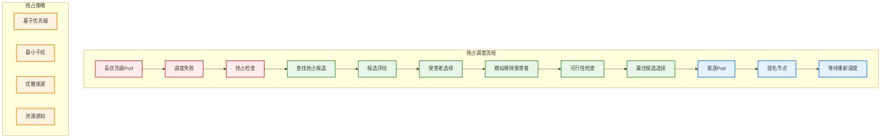

# 抢占调度机制

## 概述

抢占调度是 Kubernetes 调度器的高级特性，当高优先级的 Pod 无法被调度到任何节点时，调度器会选择驱逐一些低优先级的 Pod 来为高优先级 Pod 腾出资源。这个机制确保了重要工作负载能够及时获得所需的计算资源。

## 抢占调度架构



## 抢占调度实现

### 抢占器核心接口

```go
// 抢占器接口
type Preemptor interface {
    Preempt(ctx context.Context, pod *v1.Pod, m NodeToStatusMap) (*PostFilterResult, *Status)
}

// 抢占结果
type PostFilterResult struct {
    NominatedNodeName string
}

// 抢占候选
type Candidate struct {
    Victims []*v1.Pod
    Node    *v1.Node
    Name    string
    PodSpecs []*PodSpec
}

// 默认抢占器实现
type DefaultPreemptor struct {
    handle                    Handle
    podLister                corelisters.PodLister
    pdbLister                policylisters.PodDisruptionBudgetLister
    nominatedNodeName        string
}

func (dp *DefaultPreemptor) Preempt(
    ctx context.Context,
    preemptor *v1.Pod,
    nodeToStatusMap NodeToStatusMap,
) (*PostFilterResult, *Status) {
    
    // 1. 检查 Pod 是否有足够高的优先级进行抢占
    if !dp.PodEligibleToPreemptOthers(preemptor, nodeToStatusMap) {
        return nil, NewStatus(Unschedulable, "Pod priority too low for preemption")
    }
    
    // 2. 查找所有可能的抢占候选
    candidates, err := dp.FindCandidates(ctx, preemptor, nodeToStatusMap)
    if err != nil {
        return nil, NewStatus(Error, err.Error())
    }
    
    if len(candidates) == 0 {
        return nil, NewStatus(Unschedulable, "No preemption candidates found")
    }
    
    // 3. 选择最佳候选
    bestCandidate := dp.SelectCandidate(candidates)
    if bestCandidate == nil {
        return nil, NewStatus(Unschedulable, "No suitable candidate found")
    }
    
    // 4. 执行抢占
    if err := dp.PrepareCandidate(ctx, bestCandidate, preemptor); err != nil {
        return nil, NewStatus(Error, err.Error())
    }
    
    return &PostFilterResult{
        NominatedNodeName: bestCandidate.Name,
    }, nil
}
```

### 优先级检查

```go
// 检查 Pod 是否有足够的优先级进行抢占
func (dp *DefaultPreemptor) PodEligibleToPreemptOthers(
    pod *v1.Pod,
    nodeToStatusMap NodeToStatusMap,
) bool {
    
    // 检查 Pod 是否有优先级
    if pod.Spec.Priority == nil {
        return false
    }
    
    priority := *pod.Spec.Priority
    
    // 优先级必须大于 0 才能抢占
    if priority <= 0 {
        return false
    }
    
    // 检查是否因为优先级问题被过滤
    for _, status := range nodeToStatusMap {
        if !status.IsSuccess() {
            // 如果有非优先级相关的问题，不进行抢占
            if !dp.isPreemptableFailure(status) {
                return false
            }
        }
    }
    
    return true
}

// 检查失败原因是否可以通过抢占解决
func (dp *DefaultPreemptor) isPreemptableFailure(status *Status) bool {
    switch status.Code() {
    case UnschedulableAndUnresolvable:
        return false
    case Unschedulable:
        // 检查具体的不可调度原因
        for _, reason := range status.Reasons() {
            switch reason {
            case "Insufficient cpu", "Insufficient memory", "Insufficient pods":
                return true
            case "node(s) had taint", "node(s) didn't match Pod's node affinity":
                return false
            }
        }
    }
    return false
}
```

### 候选查找

```go
// 查找抢占候选
func (dp *DefaultPreemptor) FindCandidates(
    ctx context.Context,
    pod *v1.Pod,
    nodeToStatusMap NodeToStatusMap,
) ([]*Candidate, error) {
    
    allNodes, err := dp.handle.SnapshotSharedLister().NodeInfos().List()
    if err != nil {
        return nil, err
    }
    
    var candidates []*Candidate
    
    for _, nodeInfo := range allNodes {
        node := nodeInfo.Node()
        if node == nil {
            continue
        }
        
        // 检查节点是否适合抢占
        if !dp.canPreemptOnNode(pod, nodeInfo) {
            continue
        }
        
        // 查找该节点上的受害者 Pod
        victims := dp.selectVictimsOnNode(ctx, pod, nodeInfo)
        if len(victims) == 0 {
            continue
        }
        
        // 模拟移除受害者后的调度
        if dp.simulateSchedulingAfterPreemption(ctx, pod, victims, nodeInfo) {
            candidate := &Candidate{
                Victims: victims,
                Node:    node,
                Name:    node.Name,
            }
            candidates = append(candidates, candidate)
        }
    }
    
    return candidates, nil
}

// 检查节点是否可以进行抢占
func (dp *DefaultPreemptor) canPreemptOnNode(pod *v1.Pod, nodeInfo *NodeInfo) bool {
    node := nodeInfo.Node()
    
    // 检查节点是否可调度
    if node.Spec.Unschedulable {
        return false
    }
    
    // 检查节点状态
    if !dp.isNodeReady(node) {
        return false
    }
    
    // 检查节点标签和污点（基本过滤条件）
    if !dp.nodePassesBasicFilters(pod, nodeInfo) {
        return false
    }
    
    return true
}

// 在节点上选择受害者 Pod
func (dp *DefaultPreemptor) selectVictimsOnNode(
    ctx context.Context,
    preemptor *v1.Pod,
    nodeInfo *NodeInfo,
) []*v1.Pod {
    
    var victims []*v1.Pod
    preemptorPriority := int32(0)
    if preemptor.Spec.Priority != nil {
        preemptorPriority = *preemptor.Spec.Priority
    }
    
    // 收集所有可能的受害者
    var candidates []*v1.Pod
    for _, podInfo := range nodeInfo.Pods {
        pod := podInfo.Pod
        
        // 跳过系统 Pod
        if dp.isSystemPod(pod) {
            continue
        }
        
        // 只考虑优先级较低的 Pod
        podPriority := int32(0)
        if pod.Spec.Priority != nil {
            podPriority = *pod.Spec.Priority
        }
        
        if podPriority < preemptorPriority {
            candidates = append(candidates, pod)
        }
    }
    
    // 按优先级排序（优先级低的在前面）
    sort.Slice(candidates, func(i, j int) bool {
        return dp.getPodPriority(candidates[i]) < dp.getPodPriority(candidates[j])
    })
    
    // 贪心选择：选择足够的低优先级 Pod
    requiredResources := dp.getResourceRequest(preemptor)
    availableResources := nodeInfo.Allocatable.Clone()
    
    for _, candidate := range candidates {
        candidateResources := dp.getResourceRequest(candidate)
        
        // 检查 PodDisruptionBudget
        if !dp.canEvictPod(ctx, candidate) {
            continue
        }
        
        victims = append(victims, candidate)
        availableResources.Add(candidateResources)
        
        // 检查是否有足够资源
        if dp.fitsOnNode(requiredResources, availableResources) {
            break
        }
    }
    
    return victims
}
```

### 受害者选择策略

```go
// 受害者选择器
type VictimSelector struct {
    pdbLister policylisters.PodDisruptionBudgetLister
}

// 选择受害者的策略
type VictimSelectionStrategy int

const (
    LowestPriorityFirst VictimSelectionStrategy = iota
    LatestCreatedFirst
    SmallestResourceFirst
    MinimalDisruption
)

func (vs *VictimSelector) SelectVictims(
    ctx context.Context,
    preemptor *v1.Pod,
    nodeInfo *NodeInfo,
    strategy VictimSelectionStrategy,
) ([]*v1.Pod, error) {
    
    candidates := vs.getCandidatePods(preemptor, nodeInfo)
    
    switch strategy {
    case LowestPriorityFirst:
        return vs.selectByLowestPriority(ctx, preemptor, candidates)
    case LatestCreatedFirst:
        return vs.selectByLatestCreated(ctx, preemptor, candidates)
    case SmallestResourceFirst:
        return vs.selectBySmallestResource(ctx, preemptor, candidates)
    case MinimalDisruption:
        return vs.selectByMinimalDisruption(ctx, preemptor, candidates)
    default:
        return vs.selectByLowestPriority(ctx, preemptor, candidates)
    }
}

// 按最低优先级选择
func (vs *VictimSelector) selectByLowestPriority(
    ctx context.Context,
    preemptor *v1.Pod,
    candidates []*v1.Pod,
) ([]*v1.Pod, error) {
    
    // 按优先级排序
    sort.Slice(candidates, func(i, j int) bool {
        pi := int32(0)
        if candidates[i].Spec.Priority != nil {
            pi = *candidates[i].Spec.Priority
        }
        pj := int32(0)
        if candidates[j].Spec.Priority != nil {
            pj = *candidates[j].Spec.Priority
        }
        
        if pi != pj {
            return pi < pj
        }
        
        // 相同优先级按创建时间排序（较新的优先被驱逐）
        return candidates[i].CreationTimestamp.After(candidates[j].CreationTimestamp.Time)
    })
    
    return vs.selectMinimalSet(preemptor, candidates)
}

// 按最小资源选择
func (vs *VictimSelector) selectBySmallestResource(
    ctx context.Context,
    preemptor *v1.Pod,
    candidates []*v1.Pod,
) ([]*v1.Pod, error) {
    
    // 按资源使用量排序
    sort.Slice(candidates, func(i, j int) bool {
        resourceI := vs.calculatePodResourceUsage(candidates[i])
        resourceJ := vs.calculatePodResourceUsage(candidates[j])
        return resourceI < resourceJ
    })
    
    return vs.selectMinimalSet(preemptor, candidates)
}

// 选择最小的受害者集合
func (vs *VictimSelector) selectMinimalSet(
    preemptor *v1.Pod,
    sortedCandidates []*v1.Pod,
) ([]*v1.Pod, error) {
    
    requiredResources := vs.getResourceRequest(preemptor)
    var victims []*v1.Pod
    accumulatedResources := &Resource{}
    
    for _, candidate := range sortedCandidates {
        // 检查 PDB 限制
        if !vs.canEvictWithPDB(candidate) {
            continue
        }
        
        victims = append(victims, candidate)
        candidateResources := vs.getResourceRequest(candidate)
        accumulatedResources.Add(candidateResources)
        
        // 检查是否满足需求
        if vs.resourcesSufficient(accumulatedResources, requiredResources) {
            break
        }
    }
    
    return victims, nil
}

// 检查 PodDisruptionBudget 约束
func (vs *VictimSelector) canEvictWithPDB(pod *v1.Pod) bool {
    pdbs, err := vs.pdbLister.PodDisruptionBudgets(pod.Namespace).List(labels.Everything())
    if err != nil {
        return false
    }
    
    for _, pdb := range pdbs {
        selector, err := metav1.LabelSelectorAsSelector(pdb.Spec.Selector)
        if err != nil {
            continue
        }
        
        if selector.Matches(labels.Set(pod.Labels)) {
            // 检查当前是否可以驱逐（简化实现）
            if pdb.Status.DisruptionsAllowed <= 0 {
                return false
            }
        }
    }
    
    return true
}
```

### 候选评估和选择

```go
// 候选评估器
type CandidateEvaluator struct {
    handle Handle
}

// 候选评分
type CandidateScore struct {
    Candidate *Candidate
    Score     float64
}

// 评估候选的质量
func (ce *CandidateEvaluator) EvaluateCandidate(candidate *Candidate, preemptor *v1.Pod) float64 {
    var score float64
    
    // 1. 受害者数量越少越好（权重：30%）
    victimCountScore := ce.calculateVictimCountScore(candidate.Victims)
    score += victimCountScore * 0.3
    
    // 2. 受害者优先级越低越好（权重：40%）
    priorityScore := ce.calculatePriorityScore(candidate.Victims, preemptor)
    score += priorityScore * 0.4
    
    // 3. 节点资源利用率（权重：20%）
    utilizationScore := ce.calculateUtilizationScore(candidate.Node)
    score += utilizationScore * 0.2
    
    // 4. 最小干扰原则（权重：10%）
    disruptionScore := ce.calculateDisruptionScore(candidate.Victims)
    score += disruptionScore * 0.1
    
    return score
}

// 计算受害者数量分数
func (ce *CandidateEvaluator) calculateVictimCountScore(victims []*v1.Pod) float64 {
    if len(victims) == 0 {
        return 0
    }
    
    // 受害者越少分数越高
    return 100.0 / float64(len(victims))
}

// 计算优先级分数
func (ce *CandidateEvaluator) calculatePriorityScore(victims []*v1.Pod, preemptor *v1.Pod) float64 {
    preemptorPriority := int32(0)
    if preemptor.Spec.Priority != nil {
        preemptorPriority = *preemptor.Spec.Priority
    }
    
    var totalPriorityDiff int32
    for _, victim := range victims {
        victimPriority := int32(0)
        if victim.Spec.Priority != nil {
            victimPriority = *victim.Spec.Priority
        }
        
        priorityDiff := preemptorPriority - victimPriority
        totalPriorityDiff += priorityDiff
    }
    
    // 优先级差异越大分数越高
    avgPriorityDiff := float64(totalPriorityDiff) / float64(len(victims))
    return math.Min(avgPriorityDiff/100.0, 100.0)
}

// 计算节点利用率分数
func (ce *CandidateEvaluator) calculateUtilizationScore(node *v1.Node) float64 {
    nodeInfo, err := ce.handle.SnapshotSharedLister().NodeInfos().Get(node.Name)
    if err != nil {
        return 0
    }
    
    allocatable := nodeInfo.Allocatable
    requested := nodeInfo.Requested
    
    if allocatable.MilliCPU == 0 || allocatable.Memory == 0 {
        return 0
    }
    
    cpuUtil := float64(requested.MilliCPU) / float64(allocatable.MilliCPU)
    memUtil := float64(requested.Memory) / float64(allocatable.Memory)
    
    avgUtil := (cpuUtil + memUtil) / 2
    
    // 利用率适中的节点分数更高（避免极端情况）
    if avgUtil < 0.3 || avgUtil > 0.9 {
        return 20.0
    } else {
        return 80.0
    }
}

// 选择最佳候选
func (ce *CandidateEvaluator) SelectBestCandidate(candidates []*Candidate, preemptor *v1.Pod) *Candidate {
    if len(candidates) == 0 {
        return nil
    }
    
    var bestCandidate *Candidate
    var bestScore float64 = -1
    
    for _, candidate := range candidates {
        score := ce.EvaluateCandidate(candidate, preemptor)
        if score > bestScore {
            bestScore = score
            bestCandidate = candidate
        }
    }
    
    return bestCandidate
}
```

### 抢占执行

```go
// 抢占执行器
type PreemptionExecutor struct {
    client    kubernetes.Interface
    recorder  record.EventRecorder
    handle    Handle
}

// 执行抢占
func (pe *PreemptionExecutor) ExecutePreemption(
    ctx context.Context,
    candidate *Candidate,
    preemptor *v1.Pod,
) error {
    
    // 1. 记录抢占事件
    pe.recordPreemptionEvent(preemptor, candidate)
    
    // 2. 执行优雅驱逐
    if err := pe.evictPods(ctx, candidate.Victims); err != nil {
        return err
    }
    
    // 3. 提名节点
    if err := pe.nominateNode(ctx, preemptor, candidate.Node.Name); err != nil {
        return err
    }
    
    return nil
}

// 优雅驱逐 Pod
func (pe *PreemptionExecutor) evictPods(ctx context.Context, victims []*v1.Pod) error {
    for _, victim := range victims {
        if err := pe.evictPod(ctx, victim); err != nil {
            return err
        }
    }
    return nil
}

// 驱逐单个 Pod
func (pe *PreemptionExecutor) evictPod(ctx context.Context, pod *v1.Pod) error {
    // 使用 Eviction API 进行优雅驱逐
    eviction := &policyv1beta1.Eviction{
        ObjectMeta: metav1.ObjectMeta{
            Name:      pod.Name,
            Namespace: pod.Namespace,
        },
        DeleteOptions: &metav1.DeleteOptions{
            GracePeriodSeconds: pod.Spec.TerminationGracePeriodSeconds,
        },
    }
    
    err := pe.client.CoreV1().Pods(pod.Namespace).Evict(ctx, eviction)
    if err != nil && !errors.IsNotFound(err) {
        return err
    }
    
    // 记录驱逐事件
    pe.recorder.Eventf(pod, v1.EventTypeWarning, "Preempted", 
        "Pod was preempted to make room for higher priority pod")
    
    return nil
}

// 提名节点
func (pe *PreemptionExecutor) nominateNode(
    ctx context.Context,
    pod *v1.Pod,
    nodeName string,
) error {
    
    // 更新 Pod 的 nominatedNodeName 注解
    podCopy := pod.DeepCopy()
    if podCopy.Annotations == nil {
        podCopy.Annotations = make(map[string]string)
    }
    podCopy.Annotations["scheduler.alpha.kubernetes.io/nominated-node-name"] = nodeName
    
    _, err := pe.client.CoreV1().Pods(pod.Namespace).Update(ctx, podCopy, metav1.UpdateOptions{})
    return err
}

// 记录抢占事件
func (pe *PreemptionExecutor) recordPreemptionEvent(preemptor *v1.Pod, candidate *Candidate) {
    message := fmt.Sprintf("Preempting %d pod(s) on node %s", 
        len(candidate.Victims), candidate.Node.Name)
    
    pe.recorder.Eventf(preemptor, v1.EventTypeNormal, "Preempting", message)
    
    // 记录详细的受害者信息
    for _, victim := range candidate.Victims {
        victimMessage := fmt.Sprintf("Pod %s/%s was selected as preemption victim", 
            victim.Namespace, victim.Name)
        pe.recorder.Eventf(preemptor, v1.EventTypeNormal, "PreemptionVictim", victimMessage)
    }
}
```

## 高级抢占特性

### 抢占策略配置

```go
// 抢占策略配置
type PreemptionPolicy struct {
    // 是否启用抢占
    Enabled bool `json:"enabled"`
    
    // 最小优先级差异
    MinPriorityDifference int32 `json:"minPriorityDifference"`
    
    // 最大受害者数量
    MaxVictims int `json:"maxVictims"`
    
    // 抢占超时时间
    Timeout time.Duration `json:"timeout"`
    
    // 受害者选择策略
    VictimSelectionStrategy string `json:"victimSelectionStrategy"`
    
    // 是否考虑 PDB 约束
    RespectPDB bool `json:"respectPDB"`
    
    // 抢占后的等待时间
    WaitTime time.Duration `json:"waitTime"`
}

// 策略验证器
type PolicyValidator struct {
    policy *PreemptionPolicy
}

func (pv *PolicyValidator) ValidatePreemption(
    preemptor *v1.Pod,
    victims []*v1.Pod,
) error {
    
    // 检查优先级差异
    if err := pv.validatePriorityDifference(preemptor, victims); err != nil {
        return err
    }
    
    // 检查受害者数量
    if err := pv.validateVictimCount(victims); err != nil {
        return err
    }
    
    // 检查 PDB 约束
    if pv.policy.RespectPDB {
        if err := pv.validatePDBConstraints(victims); err != nil {
            return err
        }
    }
    
    return nil
}

func (pv *PolicyValidator) validatePriorityDifference(
    preemptor *v1.Pod,
    victims []*v1.Pod,
) error {
    
    preemptorPriority := int32(0)
    if preemptor.Spec.Priority != nil {
        preemptorPriority = *preemptor.Spec.Priority
    }
    
    for _, victim := range victims {
        victimPriority := int32(0)
        if victim.Spec.Priority != nil {
            victimPriority = *victim.Spec.Priority
        }
        
        if preemptorPriority-victimPriority < pv.policy.MinPriorityDifference {
            return fmt.Errorf("insufficient priority difference for preemption")
        }
    }
    
    return nil
}
```

### 抢占后处理

```go
// 抢占后处理器
type PostPreemptionHandler struct {
    client    kubernetes.Interface
    scheduler SchedulerInterface
    cache     cache.Cache
}

// 处理抢占后的调度
func (pph *PostPreemptionHandler) HandlePostPreemption(
    ctx context.Context,
    preemptor *v1.Pod,
    nominatedNode string,
    victims []*v1.Pod,
) error {
    
    // 1. 等待受害者 Pod 被删除
    if err := pph.waitForVictimRemoval(ctx, victims); err != nil {
        return err
    }
    
    // 2. 重新尝试调度抢占者
    if err := pph.retryScheduling(ctx, preemptor, nominatedNode); err != nil {
        return err
    }
    
    // 3. 清理提名状态
    return pph.clearNomination(ctx, preemptor)
}

// 等待受害者 Pod 被删除
func (pph *PostPreemptionHandler) waitForVictimRemoval(
    ctx context.Context,
    victims []*v1.Pod,
) error {
    
    timeout := time.After(60 * time.Second)
    ticker := time.NewTicker(1 * time.Second)
    defer ticker.Stop()
    
    remainingVictims := make(map[string]bool)
    for _, victim := range victims {
        key := fmt.Sprintf("%s/%s", victim.Namespace, victim.Name)
        remainingVictims[key] = true
    }
    
    for {
        select {
        case <-timeout:
            return fmt.Errorf("timeout waiting for victim removal")
        case <-ticker.C:
            // 检查剩余受害者
            for key := range remainingVictims {
                parts := strings.Split(key, "/")
                namespace, name := parts[0], parts[1]
                
                _, err := pph.client.CoreV1().Pods(namespace).Get(ctx, name, metav1.GetOptions{})
                if errors.IsNotFound(err) {
                    delete(remainingVictims, key)
                }
            }
            
            // 所有受害者都被删除
            if len(remainingVictims) == 0 {
                return nil
            }
        case <-ctx.Done():
            return ctx.Err()
        }
    }
}

// 重新尝试调度
func (pph *PostPreemptionHandler) retryScheduling(
    ctx context.Context,
    pod *v1.Pod,
    nominatedNode string,
) error {
    
    // 强制重新调度到提名的节点
    result, err := pph.scheduler.Schedule(ctx, pod, nominatedNode)
    if err != nil {
        return err
    }
    
    // 绑定到节点
    return pph.bindPodToNode(ctx, pod, result.SuggestedHost)
}

// 绑定 Pod 到节点
func (pph *PostPreemptionHandler) bindPodToNode(
    ctx context.Context,
    pod *v1.Pod,
    nodeName string,
) error {
    
    binding := &v1.Binding{
        ObjectMeta: metav1.ObjectMeta{
            Name:      pod.Name,
            Namespace: pod.Namespace,
        },
        Target: v1.ObjectReference{
            Kind: "Node",
            Name: nodeName,
        },
    }
    
    return pph.client.CoreV1().Pods(pod.Namespace).Bind(ctx, binding, metav1.CreateOptions{})
}
```

## 监控和调试

### 抢占指标

```go
// 抢占监控指标
var (
    preemptionAttempts = prometheus.NewCounterVec(
        prometheus.CounterOpts{
            Name: "scheduler_preemption_attempts_total",
            Help: "Total number of preemption attempts",
        },
        []string{"result"},
    )
    
    preemptedPods = prometheus.NewCounterVec(
        prometheus.CounterOpts{
            Name: "scheduler_preempted_pods_total",
            Help: "Total number of preempted pods",
        },
        []string{"priority_class", "namespace"},
    )
    
    preemptionLatency = prometheus.NewHistogramVec(
        prometheus.HistogramOpts{
            Name: "scheduler_preemption_evaluation_duration_seconds",
            Help: "Time taken to evaluate preemption candidates",
            Buckets: []float64{0.1, 0.5, 1.0, 2.0, 5.0, 10.0},
        },
        []string{},
    )
    
    victimCount = prometheus.NewHistogramVec(
        prometheus.HistogramOpts{
            Name: "scheduler_preemption_victims",
            Help: "Number of victims in preemption",
            Buckets: prometheus.LinearBuckets(1, 1, 10),
        },
        []string{},
    )
)

func recordPreemptionMetrics(
    result string,
    victims []*v1.Pod,
    duration time.Duration,
) {
    preemptionAttempts.WithLabelValues(result).Inc()
    preemptionLatency.WithLabelValues().Observe(duration.Seconds())
    
    if result == "success" {
        victimCount.WithLabelValues().Observe(float64(len(victims)))
        
        for _, victim := range victims {
            priorityClass := "default"
            if victim.Spec.PriorityClassName != "" {
                priorityClass = victim.Spec.PriorityClassName
            }
            preemptedPods.WithLabelValues(priorityClass, victim.Namespace).Inc()
        }
    }
}
```

### 抢占事件跟踪

```go
// 抢占事件跟踪器
type PreemptionTracker struct {
    logger   klog.Logger
    recorder record.EventRecorder
}

func (pt *PreemptionTracker) TrackPreemptionAttempt(
    preemptor *v1.Pod,
    candidates []*Candidate,
    selectedCandidate *Candidate,
) {
    
    pt.logger.InfoS("Preemption attempt",
        "preemptor", klog.KObj(preemptor),
        "preemptorPriority", preemptor.Spec.Priority,
        "candidateCount", len(candidates),
        "selectedNode", selectedCandidate.Node.Name,
        "victimCount", len(selectedCandidate.Victims))
    
    // 记录详细的受害者信息
    for i, victim := range selectedCandidate.Victims {
        pt.logger.V(4).InfoS("Preemption victim",
            "preemptor", klog.KObj(preemptor),
            "victim", klog.KObj(victim),
            "victimPriority", victim.Spec.Priority,
            "victimIndex", i)
    }
    
    // 记录事件
    message := fmt.Sprintf("Selected %d pod(s) for preemption on node %s",
        len(selectedCandidate.Victims), selectedCandidate.Node.Name)
    pt.recorder.Eventf(preemptor, v1.EventTypeNormal, "PreemptionCandidate", message)
}

func (pt *PreemptionTracker) TrackPreemptionResult(
    preemptor *v1.Pod,
    success bool,
    err error,
) {
    
    if success {
        pt.logger.InfoS("Preemption successful",
            "preemptor", klog.KObj(preemptor))
        pt.recorder.Eventf(preemptor, v1.EventTypeNormal, "PreemptionSuccessful", 
            "Successfully preempted lower priority pods")
    } else {
        pt.logger.ErrorS(err, "Preemption failed",
            "preemptor", klog.KObj(preemptor))
        pt.recorder.Eventf(preemptor, v1.EventTypeWarning, "PreemptionFailed",
            fmt.Sprintf("Failed to preempt: %v", err))
    }
}
```

## 最佳实践

### 抢占策略配置

1. **优先级设计**：
   - 建立清晰的优先级层次
   - 避免过多的优先级等级
   - 预留系统组件的高优先级
   - 定期审查优先级分配

2. **抢占策略调优**：
   - 设置合理的优先级差异阈值
   - 限制同时被抢占的 Pod 数量
   - 配置适当的抢占超时时间
   - 启用 PDB 保护机制

3. **受害者选择优化**：
   - 优先选择优先级最低的 Pod
   - 考虑 Pod 的资源使用量
   - 尊重 PodDisruptionBudget 限制
   - 最小化对业务的影响

### 性能优化建议

1. **候选评估优化**：
   - 并行评估多个候选节点
   - 使用启发式算法减少计算量
   - 缓存节点和 Pod 信息
   - 提前终止明显不合适的候选

2. **抢占执行优化**：
   - 批量驱逐相关的 Pod
   - 使用异步驱逐机制
   - 设置合理的优雅终止时间
   - 监控驱逐进度

### 故障排查

1. **抢占失败诊断**：
   ```bash
   # 查看 Pod 的抢占事件
   kubectl describe pod <pod-name> | grep -A 5 -B 5 Preempt
   
   # 检查 Pod 优先级设置
   kubectl get pod <pod-name> -o yaml | grep priority
   
   # 查看调度器抢占日志
   kubectl logs -n kube-system deployment/kube-scheduler | grep -i preempt
   ```

2. **常见问题解决**：
   - **抢占不生效**：检查 Pod 优先级配置和差异
   - **PDB 阻止抢占**：检查 PodDisruptionBudget 设置
   - **抢占频繁发生**：检查集群资源配置和优先级设计
   - **抢占后调度失败**：检查节点资源和调度约束

### 安全考虑

1. **权限控制**：
   - 限制高优先级 Pod 的创建权限
   - 使用 RBAC 控制优先级类的使用
   - 审计抢占相关的操作
   - 监控优先级滥用

2. **资源保护**：
   - 为重要服务设置 PDB
   - 使用资源配额限制抢占影响
   - 配置节点污点保护关键节点
   - 实施命名空间隔离策略
