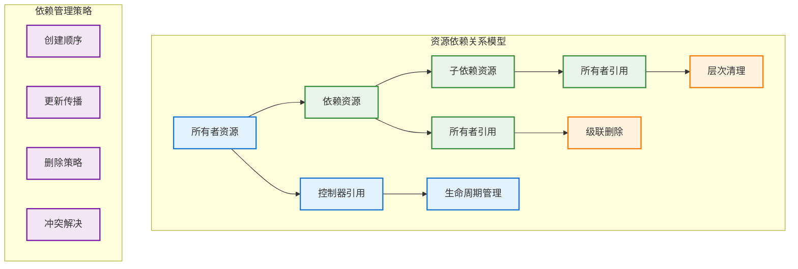

# 资源依赖管理

## 概述

Kubernetes 资源依赖管理机制负责维护集群中各种资源之间的依赖关系，确保资源的创建、更新和删除操作遵循正确的顺序。通过所有者引用（OwnerReference）、控制器引用（ControllerReference）和级联删除等机制，实现资源生命周期的自动化管理。

## 依赖关系架构



## 依赖关系类型

### 所有者依赖（Owner Dependencies）

```go
// 所有者依赖关系定义
type OwnerDependency struct {
    Owner      metav1.Object
    Dependent  metav1.Object
    Controller bool
    BlockOwnerDeletion bool
}

// 依赖关系管理器
type DependencyManager struct {
    client   client.Client
    scheme   *runtime.Scheme
    recorder record.EventRecorder
    logger   klog.Logger
}

func NewDependencyManager(client client.Client, scheme *runtime.Scheme, recorder record.EventRecorder) *DependencyManager {
    return &DependencyManager{
        client:   client,
        scheme:   scheme,
        recorder: recorder,
        logger:   klog.WithName("dependency-manager"),
    }
}

// 建立所有者依赖关系
func (dm *DependencyManager) SetOwnerDependency(
    ctx context.Context,
    owner metav1.Object,
    dependent metav1.Object,
    isController bool,
) error {
    
    // 获取所有者的 GVK
    ownerGVK, err := apiutil.GVKForObject(owner, dm.scheme)
    if err != nil {
        return fmt.Errorf("failed to get GVK for owner: %w", err)
    }
    
    // 创建所有者引用
    ownerRef := metav1.OwnerReference{
        APIVersion: ownerGVK.GroupVersion().String(),
        Kind:       ownerGVK.Kind,
        Name:       owner.GetName(),
        UID:        owner.GetUID(),
    }
    
    if isController {
        controller := true
        ownerRef.Controller = &controller
    }
    
    // 设置阻塞删除
    blockDeletion := true
    ownerRef.BlockOwnerDeletion = &blockDeletion
    
    // 检查是否已存在相同的所有者引用
    ownerRefs := dependent.GetOwnerReferences()
    for i, ref := range ownerRefs {
        if ref.UID == ownerRef.UID {
            ownerRefs[i] = ownerRef
            dependent.SetOwnerReferences(ownerRefs)
            return dm.client.Update(ctx, dependent.(client.Object))
        }
    }
    
    // 添加新的所有者引用
    ownerRefs = append(ownerRefs, ownerRef)
    dependent.SetOwnerReferences(ownerRefs)
    
    // 更新对象
    err = dm.client.Update(ctx, dependent.(client.Object))
    if err != nil {
        dm.logger.Error(err, "Failed to set owner dependency",
            "owner", klog.KObj(owner),
            "dependent", klog.KObj(dependent))
        return err
    }
    
    dm.logger.V(4).Info("Set owner dependency",
        "owner", klog.KObj(owner),
        "dependent", klog.KObj(dependent),
        "controller", isController)
    
    return nil
}

// 移除所有者依赖关系
func (dm *DependencyManager) RemoveOwnerDependency(
    ctx context.Context,
    owner metav1.Object,
    dependent metav1.Object,
) error {
    
    ownerRefs := dependent.GetOwnerReferences()
    var newOwnerRefs []metav1.OwnerReference
    
    for _, ref := range ownerRefs {
        if ref.UID != owner.GetUID() {
            newOwnerRefs = append(newOwnerRefs, ref)
        }
    }
    
    if len(newOwnerRefs) == len(ownerRefs) {
        return nil // 没有找到对应的所有者引用
    }
    
    dependent.SetOwnerReferences(newOwnerRefs)
    
    err := dm.client.Update(ctx, dependent.(client.Object))
    if err != nil {
        dm.logger.Error(err, "Failed to remove owner dependency",
            "owner", klog.KObj(owner),
            "dependent", klog.KObj(dependent))
        return err
    }
    
    dm.logger.V(4).Info("Removed owner dependency",
        "owner", klog.KObj(owner),
        "dependent", klog.KObj(dependent))
    
    return nil
}
```

### 控制器依赖（Controller Dependencies）

```go
// 控制器依赖管理
type ControllerDependency struct {
    Controller metav1.Object
    Managed    []metav1.Object
    Strategy   ControllerStrategy
}

type ControllerStrategy string

const (
    RecreateStrategy ControllerStrategy = "Recreate"
    UpdateStrategy   ControllerStrategy = "Update"
    RollingStrategy  ControllerStrategy = "Rolling"
)

// 控制器依赖管理器
type ControllerDependencyManager struct {
    *DependencyManager
    dependencies map[types.UID]*ControllerDependency
    mutex        sync.RWMutex
}

func NewControllerDependencyManager(dm *DependencyManager) *ControllerDependencyManager {
    return &ControllerDependencyManager{
        DependencyManager: dm,
        dependencies:     make(map[types.UID]*ControllerDependency),
    }
}

// 注册控制器依赖
func (cdm *ControllerDependencyManager) RegisterControllerDependency(
    controller metav1.Object,
    managed []metav1.Object,
    strategy ControllerStrategy,
) {
    
    cdm.mutex.Lock()
    defer cdm.mutex.Unlock()
    
    cdm.dependencies[controller.GetUID()] = &ControllerDependency{
        Controller: controller,
        Managed:    managed,
        Strategy:   strategy,
    }
    
    cdm.logger.V(4).Info("Registered controller dependency",
        "controller", klog.KObj(controller),
        "managedCount", len(managed),
        "strategy", strategy)
}

// 同步控制器依赖
func (cdm *ControllerDependencyManager) SyncControllerDependency(
    ctx context.Context,
    controllerUID types.UID,
) error {
    
    cdm.mutex.RLock()
    dependency := cdm.dependencies[controllerUID]
    cdm.mutex.RUnlock()
    
    if dependency == nil {
        return nil
    }
    
    switch dependency.Strategy {
    case RecreateStrategy:
        return cdm.syncRecreateStrategy(ctx, dependency)
    case UpdateStrategy:
        return cdm.syncUpdateStrategy(ctx, dependency)
    case RollingStrategy:
        return cdm.syncRollingStrategy(ctx, dependency)
    default:
        return fmt.Errorf("unknown controller strategy: %s", dependency.Strategy)
    }
}

func (cdm *ControllerDependencyManager) syncRecreateStrategy(
    ctx context.Context,
    dependency *ControllerDependency,
) error {
    
    // 删除所有受管理对象
    for _, managed := range dependency.Managed {
        if err := cdm.client.Delete(ctx, managed.(client.Object)); err != nil {
            if !errors.IsNotFound(err) {
                return err
            }
        }
    }
    
    // 等待删除完成
    for _, managed := range dependency.Managed {
        if err := cdm.waitForDeletion(ctx, managed.(client.Object)); err != nil {
            return err
        }
    }
    
    // 重新创建对象
    for _, managed := range dependency.Managed {
        if err := cdm.client.Create(ctx, managed.(client.Object)); err != nil {
            return err
        }
    }
    
    return nil
}

func (cdm *ControllerDependencyManager) waitForDeletion(
    ctx context.Context,
    obj client.Object,
) error {
    
    key := client.ObjectKeyFromObject(obj)
    
    return wait.PollImmediate(time.Second, 30*time.Second, func() (bool, error) {
        err := cdm.client.Get(ctx, key, obj)
        if errors.IsNotFound(err) {
            return true, nil
        }
        if err != nil {
            return false, err
        }
        return false, nil
    })
}
```

### 层次依赖（Hierarchical Dependencies）

```go
// 层次依赖结构
type HierarchicalDependency struct {
    Root     metav1.Object
    Children map[types.UID][]metav1.Object
    Levels   [][]metav1.Object
}

// 层次依赖管理器
type HierarchicalDependencyManager struct {
    *DependencyManager
    hierarchies map[types.UID]*HierarchicalDependency
    mutex       sync.RWMutex
}

func NewHierarchicalDependencyManager(dm *DependencyManager) *HierarchicalDependencyManager {
    return &HierarchicalDependencyManager{
        DependencyManager: dm,
        hierarchies:      make(map[types.UID]*HierarchicalDependency),
    }
}

// 构建依赖层次
func (hdm *HierarchicalDependencyManager) BuildHierarchy(
    ctx context.Context,
    root metav1.Object,
) (*HierarchicalDependency, error) {
    
    hierarchy := &HierarchicalDependency{
        Root:     root,
        Children: make(map[types.UID][]metav1.Object),
        Levels:   make([][]metav1.Object, 0),
    }
    
    // 获取直接子对象
    children, err := hdm.getDirectChildren(ctx, root)
    if err != nil {
        return nil, err
    }
    
    hierarchy.Children[root.GetUID()] = children
    if len(children) > 0 {
        hierarchy.Levels = append(hierarchy.Levels, children)
    }
    
    // 递归构建子层次
    for _, child := range children {
        if err := hdm.buildChildHierarchy(ctx, child, hierarchy, 1); err != nil {
            return nil, err
        }
    }
    
    hdm.mutex.Lock()
    hdm.hierarchies[root.GetUID()] = hierarchy
    hdm.mutex.Unlock()
    
    return hierarchy, nil
}

func (hdm *HierarchicalDependencyManager) buildChildHierarchy(
    ctx context.Context,
    parent metav1.Object,
    hierarchy *HierarchicalDependency,
    level int,
) error {
    
    children, err := hdm.getDirectChildren(ctx, parent)
    if err != nil {
        return err
    }
    
    if len(children) == 0 {
        return nil
    }
    
    hierarchy.Children[parent.GetUID()] = children
    
    // 扩展层级数组
    for len(hierarchy.Levels) <= level {
        hierarchy.Levels = append(hierarchy.Levels, make([]metav1.Object, 0))
    }
    
    hierarchy.Levels[level] = append(hierarchy.Levels[level], children...)
    
    // 递归处理子对象
    for _, child := range children {
        if err := hdm.buildChildHierarchy(ctx, child, hierarchy, level+1); err != nil {
            return err
        }
    }
    
    return nil
}

func (hdm *HierarchicalDependencyManager) getDirectChildren(
    ctx context.Context,
    owner metav1.Object,
) ([]metav1.Object, error) {
    
    // 这里需要根据具体的资源类型来查询子对象
    // 示例：查询 Deployment 的 ReplicaSets
    if owner.GetObjectKind().GroupVersionKind().Kind == "Deployment" {
        return hdm.getReplicaSetsForDeployment(ctx, owner)
    }
    
    // 可以扩展支持其他资源类型
    return nil, nil
}

func (hdm *HierarchicalDependencyManager) getReplicaSetsForDeployment(
    ctx context.Context,
    deployment metav1.Object,
) ([]metav1.Object, error) {
    
    var replicaSets appsv1.ReplicaSetList
    err := hdm.client.List(ctx, &replicaSets, 
        client.InNamespace(deployment.GetNamespace()),
        client.MatchingFields{"metadata.ownerReferences.uid": string(deployment.GetUID())},
    )
    
    if err != nil {
        return nil, err
    }
    
    var result []metav1.Object
    for i := range replicaSets.Items {
        result = append(result, &replicaSets.Items[i])
    }
    
    return result, nil
}
```

## 依赖解析算法

### 拓扑排序

```go
// 拓扑排序算法用于确定依赖顺序
type TopologicalSorter struct {
    graph map[types.UID][]types.UID  // 依赖图
    inDegree map[types.UID]int       // 入度
    objects map[types.UID]metav1.Object // 对象映射
}

func NewTopologicalSorter() *TopologicalSorter {
    return &TopologicalSorter{
        graph:   make(map[types.UID][]types.UID),
        inDegree: make(map[types.UID]int),
        objects: make(map[types.UID]metav1.Object),
    }
}

// 添加依赖关系
func (ts *TopologicalSorter) AddDependency(owner, dependent metav1.Object) {
    ownerUID := owner.GetUID()
    dependentUID := dependent.GetUID()
    
    ts.objects[ownerUID] = owner
    ts.objects[dependentUID] = dependent
    
    // 添加边：dependent -> owner (依赖关系)
    ts.graph[dependentUID] = append(ts.graph[dependentUID], ownerUID)
    ts.inDegree[ownerUID]++
    
    // 初始化入度
    if _, exists := ts.inDegree[dependentUID]; !exists {
        ts.inDegree[dependentUID] = 0
    }
}

// 执行拓扑排序
func (ts *TopologicalSorter) Sort() ([]metav1.Object, error) {
    var result []metav1.Object
    queue := make([]types.UID, 0)
    inDegree := make(map[types.UID]int)
    
    // 复制入度表
    for uid, degree := range ts.inDegree {
        inDegree[uid] = degree
        if degree == 0 {
            queue = append(queue, uid)
        }
    }
    
    // 处理队列
    for len(queue) > 0 {
        current := queue[0]
        queue = queue[1:]
        
        result = append(result, ts.objects[current])
        
        // 更新邻接节点的入度
        for _, neighbor := range ts.graph[current] {
            inDegree[neighbor]--
            if inDegree[neighbor] == 0 {
                queue = append(queue, neighbor)
            }
        }
    }
    
    // 检查是否有环
    if len(result) != len(ts.objects) {
        return nil, fmt.Errorf("circular dependency detected")
    }
    
    return result, nil
}

// 获取创建顺序（反向拓扑排序）
func (ts *TopologicalSorter) GetCreationOrder() ([]metav1.Object, error) {
    sorted, err := ts.Sort()
    if err != nil {
        return nil, err
    }
    
    // 反转结果以获取创建顺序
    for i, j := 0, len(sorted)-1; i < j; i, j = i+1, j-1 {
        sorted[i], sorted[j] = sorted[j], sorted[i]
    }
    
    return sorted, nil
}

// 获取删除顺序（正向拓扑排序）
func (ts *TopologicalSorter) GetDeletionOrder() ([]metav1.Object, error) {
    return ts.Sort()
}
```

### 循环依赖检测

```go
// 循环依赖检测器
type CyclicDependencyDetector struct {
    visited map[types.UID]bool
    recStack map[types.UID]bool
    graph   map[types.UID][]types.UID
    objects map[types.UID]metav1.Object
}

func NewCyclicDependencyDetector() *CyclicDependencyDetector {
    return &CyclicDependencyDetector{
        visited:  make(map[types.UID]bool),
        recStack: make(map[types.UID]bool),
        graph:    make(map[types.UID][]types.UID),
        objects:  make(map[types.UID]metav1.Object),
    }
}

// 添加依赖关系
func (cdd *CyclicDependencyDetector) AddDependency(owner, dependent metav1.Object) {
    ownerUID := owner.GetUID()
    dependentUID := dependent.GetUID()
    
    cdd.objects[ownerUID] = owner
    cdd.objects[dependentUID] = dependent
    
    cdd.graph[dependentUID] = append(cdd.graph[dependentUID], ownerUID)
}

// 检测循环依赖
func (cdd *CyclicDependencyDetector) DetectCycle() ([]metav1.Object, error) {
    for uid := range cdd.objects {
        if !cdd.visited[uid] {
            if cycle := cdd.dfsDetectCycle(uid); cycle != nil {
                return cycle, fmt.Errorf("circular dependency detected")
            }
        }
    }
    return nil, nil
}

func (cdd *CyclicDependencyDetector) dfsDetectCycle(uid types.UID) []metav1.Object {
    cdd.visited[uid] = true
    cdd.recStack[uid] = true
    
    for _, neighbor := range cdd.graph[uid] {
        if !cdd.visited[neighbor] {
            if cycle := cdd.dfsDetectCycle(neighbor); cycle != nil {
                return append([]metav1.Object{cdd.objects[uid]}, cycle...)
            }
        } else if cdd.recStack[neighbor] {
            // 找到循环
            return []metav1.Object{cdd.objects[uid], cdd.objects[neighbor]}
        }
    }
    
    cdd.recStack[uid] = false
    return nil
}
```

## 生命周期管理

### 创建顺序管理

```go
// 创建顺序管理器
type CreationOrderManager struct {
    client client.Client
    sorter *TopologicalSorter
    logger klog.Logger
}

func NewCreationOrderManager(client client.Client) *CreationOrderManager {
    return &CreationOrderManager{
        client: client,
        sorter: NewTopologicalSorter(),
        logger: klog.WithName("creation-order-manager"),
    }
}

// 按依赖顺序创建资源
func (com *CreationOrderManager) CreateResourcesInOrder(
    ctx context.Context,
    resources []client.Object,
) error {
    
    // 分析依赖关系
    if err := com.analyzeDependencies(resources); err != nil {
        return err
    }
    
    // 获取创建顺序
    orderedObjects, err := com.sorter.GetCreationOrder()
    if err != nil {
        return err
    }
    
    // 按顺序创建资源
    for _, obj := range orderedObjects {
        if err := com.createResource(ctx, obj.(client.Object)); err != nil {
            return err
        }
    }
    
    return nil
}

func (com *CreationOrderManager) analyzeDependencies(resources []client.Object) error {
    // 重置排序器
    com.sorter = NewTopologicalSorter()
    
    for _, resource := range resources {
        // 分析每个资源的依赖关系
        for _, ownerRef := range resource.GetOwnerReferences() {
            // 查找所有者对象
            for _, owner := range resources {
                if owner.GetUID() == ownerRef.UID {
                    com.sorter.AddDependency(owner, resource)
                    break
                }
            }
        }
    }
    
    return nil
}

func (com *CreationOrderManager) createResource(ctx context.Context, obj client.Object) error {
    com.logger.V(4).Info("Creating resource", "resource", klog.KObj(obj))
    
    err := com.client.Create(ctx, obj)
    if err != nil {
        if errors.IsAlreadyExists(err) {
            com.logger.V(4).Info("Resource already exists", "resource", klog.KObj(obj))
            return nil
        }
        return err
    }
    
    com.logger.Info("Successfully created resource", "resource", klog.KObj(obj))
    return nil
}
```

### 更新传播机制

```go
// 更新传播管理器
type UpdatePropagationManager struct {
    client client.Client
    logger klog.Logger
    propagationRules map[schema.GroupVersionKind]PropagationRule
}

type PropagationRule struct {
    Fields          []string
    PropagateFunc   func(owner, dependent metav1.Object) error
    ConflictHandler func(owner, dependent metav1.Object, conflict *FieldConflict) error
}

type FieldConflict struct {
    Field     string
    OwnerValue interface{}
    DependentValue interface{}
}

func NewUpdatePropagationManager(client client.Client) *UpdatePropagationManager {
    return &UpdatePropagationManager{
        client: client,
        logger: klog.WithName("update-propagation-manager"),
        propagationRules: make(map[schema.GroupVersionKind]PropagationRule),
    }
}

// 注册传播规则
func (upm *UpdatePropagationManager) RegisterPropagationRule(
    gvk schema.GroupVersionKind,
    rule PropagationRule,
) {
    upm.propagationRules[gvk] = rule
}

// 传播更新
func (upm *UpdatePropagationManager) PropagateUpdate(
    ctx context.Context,
    owner metav1.Object,
    dependents []metav1.Object,
) error {
    
    ownerGVK := owner.GetObjectKind().GroupVersionKind()
    rule, exists := upm.propagationRules[ownerGVK]
    if !exists {
        upm.logger.V(4).Info("No propagation rule found", "gvk", ownerGVK)
        return nil
    }
    
    for _, dependent := range dependents {
        if err := upm.propagateToDependent(ctx, owner, dependent, rule); err != nil {
            return err
        }
    }
    
    return nil
}

func (upm *UpdatePropagationManager) propagateToDependent(
    ctx context.Context,
    owner metav1.Object,
    dependent metav1.Object,
    rule PropagationRule,
) error {
    
    upm.logger.V(4).Info("Propagating update",
        "owner", klog.KObj(owner),
        "dependent", klog.KObj(dependent))
    
    // 检测字段冲突
    conflicts := upm.detectFieldConflicts(owner, dependent, rule.Fields)
    
    // 处理冲突
    for _, conflict := range conflicts {
        if rule.ConflictHandler != nil {
            if err := rule.ConflictHandler(owner, dependent, conflict); err != nil {
                return err
            }
        }
    }
    
    // 执行传播
    if rule.PropagateFunc != nil {
        if err := rule.PropagateFunc(owner, dependent); err != nil {
            return err
        }
    }
    
    // 更新依赖对象
    err := upm.client.Update(ctx, dependent.(client.Object))
    if err != nil {
        upm.logger.Error(err, "Failed to update dependent",
            "owner", klog.KObj(owner),
            "dependent", klog.KObj(dependent))
        return err
    }
    
    return nil
}

func (upm *UpdatePropagationManager) detectFieldConflicts(
    owner metav1.Object,
    dependent metav1.Object,
    fields []string,
) []*FieldConflict {
    
    var conflicts []*FieldConflict
    
    // 这里需要使用反射来比较字段
    // 简化实现，实际应该使用更复杂的字段比较逻辑
    
    return conflicts
}
```

## 删除策略实现

### 级联删除

```go
// 级联删除管理器
type CascadeDeleteManager struct {
    client client.Client
    logger klog.Logger
}

func NewCascadeDeleteManager(client client.Client) *CascadeDeleteManager {
    return &CascadeDeleteManager{
        client: client,
        logger: klog.WithName("cascade-delete-manager"),
    }
}

// 执行级联删除
func (cdm *CascadeDeleteManager) CascadeDelete(
    ctx context.Context,
    obj client.Object,
    policy metav1.DeletionPropagation,
) error {
    
    cdm.logger.Info("Starting cascade delete",
        "object", klog.KObj(obj),
        "policy", policy)
    
    deleteOptions := &client.DeleteOptions{}
    deleteOptions.PropagationPolicy = &policy
    
    err := cdm.client.Delete(ctx, obj, deleteOptions)
    if err != nil {
        if errors.IsNotFound(err) {
            return nil
        }
        return err
    }
    
    // 根据删除策略执行不同的后续操作
    switch policy {
    case metav1.DeletePropagationForeground:
        return cdm.waitForForegroundDeletion(ctx, obj)
    case metav1.DeletePropagationBackground:
        return cdm.trackBackgroundDeletion(ctx, obj)
    case metav1.DeletePropagationOrphan:
        return cdm.handleOrphanDeletion(ctx, obj)
    default:
        return nil
    }
}

func (cdm *CascadeDeleteManager) waitForForegroundDeletion(
    ctx context.Context,
    obj client.Object,
) error {
    
    key := client.ObjectKeyFromObject(obj)
    
    return wait.PollImmediate(time.Second, 300*time.Second, func() (bool, error) {
        err := cdm.client.Get(ctx, key, obj)
        if errors.IsNotFound(err) {
            return true, nil
        }
        if err != nil {
            return false, err
        }
        
        // 检查删除时间戳
        if !obj.GetDeletionTimestamp().IsZero() {
            cdm.logger.V(4).Info("Object still being deleted",
                "object", klog.KObj(obj),
                "deletionTimestamp", obj.GetDeletionTimestamp())
        }
        
        return false, nil
    })
}

func (cdm *CascadeDeleteManager) trackBackgroundDeletion(
    ctx context.Context,
    obj client.Object,
) error {
    
    // 后台删除不需要等待，但可以记录删除事件
    cdm.logger.Info("Object deletion started in background",
        "object", klog.KObj(obj))
    
    return nil
}

func (cdm *CascadeDeleteManager) handleOrphanDeletion(
    ctx context.Context,
    obj client.Object,
) error {
    
    // 孤儿删除会保留依赖对象
    cdm.logger.Info("Object deleted with orphan policy, dependents preserved",
        "object", klog.KObj(obj))
    
    return nil
}
```

### 条件删除

```go
// 条件删除管理器
type ConditionalDeleteManager struct {
    client client.Client
    logger klog.Logger
    conditions map[schema.GroupVersionKind]DeleteConditionFunc
}

type DeleteConditionFunc func(ctx context.Context, obj client.Object) (bool, string, error)

func NewConditionalDeleteManager(client client.Client) *ConditionalDeleteManager {
    return &ConditionalDeleteManager{
        client:     client,
        logger:     klog.WithName("conditional-delete-manager"),
        conditions: make(map[schema.GroupVersionKind]DeleteConditionFunc),
    }
}

// 注册删除条件
func (cdm *ConditionalDeleteManager) RegisterDeleteCondition(
    gvk schema.GroupVersionKind,
    conditionFunc DeleteConditionFunc,
) {
    cdm.conditions[gvk] = conditionFunc
}

// 条件删除
func (cdm *ConditionalDeleteManager) ConditionalDelete(
    ctx context.Context,
    obj client.Object,
) error {
    
    gvk := obj.GetObjectKind().GroupVersionKind()
    conditionFunc, exists := cdm.conditions[gvk]
    
    if exists {
        canDelete, reason, err := conditionFunc(ctx, obj)
        if err != nil {
            return err
        }
        
        if !canDelete {
            cdm.logger.Info("Delete condition not met",
                "object", klog.KObj(obj),
                "reason", reason)
            return fmt.Errorf("delete condition not met: %s", reason)
        }
    }
    
    return cdm.client.Delete(ctx, obj)
}

// 示例：Pod 删除条件
func PodDeleteCondition(ctx context.Context, obj client.Object) (bool, string, error) {
    pod, ok := obj.(*corev1.Pod)
    if !ok {
        return false, "object is not a Pod", nil
    }
    
    // 检查 Pod 是否正在运行关键任务
    if value, exists := pod.Annotations["critical-task"]; exists && value == "true" {
        return false, "Pod is running critical task", nil
    }
    
    // 检查 Pod 的优先级
    if pod.Spec.Priority != nil && *pod.Spec.Priority > 1000 {
        return false, "Pod has high priority", nil
    }
    
    return true, "Pod can be safely deleted", nil
}
```

## 监控和调试

### 依赖关系监控

```go
// 依赖关系监控器
type DependencyMonitor struct {
    client   client.Client
    logger   klog.Logger
    metrics  *DependencyMetrics
}

type DependencyMetrics struct {
    dependencyCount    prometheus.GaugeVec
    orphanCount        prometheus.GaugeVec
    cascadeDeleteCount prometheus.CounterVec
}

func NewDependencyMonitor(client client.Client) *DependencyMonitor {
    return &DependencyMonitor{
        client: client,
        logger: klog.WithName("dependency-monitor"),
        metrics: &DependencyMetrics{
            dependencyCount: *prometheus.NewGaugeVec(
                prometheus.GaugeOpts{
                    Name: "kubernetes_dependency_count",
                    Help: "Number of dependency relationships",
                },
                []string{"owner_kind", "dependent_kind"},
            ),
            orphanCount: *prometheus.NewGaugeVec(
                prometheus.GaugeOpts{
                    Name: "kubernetes_orphan_count",
                    Help: "Number of orphaned objects",
                },
                []string{"kind", "namespace"},
            ),
        },
    }
}

// 扫描依赖关系
func (dm *DependencyMonitor) ScanDependencies(ctx context.Context) error {
    // 获取所有对象
    var objects []client.Object
    
    // 这里需要实现获取所有对象的逻辑
    // 可以通过 discovery API 获取所有资源类型，然后逐一查询
    
    dependencyGraph := make(map[types.UID][]types.UID)
    objectMap := make(map[types.UID]client.Object)
    
    // 构建依赖图
    for _, obj := range objects {
        objectMap[obj.GetUID()] = obj
        
        for _, ownerRef := range obj.GetOwnerReferences() {
            dependencyGraph[ownerRef.UID] = append(dependencyGraph[ownerRef.UID], obj.GetUID())
        }
    }
    
    // 统计依赖关系
    for ownerUID, dependents := range dependencyGraph {
        owner, ownerExists := objectMap[ownerUID]
        
        for _, dependentUID := range dependents {
            dependent := objectMap[dependentUID]
            
            if ownerExists {
                dm.metrics.dependencyCount.WithLabelValues(
                    owner.GetObjectKind().GroupVersionKind().Kind,
                    dependent.GetObjectKind().GroupVersionKind().Kind,
                ).Inc()
            } else {
                // 孤儿对象
                dm.metrics.orphanCount.WithLabelValues(
                    dependent.GetObjectKind().GroupVersionKind().Kind,
                    dependent.GetNamespace(),
                ).Inc()
            }
        }
    }
    
    return nil
}
```

### 依赖分析工具

```go
// 依赖分析器
type DependencyAnalyzer struct {
    client client.Client
    logger klog.Logger
}

func NewDependencyAnalyzer(client client.Client) *DependencyAnalyzer {
    return &DependencyAnalyzer{
        client: client,
        logger: klog.WithName("dependency-analyzer"),
    }
}

// 分析对象依赖
func (da *DependencyAnalyzer) AnalyzeObjectDependencies(
    ctx context.Context,
    obj client.Object,
) (*DependencyAnalysis, error) {
    
    analysis := &DependencyAnalysis{
        Object:     obj,
        Owners:     make([]client.Object, 0),
        Dependents: make([]client.Object, 0),
        Depth:      0,
    }
    
    // 分析所有者
    for _, ownerRef := range obj.GetOwnerReferences() {
        owner, err := da.getObjectByReference(ctx, ownerRef, obj.GetNamespace())
        if err != nil {
            if !errors.IsNotFound(err) {
                return nil, err
            }
            // 记录孤儿对象
            da.logger.Info("Found orphaned object",
                "object", klog.KObj(obj),
                "missingOwner", ownerRef.Name)
            continue
        }
        analysis.Owners = append(analysis.Owners, owner)
    }
    
    // 分析依赖对象
    dependents, err := da.findDependents(ctx, obj)
    if err != nil {
        return nil, err
    }
    analysis.Dependents = dependents
    
    // 计算依赖深度
    analysis.Depth = da.calculateDependencyDepth(ctx, obj, make(map[types.UID]bool))
    
    return analysis, nil
}

type DependencyAnalysis struct {
    Object     client.Object
    Owners     []client.Object
    Dependents []client.Object
    Depth      int
}

func (da *DependencyAnalyzer) findDependents(
    ctx context.Context,
    owner client.Object,
) ([]client.Object, error) {
    
    var dependents []client.Object
    
    // 这里需要实现查找依赖对象的逻辑
    // 可以通过标签选择器或字段选择器来查询
    
    return dependents, nil
}

func (da *DependencyAnalyzer) calculateDependencyDepth(
    ctx context.Context,
    obj client.Object,
    visited map[types.UID]bool,
) int {
    
    if visited[obj.GetUID()] {
        return 0 // 避免循环依赖
    }
    
    visited[obj.GetUID()] = true
    maxDepth := 0
    
    dependents, err := da.findDependents(ctx, obj)
    if err != nil {
        return 0
    }
    
    for _, dependent := range dependents {
        depth := da.calculateDependencyDepth(ctx, dependent, visited)
        if depth > maxDepth {
            maxDepth = depth
        }
    }
    
    delete(visited, obj.GetUID())
    return maxDepth + 1
}
```

## 最佳实践

### 设计原则

1. **明确依赖关系**：
   - 正确设置 OwnerReference
   - 避免循环依赖
   - 使用控制器字段标识主控制器

2. **生命周期管理**：
   - 选择合适的删除策略
   - 实现优雅的资源清理
   - 处理依赖更新传播

3. **错误处理**：
   - 检测和处理循环依赖
   - 实现重试机制
   - 记录依赖关系变化

### 性能优化

1. **批量操作**：
   - 批量处理依赖更新
   - 减少 API 调用次数
   - 使用并发处理

2. **缓存策略**：
   - 缓存依赖关系图
   - 增量更新缓存
   - 设置合适的缓存TTL

### 故障排查

1. **常见问题诊断**：
   ```bash
   # 检查对象的所有者引用
   kubectl get <resource> <name> -o yaml | grep -A 10 ownerReferences
   
   # 查找孤儿对象
   kubectl get <resource> --all-namespaces -o custom-columns=NAME:.metadata.name,OWNERS:.metadata.ownerReferences
   
   # 检查依赖关系
   kubectl describe <resource> <name>
   ```

2. **依赖问题解决**：
   - 修复错误的所有者引用
   - 清理孤儿对象
   - 解决循环依赖
   - 重建依赖关系
