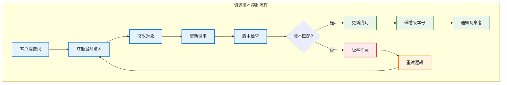

# 资源版本控制

## 概述

Kubernetes 使用乐观锁机制来处理并发访问和资源版本控制，确保在分布式环境中的数据一致性。资源版本控制是 Kubernetes 实现声明式 API 和最终一致性的核心机制。

## 资源版本机制

### 版本字段说明

```yaml
# Kubernetes 资源的版本相关字段
apiVersion: apps/v1
kind: Deployment
metadata:
  name: nginx-deployment
  namespace: default
  resourceVersion: "12345"     # 资源版本号
  generation: 2                # 期望状态的版本
  uid: "a1b2c3d4-e5f6-7890"   # 全局唯一标识符
  creationTimestamp: "2023-01-01T10:00:00Z"
spec:
  replicas: 3
status:
  observedGeneration: 1        # 已观察到的期望状态版本
  replicas: 2
  readyReplicas: 2
```

### 版本控制流程



## 乐观锁实现

### 基本乐观锁机制

```go
// 乐观锁更新实现
func UpdateResourceWithOptimisticLock(
    ctx context.Context,
    client dynamic.Interface,
    gvr schema.GroupVersionResource,
    namespace, name string,
    updateFunc func(*unstructured.Unstructured) error,
) error {
    return retry.RetryOnConflict(retry.DefaultRetry, func() error {
        // 1. 获取当前资源
        current, err := client.Resource(gvr).
            Namespace(namespace).
            Get(ctx, name, metav1.GetOptions{})
        if err != nil {
            return err
        }
        
        // 2. 记录原始版本
        originalResourceVersion := current.GetResourceVersion()
        
        // 3. 应用修改
        modified := current.DeepCopy()
        if err := updateFunc(modified); err != nil {
            return err
        }
        
        // 4. 确保版本号未被修改
        modified.SetResourceVersion(originalResourceVersion)
        
        // 5. 尝试更新
        _, err = client.Resource(gvr).
            Namespace(namespace).
            Update(ctx, modified, metav1.UpdateOptions{})
        
        return err
    })
}
```

### 版本冲突处理

```go
// 版本冲突检测和处理
type ConflictResolver struct {
    maxRetries    int
    backoffFactor float64
    maxBackoff    time.Duration
}

func (r *ConflictResolver) ResolveConflict(
    ctx context.Context,
    operation func() (*unstructured.Unstructured, error),
) (*unstructured.Unstructured, error) {
    
    backoff := time.Millisecond * 100
    
    for attempt := 0; attempt < r.maxRetries; attempt++ {
        result, err := operation()
        if err == nil {
            return result, nil
        }
        
        // 检查是否为版本冲突错误
        if !errors.IsConflict(err) {
            return nil, err
        }
        
        // 等待后重试
        select {
        case <-ctx.Done():
            return nil, ctx.Err()
        case <-time.After(backoff):
            // 指数退避
            backoff = time.Duration(float64(backoff) * r.backoffFactor)
            if backoff > r.maxBackoff {
                backoff = r.maxBackoff
            }
        }
    }
    
    return nil, fmt.Errorf("max retries exceeded for conflict resolution")
}
```

## 版本字段详解

### ResourceVersion

ResourceVersion 是 etcd 中对象的版本标识符，用于乐观锁控制。

```go
// ResourceVersion 的使用示例
type ResourceVersionManager struct {
    client kubernetes.Interface
}

func (r *ResourceVersionManager) ConditionalUpdate(
    ctx context.Context,
    pod *v1.Pod,
    expectedVersion string,
) (*v1.Pod, error) {
    
    // 设置期望的资源版本
    pod.SetResourceVersion(expectedVersion)
    
    // 尝试更新
    updatedPod, err := r.client.CoreV1().
        Pods(pod.Namespace).
        Update(ctx, pod, metav1.UpdateOptions{})
    
    if errors.IsConflict(err) {
        return nil, fmt.Errorf("version conflict: expected %s", expectedVersion)
    }
    
    return updatedPod, err
}

func (r *ResourceVersionManager) CompareAndSwap(
    ctx context.Context,
    namespace, name string,
    expectedVersion string,
    updateFunc func(*v1.Pod) error,
) (*v1.Pod, error) {
    
    // 获取当前 Pod
    currentPod, err := r.client.CoreV1().
        Pods(namespace).
        Get(ctx, name, metav1.GetOptions{})
    if err != nil {
        return nil, err
    }
    
    // 检查版本
    if currentPod.GetResourceVersion() != expectedVersion {
        return nil, fmt.Errorf("version mismatch: expected %s, got %s",
            expectedVersion, currentPod.GetResourceVersion())
    }
    
    // 应用更新
    if err := updateFunc(currentPod); err != nil {
        return nil, err
    }
    
    // 执行更新
    return r.client.CoreV1().
        Pods(namespace).
        Update(ctx, currentPod, metav1.UpdateOptions{})
}
```

### Generation

Generation 字段跟踪对象 spec 的变化，用于控制器协调循环。

```go
// Generation 字段的使用
type DeploymentController struct {
    client       kubernetes.Interface
    deploymentLister appslisters.DeploymentLister
}

func (d *DeploymentController) processDeployment(key string) error {
    namespace, name, _ := cache.SplitMetaNamespaceKey(key)
    
    deployment, err := d.deploymentLister.Deployments(namespace).Get(name)
    if err != nil {
        return err
    }
    
    // 检查是否需要协调
    if deployment.Generation <= deployment.Status.ObservedGeneration {
        // 没有新的期望状态变化，跳过协调
        return nil
    }
    
    // 执行协调逻辑
    if err := d.reconcileDeployment(deployment); err != nil {
        return err
    }
    
    // 更新状态中的 ObservedGeneration
    deployment.Status.ObservedGeneration = deployment.Generation
    _, err = d.client.AppsV1().
        Deployments(namespace).
        UpdateStatus(context.TODO(), deployment, metav1.UpdateOptions{})
    
    return err
}

func (d *DeploymentController) reconcileDeployment(deployment *appsv1.Deployment) error {
    // 实现部署协调逻辑
    // 例如：创建或更新 ReplicaSet
    return nil
}
```

### UID

UID 是对象的全局唯一标识符，在对象的整个生命周期中保持不变。

```go
// UID 的使用示例
func (c *Controller) handleOwnerReference(obj metav1.Object) error {
    ownerRefs := obj.GetOwnerReferences()
    
    for _, ownerRef := range ownerRefs {
        // 使用 UID 查找拥有者对象
        owner, err := c.findOwnerByUID(ownerRef.UID)
        if err != nil {
            if errors.IsNotFound(err) {
                // 拥有者已被删除，可能需要清理此对象
                return c.handleOrphanedObject(obj)
            }
            return err
        }
        
        // 验证拥有者关系
        if owner.GetUID() != ownerRef.UID {
            return fmt.Errorf("owner UID mismatch")
        }
        
        // 处理拥有者关系逻辑
        if err := c.processOwnerRelationship(obj, owner); err != nil {
            return err
        }
    }
    
    return nil
}
```

## 并发控制策略

### 读写分离

```go
// 读写分离的资源管理器
type ResourceManager struct {
    readClient  kubernetes.Interface
    writeClient kubernetes.Interface
    cache       cache.Cache
}

func (r *ResourceManager) Get(ctx context.Context, key string) (*v1.Pod, error) {
    // 从缓存或只读客户端读取
    if cached, exists, err := r.cache.GetByKey(key); err == nil && exists {
        return cached.(*v1.Pod), nil
    }
    
    namespace, name, _ := cache.SplitMetaNamespaceKey(key)
    return r.readClient.CoreV1().Pods(namespace).Get(ctx, name, metav1.GetOptions{})
}

func (r *ResourceManager) Update(ctx context.Context, pod *v1.Pod) (*v1.Pod, error) {
    // 总是使用写客户端进行更新
    return r.writeClient.CoreV1().
        Pods(pod.Namespace).
        Update(ctx, pod, metav1.UpdateOptions{})
}
```

### 批量操作版本控制

```go
// 批量更新的版本控制
type BatchUpdateManager struct {
    client kubernetes.Interface
}

type UpdateOperation struct {
    Object     *unstructured.Unstructured
    UpdateFunc func(*unstructured.Unstructured) error
}

func (b *BatchUpdateManager) BatchUpdate(
    ctx context.Context,
    operations []UpdateOperation,
) ([]Result, error) {
    
    results := make([]Result, len(operations))
    
    // 并发执行更新操作
    var wg sync.WaitGroup
    semaphore := make(chan struct{}, 10) // 限制并发数
    
    for i, op := range operations {
        wg.Add(1)
        go func(index int, operation UpdateOperation) {
            defer wg.Done()
            
            semaphore <- struct{}{}
            defer func() { <-semaphore }()
            
            results[index] = b.performSingleUpdate(ctx, operation)
        }(i, op)
    }
    
    wg.Wait()
    return results, nil
}

func (b *BatchUpdateManager) performSingleUpdate(
    ctx context.Context,
    op UpdateOperation,
) Result {
    
    return retry.RetryOnConflict(retry.DefaultRetry, func() error {
        // 获取最新版本
        gvr := op.Object.GroupVersionKind().GroupVersion().WithResource(
            strings.ToLower(op.Object.GetKind()) + "s")
        
        current, err := b.client.Resource(gvr).
            Namespace(op.Object.GetNamespace()).
            Get(ctx, op.Object.GetName(), metav1.GetOptions{})
        if err != nil {
            return err
        }
        
        // 应用更新
        if err := op.UpdateFunc(current); err != nil {
            return err
        }
        
        // 执行更新
        _, err = b.client.Resource(gvr).
            Namespace(current.GetNamespace()).
            Update(ctx, current, metav1.UpdateOptions{})
        
        return err
    })
}
```

## Watch 机制中的版本控制

### ResourceVersion 在 Watch 中的使用

```go
// Watch 机制中的版本控制
type VersionedWatcher struct {
    client    kubernetes.Interface
    lastSeen  string
    namespace string
}

func (v *VersionedWatcher) WatchFromVersion(ctx context.Context) error {
    watchOptions := metav1.ListOptions{
        Watch: true,
        ResourceVersion: v.lastSeen, // 从指定版本开始监听
    }
    
    watcher, err := v.client.CoreV1().
        Pods(v.namespace).
        Watch(ctx, watchOptions)
    if err != nil {
        return err
    }
    defer watcher.Stop()
    
    for event := range watcher.ResultChan() {
        if err := v.processEvent(event); err != nil {
            return err
        }
        
        // 更新最后见到的版本
        if obj, ok := event.Object.(metav1.Object); ok {
            v.lastSeen = obj.GetResourceVersion()
        }
    }
    
    return nil
}

func (v *VersionedWatcher) processEvent(event watch.Event) error {
    obj, ok := event.Object.(metav1.Object)
    if !ok {
        return fmt.Errorf("unexpected object type")
    }
    
    switch event.Type {
    case watch.Added:
        return v.handleAdd(obj)
    case watch.Modified:
        return v.handleUpdate(obj)
    case watch.Deleted:
        return v.handleDelete(obj)
    case watch.Bookmark:
        // 书签事件，仅更新资源版本
        v.lastSeen = obj.GetResourceVersion()
        return nil
    default:
        return fmt.Errorf("unknown event type: %v", event.Type)
    }
}
```

### List-Watch 一致性保证

```go
// List-Watch 模式的一致性实现
type ConsistentListWatcher struct {
    client     kubernetes.Interface
    namespace  string
    selector   labels.Selector
    fieldSelector fields.Selector
}

func (c *ConsistentListWatcher) ListAndWatch(ctx context.Context) (cache.ListerWatcher, error) {
    listFunc := func(options metav1.ListOptions) (runtime.Object, error) {
        options.LabelSelector = c.selector.String()
        options.FieldSelector = c.fieldSelector.String()
        
        return c.client.CoreV1().
            Pods(c.namespace).
            List(ctx, options)
    }
    
    watchFunc := func(options metav1.ListOptions) (watch.Interface, error) {
        options.LabelSelector = c.selector.String()
        options.FieldSelector = c.fieldSelector.String()
        options.Watch = true
        
        return c.client.CoreV1().
            Pods(c.namespace).
            Watch(ctx, options)
    }
    
    return &cache.ListWatch{
        ListFunc:  listFunc,
        WatchFunc: watchFunc,
    }, nil
}
```

## 版本控制最佳实践

### 错误处理和重试

```go
// 智能重试策略
type SmartRetryManager struct {
    maxRetries    int
    baseDelay     time.Duration
    maxDelay      time.Duration
    conflictJitter float64
}

func (s *SmartRetryManager) ExecuteWithRetry(
    ctx context.Context,
    operation func() error,
) error {
    
    var lastErr error
    delay := s.baseDelay
    
    for attempt := 0; attempt < s.maxRetries; attempt++ {
        lastErr = operation()
        if lastErr == nil {
            return nil
        }
        
        // 针对不同错误类型使用不同策略
        if errors.IsConflict(lastErr) {
            // 版本冲突：添加随机抖动避免惊群效应
            jitter := time.Duration(rand.Float64() * s.conflictJitter * float64(delay))
            delay = delay + jitter
        } else if errors.IsServerTimeout(lastErr) {
            // 服务器超时：使用指数退避
            delay = delay * 2
        } else if errors.IsServiceUnavailable(lastErr) {
            // 服务不可用：固定延迟重试
            delay = s.baseDelay
        } else {
            // 其他错误：立即返回
            return lastErr
        }
        
        if delay > s.maxDelay {
            delay = s.maxDelay
        }
        
        select {
        case <-ctx.Done():
            return ctx.Err()
        case <-time.After(delay):
            continue
        }
    }
    
    return fmt.Errorf("max retries exceeded, last error: %v", lastErr)
}
```

### 版本兼容性处理

```go
// API 版本兼容性管理
type VersionCompatibilityManager struct {
    scheme *runtime.Scheme
    codec  runtime.Codec
}

func (v *VersionCompatibilityManager) ConvertToVersion(
    obj runtime.Object,
    targetVersion schema.GroupVersion,
) (runtime.Object, error) {
    
    // 获取对象的当前版本
    gvk := obj.GetObjectKind().GroupVersionKind()
    
    // 如果已经是目标版本，直接返回
    if gvk.GroupVersion() == targetVersion {
        return obj, nil
    }
    
    // 转换为内部版本
    internal, err := v.scheme.ConvertToVersion(obj, runtime.InternalGroupVersioner)
    if err != nil {
        return nil, fmt.Errorf("failed to convert to internal version: %v", err)
    }
    
    // 转换为目标版本
    target, err := v.scheme.ConvertToVersion(internal, targetVersion.GroupVersioner)
    if err != nil {
        return nil, fmt.Errorf("failed to convert to target version %v: %v", targetVersion, err)
    }
    
    return target, nil
}

func (v *VersionCompatibilityManager) HandleVersionSkew(
    oldObj, newObj runtime.Object,
) (runtime.Object, error) {
    
    oldGVK := oldObj.GetObjectKind().GroupVersionKind()
    newGVK := newObj.GetObjectKind().GroupVersionKind()
    
    // 版本不匹配时进行转换
    if oldGVK.GroupVersion() != newGVK.GroupVersion() {
        converted, err := v.ConvertToVersion(newObj, oldGVK.GroupVersion())
        if err != nil {
            return nil, fmt.Errorf("version conversion failed: %v", err)
        }
        return converted, nil
    }
    
    return newObj, nil
}
```

### 状态更新模式

```go
// 分离的状态更新模式
type StatusUpdateManager struct {
    client kubernetes.Interface
}

func (s *StatusUpdateManager) UpdateResourceStatus(
    ctx context.Context,
    obj metav1.Object,
    updateStatusFunc func(obj metav1.Object) error,
) error {
    
    // 状态更新使用单独的子资源端点
    switch o := obj.(type) {
    case *appsv1.Deployment:
        return s.updateDeploymentStatus(ctx, o, updateStatusFunc)
    case *v1.Pod:
        return s.updatePodStatus(ctx, o, updateStatusFunc)
    default:
        return fmt.Errorf("unsupported object type for status update")
    }
}

func (s *StatusUpdateManager) updateDeploymentStatus(
    ctx context.Context,
    deployment *appsv1.Deployment,
    updateFunc func(metav1.Object) error,
) error {
    
    return retry.RetryOnConflict(retry.DefaultRetry, func() error {
        // 获取最新的 Deployment
        current, err := s.client.AppsV1().
            Deployments(deployment.Namespace).
            Get(ctx, deployment.Name, metav1.GetOptions{})
        if err != nil {
            return err
        }
        
        // 应用状态更新
        if err := updateFunc(current); err != nil {
            return err
        }
        
        // 更新状态子资源
        _, err = s.client.AppsV1().
            Deployments(deployment.Namespace).
            UpdateStatus(ctx, current, metav1.UpdateOptions{})
        
        return err
    })
}
```

## 性能优化

### 版本缓存

```go
// 版本信息缓存
type VersionCache struct {
    cache    map[string]*VersionInfo
    mutex    sync.RWMutex
    ttl      time.Duration
    maxSize  int
}

type VersionInfo struct {
    ResourceVersion string
    Generation      int64
    LastModified    time.Time
}

func (v *VersionCache) Get(key string) (*VersionInfo, bool) {
    v.mutex.RLock()
    defer v.mutex.RUnlock()
    
    info, exists := v.cache[key]
    if !exists {
        return nil, false
    }
    
    // 检查是否过期
    if time.Since(info.LastModified) > v.ttl {
        return nil, false
    }
    
    return info, true
}

func (v *VersionCache) Set(key string, info *VersionInfo) {
    v.mutex.Lock()
    defer v.mutex.Unlock()
    
    // 检查缓存大小限制
    if len(v.cache) >= v.maxSize {
        v.evictOldest()
    }
    
    info.LastModified = time.Now()
    v.cache[key] = info
}

func (v *VersionCache) evictOldest() {
    var oldestKey string
    var oldestTime time.Time
    
    for key, info := range v.cache {
        if oldestKey == "" || info.LastModified.Before(oldestTime) {
            oldestKey = key
            oldestTime = info.LastModified
        }
    }
    
    if oldestKey != "" {
        delete(v.cache, oldestKey)
    }
}
```

## 监控和调试

### 版本控制指标

```go
// 版本控制相关指标
var (
    versionConflicts = prometheus.NewCounterVec(
        prometheus.CounterOpts{
            Name: "kubernetes_version_conflicts_total",
            Help: "Total number of version conflicts",
        },
        []string{"resource", "namespace", "operation"},
    )
    
    retryAttempts = prometheus.NewHistogramVec(
        prometheus.HistogramOpts{
            Name: "kubernetes_retry_attempts",
            Help: "Number of retry attempts for operations",
            Buckets: prometheus.LinearBuckets(1, 1, 10),
        },
        []string{"resource", "operation", "result"},
    )
)

func recordVersionConflict(resource, namespace, operation string) {
    versionConflicts.WithLabelValues(resource, namespace, operation).Inc()
}

func recordRetryAttempts(resource, operation, result string, attempts int) {
    retryAttempts.WithLabelValues(resource, operation, result).Observe(float64(attempts))
}
```

### 版本诊断工具

```bash
# 检查资源版本信息
kubectl get pod nginx-pod -o jsonpath='{.metadata.resourceVersion}'

# 监控资源版本变化
kubectl get pod nginx-pod -w -o jsonpath='{.metadata.resourceVersion}{"\n"}'

# 比较不同版本的资源
kubectl get deployment nginx-deployment -o yaml --export > v1.yaml
# 修改后
kubectl get deployment nginx-deployment -o yaml --export > v2.yaml
diff v1.yaml v2.yaml
